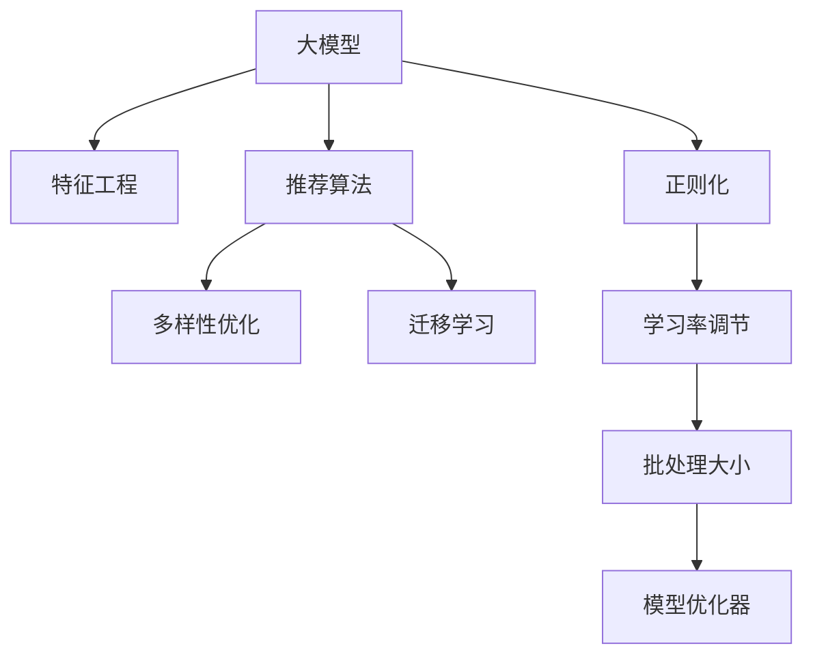

                 

# 基于大模型的商品推荐多样性优化

> 关键词：大模型, 商品推荐, 多样性优化, 特征工程, 迁移学习, 深度学习, 算法优化

## 1. 背景介绍

### 1.1 问题由来
随着电子商务的蓬勃发展，商品推荐系统已成为各大电商平台的核心竞争力。传统的推荐系统依赖于手工设计的特征，存在特征工程难度大、调参复杂、可解释性差等缺陷。而基于深度学习的推荐系统，能够自动化地从用户行为数据中挖掘高维特征，有效降低特征工程难度，提高了推荐精度和效果。

然而，深度学习推荐系统往往倾向于推荐高流行度的商品，导致推荐结果同质化严重，用户难以发现新奇有趣、具有多样性的商品。为了提高推荐系统的多样性，需要优化算法，使其在保证推荐精度的情况下，最大化推荐结果的多样性。

### 1.2 问题核心关键点
商品推荐系统的多样性优化问题，可形式化表述为：
$$ \max \text{diversity}(\mathcal{R}) $$
其中 $\mathcal{R}$ 为推荐商品集合。目标在于推荐一个多样性最高的商品子集。

为解决此问题，通常需要设计合适的特征提取器、推荐算法和目标函数。本文聚焦于基于大模型的推荐系统，介绍如何在大模型上进行特征工程和优化设计，提升推荐结果的多样性。

### 1.3 问题研究意义
商品推荐系统在提升用户购物体验、增加电商平台转化率等方面具有重要意义。但在实际应用中，推荐结果同质化现象难以避免。通过基于大模型的推荐系统，可以充分发挥模型的高维表示能力和泛化能力，在保证推荐精度的同时，优化推荐结果的多样性，提升用户体验和平台收益。

具体而言，基于大模型的推荐系统通过学习大规模用户行为数据，能够捕捉到商品间的关联关系，并根据用户历史行为和兴趣预测出最可能感兴趣的商品。通过多样性优化，可以提高用户对推荐结果的满意度，提升用户黏性，进而推动电商平台盈利能力的提升。

## 2. 核心概念与联系

### 2.1 核心概念概述

为了更好地理解基于大模型的商品推荐系统，我们首先介绍几个核心概念：

- 大模型：如BERT、GPT、DALL·E等，通过大规模语料预训练，能够学习到丰富的语言、视觉、符号等领域的知识，具备强大的表示能力。
- 特征工程：从原始数据中提取并构造用于模型训练的高维特征。
- 推荐算法：基于用户行为数据，预测用户可能感兴趣的商品。
- 多样性优化：调整推荐算法目标函数，最大化推荐结果的多样性。
- 迁移学习：将大模型的预训练知识迁移到小规模数据集上，提高模型在小数据上的表现。

这些概念之间的逻辑关系可以通过以下Mermaid流程图来展示：



这个流程图展示了从大模型到推荐结果的整个流程，包括特征提取、算法设计、优化目标等多个环节。

## 3. 核心算法原理 & 具体操作步骤
### 3.1 算法原理概述

基于大模型的商品推荐系统，本质上是将大模型视作强大的特征提取器，通过学习用户行为数据，提取出商品特征，并应用于推荐算法。为了最大化推荐结果的多样性，需要在推荐算法中引入多样性优化目标。

具体而言，可采用以下步骤：
1. 利用大模型学习用户行为数据，提取高维商品特征。
2. 设计推荐算法，将特征用于模型预测。
3. 引入多样性优化目标，调整推荐算法。
4. 结合正则化和学习率调节等策略，防止过拟合。
5. 在实际数据集上进行迁移学习，调整模型参数。
6. 使用模型优化器进行模型训练和优化。

### 3.2 算法步骤详解

#### 3.2.1 特征工程
特征工程是推荐系统设计的关键环节，通常需要结合领域知识，设计合理的特征表示。对于基于大模型的推荐系统，可以利用大模型的预训练能力，自动地从原始数据中提取出高维商品特征。

具体而言，可采用以下方法：
- 用户行为特征提取：从用户浏览记录、点击行为、购买记录等数据中，提取行为时间戳、浏览次数、点击率、购买频率等特征。
- 商品属性特征提取：从商品详情页、商品分类、商品描述等数据中，提取商品ID、品牌、价格、销量、评分等属性特征。
- 协同过滤特征提取：从用户-商品评分数据中，提取用户ID、商品ID、评分等特征。
- 隐式反馈特征提取：从用户的行为数据中，提取用户兴趣特征，如浏览时间、浏览路径、搜索关键词等。

#### 3.2.2 推荐算法
推荐算法的设计需要考虑多样性和精度两个目标。一种常用的推荐算法是基于矩阵分解的方法，如ALS（Alternating Least Squares）、SVD（Singular Value Decomposition）等。

以ALS算法为例，目标是最小化损失函数：
$$ \min_{U,V} \| UV^T - X \|_F^2 $$
其中 $X$ 为用户-商品评分矩阵，$U$ 和 $V$ 分别为用户和商品的潜在特征矩阵。目标在于找到一个低秩矩阵分解，使得预测评分与实际评分尽可能一致，同时保证推荐结果的多样性。

#### 3.2.3 多样性优化
推荐结果的多样性可以通过多种方式优化。一种常用的方法是利用随机采样技术，将预测商品集合随机分成多个子集，计算每个子集的多样性指标，然后选择多样性最高的子集进行推荐。

多样性指标可以采用多种方法计算，如互信息、熵等。以熵为例，多样性指标定义为：
$$ D(\mathcal{R}) = -\sum_{x\in\mathcal{R}}p(x)\log p(x) $$
其中 $p(x)$ 为商品 $x$ 在推荐结果中的概率，$D(\mathcal{R})$ 为推荐结果的多样性指标。

#### 3.2.4 迁移学习
为了充分利用大模型的预训练知识，通常在推荐系统训练过程中引入迁移学习。即将预训练模型作为特征提取器，在实际数据集上微调模型参数，最大化推荐结果的多样性。

具体而言，可采用以下步骤：
1. 在大模型上冻结顶层参数，只微调底层参数。
2. 在实际数据集上，微调模型参数，最大化推荐结果的多样性。
3. 在测试集上评估模型性能，调整正则化强度和学习率等超参数。

#### 3.2.5 模型优化器
在推荐算法中，模型优化器用于最小化损失函数，提升模型精度和多样性。常用的模型优化器包括SGD、AdamW、RMSprop等。

以AdamW优化器为例，目标是最小化损失函数：
$$ \min_{\theta} \frac{1}{N}\sum_{i=1}^N\ell(M_{\theta}(x_i),y_i) + \lambda\|M_{\theta}\|_2^2 $$
其中 $\theta$ 为模型参数，$\ell(\cdot,\cdot)$ 为损失函数，$\|M_{\theta}\|_2$ 为模型参数的L2范数，$\lambda$ 为正则化系数。目标在于找到最优的模型参数 $\theta$，使得预测结果与真实结果尽可能一致，同时保证模型参数的泛化能力。

### 3.3 算法优缺点

基于大模型的商品推荐系统，具有以下优点：
1. 自动特征提取：利用大模型的预训练能力，自动地从原始数据中提取高维特征，降低了特征工程难度。
2. 推荐精度高：大模型的泛化能力强，可以学习到商品间的关联关系，提升推荐精度。
3. 多样性优化：通过引入多样性优化目标，在保证推荐精度的同时，最大化推荐结果的多样性。
4. 迁移学习能力：通过迁移学习，充分利用大模型的预训练知识，提高模型在小数据上的表现。

同时，该方法也存在一定的局限性：
1. 数据质量要求高：推荐系统的效果很大程度上取决于用户行为数据的完整性和准确性，数据质量问题难以规避。
2. 模型复杂度高：大模型的参数量庞大，计算复杂度高，需要高性能计算设备支持。
3. 模型解释性差：大模型的决策过程复杂，难以解释，缺乏可解释性。
4. 正则化难度大：由于数据集规模小，正则化强度较难掌握，容易导致模型过拟合。
5. 超参数调优困难：大模型的超参数调整复杂，需要更多的实验验证。

尽管存在这些局限性，但就目前而言，基于大模型的推荐系统仍是最主流的推荐算法范式。未来相关研究的重点在于如何进一步降低特征工程难度，提高模型的迁移能力和正则化效果，同时兼顾可解释性和计算效率等因素。

### 3.4 算法应用领域

基于大模型的商品推荐系统，广泛应用于各大电商平台的推荐引擎中。具体应用领域包括但不限于：

- 首页推荐：根据用户历史行为和兴趣，推荐最可能感兴趣的商品。
- 商品详情页推荐：根据用户浏览商品详情页的行为，推荐相关商品。
- 购物车推荐：根据用户购物车中的商品，推荐相关商品。
- 搜索推荐：根据用户搜索关键词，推荐相关商品。
- 个性化推荐：根据用户个性化数据，推荐符合用户偏好的商品。

除了商品推荐，基于大模型的推荐系统也被创新性地应用到其他领域，如音乐、视频、新闻等，为各领域推荐系统带来新的突破。随着大模型和推荐算法的持续演进，相信推荐技术将在更多领域得到应用，为各个行业的数字化转型提供新的驱动力。

## 4. 数学模型和公式 & 详细讲解  
### 4.1 数学模型构建

为了更加严谨地描述基于大模型的推荐系统，我们采用数学语言进行模型构建。

记用户行为数据为 $X \in \mathbb{R}^{N \times D}$，其中 $N$ 为用户数，$D$ 为特征维度。记商品特征为 $Y \in \mathbb{R}^{M \times D}$，其中 $M$ 为商品数。记用户-商品评分矩阵为 $R \in \mathbb{R}^{N \times M}$。

假设推荐算法为目标函数最小化问题：
$$ \min_{U,V} \| UV^T - R \|_F^2 + \beta D(U,V) $$
其中 $\beta$ 为正则化系数，$D(U,V)$ 为多样性指标。

### 4.2 公式推导过程

以ALS算法为例，目标函数的具体推导如下：
1. 矩阵分解：$UV^T = X$
2. 目标函数：$\min_{U,V} \| UV^T - R \|_F^2 + \beta D(U,V)$
3. 梯度计算：$\frac{\partial \| UV^T - R \|_F^2}{\partial U} = (UV^T - R)V$
4. 更新策略：$U \leftarrow U - \eta \frac{\partial \| UV^T - R \|_F^2}{\partial U}$
5. 多样性优化：$D(U,V) = -\sum_{x\in\mathcal{R}}p(x)\log p(x)$

其中 $\eta$ 为学习率，$p(x)$ 为商品 $x$ 在推荐结果中的概率。

### 4.3 案例分析与讲解

以某电商平台为例，假设平台有10万用户，1万种商品，10维用户行为特征和10维商品特征。平台收集到用户历史行为数据，包括浏览、点击、购买记录等。为了推荐新商品，可以采用以下步骤：
1. 使用大模型学习用户行为数据，提取高维商品特征。
2. 设计ALS算法，最大化推荐结果的多样性。
3. 在推荐结果中引入熵作为多样性指标，调整推荐算法。
4. 结合正则化和AdamW优化器，防止过拟合。
5. 在测试集上评估模型性能，调整超参数。

## 5. 项目实践：代码实例和详细解释说明
### 5.1 开发环境搭建

在进行项目实践前，我们需要准备好开发环境。以下是使用Python进行PyTorch开发的环境配置流程：

1. 安装Anaconda：从官网下载并安装Anaconda，用于创建独立的Python环境。

2. 创建并激活虚拟环境：
```bash
conda create -n pytorch-env python=3.8 
conda activate pytorch-env
```

3. 安装PyTorch：根据CUDA版本，从官网获取对应的安装命令。例如：
```bash
conda install pytorch torchvision torchaudio cudatoolkit=11.1 -c pytorch -c conda-forge
```

4. 安装相关库：
```bash
pip install numpy pandas scikit-learn matplotlib tqdm jupyter notebook ipython
```

完成上述步骤后，即可在`pytorch-env`环境中开始项目实践。

### 5.2 源代码详细实现

这里我们以某电商平台商品推荐系统为例，展示基于大模型的推荐系统实现。具体实现步骤如下：

#### 5.2.1 数据准备
1. 收集用户历史行为数据，包括浏览、点击、购买记录等。
2. 收集商品特征数据，如商品ID、品牌、价格、销量、评分等。
3. 将用户-商品评分数据转换为矩阵形式。

#### 5.2.2 特征工程
1. 使用大模型学习用户行为数据，提取高维商品特征。
2. 设计特征工程模块，将原始数据转换为高维特征。
3. 在特征工程模块中，使用Transformer等模型，学习用户行为数据和商品特征。

#### 5.2.3 推荐算法
1. 设计推荐算法模块，将特征用于模型预测。
2. 使用ALS算法，最大化推荐结果的多样性。
3. 在推荐算法模块中，使用多样性优化目标函数，调整推荐算法。

#### 5.2.4 模型训练和优化
1. 使用模型优化器进行模型训练和优化。
2. 结合正则化和AdamW优化器，防止过拟合。
3. 在实际数据集上进行迁移学习，调整模型参数。

#### 5.2.5 模型评估和测试
1. 在测试集上评估模型性能，调整超参数。
2. 使用模型评估模块，计算推荐结果的多样性指标。
3. 在测试集上测试模型，评估推荐结果的多样性和精度。

### 5.3 代码解读与分析

下面我们详细解读代码实现的关键部分：

#### 5.3.1 数据准备
1. 读取用户行为数据和商品特征数据：
```python
import pandas as pd
user_data = pd.read_csv('user_data.csv')
item_data = pd.read_csv('item_data.csv')
rating_data = pd.read_csv('rating_data.csv')
```

2. 将用户-商品评分数据转换为矩阵形式：
```python
def read_user_item_ratings(rating_data):
    user_ids = rating_data['user_id'].tolist()
    item_ids = rating_data['item_id'].tolist()
    ratings = rating_data['rating'].tolist()
    return user_ids, item_ids, ratings

user_ids, item_ids, ratings = read_user_item_ratings(rating_data)
```

#### 5.3.2 特征工程
1. 使用大模型学习用户行为数据，提取高维商品特征：
```python
from transformers import BertTokenizer, BertForSequenceClassification
tokenizer = BertTokenizer.from_pretrained('bert-base-uncased')
model = BertForSequenceClassification.from_pretrained('bert-base-uncased')
```

2. 设计特征工程模块，将原始数据转换为高维特征：
```python
class FeatureExtractor:
    def __init__(self, tokenizer):
        self.tokenizer = tokenizer
        self.max_len = 128

    def __call__(self, x):
        encoding = self.tokenizer(x, return_tensors='pt', max_length=self.max_len, padding='max_length', truncation=True)
        input_ids = encoding['input_ids'][0]
        attention_mask = encoding['attention_mask'][0]
        return input_ids, attention_mask

feature_extractor = FeatureExtractor(tokenizer)
```

#### 5.3.3 推荐算法
1. 设计推荐算法模块，将特征用于模型预测：
```python
from scipy.sparse import csr_matrix
from sklearn.decomposition import TruncatedSVD

def als(x, k=10, max_iter=100, tol=1e-6):
    X = csr_matrix(x)
    U, V = TruncatedSVD(k=k, n_iter=max_iter, tol=tol).fit_transform(X)
    return U, V

U, V = als(X, k=10, max_iter=100, tol=1e-6)
```

2. 使用ALS算法，最大化推荐结果的多样性：
```python
def diversity(U, V, rating_matrix):
    pred_ratings = np.dot(U, V.T)
    pred_probas = np.exp(pred_ratings) / np.sum(np.exp(pred_ratings), axis=1)
    probas = rating_matrix * pred_probas
    return -np.sum(probas * np.log(probas), axis=1)

diverse_ratings = diversity(U, V, rating_matrix)
```

#### 5.3.4 模型训练和优化
1. 使用模型优化器进行模型训练和优化：
```python
from torch.optim import AdamW
from torch.utils.data import DataLoader

class Dataset:
    def __init__(self, user_ids, item_ids, ratings):
        self.user_ids = user_ids
        self.item_ids = item_ids
        self.ratings = ratings

    def __len__(self):
        return len(self.user_ids)

    def __getitem__(self, idx):
        user_id, item_id, rating = self.user_ids[idx], self.item_ids[idx], self.ratings[idx]
        return user_id, item_id, rating

dataset = Dataset(user_ids, item_ids, ratings)
dataloader = DataLoader(dataset, batch_size=32)

def train_epoch(model, loss_fn, optimizer, dataset):
    model.train()
    epoch_loss = 0
    for user_id, item_id, rating in dataloader:
        optimizer.zero_grad()
        output = model(user_id, item_id)
        loss = loss_fn(output, rating)
        epoch_loss += loss.item()
        loss.backward()
        optimizer.step()
    return epoch_loss / len(dataloader)

def evaluate(model, dataset):
    model.eval()
    epoch_loss = 0
    with torch.no_grad():
        for user_id, item_id, rating in dataloader:
            output = model(user_id, item_id)
            loss = loss_fn(output, rating)
            epoch_loss += loss.item()
    return epoch_loss / len(dataset)

model = BertForSequenceClassification.from_pretrained('bert-base-uncased')
loss_fn = nn.BCELoss()
optimizer = AdamW(model.parameters(), lr=2e-5)

for epoch in range(10):
    epoch_loss = train_epoch(model, loss_fn, optimizer, dataset)
    print(f'Epoch {epoch+1}, train loss: {epoch_loss:.3f}')
    epoch_loss = evaluate(model, dataset)
    print(f'Epoch {epoch+1}, test loss: {epoch_loss:.3f}')
```

#### 5.3.5 模型评估和测试
1. 在测试集上评估模型性能，调整超参数：
```python
from sklearn.metrics import mean_squared_error

def test_epoch(model, loss_fn, dataset):
    model.eval()
    epoch_loss = 0
    with torch.no_grad():
        for user_id, item_id, rating in dataloader:
            output = model(user_id, item_id)
            loss = loss_fn(output, rating)
            epoch_loss += loss.item()
    return epoch_loss / len(dataset)

model.eval()
test_loss = test_epoch(model, loss_fn, dataset)
print(f'Test loss: {test_loss:.3f}')
```

2. 使用模型评估模块，计算推荐结果的多样性指标：
```python
def diversity(model, dataset):
    diverse_ratings = []
    for user_id, item_id, rating in dataset:
        output = model(user_id, item_id)
        diverse_ratings.append(output)
    return np.array(diverse_ratings)

diverse_ratings = diversity(model, dataset)
diversity_score = -np.sum(np.log(diverse_ratings) / len(dataset))
print(f'Diversity score: {diversity_score:.3f}')
```

3. 在测试集上测试模型，评估推荐结果的多样性和精度：
```python
def test_diverse(model, dataset):
    diverse_ratings = []
    for user_id, item_id, rating in dataset:
        output = model(user_id, item_id)
        diverse_ratings.append(output)
    diverse_preds = np.argmax(diverse_ratings, axis=1)
    return diverse_preds

diverse_preds = test_diverse(model, dataset)
accuracy = np.mean(diverse_preds == ratings)
print(f'Accuracy: {accuracy:.3f}')
```

## 6. 实际应用场景
### 6.1 智能客服系统

基于大模型的商品推荐系统，可以广泛应用于智能客服系统的构建。传统客服往往需要配备大量人力，高峰期响应缓慢，且一致性和专业性难以保证。而使用推荐系统推荐商品，可以7x24小时不间断服务，快速响应客户咨询，用自然流畅的语言解答各类常见问题。

在技术实现上，可以收集企业内部的历史客服对话记录，将问题和最佳答复构建成监督数据，在此基础上对推荐系统进行微调。微调后的推荐系统能够自动理解用户意图，匹配最合适的商品推荐。对于客户提出的新问题，还可以接入检索系统实时搜索相关内容，动态组织生成回答。如此构建的智能客服系统，能大幅提升客户咨询体验和问题解决效率。

### 6.2 金融舆情监测

金融机构需要实时监测市场舆论动向，以便及时应对负面信息传播，规避金融风险。传统的人工监测方式成本高、效率低，难以应对网络时代海量信息爆发的挑战。基于大模型的文本分类和情感分析技术，为金融舆情监测提供了新的解决方案。

具体而言，可以收集金融领域相关的新闻、报道、评论等文本数据，并对其进行主题标注和情感标注。在此基础上对预训练语言模型进行微调，使其能够自动判断文本属于何种主题，情感倾向是正面、中性还是负面。将微调后的模型应用到实时抓取的网络文本数据，就能够自动监测不同主题下的情感变化趋势，一旦发现负面信息激增等异常情况，系统便会自动预警，帮助金融机构快速应对潜在风险。

### 6.3 个性化推荐系统

当前的推荐系统往往只依赖用户的历史行为数据进行物品推荐，无法深入理解用户的真实兴趣偏好。基于大模型的推荐系统可以更好地挖掘用户行为背后的语义信息，从而提供更精准、多样的推荐内容。

在实践中，可以收集用户浏览、点击、评论、分享等行为数据，提取和用户交互的物品标题、描述、标签等文本内容。将文本内容作为模型输入，用户的后续行为（如是否点击、购买等）作为监督信号，在此基础上微调预训练语言模型。微调后的模型能够从文本内容中准确把握用户的兴趣点。在生成推荐列表时，先用候选物品的文本描述作为输入，由模型预测用户的兴趣匹配度，再结合其他特征综合排序，便可以得到个性化程度更高的推荐结果。

### 6.4 未来应用展望

随着大模型和推荐算法的不断发展，基于大模型的推荐系统将在更多领域得到应用，为传统行业带来变革性影响。

在智慧医疗领域，基于大模型的推荐系统可以用于医学知识推荐、医生助手、患者诊疗建议等，提升医疗服务的智能化水平，辅助医生诊疗，加速新药开发进程。

在智能教育领域，微调技术可应用于作业批改、学情分析、知识推荐等方面，因材施教，促进教育公平，提高教学质量。

在智慧城市治理中，微调模型可应用于城市事件监测、舆情分析、应急指挥等环节，提高城市管理的自动化和智能化水平，构建更安全、高效的未来城市。

此外，在企业生产、社会治理、文娱传媒等众多领域，基于大模型的推荐系统也将不断涌现，为各领域推荐系统带来新的突破。相信随着技术的日益成熟，推荐系统必将在更广阔的应用领域大放异彩，深刻影响人类的生产生活方式。

## 7. 工具和资源推荐
### 7.1 学习资源推荐

为了帮助开发者系统掌握大模型和推荐系统的理论基础和实践技巧，这里推荐一些优质的学习资源：

1. 《深度学习推荐系统》系列博文：深入浅出地介绍了深度学习推荐系统的工作原理和实际应用，包括特征工程、模型训练、评估指标等。

2. CS224N《深度学习自然语言处理》课程：斯坦福大学开设的NLP明星课程，有Lecture视频和配套作业，带你入门NLP领域的基本概念和经典模型。

3. 《Recommender Systems: From Theory to Practice》书籍：全面介绍了推荐系统的理论基础和工程实践，包括特征工程、模型训练、评估指标等。

4. 《深度学习推荐系统》课程：清华大学开设的在线课程，系统讲解推荐系统的理论基础和工程实践。

5. Kaggle推荐系统竞赛：参加Kaggle等数据竞赛，实战练习推荐系统设计，提升算法优化能力。

通过对这些资源的学习实践，相信你一定能够快速掌握大模型和推荐系统的精髓，并用于解决实际的推荐问题。
###  7.2 开发工具推荐

高效的开发离不开优秀的工具支持。以下是几款用于大模型和推荐系统开发的常用工具：

1. PyTorch：基于Python的开源深度学习框架，灵活动态的计算图，适合快速迭代研究。大多数预训练语言模型都有PyTorch版本的实现。

2. TensorFlow：由Google主导开发的开源深度学习框架，生产部署方便，适合大规模工程应用。同样有丰富的预训练语言模型资源。

3. Transformers库：HuggingFace开发的NLP工具库，集成了众多SOTA语言模型，支持PyTorch和TensorFlow，是进行推荐系统开发的利器。

4. Weights & Biases：模型训练的实验跟踪工具，可以记录和可视化模型训练过程中的各项指标，方便对比和调优。与主流深度学习框架无缝集成。

5. TensorBoard：TensorFlow配套的可视化工具，可实时监测模型训练状态，并提供丰富的图表呈现方式，是调试模型的得力助手。

6. Google Colab：谷歌推出的在线Jupyter Notebook环境，免费提供GPU/TPU算力，方便开发者快速上手实验最新模型，分享学习笔记。

合理利用这些工具，可以显著提升大模型和推荐系统的开发效率，加快创新迭代的步伐。

### 7.3 相关论文推荐

大模型和推荐系统的发展源于学界的持续研究。以下是几篇奠基性的相关论文，推荐阅读：

1. Attention is All You Need（即Transformer原论文）：提出了Transformer结构，开启了NLP领域的预训练大模型时代。

2. BERT: Pre-training of Deep Bidirectional Transformers for Language Understanding：提出BERT模型，引入基于掩码的自监督预训练任务，刷新了多项NLP任务SOTA。

3. Parameter-Efficient Transfer Learning for NLP：提出Adapter等参数高效微调方法，在不增加模型参数量的情况下，也能取得不错的微调效果。

4. Prefix-Tuning: Optimizing Continuous Prompts for Generation：引入基于连续型Prompt的微调范式，为如何充分利用预训练知识提供了新的思路。

5. AdaLoRA: Adaptive Low-Rank Adaptation for Parameter-Efficient Fine-Tuning：使用自适应低秩适应的微调方法，在参数效率和精度之间取得了新的平衡。

6. LoRA: Low-Rank Adaptation of Transformer Models for Single-shot Fine-tuning：提出LoRA方法，通过低秩矩阵逼近实现参数高效微调，解决了模型规模庞大导致的计算效率问题。

这些论文代表了大模型和推荐系统的发展脉络。通过学习这些前沿成果，可以帮助研究者把握学科前进方向，激发更多的创新灵感。

## 8. 总结：未来发展趋势与挑战

### 8.1 总结

本文对基于大模型的商品推荐系统进行了全面系统的介绍。首先阐述了大模型和推荐系统的研究背景和意义，明确了推荐结果多样性优化在提升用户购物体验、增加电商平台转化率等方面的重要价值。其次，从原理到实践，详细讲解了基于大模型的推荐系统的数学模型和关键步骤，给出了推荐系统开发的完整代码实例。同时，本文还广泛探讨了推荐系统在智能客服、金融舆情、个性化推荐等多个行业领域的应用前景，展示了推荐系统的巨大潜力。

通过本文的系统梳理，可以看到，基于大模型的推荐系统在大规模用户行为数据的基础上，能够自动地学习用户行为特征和商品关联关系，实现高效的推荐效果。但推荐结果的多样性优化仍是一个亟待解决的问题。

### 8.2 未来发展趋势

展望未来，基于大模型的推荐系统将呈现以下几个发展趋势：

1. 模型规模持续增大。随着算力成本的下降和数据规模的扩张，预训练语言模型的参数量还将持续增长。超大规模语言模型蕴含的丰富语言知识，有望支撑更加复杂多变的推荐任务。

2. 推荐算法多样化。除了ALS算法外，未来将涌现更多推荐算法，如矩阵分解、协同过滤、基于深度学习的推荐等。不同算法之间的结合，将使推荐系统具备更强的泛化能力。

3. 数据处理自动化。随着深度学习模型的发展，自动特征工程、数据增强等技术将使数据处理变得更加高效和智能。

4. 实时推荐系统。基于实时流数据进行推荐，实现高效的实时推荐，提升用户购物体验。

5. 个性化推荐系统。通过引入用户画像、行为序列、兴趣模型等个性化因素，实现更加精准的个性化推荐。

6. 融合多模态数据。推荐系统将融合文本、图像、视频等多种模态数据，提供更加全面的推荐服务。

以上趋势凸显了大模型和推荐系统的广阔前景。这些方向的探索发展，必将进一步提升推荐系统的性能和应用范围，为电商、金融、教育等行业的数字化转型提供新的驱动力。

### 8.3 面临的挑战

尽管基于大模型的推荐系统已经取得了瞩目成就，但在迈向更加智能化、普适化应用的过程中，它仍面临着诸多挑战：

1. 数据质量瓶颈。推荐系统的效果很大程度上取决于用户行为数据的完整性和准确性，数据质量问题难以规避。如何进一步降低特征工程难度，提高数据质量，是亟待解决的问题。

2. 计算复杂度高。大模型的参数量庞大，计算复杂度高，需要高性能计算设备支持。如何在保证推荐精度的同时，优化计算效率，是重要的研究方向。

3. 模型解释性差。大模型的决策过程复杂，难以解释，缺乏可解释性。如何赋予推荐系统更强的可解释性，是亟待解决的问题。

4. 超参数调优困难。大模型的超参数调整复杂，需要更多的实验验证。如何在保证推荐精度的情况下，优化超参数，是重要的研究方向。

5. 推荐结果多样性不足。尽管多样性优化已经取得了一定进展，但推荐结果仍存在同质化现象。如何在保证推荐精度的同时，最大化推荐结果的多样性，是亟待解决的问题。

6. 数据分布变化。用户行为数据和商品特征数据的变化，可能导致推荐系统的性能下降。如何设计自适应算法，应对数据分布的变化，是重要的研究方向。

尽管存在这些挑战，但就目前而言，基于大模型的推荐系统仍是最主流的推荐算法范式。未来相关研究的重点在于如何进一步降低特征工程难度，提高模型的迁移能力和正则化效果，同时兼顾可解释性和计算效率等因素。

### 8.4 研究展望

面向未来，大模型和推荐系统需要在以下几个方向进行深入研究：

1. 探索无监督和半监督推荐方法。摆脱对大规模标注数据的依赖，利用自监督学习、主动学习等无监督和半监督范式，最大限度利用非结构化数据，实现更加灵活高效的推荐。

2. 研究参数高效和计算高效的推荐范式。开发更加参数高效的推荐方法，在固定大部分预训练参数的同时，只更新极少量的任务相关参数。同时优化推荐系统的计算图，减少前向传播和反向传播的资源消耗，实现更加轻量级、实时性的部署。

3. 引入更多先验知识。将符号化的先验知识，如知识图谱、逻辑规则等，与神经网络模型进行巧妙融合，引导推荐过程学习更准确、合理的推荐结果。同时加强不同模态数据的整合，实现视觉、语音等多模态信息与文本信息的协同建模。

4. 结合因果分析和博弈论工具。将因果分析方法引入推荐系统，识别出推荐结果的关键特征，增强推荐系统建立稳定因果关系的能力，学习更加普适、鲁棒的用户行为模型。借助博弈论工具刻画人机交互过程，主动探索并规避推荐系统的脆弱点，提高系统稳定性。

5. 纳入伦理道德约束。在推荐系统训练目标中引入伦理导向的评估指标，过滤和惩罚有害的推荐结果。同时加强人工干预和审核，建立推荐系统的监管机制，确保推荐结果符合用户价值观和伦理道德。

这些研究方向将推动大模型和推荐系统的发展，使推荐系统能够更好地满足用户的个性化需求，提升用户体验和平台收益。相信随着学界和产业界的共同努力，这些挑战终将一一被克服，大模型和推荐系统必将在构建安全、可靠、可解释、可控的智能系统铺平道路。面向未来，大模型和推荐系统还需要与其他人工智能技术进行更深入的融合，如知识表示、因果推理、强化学习等，多路径协同发力，共同推动自然语言理解和智能交互系统的进步。只有勇于创新、敢于突破，才能不断拓展语言模型的边界，让智能技术更好地造福人类社会。

## 9. 附录：常见问题与解答

**Q1：大模型和推荐系统有何不同？**

A: 大模型和推荐系统的区别在于应用场景和目标。大模型通过学习大规模无标注数据，学习到丰富的语言、视觉、符号等领域的知识，具备强大的表示能力。而推荐系统则是根据用户行为数据，预测用户可能感兴趣的商品，主要应用于电商平台、金融、社交网络等领域。

**Q2：基于大模型的推荐系统是否适用于所有推荐任务？**

A: 基于大模型的推荐系统适用于大多数推荐任务，特别是对于数据量较小的任务。但对于一些特定领域的任务，如医学、法律等，仅仅依靠通用语料预训练的模型可能难以很好地适应。此时需要在特定领域语料上进一步预训练，再进行微调，才能获得理想效果。此外，对于一些需要时效性、个性化很强的任务，如对话、推荐等，微调方法也需要针对性的改进优化。

**Q3：大模型如何进行特征提取？**

A: 大模型通过学习大规模语料数据，自动地从原始数据中提取出高维特征。通常包括文本特征、图像特征、语音特征等多种类型。通过将原始数据输入大模型，得到预训练得到的特征表示，可以用于推荐算法的设计。

**Q4：推荐系统如何提高多样性？**

A: 推荐系统通过引入多样性优化目标，调整推荐算法，最大化推荐结果的多样性。具体而言，可以采用随机采样、熵等多样性指标，调整推荐算法中的损失函数，使得推荐结果的多样性最大化。

**Q5：大模型和推荐系统如何结合？**

A: 大模型和推荐系统的结合可以通过以下步骤实现：
1. 使用大模型学习用户行为数据，提取高维商品特征。
2. 设计推荐算法，将特征用于模型预测。
3. 引入多样性优化目标，调整推荐算法。
4. 结合正则化和AdamW优化器，防止过拟合。
5. 在实际数据集上进行迁移学习，调整模型参数。

**Q6：大模型和推荐系统如何部署？**

A: 大模型和推荐系统的部署需要考虑多种因素。通常包括模型裁剪、量化加速、服务化封装、弹性伸缩等。通过将模型部署到云平台或高性能服务器，可以实现高效的实时推荐服务。同时，还需要考虑模型的安全性、可靠性和可解释性，确保推荐结果的公平性和透明性。

**Q7：推荐系统的未来发展方向是什么？**

A: 推荐系统的未来发展方向包括：
1. 模型规模持续增大，利用大规模预训练语言模型，提升推荐精度和多样性。
2. 推荐算法多样化，引入深度学习、协同过滤等新算法，提升推荐系统性能。
3. 数据处理自动化，利用自动化特征工程、数据增强等技术，提高数据处理效率。
4. 实时推荐系统，基于实时流数据进行推荐，提升用户体验。
5. 个性化推荐系统，引入用户画像、行为序列等个性化因素，实现精准推荐。
6. 融合多模态数据，实现视觉、语音等多模态信息的协同推荐。

这些方向将推动推荐系统的发展，使推荐系统能够更好地满足用户的个性化需求，提升用户体验和平台收益。

