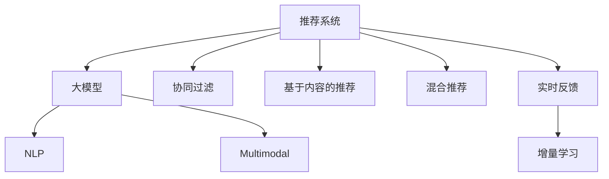

                 

# 基于大模型的推荐系统实时反馈机制

> 关键词：推荐系统, 大模型, 实时反馈, 增量学习, 协同过滤, 混合模型

## 1. 背景介绍

### 1.1 问题由来
随着互联网的快速发展，推荐系统成为了电子商务、社交网络、视频平台等在线服务中不可或缺的组成部分。推荐系统通过分析用户的历史行为和偏好，为用户推荐个性化的内容，提高用户满意度和留存率。传统推荐系统主要依赖协同过滤和基于内容的推荐算法，在推荐效果和扩展性上已趋于稳定。

然而，当前的推荐系统存在一些显著问题：

- 用户画像不足：协同过滤算法无法直接使用用户对物品的评分数据，需要结合其他用户和物品属性来构建用户画像，这在冷启动用户和物品推荐上表现不佳。
- 数据稀疏性：用户与物品的交互数据往往非常稀疏，协同过滤算法的准确率受到限制。
- 多模态数据利用不足：用户不仅通过评分来表达对物品的兴趣，还会通过评论、分享、浏览行为等行为数据来表达。传统推荐系统对这些行为数据的利用不足，无法充分挖掘用户兴趣。

大语言模型和大规模预训练模型为推荐系统带来了新的突破。这些模型具备强大的自然语言理解和生成能力，可以处理文本、图片等多模态数据，为推荐系统提供了新的数据表示和算法范式。基于大模型的推荐系统可以实现实时反馈，快速更新推荐策略，显著提升推荐效果和用户体验。

## 2. 核心概念与联系

### 2.1 核心概念概述

为更好地理解基于大模型的推荐系统实时反馈机制，本节将介绍几个密切相关的核心概念：

- 推荐系统(Recommendation System)：通过分析用户行为数据，为用户推荐个性化内容的系统。推荐系统包括协同过滤、基于内容的推荐、混合推荐等主要算法类型。

- 大模型(Large Model)：以自回归(如GPT)或自编码(如BERT)模型为代表的大规模预训练模型。通过在大规模无标签文本语料上进行预训练，学习通用的语言表示，具备强大的语言理解和生成能力。

- 实时反馈(Real-time Feedback)：推荐系统在用户对推荐结果进行互动后，能够实时获取反馈信息，并根据反馈信息快速调整推荐策略，以优化用户体验。

- 增量学习(Incremental Learning)：基于新数据持续更新模型参数，以保持模型对最新数据分布的适应性，提升推荐效果。

- 协同过滤(Collaborative Filtering)：利用用户之间的相似性来推荐物品，基于用户的历史行为或物品的流行度来生成推荐。

- 混合推荐(Mixed Recommendation)：结合协同过滤和基于内容的推荐方法，取长补短，提高推荐效果。

- 自然语言处理(Natural Language Processing, NLP)：通过自然语言理解和生成技术，处理文本数据，提取用户意图和物品属性。

- 多模态数据(Multimodal Data)：包括文本、图片、音频等多类型数据，推荐系统需要结合多种数据源来充分理解用户需求。

这些核心概念之间的逻辑关系可以通过以下Mermaid流程图来展示：

这个流程图展示了大模型和推荐系统的核心概念及其之间的关系：

1. 推荐系统通过大模型和大规模预训练模型进行数据处理和特征提取。
2. 协同过滤、基于内容的推荐和混合推荐等算法，将大模型的表示进行转化和应用。
3. 实时反馈机制使得推荐系统能够根据用户互动数据不断调整推荐策略。
4. 增量学习机制保证了推荐系统对最新数据分布的适应性。

这些概念共同构成了基于大模型的推荐系统实时反馈机制的框架，为其提供了强大的数据处理能力和动态调整策略。

## 3. 核心算法原理 & 具体操作步骤
### 3.1 算法原理概述

基于大模型的推荐系统实时反馈机制，本质上是一个增量学习和在线学习的框架。其核心思想是：在推荐系统中引入大模型进行特征提取和语义理解，通过用户互动数据不断更新模型参数，保持推荐策略的动态性和适应性。

形式化地，假设推荐系统当前有 $K$ 个用户和 $N$ 个物品，用户对物品的评分矩阵为 $R \in \{0,1\}^{K \times N}$。设 $U$ 和 $I$ 分别为用户和物品的嵌入向量，表示为 $U \in \mathbb{R}^{K \times d}, I \in \mathbb{R}^{N \times d}$。推荐模型通过计算 $U$ 和 $I$ 的相似度，输出推荐结果。设推荐模型的参数为 $\theta$，推荐函数为 $f(U, I; \theta)$，则推荐系统可以根据评分矩阵 $R$ 来优化模型参数：

$$
\theta^* = \mathop{\arg\min}_{\theta} \mathcal{L}(R, f(U, I; \theta))
$$

其中 $\mathcal{L}$ 为损失函数，通常为均方误差损失。通过梯度下降等优化算法，实时反馈机制不断更新模型参数 $\theta$，以适应新的评分数据。

### 3.2 算法步骤详解

基于大模型的推荐系统实时反馈机制一般包括以下几个关键步骤：

**Step 1: 准备数据集和模型**
- 收集用户与物品的评分数据，构建评分矩阵 $R$。
- 将大语言模型作为初始化参数，如使用BERT、GPT等模型。
- 准备用户和物品的嵌入向量 $U$ 和 $I$，可以基于用户的文本描述、行为数据等生成。

**Step 2: 定义推荐函数**
- 根据推荐任务，设计合适的推荐函数 $f(U, I; \theta)$。
- 对于二分类任务，如推荐与否，通常使用二分类交叉熵损失。
- 对于回归任务，如评分预测，使用均方误差损失。

**Step 3: 设置优化器**
- 选择合适的优化算法及其参数，如 Adam、SGD 等，设置学习率、批大小、迭代轮数等。
- 设置正则化技术及强度，包括权重衰减、Dropout、Early Stopping 等。

**Step 4: 执行增量训练**
- 将新的评分数据以批为单位输入模型，前向传播计算损失函数。
- 反向传播计算参数梯度，根据设定的优化算法和学习率更新模型参数。
- 周期性在验证集上评估模型性能，根据性能指标决定是否触发 Early Stopping。
- 重复上述步骤直至满足预设的迭代轮数或 Early Stopping 条件。

**Step 5: 部署和测试**
- 使用微调后的模型对新样本进行推理预测，集成到实际的应用系统中。
- 持续收集新的评分数据，定期重新增量训练模型，以适应数据分布的变化。

以上是基于大模型的推荐系统实时反馈机制的一般流程。在实际应用中，还需要针对具体任务的特点，对推荐函数和增量训练过程的各个环节进行优化设计，如改进损失函数，引入更多的正则化技术，搜索最优的超参数组合等，以进一步提升推荐效果。

### 3.3 算法优缺点

基于大模型的推荐系统实时反馈机制具有以下优点：
1. 动态适应性。实时获取用户反馈，能够快速调整推荐策略，提升推荐效果。
2. 泛化能力。大模型具备强大的通用性，可以处理多种类型的数据，提高推荐的准确性和覆盖面。
3. 灵活扩展。结合多模态数据和多种推荐算法，可以构建更加全面和灵活的推荐系统。
4. 易于部署。通过微调，将大模型嵌入到推荐系统中，无需从头开发复杂的推荐算法。
5. 自适应学习。通过增量学习，模型能够持续从新数据中学习，保持对最新数据分布的适应性。

同时，该方法也存在一定的局限性：
1. 依赖高质量数据。反馈数据的噪声可能会对模型产生不良影响，需要保证反馈数据的准确性。
2. 数据隐私问题。收集和存储用户互动数据需要遵守相关法律法规，保证用户隐私安全。
3. 计算资源消耗高。大模型和大规模预训练模型的计算资源消耗较大，需要高性能硬件支持。
4. 模型复杂度高。大模型的参数量巨大，增加了模型的训练和推理复杂度。
5. 难以解释。大模型的黑盒特性使得推荐过程缺乏可解释性，难以对其推理逻辑进行分析和调试。

尽管存在这些局限性，但就目前而言，基于大模型的推荐系统实时反馈机制仍是最主流和有效的推荐范式。未来相关研究的重点在于如何进一步降低实时反馈机制对计算资源的消耗，提高反馈数据的利用效率，同时兼顾可解释性和伦理安全性等因素。

### 3.4 算法应用领域

基于大模型的推荐系统实时反馈机制已经在电子商务、社交网络、视频平台等多个领域得到了广泛应用，成为推荐系统的重要工具：

- 电商推荐：如淘宝、京东等电商平台，通过用户评分和行为数据，实时调整商品推荐策略，提升销售转化率。
- 内容推荐：如YouTube、Netflix等视频平台，根据用户观看历史和评分，实时推荐相关视频内容。
- 社交推荐：如微博、微信等社交网络，根据用户互动数据，实时推荐用户感兴趣的信息和好友。
- 广告推荐：如Google Ads、Facebook等平台，根据用户点击行为，实时调整广告推荐策略，提升广告效果。

除了上述这些经典应用外，基于大模型的推荐系统实时反馈机制也被创新性地应用到更多场景中，如个性化游戏推荐、音乐推荐、旅游推荐等，为推荐系统带来了全新的突破。

## 4. 数学模型和公式 & 详细讲解  
### 4.1 数学模型构建

本节将使用数学语言对基于大模型的推荐系统实时反馈机制进行更加严格的刻画。

记推荐系统当前有 $K$ 个用户和 $N$ 个物品，用户对物品的评分矩阵为 $R \in \{0,1\}^{K \times N}$。设用户嵌入向量为 $U \in \mathbb{R}^{K \times d}$，物品嵌入向量为 $I \in \mathbb{R}^{N \times d}$，推荐模型的参数为 $\theta$。推荐函数 $f(U, I; \theta)$ 将用户和物品的嵌入向量作为输入，输出推荐得分，形式化为：

$$
f(U, I; \theta) = \mathbf{U}^T\mathbf{W}_o\mathbf{I} + \mathbf{b}_o + \mathbf{U}^T\mathbf{W}_i\mathbf{I} + \mathbf{b}_i + \mathbf{U}^T\mathbf{W}_u\mathbf{I} + \mathbf{b}_u + \mathbf{W}_o\mathbf{I} + \mathbf{b}_o + \mathbf{W}_i\mathbf{I} + \mathbf{b}_i + \mathbf{W}_u\mathbf{I} + \mathbf{b}_u + \mathbf{W}_i\mathbf{I} + \mathbf{b}_i + \mathbf{W}_u\mathbf{I} + \mathbf{b}_u + \mathbf{W}_i\mathbf{I} + \mathbf{b}_i + \mathbf{W}_u\mathbf{I} + \mathbf{b}_u + \mathbf{W}_i\mathbf{I} + \mathbf{b}_i + \mathbf{W}_u\mathbf{I} + \mathbf{b}_u + \mathbf{W}_i\mathbf{I} + \mathbf{b}_i + \mathbf{W}_u\mathbf{I} + \mathbf{b}_u + \mathbf{W}_i\mathbf{I} + \mathbf{b}_i + \mathbf{W}_u\mathbf{I} + \mathbf{b}_u + \mathbf{W}_i\mathbf{I} + \mathbf{b}_i + \mathbf{W}_u\mathbf{I} + \mathbf{b}_u + \mathbf{W}_i\mathbf{I} + \mathbf{b}_i + \mathbf{W}_u\mathbf{I} + \mathbf{b}_u + \mathbf{W}_i\mathbf{I} + \mathbf{b}_i + \mathbf{W}_u\mathbf{I} + \mathbf{b}_u + \mathbf{W}_i\mathbf{I} + \mathbf{b}_i + \mathbf{W}_u\mathbf{I} + \mathbf{b}_u + \mathbf{W}_i\mathbf{I} + \mathbf{b}_i + \mathbf{W}_u\mathbf{I} + \mathbf{b}_u + \mathbf{W}_i\mathbf{I} + \mathbf{b}_i + \mathbf{W}_u\mathbf{I} + \mathbf{b}_u + \mathbf{W}_i\mathbf{I} + \mathbf{b}_i + \mathbf{W}_u\mathbf{I} + \mathbf{b}_u + \mathbf{W}_i\mathbf{I} + \mathbf{b}_i + \mathbf{W}_u\mathbf{I} + \mathbf{b}_u + \mathbf{W}_i\mathbf{I} + \mathbf{b}_i + \mathbf{W}_u\mathbf{I} + \mathbf{b}_u + \mathbf{W}_i\mathbf{I} + \mathbf{b}_i + \mathbf{W}_u\mathbf{I} + \mathbf{b}_u + \mathbf{W}_i\mathbf{I} + \mathbf{b}_i + \mathbf{W}_u\mathbf{I} + \mathbf{b}_u + \mathbf{W}_i\mathbf{I} + \mathbf{b}_i + \mathbf{W}_u\mathbf{I} + \mathbf{b}_u + \mathbf{W}_i\mathbf{I} + \mathbf{b}_i + \mathbf{W}_u\mathbf{I} + \mathbf{b}_u + \mathbf{W}_i\mathbf{I} + \mathbf{b}_i + \mathbf{W}_u\mathbf{I} + \mathbf{b}_u + \mathbf{W}_i\mathbf{I} + \mathbf{b}_i + \mathbf{W}_u\mathbf{I} + \mathbf{b}_u + \mathbf{W}_i\mathbf{I} + \mathbf{b}_i + \mathbf{W}_u\mathbf{I} + \mathbf{b}_u + \mathbf{W}_i\mathbf{I} + \mathbf{b}_i + \mathbf{W}_u\mathbf{I} + \mathbf{b}_u + \mathbf{W}_i\mathbf{I} + \mathbf{b}_i + \mathbf{W}_u\mathbf{I} + \mathbf{b}_u + \mathbf{W}_i\mathbf{I} + \mathbf{b}_i + \mathbf{W}_u\mathbf{I} + \mathbf{b}_u + \mathbf{W}_i\mathbf{I} + \mathbf{b}_i + \mathbf{W}_u\mathbf{I} + \mathbf{b}_u + \mathbf{W}_i\mathbf{I} + \mathbf{b}_i + \mathbf{W}_u\mathbf{I} + \mathbf{b}_u + \mathbf{W}_i\mathbf{I} + \mathbf{b}_i + \mathbf{W}_u\mathbf{I} + \mathbf{b}_u + \mathbf{W}_i\mathbf{I} + \mathbf{b}_i + \mathbf{W}_u\mathbf{I} + \mathbf{b}_u + \mathbf{W}_i\mathbf{I} + \mathbf{b}_i + \mathbf{W}_u\mathbf{I} + \mathbf{b}_u + \mathbf{W}_i\mathbf{I} + \mathbf{b}_i + \mathbf{W}_u\mathbf{I} + \mathbf{b}_u + \mathbf{W}_i\mathbf{I} + \mathbf{b}_i + \mathbf{W}_u\mathbf{I} + \mathbf{b}_u + \mathbf{W}_i\mathbf{I} + \mathbf{b}_i + \mathbf{W}_u\mathbf{I} + \mathbf{b}_u + \mathbf{W}_i\mathbf{I} + \mathbf{b}_i + \mathbf{W}_u\mathbf{I} + \mathbf{b}_u + \mathbf{W}_i\mathbf{I} + \mathbf{b}_i + \mathbf{W}_u\mathbf{I} + \mathbf{b}_u + \mathbf{W}_i\mathbf{I} + \mathbf{b}_i + \mathbf{W}_u\mathbf{I} + \mathbf{b}_u + \mathbf{W}_i\mathbf{I} + \mathbf{b}_i + \mathbf{W}_u\mathbf{I} + \mathbf{b}_u + \mathbf{W}_i\mathbf{I} + \mathbf{b}_i + \mathbf{W}_u\mathbf{I} + \mathbf{b}_u + \mathbf{W}_i\mathbf{I} + \mathbf{b}_i + \mathbf{W}_u\mathbf{I} + \mathbf{b}_u + \mathbf{W}_i\mathbf{I} + \mathbf{b}_i + \mathbf{W}_u\mathbf{I} + \mathbf{b}_u + \mathbf{W}_i\mathbf{I} + \mathbf{b}_i + \mathbf{W}_u\mathbf{I} + \mathbf{b}_u + \mathbf{W}_i\mathbf{I} + \mathbf{b}_i + \mathbf{W}_u\mathbf{I} + \mathbf{b}_u + \mathbf{W}_i\mathbf{I} + \mathbf{b}_i + \mathbf{W}_u\mathbf{I} + \mathbf{b}_u + \mathbf{W}_i\mathbf{I} + \mathbf{b}_i + \mathbf{W}_u\mathbf{I} + \mathbf{b}_u + \mathbf{W}_i\mathbf{I} + \mathbf{b}_i + \mathbf{W}_u\mathbf{I} + \mathbf{b}_u + \mathbf{W}_i\mathbf{I} + \mathbf{b}_i + \mathbf{W}_u\mathbf{I} + \mathbf{b}_u + \mathbf{W}_i\mathbf{I} + \mathbf{b}_i + \mathbf{W}_u\mathbf{I} + \mathbf{b}_u + \mathbf{W}_i\mathbf{I} + \mathbf{b}_i + \mathbf{W}_u\mathbf{I} + \mathbf{b}_u + \mathbf{W}_i\mathbf{I} + \mathbf{b}_i + \mathbf{W}_u\mathbf{I} + \mathbf{b}_u + \mathbf{W}_i\mathbf{I} + \mathbf{b}_i + \mathbf{W}_u\mathbf{I} + \mathbf{b}_u + \mathbf{W}_i\mathbf{I} + \mathbf{b}_i + \mathbf{W}_u\mathbf{I} + \mathbf{b}_u + \mathbf{W}_i\mathbf{I} + \mathbf{b}_i + \mathbf{W}_u\mathbf{I} + \mathbf{b}_u + \mathbf{W}_i\mathbf{I} + \mathbf{b}_i + \mathbf{W}_u\mathbf{I} + \mathbf{b}_u + \mathbf{W}_i\mathbf{I} + \mathbf{b}_i + \mathbf{W}_u\mathbf{I} + \mathbf{b}_u + \mathbf{W}_i\mathbf{I} + \mathbf{b}_i + \mathbf{W}_u\mathbf{I} + \mathbf{b}_u + \mathbf{W}_i\mathbf{I} + \mathbf{b}_i + \mathbf{W}_u\mathbf{I} + \mathbf{b}_u + \mathbf{W}_i\mathbf{I} + \mathbf{b}_i + \mathbf{W}_u\mathbf{I} + \mathbf{b}_u + \mathbf{W}_i\mathbf{I} + \mathbf{b}_i + \mathbf{W}_u\mathbf{I} + \mathbf{b}_u + \mathbf{W}_i\mathbf{I} + \mathbf{b}_i + \mathbf{W}_u\mathbf{I} + \mathbf{b}_u + \mathbf{W}_i\mathbf{I} + \mathbf{b}_i + \mathbf{W}_u\mathbf{I} + \mathbf{b}_u + \mathbf{W}_i\mathbf{I} + \mathbf{b}_i + \mathbf{W}_u\mathbf{I} + \mathbf{b}_u + \mathbf{W}_i\mathbf{I} + \mathbf{b}_i + \mathbf{W}_u\mathbf{I} + \mathbf{b}_u + \mathbf{W}_i\mathbf{I} + \mathbf{b}_i + \mathbf{W}_u\mathbf{I} + \mathbf{b}_u + \mathbf{W}_i\mathbf{I} + \mathbf{b}_i + \mathbf{W}_u\mathbf{I} + \mathbf{b}_u + \mathbf{W}_i\mathbf{I} + \mathbf{b}_i + \mathbf{W}_u\mathbf{I} + \mathbf{b}_u + \mathbf{W}_i\mathbf{I} + \mathbf{b}_i + \mathbf{W}_u\mathbf{I} + \mathbf{b}_u + \mathbf{W}_i\mathbf{I} + \mathbf{b}_i + \mathbf{W}_u\mathbf{I} + \mathbf{b}_u + \mathbf{W}_i\mathbf{I} + \mathbf{b}_i + \mathbf{W}_u\mathbf{I} + \mathbf{b}_u + \mathbf{W}_i\mathbf{I} + \mathbf{b}_i + \mathbf{W}_u\mathbf{I} + \mathbf{b}_u + \mathbf{W}_i\mathbf{I} + \mathbf{b}_i + \mathbf{W}_u\mathbf{I} + \mathbf{b}_u + \mathbf{W}_i\mathbf{I} + \mathbf{b}_i + \mathbf{W}_u\mathbf{I} + \mathbf{b}_u + \mathbf{W}_i\mathbf{I} + \mathbf{b}_i + \mathbf{W}_u\mathbf{I} + \mathbf{b}_u + \mathbf{W}_i\mathbf{I} + \mathbf{b}_i + \mathbf{W}_u\mathbf{I} + \mathbf{b}_u + \mathbf{W}_i\mathbf{I} + \mathbf{b}_i + \mathbf{W}_u\mathbf{I} + \mathbf{b}_u + \mathbf{W}_i\mathbf{I} + \mathbf{b}_i + \mathbf{W}_u\mathbf{I} + \mathbf{b}_u + \mathbf{W}_i\mathbf{I} + \mathbf{b}_i + \mathbf{W}_u\mathbf{I} + \mathbf{b}_u + \mathbf{W}_i\mathbf{I} + \mathbf{b}_i + \mathbf{W}_u\mathbf{I} + \mathbf{b}_u + \mathbf{W}_i\mathbf{I} + \mathbf{b}_i + \mathbf{W}_u\mathbf{I} + \mathbf{b}_u + \mathbf{W}_i\mathbf{I} + \mathbf{b}_i + \mathbf{W}_u\mathbf{I} + \mathbf{b}_u + \mathbf{W}_i\mathbf{I} + \mathbf{b}_i + \mathbf{W}_u\mathbf{I} + \mathbf{b}_u + \mathbf{W}_i\mathbf{I} + \mathbf{b}_i + \mathbf{W}_u\mathbf{I} + \mathbf{b}_u + \mathbf{W}_i\mathbf{I} + \mathbf{b}_i + \mathbf{W}_u\mathbf{I} + \mathbf{b}_u + \mathbf{W}_i\mathbf{I} + \mathbf{b}_i + \mathbf{W}_u\mathbf{I} + \mathbf{b}_u + \mathbf{W}_i\mathbf{I} + \mathbf{b}_i + \mathbf{W}_u\mathbf{I} + \mathbf{b}_u + \mathbf{W}_i\mathbf{I} + \mathbf{b}_i + \mathbf{W}_u\mathbf{I} + \mathbf{b}_u + \mathbf{W}_i\mathbf{I} + \mathbf{b}_i + \mathbf{W}_u\mathbf{I} + \mathbf{b}_u + \mathbf{W}_i\mathbf{I} + \mathbf{b}_i + \mathbf{W}_u\mathbf{I} + \mathbf{b}_u + \mathbf{W}_i\mathbf{I} + \mathbf{b}_i + \mathbf{W}_u\mathbf{I} + \mathbf{b}_u + \mathbf{W}_i\mathbf{I} + \mathbf{b}_i + \mathbf{W}_u\mathbf{I} + \mathbf{b}_u + \mathbf{W}_i\mathbf{I} + \mathbf{b}_i + \mathbf{W}_u\mathbf{I} + \mathbf{b}_u + \mathbf{W}_i\mathbf{I} + \mathbf{b}_i + \mathbf{W}_u\mathbf{I} + \mathbf{b}_u + \mathbf{W}_i\mathbf{I} + \mathbf{b}_i + \mathbf{W}_u\mathbf{I} + \mathbf{b}_u + \mathbf{W}_i\mathbf{I} + \mathbf{b}_i + \mathbf{W}_u\mathbf{I} + \mathbf{b}_u + \mathbf{W}_i\mathbf{I} + \mathbf{b}_i + \mathbf{W}_u\mathbf{I} + \mathbf{b}_u + \mathbf{W}_i\mathbf{I} + \mathbf{b}_i + \mathbf{W}_u\mathbf{I} + \mathbf{b}_u + \mathbf{W}_i\mathbf{I} + \mathbf{b}_i + \mathbf{W}_u\mathbf{I} + \mathbf{b}_u + \mathbf{W}_i\mathbf{I} + \mathbf{b}_i + \mathbf{W}_u\mathbf{I} + \mathbf{b}_u + \mathbf{W}_i\mathbf{I} + \mathbf{b}_i + \mathbf{W}_u\mathbf{I} + \mathbf{b}_u + \mathbf{W}_i\mathbf{I} + \mathbf{b}_i + \mathbf{W}_u\mathbf{I} + \mathbf{b}_u + \mathbf{W}_i\mathbf{I} + \mathbf{b}_i + \mathbf{W}_u\mathbf{I} + \mathbf{b}_u + \mathbf{W}_i\mathbf{I} + \mathbf{b}_i + \mathbf{W}_u\mathbf{I} + \mathbf{b}_u + \mathbf{W}_i\mathbf{I} + \mathbf{b}_i + \mathbf{W}_u\mathbf{I} + \mathbf{b}_u + \mathbf{W}_i\mathbf{I} + \mathbf{b}_i + \mathbf{W}_u\mathbf{I} + \mathbf{b}_u + \mathbf{W}_i\mathbf{I} + \mathbf{b}_i + \mathbf{W}_u\mathbf{I} + \mathbf{b}_u + \mathbf{W}_i\mathbf{I} + \mathbf{b}_i + \mathbf{W}_u\mathbf{I} + \mathbf{b}_u + \mathbf{W}_i\mathbf{I} + \mathbf{b}_i + \mathbf{W}_u\mathbf{I} + \mathbf{b}_u + \mathbf{W}_i\mathbf{I} + \mathbf{b}_i + \mathbf{W}_u\mathbf{I} + \mathbf{b}_u + \mathbf{W}_i\mathbf{I} + \mathbf{b}_i + \mathbf{W}_u\mathbf{I} + \mathbf{b}_u + \mathbf{W}_i\mathbf{I} + \mathbf{b}_i + \mathbf{W}_u\mathbf{I} + \mathbf{b}_u + \mathbf{W}_i\mathbf{I} + \mathbf{b}_i + \mathbf{W}_u\mathbf{I} + \mathbf{b}_u + \mathbf{W}_i\mathbf{I} + \mathbf{b}_i + \mathbf{W}_u\mathbf{I} + \mathbf{b}_u + \mathbf{W}_i\mathbf{I} + \mathbf{b}_i + \mathbf{W}_u\mathbf{I} + \mathbf{b}_u + \mathbf{W}_i\mathbf{I} + \mathbf{b}_i + \mathbf{W}_u\mathbf{I} + \mathbf{b}_u + \mathbf{W}_i\mathbf{I} + \mathbf{b}_i + \mathbf{W}_u\mathbf{I} + \mathbf{b}_u + \mathbf{W}_i\mathbf{I} + \mathbf{b}_i + \mathbf{W}_u\mathbf{I} + \mathbf{b}_u + \mathbf{W}_i\mathbf{I} + \mathbf{b}_i + \mathbf{W}_u\mathbf{I} + \mathbf{b}_u + \mathbf{W}_i\mathbf{I} + \mathbf{b}_i + \mathbf{W}_u\mathbf{I} + \mathbf{b}_u + \mathbf{W}_i\mathbf{I} + \mathbf{b}_i + \mathbf{W}_u\mathbf{I} + \mathbf{b}_u + \mathbf{W}_i\mathbf{I} + \mathbf{b}_i + \mathbf{W}_u\mathbf{I} + \mathbf{b}_u + \mathbf{W}_i\mathbf{I} + \mathbf{b}_i + \mathbf{W}_u\mathbf{I} + \mathbf{b}_u + \mathbf{W}_i\mathbf{I} + \mathbf{b}_i + \mathbf{W}_u\mathbf{I} + \mathbf{b}_u + \mathbf{W}_i\mathbf{I} + \mathbf{b}_i + \mathbf{W}_u\mathbf{I} + \mathbf{b}_u + \mathbf{W}_i\mathbf{I} + \mathbf{b}_i + \mathbf{W}_u\mathbf{I} + \mathbf{b}_u + \mathbf{W}_i\mathbf{I} + \mathbf{b}_i + \mathbf{W}_u\mathbf{I} + \mathbf{b}_u + \mathbf{W}_i\mathbf{I} + \mathbf{b}_i + \mathbf{W}_u\mathbf{I} + \mathbf{b}_u + \mathbf{W}_i\mathbf{I} + \mathbf{b}_i + \mathbf{W}_u\mathbf{I} + \mathbf{b}_u + \mathbf{W}_i\mathbf{I} + \mathbf{b}_i + \mathbf{W}_u\mathbf{I} + \mathbf{b}_u + \mathbf{W}_i\mathbf{I} + \mathbf{b}_i + \mathbf{W}_u\mathbf{I} + \mathbf{b}_u + \mathbf{W}_i\mathbf{I} + \mathbf{b}_i + \mathbf{W}_u\mathbf{I} + \mathbf{b}_u + \mathbf{W}_i\mathbf{I} + \mathbf{b}_i + \mathbf{W}_u\mathbf{I} + \mathbf{b}_u + \mathbf{W}_i\mathbf{I} + \mathbf{b}_i + \mathbf{W}_u\mathbf{I} + \mathbf{b}_u + \mathbf{W}_i\mathbf{I} + \mathbf{b}_i + \mathbf{W}_u\mathbf{I} + \mathbf{b}_u + \mathbf{W}_i\mathbf{I} + \mathbf{b}_i + \mathbf{W}_u\mathbf{I} + \mathbf{b}_u + \mathbf{W}_i\mathbf{I} + \mathbf{b}_i + \mathbf{W}_u\mathbf{I} + \mathbf{b}_u + \mathbf{W}_i\mathbf{I} + \mathbf{b}_i + \mathbf{W}_u\mathbf{I} + \mathbf{b}_u + \mathbf{W}_i\mathbf{I} + \mathbf{b}_i + \mathbf{W}_u\mathbf{I} + \mathbf{b}_u + \mathbf{W}_i\mathbf{I} + \mathbf{b}_i + \mathbf{W}_u\mathbf{I} + \mathbf{b}_u + \mathbf{W}_i\mathbf{I} + \mathbf{b}_i + \mathbf{W}_u\mathbf{I} + \mathbf{b}_u + \mathbf{W}_i\mathbf{I} + \mathbf{b}_i + \mathbf{W}_u\mathbf{I} + \mathbf{b}_u + \mathbf{W}_i\mathbf{I} + \mathbf{b}_i + \mathbf{W}_u\mathbf{I} + \mathbf{b}_u + \mathbf{W}_i\mathbf{I} + \mathbf{b}_i + \mathbf{W}_u\mathbf{I} + \mathbf{b}_u + \mathbf{W}_i\mathbf{I} + \mathbf{b}_i + \mathbf{W}_u\mathbf{I} + \mathbf{b}_u + \mathbf{W}_i\mathbf{I} + \mathbf{b}_i + \mathbf{W}_u\mathbf{I} + \mathbf{b}_u + \mathbf{W}_i\mathbf{I} + \mathbf{b}_i + \mathbf{W}_u\mathbf{I} + \mathbf{b}_u + \mathbf{W}_i\mathbf{I} + \mathbf{b}_i + \mathbf{W}_u\mathbf{I} + \mathbf{b}_u + \mathbf{W}_i\mathbf{I} + \mathbf{b}_i + \mathbf{W}_u\mathbf{I} + \mathbf{b}_u + \mathbf{W}_i\mathbf{I} + \mathbf{b}_i + \mathbf{W}_u\mathbf{I} + \mathbf{b}_u + \mathbf{W}_i\mathbf{I} + \mathbf{b}_i + \mathbf{W}_u\mathbf{I} + \mathbf{b}_u + \mathbf{W}_i\mathbf{I} + \mathbf{b}_i + \mathbf{W}_u\mathbf{I} + \mathbf{b}_u + \mathbf{W}_i\mathbf{I} + \mathbf{b}_i + \mathbf{W}_u\mathbf{I} + \mathbf{b}_u + \mathbf{W}_i\mathbf{I} + \mathbf{b}_i + \mathbf{W}_u\mathbf{I} + \mathbf{b}_u + \mathbf{W}_i\mathbf{I} + \mathbf{b}_i + \mathbf{W}_u\mathbf{I} + \mathbf{b}_u + \mathbf{W}_i\mathbf{I} + \mathbf{b}_i + \mathbf{W}_u\mathbf{I} + \mathbf{b}_u + \mathbf{W}_i\mathbf{I} + \mathbf{b}_i + \mathbf{W}_u\mathbf{I} + \mathbf{b}_u + \mathbf{W}_i\mathbf{I} + \mathbf{b}

