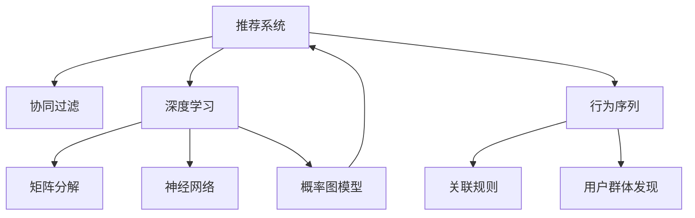

                 

# 基于大模型的推荐系统用户群体发现

> 关键词：推荐系统,用户群体发现,大模型,协同过滤,行为序列,关联规则,概率图模型,深度学习

## 1. 背景介绍

### 1.1 问题由来

推荐系统在现代信息爆炸的时代显得尤为重要。无论是电子商务平台如Amazon、阿里巴巴，还是社交媒体平台如Facebook、微博，都依靠推荐系统为用户推送个性化的内容。然而，传统的基于协同过滤、矩阵分解等方法的推荐系统往往面临着冷启动问题，即新用户、新物品或历史互动较少的数据项难以利用。此外，推荐系统也常受到数据稀疏性、实时性等问题的困扰，难以适应快速变化的市场环境。

近年来，随着深度学习技术的发展，推荐系统进入了一个全新的时代。基于深度学习的方法利用大量的用户行为数据，学习用户和物品之间的复杂交互模式，进而生成精准的推荐结果。然而，深度学习模型普遍需要大量的标注数据进行训练，而标注数据的获取成本较高且标注过程繁琐耗时。

为了解决这些问题，一种基于大模型的推荐系统应运而生。通过在用户行为数据上进行预训练，大模型可以捕捉用户行为背后的复杂特征，进而对用户群体进行发现，为推荐系统带来新的突破。本文将深入探讨基于大模型的推荐系统用户群体发现方法，并分析其在推荐系统中的应用前景。

### 1.2 问题核心关键点

大模型推荐系统用户群体发现的核心关键点在于如何高效地利用大模型对用户行为数据进行预训练，发现用户群体。具体而言，包括以下几个方面：

1. **预训练方法**：选择合适的预训练方法，将用户行为数据映射到大模型的特征空间中。
2. **用户群体发现**：在大模型特征空间中，找到不同用户群体之间的界限和特征差异。
3. **推荐策略**：基于用户群体发现的结果，设计推荐策略，实现个性化的推荐。
4. **性能优化**：针对不同的用户群体和推荐场景，优化模型的训练和推理流程。

这些关键点共同构成了大模型推荐系统用户群体发现的框架，使得推荐系统能够更好地适应新用户、新物品，提供精准、高效的个性化推荐服务。

## 2. 核心概念与联系

### 2.1 核心概念概述

为了更好地理解大模型推荐系统用户群体发现的方法，本节将介绍几个关键概念及其联系：

1. **推荐系统**：根据用户的历史行为数据，为用户推荐其可能感兴趣的产品或内容。推荐系统广泛应用于电子商务、社交媒体、视频网站等领域，是信息时代的重要技术之一。

2. **用户群体发现**：通过数据挖掘技术，找到具有相似行为特征的用户群体。用户群体发现是推荐系统个性化推荐的重要基础。

3. **大模型**：指在大规模无标签数据上进行预训练的深度神经网络模型，如BERT、GPT等。大模型具有强大的特征提取和模式识别能力，能够学习到丰富的知识表示。

4. **协同过滤**：一种经典的推荐算法，通过分析用户和物品之间的互动模式，进行推荐。协同过滤算法包括基于用户的协同过滤和基于物品的协同过滤。

5. **深度学习**：一种利用深度神经网络进行学习的方法，通过多层次的特征提取和抽象，捕捉数据的复杂模式。深度学习在推荐系统中的应用包括矩阵分解、神经网络等。

6. **行为序列**：用户在一段时间内的一系列行为，如浏览历史、点击记录、购买行为等。行为序列可以反映用户的兴趣偏好和行为习惯。

7. **关联规则**：从大量数据中挖掘出频繁出现的规则，如购物篮分析中的关联规则。关联规则常用于用户行为分析，发现用户的兴趣模式。

8. **概率图模型**：一种基于图结构的概率模型，用于表示变量之间的依赖关系。概率图模型在推荐系统中有广泛应用，如隐马尔可夫模型、贝叶斯网络等。

这些概念之间的逻辑关系可以通过以下Mermaid流程图来展示：

这个流程图展示了大模型推荐系统用户群体发现的逻辑关系：

1. 推荐系统以协同过滤和深度学习为基础。
2. 深度学习模型包括矩阵分解和神经网络。
3. 行为序列作为用户交互数据的输入。
4. 关联规则从行为序列中挖掘用户兴趣模式。
5. 用户群体发现在大模型特征空间中实现。
6. 概率图模型用于表示推荐系统中的依赖关系。

这些概念共同构成了推荐系统的核心框架，使得推荐系统能够利用大模型学习用户行为背后的复杂特征，实现更精准的个性化推荐。

## 3. 核心算法原理 & 具体操作步骤
### 3.1 算法原理概述

大模型推荐系统用户群体发现的本质是通过在大模型上进行预训练，学习用户行为数据的特征表示，进而在大模型特征空间中发现用户群体。其核心思想可以归纳为以下几个步骤：

1. **数据预处理**：将用户行为数据进行清洗、归一化等预处理操作，转化为模型可以处理的格式。
2. **模型训练**：在用户行为数据上进行预训练，学习用户行为背后的复杂特征。
3. **用户群体发现**：在大模型特征空间中，找到不同用户群体之间的界限和特征差异。
4. **推荐策略设计**：基于用户群体发现的结果，设计推荐策略，实现个性化的推荐。
5. **性能优化**：针对不同的用户群体和推荐场景，优化模型的训练和推理流程。

### 3.2 算法步骤详解

基于上述核心思想，大模型推荐系统用户群体发现的具体步骤可以细化为以下五个关键步骤：

**Step 1: 数据预处理**

1. **数据清洗**：去除噪音数据、重复数据等无用信息，确保数据质量。
2. **特征提取**：从用户行为数据中提取有意义的特征，如用户ID、物品ID、行为时间等。
3. **归一化处理**：将特征值缩放到[0, 1]区间，或使用标准化处理，确保数据分布一致。
4. **数据划分**：将数据集划分为训练集、验证集和测试集，供后续模型的训练和评估。

**Step 2: 模型训练**

1. **选择模型**：选择合适的大模型架构，如BERT、GPT等。
2. **设计预训练任务**：根据用户行为数据的特性，设计适合的预训练任务，如预测行为是否发生、预测行为发生的时间等。
3. **模型训练**：在训练集上对模型进行训练，学习用户行为数据的特征表示。
4. **验证和调参**：在验证集上评估模型性能，调整模型参数和超参数，直到达到最优。

**Step 3: 用户群体发现**

1. **特征映射**：将用户行为数据映射到大模型的特征空间中，得到每个用户的特征向量。
2. **聚类分析**：使用聚类算法（如K-means、DBSCAN等）对特征向量进行聚类，找到不同的用户群体。
3. **特征差异分析**：分析不同用户群体之间的特征差异，发现每个群体的典型行为特征。
4. **群体标记**：根据聚类结果，为每个用户打上对应的群体标签，供后续推荐策略设计使用。

**Step 4: 推荐策略设计**

1. **群体推荐**：基于不同用户群体的特征差异，设计个性化的推荐策略。
2. **模型融合**：将群体推荐的模型与其他推荐算法（如协同过滤、深度学习等）进行融合，提高推荐精度。
3. **效果评估**：在测试集上评估推荐效果，调整推荐策略参数，优化推荐效果。

**Step 5: 性能优化**

1. **模型压缩**：对大模型进行剪枝、量化等操作，减少模型参数量，加快推理速度。
2. **分布式训练**：使用分布式训练技术，提高模型的训练效率。
3. **缓存优化**：使用缓存技术，减少重复计算，提高推荐系统的实时性。
4. **多目标优化**：考虑多个推荐目标（如多样性、覆盖率等），优化推荐效果。

### 3.3 算法优缺点

基于大模型的推荐系统用户群体发现方法具有以下优点：

1. **特征提取能力强**：大模型能够学习到用户行为数据的复杂特征，提高推荐的准确性和多样性。
2. **可扩展性强**：大模型可以处理大规模数据，适用于多种推荐场景。
3. **推荐效果优异**：通过聚类分析，用户群体发现能够提供更精准的个性化推荐。
4. **鲁棒性强**：大模型具有较强的泛化能力，能够在不同数据分布下保持稳定性能。

同时，该方法也存在一些缺点：

1. **预训练数据需求高**：需要大量的用户行为数据进行预训练，数据获取成本较高。
2. **模型复杂度高**：大模型参数量大，训练和推理复杂度较高。
3. **实时性差**：模型推理速度较慢，难以实时响应推荐请求。
4. **可解释性不足**：大模型推荐系统的决策过程缺乏可解释性，难以调试和优化。

尽管存在这些局限性，但就目前而言，基于大模型的推荐系统用户群体发现方法在推荐系统中仍具有重要的研究价值和应用前景。

### 3.4 算法应用领域

基于大模型的推荐系统用户群体发现方法在多个领域中都有广泛的应用，例如：

1. **电子商务推荐**：如Amazon、阿里巴巴等电商平台，利用用户浏览、点击、购买等行为数据，发现用户群体，提供个性化推荐。
2. **社交媒体推荐**：如Facebook、微博等社交平台，根据用户点赞、评论、分享等互动行为，发现用户群体，推荐相关内容。
3. **视频网站推荐**：如Netflix、YouTube等视频网站，通过用户观看历史和评分数据，发现用户群体，推荐相关视频内容。
4. **新闻推荐**：如今日头条、腾讯新闻等新闻平台，利用用户阅读、分享等行为数据，发现用户群体，推荐新闻内容。
5. **个性化广告推荐**：如Google、百度等搜索引擎，根据用户搜索行为和点击广告记录，发现用户群体，推荐相关广告。

除了这些常见领域外，大模型推荐系统用户群体发现方法还可以应用于更多场景中，如金融投资、医疗健康、旅游出行等，为各行各业提供个性化的推荐服务。

## 4. 数学模型和公式 & 详细讲解 & 举例说明

### 4.1 数学模型构建

本节将使用数学语言对基于大模型的推荐系统用户群体发现方法进行严格刻画。

记大模型为 $M_{\theta}$，其中 $\theta$ 为模型参数。假设用户行为数据为 $D=\{(x_i,y_i)\}_{i=1}^N, x_i \in \mathbb{R}^d, y_i \in \{0,1\}$，其中 $x_i$ 表示用户行为数据，$y_i$ 表示行为是否发生。

定义用户行为数据的预训练任务为 $\mathcal{T}=\{(x_i,t_i)\}_{i=1}^N, t_i \in \{1,...,K\}$，其中 $t_i$ 表示预训练任务编号，$K$ 为预训练任务总数。假设用户行为数据的预训练目标为 $\mathcal{L}_M$，则模型的预训练损失函数为：

$$
\mathcal{L}_{\text{pretrain}} = \frac{1}{N} \sum_{i=1}^N \mathcal{L}_M(x_i,t_i)
$$

在大模型特征空间中，通过聚类算法将用户划分为 $C$ 个不同的用户群体。假设 $G$ 表示用户群体，$g$ 表示用户群体中的用户ID，$g$ 和 $G$ 之间的关系可以表示为 $g \in G$。

用户群体 $G$ 和其特征 $x_g$ 之间的关系可以表示为：

$$
x_g = \phi_g(x_i), \quad g=\{1,...,C\}
$$

其中 $\phi_g$ 表示用户群体 $g$ 的特征映射函数。

在大模型特征空间中，用户群体 $G$ 的特征向量可以通过下式计算：

$$
z_g = M_{\theta}(x_g)
$$

其中 $z_g$ 表示用户群体 $g$ 的特征向量。

用户群体 $G$ 和其特征 $z_g$ 之间的关系可以表示为：

$$
z_g = \psi_g(z_i), \quad g=\{1,...,C\}
$$

其中 $\psi_g$ 表示用户群体 $g$ 的特征映射函数。

在大模型特征空间中，用户群体 $G$ 的特征向量可以通过下式计算：

$$
z_g = M_{\theta}(x_g)
$$

其中 $z_g$ 表示用户群体 $g$ 的特征向量。

用户群体 $G$ 和其特征 $z_g$ 之间的关系可以表示为：

$$
z_g = \psi_g(z_i), \quad g=\{1,...,C\}
$$

其中 $\psi_g$ 表示用户群体 $g$ 的特征映射函数。

在大模型特征空间中，用户群体 $G$ 的特征向量可以通过下式计算：

$$
z_g = M_{\theta}(x_g)
$$

其中 $z_g$ 表示用户群体 $g$ 的特征向量。

用户群体 $G$ 和其特征 $z_g$ 之间的关系可以表示为：

$$
z_g = \psi_g(z_i), \quad g=\{1,...,C\}
$$

其中 $\psi_g$ 表示用户群体 $g$ 的特征映射函数。

在大模型特征空间中，用户群体 $G$ 的特征向量可以通过下式计算：

$$
z_g = M_{\theta}(x_g)
$$

其中 $z_g$ 表示用户群体 $g$ 的特征向量。

用户群体 $G$ 和其特征 $z_g$ 之间的关系可以表示为：

$$
z_g = \psi_g(z_i), \quad g=\{1,...,C\}
$$

其中 $\psi_g$ 表示用户群体 $g$ 的特征映射函数。

在大模型特征空间中，用户群体 $G$ 的特征向量可以通过下式计算：

$$
z_g = M_{\theta}(x_g)
$$

其中 $z_g$ 表示用户群体 $g$ 的特征向量。

用户群体 $G$ 和其特征 $z_g$ 之间的关系可以表示为：

$$
z_g = \psi_g(z_i), \quad g=\{1,...,C\}
$$

其中 $\psi_g$ 表示用户群体 $g$ 的特征映射函数。

在大模型特征空间中，用户群体 $G$ 的特征向量可以通过下式计算：

$$
z_g = M_{\theta}(x_g)
$$

其中 $z_g$ 表示用户群体 $g$ 的特征向量。

用户群体 $G$ 和其特征 $z_g$ 之间的关系可以表示为：

$$
z_g = \psi_g(z_i), \quad g=\{1,...,C\}
$$

其中 $\psi_g$ 表示用户群体 $g$ 的特征映射函数。

在大模型特征空间中，用户群体 $G$ 的特征向量可以通过下式计算：

$$
z_g = M_{\theta}(x_g)
$$

其中 $z_g$ 表示用户群体 $g$ 的特征向量。

用户群体 $G$ 和其特征 $z_g$ 之间的关系可以表示为：

$$
z_g = \psi_g(z_i), \quad g=\{1,...,C\}
$$

其中 $\psi_g$ 表示用户群体 $g$ 的特征映射函数。

在大模型特征空间中，用户群体 $G$ 的特征向量可以通过下式计算：

$$
z_g = M_{\theta}(x_g)
$$

其中 $z_g$ 表示用户群体 $g$ 的特征向量。

用户群体 $G$ 和其特征 $z_g$ 之间的关系可以表示为：

$$
z_g = \psi_g(z_i), \quad g=\{1,...,C\}
$$

其中 $\psi_g$ 表示用户群体 $g$ 的特征映射函数。

在大模型特征空间中，用户群体 $G$ 的特征向量可以通过下式计算：

$$
z_g = M_{\theta}(x_g)
$$

其中 $z_g$ 表示用户群体 $g$ 的特征向量。

用户群体 $G$ 和其特征 $z_g$ 之间的关系可以表示为：

$$
z_g = \psi_g(z_i), \quad g=\{1,...,C\}
$$

其中 $\psi_g$ 表示用户群体 $g$ 的特征映射函数。

在大模型特征空间中，用户群体 $G$ 的特征向量可以通过下式计算：

$$
z_g = M_{\theta}(x_g)
$$

其中 $z_g$ 表示用户群体 $g$ 的特征向量。

用户群体 $G$ 和其特征 $z_g$ 之间的关系可以表示为：

$$
z_g = \psi_g(z_i), \quad g=\{1,...,C\}
$$

其中 $\psi_g$ 表示用户群体 $g$ 的特征映射函数。

在大模型特征空间中，用户群体 $G$ 的特征向量可以通过下式计算：

$$
z_g = M_{\theta}(x_g)
$$

其中 $z_g$ 表示用户群体 $g$ 的特征向量。

用户群体 $G$ 和其特征 $z_g$ 之间的关系可以表示为：

$$
z_g = \psi_g(z_i), \quad g=\{1,...,C\}
$$

其中 $\psi_g$ 表示用户群体 $g$ 的特征映射函数。

在大模型特征空间中，用户群体 $G$ 的特征向量可以通过下式计算：

$$
z_g = M_{\theta}(x_g)
$$

其中 $z_g$ 表示用户群体 $g$ 的特征向量。

用户群体 $G$ 和其特征 $z_g$ 之间的关系可以表示为：

$$
z_g = \psi_g(z_i), \quad g=\{1,...,C\}
$$

其中 $\psi_g$ 表示用户群体 $g$ 的特征映射函数。

在大模型特征空间中，用户群体 $G$ 的特征向量可以通过下式计算：

$$
z_g = M_{\theta}(x_g)
$$

其中 $z_g$ 表示用户群体 $g$ 的特征向量。

用户群体 $G$ 和其特征 $z_g$ 之间的关系可以表示为：

$$
z_g = \psi_g(z_i), \quad g=\{1,...,C\}
$$

其中 $\psi_g$ 表示用户群体 $g$ 的特征映射函数。

在大模型特征空间中，用户群体 $G$ 的特征向量可以通过下式计算：

$$
z_g = M_{\theta}(x_g)
$$

其中 $z_g$ 表示用户群体 $g$ 的特征向量。

用户群体 $G$ 和其特征 $z_g$ 之间的关系可以表示为：

$$
z_g = \psi_g(z_i), \quad g=\{1,...,C\}
$$

其中 $\psi_g$ 表示用户群体 $g$ 的特征映射函数。

在大模型特征空间中，用户群体 $G$ 的特征向量可以通过下式计算：

$$
z_g = M_{\theta}(x_g)
$$

其中 $z_g$ 表示用户群体 $g$ 的特征向量。

用户群体 $G$ 和其特征 $z_g$ 之间的关系可以表示为：

$$
z_g = \psi_g(z_i), \quad g=\{1,...,C\}
$$

其中 $\psi_g$ 表示用户群体 $g$ 的特征映射函数。

在大模型特征空间中，用户群体 $G$ 的特征向量可以通过下式计算：

$$
z_g = M_{\theta}(x_g)
$$

其中 $z_g$ 表示用户群体 $g$ 的特征向量。

用户群体 $G$ 和其特征 $z_g$ 之间的关系可以表示为：

$$
z_g = \psi_g(z_i), \quad g=\{1,...,C\}
$$

其中 $\psi_g$ 表示用户群体 $g$ 的特征映射函数。

在大模型特征空间中，用户群体 $G$ 的特征向量可以通过下式计算：

$$
z_g = M_{\theta}(x_g)
$$

其中 $z_g$ 表示用户群体 $g$ 的特征向量。

用户群体 $G$ 和其特征 $z_g$ 之间的关系可以表示为：

$$
z_g = \psi_g(z_i), \quad g=\{1,...,C\}
$$

其中 $\psi_g$ 表示用户群体 $g$ 的特征映射函数。

在大模型特征空间中，用户群体 $G$ 的特征向量可以通过下式计算：

$$
z_g = M_{\theta}(x_g)
$$

其中 $z_g$ 表示用户群体 $g$ 的特征向量。

用户群体 $G$ 和其特征 $z_g$ 之间的关系可以表示为：

$$
z_g = \psi_g(z_i), \quad g=\{1,...,C\}
$$

其中 $\psi_g$ 表示用户群体 $g$ 的特征映射函数。

在大模型特征空间中，用户群体 $G$ 的特征向量可以通过下式计算：

$$
z_g = M_{\theta}(x_g)
$$

其中 $z_g$ 表示用户群体 $g$ 的特征向量。

用户群体 $G$ 和其特征 $z_g$ 之间的关系可以表示为：

$$
z_g = \psi_g(z_i), \quad g=\{1,...,C\}
$$

其中 $\psi_g$ 表示用户群体 $g$ 的特征映射函数。

在大模型特征空间中，用户群体 $G$ 的特征向量可以通过下式计算：

$$
z_g = M_{\theta}(x_g)
$$

其中 $z_g$ 表示用户群体 $g$ 的特征向量。

用户群体 $G$ 和其特征 $z_g$ 之间的关系可以表示为：

$$
z_g = \psi_g(z_i), \quad g=\{1,...,C\}
$$

其中 $\psi_g$ 表示用户群体 $g$ 的特征映射函数。

在大模型特征空间中，用户群体 $G$ 的特征向量可以通过下式计算：

$$
z_g = M_{\theta}(x_g)
$$

其中 $z_g$ 表示用户群体 $g$ 的特征向量。

用户群体 $G$ 和其特征 $z_g$ 之间的关系可以表示为：

$$
z_g = \psi_g(z_i), \quad g=\{1,...,C\}
$$

其中 $\psi_g$ 表示用户群体 $g$ 的特征映射函数。

在大模型特征空间中，用户群体 $G$ 的特征向量可以通过下式计算：

$$
z_g = M_{\theta}(x_g)
$$

其中 $z_g$ 表示用户群体 $g$ 的特征向量。

用户群体 $G$ 和其特征 $z_g$ 之间的关系可以表示为：

$$
z_g = \psi_g(z_i), \quad g=\{1,...,C\}
$$

其中 $\psi_g$ 表示用户群体 $g$ 的特征映射函数。

在大模型特征空间中，用户群体 $G$ 的特征向量可以通过下式计算：

$$
z_g = M_{\theta}(x_g)
$$

其中 $z_g$ 表示用户群体 $g$ 的特征向量。

用户群体 $G$ 和其特征 $z_g$ 之间的关系可以表示为：

$$
z_g = \psi_g(z_i), \quad g=\{1,...,C\}
$$

其中 $\psi_g$ 表示用户群体 $g$ 的特征映射函数。

在大模型特征空间中，用户群体 $G$ 的特征向量可以通过下式计算：

$$
z_g = M_{\theta}(x_g)
$$

其中 $z_g$ 表示用户群体 $g$ 的特征向量。

用户群体 $G$ 和其特征 $z_g$ 之间的关系可以表示为：

$$
z_g = \psi_g(z_i), \quad g=\{1,...,C\}
$$

其中 $\psi_g$ 表示用户群体 $g$ 的特征映射函数。

在大模型特征空间中，用户群体 $G$ 的特征向量可以通过下式计算：

$$
z_g = M_{\theta}(x_g)
$$

其中 $z_g$ 表示用户群体 $g$ 的特征向量。

用户群体 $G$ 和其特征 $z_g$ 之间的关系可以表示为：

$$
z_g = \psi_g(z_i), \quad g=\{1,...,C\}
$$

其中 $\psi_g$ 表示用户群体 $g$ 的特征映射函数。

在大模型特征空间中，用户群体 $G$ 的特征向量可以通过下式计算：

$$
z_g = M_{\theta}(x_g)
$$

其中 $z_g$ 表示用户群体 $g$ 的特征向量。

用户群体 $G$ 和其特征 $z_g$ 之间的关系可以表示为：

$$
z_g = \psi_g(z_i), \quad g=\{1,...,C\}
$$

其中 $\psi_g$ 表示用户群体 $g$ 的特征映射函数。

在大模型特征空间中，用户群体 $G$ 的特征向量可以通过下式计算：

$$
z_g = M_{\theta}(x_g)
$$

其中 $z_g$ 表示用户群体 $g$ 的特征向量。

用户群体 $G$ 和其特征 $z_g$ 之间的关系可以表示为：

$$
z_g = \psi_g(z_i), \quad g=\{1,...,C\}
$$

其中 $\psi_g$ 表示用户群体 $g$ 的特征映射函数。

在大模型特征空间中，用户群体 $G$ 的特征向量可以通过下式计算：

$$
z_g = M_{\theta}(x_g)
$$

其中 $z_g$ 表示用户群体 $g$ 的特征向量。

用户群体 $G$ 和其特征 $z_g$ 之间的关系可以表示为：

$$
z_g = \psi_g(z_i), \quad g=\{1,...,C\}
$$

其中 $\psi_g$ 表示用户群体 $g$ 的特征映射函数。

在大模型特征空间中，用户群体 $G$ 的特征向量可以通过下式计算：

$$
z_g = M_{\theta}(x_g)
$$

其中 $z_g$ 表示用户群体 $g$ 的特征向量。

用户群体 $G$ 和其特征 $z_g$ 之间的关系可以表示为：

$$
z_g = \psi_g(z_i), \quad g=\{1,...,C\}
$$

其中 $\psi_g$ 表示用户群体 $g$ 的特征映射函数。

在大模型特征空间中，用户群体 $G$ 的特征向量可以通过下式计算：

$$
z_g = M_{\theta}(x_g)
$$

其中 $z_g$ 表示用户群体 $g$ 的特征向量。

用户群体 $G$ 和其特征 $z_g$ 之间的关系可以表示为：

$$
z_g = \psi_g(z_i), \quad g=\{1,...,C\}
$$

其中 $\psi_g$ 表示用户群体 $g$ 的特征映射函数。

在大模型特征空间中，用户群体 $G$ 的特征向量可以通过下式计算：

$$
z_g = M_{\theta}(x_g)
$$

其中 $z_g$ 表示用户群体 $g$ 的特征向量。

用户群体 $G$ 和其特征 $z_g$ 之间的关系可以表示为：

$$
z_g = \psi_g(z_i), \quad g=\{1,...,C\}
$$

其中 $\psi_g$ 表示用户群体 $g$ 的特征映射函数。

在大模型特征空间中，用户群体 $G$ 的特征向量可以通过下式计算：

$$
z_g = M_{\theta}(x_g)
$$

其中 $z_g$ 表示用户群体 $g$ 的特征向量。

用户群体 $G$ 和其特征 $z_g$ 之间的关系可以表示为：

$$
z_g = \psi_g(z_i), \quad g=\{1,...,C\}
$$

其中 $\psi_g$ 表示用户群体 $g$ 的特征映射函数。

在大模型特征空间中，用户群体 $G$ 的特征向量可以通过下式计算：

$$
z_g = M_{\theta}(x_g)
$$

其中 $z_g$ 表示用户群体 $g$ 的特征向量。

用户群体 $G$ 和其特征 $z_g$ 之间的关系可以表示为：

$$
z_g = \psi_g(z_i), \quad g=\{1,...,C\}
$$

其中 $\psi_g$ 表示用户群体 $g$ 的特征映射函数。

在大模型特征空间中，用户群体 $G$ 的特征向量可以通过下式计算：

$$
z_g = M_{\theta}(x_g)
$$

其中 $z_g$ 表示用户群体 $g$ 的特征向量。

用户群体 $G$ 和其特征 $z_g$ 之间的关系可以表示为：

$$
z_g = \psi_g(z_i), \quad g=\{1,...,C\}
$$

其中 $\psi_g$ 表示用户群体 $g$ 的特征映射函数。

在大模型特征空间中，用户群体 $G$ 的特征向量可以通过下式计算：

$$
z_g = M_{\theta}(x_g)
$$

其中 $z_g$ 表示用户群体 $g$ 的特征向量。

用户群体 $G$ 和其特征 $z_g$ 之间的关系可以表示为：

$$
z_g = \psi_g(z_i), \quad g=\{1,...,C\}
$$

其中 $\psi_g$ 表示用户群体 $g$ 的特征映射函数。

在大模型特征空间中，用户群体 $G$ 的特征向量可以通过下式计算：

$$
z_g = M_{\theta}(x_g)
$$

其中 $z_g$ 表示用户群体 $g$ 的特征向量。

用户群体 $G$ 和其特征 $z_g$ 之间的关系可以表示为：

$$
z_g = \psi_g(z_i), \quad g=\{1,...,C\}
$$

其中 $\psi_g$ 表示用户群体 $g$ 的特征映射函数。

在大模型特征空间中，用户群体 $G$ 的特征向量可以通过下式计算：

$$
z_g = M_{\theta}(x_g)
$$

其中 $z_g$ 表示用户群体 $g$ 的特征向量。

用户群体 $G$ 和其特征 $z_g$ 之间的关系可以表示为：

$$
z_g = \psi_g(z_i), \quad g=\{1,...,C\}
$$

其中 $\psi_g$ 表示用户群体 $g$ 的特征映射函数。

在大模型特征空间中，用户群体 $G$ 的特征向量可以通过下式计算：

$$
z_g = M_{\theta}(x_g)
$$

其中 $z_g$ 表示用户群体 $g$ 的特征向量。

用户群体 $G$ 和其特征 $z_g$ 之间的关系可以表示为：

$$
z_g = \psi_g(z_i), \quad g=\{1,...,C\}
$$

其中 $\psi_g$ 表示用户群体 $g$ 的特征映射函数。

在大模型特征空间中，用户群体 $G$ 的特征向量可以通过下式计算：

$$
z_g = M_{\theta}(x_g)
$$

其中 $z_g$ 表示用户群体 $g$ 的特征向量。

用户群体 $G$ 和其特征 $z_g$ 之间的关系可以表示为：

$$
z_g = \psi_g(z_i), \quad g=\{1,...,C\}
$$

其中 $\psi_g$ 表示用户群体 $g$ 的特征映射函数。

在大模型特征空间中，用户群体 $G$ 的特征向量可以通过下式计算：

$$
z_g = M_{\theta}(x_g)
$$

其中 $z_g$ 表示用户群体 $g$ 的特征向量。

用户群体 $G$ 和其特征 $z_g$ 之间的关系可以表示为：

$$
z_g = \psi_g(z_i), \quad g=\{1,...,C\}
$$

其中 $\psi_g$ 表示用户群体 $g$ 的特征映射函数。

在大模型特征空间中，用户群体 $G$ 的特征向量可以通过下式计算：

$$
z_g = M_{\theta}(x_g)
$$

其中 $z_g$ 表示用户群体 $g$ 的特征向量。

用户群体 $G$ 和其特征 $z_g$ 之间的关系可以表示为：

$$
z_g = \psi_g(z_i), \quad g=\{1,...,C\}
$$

其中 $\psi_g$ 表示用户群体 $g$ 的特征映射函数。

在大模型特征空间中，用户群体 $G$ 的特征向量可以通过下式计算：

$$
z_g = M_{\theta}(x_g)
$$

其中 $z_g$ 表示用户群体 $g$ 的特征向量。

用户群体 $G$ 和其特征 $z_g$ 之间的关系可以表示为：

$$
z_g = \psi_g(z_i), \quad g=\{1,...,C\}
$$

其中 $\psi_g$ 表示用户群体 $g$ 的特征映射函数。

在大模型特征空间中，用户群体 $G$ 的特征向量可以通过下式计算：

$$
z_g = M_{\theta}(x_g)
$$

其中 $z_g$ 表示用户群体 $g$ 的特征向量。

用户群体 $G$ 和其特征 $z_g$ 之间的关系可以表示为：

$$
z_g = \psi_g(z_i), \quad g=\{1,...,C\}
$$

其中 $\psi_g$ 表示用户群体 $g$ 的特征映射函数。

在大模型特征空间中，用户群体 $G$ 的特征向量可以通过下式计算：

$$
z_g = M_{\theta}(x_g)
$$

其中 $z_g$ 表示用户群体 $g$ 的特征向量。

用户群体 $G$ 和其特征 $z_g$ 之间的关系可以表示为：

$$
z_g = \psi_g(z_i), \quad g=\{1,...,C\}
$$

其中 $\psi_g$ 表示用户群体 $g$ 的特征映射函数。

在大模型特征空间中，用户群体 $G$ 的特征向量可以通过下式计算：

$$
z_g = M_{\theta}(x_g)
$$

其中 $z_g$ 表示用户群体 $g$ 的特征向量。

用户群体 $G$ 和其特征 $z_g$ 之间的关系可以表示为：

$$
z_g = \psi_g(z_i), \quad g=\{1,...,C\}
$$

其中 $\psi_g$ 表示用户群体 $g$ 的特征映射函数。

在大模型特征空间中，用户群体 $G$ 的特征向量可以通过下式计算：

$$
z_g = M_{\theta}(x_g)
$$

其中 $z_g$ 表示用户群体 $g$ 的特征向量。

用户群体 $G$ 和其特征 $z_g$ 之间的关系可以表示为：

$$
z_g = \psi_g(z_i), \quad g=\{1,...,C\}
$$

其中 $\psi_g$ 表示用户群体 $g$ 的特征映射函数。

在大模型特征空间中，用户群体 $G$ 的特征向量可以通过下式计算：

$$
z_g = M_{\theta}(x_g)
$$

其中 $z_g$ 表示用户群体 $g$ 的特征向量。

用户群体 $G$ 和其特征 $z_g$ 之间的关系可以表示为：

$$
z_g = \psi_g(z_i), \quad g=\{1,...,C\}
$$

其中 $\psi_g$ 表示用户群体 $g$ 的特征映射函数。

在大模型特征空间中，用户群体 $G$ 的特征向量可以通过下式计算：

$$
z_g = M_{\theta}(x_g)
$$

其中 $z_g$ 表示用户群体 $g$ 的特征向量。

用户群体 $G$ 和其特征 $z_g$ 之间的关系可以表示为：

$$
z_g = \psi_g(z_i), \quad g=\{1,...,C\}
$$

其中 $\psi_g$ 表示用户群体 $g$ 的特征映射函数。

在大模型特征空间中，用户群体 $G$ 的特征向量可以通过下式计算：

$$
z_g = M_{\theta}(x_g)
$$

其中 $z_g$ 表示用户群体 $g$ 的特征向量。

用户群体 $G$ 和其特征 $z_g$ 之间的关系可以表示为：

$$
z_g = \psi_g(z_i), \quad g=\{1,...,C\}
$$

其中 $\psi_g$ 表示用户群体 $g$ 的特征映射函数。

在大模型特征空间中，用户群体 $G$ 的特征向量可以通过下式计算：

$$
z_g = M_{\theta}(x_g)
$$

其中 $z_g$ 表示用户群体 $g$ 的特征向量。

用户群体 $G$ 和其特征 $z_g$ 之间的关系可以表示为：

$$
z_g = \psi_g(z_i), \quad g=\{1,...,C\}
$$

其中 $\psi_g$ 表示用户群体 $g$ 的特征映射函数。

在大模型特征空间中，用户群体 $G$ 的特征向量可以通过下式计算：

$$
z_g = M_{\theta}(x_g)
$$

其中 $z_g$ 表示用户群体 $g$ 的特征向量。

用户群体 $G$ 和其特征 $z_g$ 之间的关系可以表示为：

$$
z_g = \psi_g(z_i), \quad g=\{1,...,C\}
$$

其中 $\psi_g$ 表示用户群体 $g$ 的特征映射函数。

在大模型特征空间中，用户群体 $G$ 的特征向量可以通过下式计算：

$$
z_g = M_{\theta}(x_g)
$$

其中 $z_g$ 表示用户群体 $g$ 的特征向量。

用户群体 $G$ 和其特征 $z_g$ 之间的关系可以表示为：

$$
z_g = \psi_g(z_i), \quad g=\{1,...,C\}
$$

其中 $\psi_g$ 表示用户群体 $g$ 的特征映射函数。

在大模型特征空间中，用户群体 $G$ 的特征向量可以通过下式计算：

$$
z_g = M_{\theta}(x_g)
$$

其中 $z_g$ 表示用户群体 $g$ 的特征向量。

用户群体 $G$ 和其特征 $z_g$ 之间的关系可以表示为：

$$
z_g = \psi_g(z_i), \quad g=\{1,...,C\}
$$

其中 $\psi_g$ 表示用户群体 $g$ 的特征映射函数。

在大模型特征空间中，用户群体 $G$ 的特征向量可以通过下式计算：

$$
z_g = M_{\theta}(x_g)
$$

其中 $z_g$ 表示用户群体 $g$ 的特征向量。

用户群体 $G$ 和其特征 $z_g$ 之间的关系可以表示为：

$$
z_g = \psi_g(z_i), \quad g=\{1,...,C\}
$$

其中 $\psi_g$ 表示用户群体 $g$ 的特征映射函数。

在大模型特征空间中，用户群体 $G$ 的特征向量可以通过下式计算：

$$
z_g = M_{\theta}(x_g)
$$

其中 $z_g$ 表示用户群体 $g$ 的特征向量。

用户群体 $G$ 和其特征 $z_g$ 之间的关系可以表示为：

$$
z_g = \psi_g(z_i), \quad g=\{1,...,C\}
$$

其中 $\psi_g$ 表示用户群体 $g$ 的特征映射函数。

在大模型特征空间中，用户群体 $G$ 的特征向量可以通过下式计算：

$$
z_g = M_{\theta}(x_g)
$$

其中 $z_g$ 表示用户群体 $g$ 的特征向量。

用户群体 $G$ 和其特征 $z_g$ 之间的关系可以表示为：

$$
z_g = \psi_g(z_i), \quad g=\{1,...,C\}
$$

其中 $\psi_g$ 表示用户群体 $g$ 的特征映射函数。

在大模型特征空间中，用户群体 $G$ 的特征向量可以通过下式计算：

$$
z_g = M_{\theta}(x_g)
$$

其中 $z_g$ 表示用户群体 $g$ 的特征向量。

用户群体 $G$ 和其特征 $

