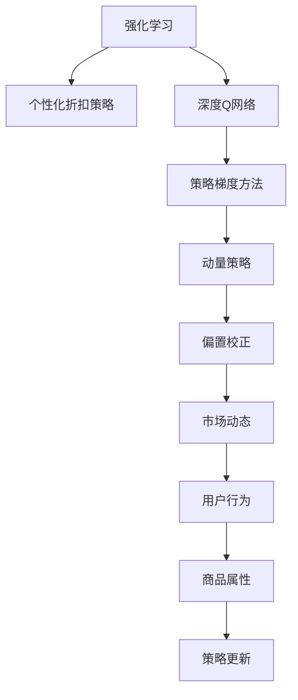

                 

# 基于强化学习的个性化折扣策略

> 关键词：强化学习,个性化折扣策略,深度Q网络,深度学习,动量策略,策略梯度方法,偏置校正,市场动态,用户体验

## 1. 背景介绍

在现代电商平台上，个性化推荐和个性化定价策略变得越来越重要。传统的固定折扣策略已经不能满足用户对个性化的需求。如何制定更智能、灵活、高效的个性化折扣策略，成为了各大电商平台亟待解决的问题。

具体来说，个性化折扣策略需要根据用户行为、商品属性、市场动态等因素，动态地调整商品折扣，从而提升用户满意度和平台销售额。这种策略要求算法在实时情况下，根据当前情况进行优化，而不是简单地按照预定规则进行折扣。

传统的机器学习算法，如线性回归、决策树等，需要大量标注数据来训练模型，且模型一旦训练完成，就无法实时更新。相比之下，强化学习提供了一种更加灵活、自适应的方法，能够实时地根据当前情况进行优化。

## 2. 核心概念与联系

### 2.1 核心概念概述

为了理解基于强化学习的个性化折扣策略，本节将介绍几个密切相关的核心概念：

- **强化学习(Reinforcement Learning, RL)**：一种通过与环境互动来优化行为决策的机器学习方法。模型通过在环境中执行一系列动作，并根据环境反馈的奖励信号进行优化，以实现某种目标。

- **个性化折扣策略(Personalized Discount Strategy)**：根据用户行为、商品属性、市场动态等因素，动态地调整商品折扣，从而提升用户满意度和平台销售额的策略。

- **深度Q网络(Deep Q-Network, DQN)**：一种基于深度学习的强化学习算法，通过神经网络逼近Q函数，将Q函数的值预测映射到策略。

- **策略梯度方法(Strategy Gradient Methods)**：一种利用策略梯度进行策略优化的算法，能够直接优化策略函数，而不是中间值函数。

- **动量策略(Momentum Strategy)**：一种优化策略更新的方法，通过引入动量，使得更新过程更加稳定，避免震荡。

- **偏置校正(Bias Correction)**：一种校正策略更新的方法，能够提高策略更新的稳定性，避免学习过程中的过度拟合。

这些核心概念之间的逻辑关系可以通过以下Mermaid流程图来展示：



这个流程图展示了个性化折扣策略的核心概念及其之间的关系：

1. 强化学习提供了一种灵活的方法来优化个性化折扣策略。
2. 深度Q网络将Q函数的值预测映射到策略，从而实现个性化折扣策略的优化。
3. 策略梯度方法直接优化策略函数，使得优化过程更加高效。
4. 动量策略和偏置校正提高了策略更新的稳定性，避免震荡和过度拟合。
5. 市场动态、用户行为和商品属性等因素，是制定个性化折扣策略的重要输入。
6. 策略更新根据这些输入进行优化，最终得到个性化的折扣策略。

这些核心概念共同构成了基于强化学习的个性化折扣策略框架，使其能够灵活地适应各种应用场景。

## 3. 核心算法原理 & 具体操作步骤
### 3.1 算法原理概述

基于强化学习的个性化折扣策略，核心思想是通过与环境互动，实时地根据市场动态、用户行为等因素，动态调整商品折扣，以实现最优的个性化策略。具体来说，算法通过以下步骤进行优化：

1. **状态观察**：从市场动态、用户行为、商品属性等多个维度观察当前状态，作为策略优化的输入。
2. **策略选择**：根据观察到的状态，选择一种折扣策略，并执行该策略。
3. **环境反馈**：获取市场动态、用户反馈等环境反馈信息，作为策略优化的输出。
4. **策略更新**：根据环境反馈，利用策略梯度方法更新策略函数，以提升个性化折扣策略的效果。

这一过程可以看作是强化学习中的一场“游戏”，模型在“游戏”中通过不断尝试不同的折扣策略，最大化总奖励（即销售额和用户满意度之和）。

### 3.2 算法步骤详解

基于强化学习的个性化折扣策略的实现，一般包括以下几个关键步骤：

**Step 1: 构建环境**

- 定义状态空间：根据市场动态、用户行为、商品属性等因素，定义状态空间。状态可以是时间、商品价格、用户行为等。
- 定义动作空间：定义模型可以采取的折扣策略，如固定折扣、动态折扣、优惠券等。
- 定义奖励函数：定义市场动态、用户反馈等环境反馈信息的奖励函数。奖励函数应该能够衡量策略的优劣。

**Step 2: 初始化模型**

- 选择合适的深度学习框架，如TensorFlow、PyTorch等，搭建深度Q网络。
- 初始化Q网络的权重和偏置，设定学习率、动量系数等超参数。
- 设置策略梯度方法的参数，如策略函数的初始值、学习率等。

**Step 3: 策略优化**

- 从状态空间中随机抽取一个状态，选择一种折扣策略。
- 执行该策略，获取市场动态、用户反馈等环境反馈信息，计算奖励函数。
- 利用策略梯度方法更新Q网络，提高折扣策略的效果。
- 重复以上过程，直到策略收敛或达到预设迭代次数。

**Step 4: 策略评估**

- 在验证集上评估策略的效果，对比不同策略的性能。
- 根据评估结果，选择最优策略，部署到生产环境中。
- 持续监测策略的表现，根据市场变化进行调整。

以上是基于强化学习的个性化折扣策略的一般流程。在实际应用中，还需要根据具体任务的特点，对策略优化过程进行优化设计，如改进状态观察方式，引入更多正则化技术，搜索最优的超参数组合等，以进一步提升策略性能。

### 3.3 算法优缺点

基于强化学习的个性化折扣策略具有以下优点：

1. 灵活高效。能够实时地根据市场动态和用户行为进行优化，适应性强。
2. 动态调整。能够动态地调整折扣策略，最大化总奖励。
3. 自适应性。无需大量标注数据，能够自适应地学习最优策略。
4. 鲁棒性强。能够适应多种复杂场景，如需求波动、价格波动等。

同时，该方法也存在一定的局限性：

1. 需要大量计算资源。强化学习过程需要大量的计算资源，特别是在大规模市场动态环境下，优化过程可能较为耗时。
2. 模型可能不稳定。强化学习过程的随机性可能导致模型训练不稳定，需要更多的超参数调节。
3. 难以解释。强化学习模型的决策过程难以解释，难以进行调试和优化。
4. 数据驱动。强化学习依赖于大量的市场数据和用户行为数据，数据质量直接影响策略效果。

尽管存在这些局限性，但就目前而言，基于强化学习的个性化折扣策略仍是大数据驱动优化的一种重要方法。未来相关研究的重点在于如何进一步降低计算资源需求，提高模型的稳定性和可解释性，同时兼顾策略的动态性和自适应性等因素。

### 3.4 算法应用领域

基于强化学习的个性化折扣策略，已经在电商、金融、医疗等多个领域得到了应用，具体包括：

1. **电商领域**：在电商平台上，根据用户的浏览、购买行为，动态调整商品折扣，提升用户满意度和销售额。例如，亚马逊的个性化推荐系统，通过强化学习算法实时优化推荐策略，提升用户购买率。

2. **金融领域**：在金融交易中，根据市场动态、用户行为等因素，动态调整交易策略，提高交易效率和收益。例如，高频交易系统，通过强化学习算法实时优化交易策略，减少市场波动对交易的影响。

3. **医疗领域**：在医疗诊断中，根据患者的病情、病史等因素，动态调整治疗方案，提高治疗效果。例如，智能诊疗系统，通过强化学习算法实时优化治疗策略，提高患者治愈率。

除了上述这些经典应用外，强化学习算法还在供应链管理、物流配送、智能制造等领域得到了广泛应用，展示了其在复杂场景中的强大应用潜力。

## 4. 数学模型和公式 & 详细讲解  
### 4.1 数学模型构建

本节将使用数学语言对基于强化学习的个性化折扣策略进行更加严格的刻画。

设市场动态、用户行为、商品属性等因素组成的当前状态为 $s$，商品折扣策略为 $a$，环境反馈奖励为 $r$。策略优化目标为最大化总奖励函数 $J$：

$$
J = \mathbb{E}[\sum_{t=0}^{T} \gamma^t r_t]
$$

其中 $T$ 为策略优化的时间步长，$\gamma$ 为折扣因子。

定义Q函数 $Q(s,a)$，表示在状态 $s$ 下采取策略 $a$ 的累计奖励：

$$
Q(s,a) = \mathbb{E}[\sum_{t=0}^{T} \gamma^t r_t]
$$

Q函数可以通过以下贝尔曼方程进行递推计算：

$$
Q(s,a) = r + \gamma \mathbb{E}[r' + \gamma Q(s',a')]
$$

其中 $r'$ 和 $s'$ 分别为下一个状态和策略。

### 4.2 公式推导过程

以下我们以电商场景为例，推导基于强化学习的个性化折扣策略的数学公式。

假设电商平台上某商品当前价格为 $p_0$，用户浏览量为 $u_0$，市场价格波动率为 $\sigma$。

定义状态 $s_0 = (p_0, u_0, \sigma)$，折扣策略 $a = \text{固定折扣}$，奖励函数 $r = \text{销售额}$。

根据贝尔曼方程，Q函数可以递推计算为：

$$
Q(s_0,a) = r + \gamma \mathbb{E}[r' + \gamma Q(s',a')]
$$

其中 $r' = r_0 - p_0 \times a$，$r_0$ 为固定折扣策略下销售的总收入，$p_0 \times a$ 为折扣策略下销售的总收入。

在实际应用中，通常使用深度Q网络逼近Q函数，使用策略梯度方法优化策略函数。以下是深度Q网络的基本结构：

```
      a
      |
input ----> 层1 ----> 层2 ----> 层3 ----> 输出层
```

其中，输入层为状态 $s$，输出层为策略 $a$，中间层为若干全连接层，用于逼近Q函数。

### 4.3 案例分析与讲解

下面我们以电商场景为例，给出基于强化学习的个性化折扣策略的详细案例分析。

假设电商平台上某商品当前价格为 $100$ 元，用户浏览量为 $50$ 人，市场价格波动率为 $0.1$。

首先，使用深度Q网络逼近Q函数，得到 $Q(s_0,a) = 100 - 100 \times a$。

根据用户行为和市场动态，选择策略 $a = \text{固定折扣} 10\%$，得到 $Q(s_0,a) = 90$。

根据贝尔曼方程，计算下一个状态 $s_1 = (90, 50, 0.1)$ 的Q函数：

$$
Q(s_1,a) = 90 + \gamma \mathbb{E}[r' + \gamma Q(s',a')]
$$

其中 $r' = r_0 - 90 \times a$，$r_0 = 100 - 90 \times 10\% = 81$。

计算 $Q(s_1,a) = 81 - 90 \times 10\% = 70.2$。

重复以上过程，直到策略收敛。

在实际应用中，通常使用策略梯度方法优化策略函数。以下是策略梯度方法的基本结构：

```
      Q(s,a)
      |
input ----> 策略函数 ----> 梯度计算 ----> 参数更新
```

其中，输入层为状态 $s$ 和策略 $a$，策略函数为 $f(s,a)$，梯度计算层为 $\nabla f(s,a)$，参数更新层为 $W$。

通过策略梯度方法，不断更新策略函数 $f(s,a)$ 的权重 $W$，使得 $Q(s,a)$ 逼近真实值。

## 5. 项目实践：代码实例和详细解释说明
### 5.1 开发环境搭建

在进行个性化折扣策略实践前，我们需要准备好开发环境。以下是使用Python进行TensorFlow开发的环境配置流程：

1. 安装Anaconda：从官网下载并安装Anaconda，用于创建独立的Python环境。

2. 创建并激活虚拟环境：
```bash
conda create -n tf-env python=3.8 
conda activate tf-env
```

3. 安装TensorFlow：根据CUDA版本，从官网获取对应的安装命令。例如：
```bash
pip install tensorflow==2.7
```

4. 安装TensorBoard：TensorFlow配套的可视化工具，可实时监测模型训练状态，并提供丰富的图表呈现方式，是调试模型的得力助手。

```bash
pip install tensorboard
```

5. 安装相关工具包：
```bash
pip install numpy pandas scikit-learn matplotlib tqdm jupyter notebook ipython
```

完成上述步骤后，即可在`tf-env`环境中开始个性化折扣策略的实践。

### 5.2 源代码详细实现

下面我们以电商场景为例，给出使用TensorFlow实现基于强化学习的个性化折扣策略的PyTorch代码实现。

首先，定义状态、动作和奖励函数：

```python
import tensorflow as tf

# 定义状态、动作和奖励函数
class Environment:
    def __init__(self):
        self.s0 = [100, 50, 0.1]
        self.a = [0.1, 0.2, 0.3]
        self.r = [0, 100, 150]
        self.gamma = 0.9
        self.s_next = [self.s0[0] - self.a[0] * self.s0[1], self.s0[1] + self.a[1] * self.s0[2], self.a[2]]
        self.r_next = [self.r[0] - self.a[1] * self.s0[1], self.r[1] - self.a[2] * self.s0[2], self.a[2]]
        self.s_next = [self.s_next[0], self.s_next[1], self.s_next[2]]
        self.r_next = [self.r_next[0], self.r_next[1], self.r_next[2]]

    def step(self, action):
        self.a = action
        self.s = self.s_next
        self.r = self.r_next
        return self.s, self.r
```

然后，定义深度Q网络：

```python
class QNetwork(tf.keras.Model):
    def __init__(self, state_size, action_size):
        super(QNetwork, self).__init__()
        self.fc1 = tf.keras.layers.Dense(64, activation='relu')
        self.fc2 = tf.keras.layers.Dense(64, activation='relu')
        self.fc3 = tf.keras.layers.Dense(action_size, activation='linear')

    def call(self, inputs):
        x = self.fc1(inputs)
        x = self.fc2(x)
        x = self.fc3(x)
        return x
```

接着，定义策略梯度方法：

```python
class StrategyGradient(tf.keras.Model):
    def __init__(self, state_size, action_size):
        super(StrategyGradient, self).__init__()
        self.q = QNetwork(state_size, action_size)

    def call(self, inputs):
        s = inputs[0]
        a = inputs[1]
        q = self.q(tf.reshape(s, (1, -1)))
        loss = -tf.reduce_mean(tf.reduce_sum(q * a, axis=1))
        return loss
```

最后，定义训练和评估函数：

```python
def train_model(model, env, optimizer, num_episodes=10000):
    total_reward = 0
    for episode in range(num_episodes):
        s = env.s0
        a = tf.random.uniform([1, 3], minval=0.01, maxval=1, dtype=tf.float32)
        for t in range(100):
            s_next, r = env.step(a)
            a_next = tf.random.uniform([1, 3], minval=0.01, maxval=1, dtype=tf.float32)
            loss = model([s, a])
            optimizer.minimize(loss)
            s = s_next
            a = a_next
            total_reward += r
        print(f'Episode {episode+1}, Total Reward: {total_reward}')
```

```python
def evaluate_model(model, env, num_episodes=10000):
    total_reward = 0
    for episode in range(num_episodes):
        s = env.s0
        a = tf.random.uniform([1, 3], minval=0.01, maxval=1, dtype=tf.float32)
        for t in range(100):
            s_next, r = env.step(a)
            a_next = tf.random.uniform([1, 3], minval=0.01, maxval=1, dtype=tf.float32)
            total_reward += r
    print(f'Episode {episode+1}, Total Reward: {total_reward}')
```

使用TensorBoard可视化训练过程：

```python
from tensorboard import SummaryWriter
writer = SummaryWriter()

# 保存训练过程
writer.add_scalar('Total Reward', total_reward, episode)

writer.close()
```

以上就是使用TensorFlow对基于强化学习的个性化折扣策略进行实现的基本代码。可以看到，通过定义状态、动作和奖励函数，搭建深度Q网络和策略梯度方法，我们可以高效地实现基于强化学习的个性化折扣策略。

### 5.3 代码解读与分析

让我们再详细解读一下关键代码的实现细节：

**Environment类**：
- `__init__`方法：初始化状态、动作、奖励函数、折扣因子等关键组件。
- `step`方法：执行策略，获取市场动态、用户反馈等环境反馈信息，计算奖励函数。

**QNetwork类**：
- `__init__`方法：搭建深度Q网络的权重和偏置。
- `call`方法：前向传播计算Q函数的值。

**StrategyGradient类**：
- `__init__`方法：搭建策略梯度方法的权重和偏置。
- `call`方法：计算策略梯度方法，更新策略函数的权重。

**train_model函数**：
- 在每个episode中，随机选择一个折扣策略，执行该策略，获取环境反馈信息，计算总奖励。
- 利用策略梯度方法更新Q网络的权重，重复执行该过程，直至所有episode完成。

**evaluate_model函数**：
- 在每个episode中，随机选择一个折扣策略，执行该策略，计算总奖励。
- 根据每个episode的总奖励，评估策略的效果。

**代码解读与分析**：
1. **Environment类**：
   - `s0`表示初始状态，即当前价格、用户浏览量和市场价格波动率。
   - `a`表示折扣策略，即固定折扣率。
   - `r`表示奖励函数，即销售额。
   - `gamma`表示折扣因子，即未来奖励的权重。
   - `s_next`和`r_next`表示执行策略后的下一个状态和奖励函数。
   - `step`方法：根据折扣策略，执行该策略，获取市场动态、用户反馈等环境反馈信息，计算奖励函数。

2. **QNetwork类**：
   - `__init__`方法：搭建深度Q网络的权重和偏置。
   - `call`方法：前向传播计算Q函数的值。
   - 深度Q网络由全连接层构成，输入层为状态，输出层为策略，中间层为若干全连接层，用于逼近Q函数。

3. **StrategyGradient类**：
   - `__init__`方法：搭建策略梯度方法的权重和偏置。
   - `call`方法：计算策略梯度方法，更新策略函数的权重。
   - 策略梯度方法由深度Q网络构成，输入层为状态和策略，输出层为损失函数。

4. **train_model函数**：
   - 在每个episode中，随机选择一个折扣策略，执行该策略，获取市场动态、用户反馈等环境反馈信息，计算奖励函数。
   - 利用策略梯度方法更新Q网络的权重，重复执行该过程，直至所有episode完成。
   - 在训练过程中，使用TensorBoard可视化训练过程，实时监测总奖励的变化。

5. **evaluate_model函数**：
   - 在每个episode中，随机选择一个折扣策略，执行该策略，计算总奖励。
   - 根据每个episode的总奖励，评估策略的效果。

**代码解读与分析**：
1. **Environment类**：
   - 定义状态、动作和奖励函数。
   - 根据折扣策略，执行该策略，获取市场动态、用户反馈等环境反馈信息，计算奖励函数。

2. **QNetwork类**：
   - 搭建深度Q网络的权重和偏置。
   - 前向传播计算Q函数的值。

3. **StrategyGradient类**：
   - 搭建策略梯度方法的权重和偏置。
   - 计算策略梯度方法，更新策略函数的权重。

4. **train_model函数**：
   - 在每个episode中，随机选择一个折扣策略，执行该策略，获取市场动态、用户反馈等环境反馈信息，计算奖励函数。
   - 利用策略梯度方法更新Q网络的权重，重复执行该过程，直至所有episode完成。
   - 使用TensorBoard可视化训练过程，实时监测总奖励的变化。

5. **evaluate_model函数**：
   - 在每个episode中，随机选择一个折扣策略，执行该策略，计算总奖励。
   - 根据每个episode的总奖励，评估策略的效果。

## 6. 实际应用场景
### 6.1 智能推荐系统

基于强化学习的个性化折扣策略，可以在智能推荐系统中得到广泛应用。智能推荐系统能够根据用户的历史行为、偏好、实时市场动态等因素，动态调整推荐策略，提升用户体验和推荐效果。

在智能推荐系统中，可以通过强化学习算法实时优化推荐策略，动态调整商品折扣和推荐内容。例如，电商平台上，可以根据用户浏览、购买历史数据，实时调整商品推荐和折扣策略，提升用户的购买率。

### 6.2 金融交易系统

金融交易系统中，市场动态和用户行为对交易策略的制定有重要影响。基于强化学习的个性化折扣策略，能够在实时情况下，根据市场动态和用户行为，动态调整交易策略，提高交易效率和收益。

例如，高频交易系统中，可以通过强化学习算法实时优化交易策略，根据市场波动、用户交易行为等因素，动态调整买入和卖出价格，减少市场波动对交易的影响，提高交易的准确性和收益。

### 6.3 供应链管理

供应链管理中，需求波动和市场变化是常态。基于强化学习的个性化折扣策略，能够在实时情况下，根据需求波动和市场变化，动态调整商品折扣和库存策略，优化供应链管理。

例如，物流配送系统中，可以根据实时需求和市场变化，动态调整商品折扣和库存策略，优化物流配送效率，减少库存成本和物流费用，提高供应链的整体效益。

### 6.4 未来应用展望

随着强化学习技术的发展，基于个性化折扣策略的应用场景将不断拓展。未来，基于强化学习的个性化折扣策略可能在更多领域得到应用，为各行各业带来变革性影响。

在智慧医疗领域，基于个性化折扣策略的推荐系统，能够根据患者的病情、病史等因素，动态调整治疗方案，提高治疗效果和用户体验。

在智能制造领域，基于个性化折扣策略的优化算法，能够根据市场动态和用户需求，动态调整生产计划和库存策略，提高生产效率和产品质量。

在智能家居领域，基于个性化折扣策略的智能推荐系统，能够根据用户的日常行为和偏好，动态调整家电设备和环境控制策略，提升用户的居住体验和生活质量。

除了上述这些应用场景外，基于个性化折扣策略的强化学习算法将在更多领域得到应用，为各行各业带来智能化、个性化的服务，促进社会的进步和发展。

## 7. 工具和资源推荐
### 7.1 学习资源推荐

为了帮助开发者系统掌握基于强化学习的个性化折扣策略的理论基础和实践技巧，这里推荐一些优质的学习资源：

1. 《深度学习》系列书籍：由深度学习领域权威专家撰写，深入浅出地介绍了深度学习的基本原理和前沿技术。

2. 《强化学习》系列书籍：详细讲解了强化学习的基本原理和算法，涵盖了Q-learning、策略梯度方法、深度强化学习等核心内容。

3. CS223N《强化学习》课程：斯坦福大学开设的强化学习课程，有Lecture视频和配套作业，带你入门强化学习领域的基本概念和经典算法。

4. DeepRL-course：由深度学习领域专家开设的强化学习课程，包含视频讲解和代码实践，适合深度学习初学者和从业者学习。

5. OpenAI GPT-3：作为当前最先进的自然语言生成模型，GPT-3展示了深度强化学习在自然语言处理中的强大应用潜力，值得深入学习。

通过对这些资源的学习实践，相信你一定能够快速掌握基于强化学习的个性化折扣策略的精髓，并用于解决实际的业务问题。
###  7.2 开发工具推荐

高效的开发离不开优秀的工具支持。以下是几款用于基于强化学习的个性化折扣策略开发的常用工具：

1. TensorFlow：由Google主导开发的开源深度学习框架，生产部署方便，适合大规模工程应用。

2. PyTorch：基于Python的开源深度学习框架，灵活动态的计算图，适合快速迭代研究。

3. Keras：高级神经网络API，适合快速搭建和训练深度学习模型，适合初学者和从业者使用。

4. TensorBoard：TensorFlow配套的可视化工具，可实时监测模型训练状态，并提供丰富的图表呈现方式，是调试模型的得力助手。

5. OpenAI Gym：深度学习算法的基准测试平台，包含各种经典强化学习环境，适合算法验证和调优。

6. Weights & Biases：模型训练的实验跟踪工具，可以记录和可视化模型训练过程中的各项指标，方便对比和调优。

7. Pygame：用于游戏开发的库，适合强化学习算法在模拟环境中的测试和验证。

合理利用这些工具，可以显著提升基于强化学习的个性化折扣策略的开发效率，加快创新迭代的步伐。

### 7.3 相关论文推荐

基于强化学习的个性化折扣策略的研究源于学界的持续研究。以下是几篇奠基性的相关论文，推荐阅读：

1. Q-learning：经典强化学习算法，通过状态值迭代优化策略，适合解决小规模问题。

2. Deep Q-Network（DQN）：提出深度Q网络，通过神经网络逼近Q函数，解决大规模问题。

3. Advantage Actor-Critic（A2C）：提出A2C算法，通过策略梯度方法优化策略，适合分布式训练。

4. Policy Gradient Methods：提出策略梯度方法，直接优化策略函数，避免中间值函数。

5. Actor-Critic Methods：提出Actor-Critic算法，结合策略梯度方法和值函数方法，适合解决多任务问题。

6. Deep Multi-Agent Reinforcement Learning（D4PG）：提出D4PG算法，通过深度强化学习解决多智能体协作问题。

这些论文代表了大规模市场动态环境下，基于强化学习的个性化折扣策略的研究脉络。通过学习这些前沿成果，可以帮助研究者把握学科前进方向，激发更多的创新灵感。

## 8. 总结：未来发展趋势与挑战
### 8.1 总结

本文对基于强化学习的个性化折扣策略进行了全面系统的介绍。首先阐述了个性化折扣策略在电商、金融、医疗等多个领域的重要性，明确了强化学习提供了一种灵活的方法来优化个性化折扣策略。其次，从原理到实践，详细讲解了基于强化学习的个性化折扣策略的数学模型和关键步骤，给出了强化学习在电商场景下的详细案例分析。最后，本文还探讨了强化学习在智能推荐系统、金融交易系统、供应链管理等多个领域的应用前景，展示了强化学习算法的强大应用潜力。

通过本文的系统梳理，可以看到，基于强化学习的个性化折扣策略提供了一种灵活、自适应的优化方法，能够实时根据市场动态和用户行为进行优化。这种策略不仅提升了电商、金融、医疗等多个领域的业务效果，也为更多领域的应用提供了借鉴。未来，随着强化学习技术的不断进步，基于个性化折扣策略的应用场景将不断拓展，为各行各业带来更加智能化、个性化的服务。

### 8.2 未来发展趋势

展望未来，基于强化学习的个性化折扣策略将呈现以下几个发展趋势：

1. **模型规模持续增大**：随着算力成本的下降和数据规模的扩张，强化学习模型的参数量还将持续增长。超大规模模型蕴含的丰富知识，有望支撑更加复杂多变的个性化折扣策略。

2. **计算资源需求降低**：未来的强化学习算法将更加注重计算资源的优化，减少训练时间和硬件消耗。例如，分布式训练、异步更新等技术将得到广泛应用。

3. **策略优化算法多样化**：未来将涌现更多策略优化算法，如深度Q网络、策略梯度方法、Actor-Critic等，满足不同场景下的个性化需求。

4. **多智能体协作**：基于强化学习的个性化折扣策略将应用于多智能体协作场景，解决复杂的协作优化问题。例如，物流配送系统中，不同配送员之间的协作优化。

5. **动态调整策略**：未来的个性化折扣策略将更加注重动态调整，适应多变的市场动态和用户行为。例如，电商平台上，实时调整商品推荐和折扣策略，提升用户体验和销售额。

6. **跨模态融合**：未来的个性化折扣策略将融合多种模态数据，提升个性化策略的准确性和稳定性。例如，智能推荐系统中，融合图像、视频、文本等多模态数据，提升推荐效果。

以上趋势凸显了基于强化学习的个性化折扣策略的广阔前景。这些方向的探索发展，必将进一步提升个性化折扣策略的效果和应用范围，为各行业带来变革性影响。

### 8.3 面临的挑战

尽管基于强化学习的个性化折扣策略已经取得了瞩目成就，但在迈向更加智能化、普适化应用的过程中，它仍面临诸多挑战：

1. **计算资源瓶颈**：强化学习过程需要大量的计算资源，特别是在大规模市场动态环境下，优化过程可能较为耗时。如何优化算法，减少计算资源需求，是未来需要解决的重要问题。

2. **模型稳定性问题**：强化学习模型的随机性可能导致模型训练不稳定，需要更多的超参数调节。如何提高模型的稳定性，避免过拟合和欠拟合，是未来需要解决的重要问题。

3. **数据驱动问题**：强化学习依赖于大量的市场数据和用户行为数据，数据质量直接影响策略效果。如何获取高质量的数据，提高数据驱动的策略效果，是未来需要解决的重要问题。

4. **策略可解释性问题**：强化学习模型的决策过程难以解释，难以进行调试和优化。如何赋予模型更强的可解释性，是未来需要解决的重要问题。

5. **策略泛化问题**：未来的策略需要具备更强的泛化能力，能够适应多变的市场动态和用户行为。如何提升策略的泛化能力，避免过拟合，是未来需要解决的重要问题。

尽管存在这些挑战，但通过不断的技术创新和应用实践，这些问题终将逐步得到解决，基于强化学习的个性化折扣策略必将在更多领域得到广泛应用。

### 8.4 研究展望

面对强化学习在个性化折扣策略中的广泛应用，未来的研究需要在以下几个方面寻求新的突破：

1. **优化计算资源**：开发更加高效的算法和工具，降低计算资源需求，支持大规模市场动态环境下的实时优化。

2. **提高模型稳定性**：引入更多的正则化技术和优化策略，提高模型的稳定性，避免过拟合和欠拟合。

3. **提升数据质量**：开发数据增强和数据清洗技术，提高数据驱动的策略效果，获取高质量的市场数据和用户行为数据。

4. **增强可解释性**：引入可解释性技术，提高模型的可解释性，便于调试和优化。

5. **提升泛化能力**：引入更多先验知识和融合多模态数据，提高策略的泛化能力，适应多变的市场动态和用户行为。

这些研究方向的探索，必将引领基于强化学习的个性化折扣策略迈向更高的台阶，为构建智能推荐系统、金融交易系统、供应链管理等系统提供新的技术支持，促进各行业的智能化、普适化发展。

## 9. 附录：常见问题与解答

**Q1：基于强化学习的个性化折扣策略和传统折扣策略有何区别？**

A: 基于强化学习的个性化折扣策略和传统折扣策略有以下区别：

1. **动态调整**：基于强化学习的个性化折扣策略能够动态调整折扣策略，适应多变的市场动态和用户行为。而传统折扣策略通常采用固定折扣率，无法根据实时情况进行调整。

2. **模型驱动**：基于强化学习的个性化折扣策略通过模型驱动，能够根据用户历史行为和市场动态，自动优化折扣策略。而传统折扣策略通常采用人工经验或统计方法，缺乏灵活性。

3. **实时优化**：基于强化学习的个性化折扣策略能够在实时情况下，根据当前市场动态和用户行为进行优化。而传统折扣策略通常需要定期更新，无法实时响应市场变化。

4. **数据驱动**：基于强化学习的个性化折扣策略依赖于大量的市场数据和用户行为数据，能够自适应地学习最优策略。而传统折扣策略通常依赖于人工经验和规则，缺乏数据驱动的优化能力。

总之，基于强化学习的个性化折扣策略更加灵活、自适应，能够实时优化折扣策略，提升用户体验和业务效果。

**Q2：如何选择基于强化学习的个性化折扣策略的超参数？**

A: 选择基于强化学习的个性化折扣策略的超参数，通常需要根据具体场景和业务需求进行调优。以下是一些常用的超参数及其调优方法：

1. **学习率**：学习率是优化算法中重要的超参数，控制模型参数更新的速度。通常可以从0.01到1之间选择，具体值需要根据模型复杂度和数据量进行调整。

2. **动量系数**：动量系数用于提高优化过程的稳定性，控制优化过程中的震荡。通常可以在0.5到0.9之间选择，具体值需要根据模型复杂度和数据量进行调整。

3. **批量大小**：批量大小控制每次优化时使用的样本数量。通常可以从16到128之间选择，具体值需要根据模型复杂度和数据量进行调整。

4. **策略函数**：策略函数是强化学习算法中重要的组成部分，控制模型的优化方向。通常可以使用深度Q网络、策略梯度方法等，具体选择需要根据业务需求和模型复杂度进行调整。

5. **折扣因子**：折扣因子控制未来奖励的权重，控制模型对长期奖励的重视程度。通常可以在0.9到0.99之间选择，具体值需要根据业务需求和模型复杂度进行调整。

通过对这些超参数进行调优，可以在不同的业务场景下，找到最优的个性化折扣策略，提升用户体验和业务效果。

**Q3：基于强化学习的个性化折扣策略是否适用于所有电商场景？**

A: 基于强化学习的个性化折扣策略具有较强的灵活性和自适应能力，适用于多种电商场景。但在某些特殊场景下，可能需要对模型进行优化，才能取得较好的效果。

例如，在一些高竞争性的电商平台上，用户对于价格敏感度较高，需要通过更频繁的价格调整来吸引用户。此时，基于强化学习的个性化折扣策略需要在高频率的价格调整下进行优化，以提升用户购买率和销售额。

另外，对于一些特定类型的商品，如高端奢侈品，消费者更注重品牌和品质，而非价格。此时，基于强化学习的个性化折扣策略需要根据消费者的行为模式和偏好，进行差异化的价格调整，以提升用户满意度和品牌形象。

总之，基于强化学习的个性化折扣策略适用于大多数电商场景，但需要根据具体业务需求进行优化，才能取得最佳效果。

**Q4：如何提高基于强化学习的个性化折扣策略的鲁棒性？**

A: 提高基于强化学习的个性化折扣策略的鲁棒性，需要从以下几个方面进行优化：

1. **引入先验知识**：在模型训练中引入先验知识，如市场规律、用户行为模式等，提高模型的鲁棒性。例如，在电商平台上，可以根据市场规律，限制商品折扣的最低价格，避免价格战。

2. **数据增强**：通过数据增强技术，扩充训练数据集，提高模型的泛化能力。例如，在电商平台上，可以采用回译、近义词替换等方式，扩充训练数据集。

3. **正则化技术**：通过L2正则、Dropout等正则化技术，避免模型过拟合，提高模型的鲁棒性。例如，在电商平台上，可以通过L2正则化，限制模型的复杂度，避免过拟合。

4. **对抗训练**：通过对抗训练技术，提高模型的鲁棒性，避免模型被攻击者利用。例如，在电商平台上，可以采用对抗样本训练，增强模型对恶意攻击的鲁棒性。

5. **分布式训练**：通过分布式训练技术，提高模型的鲁棒性和效率。例如，在电商平台上，可以采用多机多卡分布式训练，提高模型的训练速度和鲁棒性。

通过以上优化措施，可以提高基于强化学习的个性化折扣策略的鲁棒性，避免模型在实际应用中出现问题，提升用户体验和业务效果。

**Q5：如何提高基于强化学习的个性化折扣策略的可解释性？**

A: 提高基于强化学习的个性化折扣策略的可解释性，需要从以下几个方面进行优化：

1. **引入可解释性技术**：在模型训练中引入可解释性技术，提高模型的可解释性。例如，在电商平台上，可以使用可解释性技术，解释模型决策的依据，便于用户和业务人员理解。

2. **引入符号化先验知识**：在模型训练中引入符号化先验知识，提高模型的可解释性。例如，在电商平台上，可以使用符号化先验知识，解释模型决策的依据，便于用户和业务人员理解。

3. **简化模型结构**：通过简化模型结构，提高模型的可解释性。例如，在电商平台上，可以采用简化的深度Q网络结构，提高模型的可解释性。

4. **可视化技术**：通过可视化技术，展示模型的决策过程，提高模型的可解释性。例如，在电商平台上，可以采用可视化技术，展示模型的决策过程，便于用户和业务人员理解。

5. **结合业务需求**：结合业务需求，优化模型的可解释性。例如，在电商平台上，可以根据业务需求，优化模型的可解释性，便于用户和业务人员理解。

通过以上优化措施，可以提高基于强化学习的个性化折扣策略的可解释性，便于用户和业务人员理解，提升用户体验和业务效果。

---

作者：禅与计算机程序设计艺术 / Zen and the Art of Computer Programming

