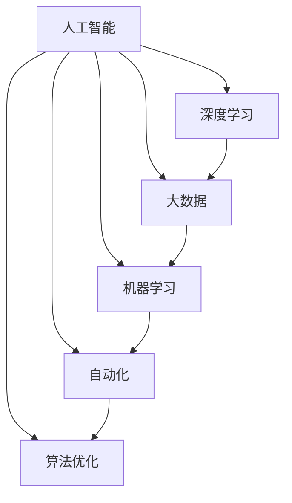

                 

# 塑造数字时代：人类计算的关键作用

> 关键词：数字时代, 人类计算, 人工智能, 深度学习, 大数据, 机器学习, 自动化, 算法优化

## 1. 背景介绍

### 1.1 问题由来

在21世纪的数字时代，计算已不再是单纯的技术问题，而是成为了推动社会进步、经济增长、科学创新的关键驱动力。随着信息技术的迅猛发展，数据量的指数级增长，计算范式的不断演进，我们进入了一个高度依赖计算能力的新纪元。而其中，人类计算作为一种独特的计算形式，以其特有的智能、灵活和创新，在数字时代的构建中扮演着关键角色。

### 1.2 问题核心关键点

人类计算的核心关键点在于其独特的智能与灵活性，这些特质使得人类计算在处理复杂、非结构化问题上具有不可替代的优势。而这种优势，在大数据时代，通过与人工智能（AI）、深度学习（DL）、大数据（Big Data）等前沿技术的深度结合，展现出了前所未有的潜力。本文将深入探讨人类计算在数字时代的作用，并分析其在人工智能领域的应用前景与挑战。

### 1.3 问题研究意义

深入理解人类计算在数字时代的关键作用，对促进人工智能技术的发展、推动社会经济的进步、优化科学研究的流程具有重要意义。通过探讨人类计算与现代计算技术的结合，可以揭示计算发展的全新路径，为构建智能化的未来提供理论依据与实践指导。

## 2. 核心概念与联系

### 2.1 核心概念概述

为更好地理解人类计算在数字时代的核心作用，本节将介绍几个密切相关的核心概念：

- **人工智能（Artificial Intelligence, AI）**：使计算机能够模拟人类智能行为的技术，如学习、推理、感知等。
- **深度学习（Deep Learning, DL）**：一种基于神经网络的人工智能技术，通过多层次的特征提取与数据训练，实现复杂的模式识别与决策。
- **大数据（Big Data）**：指规模大、速度快、种类多、价值密度低的数据集合，是大数据时代的重要计算对象。
- **机器学习（Machine Learning, ML）**：使计算机能够从数据中自动学习，并利用学习到的知识进行决策的算法。
- **自动化（Automation）**：通过算法与程序，自动完成重复性、规律性任务的过程，提高工作效率与精度。
- **算法优化（Algorithm Optimization）**：通过算法设计与优化，提升计算效率与性能的技术。

这些核心概念之间的逻辑关系可以通过以下Mermaid流程图来展示：



这个流程图展示了人工智能、深度学习、大数据、机器学习、自动化和算法优化这六个核心概念之间的相互关系：

1. 人工智能是整个计算领域的基础，它通过深度学习、大数据和机器学习等技术，推动了自动化和算法优化的发展。
2. 深度学习、大数据和机器学习分别从数据、模型和算法层面，支撑了人工智能的应用。
3. 自动化是人工智能应用的重要体现，通过算法优化进一步提高了自动化的效率与精确度。

这些概念共同构成了人类计算在数字时代的核心框架，使得人类计算得以在各个领域中发挥其独特的优势。

## 3. 核心算法原理 & 具体操作步骤
### 3.1 算法原理概述

人类计算的核心在于通过算法优化与自动化，高效处理复杂、非结构化的问题。在数字时代，这一原理通过与人工智能、深度学习和大数据的深度结合，展现出了更广泛的应用。

以深度学习为例，其核心原理是利用多层神经网络对输入数据进行特征提取与分类，实现复杂模式的自动识别与决策。这一过程，实质上是一种高效、智能的计算形式，与人类计算的智能与灵活性相辅相成。

### 3.2 算法步骤详解

基于深度学习的人工智能算法步骤通常包括：

1. **数据准备**：收集与处理训练数据，确保数据的有效性与多样性。
2. **模型构建**：选择适当的神经网络结构，设计优化算法。
3. **训练优化**：利用训练数据对模型进行训练，通过反向传播等算法优化模型参数。
4. **模型评估**：在验证数据上评估模型性能，确保模型泛化能力。
5. **模型应用**：将训练好的模型应用于实际问题，进行预测、分类、生成等操作。

### 3.3 算法优缺点

人类计算结合深度学习等技术，具备以下优点：

1. **高效处理复杂问题**：深度学习模型在处理复杂模式识别与分类问题上，具备极高的效率与精度。
2. **智能决策**：通过深度学习模型的自动学习机制，能够实现自主决策，减少人工干预。
3. **灵活适应**：深度学习模型能够根据数据的变化，不断优化与调整，适应不同的应用场景。

同时，也存在一些缺点：

1. **数据依赖**：深度学习模型需要大量标注数据进行训练，数据获取与标注成本较高。
2. **计算资源需求大**：深度学习模型通常需要高性能计算资源支持，对于小型企业或个人开发者较为困难。
3. **黑盒性质**：深度学习模型的内部工作机制难以解释，缺乏透明度与可解释性。

尽管存在这些缺点，人类计算结合深度学习等技术，已经在诸多领域取得了显著的成果，为数字时代的构建提供了重要动力。

### 3.4 算法应用领域

基于深度学习的人工智能算法在数字时代得到了广泛应用，覆盖了各个关键领域，例如：

1. **自然语言处理（Natural Language Processing, NLP）**：实现语言翻译、情感分析、文本分类等任务。
2. **计算机视觉（Computer Vision, CV）**：进行图像识别、物体检测、图像生成等操作。
3. **语音识别（Speech Recognition）**：实现语音转文本、情感识别、语音合成等任务。
4. **医疗健康（Healthcare）**：用于疾病诊断、医疗影像分析、健康监测等。
5. **金融科技（Fintech）**：实现信用评分、风险管理、金融预测等任务。
6. **智能制造（Smart Manufacturing）**：用于工业物联网、质量控制、生产优化等。

除了这些经典应用外，人工智能在智慧城市、教育、交通、安全等领域也展现了广阔的前景，推动了各行各业的数字化转型。

## 4. 数学模型和公式 & 详细讲解 & 举例说明

### 4.1 数学模型构建

人类计算与深度学习结合，通常涉及神经网络模型的构建。以全连接神经网络为例，其基本数学模型可以表示为：

$$
\text{output} = \text{sigmoid}(\text{w} \cdot \text{x} + \text{b})
$$

其中，$w$ 为权重矩阵，$b$ 为偏置向量，$\text{sigmoid}$ 为激活函数，$x$ 为输入向量，$\text{output}$ 为输出向量。

### 4.2 公式推导过程

以最简单的单层神经网络为例，其训练过程包括前向传播与反向传播两个步骤：

1. **前向传播**：
   $$
   \text{z} = \text{w} \cdot \text{x} + \text{b}
   $$
   $$
   \text{a} = \text{sigmoid}(\text{z})
   $$

2. **反向传播**：
   $$
   \frac{\partial \text{L}}{\partial \text{w}} = \frac{\partial \text{L}}{\partial \text{a}} \cdot \frac{\partial \text{a}}{\partial \text{z}} \cdot \frac{\partial \text{z}}{\partial \text{w}}
   $$
   $$
   \frac{\partial \text{L}}{\partial \text{b}} = \frac{\partial \text{L}}{\partial \text{a}} \cdot \frac{\partial \text{a}}{\partial \text{z}} \cdot \frac{\partial \text{z}}{\partial \text{b}}
   $$

其中，$\text{L}$ 为损失函数，$\frac{\partial \text{L}}{\partial \text{w}}$ 和 $\frac{\partial \text{L}}{\partial \text{b}}$ 分别为权重和偏置的梯度。通过梯度下降等优化算法，不断更新权重与偏置，最小化损失函数。

### 4.3 案例分析与讲解

以图像分类为例，利用深度学习模型进行图像识别。首先，收集大量的图像数据，并将其分为训练集、验证集和测试集。然后，将图像数据转化为神经网络可处理的矩阵形式，输入模型进行训练。在训练过程中，模型不断调整权重和偏置，以最小化分类错误的数量。最终，在测试集上评估模型的性能，并利用其对新的图像进行分类。

## 5. 项目实践：代码实例和详细解释说明

### 5.1 开发环境搭建

在进行深度学习项目实践前，我们需要准备好开发环境。以下是使用Python进行TensorFlow开发的环境配置流程：

1. 安装Anaconda：从官网下载并安装Anaconda，用于创建独立的Python环境。

2. 创建并激活虚拟环境：
```bash
conda create -n tf-env python=3.8 
conda activate tf-env
```

3. 安装TensorFlow：根据CUDA版本，从官网获取对应的安装命令。例如：
```bash
conda install tensorflow tensorflow-gpu -c conda-forge
```

4. 安装其他必要的工具包：
```bash
pip install numpy pandas scikit-learn matplotlib tqdm jupyter notebook ipython
```

完成上述步骤后，即可在`tf-env`环境中开始深度学习项目实践。

### 5.2 源代码详细实现

下面以图像分类任务为例，给出使用TensorFlow进行卷积神经网络（CNN）的图像分类的PyTorch代码实现。

首先，定义CNN模型：

```python
import tensorflow as tf
from tensorflow.keras import layers

model = tf.keras.Sequential([
    layers.Conv2D(32, (3, 3), activation='relu', input_shape=(28, 28, 1)),
    layers.MaxPooling2D((2, 2)),
    layers.Conv2D(64, (3, 3), activation='relu'),
    layers.MaxPooling2D((2, 2)),
    layers.Flatten(),
    layers.Dense(64, activation='relu'),
    layers.Dense(10, activation='softmax')
])
```

然后，定义数据集与模型训练：

```python
(x_train, y_train), (x_test, y_test) = tf.keras.datasets.mnist.load_data()

x_train = x_train.reshape(-1, 28, 28, 1) / 255.0
x_test = x_test.reshape(-1, 28, 28, 1) / 255.0

model.compile(optimizer='adam',
              loss='sparse_categorical_crossentropy',
              metrics=['accuracy'])

history = model.fit(x_train, y_train, epochs=10, batch_size=32, validation_data=(x_test, y_test))
```

最后，在测试集上评估模型：

```python
test_loss, test_acc = model.evaluate(x_test, y_test)
print('Test accuracy:', test_acc)
```

以上就是使用TensorFlow进行CNN图像分类的完整代码实现。可以看到，利用TensorFlow的高级API，我们可以用相对简洁的代码完成CNN模型的构建与训练。

### 5.3 代码解读与分析

让我们再详细解读一下关键代码的实现细节：

**Sequential模型定义**：
- `layers.Conv2D`：定义卷积层，其中`(3, 3)`为卷积核大小，`32`为卷积核数量，`relu`为激活函数。
- `layers.MaxPooling2D`：定义池化层，`(2, 2)`为池化窗口大小。
- `layers.Flatten`：将卷积层的输出展平为一维向量。
- `layers.Dense`：定义全连接层，`64`为神经元数量，`relu`为激活函数。
- `layers.Dense`：定义输出层，`10`为输出类别数量，`softmax`为激活函数。

**数据预处理**：
- `tf.keras.datasets.mnist.load_data()`：加载MNIST数据集，返回训练集和测试集的图像与标签。
- `x_train = x_train.reshape(-1, 28, 28, 1) / 255.0`：将图像数据转换为CNN可处理的张量形式，并归一化到0-1之间。

**模型训练与评估**：
- `model.compile`：配置优化器、损失函数和评估指标。
- `model.fit`：进行模型训练，指定训练集、验证集和批量大小。
- `model.evaluate`：在测试集上评估模型性能，返回损失和准确率。

可以看到，TensorFlow的高级API使得深度学习模型的构建与训练变得简洁高效。开发者可以将更多精力放在模型改进、数据处理等高层逻辑上，而不必过多关注底层的实现细节。

当然，工业级的系统实现还需考虑更多因素，如模型的保存和部署、超参数的自动搜索、更灵活的任务适配层等。但核心的深度学习计算图构建过程基本与此类似。

## 6. 实际应用场景

### 6.1 智能制造

基于深度学习的人工智能在智能制造领域具有广阔的应用前景。传统制造工艺复杂、周期长、成本高，而通过深度学习模型对生产过程进行优化，可以实现生产自动化、智能化和效率提升。

在技术实现上，可以收集生产过程中的传感器数据、图像数据和专家知识，构建监督数据集，在此基础上对深度学习模型进行微调。微调后的模型能够自动检测生产过程中的异常情况，优化生产流程，减少废品率，提高产品质量。

### 6.2 智慧城市

智慧城市建设是数字时代的重要应用场景之一。利用深度学习模型，可以实现交通流量预测、垃圾分类识别、能源管理优化等任务。

在交通流量预测方面，可以利用摄像头和传感器数据，训练深度学习模型对交通状况进行预测，优化交通信号控制，减少交通拥堵。在垃圾分类识别方面，可以通过图像分类模型自动识别垃圾种类，提高分类效率和准确率。在能源管理优化方面，利用深度学习模型对能源消耗进行实时监控和预测，优化能源使用策略，实现节能减排。

### 6.3 金融科技

金融科技领域也是深度学习模型应用的重要领域。利用深度学习模型，可以实现信用评分、风险管理、金融预测等任务。

在信用评分方面，可以通过分析用户的消费记录、社交数据等，训练深度学习模型进行信用评估，提高贷款审批效率和准确性。在风险管理方面，利用深度学习模型对市场数据进行实时分析，识别潜在的风险点，提前预警和应对。在金融预测方面，利用深度学习模型对经济数据进行分析，预测市场趋势，辅助投资决策。

### 6.4 未来应用展望

随着深度学习技术的发展，未来人类计算在数字时代的应用将更加广泛和深入。

1. **多模态计算**：未来深度学习模型将不仅仅处理单一模态的数据，而是能够融合视觉、听觉、文本等多种模态数据，提升计算的全面性和准确性。
2. **自动化系统**：深度学习模型将更多地应用于自动化系统中，如自动驾驶、无人仓库等，实现高效、可靠、安全的自动化生产。
3. **智能决策**：深度学习模型将与决策系统深度融合，提供智能化的决策支持，提升决策的科学性和精确度。
4. **个性化推荐**：深度学习模型将更好地理解和处理用户行为数据，提供个性化的推荐服务，提升用户体验。
5. **智能健康**：深度学习模型将应用于医疗影像分析、疾病诊断等领域，提高医疗服务的智能化水平。

以上趋势凸显了深度学习技术在数字时代的广泛应用，为构建更加智能、高效、可靠的数字社会提供了坚实基础。

## 7. 工具和资源推荐

### 7.1 学习资源推荐

为了帮助开发者系统掌握深度学习技术的原理与应用，这里推荐一些优质的学习资源：

1. **《深度学习》（Ian Goodfellow著）**：全面介绍深度学习的基本概念、算法原理和应用实例，是深度学习领域的经典教材。
2. **CS231n《卷积神经网络》课程**：斯坦福大学开设的深度学习课程，涵盖卷积神经网络的基本原理、模型设计和优化方法。
3. **DeepLearning.AI课程**：由Andrew Ng教授主讲的深度学习课程，从基础概念到应用实例，系统介绍深度学习技术。
4. **《TensorFlow实战Google深度学习框架》（方唯伟、郭婷婷著）**：系统介绍TensorFlow的原理、应用和最佳实践，是TensorFlow学习的必备资料。
5. **《深度学习入门与实践》（浅野敦也著）**：通过实际案例，深入浅出地介绍深度学习的基本原理和应用，适合初学者学习。

通过对这些资源的学习实践，相信你一定能够快速掌握深度学习技术的精髓，并用于解决实际的计算问题。

### 7.2 开发工具推荐

高效的开发离不开优秀的工具支持。以下是几款用于深度学习开发的常用工具：

1. **TensorFlow**：由Google主导开发的开源深度学习框架，支持分布式计算，生产部署方便，适合大规模工程应用。
2. **PyTorch**：Facebook开发的深度学习框架，具有动态计算图和灵活的API设计，适合快速迭代研究。
3. **Keras**：基于TensorFlow和Theano的高级API，易于上手，适合初学者快速构建深度学习模型。
4. **MXNet**：由Amazon开发的深度学习框架，支持分布式计算和动态图，适用于多种编程语言。
5. **Caffe**：由Berkeley大学开发的深度学习框架，适用于计算机视觉任务的实现。

合理利用这些工具，可以显著提升深度学习模型的开发效率，加快创新迭代的步伐。

### 7.3 相关论文推荐

深度学习技术的发展源于学界的持续研究。以下是几篇奠基性的相关论文，推荐阅读：

1. **《深度学习》（Ian Goodfellow、Yoshua Bengio、Aaron Courville著）**：全面介绍深度学习的基本概念、算法原理和应用实例，是深度学习领域的经典教材。
2. **《ImageNet大规模视觉识别挑战》（Alex Krizhevsky、Ilya Sutskever、Geoffrey Hinton著）**：提出AlexNet模型，标志着深度学习在计算机视觉领域的突破。
3. **《深度学习》（Yoshua Bengio、Ian Goodfellow、Aaron Courville著）**：介绍深度学习的基本原理、模型设计和优化方法，是深度学习领域的经典教材。
4. **《Deep Residual Learning for Image Recognition》（Kaiming He、Xiangyu Zhang、Shaoqing Ren、Jian Sun著）**：提出ResNet模型，解决深度网络训练中的梯度消失问题，进一步提升了深度学习的性能。
5. **《Attention is All You Need》（Ashish Vaswani、Noam Shazeer、Niki Parmar、Jakob Uszkoreit、Llion Jones、A N Gomez、Ian Kpolagni、Tsuji Yoshua、Markus Wieting、Geoffrey Hinton、Yacine Liptchush、Arnold Najim、Luka Orabasz、Yiru Qu、Eric Schuster、Qin Zhilin、Zhaoheng Yang、Han Zhang、Xiaodong He、Markus Müller著）**：提出Transformer模型，标志着自注意力机制在深度学习中的应用。

这些论文代表了大深度学习技术的发展脉络。通过学习这些前沿成果，可以帮助研究者把握学科前进方向，激发更多的创新灵感。

## 8. 总结：未来发展趋势与挑战

### 8.1 总结

本文对基于深度学习的人类计算在数字时代的作用进行了全面系统的介绍。首先阐述了深度学习与人类计算相结合的必要性与潜力，明确了深度学习技术在处理复杂、非结构化问题上的独特优势。其次，从原理到实践，详细讲解了深度学习的数学模型与关键步骤，给出了深度学习任务开发的完整代码实例。同时，本文还广泛探讨了深度学习技术在智能制造、智慧城市、金融科技等诸多领域的应用前景，展示了深度学习技术的广阔前景。

通过本文的系统梳理，可以看到，基于深度学习的人类计算技术正在成为数字时代的重要引擎，极大地推动了各行各业的数字化转型。未来，伴随深度学习技术的持续演进，人类计算必将迎来更加智能化、高效化的应用，为构建智能化的未来提供坚实基础。

### 8.2 未来发展趋势

展望未来，深度学习技术在数字时代的应用将呈现以下几个发展趋势：

1. **多模态深度学习**：深度学习模型将更多地融合视觉、听觉、文本等多种模态数据，提升计算的全面性和准确性。
2. **自动化系统**：深度学习模型将更多地应用于自动化系统中，实现高效、可靠、安全的自动化生产。
3. **智能决策**：深度学习模型将与决策系统深度融合，提供智能化的决策支持，提升决策的科学性和精确度。
4. **个性化推荐**：深度学习模型将更好地理解和处理用户行为数据，提供个性化的推荐服务，提升用户体验。
5. **智能健康**：深度学习模型将应用于医疗影像分析、疾病诊断等领域，提高医疗服务的智能化水平。

以上趋势凸显了深度学习技术在数字时代的广泛应用，为构建更加智能、高效、可靠的数字社会提供了坚实基础。

### 8.3 面临的挑战

尽管深度学习技术已经取得了显著的成果，但在迈向更加智能化、普适化应用的过程中，它仍面临着诸多挑战：

1. **数据依赖**：深度学习模型需要大量标注数据进行训练，数据获取与标注成本较高。
2. **计算资源需求大**：深度学习模型通常需要高性能计算资源支持，对于小型企业或个人开发者较为困难。
3. **模型复杂性**：深度学习模型结构复杂，难以解释和调试。
4. **过拟合问题**：深度学习模型容易过拟合，需要更多的正则化技术和超参数调整。
5. **安全性问题**：深度学习模型可能学习到有害信息，需要更严格的监管和安全措施。

尽管存在这些挑战，但未来的研究仍需在数据获取、模型设计、计算资源等方面进行优化与改进，以提升深度学习模型的性能与可靠性。

### 8.4 研究展望

面对深度学习面临的挑战，未来的研究需要在以下几个方面寻求新的突破：

1. **无监督与半监督学习**：探索不需要大量标注数据进行训练的深度学习模型，利用无监督和半监督学习技术，提高模型泛化能力。
2. **模型压缩与优化**：研究模型压缩与优化技术，提高模型的效率与性能，降低计算资源需求。
3. **可解释性与可控性**：提升深度学习模型的可解释性与可控性，确保模型的决策过程透明、可理解。
4. **多模态融合**：研究多模态数据的融合技术，提升深度学习模型的全面性和准确性。
5. **安全性与伦理性**：研究深度学习模型的安全性与伦理性，确保模型行为符合社会伦理与法律法规。

这些研究方向的探索，必将引领深度学习技术迈向更高的台阶，为构建更加智能、高效、可靠的数字社会提供坚实基础。

## 9. 附录：常见问题与解答

**Q1：深度学习与传统机器学习有何不同？**

A: 深度学习与传统机器学习的主要区别在于其模型的复杂性和数据的依赖性。传统机器学习模型通常需要手动设计特征，而深度学习模型可以自动从数据中提取高级特征。此外，深度学习模型通常需要大量的标注数据进行训练，而传统机器学习模型则可以在数据较少的情况下进行训练。

**Q2：深度学习模型的训练过程为何需要大量计算资源？**

A: 深度学习模型通常包含大量的神经元和参数，训练过程中需要进行大量的前向传播和反向传播计算，这需要高性能的计算资源支持。同时，深度学习模型通常需要复杂的优化算法进行参数更新，这也会消耗大量的计算资源。

**Q3：深度学习模型的泛化能力为何重要？**

A: 泛化能力是衡量深度学习模型在新数据上表现的重要指标。如果模型在训练数据上表现良好，但在新数据上表现不佳，则说明模型的泛化能力不足。泛化能力强的模型可以更好地适应实际应用场景，提高模型的实用性和可靠性。

**Q4：如何提升深度学习模型的泛化能力？**

A: 提升深度学习模型的泛化能力，可以从以下几个方面入手：
1. **数据增强**：通过增加数据的多样性，提高模型的泛化能力。
2. **正则化**：使用L2正则、Dropout等技术，避免过拟合。
3. **模型复杂度**：避免模型过于复杂，简化模型结构。
4. **超参数调优**：通过超参数调整，找到模型性能最优的参数组合。

**Q5：深度学习模型在实际应用中需要注意哪些问题？**

A: 深度学习模型在实际应用中需要注意以下问题：
1. **数据质量**：确保数据的准确性和多样性，避免数据偏见。
2. **计算资源**：选择合适的计算资源，避免资源浪费。
3. **模型解释性**：确保模型的决策过程透明、可理解。
4. **安全性与伦理性**：确保模型行为符合社会伦理与法律法规。

通过全面考虑这些问题，可以最大限度地提升深度学习模型的性能与可靠性，确保其在实际应用中的有效性和安全性。

---

作者：禅与计算机程序设计艺术 / Zen and the Art of Computer Programming

