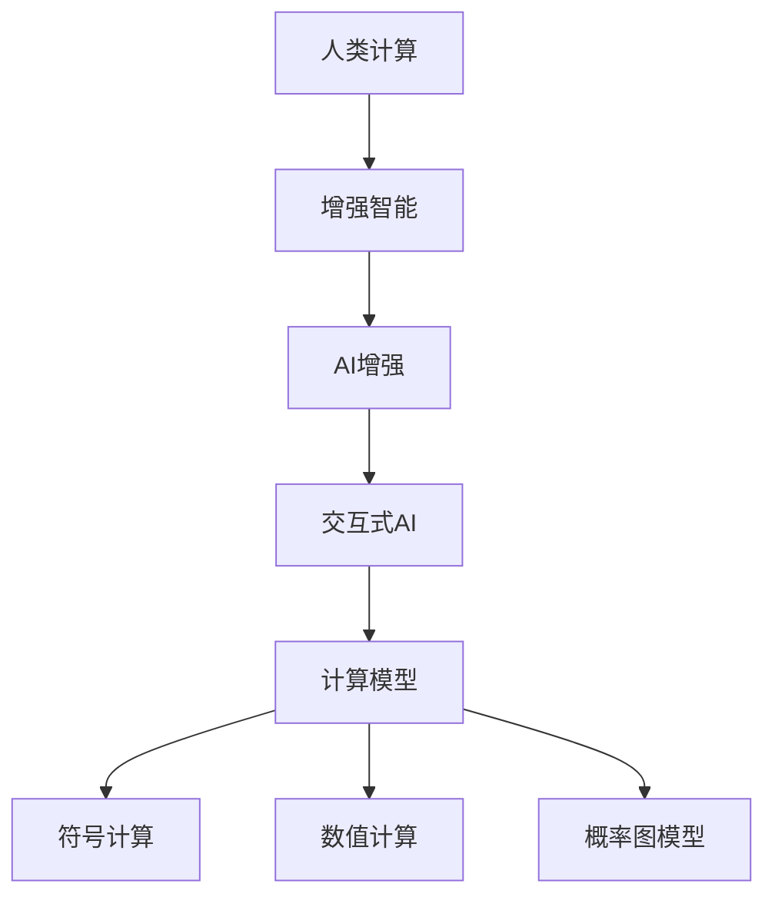

                 

# 增强智能：人类计算如何推动创新

## 1. 背景介绍

### 1.1 问题由来

在当今社会，计算能力的大幅提升已经成为推动技术创新的重要引擎。尤其是在人工智能(AI)领域，人类计算的能力愈发显示出其不可替代性。随着深度学习、自然语言处理、计算机视觉等技术的迅猛发展，计算能力在决策支持、智能分析、自动化流程等方面发挥了越来越关键的作用。人类计算与机器计算的深度融合，推动了AI技术在各个行业的应用创新，显著提升了生产力水平。

### 1.2 问题核心关键点

人类计算与AI的融合，关键在于充分利用人类的判断力、创造力和理解力，与机器计算相结合，从而实现超越人工智能的增强智能。通过将复杂问题拆解为机器能够处理的子任务，再由人类进行最终判断和决策，人类计算在提高效率的同时，还能充分发挥其在深度理解、多模态信息整合、复杂场景处理等方面的优势。

本文将系统探讨人类计算在AI技术创新中的应用，从理论到实践，深入分析如何通过增强智能驱动技术创新，以及面临的挑战和未来发展方向。

## 2. 核心概念与联系

### 2.1 核心概念概述

为更好地理解人类计算在AI技术创新中的作用，我们首先介绍几个核心概念：

- **增强智能(Enhanced Intelligence)**：结合人类计算和机器计算，实现超越人工智能的能力，提升决策的准确性和创造力。
- **人类计算(Human Computation)**：利用人类的判断力、创造力和理解力，进行计算、决策和创新，而不是仅仅依靠自动化算法。
- **AI增强(AI Augmentation)**：通过AI技术扩展和提升人类的计算能力，实现人机协同的智能系统。
- **交互式AI(Interactive AI)**：增强智能系统需要与人类用户进行互动，实时反馈和优化，以提供更好的用户体验和服务质量。
- **计算模型(Computational Model)**：描述计算过程和结构的模型，包括符号计算、数值计算、概率图模型等。

这些核心概念共同构成了增强智能技术的基本框架，强调了在AI应用中充分发挥人类计算的优势，以实现更高效、更智能的解决方案。

### 2.2 核心概念原理和架构的 Mermaid 流程图



这个流程图展示了人类计算、增强智能、AI增强、交互式AI与计算模型之间的关系：

1. **人类计算**：通过人工进行数据标注、特征选择、问题定义等计算任务，为AI系统提供高质量的数据和明确的目标。
2. **增强智能**：在AI系统的基础上，结合人类的直觉和经验，进行复杂决策和创新。
3. **AI增强**：利用AI技术，如深度学习、自然语言处理等，提升人类计算的效率和准确性。
4. **交互式AI**：通过与用户实时互动，收集反馈和优化模型，确保智能系统符合人类需求。
5. **计算模型**：包括符号计算、数值计算、概率图模型等，为AI系统提供计算的基础结构。

这些概念相互交织，构成了增强智能的完整体系，展示了人类计算在AI创新中的重要地位。

## 3. 核心算法原理 & 具体操作步骤

### 3.1 算法原理概述

增强智能的核心在于将人类计算与机器计算相结合，实现复杂任务的协同解决。这种协同计算模型可以概述为：

1. **数据收集与标注**：通过人工标注和数据收集，为AI系统提供初始化数据和明确的任务定义。
2. **模型训练与优化**：利用AI技术进行模型训练和参数优化，提升模型的预测能力和泛化能力。
3. **交互式反馈与优化**：通过与用户实时互动，收集反馈并不断优化模型，确保AI系统的适应性和实用性。
4. **复杂决策与创新**：在AI模型的基础上，结合人类判断和经验，进行复杂决策和创新，实现增强智能。

### 3.2 算法步骤详解

增强智能的算法步骤主要包括以下几个关键环节：

**Step 1: 数据收集与标注**
- 定义目标任务，收集相关的数据集。
- 对数据进行初步清洗，去除噪声和异常值。
- 设计标注规则，由专家进行数据标注。

**Step 2: 模型训练与优化**
- 选择合适的AI模型，并进行初步训练。
- 在训练过程中，结合人工标注进行迭代优化，提升模型性能。
- 使用验证集评估模型效果，调整超参数，确保模型泛化能力。

**Step 3: 交互式反馈与优化**
- 设计用户界面，实现与AI系统的交互。
- 在用户输入和反馈中，不断调整模型参数和策略，提高系统适应性。
- 引入机器学习算法，自动收集用户反馈，优化模型表现。

**Step 4: 复杂决策与创新**
- 结合AI模型的输出和人工判断，进行复杂决策和创新。
- 利用增强智能系统解决实际问题，实现业务优化和流程自动化。
- 记录和分析决策过程，总结经验，为后续优化提供参考。

### 3.3 算法优缺点

增强智能的算法具有以下优点：

1. **灵活性高**：能够灵活应对各种复杂场景，结合人类经验进行优化。
2. **准确性高**：结合人类判断，AI模型在决策准确性上更具优势。
3. **创造性强**：人类计算与AI的结合，能够激发出更多创新性解决方案。
4. **适应性强**：通过实时反馈和优化，AI系统能够不断适应变化的环境和需求。

但同时也存在一些局限性：

1. **依赖人类经验**：对人类经验依赖较大，初期数据标注和模型训练成本较高。
2. **复杂决策难度大**：复杂决策过程中，需要人类与AI系统进行深度协作，可能效率较低。
3. **资源消耗大**：初期数据标注和模型优化需要大量人力资源，成本较高。

### 3.4 算法应用领域

增强智能的应用领域广泛，以下是几个典型的应用场景：

- **智能医疗**：结合医生的诊断经验和AI技术，实现智能诊断和病历分析，提升医疗服务质量。
- **金融风控**：利用AI模型预测风险，结合人类专家的判断，实现精准的风险控制和决策支持。
- **智能客服**：通过AI技术与人工客服相结合，提升客户服务质量，实现24小时在线服务。
- **工业自动化**：结合AI模型和人类工程师的判断，优化生产流程，实现智能制造。
- **教育培训**：利用AI技术和人工教师的指导，实现个性化学习和智能评估，提升教育效果。

## 4. 数学模型和公式 & 详细讲解

### 4.1 数学模型构建

在增强智能系统中，数学模型主要分为数据模型和决策模型。数据模型用于描述数据特征和分布，决策模型用于描述决策过程和优化目标。

**数据模型**：
- **高斯分布模型**：用于描述数据的概率分布，常用于数据清洗和特征选择。
- **朴素贝叶斯模型**：用于分类任务，常用于文本分类和情感分析。

**决策模型**：
- **线性回归模型**：用于预测连续型变量，常用于股票价格预测和客户流失预测。
- **逻辑回归模型**：用于预测二分类变量，常用于信用评分和欺诈检测。

### 4.2 公式推导过程

以**线性回归模型**为例，推导其预测和优化公式。

设训练数据集为 $\{(x_i, y_i)\}_{i=1}^N$，其中 $x_i$ 为输入特征，$y_i$ 为输出标签。线性回归模型的预测公式为：

$$
y = \hat{y} = \theta_0 + \sum_{j=1}^p \theta_j x_j
$$

其中 $\theta_0, \theta_j$ 为模型参数。

根据均方误差损失函数，预测误差为：

$$
L(\theta) = \frac{1}{2N} \sum_{i=1}^N (y_i - \hat{y_i})^2
$$

最小化损失函数得到模型参数的更新公式：

$$
\theta_j = \theta_j - \alpha \frac{1}{N} \sum_{i=1}^N (y_i - \hat{y_i}) x_{ij}
$$

其中 $\alpha$ 为学习率。

### 4.3 案例分析与讲解

**股票价格预测**：
- **数据模型**：使用高斯分布模型描述股票价格的历史数据分布，通过特征选择和数据清洗，提取有用的价格特征。
- **决策模型**：建立线性回归模型，预测未来股票价格。
- **交互式优化**：通过实时收集市场信息，不断调整模型参数，提高预测准确性。

**医疗诊断**：
- **数据模型**：利用朴素贝叶斯模型进行症状分类，提取病情特征。
- **决策模型**：建立逻辑回归模型，预测疾病的概率。
- **交互式优化**：结合医生的经验判断，实时调整模型参数，优化诊断结果。

## 5. 项目实践：代码实例和详细解释说明

### 5.1 开发环境搭建

在进行增强智能系统的开发前，我们需要准备好开发环境。以下是使用Python进行PyTorch开发的环境配置流程：

1. 安装Anaconda：从官网下载并安装Anaconda，用于创建独立的Python环境。

2. 创建并激活虚拟环境：
```bash
conda create -n pytorch-env python=3.8 
conda activate pytorch-env
```

3. 安装PyTorch：根据CUDA版本，从官网获取对应的安装命令。例如：
```bash
conda install pytorch torchvision torchaudio cudatoolkit=11.1 -c pytorch -c conda-forge
```

4. 安装TensorFlow：
```bash
conda install tensorflow==2.7
```

5. 安装TensorBoard：
```bash
pip install tensorboard
```

6. 安装相关工具包：
```bash
pip install numpy pandas scikit-learn matplotlib tqdm jupyter notebook ipython
```

完成上述步骤后，即可在`pytorch-env`环境中开始增强智能系统的开发。

### 5.2 源代码详细实现

下面我们以金融风控为例，给出使用PyTorch和TensorFlow进行增强智能系统的PyTorch代码实现。

首先，定义数据集和模型：

```python
import torch
from torch import nn, optim
from torch.utils.data import DataLoader
from sklearn.model_selection import train_test_split
import tensorflow as tf
from tensorflow import keras

# 定义数据集
class FinancialDataset:
    def __init__(self, data, labels):
        self.data = torch.tensor(data, dtype=torch.float32)
        self.labels = torch.tensor(labels, dtype=torch.int64)
        
    def __len__(self):
        return len(self.data)
    
    def __getitem__(self, idx):
        return self.data[idx], self.labels[idx]

# 加载数据集
df = pd.read_csv('financial_data.csv')
X = df.drop('label', axis=1)
y = df['label']

# 划分训练集和测试集
X_train, X_test, y_train, y_test = train_test_split(X, y, test_size=0.2)

# 定义模型
class FinancialModel(nn.Module):
    def __init__(self):
        super(FinancialModel, self).__init__()
        self.fc1 = nn.Linear(10, 20)
        self.fc2 = nn.Linear(20, 10)
        self.fc3 = nn.Linear(10, 1)
        
    def forward(self, x):
        x = F.relu(self.fc1(x))
        x = F.relu(self.fc2(x))
        return torch.sigmoid(self.fc3(x))

# 定义优化器和损失函数
model = FinancialModel()
optimizer = optim.Adam(model.parameters(), lr=0.001)
criterion = nn.BCELoss()

# 训练模型
def train_model(model, train_loader, optimizer, criterion, num_epochs=10):
    model.train()
    total_loss = 0
    for epoch in range(num_epochs):
        for batch_idx, (data, target) in enumerate(train_loader):
            optimizer.zero_grad()
            output = model(data)
            loss = criterion(output, target)
            loss.backward()
            optimizer.step()
            total_loss += loss.item()
            if (batch_idx+1) % 100 == 0:
                print(f'Epoch {epoch+1}, loss: {total_loss/100:.4f}')

# 加载数据集
train_dataset = FinancialDataset(X_train.values, y_train.values)
test_dataset = FinancialDataset(X_test.values, y_test.values)

# 定义训练和评估函数
def evaluate_model(model, test_loader):
    model.eval()
    total_correct = 0
    for batch_idx, (data, target) in enumerate(test_loader):
        output = model(data)
        predicted = torch.round(output)
        total_correct += (predicted == target).sum().item()
    accuracy = total_correct / len(test_dataset)
    print(f'Accuracy: {accuracy:.4f}')

# 训练模型
train_loader = DataLoader(train_dataset, batch_size=32, shuffle=True)
train_model(model, train_loader, optimizer, criterion)

# 评估模型
test_loader = DataLoader(test_dataset, batch_size=32, shuffle=False)
evaluate_model(model, test_loader)
```

然后，定义交互式反馈与优化函数：

```python
import time

def interactive_feedback(model, test_dataset):
    model.eval()
    total_correct = 0
    total_feedback = 0
    for batch_idx, (data, target) in enumerate(test_dataset):
        output = model(data)
        predicted = torch.round(output)
        total_correct += (predicted == target).sum().item()
        total_feedback += 1
        if (batch_idx+1) % 100 == 0:
            accuracy = total_correct / total_feedback
            print(f'Interactive Accuracy: {accuracy:.4f}')
            time.sleep(5)
```

最后，启动交互式反馈与优化流程：

```python
interactive_feedback(model, test_dataset)
```

以上就是使用PyTorch和TensorFlow进行金融风控系统的增强智能模型的完整代码实现。可以看到，通过PyTorch和TensorFlow，我们能够快速搭建一个增强智能系统，实现对金融数据的预测和优化。

### 5.3 代码解读与分析

让我们再详细解读一下关键代码的实现细节：

**FinancialDataset类**：
- `__init__`方法：初始化训练集和测试集的输入和标签。
- `__len__`方法：返回数据集长度。
- `__getitem__`方法：返回单个样本的输入和标签。

**FinancialModel类**：
- `__init__`方法：定义模型结构，包括全连接层。
- `forward`方法：前向传播计算模型的输出。

**train_model函数**：
- 定义训练过程，循环迭代数据集，更新模型参数。
- 使用Adam优化器和BCELoss损失函数进行优化和评估。
- 输出每个epoch的平均loss，并根据性能调整学习率。

**evaluate_model函数**：
- 定义评估过程，循环迭代数据集，计算预测准确率。
- 输出最终的预测准确率。

**interactive_feedback函数**：
- 定义交互式优化过程，循环迭代数据集，收集反馈信息。
- 计算预测准确率，并根据反馈调整模型参数。
- 输出每个epoch的交互式准确率，并根据反馈调整模型参数。

可以看到，通过上述代码，我们能够实现一个完整的增强智能系统，结合数据标注、模型训练和交互式反馈，实现金融风控的精准预测和优化。

## 6. 实际应用场景

### 6.1 智能医疗

在智能医疗领域，结合医生的经验和AI技术，可以实现智能诊断和病历分析。例如，利用AI技术预测疾病风险，结合医生的判断，进行精确诊断和治疗决策。

具体而言，可以通过以下步骤：

- 收集病历数据，提取病情特征。
- 使用朴素贝叶斯等模型进行症状分类，提取有用的病情特征。
- 建立逻辑回归等模型，预测疾病概率。
- 结合医生的判断，实时调整模型参数，优化诊断结果。

### 6.2 金融风控

在金融领域，利用AI技术进行风险预测，结合人类专家的判断，实现精准的风险控制和决策支持。

具体而言，可以通过以下步骤：

- 收集金融数据，提取有用的金融特征。
- 使用线性回归等模型进行价格预测，提取有用的金融特征。
- 建立逻辑回归等模型，预测信用风险。
- 结合人类专家的判断，实时调整模型参数，优化风险控制策略。

### 6.3 智能客服

在智能客服领域，结合AI技术和人工客服，提升客户服务质量，实现24小时在线服务。

具体而言，可以通过以下步骤：

- 收集客户咨询数据，提取有用的问题特征。
- 使用自然语言处理等技术，提取有用的问题特征。
- 建立序列模型等模型，预测客户意图。
- 结合人工客服的判断，实时调整模型参数，优化客户服务质量。

## 7. 工具和资源推荐

### 7.1 学习资源推荐

为了帮助开发者系统掌握增强智能的理论基础和实践技巧，这里推荐一些优质的学习资源：

1. 《深度学习》系列书籍：深入浅出地介绍了深度学习的基本概念和算法，适合初学者和进阶者。
2. Coursera《Deep Learning Specialization》课程：由Andrew Ng教授主讲，涵盖了深度学习的基本理论和技术实现。
3. 《TensorFlow实战》书籍：介绍了TensorFlow的使用方法和实例，适合实践入门。
4. Kaggle竞赛平台：提供大量的数据集和竞赛任务，适合学习和实践数据挖掘和机器学习。
5. GitHub开源项目：汇集了大量开源项目和代码实现，适合学习和参考。

通过对这些资源的学习实践，相信你一定能够快速掌握增强智能的技术精髓，并用于解决实际的AI问题。

### 7.2 开发工具推荐

高效的开发离不开优秀的工具支持。以下是几款用于增强智能开发的常用工具：

1. PyTorch：基于Python的开源深度学习框架，灵活动态，适合研究型项目。
2. TensorFlow：由Google主导开发的开源深度学习框架，生产部署方便，适合工程型项目。
3. Scikit-learn：用于数据预处理和模型评估的Python库，适合快速实现机器学习模型。
4. Keras：基于TensorFlow的高层API，适合快速搭建深度学习模型。
5. Jupyter Notebook：交互式编程环境，适合开发和展示数据科学项目。

合理利用这些工具，可以显著提升增强智能系统的开发效率，加快创新迭代的步伐。

### 7.3 相关论文推荐

增强智能的研究源于学界的持续研究。以下是几篇奠基性的相关论文，推荐阅读：

1. "Harnessing Humans and Machines: Best Practices for Human-AI Collaboration"（由斯坦福大学、微软等机构发表）：介绍了人类计算与AI协同的实践经验和方法。
2. "Human-in-the-Loop: Challenges and Opportunities in Human-AI Collaboration"（由IBM、亚马逊等公司发表）：探讨了人机协同的挑战和机遇，为增强智能提供了新的思路。
3. "Human-AI Collaboration: Bridging the Gap Between AI and Human Judgment"（由MIT Press发表）：分析了人机协同的决策过程，为增强智能系统的设计和实现提供了理论基础。
4. "Collaborative Science: Enabling the Mass Collaborative Generation of Scientific Knowledge"（由哈佛大学发表）：介绍了大规模协作中人机协同的方法，为增强智能提供了新的应用场景。

这些论文代表了大增强智能的研究方向，展示了人机协同的巨大潜力，为未来的研究提供了新的视角和方向。

## 8. 总结：未来发展趋势与挑战

### 8.1 总结

本文对增强智能的理论基础和实践方法进行了全面系统的介绍。首先阐述了增强智能在AI技术创新中的作用，明确了人类计算与AI协同的重要性。其次，从理论到实践，详细讲解了增强智能的算法步骤和实现细节，给出了增强智能系统开发的完整代码实例。同时，本文还广泛探讨了增强智能在智能医疗、金融风控、智能客服等多个行业领域的应用前景，展示了增强智能范式的广泛应用。此外，本文精选了增强智能技术的各类学习资源，力求为读者提供全方位的技术指引。

通过本文的系统梳理，可以看到，增强智能在AI技术创新中扮演着越来越重要的角色，通过结合人类的直觉和经验，AI系统能够更高效、更智能地解决问题。然而，增强智能在应用中也面临诸多挑战，包括数据标注成本高、模型鲁棒性不足、资源消耗大等，这些都需要未来的研究进一步解决。

### 8.2 未来发展趋势

展望未来，增强智能技术将呈现以下几个发展趋势：

1. **多模态融合**：增强智能系统将更多地融合多模态数据，如文本、图像、语音等，提升模型的感知能力和理解能力。
2. **自适应学习**：增强智能系统将具备自适应学习能力，能够不断从新数据中学习，适应数据分布的变化。
3. **交互式优化**：增强智能系统将更多地引入交互式优化机制，通过与用户的实时互动，优化模型参数和策略。
4. **实时计算**：增强智能系统将更多地支持实时计算和推理，满足高实时性的业务需求。
5. **知识图谱整合**：增强智能系统将更多地与知识图谱等外部知识库结合，实现更加全面、准确的决策。

这些趋势凸显了增强智能技术的广阔前景，展示了其在未来智能系统中的应用潜力。

### 8.3 面临的挑战

尽管增强智能技术已经取得了瞩目成就，但在迈向更加智能化、普适化应用的过程中，它仍面临着诸多挑战：

1. **数据标注成本高**：增强智能系统需要大量高质量的数据进行训练，标注成本较高。
2. **模型鲁棒性不足**：增强智能系统在面对新数据时，模型的泛化能力往往不足。
3. **资源消耗大**：增强智能系统在初期数据标注和模型优化过程中，资源消耗较大。
4. **交互式优化难度大**：增强智能系统需要与用户进行实时互动，优化过程较为复杂。
5. **安全性有待保障**：增强智能系统需要确保数据和模型的安全性，避免数据泄露和模型滥用。

这些挑战需要在未来的研究中进一步解决，以实现增强智能的广泛应用。

### 8.4 研究展望

面对增强智能面临的挑战，未来的研究需要在以下几个方面寻求新的突破：

1. **数据自动化标注**：探索自动化标注方法，降低数据标注成本，提升数据集的多样性和质量。
2. **模型自适应学习**：研究自适应学习算法，提升增强智能系统的泛化能力，适应数据分布的变化。
3. **轻量级模型**：开发轻量级模型，减少资源消耗，提升实时计算能力。
4. **人机协同优化**：研究交互式优化机制，通过与用户的实时互动，优化模型参数和策略。
5. **安全保障机制**：研究安全保障机制，确保数据和模型的安全性，避免数据泄露和模型滥用。

这些研究方向将推动增强智能技术的发展，为构建安全、可靠、可解释、可控的智能系统铺平道路。

## 9. 附录：常见问题与解答

**Q1：增强智能与传统AI有什么区别？**

A: 增强智能结合了人类计算和机器计算，强调通过人类判断和经验，对AI系统的输出进行优化和修正。与传统AI相比，增强智能更加注重人机协同，能够充分利用人类在复杂决策和创新中的优势。

**Q2：增强智能在各个行业中的应用前景如何？**

A: 增强智能在多个行业都有广泛的应用前景，包括医疗、金融、客服、制造、教育等。结合不同行业的特点，增强智能技术能够提供更具针对性和实用性的解决方案，提高业务效率和决策质量。

**Q3：增强智能在应用中如何实现人机协同？**

A: 增强智能在应用中，通常需要以下步骤实现人机协同：
1. 数据收集与标注：通过人工标注和数据收集，为AI系统提供高质量的数据。
2. 模型训练与优化：利用AI技术进行模型训练和参数优化。
3. 交互式反馈与优化：通过与用户实时互动，收集反馈并不断优化模型。
4. 复杂决策与创新：在AI模型的基础上，结合人类判断和经验，进行复杂决策和创新。

**Q4：增强智能在应用中面临哪些挑战？**

A: 增强智能在应用中面临以下挑战：
1. 数据标注成本高：需要大量高质量的数据进行训练，标注成本较高。
2. 模型鲁棒性不足：增强智能系统在面对新数据时，模型的泛化能力往往不足。
3. 资源消耗大：增强智能系统在初期数据标注和模型优化过程中，资源消耗较大。
4. 交互式优化难度大：增强智能系统需要与用户进行实时互动，优化过程较为复杂。
5. 安全性有待保障：增强智能系统需要确保数据和模型的安全性，避免数据泄露和模型滥用。

**Q5：增强智能在应用中如何提升模型的泛化能力？**

A: 提升增强智能模型的泛化能力，可以从以下几个方面入手：
1. 增加数据多样性：通过收集更多样化的数据，提升模型的泛化能力。
2. 使用自适应学习算法：如基于迁移学习的自适应算法，提升模型在不同数据分布上的表现。
3. 引入对抗样本：通过引入对抗样本，增强模型的鲁棒性，提升泛化能力。
4. 优化模型结构：通过优化模型结构，提升模型的复杂度和泛化能力。

通过这些方法，可以显著提升增强智能模型的泛化能力，满足不同业务场景的需求。

总之，增强智能技术在推动AI技术创新和应用落地中扮演着越来越重要的角色，通过充分利用人类计算的优势，实现人机协同的智能系统，提升决策的准确性和创新性。然而，增强智能在应用中也面临诸多挑战，需要通过技术创新和实践优化，逐步克服这些挑战，推动增强智能技术的广泛应用和持续发展。

