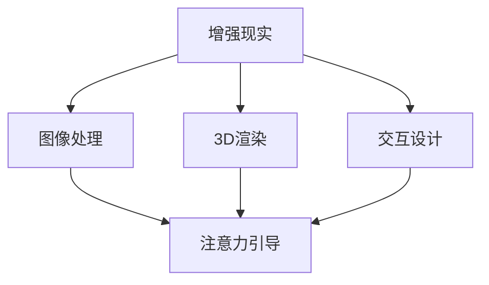

                 

# 增强现实技术在注意力引导中的作用

> 关键词：增强现实, 注意力引导, 深度学习, 神经网络, 计算机视觉, 自然交互, 人机协作

## 1. 背景介绍

增强现实技术（Augmented Reality，AR）作为计算机视觉与图形学的新兴领域，正在引发一场以直观体验为核心的技术革命。它不仅为人类提供了全新的信息交互方式，也为各种智能系统的设计带来了新的思考。尤其在注意力引导（Attention Guidance）方面，AR技术的作用日益凸显，推动着智能人机交互的创新与进步。

在实际应用中，用户往往需要在复杂的信息海洋中快速定位关键信息，而注意力引导就是通过增强现实技术实现这一功能的。例如，用户在查找地图上的地点时，可以通过AR技术将视线直接聚焦于目标位置，提升搜索效率。

本文档旨在详细探讨增强现实技术在注意力引导中的应用，梳理其基本原理、算法步骤、应用场景及未来趋势，并通过实际代码实现，展示其在具体场景中的应用。

## 2. 核心概念与联系

### 2.1 核心概念概述

增强现实（AR）技术结合现实世界与虚拟信息，通过头戴显示器（如AR眼镜）将计算机生成的虚拟信息叠加到用户眼中，形成实景增强的效果。其核心由图像处理、3D渲染、交互设计等多个子技术组成，共同为用户提供直观、沉浸的体验。

注意力引导（Attention Guidance）则是通过增强现实技术引导用户注意力，使其快速定位到目标信息。这不仅包括直接标注、提示，还包括路径规划、行为引导等多样化的形式。

### 2.2 核心概念原理和架构的 Mermaid 流程图



这个流程图展示了增强现实技术在注意力引导中的基本流程：首先，图像处理模块对现实场景进行捕捉和分析，3D渲染模块生成虚拟物体，交互设计模块与用户进行互动，而注意力引导模块则将这三个部分结合起来，共同引导用户注意力。

## 3. 核心算法原理 & 具体操作步骤

### 3.1 算法原理概述

注意力引导算法主要通过计算机视觉和深度学习技术实现。其基本流程为：
1. 捕捉并处理现实场景图像。
2. 通过深度学习模型检测目标，生成虚拟标记。
3. 将虚拟标记叠加到用户视野中，引导其注意力。

### 3.2 算法步骤详解

以下是注意力引导算法的主要操作步骤：

1. **场景捕捉与处理**：
   - 使用摄像头捕捉现实场景图像。
   - 对图像进行去噪、滤波、边缘检测等预处理操作。

2. **目标检测**：
   - 利用深度学习模型（如YOLO、Faster R-CNN）在处理后的图像中检测出目标位置。
   - 通过计算目标的位置和大小，生成虚拟标记。

3. **虚拟标记生成**：
   - 设计虚拟标记的形状和颜色，吸引用户注意。
   - 根据目标位置，在AR眼镜中叠加显示虚拟标记。

4. **注意力引导**：
   - 通过交互设计模块，引导用户指向虚拟标记。
   - 根据用户动作调整虚拟标记的大小和颜色，保持其可见性。

### 3.3 算法优缺点

**优点**：
1. 直观引导：AR技术提供的视觉引导直观、易用，用户可以快速定位到目标位置。
2. 个性化定制：用户可以根据自身需求定制虚拟标记的形状、大小、颜色等，提升使用体验。
3. 实时交互：结合深度学习模型的实时性，可以动态调整虚拟标记，提升引导效果。

**缺点**：
1. 硬件成本高：AR眼镜等设备成本较高，限制了技术的普及。
2. 复杂环境适应性差：在复杂环境中，目标检测的准确性和虚拟标记的可见性可能受到影响。
3. 算法依赖深度模型：依赖深度学习模型的准确性和计算能力，算法性能受限于数据量和模型复杂度。

### 3.4 算法应用领域

注意力引导技术广泛应用于以下领域：

- **智能导航**：通过AR技术引导用户快速定位地图上的地点，提升导航效率。
- **医疗诊断**：将虚拟标记叠加到手术图像上，引导医生注意重要部位，提升手术成功率。
- **工业制造**：在AR眼镜中显示设备状态和维修信息，帮助工人快速定位和修复问题。
- **教育培训**：通过虚拟标记标注教学内容，吸引学生注意力，提高学习效果。
- **游戏娱乐**：在AR游戏中，通过虚拟标记引导玩家探索游戏场景，提升游戏体验。

## 4. 数学模型和公式 & 详细讲解 & 举例说明

### 4.1 数学模型构建

注意力引导算法涉及多个数学模型，主要包括以下几个部分：
1. **图像处理模型**：用于捕捉和处理现实场景图像。
2. **目标检测模型**：利用深度学习模型在图像中检测目标。
3. **虚拟标记生成模型**：设计虚拟标记的形状、大小、颜色等。

### 4.2 公式推导过程

以目标检测模型为例，常用的目标检测算法有YOLO和Faster R-CNN。这里我们以YOLO为例进行推导：

YOLO（You Only Look Once）模型通过一个全卷积神经网络（CNN）同时预测目标的位置和大小，其基本原理为：
- 将输入图像划分为若干网格。
- 每个网格预测多个候选框及其类别概率。
- 通过计算候选框与目标的交并比（Intersection over Union，IOU），筛选出最匹配的候选框。

**公式推导**：
1. 网格划分：将输入图像划分为$n$个网格。
2. 目标预测：每个网格预测$m$个候选框及其类别概率。
3. 候选框筛选：计算每个候选框与目标的交并比，选取得分最高的候选框。

### 4.3 案例分析与讲解

以智能导航为例，我们可以使用YOLO模型进行目标检测，生成虚拟标记，并通过AR技术在用户眼前叠加显示，引导其注意目标地点。

具体实现步骤如下：
1. 通过摄像头捕捉用户周围的现实场景。
2. 使用YOLO模型在处理后的图像中检测目标地点。
3. 生成虚拟标记，通过AR眼镜将标记显示在用户眼前。
4. 引导用户指向标记，实现快速导航。

## 5. 项目实践：代码实例和详细解释说明

### 5.1 开发环境搭建

首先需要安装Python、OpenCV、YOLO模型（如yolov3）等库。

```bash
pip install opencv-python
pip install yolov3
```

### 5.2 源代码详细实现

以下是一个简单的Python代码实现：

```python
import cv2
import numpy as np

# 加载YOLO模型和类别标签
net = cv2.dnn.readNet("yolov3.weights", "yolov3.cfg")
classes = []
with open("coco.names", "r") as f:
    classes = [line.strip() for line in f.readlines()]

# 加载摄像头，获取图像
cap = cv2.VideoCapture(0)
while True:
    ret, frame = cap.read()
    if not ret:
        break

    # 预处理图像
    blob = cv2.dnn.blobFromImage(frame, 1/255.0, (416, 416), swapRB=True, crop=False)
    net.setInput(blob)
    layer_names = net.getLayerNames()
    output_layers = [layer_names[i[0] - 1] for i in net.getUnconnectedOutLayers()]
    outputs = net.forward(output_layers)

    # 检测目标，生成虚拟标记
    confidences = []
    boxes = []
    for output in outputs:
        for detection in output:
            scores = detection[5:]
            class_id = np.argmax(scores)
            confidence = scores[class_id]
            if confidence > 0.5:
                center_x = int(detection[0] * frame.shape[1])
                center_y = int(detection[1] * frame.shape[0])
                width = int(detection[2] * frame.shape[1])
                height = int(detection[3] * frame.shape[0])
                x = int(center_x - width / 2)
                y = int(center_y - height / 2)
                boxes.append([x, y, width, height])
                confidences.append(float(confidence))

    # 绘制虚拟标记
    indices = cv2.dnn.NMSBoxes(boxes, confidences, 0.5, 0.4)
    if len(indices) > 0:
        for i in indices:
            i = i[0]
            box = boxes[i]
            x, y, w, h = box
            cv2.rectangle(frame, (x, y), (x + w, y + h), (0, 255, 0), 2)
            cv2.putText(frame, classes[class_id], (x, y - 10), cv2.FONT_HERSHEY_PLAIN, 1, (0, 255, 0), 2)

    # 显示图像
    cv2.imshow("AR", frame)
    if cv2.waitKey(1) & 0xFF == ord('q'):
        break

# 释放摄像头和窗口
cap.release()
cv2.destroyAllWindows()
```

### 5.3 代码解读与分析

上述代码实现了YOLO模型在摄像头中的目标检测，并在检测到目标时，通过矩形框和文本标注虚拟标记。

**关键步骤**：
1. 加载YOLO模型和类别标签。
2. 使用OpenCV获取摄像头图像。
3. 预处理图像，并输入YOLO模型。
4. 获取模型输出的检测结果，包括坐标和置信度。
5. 筛选置信度高于阈值的候选框。
6. 在图像上绘制矩形框和文本标注。
7. 显示处理后的图像。

## 6. 实际应用场景

### 6.1 智能导航

在智能导航应用中，用户可以通过AR眼镜在复杂的城市环境中快速找到目的地。该技术不仅提升了导航效率，还减少了用户对纸质地图和导航应用的依赖。

### 6.2 医疗诊断

在医疗诊断场景中，医生可以通过AR眼镜在手术图像中实时标注重要区域，引导注意力，提高手术的精准度。

### 6.3 工业制造

在工业制造中，通过AR眼镜显示设备状态和维修信息，工人可以迅速定位问题并进行维护。

### 6.4 教育培训

在教育培训中，教师可以通过虚拟标记标注教学内容，吸引学生注意力，提高学习效果。

### 6.5 游戏娱乐

在游戏娱乐中，通过AR技术生成虚拟标记，引导玩家探索游戏场景，提升游戏体验。

## 7. 工具和资源推荐

### 7.1 学习资源推荐

1. **《深度学习入门：基于Python的理论与实现》**：详细讲解深度学习理论和实现方法，包括目标检测和AR技术的原理与应用。
2. **《计算机视觉：模型、学习与推理》**：介绍计算机视觉技术的各个方面，包括目标检测、图像处理、增强现实等。
3. **CS231n课程（斯坦福大学）**：提供计算机视觉和深度学习的高级课程，涵盖目标检测、图像处理等核心技术。

### 7.2 开发工具推荐

1. **OpenCV**：用于图像处理和计算机视觉，提供了丰富的图像处理函数和算法库。
2. **YOLO模型**：常用的目标检测模型，提供了预训练模型和训练脚本。
3. **ARKit/ARCore**：苹果和谷歌提供的增强现实开发框架，支持多种AR应用场景。

### 7.3 相关论文推荐

1. **YOLO: Real-Time Object Detection with a Single Neural Network Layer**：YOLO模型的主论文，介绍了YOLO的基本原理和实现方法。
2. **Papers with Code**：提供计算机视觉和深度学习领域的最新论文和代码，涵盖目标检测、增强现实等技术。

## 8. 总结：未来发展趋势与挑战

### 8.1 研究成果总结

本文档详细探讨了增强现实技术在注意力引导中的应用，包括基本原理、算法步骤、应用场景及未来趋势。通过代码实例展示了YOLO模型在实际场景中的应用，使读者对AR技术有了更深入的了解。

### 8.2 未来发展趋势

未来，增强现实技术在注意力引导领域将有以下发展趋势：
1. **多模态交互**：结合触觉、语音等多模态信息，提供更自然、互动的体验。
2. **实时处理**：通过优化算法和硬件，实现更快速的目标检测和虚拟标记生成。
3. **个性化定制**：根据用户偏好和习惯，定制虚拟标记的形状、大小和颜色。
4. **实时反馈**：通过用户反馈实时调整虚拟标记，提升引导效果。

### 8.3 面临的挑战

尽管增强现实技术在注意力引导中取得了显著进展，但仍面临以下挑战：
1. **硬件成本高**：AR眼镜等设备的成本较高，限制了技术的普及。
2. **算法复杂度高**：深度学习模型需要大量的计算资源和时间，模型训练和推理效率较低。
3. **实时性不足**：在复杂环境中，目标检测和虚拟标记的实时性可能受到影响。

### 8.4 研究展望

未来的研究将围绕以下几个方向展开：
1. **轻量级模型**：开发轻量级目标检测模型，降低硬件资源消耗，提升实时性。
2. **边缘计算**：利用边缘计算技术，实现更高效的模型推理和数据处理。
3. **多模态融合**：探索多模态信息的融合，提供更丰富、自然的用户交互体验。

## 9. 附录：常见问题与解答

**Q1: 增强现实技术在注意力引导中的优势是什么？**

A: 增强现实技术通过将虚拟信息叠加在现实世界中，可以直观、实时地引导用户注意力，提升搜索和操作效率。相比于传统的文字或图形界面，AR技术提供了一种更自然、直观的用户交互方式，特别是在复杂环境中的任务定位和导航等方面具有显著优势。

**Q2: 增强现实技术在哪些场景下应用较为广泛？**

A: 增强现实技术在智能导航、医疗诊断、工业制造、教育培训、游戏娱乐等领域有着广泛的应用前景。尤其在需要快速定位和操作的任务中，AR技术能够显著提升效率和准确性，为用户带来更好的体验。

**Q3: 如何克服增强现实技术在实际应用中的挑战？**

A: 为了克服硬件成本高、算法复杂度高、实时性不足等挑战，可以采用以下方法：
1. 开发轻量级模型，减少计算资源消耗。
2. 利用边缘计算技术，提升模型推理速度。
3. 探索多模态融合，提供更丰富、自然的交互方式。

---

作者：禅与计算机程序设计艺术 / Zen and the Art of Computer Programming

