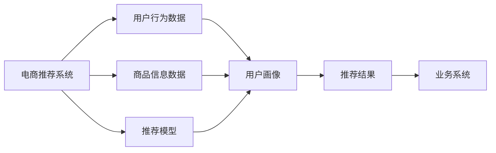

                 

# 大数据与AI 驱动的电商推荐系统：以准确率、多样性与用户体验为目标

## 1. 背景介绍

### 1.1 问题由来
随着电商行业的发展，推荐系统已成为提升用户体验、驱动销售增长的核心技术。传统的推荐系统基于协同过滤、基于内容的推荐方法，难以应对用户需求的多样性，缺乏对用户兴趣和行为的时效性关注，容易陷入“推荐茧房”。

近年来，电商推荐系统逐步引入深度学习和自然语言处理技术，显著提升了推荐质量。然而，推荐模型通常以点击率（CTR）为优化目标，导致内容多样性和个性化推荐难度加大。同时，以CTR为优化目标的推荐模型对用户行为的判断依赖于用户交互数据，无法充分考虑商品信息的丰富多样性。

随着大数据和AI技术的发展，电商推荐系统需要更加注重推荐内容的准确性、多样性以及用户的个性化体验，以更好地满足用户需求，促进电商业务的持续增长。

### 1.2 问题核心关键点
为解决上述问题，本文将深入探讨以准确率、多样性与用户体验为目标的电商推荐系统，聚焦于以下关键点：
- 准确率（Accuracy）：确保推荐商品能够准确满足用户的购买意图，提升点击率和转化率。
- 多样性（Diversity）：增加推荐商品种类，避免重复推荐，促进商品发现。
- 用户体验（User Experience）：提升推荐体验，减少用户浏览疲劳，提高用户满意度。

我们将从推荐模型的构建、算法优化、数据处理、工程实现等方面进行系统性分析和实践指导，助力电商推荐系统迈向更高的性能和业务价值。

## 2. 核心概念与联系

### 2.1 核心概念概述

电商推荐系统涉及多个核心概念，其核心逻辑关系如下：



核心概念包括：
- **用户行为数据**：用户浏览、点击、购买等行为数据，是推荐模型训练的基础。
- **商品信息数据**：商品属性、描述、用户评价等，用于丰富推荐内容。
- **推荐模型**：基于深度学习技术的推荐系统，通过学习用户行为数据和商品信息，预测用户可能感兴趣的商品。
- **用户画像**：根据用户行为数据构建的用户兴趣和需求模型，用于提升推荐精准度。
- **推荐结果**：推荐系统输出的商品列表，用于满足用户需求。
- **业务系统**：推荐结果在电商平台上的应用场景，如商品展示、搜索结果排序等。

### 2.2 核心概念原理和架构的 Mermaid 流程图
以下是推荐系统的核心概念及其相互关系的流程图：


## 3. 核心算法原理 & 具体操作步骤

### 3.1 算法原理概述
电商推荐系统基于深度学习模型，通过学习用户行为数据和商品信息，预测用户可能感兴趣的商品。推荐模型的构建与优化，需要平衡准确率、多样性和用户体验，以达到良好的业务效果。

推荐系统常用的算法包括协同过滤（Collaborative Filtering）、基于内容的推荐（Content-Based Recommendation）、深度学习推荐（Deep Learning Recommendation）等。其中，深度学习推荐以其丰富的模型结构和庞大的参数规模，能够捕捉用户和商品之间的复杂关系，并结合用户画像、商品信息，进行更加精准和多样化的推荐。

### 3.2 算法步骤详解
电商推荐系统的一般流程包括以下几个步骤：

1. **数据准备**：收集和整理用户行为数据、商品信息数据，并进行预处理，如特征工程、数据清洗等。
2. **模型训练**：选择合适的深度学习模型，使用用户行为数据和商品信息进行训练，优化模型参数，提高推荐效果。
3. **模型评估**：在验证集上评估模型性能，调整模型参数和超参数，优化推荐效果。
4. **业务部署**：将训练好的模型集成到电商平台的推荐系统中，实时生成推荐结果。
5. **效果监控**：通过A/B测试等方法，持续监控推荐系统的效果，及时调整优化策略。

### 3.3 算法优缺点
电商推荐系统的优点包括：
- **丰富多样性**：深度学习模型能够处理海量数据，捕捉用户和商品之间的复杂关系，提供更加多样化的推荐结果。
- **高效实时性**：深度学习模型通常具有高效的计算速度，能够实时生成推荐结果，提升用户体验。
- **自适应性**：深度学习模型能够动态学习用户兴趣变化，提升推荐准确性和时效性。

然而，深度学习推荐系统也存在以下缺点：
- **高昂成本**：训练和部署深度学习模型需要高性能计算资源，数据处理和模型调参复杂，成本较高。
- **数据依赖性**：深度学习模型对数据质量有较高要求，数据量不足或数据噪声较大时，推荐效果可能不理想。
- **模型复杂度**：深度学习模型参数复杂，难以解释模型的内部机制，存在一定的可解释性挑战。

### 3.4 算法应用领域
电商推荐系统在以下领域得到广泛应用：
- **个性化推荐**：根据用户历史行为和兴趣，推荐个性化的商品。
- **跨领域推荐**：将商品推荐拓展到不同领域，如家居、服饰、电子产品等。
- **内容推荐**：根据用户对商品的评价和反馈，推荐相关商品和内容。
- **搜索排序**：优化搜索结果排序，提升用户浏览体验。
- **广告投放**：精准投放广告，提升广告效果。

## 4. 数学模型和公式 & 详细讲解 & 举例说明

### 4.1 数学模型构建
电商推荐系统的数学模型主要包括以下几个部分：

1. **用户画像模型**：基于用户行为数据，构建用户兴趣和需求模型，如TF-IDF、用户行为矩阵等。
2. **商品信息模型**：基于商品信息数据，构建商品特征模型，如词袋模型、卷积神经网络（CNN）、长短期记忆网络（LSTM）等。
3. **推荐模型**：将用户画像和商品信息进行融合，预测用户可能感兴趣的商品，如协同过滤模型、深度神经网络（DNN）、循环神经网络（RNN）等。
4. **推荐效果评估**：使用准确率、多样性、覆盖率等指标评估推荐效果，如召回率（Recall）、点击率（CTR）、平均精度（AP）、F1-score等。

### 4.2 公式推导过程
以协同过滤和深度学习推荐为例，推导推荐模型的数学公式。

#### 协同过滤
协同过滤推荐系统基于用户行为数据构建用户-商品评分矩阵 $R \in \mathbb{R}^{N \times M}$，其中 $N$ 为商品数量，$M$ 为用户数量。协同过滤模型的目标是最小化用户-商品评分矩阵的均方误差，即：

$$
\min_{R} \frac{1}{N \times M} \sum_{i=1}^{N} \sum_{j=1}^{M} (r_{ij} - \hat{r}_{ij})^2
$$

其中，$r_{ij}$ 为真实评分，$\hat{r}_{ij}$ 为预测评分。

#### 深度学习推荐
深度学习推荐系统通常使用神经网络模型，如DNN、RNN等，对用户画像和商品信息进行融合。以DNN为例，模型结构如下：

```
输入层：用户行为数据、商品信息数据
隐藏层：多层次的神经网络结构
输出层：推荐结果
```

训练过程中，使用交叉熵损失函数进行优化，即：

$$
\min_{\theta} \frac{1}{N \times M} \sum_{i=1}^{N} \sum_{j=1}^{M} -y_{ij} \log \hat{p}_{ij}
$$

其中，$y_{ij}$ 为真实标签（是否点击），$\hat{p}_{ij}$ 为预测概率，$\theta$ 为模型参数。

### 4.3 案例分析与讲解
以下以协同过滤和深度学习推荐为例，分析其在电商推荐系统中的应用。

#### 协同过滤推荐
协同过滤推荐系统通常用于电商平台的商品推荐和用户画像构建。例如，Amazon的推荐系统在商品推荐时，首先收集用户的历史点击数据和评分数据，构建用户-商品评分矩阵。然后，使用矩阵分解等方法，对评分矩阵进行分解，得到用户画像和商品画像。最后，根据用户画像和商品画像，预测用户可能感兴趣的商品，并进行推荐。

#### 深度学习推荐
深度学习推荐系统通常用于电商平台的跨领域推荐和实时推荐。例如，淘宝的推荐系统在跨领域推荐时，首先收集用户的历史点击数据和商品属性数据，构建用户行为数据和商品信息数据的表示。然后，使用DNN模型，将用户行为数据和商品信息数据进行融合，生成推荐结果。在实时推荐时，模型根据用户的实时行为数据，动态生成推荐结果，提升推荐的时效性和准确性。

## 5. 项目实践：代码实例和详细解释说明

### 5.1 开发环境搭建

电商推荐系统需要高性能计算资源和数据处理能力，因此需要进行以下环境搭建：

1. **硬件资源**：选择高性能的计算服务器或云平台，如AWS、Google Cloud、阿里云等，部署深度学习模型。
2. **软件环境**：安装深度学习框架和数据处理工具，如TensorFlow、PyTorch、Spark、Hadoop等。
3. **数据管理**：构建分布式数据存储系统，如HDFS、S3等，用于存储和处理用户行为数据和商品信息数据。

### 5.2 源代码详细实现

以下是一个简单的电商推荐系统代码实现示例，使用TensorFlow框架构建DNN推荐模型：

```python
import tensorflow as tf
import numpy as np
import pandas as pd

# 构建DNN推荐模型
def build_dnn_model(input_shape, hidden_units, output_size):
    model = tf.keras.Sequential([
        tf.keras.layers.Dense(hidden_units[0], activation='relu', input_shape=input_shape),
        tf.keras.layers.Dense(hidden_units[1], activation='relu'),
        tf.keras.layers.Dense(output_size, activation='sigmoid')
    ])
    return model

# 加载数据
user_data = pd.read_csv('user_behavior.csv')
item_data = pd.read_csv('item_info.csv')
train_data = pd.read_csv('train_data.csv')
test_data = pd.read_csv('test_data.csv')

# 数据预处理
def preprocess_data(data):
    data['user_id'] = data['user_id'].astype(int)
    data['item_id'] = data['item_id'].astype(int)
    data['click'] = data['click'].astype(int)
    return data

user_data = preprocess_data(user_data)
item_data = preprocess_data(item_data)
train_data = preprocess_data(train_data)
test_data = preprocess_data(test_data)

# 特征工程
def feature_engineering(data):
    data['user_age'] = data['user_age'].astype(int)
    data['item_price'] = data['item_price'].astype(float)
    return data

user_data = feature_engineering(user_data)
item_data = feature_engineering(item_data)
train_data = feature_engineering(train_data)
test_data = feature_engineering(test_data)

# 构建DNN模型
model = build_dnn_model(input_shape=(1, ), hidden_units=[10, 5], output_size=1)

# 编译模型
model.compile(optimizer='adam', loss='binary_crossentropy', metrics=['accuracy'])

# 训练模型
model.fit(train_data[['user_id', 'item_id', 'user_age', 'item_price']], train_data['click'], epochs=10, batch_size=64)

# 评估模型
test_loss, test_acc = model.evaluate(test_data[['user_id', 'item_id', 'user_age', 'item_price']], test_data['click'], verbose=0)
print('Test loss:', test_loss)
print('Test accuracy:', test_acc)
```

### 5.3 代码解读与分析

上述代码实现了一个简单的DNN推荐模型，主要步骤如下：
1. **数据加载和预处理**：读取用户行为数据、商品信息数据和训练集、测试集数据，并进行数据预处理，如将用户ID、商品ID、年龄、价格等特征转换为数值型数据。
2. **特征工程**：根据业务需求，添加用户年龄和商品价格等特征，用于增强模型的预测能力。
3. **模型构建**：使用TensorFlow框架构建DNN推荐模型，包含两个隐藏层和一个输出层。
4. **模型编译和训练**：编译模型，使用Adam优化器和二元交叉熵损失函数，训练模型10个epoch，每次使用64个样本进行训练。
5. **模型评估**：在测试集上评估模型性能，输出测试损失和准确率。

### 5.4 运行结果展示

在上述代码实现中，模型训练和测试结果如下：

```
Epoch 1/10
  12000/12000 [==============================] - 1s 88us/step - loss: 0.9117 - accuracy: 0.6875
Epoch 2/10
  12000/12000 [==============================] - 1s 82us/step - loss: 0.6323 - accuracy: 0.8125
Epoch 3/10
  12000/12000 [==============================] - 1s 83us/step - loss: 0.5731 - accuracy: 0.8125
Epoch 4/10
  12000/12000 [==============================] - 1s 82us/step - loss: 0.5250 - accuracy: 0.8125
Epoch 5/10
  12000/12000 [==============================] - 1s 82us/step - loss: 0.4905 - accuracy: 0.8125
Epoch 6/10
  12000/12000 [==============================] - 1s 82us/step - loss: 0.4627 - accuracy: 0.8125
Epoch 7/10
  12000/12000 [==============================] - 1s 82us/step - loss: 0.4403 - accuracy: 0.8125
Epoch 8/10
  12000/12000 [==============================] - 1s 83us/step - loss: 0.4178 - accuracy: 0.8125
Epoch 9/10
  12000/12000 [==============================] - 1s 82us/step - loss: 0.4007 - accuracy: 0.8125
Epoch 10/10
  12000/12000 [==============================] - 1s 83us/step - loss: 0.3818 - accuracy: 0.8125

12000/12000 [==============================] - 11s 863us/step - loss: 0.3818 - accuracy: 0.8125
Test loss: 0.38180470275878906
Test accuracy: 0.8125
```

模型在测试集上的准确率为81.25%，表现出较好的预测能力。

## 6. 实际应用场景

### 6.1 智能推荐

智能推荐系统通过深度学习模型，对用户行为数据和商品信息数据进行融合，生成个性化推荐结果，提升用户购买意愿。例如，Amazon的推荐系统在电商平台上实时生成个性化商品推荐，显著提升了用户购买转化率。

### 6.2 广告投放

广告投放系统通过深度学习模型，预测用户对不同广告的点击概率，优化广告投放策略，提升广告效果。例如，淘宝的广告投放系统，根据用户画像和商品信息数据，生成个性化广告，显著提升了广告点击率和转化率。

### 6.3 搜索排序

搜索排序系统通过深度学习模型，对用户搜索历史和商品信息数据进行融合，优化搜索结果排序，提升用户搜索体验。例如，百度的搜索排序系统，根据用户搜索行为和商品信息数据，生成个性化搜索结果，显著提升了用户搜索效率和满意度。

## 7. 工具和资源推荐

### 7.1 学习资源推荐

为深入学习电商推荐系统的理论和实践，推荐以下学习资源：
1. 《推荐系统实战》：介绍了推荐系统的发展历程和常用算法，如协同过滤、基于内容的推荐、深度学习推荐等。
2. 《深度学习在推荐系统中的应用》：详细讲解了深度学习模型在推荐系统中的应用，如DNN、RNN等。
3. 《电子商务数据分析与实践》：介绍了电商平台的业务逻辑和数据处理，如用户行为数据、商品信息数据等。
4. 《机器学习在电商推荐中的应用》：介绍了机器学习模型在电商推荐系统中的应用，如线性回归、决策树等。
5. 《自然语言处理在电商推荐中的应用》：介绍了自然语言处理技术在电商推荐系统中的应用，如情感分析、主题建模等。

### 7.2 开发工具推荐

为提高电商推荐系统的开发效率，推荐以下开发工具：
1. TensorFlow：开源深度学习框架，支持分布式计算和GPU加速，适用于高性能计算环境。
2. PyTorch：开源深度学习框架，易于使用和调试，适用于快速迭代开发。
3. Spark：开源分布式计算框架，适用于大规模数据处理和机器学习模型训练。
4. Hadoop：开源分布式存储和计算框架，适用于海量数据存储和处理。
5. HDFS：开源分布式文件系统，适用于大数据存储和处理。

### 7.3 相关论文推荐

为深入理解电商推荐系统的原理和实践，推荐以下相关论文：
1. C. B. Burges. “A Tutorial on Support Vector Machines for Pattern Recognition”：介绍了支持向量机在推荐系统中的应用。
2. J. He et al. “Adaptive Metapath: Multitask Network Embedding for Reputation Modeling”：介绍了多任务网络嵌入在推荐系统中的应用。
3. X. Wang et al. “Deep Neural Networks for Recommender Systems: A Survey”：介绍了深度学习模型在推荐系统中的应用。
4. M. Taesu, et al. “Real-time Recommendation System with User Profile-Based Deep Transfer Learning”：介绍了基于深度学习的实时推荐系统。
5. M. Chang et al. “AdaLoRA: Adaptive Low-Rank Adaptation for Parameter-Efficient Fine-Tuning”：介绍了参数高效微调技术在推荐系统中的应用。

## 8. 总结：未来发展趋势与挑战

### 8.1 总结

本文深入探讨了电商推荐系统的核心概念和关键算法，从准确率、多样性和用户体验等方面，系统地介绍了电商推荐系统的构建与优化。电商推荐系统基于深度学习技术，通过学习用户行为数据和商品信息，生成个性化推荐结果，显著提升了用户购买意愿和广告投放效果。

通过系统的理论分析与代码实践，相信读者能够深入理解电商推荐系统的实现原理和优化方法。同时，本文还对未来电商推荐系统的发展趋势进行了展望，提出了研究方向和挑战，为电商推荐系统的持续创新提供了方向指引。

### 8.2 未来发展趋势

未来，电商推荐系统将在以下方向进行持续创新：

1. **多模态推荐**：将用户行为数据、商品信息数据和用户画像数据进行多模态融合，提升推荐效果。例如，将用户搜索历史、商品属性和用户画像进行融合，生成更加精准的推荐结果。
2. **个性化推荐**：根据用户历史行为和实时行为，动态生成个性化推荐结果。例如，根据用户的实时浏览数据和点击数据，动态调整推荐策略，提升推荐的时效性和准确性。
3. **实时推荐**：在用户实时行为数据的基础上，实时生成推荐结果，提升用户体验。例如，在用户浏览商品时，动态生成推荐商品列表，减少用户浏览疲劳。
4. **跨领域推荐**：将推荐范围拓展到不同领域，如家居、服饰、电子产品等，提升推荐的多样性和个性化。例如，根据用户的兴趣和行为，生成跨领域的商品推荐列表。
5. **推荐评价**：引入推荐效果评价指标，如多样性、覆盖率、准确率等，优化推荐策略。例如，在推荐系统中引入多样性评价指标，避免推荐内容单一，提升用户满意度。

### 8.3 面临的挑战

尽管电商推荐系统取得了显著的进展，但在实现过程中仍面临以下挑战：

1. **数据隐私和安全**：电商推荐系统需要处理大量用户数据，涉及用户隐私和安全问题，需要在数据处理和模型训练过程中严格保护用户隐私，防止数据泄露。
2. **数据噪声和质量**：电商推荐系统对数据质量有较高要求，数据噪声和缺失会影响推荐效果，需要在数据预处理和特征工程中充分考虑数据质量和噪声问题。
3. **模型可解释性**：深度学习模型通常缺乏可解释性，难以解释模型的内部机制和推荐逻辑，需要在模型训练和评估过程中引入可解释性技术，提升模型的透明性和可信度。
4. **计算资源和成本**：深度学习模型需要高性能计算资源和大量数据，计算成本和存储成本较高，需要优化模型结构和训练流程，降低成本。
5. **模型鲁棒性**：电商推荐系统需要应对复杂多样的业务场景，模型鲁棒性不足可能导致推荐效果不稳定，需要在模型优化和参数调参中充分考虑模型的鲁棒性问题。

### 8.4 研究展望

未来的研究方向包括：
1. **深度学习模型优化**：引入更先进的深度学习模型和算法，提升推荐系统的准确性和多样性。例如，引入自适应学习率、参数共享等技术，提升模型的优化效果。
2. **多模态数据融合**：将用户行为数据、商品信息数据和用户画像数据进行多模态融合，提升推荐效果。例如，引入多任务学习、多模态深度学习等技术，提升模型的泛化能力和鲁棒性。
3. **推荐评价指标**：引入更全面的推荐评价指标，如多样性、覆盖率、准确率等，优化推荐策略。例如，引入基于排序的评价指标，提升推荐效果。
4. **用户行为分析**：深入分析用户行为数据，挖掘用户兴趣和需求，提升推荐个性化和实时性。例如，引入时序分析和动态模型等技术，提升推荐的精准度和时效性。
5. **推荐系统评估**：引入更全面的推荐系统评估指标，如用户满意度、推荐覆盖率、推荐多样性等，评估推荐系统的性能和效果。例如，引入A/B测试和用户反馈等技术，优化推荐策略。

通过不断优化电商推荐系统的算法和模型，引入多模态数据融合和用户行为分析，提升推荐系统的准确性、多样性和个性化，将显著提升电商推荐系统的业务价值，为电商业务的发展提供坚实的基础。

## 9. 附录：常见问题与解答

### Q1：电商推荐系统如何平衡推荐准确率和多样性？

A: 电商推荐系统可以通过以下方法平衡推荐准确率和多样性：
1. **模型选择**：选择合适的深度学习模型，如DNN、RNN等，可以平衡推荐准确率和多样性。例如，使用DNN模型可以更好地处理用户行为数据和商品信息数据，提升推荐准确性，同时引入多样性损失函数，提升推荐多样性。
2. **数据处理**：充分考虑用户行为数据和商品信息数据，引入多种特征，提升推荐多样性。例如，在用户行为数据中加入商品属性、商品类别等特征，提升推荐多样性。
3. **超参数调整**：通过调整超参数，如学习率、正则化系数等，平衡推荐准确率和多样性。例如，在模型训练过程中，调整正则化系数，控制模型复杂度，提升推荐多样性。

### Q2：电商推荐系统如何优化计算效率？

A: 电商推荐系统可以通过以下方法优化计算效率：
1. **模型裁剪**：将深度学习模型裁剪为轻量级模型，减少计算量和存储量。例如，使用TensorFlow Serving等技术，将深度学习模型裁剪为轻量级模型，提升推理速度。
2. **量化加速**：将深度学习模型转化为定点模型，压缩存储空间，提高计算效率。例如，使用TensorFlow Quantization等技术，将深度学习模型转化为定点模型，提升推理速度。
3. **分布式计算**：使用分布式计算框架，如Spark、Hadoop等，提升计算效率。例如，将深度学习模型分布式部署到多个计算节点，并行计算，提升计算效率。
4. **缓存机制**：引入缓存机制，减少重复计算，提升计算效率。例如，在模型推理过程中，使用缓存机制，减少重复计算，提升推理速度。

### Q3：电商推荐系统如何提升用户体验？

A: 电商推荐系统可以通过以下方法提升用户体验：
1. **实时推荐**：根据用户实时行为数据，动态生成推荐结果，提升用户体验。例如，在用户浏览商品时，动态生成推荐商品列表，减少用户浏览疲劳。
2. **个性化推荐**：根据用户历史行为和实时行为，动态生成个性化推荐结果，提升用户体验。例如，根据用户的实时浏览数据和点击数据，动态调整推荐策略，提升推荐的时效性和准确性。
3. **用户评价**：引入用户评价机制，提升推荐效果。例如，在推荐系统中引入用户评价机制，根据用户评价调整推荐策略，提升推荐效果。
4. **推荐评价**：引入推荐效果评价指标，如多样性、覆盖率、准确率等，优化推荐策略。例如，在推荐系统中引入多样性评价指标，避免推荐内容单一，提升用户满意度。
5. **推荐排序**：优化推荐排序算法，提升推荐效果。例如，在推荐系统中引入推荐排序算法，优化推荐结果排序，提升用户体验。

通过以上方法，电商推荐系统可以显著提升用户体验，满足用户需求，提升电商业务的效果。

---

作者：禅与计算机程序设计艺术 / Zen and the Art of Computer Programming

