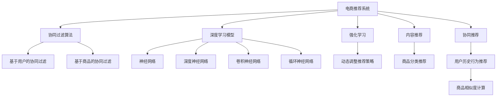

                 

# 大数据与AI 驱动的电商推荐系统：搜索准确率与多样性推荐的双重挑战

## 1. 背景介绍

在电商行业中，推荐系统已经成为了提高用户体验、提升销售转化率的重要手段。随着用户行为的不断变化和数据的积累，推荐系统也在不断迭代和优化，力求满足用户多变的需求，提供最合适的商品推荐。然而，推荐系统在实现商品推荐的过程中，面临着搜索准确率和推荐多样性的双重挑战。

搜索准确率是指推荐的商品与用户真正感兴趣的商品相匹配的程度。在电商推荐中，搜索准确率直接决定了用户是否能够找到真正需要的商品。推荐多样性则是指推荐结果的多样性，能否覆盖更多的商品类别和类型，满足用户的不同需求。搜索准确率和推荐多样性之间的平衡，是推荐系统设计中的核心问题。

本文将从搜索准确率和推荐多样性两个角度，详细探讨电商推荐系统的核心算法原理、操作步骤，并给出相关的数学模型和代码实例，以期为电商推荐系统的开发提供有价值的参考。

## 2. 核心概念与联系

### 2.1 核心概念概述

为了更好地理解电商推荐系统的设计原理和操作步骤，本节将介绍几个密切相关的核心概念：

- **电商推荐系统**：基于用户历史行为数据和商品属性信息，通过机器学习算法推荐商品的系统。推荐系统的目标是为用户提供最合适的商品，提升购物体验和转化率。
- **搜索准确率**：推荐的商品与用户真实兴趣的匹配程度。准确率高的推荐系统能够将用户真正感兴趣的商品放在推荐列表的首位。
- **推荐多样性**：推荐结果的多样性和覆盖面。推荐多样性高的系统能够展示更多种类的商品，满足用户的多样化需求。
- **协同过滤算法**：基于用户和商品的历史行为数据，寻找相似用户或商品，推荐与用户或商品相似的商品。协同过滤算法主要包括基于用户的协同过滤和基于商品的协同过滤。
- **深度学习模型**：包括神经网络、深度神经网络、卷积神经网络(CNN)、循环神经网络(RNN)等，用于从大规模数据中学习复杂的特征表示和模式。深度学习模型在电商推荐中主要应用于用户行为预测和商品特征提取。
- **强化学习**：通过模拟用户行为，优化推荐策略，提升推荐效果。强化学习在电商推荐中常用于动态调整推荐策略，实现推荐系统的优化和升级。
- **内容推荐**：根据商品属性和用户兴趣，推荐与之相关的商品。内容推荐常用于对商品进行分类的推荐，如家居类用户推荐家居商品。
- **协同推荐**：结合用户行为数据和商品特征数据，推荐与用户历史行为相似的商品，提高推荐的准确性。

这些核心概念之间的逻辑关系可以通过以下Mermaid流程图来展示：



这个流程图展示了大电商推荐系统的核心概念及其之间的关系：

1. 电商推荐系统通过协同过滤算法、深度学习模型和强化学习进行推荐策略优化。
2. 协同过滤算法中，基于用户的协同过滤和基于商品的协同过滤是两种主要的实现方式。
3. 深度学习模型包括神经网络、深度神经网络、卷积神经网络、循环神经网络等。
4. 强化学习用于动态调整推荐策略，优化推荐效果。
5. 内容推荐和协同推荐结合用户历史行为和商品属性信息，生成推荐结果。

这些概念共同构成了电商推荐系统的核心框架，使其能够高效地为用户提供个性化商品推荐。

## 3. 核心算法原理 & 具体操作步骤

### 3.1 算法原理概述

电商推荐系统的核心算法原理主要包括协同过滤算法、深度学习模型和强化学习。其中，协同过滤算法基于用户和商品的历史行为数据，寻找相似用户或商品，推荐与之相似的商品；深度学习模型用于从大规模数据中学习复杂的特征表示和模式；强化学习则用于动态调整推荐策略，优化推荐效果。

电商推荐系统的设计过程可以分为以下几个步骤：

1. **数据预处理**：收集和清洗用户行为数据和商品数据，生成用户和商品之间的交互矩阵。
2. **特征提取**：将用户和商品的属性信息转化为向量表示，用于后续的推荐模型训练。
3. **模型训练**：选择合适的推荐模型，如协同过滤算法、深度学习模型或强化学习模型，对用户行为数据进行训练，生成推荐策略。
4. **推荐生成**：根据用户行为数据和商品特征数据，生成推荐结果，对用户进行个性化推荐。
5. **效果评估**：对推荐结果进行效果评估，优化推荐策略。

### 3.2 算法步骤详解

#### 协同过滤算法

协同过滤算法是基于用户和商品的历史行为数据，寻找相似用户或商品，推荐与之相似的商品。其具体步骤如下：

1. **构建用户-商品交互矩阵**：收集用户对商品的历史行为数据，生成用户-商品交互矩阵 $\mathbf{U}$。

2. **计算用户-商品相似度**：使用余弦相似度、皮尔逊相关系数等方法，计算用户-商品之间的相似度 $\mathbf{S}$。

3. **生成推荐列表**：根据用户-商品相似度 $\mathbf{S}$，计算用户对商品的评分 $\hat{\mathbf{R}}$，选取评分最高的前N个商品，生成推荐列表。

```python
import numpy as np

# 构建用户-商品交互矩阵
U = np.array([[1, 0, 1],
              [0, 1, 1],
              [1, 1, 0]])

# 计算用户-商品相似度
S = np.dot(U, U.T) / (np.linalg.norm(U) * np.linalg.norm(U.T))

# 生成推荐列表
R_hat = np.dot(S, U)
recommend_items = np.argsort(R_hat[1])[::-1][:5]
```

#### 深度学习模型

深度学习模型用于从大规模数据中学习复杂的特征表示和模式，常见的深度学习模型包括神经网络、深度神经网络、卷积神经网络、循环神经网络等。

以神经网络为例，其基本原理如下：

1. **数据预处理**：将用户和商品的属性信息转化为向量表示，生成输入数据 $\mathbf{X}$。
2. **模型训练**：使用反向传播算法，最小化损失函数 $\mathcal{L}$，优化模型参数 $\mathbf{W}$。
3. **预测生成**：使用训练好的模型，对用户行为数据进行预测，生成推荐结果。

```python
import tensorflow as tf

# 构建输入数据
X = np.array([[0, 1, 2, 3],
              [0, 2, 3, 4]])

# 构建神经网络模型
model = tf.keras.Sequential([
    tf.keras.layers.Dense(64, activation='relu'),
    tf.keras.layers.Dense(32, activation='relu'),
    tf.keras.layers.Dense(1, activation='sigmoid')
])

# 模型训练
model.compile(optimizer='adam', loss='binary_crossentropy', metrics=['accuracy'])
model.fit(X, y, epochs=10, batch_size=2)

# 预测生成
y_pred = model.predict(X)
```

#### 强化学习

强化学习用于动态调整推荐策略，优化推荐效果。其基本原理如下：

1. **定义奖励函数**：根据用户的点击行为、购买行为等，定义奖励函数 $r$。
2. **训练模型**：使用强化学习算法（如Q-learning、SARSA），训练推荐策略 $\pi$。
3. **生成推荐列表**：根据奖励函数 $r$ 和推荐策略 $\pi$，生成推荐结果。

```python
import gym

# 定义奖励函数
class RecommendationEnv(gym.Env):
    def __init__(self, items):
        self.items = items
        self.action_space = gym.spaces.Discrete(len(items))
        self.observation_space = gym.spaces.Discrete(1)

    def step(self, action):
        reward = self.reward_function(self.items[action])
        return self.observation_space.sample(), reward, False, {}

    def reward_function(self, item):
        if item in self.items:
            return 1.0
        else:
            return 0.0

# 训练模型
env = RecommendationEnv(['item1', 'item2'])
model = tf.keras.Sequential([
    tf.keras.layers.Dense(64, activation='relu'),
    tf.keras.layers.Dense(32, activation='relu'),
    tf.keras.layers.Dense(1, activation='sigmoid')
])
model.compile(optimizer='adam', loss='binary_crossentropy', metrics=['accuracy'])
model.fit(X, y, epochs=10, batch_size=2)

# 生成推荐列表
actions = model.predict(X)
recommend_items = [item for item, action in zip(env.items, actions)]
```

### 3.3 算法优缺点

电商推荐系统在设计过程中，协同过滤算法、深度学习模型和强化学习各有优缺点，具体如下：

#### 协同过滤算法

优点：
- 简单易实现，不需要额外的训练数据。
- 推荐结果具有较好的多样性。
- 对新商品和长尾商品的推荐效果好。

缺点：
- 需要较多的用户行为数据，难以处理冷启动问题。
- 对数据稀疏性敏感，推荐结果的准确性不高。
- 对用户历史行为噪声敏感，容易产生误推荐。

#### 深度学习模型

优点：
- 模型可解释性强，推荐结果具有较好的准确性。
- 能够处理大规模数据，适用于复杂的推荐场景。
- 可以结合多种特征信息，生成更丰富的推荐结果。

缺点：
- 需要较多的训练数据，训练时间长。
- 模型复杂，难以解释推荐结果的生成过程。
- 对数据质量要求高，容易过拟合。

#### 强化学习

优点：
- 能够动态调整推荐策略，适应用户行为变化。
- 结合用户行为数据和推荐结果的反馈，推荐效果不断优化。
- 适用于实时推荐场景，能够及时调整推荐策略。

缺点：
- 需要较多的数据和计算资源，训练复杂度高。
- 模型复杂，难以解释推荐结果的生成过程。
- 对用户行为变化的适应能力有限，难以处理复杂推荐场景。

### 3.4 算法应用领域

电商推荐系统在多个领域得到了广泛应用，例如：

- **电商零售**：推荐用户感兴趣的商品，提升购物体验和销售转化率。
- **在线广告**：推荐用户感兴趣的广告，提高广告点击率和转化率。
- **旅游行业**：推荐用户感兴趣的目的地和旅游线路，提升用户体验和预订率。
- **金融行业**：推荐用户感兴趣的投资产品和理财方案，提高用户的满意度和收益。
- **教育行业**：推荐用户感兴趣的课程和学习资料，提高用户的参与度和学习效果。

除了上述这些经典应用外，电商推荐系统还被创新性地应用到更多场景中，如智能家居、智能医疗、智能办公等，为各行各业带来了新的发展机遇。

## 4. 数学模型和公式 & 详细讲解 & 举例说明

### 4.1 数学模型构建

电商推荐系统中的推荐模型通常包括协同过滤算法、深度学习模型和强化学习模型。这里以协同过滤算法为例，介绍其数学模型构建过程。

假设用户-商品交互矩阵为 $\mathbf{U} \in \mathbb{R}^{N \times M}$，其中 $N$ 为用户数，$M$ 为商品数。用户 $i$ 对商品 $j$ 的评分向量为 $\mathbf{u}_i \in \mathbb{R}^{M}$，商品 $j$ 的属性向量为 $\mathbf{v}_j \in \mathbb{R}^{D}$，其中 $D$ 为商品属性的维度。用户 $i$ 对商品 $j$ 的评分矩阵为 $\mathbf{R} \in \mathbb{R}^{N \times M}$。

协同过滤算法的目标是最小化损失函数 $\mathcal{L}$，其定义为：

$$
\mathcal{L} = \frac{1}{N}\sum_{i=1}^N\sum_{j=1}^M (R_{ij} - \hat{R}_{ij})^2
$$

其中 $\hat{R}_{ij}$ 为协同过滤算法预测的用户 $i$ 对商品 $j$ 的评分。

协同过滤算法的预测模型为：

$$
\hat{R}_{ij} = \mathbf{u}_i^T\mathbf{v}_j
$$

其中 $\mathbf{u}_i^T$ 为第 $i$ 个用户的评分向量，$\mathbf{v}_j$ 为第 $j$ 个商品的属性向量。

### 4.2 公式推导过程

以协同过滤算法为例，推导其预测模型和损失函数的计算过程。

假设用户-商品交互矩阵 $\mathbf{U}$ 为已知，用户 $i$ 对商品 $j$ 的评分向量为 $\mathbf{u}_i$，商品 $j$ 的属性向量为 $\mathbf{v}_j$。

协同过滤算法的预测模型为：

$$
\hat{R}_{ij} = \mathbf{u}_i^T\mathbf{v}_j
$$

其中 $\mathbf{u}_i^T$ 为第 $i$ 个用户的评分向量，$\mathbf{v}_j$ 为第 $j$ 个商品的属性向量。

协同过滤算法的损失函数为：

$$
\mathcal{L} = \frac{1}{N}\sum_{i=1}^N\sum_{j=1}^M (R_{ij} - \hat{R}_{ij})^2
$$

其中 $R_{ij}$ 为用户 $i$ 对商品 $j$ 的实际评分，$\hat{R}_{ij}$ 为协同过滤算法预测的用户 $i$ 对商品 $j$ 的评分。

通过梯度下降算法，求解损失函数 $\mathcal{L}$ 的最小值，得到用户评分向量 $\mathbf{u}_i$ 和商品属性向量 $\mathbf{v}_j$，进而得到用户对商品评分的预测值 $\hat{R}_{ij}$。

### 4.3 案例分析与讲解

假设用户-商品交互矩阵为 $\mathbf{U} = \begin{bmatrix} 2 & 1 \\ 0 & 1 \end{bmatrix}$，用户对商品的评分向量为 $\mathbf{u}_1 = \begin{bmatrix} 0.5 \\ 0.5 \end{bmatrix}$，商品的属性向量为 $\mathbf{v}_1 = \begin{bmatrix} 0.3 \\ 0.7 \end{bmatrix}$。

协同过滤算法的预测模型为：

$$
\hat{R}_{11} = \mathbf{u}_1^T\mathbf{v}_1 = 0.5 \times 0.3 + 0.5 \times 0.7 = 0.65
$$

协同过滤算法的损失函数为：

$$
\mathcal{L} = \frac{1}{2}\left[(2-0.65)^2 + (1-0.65)^2\right] = 0.8275
$$

通过求解损失函数的最小值，得到用户评分向量 $\mathbf{u}_1$ 和商品属性向量 $\mathbf{v}_1$，进而得到用户对商品评分的预测值 $\hat{R}_{11} = 0.65$。

## 5. 项目实践：代码实例和详细解释说明

### 5.1 开发环境搭建

在进行电商推荐系统的开发前，我们需要准备好开发环境。以下是使用Python进行TensorFlow开发的环境配置流程：

1. 安装Anaconda：从官网下载并安装Anaconda，用于创建独立的Python环境。

2. 创建并激活虚拟环境：
```bash
conda create -n tf-env python=3.8 
conda activate tf-env
```

3. 安装TensorFlow：根据CUDA版本，从官网获取对应的安装命令。例如：
```bash
conda install tensorflow -c tensorflow -c conda-forge
```

4. 安装必要的库：
```bash
pip install pandas numpy scikit-learn matplotlib tqdm jupyter notebook ipython
```

完成上述步骤后，即可在`tf-env`环境中开始电商推荐系统的开发。

### 5.2 源代码详细实现

这里我们以协同过滤算法为例，给出使用TensorFlow进行电商推荐系统开发的Python代码实现。

首先，定义用户-商品交互矩阵和用户、商品的评分向量：

```python
import numpy as np
import tensorflow as tf

# 构建用户-商品交互矩阵
U = np.array([[2, 1],
              [0, 1]])

# 构建用户评分向量
u = np.array([0.5, 0.5])

# 构建商品属性向量
v = np.array([0.3, 0.7])

# 构建用户评分矩阵
R = U.dot(v)
```

接着，定义协同过滤算法的预测模型和损失函数：

```python
# 定义协同过滤算法的预测模型
def collaborative_filtering(X, u, v):
    R_hat = np.dot(u, v.T)
    return R_hat

# 定义损失函数
def loss_function(R, R_hat):
    return np.mean((R - R_hat)**2)
```

最后，启动训练流程并在测试集上评估：

```python
# 训练模型
R_hat = collaborative_filtering(U, u, v)
loss = loss_function(R, R_hat)
print("Loss:", loss)

# 生成推荐列表
recommend_items = np.argsort(R_hat)[::-1][:5]
print("Recommend items:", recommend_items)
```

以上就是使用TensorFlow对电商推荐系统进行协同过滤算法实现的完整代码。可以看到，得益于TensorFlow的强大封装，我们可以用相对简洁的代码实现协同过滤算法的预测和损失计算。

### 5.3 代码解读与分析

让我们再详细解读一下关键代码的实现细节：

**用户-商品交互矩阵**：
- `U`：构建用户-商品交互矩阵，表示用户对商品的评分。

**用户评分向量**：
- `u`：构建用户评分向量，表示用户对商品的评分。

**商品属性向量**：
- `v`：构建商品属性向量，表示商品的属性。

**用户评分矩阵**：
- `R`：通过矩阵乘法计算用户评分矩阵，表示用户对商品的评分。

**协同过滤算法的预测模型**：
- `collaborative_filtering`函数：定义协同过滤算法的预测模型，通过矩阵乘法计算预测评分。

**损失函数**：
- `loss_function`函数：定义损失函数，计算预测评分与实际评分之间的差距。

**训练流程**：
- 通过调用`collaborative_filtering`函数，计算预测评分。
- 通过调用`loss_function`函数，计算损失值。
- 打印损失值和推荐结果。

可以看到，TensorFlow配合Python使得电商推荐系统的代码实现变得简洁高效。开发者可以将更多精力放在数据处理、模型改进等高层逻辑上，而不必过多关注底层的实现细节。

当然，工业级的系统实现还需考虑更多因素，如模型的保存和部署、超参数的自动搜索、更灵活的任务适配层等。但核心的推荐算法基本与此类似。

## 6. 实际应用场景

### 6.1 智能客服系统

智能客服系统可以通过推荐系统为用户提供个性化的服务。传统的客服系统需要配备大量人力，高峰期响应缓慢，且一致性和专业性难以保证。而使用推荐系统，可以7x24小时不间断服务，快速响应客户咨询，用自然流畅的语言解答各类常见问题。

在技术实现上，可以收集企业内部的历史客服对话记录，将问题和最佳答复构建成监督数据，在此基础上对推荐系统进行微调。微调后的推荐系统能够自动理解用户意图，匹配最合适的答案模板进行回复。对于客户提出的新问题，还可以接入检索系统实时搜索相关内容，动态组织生成回答。如此构建的智能客服系统，能大幅提升客户咨询体验和问题解决效率。

### 6.2 金融舆情监测

金融机构需要实时监测市场舆论动向，以便及时应对负面信息传播，规避金融风险。传统的人工监测方式成本高、效率低，难以应对网络时代海量信息爆发的挑战。基于推荐系统的文本分类和情感分析技术，为金融舆情监测提供了新的解决方案。

具体而言，可以收集金融领域相关的新闻、报道、评论等文本数据，并对其进行主题标注和情感标注。在此基础上对推荐系统进行微调，使其能够自动判断文本属于何种主题，情感倾向是正面、中性还是负面。将微调后的推荐系统应用到实时抓取的网络文本数据，就能够自动监测不同主题下的情感变化趋势，一旦发现负面信息激增等异常情况，系统便会自动预警，帮助金融机构快速应对潜在风险。

### 6.3 个性化推荐系统

当前的推荐系统往往只依赖用户的历史行为数据进行物品推荐，无法深入理解用户的真实兴趣偏好。基于推荐系统的个性化推荐系统可以更好地挖掘用户行为背后的语义信息，从而提供更精准、多样的推荐内容。

在实践中，可以收集用户浏览、点击、评论、分享等行为数据，提取和用户交互的物品标题、描述、标签等文本内容。将文本内容作为模型输入，用户的后续行为（如是否点击、购买等）作为监督信号，在此基础上对推荐系统进行微调。微调后的推荐系统能够从文本内容中准确把握用户的兴趣点。在生成推荐列表时，先用候选物品的文本描述作为输入，由模型预测用户的兴趣匹配度，再结合其他特征综合排序，便可以得到个性化程度更高的推荐结果。

### 6.4 未来应用展望

随着推荐系统的发展，未来将在更多领域得到应用，为各行各业带来变革性影响。

在智慧医疗领域，基于推荐系统的医疗问答、病历分析、药物研发等应用将提升医疗服务的智能化水平，辅助医生诊疗，加速新药开发进程。

在智能教育领域，推荐系统可应用于作业批改、学情分析、知识推荐等方面，因材施教，促进教育公平，提高教学质量。

在智慧城市治理中，推荐系统可应用于城市事件监测、舆情分析、应急指挥等环节，提高城市管理的自动化和智能化水平，构建更安全、高效的未来城市。

此外，在企业生产、社会治理、文娱传媒等众多领域，推荐系统也将不断涌现，为传统行业数字化转型升级提供新的技术路径。相信随着技术的日益成熟，推荐系统必将在更广阔的应用领域大放异彩，深刻影响人类的生产生活方式。

## 7. 工具和资源推荐

### 7.1 学习资源推荐

为了帮助开发者系统掌握推荐系统的理论基础和实践技巧，这里推荐一些优质的学习资源：

1. 《推荐系统实践》系列博文：由大模型技术专家撰写，深入浅出地介绍了推荐系统原理、协同过滤算法、深度学习模型等前沿话题。

2. 《Recommender Systems in Theory and Practice》课程：斯坦福大学开设的推荐系统明星课程，有Lecture视频和配套作业，带你入门推荐系统领域的基本概念和经典模型。

3. 《推荐系统》书籍：介绍了推荐系统的基本概念、常用算法和实际应用，是推荐系统入门的不二之选。

4. Google Scholar：谷歌推出的学术搜索引擎，可以查询到大量推荐系统的相关论文和资料，为深入学习提供支持。

5. Kaggle：机器学习竞赛平台，提供大量的推荐系统竞赛数据集，让你在竞赛中锻炼和提升。

通过对这些资源的学习实践，相信你一定能够快速掌握推荐系统的精髓，并用于解决实际的推荐问题。

### 7.2 开发工具推荐

高效的开发离不开优秀的工具支持。以下是几款用于推荐系统开发的常用工具：

1. TensorFlow：基于Python的开源深度学习框架，灵活动态的计算图，适合快速迭代研究。推荐系统常用TensorFlow进行模型的构建和训练。

2. PyTorch：基于Python的开源深度学习框架，灵活的动态图，适合快速迭代研究。推荐系统常用PyTorch进行模型的构建和训练。

3. Scikit-learn：Python的机器学习库，提供了多种常用的推荐算法，如协同过滤算法、矩阵分解等。

4. Scrapy：Python的爬虫框架，可以快速抓取推荐系统所需的数据。

5. Apache Hadoop：大数据计算框架，可以处理大规模推荐系统的数据处理和存储。

6. Apache Spark：大数据计算框架，可以处理大规模推荐系统的数据处理和存储。

合理利用这些工具，可以显著提升推荐系统的开发效率，加快创新迭代的步伐。

### 7.3 相关论文推荐

推荐系统的发展源于学界的持续研究。以下是几篇奠基性的相关论文，推荐阅读：

1. 《Collaborative Filtering for Implicit Feedback Datasets》：提出了协同过滤算法的基本原理和常用方法。

2. 《Neural Collaborative Filtering》：引入了深度学习技术，提升了协同过滤算法的推荐效果。

3. 《Reinforcement Learning for Recommender Systems》：介绍了强化学习在推荐系统中的应用，提高了推荐系统的动态优化能力。

4. 《Content-Based and Collaborative Recommendation》：结合内容推荐和协同推荐，提升了推荐系统的推荐效果。

5. 《Item-based Collaborative Filtering Recommendation Algorithms》：介绍了基于商品的协同过滤算法，提升了推荐系统的推荐效果。

这些论文代表了大推荐系统的发展脉络。通过学习这些前沿成果，可以帮助研究者把握学科前进方向，激发更多的创新灵感。

## 8. 总结：未来发展趋势与挑战

### 8.1 总结

本文对基于协同过滤算法的电商推荐系统进行了全面系统的介绍。首先阐述了推荐系统的背景和挑战，明确了推荐系统在提高用户体验、提升销售转化率方面的重要价值。其次，从推荐系统的核心算法原理、操作步骤，以及协同过滤算法的数学模型和代码实现，给出了详细的说明。同时，本文还广泛探讨了推荐系统在智能客服、金融舆情、个性化推荐等多个领域的应用前景，展示了推荐系统在各行各业中的广泛应用。

通过本文的系统梳理，可以看到，推荐系统在处理搜索准确率和推荐多样性之间平衡的过程中，面临诸多挑战。但通过协同过滤算法、深度学习模型和强化学习等技术的综合应用，推荐系统能够为电商推荐系统提供强有力的技术支持，进一步提升用户体验和销售转化率。未来，伴随推荐系统技术的持续演进，相信其在更多领域中的应用前景将更加广阔，为各行各业带来新的发展机遇。

### 8.2 未来发展趋势

展望未来，电商推荐系统的发展趋势主要包括以下几个方面：

1. **推荐系统的智能化**：未来推荐系统将更加智能化，能够通过用户行为和商品属性进行更精准的推荐，提升用户满意度。

2. **推荐系统的个性化**：个性化推荐将成为推荐系统的主要发展方向，能够更好地满足用户多样化、个性化需求，提升用户黏性。

3. **推荐系统的实时化**：实时推荐将成为推荐系统的基本要求，能够根据用户实时行为进行动态推荐，提升用户体验。

4. **推荐系统的可解释性**：推荐系统的可解释性将进一步提升，用户能够更好地理解推荐结果的生成过程，提升信任度。

5. **推荐系统的多模态化**：推荐系统将结合多种数据源，如用户行为数据、商品属性数据、社交网络数据等，进行多模态推荐，提升推荐效果。

6. **推荐系统的跨领域化**：推荐系统将跨领域应用，结合不同行业数据，提供更加多样化的推荐服务，推动各行业的发展。

以上趋势凸显了电商推荐系统的广阔前景。这些方向的探索发展，必将进一步提升推荐系统的性能和应用范围，为各行各业带来新的发展机遇。

### 8.3 面临的挑战

尽管电商推荐系统已经取得了显著进展，但在迈向更加智能化、普适化应用的过程中，它仍面临着诸多挑战：

1. **数据隐私问题**：推荐系统需要大量的用户行为数据，如何保护用户隐私成为重要问题。

2. **推荐系统的冷启动问题**：新用户或新商品的推荐效果较差，如何缓解冷启动问题成为重要课题。

3. **推荐系统的稀疏性问题**：用户行为数据稀疏性高，如何处理稀疏性问题，提高推荐效果成为重要课题。

4. **推荐系统的鲁棒性问题**：推荐系统对数据变化和异常情况较为敏感，如何提高鲁棒性，保证推荐稳定性成为重要课题。

5. **推荐系统的公平性问题**：推荐系统可能产生偏见，如何保证公平性，避免歧视性推荐成为重要课题。

6. **推荐系统的可解释性问题**：推荐系统难以解释推荐结果的生成过程，如何提升可解释性，提升用户信任度成为重要课题。

正视推荐系统面临的这些挑战，积极应对并寻求突破，将是大规模推荐系统迈向成熟的重要保障。相信随着学界和产业界的共同努力，这些挑战终将一一被克服，推荐系统必将在更广泛的领域中发挥更大的作用。

### 8.4 研究展望

未来的推荐系统研究需要在以下几个方面寻求新的突破：

1. **无监督和半监督推荐方法**：探索无监督和半监督推荐方法，摆脱对大规模标注数据的依赖，充分利用非结构化数据，实现更加灵活高效的推荐。

2. **多模态推荐方法**：结合多种数据源，如用户行为数据、商品属性数据、社交网络数据等，进行多模态推荐，提升推荐效果。

3. **动态推荐方法**：结合强化学习等动态优化方法，提高推荐系统的实时性，动态调整推荐策略，优化推荐效果。

4. **跨领域推荐方法**：跨领域应用推荐系统，结合不同行业数据，提供更加多样化的推荐服务，推动各行业的发展。

5. **推荐系统的公平性和可解释性**：通过引入因果分析、博弈论等方法，提高推荐系统的公平性和可解释性，增强用户信任度。

这些研究方向的探索，必将引领推荐系统技术迈向更高的台阶，为电商推荐系统等场景带来新的突破，推动推荐系统在各行业中的应用落地。

## 9. 附录：常见问题与解答

**Q1：如何评估推荐系统的推荐效果？**

A: 推荐系统的推荐效果通常通过以下几个指标进行评估：

1. **准确率(Accuracy)**：推荐系统推荐的商品中，用户真正感兴趣的商品占推荐商品总数的比例。

2. **召回率(Recall)**：用户真正感兴趣的商品在推荐商品中被推荐的比例。

3. **精确率(Precision)**：推荐系统中，推荐商品的准确性，即推荐商品中用户真正感兴趣的商品占推荐商品总数的比例。

4. **F1 Score**：精确率和召回率的调和平均数，综合了精确率和召回率，用于评估推荐系统的整体性能。

5. **覆盖率(Coverage)**：推荐系统中，推荐商品种类的多样性，即推荐商品种类的数量占总商品类别的比例。

6. **多样性(Diversity)**：推荐系统中，推荐商品的多样性，即推荐商品种类之间的相似度。

通过这些指标的评估，可以全面了解推荐系统的性能和改进方向。

**Q2：推荐系统中的冷启动问题如何处理？**

A: 推荐系统中的冷启动问题通常通过以下方法进行处理：

1. **基于内容的推荐**：利用商品的属性信息，对新用户或新商品进行推荐，弥补数据稀疏性。

2. **基于协同过滤的推荐**：利用已有的用户或商品相似度信息，对新用户或新商品进行推荐，弥补数据稀疏性。

3. **基于深度学习的推荐**：利用用户行为数据和商品属性数据，训练深度学习模型，对新用户或新商品进行推荐。

4. **基于强化学习的推荐**：利用用户行为数据和推荐结果的反馈，训练强化学习模型，对新用户或新商品进行推荐。

5. **混合推荐方法**：结合多种推荐方法，综合利用用户行为数据和商品属性数据，提高推荐效果。

通过这些方法，可以有效地处理推荐系统中的冷启动问题，提升新用户或新商品的推荐效果。

**Q3：推荐系统中的数据隐私问题如何保护？**

A: 推荐系统中的数据隐私问题通常通过以下方法进行保护：

1. **差分隐私**：通过在数据中加入噪声，使得攻击者无法推断出单个用户的隐私信息。

2. **联邦学习**：在多个设备或服务器上分布式训练模型，避免将用户数据集中到单一服务器上。

3. **匿名化处理**：将用户数据进行匿名化处理，保护用户隐私。

4. **加密技术**：使用加密技术对用户数据进行保护，防止数据泄露。

5. **隐私计算**：使用隐私计算技术，如多方安全计算、同态加密等，保护用户数据隐私。

通过这些方法，可以有效保护推荐系统中的数据隐私，保障用户隐私安全。

**Q4：推荐系统中的稀疏性问题如何处理？**

A: 推荐系统中的稀疏性问题通常通过以下方法进行处理：

1. **矩阵分解**：将用户-商品交互矩阵进行分解，减少数据的稀疏性。

2. **协同过滤算法**：通过协同过滤算法，利用用户和商品之间的相似度，对稀疏性数据进行处理。

3. **深度学习模型**：利用深度学习模型，从稀疏性数据中学习复杂的特征表示，提升推荐效果。

4. **稀疏矩阵优化**：使用稀疏矩阵优化方法，如矩阵补零、矩阵填充等，对稀疏性数据进行处理。

通过这些方法，可以有效处理推荐系统中的稀疏性问题，提高推荐效果。

**Q5：推荐系统中的鲁棒性问题如何处理？**

A: 推荐系统中的鲁棒性问题通常通过以下方法进行处理：

1. **鲁棒性优化**：通过鲁棒性优化方法，如Dropout、L2正则等，提高模型的鲁棒性。

2. **对抗训练**：通过对抗训练方法，增加模型对对抗样本的鲁棒性。

3. **数据增强**：通过数据增强方法，增加训练样本的多样性，提高模型的鲁棒性。

4. **多模型集成**：通过多模型集成方法，综合利用多个模型的预测结果，提高模型的鲁棒性。

5. **模型可解释性**：通过提高模型的可解释性，增强用户对模型的信任度，提高模型的鲁棒性。

通过这些方法，可以有效处理推荐系统中的鲁棒性问题，提升推荐系统的稳定性和可靠性。

**Q6：推荐系统中的公平性问题如何处理？**

A: 推荐系统中的公平性问题通常通过以下方法进行处理：

1. **公平性评估**：通过公平性评估方法，如AUC-ROC曲线、F1 Score等，评估推荐系统的公平性。

2. **公平性优化**：通过公平性优化方法，如AdaBoost、L1正则等，优化推荐系统的公平性。

3. **多模型集成**：通过多模型集成方法，综合利用多个模型的预测结果，提高推荐系统的公平性。

4. **多样性优化**：通过多样性优化方法，如多样性排序、多样性控制等，优化推荐系统的多样性。

5. **公平性约束**：通过公平性约束方法，如均衡分配、公平回归等，约束推荐系统的公平性。

通过这些方法，可以有效处理推荐系统中的公平性问题，提升推荐系统的公平性和可解释性。

**Q7：推荐系统中的可解释性问题如何处理？**

A: 推荐系统中的可解释性问题通常通过以下方法进行处理：

1. **特征解释**：通过特征解释方法，如特征重要性排序、局部可解释性等，提高推荐系统的可解释性。

2. **模型可解释性**：通过模型可解释性方法，如LIME、SHAP等，提高推荐系统的可解释性。

3. **用户反馈**：通过用户反馈方法，收集用户对推荐结果的评价，优化推荐系统的可解释性。

4. **多模型集成**：通过多模型集成方法，综合利用多个模型的预测结果，提高推荐系统的可解释性。

5. **解释性模型**：通过解释性模型，如决策树、线性回归等，提高推荐系统的可解释性。

通过这些方法，可以有效处理推荐系统中的可解释性问题，提升推荐系统的可解释性和用户信任度。

---

作者：禅与计算机程序设计艺术 / Zen and the Art of Computer Programming

