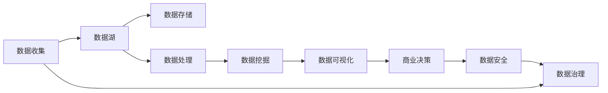

                 

## 1. 背景介绍

### 1.1 问题由来

在过去十年中，随着互联网的迅猛发展，大数据已经成为现代商业的重要资产。大数据不仅改变了企业的运营模式，还重塑了市场的竞争格局。在这个背景下，大数据创业成为了众多创业者和投资者的首选。但大数据并不是一个简单的技术，它是一个复杂的生态系统，需要多方面的综合能力才能成功。因此，本文将从多个维度，深入探讨大数据创业的商业智慧，帮助读者洞察未来的商业趋势和机遇。

### 1.2 问题核心关键点

大数据创业的核心关键点包括：
- **数据收集与管理**：如何高效地收集和管理大量数据。
- **数据处理与分析**：如何对数据进行有效的处理和分析，以获得有价值的洞察。
- **数据驱动决策**：如何将数据分析结果转化为实际的商业决策。
- **数据安全与隐私**：如何在数据利用和保护之间找到平衡点。
- **技术创新与应用**：如何不断创新，将最新的技术应用到大数据创业中。

本文将围绕这些关键点，系统地阐述大数据创业的商业智慧，帮助读者在大数据创业的浪潮中乘风破浪。

## 2. 核心概念与联系

### 2.1 核心概念概述

- **大数据**：指数量巨大、速度极快、类型多样的数据集，通常需要分布式计算和存储技术进行处理。
- **数据湖**：用于存储和处理大规模数据集的数据管理系统。
- **数据仓库**：用于集中存储和查询历史数据的数据管理系统。
- **数据挖掘**：从大量数据中提取有价值的信息和知识的过程。
- **数据可视化**：将数据转化为图形或图表，以直观展示数据特征和趋势。
- **数据安全**：保护数据免受未经授权的访问和破坏的措施。

### 2.2 核心概念原理和架构的 Mermaid 流程图(Mermaid 流程节点中不要有括号、逗号等特殊字符)



## 3. 核心算法原理 & 具体操作步骤

### 3.1 算法原理概述

大数据创业的算法原理主要包括数据收集、存储、处理、分析和应用五个步骤。这些步骤相互关联，形成了一个完整的大数据生态系统。

- **数据收集**：通过各种传感器、应用程序、网站、社交媒体等渠道，收集海量数据。
- **数据存储**：使用分布式文件系统和数据库，将数据存储在数据湖或数据仓库中。
- **数据处理**：使用ETL工具、流处理系统和数据管道，对数据进行清洗、转换和加载。
- **数据挖掘**：使用机器学习、深度学习、统计分析等技术，从数据中提取有价值的信息和知识。
- **数据应用**：将数据转化为实际的应用场景，如个性化推荐、市场营销、风险控制等。

### 3.2 算法步骤详解

#### 3.2.1 数据收集

数据收集是数据分析的第一步。大数据创业需要大量的数据来支撑其商业决策。数据来源包括：
- **日志数据**：网站访问、应用程序使用等日志数据。
- **交易数据**：金融交易、电商订单等交易数据。
- **社交媒体数据**：Twitter、Facebook、微信等社交媒体数据。
- **传感器数据**：物联网设备的传感器数据。

收集数据时，需要注意数据的准确性、完整性和安全性。

#### 3.2.2 数据存储

数据存储是大数据创业的基础。数据湖和数据仓库是两种常见的数据存储方式。
- **数据湖**：存储海量非结构化数据，如文本、图片、视频等。数据湖通常使用Hadoop、Spark等分布式计算框架进行管理。
- **数据仓库**：存储结构化数据，如表格数据。数据仓库通常使用SQL数据库进行管理。

#### 3.2.3 数据处理

数据处理包括数据清洗、转换和加载。ETL工具是常用的数据处理工具。
- **数据清洗**：去除重复数据、缺失值、错误数据等。
- **数据转换**：将数据从一种格式转换为另一种格式，如将文本数据转换为数值数据。
- **数据加载**：将数据加载到数据湖或数据仓库中。

#### 3.2.4 数据挖掘

数据挖掘是提取数据中有价值信息的关键步骤。常用的数据挖掘算法包括：
- **分类算法**：如决策树、随机森林、支持向量机等。
- **聚类算法**：如K-means、层次聚类等。
- **关联规则算法**：如Apriori算法等。

#### 3.2.5 数据应用

数据应用是大数据创业的最终目标。数据应用包括：
- **个性化推荐**：如Netflix的推荐系统。
- **市场营销**：如Facebook的广告推荐系统。
- **风险控制**：如金融风险评估系统。

### 3.3 算法优缺点

大数据创业的算法优点包括：
- **数据量庞大**：可以支撑更全面、更深入的数据分析。
- **实时性高**：可以实时处理和分析数据。
- **数据驱动决策**：可以提供更准确、更可靠的决策支持。

但大数据创业也存在一些缺点：
- **数据质量问题**：数据来源多样，数据质量难以保障。
- **处理成本高**：处理大规模数据需要高性能计算资源。
- **技术门槛高**：需要高水平的数据科学家和工程师。

### 3.4 算法应用领域

大数据创业的应用领域非常广泛，包括：
- **金融**：如金融风险管理、信用评分、欺诈检测等。
- **零售**：如个性化推荐、库存管理、客户细分等。
- **医疗**：如患者治疗方案、疾病预测、药品研发等。
- **物流**：如路线规划、配送优化、供应链管理等。
- **交通**：如交通流量预测、路况分析、智能调度等。
- **能源**：如能源消耗分析、智能电网管理、可再生能源优化等。

## 4. 数学模型和公式 & 详细讲解 & 举例说明

### 4.1 数学模型构建

大数据创业的数学模型构建包括以下几个方面：
- **数据采集模型**：描述数据采集的过程和方式。
- **数据存储模型**：描述数据存储的方式和结构。
- **数据处理模型**：描述数据清洗、转换和加载的过程。
- **数据挖掘模型**：描述从数据中提取有价值信息的过程。
- **数据应用模型**：描述数据转化为实际应用的过程。

### 4.2 公式推导过程

#### 4.2.1 数据采集模型

数据采集模型可以表示为：
$$
D_{collected} = \bigcup_{i=1}^n D_i
$$
其中，$D_i$表示第$i$个数据源采集到的数据集。

#### 4.2.2 数据存储模型

数据存储模型可以表示为：
$$
D_{stored} = D_{collected} \times \mathcal{S}
$$
其中，$\mathcal{S}$表示存储方式，可以是分布式文件系统或数据库。

#### 4.2.3 数据处理模型

数据处理模型可以表示为：
$$
D_{processed} = D_{stored} \rightarrow D_{cleaned}
$$
其中，$D_{cleaned}$表示清洗后的数据集。

#### 4.2.4 数据挖掘模型

数据挖掘模型可以表示为：
$$
K = M(D_{processed})
$$
其中，$K$表示从数据中提取的知识，$M$表示数据挖掘算法。

#### 4.2.5 数据应用模型

数据应用模型可以表示为：
$$
A = F(K)
$$
其中，$A$表示数据应用结果，$F$表示数据应用算法。

### 4.3 案例分析与讲解

以Netflix的推荐系统为例，其推荐模型可以表示为：
$$
P(rate|user, movie) = \prod_{i=1}^n w_i \times \text{sigmoid}(\sum_{i=1}^n x_{ui} \times w_i)
$$
其中，$x_{ui}$表示用户$u$对电影$i$的评分，$w_i$表示电影$i$的权重。

## 5. 项目实践：代码实例和详细解释说明

### 5.1 开发环境搭建

在进行大数据创业项目开发前，需要搭建合适的开发环境。以下是使用Python进行PySpark开发的环境配置流程：

1. 安装Anaconda：从官网下载并安装Anaconda，用于创建独立的Python环境。

2. 创建并激活虚拟环境：
```bash
conda create -n bigdata-env python=3.8 
conda activate bigdata-env
```

3. 安装Spark：从官网获取对应的安装命令，并按照提示进行安装。例如：
```bash
wget https://download.apache.org/spark/spark-3.1.0/spark-3.1.0.tgz
tar -xzf spark-3.1.0.tgz
cd spark-3.1.0
./bin/spark-submit --master local[*] --deploy-mode client --driver-class-name org.apache.spark.deploy.PySparkMaster --app-name myapp myapp.py
```

4. 安装相关Python包：
```bash
pip install pyspark pyspark-ml
```

5. 启动Spark集群：
```bash
spark-submit --master local[*] --deploy-mode client --driver-class-name org.apache.spark.deploy.PySparkMaster --app-name myapp myapp.py
```

完成上述步骤后，即可在`bigdata-env`环境中开始大数据创业项目的开发。

### 5.2 源代码详细实现

以下是一个使用Spark进行数据处理和分析的Python代码实现。

```python
from pyspark.sql import SparkSession
from pyspark.ml.feature import VectorAssembler

spark = SparkSession.builder.appName("bigdata_project").getOrCreate()

# 读取数据集
df = spark.read.format("csv").option("header", "true").load("data.csv")

# 数据预处理
df = df.dropDuplicates().dropna()

# 数据清洗
df = df.drop("timestamp")  # 去掉无用字段
df = df.select(["id", "value"])

# 特征工程
assembler = VectorAssembler(inputCols=["id", "value"], outputCol="features")
df = assembler.transform(df)

# 数据挖掘
from pyspark.ml.classification import RandomForestClassifier
from pyspark.ml.evaluation import MulticlassClassificationEvaluator

featuresCol = "features"
labelCol = "label"
trainData = df.select(featuresCol, labelCol)
testData = df.select(featuresCol, labelCol)

trainData = trainData.dropDuplicates()

# 训练模型
rf = RandomForestClassifier(featuresCol=featuresCol, labelCol=labelCol)
model = rf.fit(trainData)

# 评估模型
evaluator = MulticlassClassificationEvaluator()
accuracy = evaluator.evaluate(model.transform(testData), labelCol=labelCol)
print("Accuracy:", accuracy)

# 保存模型
model.save("model_path")
```

### 5.3 代码解读与分析

让我们再详细解读一下关键代码的实现细节：

**SparkSession创建**：使用`SparkSession.builder`创建SparkSession，`appName`设置应用名称，`getOrCreate()`获取SparkSession实例。

**数据读取**：使用`spark.read.format()`读取CSV格式的数据集，`option()`设置相关参数，`load()`加载数据。

**数据预处理**：使用`dropDuplicates()`去重，`dropna()`去除缺失值，`select()`选择需要的字段。

**数据清洗**：使用`drop()`删除无用字段，`select()`选择需要的字段。

**特征工程**：使用`VectorAssembler`进行特征工程，将多个字段转换为向量表示。

**数据挖掘**：使用`RandomForestClassifier`进行分类模型训练，`fit()`训练模型，`evaluate()`评估模型性能，`save()`保存模型。

**模型训练**：使用`RandomForestClassifier`进行分类模型训练，`fit()`训练模型。

**模型评估**：使用`MulticlassClassificationEvaluator`评估模型性能，`evaluate()`评估模型准确率。

**模型保存**：使用`model.save()`保存模型。

### 5.4 运行结果展示

在Spark集群上运行上述代码，可以得到模型的评估结果和准确率。

## 6. 实际应用场景

### 6.1 金融风险管理

金融行业是大数据创业的主要应用场景之一。金融机构可以通过大数据分析，识别出高风险客户，预测违约风险，优化信贷决策。例如，银行可以通过客户交易记录、社交媒体行为等数据，预测客户的违约概率，从而制定更科学的信贷政策。

### 6.2 零售个性化推荐

零售行业是另一个大数据创业的重要应用场景。零售企业可以通过客户交易记录、浏览历史、社交媒体行为等数据，提供个性化的商品推荐。例如，电商网站可以通过用户浏览和购买记录，推荐相关的商品，提升用户满意度和销售额。

### 6.3 医疗疾病预测

医疗行业也是大数据创业的重要应用领域。医疗机构可以通过电子病历、基因数据、健康监测数据等，进行疾病预测和风险评估。例如，医院可以通过患者的电子病历和基因数据，预测患者的疾病风险，制定个性化的治疗方案。

### 6.4 未来应用展望

大数据创业的未来应用前景广阔，主要包括以下几个方面：

1. **数据融合与协同**：未来的数据应用将不再局限于单一领域，而是跨领域融合，协同创新。例如，医疗和金融数据结合，可以进行更全面的风险评估。

2. **实时数据处理**：实时数据处理和大数据创业将紧密结合，实现实时分析和决策。例如，金融市场交易数据实时分析，可以实时调整投资策略。

3. **人工智能与大数据结合**：人工智能技术如深度学习、自然语言处理、计算机视觉等，将与大数据创业深度结合，提升数据分析和应用水平。例如，自然语言处理技术可以用于文本数据的分析和挖掘。

4. **区块链技术应用**：区块链技术可以用于数据的透明、安全、可追溯性，为大数据创业提供新的数据管理方式。例如，供应链数据管理可以采用区块链技术，确保数据的真实性和透明性。

## 7. 工具和资源推荐

### 7.1 学习资源推荐

为了帮助读者系统掌握大数据创业的理论基础和实践技巧，这里推荐一些优质的学习资源：

1. **《大数据技术与应用》系列课程**：由知名大学开设的在线课程，涵盖大数据技术的基础和应用，帮助读者全面理解大数据生态系统。

2. **Kaggle**：全球最大的数据科学竞赛平台，提供丰富的数据集和竞赛项目，帮助读者实践大数据分析技能。

3. **Udacity**：提供数据科学和人工智能相关的在线课程，涵盖大数据创业的多个方面，从数据收集到数据应用。

4. **《数据科学实战》书籍**：详细介绍了数据科学和人工智能的实战项目，帮助读者理解大数据创业的实际应用。

5. **大数据创业实战案例**：收集和整理多个成功的大数据创业案例，帮助读者学习成功经验和教训。

通过对这些资源的学习实践，相信读者一定能够系统掌握大数据创业的理论基础和实践技巧，并应用于实际项目中。

### 7.2 开发工具推荐

大数据创业的成功离不开优质的开发工具。以下是几款用于大数据创业开发的常用工具：

1. **Spark**：Apache Hadoop基金会开源的分布式计算框架，支持大规模数据处理。

2. **Hive**：基于Hadoop的数据仓库工具，支持结构化数据管理。

3. **Hadoop**：Apache Hadoop基金会开源的分布式文件系统，支持海量数据存储。

4. **ETL工具**：如Apache Nifi、Talend等，用于数据清洗、转换和加载。

5. **大数据可视化工具**：如Tableau、PowerBI等，用于数据可视化。

6. **大数据安全工具**：如Cloudera Ranger、Azure Data Lake Analytics等，用于数据安全和隐私保护。

合理利用这些工具，可以显著提升大数据创业的开发效率，加快创新迭代的步伐。

### 7.3 相关论文推荐

大数据创业的研究源于学界的持续研究。以下是几篇奠基性的相关论文，推荐阅读：

1. **《大数据基础与应用》**：详细介绍了大数据技术的基本概念和应用，为读者提供了全面的大数据知识体系。

2. **《大数据驱动的企业决策》**：讨论了大数据在企业决策中的应用，帮助读者理解大数据在商业决策中的作用。

3. **《大数据创业的商业模型》**：分析了大数据创业的商业模式和创新点，为读者提供了大数据创业的思路和方法。

4. **《大数据在金融行业的创新应用》**：探讨了大数据在金融行业的具体应用案例，帮助读者理解大数据在金融领域的价值。

5. **《大数据在零售行业的创新应用》**：分析了大数据在零售行业的具体应用案例，帮助读者理解大数据在零售行业的价值。

这些论文代表了大数据创业的研究方向，帮助读者把握学科前进方向，激发更多的创新灵感。

## 8. 总结：未来发展趋势与挑战

### 8.1 研究成果总结

大数据创业在过去十年中取得了显著的进展，主要体现在以下几个方面：
1. **技术发展**：大数据处理技术和工具不断进步，支持更大规模、更高效的数据处理和分析。
2. **数据应用**：大数据在金融、零售、医疗等多个行业的应用日益广泛，提升了企业的决策水平和运营效率。
3. **商业模型**：大数据创业的商业模式和创新点不断涌现，推动了企业的商业转型和创新。

### 8.2 未来发展趋势

大数据创业的未来发展趋势主要包括以下几个方面：
1. **数据融合与协同**：跨领域数据融合和大数据协同创新将成为未来的重要方向。
2. **实时数据处理**：实时数据处理和大数据创业将紧密结合，实现实时分析和决策。
3. **人工智能与大数据结合**：人工智能技术将与大数据创业深度结合，提升数据分析和应用水平。
4. **区块链技术应用**：区块链技术将为大数据创业提供新的数据管理方式。

### 8.3 面临的挑战

大数据创业在快速发展的同时，也面临诸多挑战：
1. **数据质量问题**：数据来源多样，数据质量难以保障，需要进一步提升数据采集和清洗能力。
2. **处理成本高**：处理大规模数据需要高性能计算资源，需要进一步提升硬件性能和资源利用率。
3. **技术门槛高**：需要高水平的数据科学家和工程师，需要进一步提升人才储备和技术水平。

### 8.4 研究展望

面对大数据创业所面临的挑战，未来的研究需要在以下几个方面寻求新的突破：
1. **数据质量提升**：提升数据采集和清洗能力，确保数据的质量和完整性。
2. **处理成本降低**：优化数据处理算法和架构，提高资源利用率和处理效率。
3. **技术人才培养**：加强数据科学和人工智能人才的培养，提升团队的综合能力。

## 9. 附录：常见问题与解答

**Q1：大数据创业是否需要大量的数据？**

A: 是的，大数据创业需要大量的数据来支撑其商业决策。数据是任何大数据应用的基础，没有数据，大数据创业就无法进行。

**Q2：如何高效地进行数据清洗？**

A: 数据清洗是数据处理的重要环节，可以采用ETL工具进行自动化清洗，如Apache Nifi、Talend等。

**Q3：如何确保数据的安全性和隐私性？**

A: 数据安全是大数据创业的重要保障，可以采用加密技术、访问控制等措施，确保数据的安全性和隐私性。

**Q4：如何提升大数据创业的商业价值？**

A: 提升商业价值的关键在于数据应用，可以通过数据挖掘和机器学习等技术，发现数据中的有价值信息，并转化为商业决策。

**Q5：如何选择合适的数据处理工具？**

A: 选择合适的数据处理工具需要考虑数据的特点和处理需求，如结构化数据可以选择Hive，非结构化数据可以选择Spark。

---

作者：禅与计算机程序设计艺术 / Zen and the Art of Computer Programming

