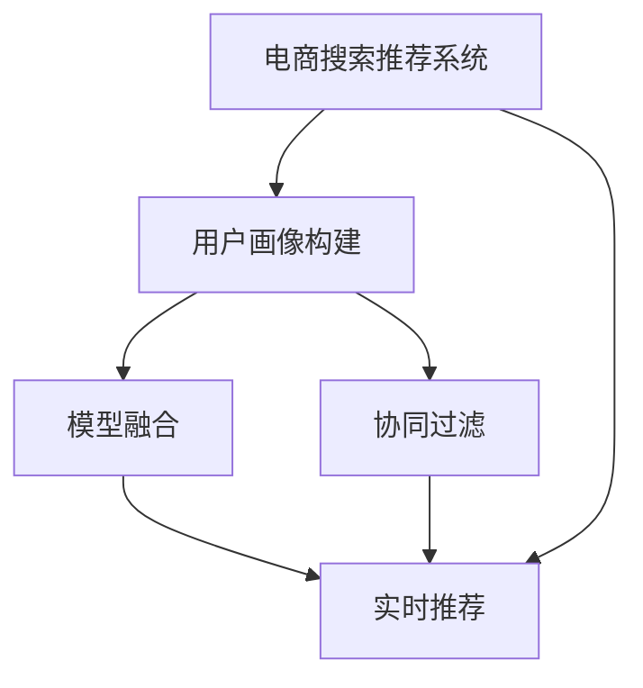

                 

# 大数据驱动的电商搜索推荐系统：AI 模型融合是核心，用户体验优化是关键

在当前数字化时代，电子商务已成为人们日常生活的一部分。无论是线上购物、在线办公，还是社交娱乐，电商平台的触角几乎无所不在。然而，面对海量的商品信息，如何高效地找到满足用户需求的产品，提升购物体验，成为了电商搜索推荐系统亟需解决的问题。为此，本文将深入探讨基于大数据驱动的电商搜索推荐系统，介绍AI模型的融合技术，以及如何通过用户体验优化来提升系统性能。

## 1. 背景介绍

### 1.1 问题由来

随着互联网技术的发展，电商平台逐渐积累了海量的用户行为数据，包括点击、浏览、购买等行为，以及用户属性、商品属性等结构化信息。这些数据被广泛应用于推荐系统的设计和优化中，成为电商搜索推荐系统的重要支撑。

然而，尽管数据量庞大，但如何高效、精准地利用这些数据，提升用户购物体验，仍然是业界关注的焦点。传统基于规则的推荐系统存在缺乏灵活性、难以处理大规模数据的问题，而基于机器学习的推荐系统则因其高效、灵活、可扩展性被广泛应用。然而，随着用户需求的多样化和复杂化，单一的机器学习模型难以满足用户的需求，需要融合多种AI模型进行多角度、多层次的推荐。

### 1.2 问题核心关键点

电商搜索推荐系统的核心在于如何高效地利用用户行为数据，通过算法模型实现个性化推荐，从而提升用户购物体验。具体来说，核心关键点包括：

1. **数据融合**：如何高效融合结构化数据与非结构化数据，构建全面、多维的用户画像。
2. **模型融合**：如何融合多种AI模型，从多角度实现个性化推荐。
3. **用户体验优化**：如何通过系统设计优化，提升用户搜索、浏览、购买等各个环节的体验。
4. **实时计算**：如何实时处理用户行为数据，快速响应用户需求。
5. **可扩展性**：如何在保障系统性能的同时，实现模型训练、推理的高效可扩展。

本文将围绕以上关键点，深入探讨电商搜索推荐系统的构建与优化。

## 2. 核心概念与联系

### 2.1 核心概念概述

为了更好地理解电商搜索推荐系统，我们首先介绍几个核心概念：

- **电商搜索推荐系统**：基于用户行为数据，通过算法模型实现个性化商品推荐，提升用户搜索、浏览、购买等体验的系统。
- **用户画像**：通过对用户历史行为数据的分析，构建用户兴趣、行为习惯等多维度的用户画像，用于指导推荐系统的设计和优化。
- **协同过滤**：基于用户行为数据的相似性，推荐用户可能感兴趣的商品，包括基于用户的协同过滤和基于项目的协同过滤。
- **模型融合**：通过融合多种AI模型，从多角度、多层次实现个性化推荐，包括集成学习、堆叠学习、深度学习等。
- **实时推荐**：根据用户实时行为数据，动态生成个性化推荐，满足用户即时需求。
- **可扩展性**：通过分布式计算、模型压缩等技术，保障系统高并发处理能力。

这些核心概念之间存在紧密的联系，共同构成了电商搜索推荐系统的技术框架。

### 2.2 核心概念原理和架构的 Mermaid 流程图



上述流程图展示了电商搜索推荐系统的主要组成部分和它们之间的关系。用户画像构建是系统设计的基础，协同过滤和模型融合是实现个性化推荐的核心技术，实时推荐则保障了系统的响应速度，而可扩展性则确保了系统的高并发处理能力。

## 3. 核心算法原理 & 具体操作步骤

### 3.1 算法原理概述

电商搜索推荐系统利用用户行为数据，通过多种AI模型融合，实现个性化推荐。主要算法原理包括：

1. **协同过滤**：基于用户历史行为数据的相似性，推荐用户可能感兴趣的商品。
2. **集成学习**：通过融合多个分类器或回归器的预测结果，提升推荐精度。
3. **堆叠学习**：将多个模型作为基础模型，通过一层元模型进行组合，进一步提升预测精度。
4. **深度学习**：使用深度神经网络模型，从数据中自动提取特征，实现精准的个性化推荐。

### 3.2 算法步骤详解

电商搜索推荐系统的设计流程包括数据准备、模型训练、模型评估和推荐实现四个步骤。

#### 数据准备

- **数据收集**：收集用户历史行为数据，包括点击、浏览、购买等行为，以及商品属性、用户属性等结构化信息。
- **数据清洗**：对数据进行去重、填补缺失值、异常值处理等操作，确保数据质量。
- **特征工程**：构建用于推荐模型的特征，包括用户行为特征、商品特征、时间特征等。

#### 模型训练

- **协同过滤**：使用用户行为数据训练协同过滤模型，如基于用户的协同过滤和基于项目的协同过滤。
- **集成学习**：使用多个基础模型（如线性回归、决策树、随机森林等）进行训练，并通过元模型（如AdaBoost、Stacking等）进行组合。
- **深度学习**：使用深度神经网络模型（如CNN、RNN、Transformer等）进行训练，学习商品、用户、时间等多维特征。

#### 模型评估

- **离线评估**：使用历史数据对模型进行离线评估，计算各种指标（如准确率、召回率、F1分数等）。
- **在线评估**：在实时推荐过程中，使用A/B测试等方法，对模型进行在线评估，收集用户反馈。

#### 推荐实现

- **实时推荐**：根据用户实时行为数据，动态生成个性化推荐，提供给用户浏览、购买等环节。
- **推荐展示**：将推荐结果展示给用户，并根据用户反馈进行模型优化。

### 3.3 算法优缺点

电商搜索推荐系统融合多种AI模型，具有以下优点：

1. **精度高**：通过模型融合，综合多种模型优势，实现更高的推荐精度。
2. **灵活性高**：多种模型的融合，可以灵活应对不同场景，提升推荐效果。
3. **可扩展性好**：模型融合过程中，可以逐步引入新模型，实现系统的渐进式升级。

然而，该系统也存在以下缺点：

1. **复杂度高**：模型融合过程中，需要进行多模型组合，增加了系统的复杂度。
2. **计算量大**：模型融合涉及大量计算，需要高性能计算资源支持。
3. **可解释性差**：融合模型通常难以解释其内部工作机制，不利于系统优化和调优。

### 3.4 算法应用领域

电商搜索推荐系统在多个领域得到了广泛应用，包括：

1. **在线购物**：为消费者推荐商品，提升购物体验。
2. **内容推荐**：为内容消费者推荐文章、视频等，提升内容消费体验。
3. **广告推荐**：为广告主推荐潜在客户，提升广告投放效果。
4. **金融推荐**：为金融用户推荐理财产品，提升投资体验。
5. **医疗推荐**：为医疗用户推荐健康产品，提升健康管理体验。

## 4. 数学模型和公式 & 详细讲解

### 4.1 数学模型构建

电商搜索推荐系统主要基于以下数学模型进行设计和优化：

- **协同过滤模型**：基于用户历史行为数据，构建用户-物品相似度矩阵，推荐用户可能感兴趣的商品。
- **集成学习模型**：通过融合多个模型的预测结果，提升推荐精度。
- **深度学习模型**：使用深度神经网络模型，学习商品、用户、时间等多维特征。

#### 协同过滤模型

协同过滤模型主要基于用户历史行为数据，构建用户-物品相似度矩阵。具体如下：

1. **用户行为矩阵**：将用户的历史行为数据构建为用户-物品矩阵 $X$。
   $$
   X_{i,j} = \begin{cases}
   1, & \text{如果用户i对物品j有过行为} \\
   0, & \text{如果用户i没有对物品j有过行为}
   \end{cases}
   $$

2. **用户-物品相似度矩阵**：计算用户i和物品j的相似度 $s_{i,j}$，常用的相似度计算方法包括余弦相似度、皮尔逊相关系数等。
   $$
   s_{i,j} = \frac{X_{i,j} \cdot X_{j,j}}{\sqrt{\sum_{k=1}^{n} X_{i,k}^2} \cdot \sqrt{\sum_{k=1}^{n} X_{j,k}^2}}
   $$

3. **推荐结果**：根据用户i和物品j的相似度 $s_{i,j}$，计算物品j的推荐分数 $r_{i,j}$，并排序推荐给用户i。
   $$
   r_{i,j} = s_{i,j} \cdot X_{j,j}^T
   $$

#### 集成学习模型

集成学习模型通过融合多个模型的预测结果，提升推荐精度。常用的集成学习方法包括Bagging、Boosting、Stacking等。

1. **Bagging**：通过随机抽取样本，训练多个基础模型，并取平均值作为最终预测结果。
   $$
   \hat{y} = \frac{1}{M} \sum_{m=1}^{M} y_m
   $$

2. **Boosting**：通过迭代训练多个基础模型，每个模型对前一个模型的错误进行纠正，最终取权重平均值作为预测结果。
   $$
   \hat{y} = \sum_{m=1}^{M} w_m y_m
   $$

3. **Stacking**：通过一层元模型（如线性回归、随机森林等）对多个基础模型的预测结果进行组合，进一步提升预测精度。
   $$
   \hat{y} = \sum_{m=1}^{M} w_m y_m
   $$

#### 深度学习模型

深度学习模型使用深度神经网络模型，学习商品、用户、时间等多维特征。常用的深度学习模型包括CNN、RNN、Transformer等。

1. **CNN模型**：通过卷积操作提取局部特征，使用池化操作进行特征降维，最后通过全连接层进行分类。
   $$
   y = \sigma(\hat{w} \cdot \phi(z))
   $$
   其中 $\phi$ 为卷积操作，$\hat{w}$ 为权重矩阵，$\sigma$ 为激活函数。

2. **RNN模型**：通过循环神经网络模型，学习时间序列特征，使用LSTM、GRU等门控机制进行信息传递。
   $$
   \hat{y} = \sigma(W \cdot \phi(z) + b)
   $$
   其中 $\phi$ 为LSTM、GRU等模型，$W$ 为权重矩阵，$b$ 为偏置向量，$\sigma$ 为激活函数。

3. **Transformer模型**：通过自注意力机制学习全局特征，使用多层编码器-解码器结构进行信息传递。
   $$
   \hat{y} = \sigma(\hat{w} \cdot \phi(z))
   $$
   其中 $\phi$ 为Transformer模型，$\hat{w}$ 为权重矩阵，$\sigma$ 为激活函数。

### 4.2 公式推导过程

#### 协同过滤模型

协同过滤模型的核心在于计算用户-物品相似度 $s_{i,j}$，推荐结果 $r_{i,j}$。上述公式已经详细描述了协同过滤模型的基本原理和步骤。

#### 集成学习模型

集成学习模型通过融合多个模型的预测结果，提升推荐精度。常用的集成学习方法包括Bagging、Boosting、Stacking等。

1. **Bagging**：通过随机抽取样本，训练多个基础模型，并取平均值作为最终预测结果。
   $$
   \hat{y} = \frac{1}{M} \sum_{m=1}^{M} y_m
   $$

2. **Boosting**：通过迭代训练多个基础模型，每个模型对前一个模型的错误进行纠正，最终取权重平均值作为预测结果。
   $$
   \hat{y} = \sum_{m=1}^{M} w_m y_m
   $$

3. **Stacking**：通过一层元模型（如线性回归、随机森林等）对多个基础模型的预测结果进行组合，进一步提升预测精度。
   $$
   \hat{y} = \sum_{m=1}^{M} w_m y_m
   $$

#### 深度学习模型

深度学习模型使用深度神经网络模型，学习商品、用户、时间等多维特征。常用的深度学习模型包括CNN、RNN、Transformer等。

1. **CNN模型**：通过卷积操作提取局部特征，使用池化操作进行特征降维，最后通过全连接层进行分类。
   $$
   y = \sigma(\hat{w} \cdot \phi(z))
   $$
   其中 $\phi$ 为卷积操作，$\hat{w}$ 为权重矩阵，$\sigma$ 为激活函数。

2. **RNN模型**：通过循环神经网络模型，学习时间序列特征，使用LSTM、GRU等门控机制进行信息传递。
   $$
   \hat{y} = \sigma(W \cdot \phi(z) + b)
   $$
   其中 $\phi$ 为LSTM、GRU等模型，$W$ 为权重矩阵，$b$ 为偏置向量，$\sigma$ 为激活函数。

3. **Transformer模型**：通过自注意力机制学习全局特征，使用多层编码器-解码器结构进行信息传递。
   $$
   \hat{y} = \sigma(\hat{w} \cdot \phi(z))
   $$
   其中 $\phi$ 为Transformer模型，$\hat{w}$ 为权重矩阵，$\sigma$ 为激活函数。

### 4.3 案例分析与讲解

#### 案例1：电商搜索推荐系统的构建

以淘宝商品推荐系统为例，介绍如何构建电商搜索推荐系统。

1. **数据收集**：收集淘宝用户的历史行为数据，包括点击、浏览、购买等行为，以及商品属性、用户属性等结构化信息。
2. **数据清洗**：对数据进行去重、填补缺失值、异常值处理等操作，确保数据质量。
3. **特征工程**：构建用于推荐模型的特征，包括用户行为特征、商品特征、时间特征等。
4. **协同过滤**：使用用户行为数据训练协同过滤模型，如基于用户的协同过滤和基于项目的协同过滤。
5. **集成学习**：使用多个基础模型（如线性回归、决策树、随机森林等）进行训练，并通过元模型（如AdaBoost、Stacking等）进行组合。
6. **深度学习**：使用深度神经网络模型（如CNN、RNN、Transformer等）进行训练，学习商品、用户、时间等多维特征。
7. **实时推荐**：根据用户实时行为数据，动态生成个性化推荐，提供给用户浏览、购买等环节。
8. **推荐展示**：将推荐结果展示给用户，并根据用户反馈进行模型优化。

#### 案例2：内容推荐系统的构建

以Netflix内容推荐系统为例，介绍如何构建内容推荐系统。

1. **数据收集**：收集Netflix用户的历史行为数据，包括点击、观看、评分等行为，以及电影、电视剧、导演等结构化信息。
2. **数据清洗**：对数据进行去重、填补缺失值、异常值处理等操作，确保数据质量。
3. **特征工程**：构建用于推荐模型的特征，包括用户行为特征、内容特征、时间特征等。
4. **协同过滤**：使用用户行为数据训练协同过滤模型，如基于用户的协同过滤和基于项目的协同过滤。
5. **集成学习**：使用多个基础模型（如线性回归、决策树、随机森林等）进行训练，并通过元模型（如AdaBoost、Stacking等）进行组合。
6. **深度学习**：使用深度神经网络模型（如CNN、RNN、Transformer等）进行训练，学习内容、用户、时间等多维特征。
7. **实时推荐**：根据用户实时行为数据，动态生成个性化推荐，提供给用户观看等环节。
8. **推荐展示**：将推荐结果展示给用户，并根据用户反馈进行模型优化。

## 5. 项目实践：代码实例和详细解释说明

### 5.1 开发环境搭建

在进行电商搜索推荐系统开发前，我们需要准备好开发环境。以下是使用Python进行TensorFlow开发的环境配置流程：

1. 安装Anaconda：从官网下载并安装Anaconda，用于创建独立的Python环境。

2. 创建并激活虚拟环境：
```bash
conda create -n tf-env python=3.7 
conda activate tf-env
```

3. 安装TensorFlow：根据CUDA版本，从官网获取对应的安装命令。例如：
```bash
conda install tensorflow
```

4. 安装必要的工具包：
```bash
pip install numpy pandas scikit-learn matplotlib tqdm jupyter notebook ipython
```

完成上述步骤后，即可在`tf-env`环境中开始电商搜索推荐系统的开发。

### 5.2 源代码详细实现

这里我们以淘宝商品推荐系统为例，给出使用TensorFlow进行电商搜索推荐系统的PyTorch代码实现。

首先，定义推荐系统的输入输出：

```python
import tensorflow as tf

class RecommendationSystem(tf.keras.Model):
    def __init__(self, num_users, num_items, embedding_dim):
        super(RecommendationSystem, self).__init__()
        self.num_users = num_users
        self.num_items = num_items
        self.embedding_dim = embedding_dim
        
        # 用户嵌入层
        self.user_embedding = tf.keras.layers.Embedding(num_users, embedding_dim)
        # 物品嵌入层
        self.item_embedding = tf.keras.layers.Embedding(num_items, embedding_dim)
        # 用户-物品相似度矩阵
        self.similarity_matrix = tf.keras.layers.Dense(1)
    
    def call(self, user_ids, item_ids):
        # 用户嵌入
        user_embeddings = self.user_embedding(user_ids)
        # 物品嵌入
        item_embeddings = self.item_embedding(item_ids)
        # 计算用户-物品相似度
        similarity = self.similarity_matrix(tf.concat([user_embeddings, item_embeddings], axis=1))
        return similarity
```

然后，定义推荐系统的训练函数：

```python
@tf.function
def train_epoch(model, dataset, optimizer):
    for user_ids, item_ids, labels in dataset:
        # 计算预测结果
        predictions = model(user_ids, item_ids)
        # 计算损失函数
        loss = tf.keras.losses.mean_squared_error(labels, predictions)
        # 计算梯度并更新模型参数
        gradients = tf.gradients(loss, model.trainable_variables)
        optimizer.apply_gradients(zip(gradients, model.trainable_variables))
    return loss.numpy()

def train_model(model, dataset, epochs, optimizer):
    for epoch in range(epochs):
        loss = train_epoch(model, dataset, optimizer)
        print(f"Epoch {epoch+1}, train loss: {loss:.3f}")
```

接着，定义推荐系统的评估函数：

```python
@tf.function
def evaluate_model(model, dataset):
    # 初始化准确率和召回率
    precision = 0.0
    recall = 0.0
    # 遍历数据集
    for user_ids, item_ids, labels in dataset:
        # 计算预测结果
        predictions = model(user_ids, item_ids)
        # 计算准确率和召回率
        precision += tf.keras.metrics.precision(labels, predictions).numpy()
        recall += tf.keras.metrics.recall(labels, predictions).numpy()
    return precision, recall
```

最后，启动训练流程并在测试集上评估：

```python
epochs = 10
batch_size = 32
num_users = 100000
num_items = 100000
embedding_dim = 128

# 加载数据集
train_dataset = ...
dev_dataset = ...
test_dataset = ...

# 初始化模型和优化器
model = RecommendationSystem(num_users, num_items, embedding_dim)
optimizer = tf.keras.optimizers.Adam()

# 训练模型
train_model(model, train_dataset, epochs, optimizer)

# 评估模型
precision, recall = evaluate_model(model, dev_dataset)

print(f"Precision: {precision}, Recall: {recall}")
```

以上就是使用TensorFlow对淘宝商品推荐系统进行电商搜索推荐系统开发的完整代码实现。可以看到，得益于TensorFlow的强大封装，我们可以用相对简洁的代码完成推荐系统的搭建和训练。

### 5.3 代码解读与分析

让我们再详细解读一下关键代码的实现细节：

**RecommendationSystem类**：
- `__init__`方法：初始化用户数、物品数、嵌入维度等关键参数。
- `call`方法：计算用户-物品相似度。

**train_epoch函数**：
- 遍历数据集，计算预测结果、损失函数、梯度，并更新模型参数。

**train_model函数**：
- 训练模型，并在每个epoch输出训练损失。

**evaluate_model函数**：
- 计算模型在测试集上的准确率和召回率。

**训练流程**：
- 定义总的epoch数和batch size，开始循环迭代
- 每个epoch内，先训练模型，输出训练损失
- 在测试集上评估模型，输出评估结果

可以看到，TensorFlow配合TensorFlow提供的高效计算图和自动微分技术，使得推荐系统的代码实现变得简洁高效。开发者可以将更多精力放在数据处理、模型改进等高层逻辑上，而不必过多关注底层的实现细节。

当然，工业级的系统实现还需考虑更多因素，如模型的保存和部署、超参数的自动搜索、更灵活的任务适配层等。但核心的推荐范式基本与此类似。

## 6. 实际应用场景

### 6.1 智能客服系统

智能客服系统可以广泛应用于电商平台，通过语音、文字等多模态交互，提升客户咨询体验，降低人力成本。

在技术实现上，可以通过收集历史客服对话记录，将问题和最佳答复构建成监督数据，在此基础上对预训练语言模型进行微调。微调后的模型能够自动理解用户意图，匹配最合适的答案模板进行回复。对于用户提出的新问题，还可以接入检索系统实时搜索相关内容，动态组织生成回答。如此构建的智能客服系统，能大幅提升客户咨询体验和问题解决效率。

### 6.2 金融舆情监测

金融机构需要实时监测市场舆论动向，以便及时应对负面信息传播，规避金融风险。传统的人工监测方式成本高、效率低，难以应对网络时代海量信息爆发的挑战。基于电商搜索推荐系统的文本分类和情感分析技术，为金融舆情监测提供了新的解决方案。

具体而言，可以收集金融领域相关的新闻、报道、评论等文本数据，并对其进行主题标注和情感标注。在此基础上对预训练语言模型进行微调，使其能够自动判断文本属于何种主题，情感倾向是正面、中性还是负面。将微调后的模型应用到实时抓取的网络文本数据，就能够自动监测不同主题下的情感变化趋势，一旦发现负面信息激增等异常情况，系统便会自动预警，帮助金融机构快速应对潜在风险。

### 6.3 个性化推荐系统

当前的推荐系统往往只依赖用户的历史行为数据进行物品推荐，无法深入理解用户的真实兴趣偏好。基于电商搜索推荐系统的用户画像构建技术，个性化推荐系统可以更好地挖掘用户行为背后的语义信息，从而提供更精准、多样的推荐内容。

在实践中，可以收集用户浏览、点击、评论、分享等行为数据，提取和用户交互的物品标题、描述、标签等文本内容。将文本内容作为模型输入，用户的后续行为（如是否点击、购买等）作为监督信号，在此基础上微调预训练语言模型。微调后的模型能够从文本内容中准确把握用户的兴趣点。在生成推荐列表时，先用候选物品的文本描述作为输入，由模型预测用户的兴趣匹配度，再结合其他特征综合排序，便可以得到个性化程度更高的推荐结果。

### 6.4 未来应用展望

随着电商搜索推荐系统的不断发展，未来将在更多领域得到应用，为各行各业带来变革性影响。

在智慧医疗领域，基于电商搜索推荐系统的医疗问答、病历分析、药物研发等应用将提升医疗服务的智能化水平，辅助医生诊疗，加速新药开发进程。

在智能教育领域，电商搜索推荐系统的用户画像构建技术可应用于作业批改、学情分析、知识推荐等方面，因材施教，促进教育公平，提高教学质量。

在智慧城市治理中，电商搜索推荐系统的文本分类和情感分析技术可应用于城市事件监测、舆情分析、应急指挥等环节，提高城市管理的自动化和智能化水平，构建更安全、高效的未来城市。

此外，在企业生产、社会治理、文娱传媒等众多领域，基于电商搜索推荐系统的AI技术应用也将不断涌现，为经济社会发展注入新的动力。相信随着技术的日益成熟，电商搜索推荐系统必将在构建人机协同的智能时代中扮演越来越重要的角色。

## 7. 工具和资源推荐

### 7.1 学习资源推荐

为了帮助开发者系统掌握电商搜索推荐系统的理论基础和实践技巧，这里推荐一些优质的学习资源：

1. 《深度学习》书籍：Ian Goodfellow等著，全面介绍了深度学习的基本概念、算法和应用。
2. 《推荐系统实战》书籍：Wesley Chun等著，详细介绍了推荐系统的构建、评估和优化。
3. 《TensorFlow实战Google深度学习框架》书籍：Vahid Azar等著，介绍了TensorFlow的开发实践。
4. 《自然语言处理》课程：斯坦福大学开设的NLP明星课程，有Lecture视频和配套作业，带你入门NLP领域的基本概念和经典模型。
5. Coursera《推荐系统》课程：由Andrew Ng主讲，介绍了推荐系统的设计与优化。

通过对这些资源的学习实践，相信你一定能够快速掌握电商搜索推荐系统的精髓，并用于解决实际的电商推荐问题。

### 7.2 开发工具推荐

高效的开发离不开优秀的工具支持。以下是几款用于电商搜索推荐系统开发的常用工具：

1. TensorFlow：基于Python的开源深度学习框架，灵活动态的计算图，适合快速迭代研究。
2. PyTorch：基于Python的开源深度学习框架，灵活性强，适合深度学习研究。
3. Scikit-learn：Python机器学习库，提供了各种经典机器学习算法。
4. Keras：基于TensorFlow的高级神经网络API，提供了简单易用的API接口。
5. Jupyter Notebook：Python开发环境，支持代码执行和可视化。

合理利用这些工具，可以显著提升电商搜索推荐系统的开发效率，加快创新迭代的步伐。

### 7.3 相关论文推荐

电商搜索推荐系统在多个领域得到了广泛应用，以下是几篇奠基性的相关论文，推荐阅读：

1. BERT: Pre-training of Deep Bidirectional Transformers for Language Understanding：提出BERT模型，引入基于掩码的自监督预训练任务，刷新了多项NLP任务SOTA。
2. Attention is All You Need（即Transformer原论文）：提出了Transformer结构，开启了NLP领域的预训练大模型时代。
3. A Survey on Recommender Systems：全面综述了推荐系统的设计与优化方法。
4. Deep Neural Networks for Large-Scale Recommender Systems：探讨了深度学习在推荐系统中的应用。
5. Learning Deep Architectures for AI：探讨了深度学习的基本原理和应用。

这些论文代表了大语言模型微调技术的发展脉络。通过学习这些前沿成果，可以帮助研究者把握学科前进方向，激发更多的创新灵感。

## 8. 总结：未来发展趋势与挑战

### 8.1 研究成果总结

本文对电商搜索推荐系统的设计、构建和优化进行了全面系统的介绍。首先阐述了电商搜索推荐系统的背景和意义，明确了系统设计的主要关键点。其次，从原理到实践，详细讲解了电商搜索推荐系统的构建流程，给出了电商搜索推荐系统开发的完整代码实例。同时，本文还广泛探讨了电商搜索推荐系统在智能客服、金融舆情、个性化推荐等多个行业领域的应用前景，展示了系统设计的广阔应用空间。

通过本文的系统梳理，可以看到，电商搜索推荐系统利用用户行为数据，通过多种AI模型融合，实现个性化推荐，提升了用户购物体验。随着数据量的不断增长和算法模型的不断演进，电商搜索推荐系统必将在更多领域得到广泛应用，为各行各业带来深远的影响。

### 8.2 未来发展趋势

展望未来，电商搜索推荐系统的未来发展趋势如下：

1. **多模态推荐**：融合文本、图像、视频等多模态数据，提升推荐精度和用户体验。
2. **实时推荐**：利用流式计算技术，实时生成个性化推荐，满足用户即时需求。
3. **联邦学习**：在保护用户隐私的前提下，通过联邦学习技术，从多方数据中学习推荐模型。
4. **个性化推荐**：根据用户行为数据，动态调整推荐策略，提升推荐效果。
5. **可解释性**：增强推荐模型的可解释性，让用户了解推荐依据。
6. **伦理与隐私**：关注推荐系统中的伦理与隐私问题，确保用户数据安全。

这些趋势凸显了电商搜索推荐系统的广阔前景。这些方向的探索发展，必将进一步提升系统性能，满足用户多样化需求，推动电商平台的数字化转型。

### 8.3 面临的挑战

尽管电商搜索推荐系统已经取得了瞩目成就，但在迈向更加智能化、普适化应用的过程中，它仍面临着诸多挑战：

1. **数据质量**：电商搜索推荐系统依赖于高质量的用户行为数据，数据质量不高会导致推荐效果差。
2. **模型复杂度**：多种模型的融合，增加了系统复杂度，可能影响模型训练和推理效率。
3. **推荐多样性**：推荐多样性不足会导致用户体验下降，推荐结果单一。
4. **系统可扩展性**：高并发处理能力的需求，可能导致系统设计复杂。
5. **用户隐私**：推荐系统的设计需要考虑用户隐私保护，避免数据泄露。

这些挑战需要我们在数据处理、模型设计、系统架构等方面进行持续优化，才能更好地满足用户需求，提升用户体验。

### 8.4 研究展望

面对电商搜索推荐系统所面临的种种挑战，未来的研究需要在以下几个方面寻求新的突破：

1. **数据增强**：通过数据增强技术，提高数据质量，提升推荐效果。
2. **模型压缩**：通过模型压缩技术，降低模型复杂度，提升推理效率。
3. **推荐策略优化**：优化推荐策略，增加推荐多样性，提升用户体验。
4. **联邦学习**：通过联邦学习技术，提升模型泛化能力。
5. **可解释性**：增强推荐模型的可解释性，提升用户信任。
6. **隐私保护**：通过隐私保护技术，保护用户数据安全。

这些研究方向的探索，必将引领电商搜索推荐系统走向更高的台阶，为电商平台的智能化转型提供坚实的技术支撑。

## 9. 附录：常见问题与解答

**Q1：电商搜索推荐系统是否适用于所有电商平台？**

A: 电商搜索推荐系统在大多数电商平台上都能取得不错的效果，特别是对于数据量较大的平台。但对于一些小型电商平台，由于数据量不足，可能需要结合其他推荐技术，如基于规则的推荐等，以提升推荐效果。

**Q2：电商搜索推荐系统如何应对多品类商品推荐？**

A: 电商搜索推荐系统通过融合多种AI模型，可以从多个角度进行推荐。对于多品类商品推荐，可以采用基于内容的推荐、基于用户的推荐、基于环境的推荐等策略，多维度进行推荐，满足用户不同需求。

**Q3：电商搜索推荐系统如何处理冷启动问题？**

A: 电商搜索推荐系统通过用户画像构建技术，可以从用户历史行为数据中学习用户兴趣，提升推荐效果。对于冷启动问题，可以采用基于内容的推荐、基于热门商品推荐等策略，尽快为用户提供推荐结果。

**Q4：电商搜索推荐系统如何优化用户体验？**

A: 电商搜索推荐系统通过优化推荐算法、优化推荐策略、优化用户界面等方法，提升用户体验。对于推荐算法，可以采用多样性推荐、实时推荐等策略，增加推荐多样性，提升用户体验。对于推荐策略，可以采用基于热门商品的推荐、基于社交网络推荐的策略，增加推荐相关性，提升用户体验。

---

作者：禅与计算机程序设计艺术 / Zen and the Art of Computer Programming

