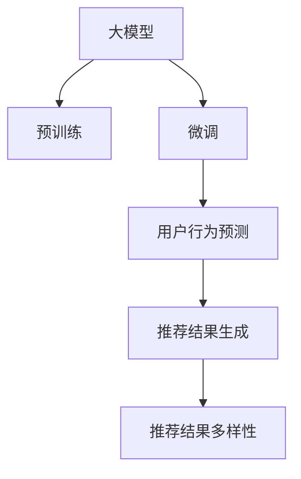

                 

# 大模型在商品推荐多样性优化中的创新

> 关键词：大模型,商品推荐,多样性优化,推荐系统,用户行为预测,深度学习

## 1. 背景介绍

随着互联网的普及和电商平台的快速发展，商品推荐系统已经成为提升用户体验、增加交易转化率的关键技术。传统的推荐系统主要依赖用户的历史行为数据进行相似性匹配和推荐，但随着用户行为数据的增长，传统推荐方法逐渐显现出其局限性。大模型的出现，使得商品推荐系统迈入了一个新的时代。通过预训练大模型进行微调，推荐系统可以获取更丰富的用户行为和商品特征信息，从而提升推荐的准确性和多样性。

### 1.1 问题由来

随着电商平台交易量的爆炸性增长，推荐系统面临着愈发严峻的挑战：

1. **数据稀疏性**：对于新用户和新商品，历史行为数据少，难以进行精准推荐。
2. **用户个性化需求**：用户多样化的需求难以通过单一的相似性匹配方法完全满足。
3. **信息过载**：用户在海量商品中选择决策，传统的推荐方法难以同时推荐多样性和相关性商品。

传统的推荐系统难以有效解决这些问题，而大模型通过大规模预训练和微调，可以充分利用数据的丰富性和多样性，提供更加个性化和多样化的推荐。

### 1.2 问题核心关键点

大模型在商品推荐系统中的应用主要集中在以下几个方面：

1. **用户行为理解**：通过预训练大模型提取用户的历史行为特征，理解用户偏好和兴趣。
2. **商品特征表示**：将商品信息进行高质量的表示，捕捉商品的独特性和多样性。
3. **推荐结果生成**：在用户查询或无查询情况下，生成个性化的商品推荐列表。
4. **推荐效果优化**：优化推荐算法，提升推荐的覆盖率和多样性，减少冷启动问题。

## 2. 核心概念与联系

### 2.1 核心概念概述

为更好地理解大模型在商品推荐中的应用，本节将介绍几个密切相关的核心概念：

- **大模型**：以自回归或自编码模型为代表的大规模预训练语言模型。通过在大规模无标签文本语料上进行预训练，学习通用的语言表示，具备强大的语言理解和生成能力。

- **预训练**：指在大规模无标签文本语料上，通过自监督学习任务训练通用语言模型的过程。常见的预训练任务包括言语建模、遮挡语言模型等。

- **微调**：指在预训练模型的基础上，使用下游任务的少量标注数据，通过有监督学习优化模型在特定任务上的性能。通常只需要调整顶层分类器或解码器，并以较小的学习率更新全部或部分的模型参数。

- **推荐系统**：根据用户的行为数据、商品属性信息等，自动推荐用户可能感兴趣的商品的系统。推荐系统分为基于协同过滤和基于内容推荐的两种主要方式。

- **用户行为预测**：利用历史行为数据或外部信息，预测用户未来的行为。

- **推荐结果多样性**：在推荐结果中，商品种类的多样性和相似商品的比例。

- **推荐系统模型**：包括矩阵分解、深度学习等各类算法，其中深度学习模型通过大模型进行微调，能够更加高效地解决推荐问题。

这些核心概念之间的逻辑关系可以通过以下Mermaid流程图来展示：



这个流程图展示了大模型的核心概念及其之间的关系：

1. 大模型通过预训练获得基础能力。
2. 微调是对预训练模型进行任务特定的优化，生成推荐结果。
3. 推荐结果生成过程对推荐结果的多样性进行优化。

## 3. 核心算法原理 & 具体操作步骤
### 3.1 算法原理概述

基于大模型的推荐系统，本质上是一个通过有监督学习的微调过程。其核心思想是：将预训练的大模型视作一个强大的"特征提取器"，通过下游任务的少量标注数据，优化模型在特定推荐任务上的性能，生成多样化、个性化的推荐结果。

形式化地，假设预训练模型为 $M_{\theta}$，其中 $\theta$ 为预训练得到的模型参数。给定推荐任务 $T$ 的标注数据集 $D=\{(x_i,y_i)\}_{i=1}^N$，推荐系统的优化目标是最小化经验风险，即找到最优参数：

$$
\theta^* = \mathop{\arg\min}_{\theta} \mathcal{L}(M_{\theta},D)
$$

其中 $\mathcal{L}$ 为针对任务 $T$ 设计的损失函数，用于衡量模型预测输出与真实标签之间的差异。常见的损失函数包括交叉熵损失、均方误差损失等。

### 3.2 算法步骤详解

基于大模型的推荐系统微调一般包括以下几个关键步骤：

**Step 1: 准备预训练模型和数据集**
- 选择合适的预训练语言模型 $M_{\theta}$ 作为初始化参数，如 BERT、GPT等。
- 准备推荐任务 $T$ 的标注数据集 $D$，划分为训练集、验证集和测试集。一般要求标注数据与预训练数据的分布不要差异过大。

**Step 2: 添加任务适配层**
- 根据推荐任务类型，在预训练模型顶层设计合适的输出层和损失函数。
- 对于推荐任务，通常在顶层添加交叉熵损失函数。
- 在微调过程中，可以通过调整输出层的权重来优化推荐结果。

**Step 3: 设置微调超参数**
- 选择合适的优化算法及其参数，如 AdamW、SGD 等，设置学习率、批大小、迭代轮数等。
- 设置正则化技术及强度，包括权重衰减、Dropout、Early Stopping等。
- 确定冻结预训练参数的策略，如仅微调顶层，或全部参数都参与微调。

**Step 4: 执行梯度训练**
- 将训练集数据分批次输入模型，前向传播计算损失函数。
- 反向传播计算参数梯度，根据设定的优化算法和学习率更新模型参数。
- 周期性在验证集上评估模型性能，根据性能指标决定是否触发 Early Stopping。
- 重复上述步骤直到满足预设的迭代轮数或 Early Stopping 条件。

**Step 5: 测试和部署**
- 在测试集上评估微调后模型 $M_{\hat{\theta}}$ 的性能，对比微调前后的推荐效果。
- 使用微调后的模型对新商品进行推荐，集成到实际的应用系统中。
- 持续收集新的用户行为数据，定期重新微调模型，以适应数据分布的变化。

以上是基于大模型的推荐系统微调的一般流程。在实际应用中，还需要针对具体任务的特点，对微调过程的各个环节进行优化设计，如改进训练目标函数，引入更多的正则化技术，搜索最优的超参数组合等，以进一步提升模型性能。

### 3.3 算法优缺点

基于大模型的推荐系统微调方法具有以下优点：

1. **模型性能优越**：利用大模型的强大表征能力，可以显著提升推荐结果的准确性和多样性。
2. **用户行为理解深入**：通过微调，模型可以更好地理解用户行为，生成更加个性化的推荐结果。
3. **模型灵活性高**：大模型可以通过微调调整不同层级的权重，灵活适应不同推荐场景。
4. **算法高效**：微调过程可以高效地利用少量标注数据进行优化。

同时，该方法也存在一定的局限性：

1. **计算资源消耗大**：大模型需要大量的计算资源进行预训练和微调，在小型电商平台可能面临计算瓶颈。
2. **模型复杂度高**：微调过程涉及复杂的模型结构和优化算法，需要较高的技术门槛。
3. **数据隐私问题**：用户的购物数据涉及隐私，需要采取严格的保护措施。

尽管存在这些局限性，但就目前而言，基于大模型的推荐系统微调方法仍是目前推荐系统领域的主流技术之一，具有显著的优势和广泛的应用前景。

### 3.4 算法应用领域

基于大模型的推荐系统微调方法在电商、视频、音乐等多个领域得到了广泛的应用，具体包括：

- **电商平台推荐**：根据用户历史行为和浏览数据，推荐可能感兴趣的商品。
- **视频内容推荐**：根据用户的观看历史和评分，推荐相关视频内容。
- **音乐推荐**：根据用户的听歌历史和评分，推荐相关音乐作品。
- **新闻推荐**：根据用户的阅读历史和兴趣标签，推荐相关新闻文章。

除了这些经典应用外，大模型微调技术还在社交媒体推荐、智能家居控制、个性化广告等多个领域展示了其强大的应用潜力。随着预训练模型和微调方法的不断进步，相信大模型推荐系统将在更广泛的场景中发挥重要作用。

## 4. 数学模型和公式 & 详细讲解  
### 4.1 数学模型构建

本节将使用数学语言对基于大模型的推荐系统微调过程进行更加严格的刻画。

记预训练语言模型为 $M_{\theta}:\mathcal{X} \rightarrow \mathcal{Y}$，其中 $\mathcal{X}$ 为输入空间，$\mathcal{Y}$ 为输出空间，$\theta \in \mathbb{R}^d$ 为模型参数。假设推荐任务 $T$ 的训练集为 $D=\{(x_i,y_i)\}_{i=1}^N$，其中 $x_i$ 表示用户的历史行为数据或商品属性，$y_i$ 表示推荐结果。

定义模型 $M_{\theta}$ 在输入 $x_i$ 上的推荐结果为 $y_i = M_{\theta}(x_i)$。推荐系统的损失函数可以定义为交叉熵损失函数：

$$
\ell(M_{\theta}(x_i),y_i) = -[y_i\log M_{\theta}(x_i) + (1-y_i)\log(1-M_{\theta}(x_i))]
$$

将其代入经验风险公式，得：

$$
\mathcal{L}(\theta) = -\frac{1}{N}\sum_{i=1}^N \ell(M_{\theta}(x_i),y_i)
$$

微调的优化目标是最小化经验风险，即找到最优参数：

$$
\theta^* = \mathop{\arg\min}_{\theta} \mathcal{L}(\theta)
$$

在实践中，我们通常使用基于梯度的优化算法（如SGD、Adam等）来近似求解上述最优化问题。设 $\eta$ 为学习率，$\lambda$ 为正则化系数，则参数的更新公式为：

$$
\theta \leftarrow \theta - \eta \nabla_{\theta}\mathcal{L}(\theta) - \eta\lambda\theta
$$

其中 $\nabla_{\theta}\mathcal{L}(\theta)$ 为损失函数对参数 $\theta$ 的梯度，可通过反向传播算法高效计算。

### 4.2 公式推导过程

以下我们以电商平台推荐为例，推导交叉熵损失函数及其梯度的计算公式。

假设模型 $M_{\theta}$ 在用户历史行为数据 $x_i$ 上的推荐结果为 $y_i = M_{\theta}(x_i)$，表示推荐给用户 $i$ 的商品列表。真实标签 $y \in \{0,1\}^M$，$M$ 为推荐商品数。则交叉熵损失函数定义为：

$$
\ell(M_{\theta}(x_i),y_i) = -\frac{1}{M}\sum_{j=1}^M y_{ij}\log M_{\theta}(x_i,j) + (1-y_{ij})\log(1-M_{\theta}(x_i,j))
$$

将其代入经验风险公式，得：

$$
\mathcal{L}(\theta) = -\frac{1}{N}\sum_{i=1}^N \frac{1}{M}\sum_{j=1}^M y_{ij}\log M_{\theta}(x_i,j) + (1-y_{ij})\log(1-M_{\theta}(x_i,j))
$$

根据链式法则，损失函数对参数 $\theta_k$ 的梯度为：

$$
\frac{\partial \mathcal{L}(\theta)}{\partial \theta_k} = -\frac{1}{N}\sum_{i=1}^N \frac{1}{M}\sum_{j=1}^M \left( \frac{y_{ij}}{M_{\theta}(x_i,j)} - \frac{1-y_{ij}}{1-M_{\theta}(x_i,j)} \right) \frac{\partial M_{\theta}(x_i,j)}{\partial \theta_k}
$$

其中 $\frac{\partial M_{\theta}(x_i,j)}{\partial \theta_k}$ 可进一步递归展开，利用自动微分技术完成计算。

在得到损失函数的梯度后，即可带入参数更新公式，完成模型的迭代优化。重复上述过程直至收敛，最终得到适应推荐任务的最优模型参数 $\theta^*$。

## 5. 项目实践：代码实例和详细解释说明
### 5.1 开发环境搭建

在进行推荐系统微调实践前，我们需要准备好开发环境。以下是使用Python进行PyTorch开发的环境配置流程：

1. 安装Anaconda：从官网下载并安装Anaconda，用于创建独立的Python环境。

2. 创建并激活虚拟环境：
```bash
conda create -n pytorch-env python=3.8 
conda activate pytorch-env
```

3. 安装PyTorch：根据CUDA版本，从官网获取对应的安装命令。例如：
```bash
conda install pytorch torchvision torchaudio cudatoolkit=11.1 -c pytorch -c conda-forge
```

4. 安装Transformers库：
```bash
pip install transformers
```

5. 安装各类工具包：
```bash
pip install numpy pandas scikit-learn matplotlib tqdm jupyter notebook ipython
```

完成上述步骤后，即可在`pytorch-env`环境中开始微调实践。

### 5.2 源代码详细实现

下面我们以电商平台推荐为例，给出使用Transformers库对BERT模型进行微调的PyTorch代码实现。

首先，定义推荐任务的数据处理函数：

```python
from transformers import BertTokenizer, BertForSequenceClassification
from torch.utils.data import Dataset, DataLoader
import torch

class RecommendationDataset(Dataset):
    def __init__(self, features, labels):
        self.features = features
        self.labels = labels
        
    def __len__(self):
        return len(self.features)
    
    def __getitem__(self, item):
        features = self.features[item]
        label = self.labels[item]
        return {'input_ids': features['input_ids'], 
                'attention_mask': features['attention_mask'],
                'labels': label}

# 加载数据集
dataset = RecommendationDataset(train_features, train_labels)
```

然后，定义模型和优化器：

```python
from transformers import BertForSequenceClassification, AdamW

model = BertForSequenceClassification.from_pretrained('bert-base-cased', num_labels=1, output_attentions=False, output_hidden_states=False)
optimizer = AdamW(model.parameters(), lr=2e-5)
```

接着，定义训练和评估函数：

```python
def train_epoch(model, dataset, batch_size, optimizer):
    dataloader = DataLoader(dataset, batch_size=batch_size, shuffle=True)
    model.train()
    epoch_loss = 0
    for batch in dataloader:
        input_ids = batch['input_ids'].to(device)
        attention_mask = batch['attention_mask'].to(device)
        labels = batch['labels'].to(device)
        model.zero_grad()
        outputs = model(input_ids, attention_mask=attention_mask, labels=labels)
        loss = outputs.loss
        epoch_loss += loss.item()
        loss.backward()
        optimizer.step()
    return epoch_loss / len(dataloader)

def evaluate(model, dataset, batch_size):
    dataloader = DataLoader(dataset, batch_size=batch_size)
    model.eval()
    preds, labels = [], []
    with torch.no_grad():
        for batch in dataloader:
            input_ids = batch['input_ids'].to(device)
            attention_mask = batch['attention_mask'].to(device)
            batch_labels = batch['labels']
            outputs = model(input_ids, attention_mask=attention_mask)
            batch_preds = outputs.logits.sigmoid().to('cpu').tolist()
            batch_labels = batch_labels.to('cpu').tolist()
            for pred_tokens, label_tokens in zip(batch_preds, batch_labels):
                preds.append(pred_tokens[0])
                labels.append(label_tokens[0])
                
    print(classification_report(labels, preds))
```

最后，启动训练流程并在测试集上评估：

```python
epochs = 5
batch_size = 16

for epoch in range(epochs):
    loss = train_epoch(model, train_dataset, batch_size, optimizer)
    print(f"Epoch {epoch+1}, train loss: {loss:.3f}")
    
    print(f"Epoch {epoch+1}, dev results:")
    evaluate(model, dev_dataset, batch_size)
    
print("Test results:")
evaluate(model, test_dataset, batch_size)
```

以上就是使用PyTorch对BERT进行电商平台推荐任务微调的完整代码实现。可以看到，得益于Transformers库的强大封装，我们可以用相对简洁的代码完成BERT模型的加载和微调。

### 5.3 代码解读与分析

让我们再详细解读一下关键代码的实现细节：

**RecommendationDataset类**：
- `__init__`方法：初始化特征和标签，为模型提供输入和输出。
- `__len__`方法：返回数据集的样本数量。
- `__getitem__`方法：对单个样本进行处理，返回模型所需的输入和标签。

**训练和评估函数**：
- 使用PyTorch的DataLoader对数据集进行批次化加载，供模型训练和推理使用。
- 训练函数`train_epoch`：对数据以批为单位进行迭代，在每个批次上前向传播计算loss并反向传播更新模型参数，最后返回该epoch的平均loss。
- 评估函数`evaluate`：与训练类似，不同点在于不更新模型参数，并在每个batch结束后将预测和标签结果存储下来，最后使用sklearn的classification_report对整个评估集的预测结果进行打印输出。

**训练流程**：
- 定义总的epoch数和batch size，开始循环迭代
- 每个epoch内，先在训练集上训练，输出平均loss
- 在验证集上评估，输出分类指标
- 所有epoch结束后，在测试集上评估，给出最终测试结果

可以看到，PyTorch配合Transformers库使得BERT微调的代码实现变得简洁高效。开发者可以将更多精力放在数据处理、模型改进等高层逻辑上，而不必过多关注底层的实现细节。

当然，工业级的系统实现还需考虑更多因素，如模型的保存和部署、超参数的自动搜索、更灵活的任务适配层等。但核心的微调范式基本与此类似。

## 6. 实际应用场景
### 6.1 电商平台推荐

基于大模型微调的推荐系统，可以广泛应用于电商平台商品推荐。传统推荐系统往往只依赖用户的历史行为数据进行相似性匹配和推荐，难以充分挖掘用户的多样化需求和商品的丰富信息。而大模型通过微调，能够更好地理解用户行为和商品特征，生成个性化和多样化的推荐结果。

在技术实现上，可以收集用户的历史浏览、点击、购买行为数据，商品属性、评价等信息，将数据进行高质量的编码表示，作为模型的输入和输出。将商品推荐看作一个二分类任务，对大模型进行微调，使其输出推荐结果的概率，从而生成个性化的商品推荐列表。

### 6.2 视频内容推荐

视频推荐系统主要面临用户行为多样性和视频内容丰富性的挑战。通过大模型微调，可以捕捉用户的多样化兴趣和视频内容的深度特征，提升推荐的准确性和多样性。

具体而言，可以收集用户观看历史、评分数据，以及视频的标签、描述等信息，作为微调任务的数据集。将用户行为和视频信息输入大模型进行微调，生成推荐结果。在推荐过程中，可以采用多任务学习的方式，同时优化用户行为预测和视频推荐两个任务，进一步提升推荐的性能。

### 6.3 音乐推荐

音乐推荐系统同样面临着个性化需求和内容多样性的挑战。通过大模型微调，可以获取用户的多样化音乐兴趣和音乐的丰富特征，生成更加个性化和多样化的推荐结果。

具体实现上，可以收集用户的听歌历史、评分数据，以及音乐的流派、时长、节奏等信息，作为微调任务的数据集。将用户行为和音乐信息输入大模型进行微调，生成推荐结果。在推荐过程中，可以结合协同过滤和内容推荐两种方法，综合用户行为和音乐特征，提升推荐的效果。

### 6.4 新闻推荐

新闻推荐系统主要依赖用户的阅读历史和兴趣标签进行推荐。通过大模型微调，可以更好地理解用户的兴趣偏好和新闻的深度内容，生成更加个性化和多样化的推荐结果。

具体实现上，可以收集用户的阅读历史、标签信息，以及新闻的标题、摘要、标签等信息，作为微调任务的数据集。将用户行为和新闻信息输入大模型进行微调，生成推荐结果。在推荐过程中，可以采用基于内容的推荐方法，结合用户行为和新闻内容，提升推荐的效果。

### 6.5 未来应用展望

随着大模型和微调方法的不断发展，基于大模型的推荐系统将在更多领域得到应用，为各类应用场景带来变革性影响。

在智慧医疗领域，基于大模型的推荐系统可以为医生推荐合适的医学知识、治疗方案等，提高诊疗的准确性和效率。

在智能教育领域，推荐系统可以为学生推荐个性化的学习内容、学习路径等，促进个性化学习的发展。

在智慧城市治理中，推荐系统可以为市民推荐合适的公共服务、交通出行等，提升城市管理的智能化水平。

此外，在企业生产、社交媒体、广告投放等多个领域，基于大模型的推荐系统也将不断涌现，为各行各业带来新的应用场景和价值。相信随着技术的日益成熟，大模型推荐系统必将在更广泛的领域发挥重要作用。

## 7. 工具和资源推荐
### 7.1 学习资源推荐

为了帮助开发者系统掌握大模型推荐系统的理论基础和实践技巧，这里推荐一些优质的学习资源：

1. 《Transformer from Principle to Practice》系列博文：由大模型技术专家撰写，深入浅出地介绍了Transformer原理、BERT模型、推荐系统等前沿话题。

2. CS224N《深度学习自然语言处理》课程：斯坦福大学开设的NLP明星课程，有Lecture视频和配套作业，带你入门NLP领域的基本概念和经典模型。

3. 《Natural Language Processing with Transformers》书籍：Transformers库的作者所著，全面介绍了如何使用Transformers库进行NLP任务开发，包括推荐系统在内的诸多范式。

4. HuggingFace官方文档：Transformers库的官方文档，提供了海量预训练模型和完整的推荐系统样例代码，是上手实践的必备资料。

5. Kaggle推荐系统竞赛数据集：包含丰富的推荐数据集和开源模型，可以用于学习和实践推荐系统算法。

通过对这些资源的学习实践，相信你一定能够快速掌握大模型推荐系统的精髓，并用于解决实际的推荐问题。
###  7.2 开发工具推荐

高效的开发离不开优秀的工具支持。以下是几款用于大模型推荐系统开发的常用工具：

1. PyTorch：基于Python的开源深度学习框架，灵活动态的计算图，适合快速迭代研究。大部分预训练语言模型都有PyTorch版本的实现。

2. TensorFlow：由Google主导开发的开源深度学习框架，生产部署方便，适合大规模工程应用。同样有丰富的预训练语言模型资源。

3. Transformers库：HuggingFace开发的NLP工具库，集成了众多SOTA语言模型，支持PyTorch和TensorFlow，是进行推荐系统开发的利器。

4. Weights & Biases：模型训练的实验跟踪工具，可以记录和可视化模型训练过程中的各项指标，方便对比和调优。与主流深度学习框架无缝集成。

5. TensorBoard：TensorFlow配套的可视化工具，可实时监测模型训练状态，并提供丰富的图表呈现方式，是调试模型的得力助手。

6. Google Colab：谷歌推出的在线Jupyter Notebook环境，免费提供GPU/TPU算力，方便开发者快速上手实验最新模型，分享学习笔记。

合理利用这些工具，可以显著提升大模型推荐系统的开发效率，加快创新迭代的步伐。

### 7.3 相关论文推荐

大模型推荐系统的发展源于学界的持续研究。以下是几篇奠基性的相关论文，推荐阅读：

1. Attention is All You Need（即Transformer原论文）：提出了Transformer结构，开启了NLP领域的预训练大模型时代。

2. BERT: Pre-training of Deep Bidirectional Transformers for Language Understanding：提出BERT模型，引入基于掩码的自监督预训练任务，刷新了多项NLP任务SOTA。

3. Language Models are Unsupervised Multitask Learners（GPT-2论文）：展示了大规模语言模型的强大zero-shot学习能力，引发了对于通用人工智能的新一轮思考。

4. Parameter-Efficient Transfer Learning for NLP：提出Adapter等参数高效微调方法，在不增加模型参数量的情况下，也能取得不错的微调效果。

5. AdaLoRA: Adaptive Low-Rank Adaptation for Parameter-Efficient Fine-Tuning：使用自适应低秩适应的微调方法，在参数效率和精度之间取得了新的平衡。

6. Multi-task Multi-semantic Learning with Proxy Information for Sequential Recommendation（ReCoRec）：提出利用多任务多语义学习的方法，提升推荐系统的性能。

这些论文代表了大模型推荐系统的发展脉络。通过学习这些前沿成果，可以帮助研究者把握学科前进方向，激发更多的创新灵感。

## 8. 总结：未来发展趋势与挑战

### 8.1 总结

本文对基于大模型的推荐系统微调方法进行了全面系统的介绍。首先阐述了大模型和微调技术的研究背景和意义，明确了微调在提升推荐系统性能、多样性方面的独特价值。其次，从原理到实践，详细讲解了基于大模型的推荐系统微调过程，给出了推荐系统微调的完整代码实例。同时，本文还广泛探讨了推荐系统在电商、视频、音乐等多个领域的应用前景，展示了微调范式的巨大潜力。此外，本文精选了推荐系统的各类学习资源，力求为读者提供全方位的技术指引。

通过本文的系统梳理，可以看到，基于大模型的推荐系统微调方法正在成为推荐系统领域的重要范式，极大地拓展了推荐系统的应用边界，催生了更多的落地场景。受益于大规模语料的预训练，微调模型能够更好地理解用户行为和商品特征，生成更加个性化和多样化的推荐结果，极大地提升了用户体验和交易转化率。未来，伴随预训练模型和微调方法的不断进步，基于大模型的推荐系统必将在更多领域得到应用，为各行业带来新的创新与发展。

### 8.2 未来发展趋势

展望未来，大模型推荐系统将呈现以下几个发展趋势：

1. **模型规模持续增大**：随着算力成本的下降和数据规模的扩张，预训练语言模型的参数量还将持续增长。超大规模语言模型蕴含的丰富语言知识，有望支撑更加复杂多变的推荐场景。

2. **推荐算法多样化**：除了传统的基于内容的推荐算法，未来将涌现更多结合深度学习和协同过滤的方法，提升推荐系统的综合性能。

3. **推荐结果多样化**：推荐系统将更加注重推荐结果的多样性和覆盖率，结合用户行为和商品特征，生成更加个性化和多样化的推荐列表。

4. **个性化推荐**：推荐系统将更加注重用户个性化需求，结合用户行为和商品特征，生成更加个性化的推荐结果。

5. **实时推荐**：推荐系统将实现实时推荐，结合用户实时行为和商品实时数据，提供更加精准的推荐服务。

6. **跨领域融合**：推荐系统将更多地与其他人工智能技术进行融合，如知识表示、因果推理、强化学习等，提升推荐系统的综合性能。

以上趋势凸显了大模型推荐系统的广阔前景。这些方向的探索发展，必将进一步提升推荐系统的性能和应用范围，为各行业带来新的创新与发展。

### 8.3 面临的挑战

尽管大模型推荐系统已经取得了瞩目成就，但在迈向更加智能化、普适化应用的过程中，它仍面临着诸多挑战：

1. **计算资源消耗大**：大模型需要大量的计算资源进行预训练和微调，在小型电商平台可能面临计算瓶颈。

2. **模型复杂度高**：微调过程涉及复杂的模型结构和优化算法，需要较高的技术门槛。

3. **数据隐私问题**：用户的购物数据涉及隐私，需要采取严格的保护措施。

4. **推荐效果评估**：如何科学地评估推荐效果，选择最优的推荐算法和模型，仍然是一个重要挑战。

5. **推荐结果多样性控制**：如何在推荐结果中平衡多样性和相关性，提升用户体验。

6. **冷启动问题**：对于新用户和新商品，如何通过少量数据进行推荐，仍然是一个挑战。

尽管存在这些挑战，但就目前而言，基于大模型的推荐系统微调方法仍是目前推荐系统领域的主流技术之一，具有显著的优势和广泛的应用前景。

### 8.4 研究展望

面对大模型推荐系统所面临的种种挑战，未来的研究需要在以下几个方面寻求新的突破：

1. **探索轻量级模型**：开发更加轻量级的推荐模型，减少计算资源的消耗，提升推荐系统的可部署性。

2. **结合知识图谱**：将知识图谱与大模型相结合，提升推荐系统的知识表示和推理能力。

3. **引入多模态信息**：结合图像、视频等多模态信息，提升推荐系统的感知能力和理解能力。

4. **优化推荐算法**：结合强化学习、多任务学习等算法，提升推荐系统的综合性能。

5. **注重用户隐私保护**：采用差分隐私、联邦学习等技术，保护用户隐私，增强推荐系统的安全性。

6. **探索无监督学习**：利用无监督学习的方法，提升推荐系统的鲁棒性和泛化能力。

7. **优化推荐结果多样性控制**：通过多目标优化等方法，平衡推荐结果的多样性和相关性，提升用户体验。

这些研究方向的探索，必将引领大模型推荐系统迈向更高的台阶，为各行业带来新的创新与发展。相信随着学界和产业界的共同努力，这些挑战终将一一被克服，大模型推荐系统必将在更广泛的领域发挥重要作用。

## 9. 附录：常见问题与解答

**Q1：大模型推荐系统是否适用于所有推荐场景？**

A: 大模型推荐系统在大多数推荐场景中都能取得不错的效果，特别是对于数据量较小的场景。但对于一些特定领域的推荐任务，如新闻、音乐等，推荐系统需要结合领域知识进行优化，以提升推荐效果。

**Q2：微调过程中如何选择超参数？**

A: 超参数的选择对推荐系统的性能影响很大。常见的超参数包括学习率、批大小、迭代轮数、正则化系数等。推荐系统中的超参数选择通常需要进行多次试验，找到最优的参数组合。

**Q3：推荐系统如何处理数据不平衡问题？**

A: 推荐系统中的数据不平衡问题主要体现在用户行为数据的不平衡上。可以通过重采样、加权损失函数等方式，平衡训练数据集，提升模型对少数类样本的识别能力。

**Q4：推荐系统如何应对大规模推荐数据？**

A: 推荐系统需要处理大规模推荐数据，通常采用分布式训练、增量学习等技术，提升训练效率。同时，可以使用模型压缩、稀疏化存储等方法，减小模型的存储空间和计算资源消耗。

**Q5：推荐系统的冷启动问题如何解决？**

A: 推荐系统的冷启动问题可以通过预训练大模型进行部分微调来解决。例如，可以通过对少量历史行为数据进行微调，生成个性化推荐结果。同时，可以采用基于内容的推荐方法，结合商品特征生成推荐结果。

正视推荐系统面临的这些挑战，积极应对并寻求突破，将是大模型推荐系统迈向成熟的必由之路。相信随着学界和产业界的共同努力，这些挑战终将一一被克服，大模型推荐系统必将在更广泛的领域发挥重要作用。总之，微调需要开发者根据具体任务，不断迭代和优化模型、数据和算法，方能得到理想的效果。

---

作者：禅与计算机程序设计艺术 / Zen and the Art of Computer Programming

