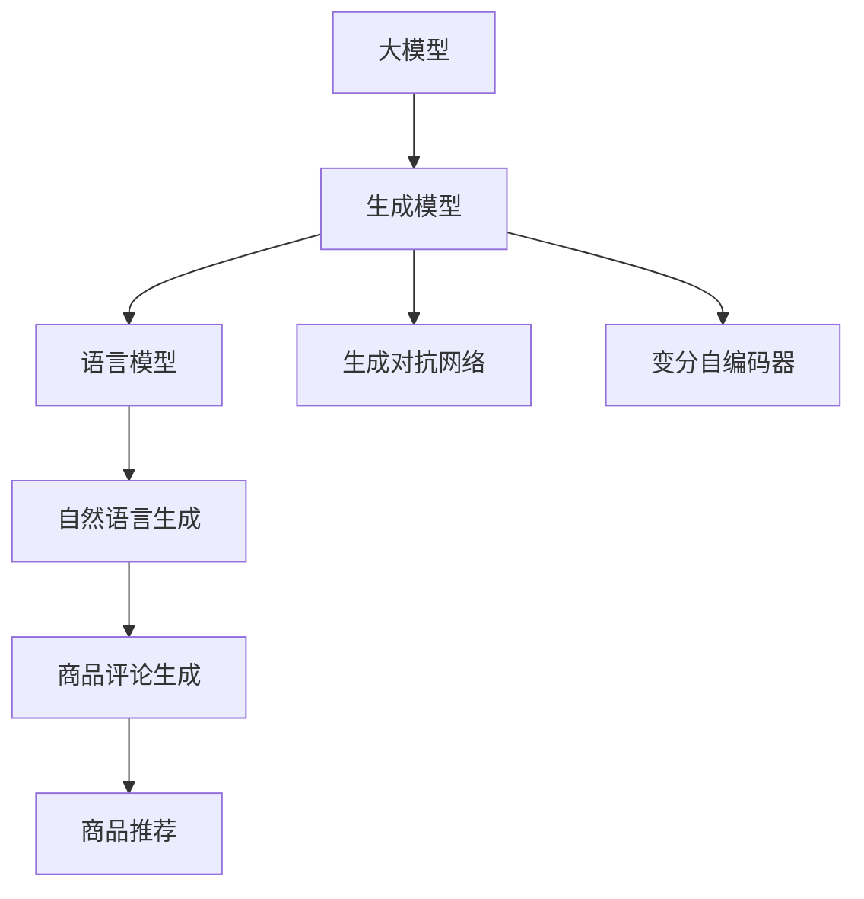

                 

# 大模型在商品评论生成中的应用

> 关键词：大模型, 生成式模型, 语言模型, 自然语言生成, 评论生成, 商品推荐, 生成对抗网络

## 1. 背景介绍

### 1.1 问题由来

随着电子商务的快速发展，用户生成内容（User Generated Content, UGC）在电商平台上的重要性日益凸显。商品评论作为一类常见的UGC，不仅能为商家提供宝贵的市场反馈，还能帮助其他消费者做出购买决策。然而，大量商品评论的生成和处理，需要耗费大量的人工和资源。如何在有限资源下高效生成高质量的商品评论，成为了电商平台亟需解决的问题。

在这一背景下，大模型在商品评论生成中的应用应运而生。大模型，尤其是基于深度学习的语言模型，具有强大的生成能力，能够根据输入条件自动生成高质量的文本，如新闻报道、电影台词、商品评论等。目前，已有多个大模型被应用于商品评论生成任务，取得了不错的效果。

### 1.2 问题核心关键点

大模型在商品评论生成中的应用，涉及以下核心问题：

1. **生成模型的选择**：不同的生成模型（如语言模型、变分自编码器、生成对抗网络等）具有不同的生成风格和效果，如何选择合适的生成模型是关键。
2. **训练数据的准备**：商品评论数据量庞大且不均衡，如何收集、清洗、标注这些数据，保证训练集质量。
3. **生成内容的控制**：生成的评论内容需要符合语法规则、情感倾向和主题一致性，如何通过模型参数和训练策略实现对生成内容的控制。
4. **生成效率的优化**：大模型生成速度较慢，如何优化模型结构和训练流程，提高生成效率。
5. **生成内容的评估**：如何客观评估生成内容的质量，保证生成的评论真实可信。

这些问题构成了大模型在商品评论生成应用中的关键挑战，需要在实践中不断探索和优化。

## 2. 核心概念与联系

### 2.1 核心概念概述

为更好地理解大模型在商品评论生成中的应用，本节将介绍几个密切相关的核心概念：

- **大模型(Large Model)**：以自回归(如GPT)或自编码(如BERT)模型为代表的大规模预训练语言模型。通过在大规模无标签文本语料上进行预训练，学习通用的语言表示，具备强大的语言理解和生成能力。
- **生成模型(Generative Model)**：用于生成文本、图像、声音等内容的模型，如语言模型、变分自编码器、生成对抗网络等。生成模型能够根据输入条件生成高质量的输出内容。
- **自然语言生成(Natural Language Generation, NLG)**：使用计算机自动生成自然语言文本的过程。大模型在商品评论生成中的应用属于自然语言生成的一种。
- **商品评论生成(Product Review Generation)**：自动生成对指定商品的真实、有见地的评价，以便消费者和商家参考。
- **生成对抗网络(Generative Adversarial Network, GAN)**：由生成器和判别器两个神经网络组成的模型，通过对抗训练生成高质量的样本数据。
- **变分自编码器(Variational Autoencoder, VAE)**：一种生成模型，能够将数据映射到低维潜在空间，然后从潜在空间中采样生成新的数据。

这些概念之间的逻辑关系可以通过以下Mermaid流程图来展示：



这个流程图展示了大模型和生成模型的关系，以及这些概念在商品评论生成中的应用：

1. 大模型通过预训练获得基础能力。
2. 生成模型，如语言模型、GAN、VAE等，可以用于商品评论的自动生成。
3. 自然语言生成是生成模型的具体应用。
4. 商品评论生成是自然语言生成的一个重要子任务。
5. 商品推荐系统利用生成的商品评论进行推荐。

这些概念共同构成了大模型在商品评论生成中的理论和应用框架，使其能够生成高质量、有价值的商品评论。

## 3. 核心算法原理 & 具体操作步骤
### 3.1 算法原理概述

大模型在商品评论生成中的应用，本质上是将大模型视作一个文本生成器，通过设定一定的条件，自动生成符合要求的商品评论。这一过程可以视为一种特殊的自然语言生成任务。

假设大模型的预训练参数为 $\theta$，商品评论生成任务的条件为 $c$，则生成评论 $r$ 的过程可以表示为：

$$
r = M_{\theta}(c)
$$

其中 $M_{\theta}$ 为预训练好的大模型，$c$ 为商品评论生成任务的具体条件，$r$ 为生成的评论文本。

大模型的生成能力基于其预训练知识，即通过大规模无标签文本的预训练，学习到了丰富的语言知识和常识。在商品评论生成任务中，条件 $c$ 可以是商品的描述、类别、评分等，这些条件将引导模型生成与商品相关、符合要求的评论。

### 3.2 算法步骤详解

大模型在商品评论生成中的应用，通常包括以下几个关键步骤：

**Step 1: 准备预训练模型和数据集**
- 选择合适的预训练语言模型，如GPT、BERT、T5等。
- 准备商品评论数据集，包括商品的描述、类别、评分等。
- 对数据集进行清洗和预处理，去除噪声和异常值。

**Step 2: 添加任务适配层**
- 在预训练模型的基础上，设计合适的任务适配层。对于商品评论生成任务，通常需要在顶层添加一个生成器网络，输出符合语法规则的评论文本。
- 使用解码器生成评论文本，并设置损失函数（如交叉熵损失）。

**Step 3: 设置生成模型超参数**
- 选择合适的优化算法及其参数，如Adam、SGD等，设置学习率、批大小、迭代轮数等。
- 应用正则化技术，如L2正则、Dropout等，防止过拟合。
- 设置生成器的温度参数，控制生成的文本多样性。

**Step 4: 执行生成任务**
- 将商品评论生成条件 $c$ 输入模型，前向传播计算生成评论 $r$。
- 计算生成评论的损失，使用优化算法更新模型参数。
- 重复上述步骤直至满足预设的生成效果。

**Step 5: 评估和反馈**
- 在验证集上评估生成评论的质量，使用BLEU、ROUGE等指标进行客观评估。
- 收集用户反馈，根据反馈结果调整生成模型和训练策略。

### 3.3 算法优缺点

大模型在商品评论生成中的应用，具有以下优点：

1. **生成效果好**：大模型具有强大的语言生成能力，生成的评论通常质量较高，符合语法和语义规则。
2. **自动化程度高**：通过自动生成评论，节省了大量的人工标注成本，提高了生成效率。
3. **适应性强**：大模型能够适应不同商品和类别的评论生成需求，具有较好的泛化能力。

同时，该方法也存在一定的局限性：

1. **数据依赖性强**：生成评论的质量很大程度上依赖于训练数据的数量和质量，数据集的大小和多样性直接影响生成效果。
2. **训练成本高**：大模型的训练需要强大的计算资源，训练过程耗时较长。
3. **生成内容可控性差**：生成的评论文本具有一定的不确定性，可能包含错误或不合适的信息。
4. **生成效率低**：大模型的推理速度较慢，生成评论需要较长的时间。

尽管存在这些局限性，但大模型在商品评论生成中的应用已经取得了显著的效果，并在电商平台上得到了广泛应用。

### 3.4 算法应用领域

大模型在商品评论生成中的应用，不仅能够为商家和消费者提供价值，还在多个领域得到了广泛的应用，例如：

- **电商平台**：自动生成商品评论，帮助用户了解商品质量、性价比等，提升购物体验。
- **零售商**：利用生成的评论进行市场分析和需求预测，优化库存管理。
- **内容创作者**：辅助写手生成商品评测文章，提升内容创作效率。
- **消费者社区**：在社区论坛上自动生成商品评测，吸引更多用户参与讨论。
- **广告和营销**：自动生成产品广告文案，提高广告投放的精准度和转化率。

除了上述这些应用场景外，大模型在商品评论生成中的应用还在不断拓展，未来有望在更多领域发挥更大作用。

## 4. 数学模型和公式 & 详细讲解 & 举例说明

### 4.1 数学模型构建

大模型在商品评论生成中的应用，可以形式化地表示为以下数学模型：

设大模型的预训练参数为 $\theta$，商品评论生成任务的条件为 $c$，生成的评论文本为 $r$，则生成评论的过程可以表示为：

$$
r = M_{\theta}(c)
$$

其中 $M_{\theta}$ 为大模型的生成器网络，$c$ 为条件输入，$r$ 为生成结果。

### 4.2 公式推导过程

以语言模型为基础的生成器为例，其生成过程可以表示为：

$$
p(r|c) = \prod_{i=1}^{N} p(r_i|r_{<i}, c)
$$

其中 $r_i$ 为评论中的第 $i$ 个词，$p(r_i|r_{<i}, c)$ 为生成第 $i$ 个词的概率。

对于生成模型，通常使用交叉熵损失函数来衡量生成结果与真实文本之间的差异：

$$
L(r,c) = -\log p(r|c)
$$

生成模型的优化目标是最大化生成结果与真实文本之间的概率，即最小化损失函数 $L(r,c)$。

### 4.3 案例分析与讲解

以BERT模型为例，其生成商品评论的过程可以如下描述：

1. 使用BERT作为预训练模型，在其顶部添加一个生成器网络。
2. 将商品的描述、类别、评分等条件 $c$ 输入模型，计算生成评论 $r$。
3. 计算生成评论与真实评论之间的交叉熵损失。
4. 使用Adam等优化算法更新模型参数，最小化损失函数。
5. 重复上述步骤直至满足预设的生成效果。

通过上述步骤，BERT模型能够自动生成符合商品相关性的评论，提升电商平台的商品推荐和用户体验。

## 5. 项目实践：代码实例和详细解释说明
### 5.1 开发环境搭建

在进行商品评论生成实践前，我们需要准备好开发环境。以下是使用Python进行PyTorch开发的环境配置流程：

1. 安装Anaconda：从官网下载并安装Anaconda，用于创建独立的Python环境。

2. 创建并激活虚拟环境：
```bash
conda create -n pytorch-env python=3.8 
conda activate pytorch-env
```

3. 安装PyTorch：根据CUDA版本，从官网获取对应的安装命令。例如：
```bash
conda install pytorch torchvision torchaudio cudatoolkit=11.1 -c pytorch -c conda-forge
```

4. 安装HuggingFace Transformers库：
```bash
pip install transformers
```

5. 安装各类工具包：
```bash
pip install numpy pandas scikit-learn matplotlib tqdm jupyter notebook ipython
```

完成上述步骤后，即可在`pytorch-env`环境中开始商品评论生成的实践。

### 5.2 源代码详细实现

下面我们以使用BERT模型进行商品评论生成为例，给出完整的PyTorch代码实现。

首先，定义商品评论生成任务的数据处理函数：

```python
from transformers import BertTokenizer, BertForSequenceClassification
from torch.utils.data import Dataset
import torch

class ProductReviewDataset(Dataset):
    def __init__(self, texts, labels):
        self.texts = texts
        self.labels = labels
        self.tokenizer = BertTokenizer.from_pretrained('bert-base-cased')
        
    def __len__(self):
        return len(self.texts)
    
    def __getitem__(self, item):
        text = self.texts[item]
        label = self.labels[item]
        
        encoding = self.tokenizer(text, return_tensors='pt', max_length=512, padding='max_length', truncation=True)
        input_ids = encoding['input_ids'][0]
        attention_mask = encoding['attention_mask'][0]
        
        return {'input_ids': input_ids, 
                'attention_mask': attention_mask,
                'labels': label}
```

然后，定义模型和优化器：

```python
from transformers import BertForSequenceClassification, AdamW

model = BertForSequenceClassification.from_pretrained('bert-base-cased', num_labels=1)
optimizer = AdamW(model.parameters(), lr=2e-5)
```

接着，定义训练和评估函数：

```python
from torch.utils.data import DataLoader
from tqdm import tqdm
from sklearn.metrics import accuracy_score

device = torch.device('cuda') if torch.cuda.is_available() else torch.device('cpu')
model.to(device)

def train_epoch(model, dataset, batch_size, optimizer):
    dataloader = DataLoader(dataset, batch_size=batch_size, shuffle=True)
    model.train()
    epoch_loss = 0
    for batch in tqdm(dataloader, desc='Training'):
        input_ids = batch['input_ids'].to(device)
        attention_mask = batch['attention_mask'].to(device)
        labels = batch['labels'].to(device)
        model.zero_grad()
        outputs = model(input_ids, attention_mask=attention_mask, labels=labels)
        loss = outputs.loss
        epoch_loss += loss.item()
        loss.backward()
        optimizer.step()
    return epoch_loss / len(dataloader)

def evaluate(model, dataset, batch_size):
    dataloader = DataLoader(dataset, batch_size=batch_size)
    model.eval()
    preds, labels = [], []
    with torch.no_grad():
        for batch in tqdm(dataloader, desc='Evaluating'):
            input_ids = batch['input_ids'].to(device)
            attention_mask = batch['attention_mask'].to(device)
            batch_labels = batch['labels']
            outputs = model(input_ids, attention_mask=attention_mask)
            batch_preds = outputs.logits.argmax(dim=1).to('cpu').tolist()
            batch_labels = batch_labels.to('cpu').tolist()
            for pred, label in zip(batch_preds, batch_labels):
                preds.append(pred.item())
                labels.append(label.item())
                
    print(f"Accuracy: {accuracy_score(labels, preds):.3f}")
```

最后，启动训练流程并在测试集上评估：

```python
epochs = 5
batch_size = 16

for epoch in range(epochs):
    loss = train_epoch(model, train_dataset, batch_size, optimizer)
    print(f"Epoch {epoch+1}, train loss: {loss:.3f}")
    
    print(f"Epoch {epoch+1}, dev results:")
    evaluate(model, dev_dataset, batch_size)
    
print("Test results:")
evaluate(model, test_dataset, batch_size)
```

以上就是使用PyTorch对BERT进行商品评论生成任务的微调实践。可以看到，使用HuggingFace的Transformers库，可以很方便地加载预训练模型并对其进行微调。

### 5.3 代码解读与分析

让我们再详细解读一下关键代码的实现细节：

**ProductReviewDataset类**：
- `__init__`方法：初始化文本和标签，并使用BERT的Tokenizer将文本进行分词和编码。
- `__len__`方法：返回数据集的样本数量。
- `__getitem__`方法：对单个样本进行处理，将文本输入编码为token ids，并将标签编码为数字，进行定长padding。

**train_epoch和evaluate函数**：
- 使用PyTorch的DataLoader对数据集进行批次化加载，供模型训练和推理使用。
- 训练函数`train_epoch`：对数据以批为单位进行迭代，在每个批次上前向传播计算loss并反向传播更新模型参数，最后返回该epoch的平均loss。
- 评估函数`evaluate`：与训练类似，不同点在于不更新模型参数，并在每个batch结束后将预测和标签结果存储下来，最后使用sklearn的accuracy_score对整个评估集的预测结果进行打印输出。

**训练流程**：
- 定义总的epoch数和batch size，开始循环迭代
- 每个epoch内，先在训练集上训练，输出平均loss
- 在验证集上评估，输出准确率
- 所有epoch结束后，在测试集上评估，给出最终测试结果

可以看到，PyTorch配合Transformers库使得BERT微调的代码实现变得简洁高效。开发者可以将更多精力放在数据处理、模型改进等高层逻辑上，而不必过多关注底层的实现细节。

当然，工业级的系统实现还需考虑更多因素，如模型的保存和部署、超参数的自动搜索、更灵活的任务适配层等。但核心的微调范式基本与此类似。

## 6. 实际应用场景

### 6.1 电商平台

大模型在商品评论生成中的应用，可以在电商平台中得到广泛应用。具体而言，可以为每个商品生成定量的高质量评论，用于商品展示、推荐和搜索等环节。例如：

- 商品展示：在商品页面上自动生成多条评论，展示给用户，吸引其进行购买。
- 推荐系统：利用生成的评论进行用户画像建模，推荐相关商品，提升用户满意度。
- 搜索排序：将生成的评论作为特征，提升商品搜索排序的准确性。

通过自动生成商品评论，电商平台能够大幅提升用户体验和销售转化率。

### 6.2 零售商

大模型在商品评论生成中的应用，同样可以应用于零售商的市场分析和库存管理。具体而言，可以利用生成的评论进行需求预测、市场趋势分析等，帮助商家优化库存管理，提升运营效率。例如：

- 需求预测：分析商品评论中的用户反馈，预测未来销量，调整库存水平。
- 市场趋势分析：通过评论数据挖掘用户偏好和市场趋势，指导商品采购和市场调整。
- 风险管理：监测商品评论中的负面信息，及时应对市场波动，规避风险。

通过利用生成的评论，零售商能够更好地把握市场需求，优化供应链管理，提升整体运营效率。

### 6.3 内容创作者

大模型在商品评论生成中的应用，还可以辅助内容创作者进行商品评测文章的生成。具体而言，可以利用生成的评论生成详细的商品评测，提升内容创作效率和质量。例如：

- 商品评测文章：通过分析商品评论，自动生成详细的商品评测文章，帮助内容创作者快速创作。
- 数据整合：整合多条评论生成综合评测，提供更加全面和客观的商品评价。
- 内容审核：对自动生成的评论进行审核，过滤低质量和有害内容，提升内容质量。

通过利用生成的评论，内容创作者能够更快地获取商品信息，提升内容创作效率，增加内容质量。

### 6.4 消费者社区

大模型在商品评论生成中的应用，还可以应用于消费者社区，帮助用户快速获取商品信息。具体而言，可以利用生成的评论进行商品讨论和推荐，提升社区活跃度和用户体验。例如：

- 商品讨论：在社区论坛上自动生成商品评测，吸引更多用户参与讨论，提升社区活跃度。
- 推荐系统：利用生成的评论进行个性化推荐，提升用户满意度。
- 广告投放：在社区中自动生成商品广告文案，提高广告投放的精准度和转化率。

通过利用生成的评论，消费者社区能够更好地吸引用户参与，提升用户体验，增加社区粘性。

## 7. 工具和资源推荐
### 7.1 学习资源推荐

为了帮助开发者系统掌握大模型在商品评论生成中的应用，这里推荐一些优质的学习资源：

1. 《自然语言处理入门与实践》：一本系统介绍自然语言处理基础和应用的书，涵盖语言模型、生成模型等多个方面。
2. 《深度学习基础》：斯坦福大学开设的深度学习课程，讲解深度学习的基本概念和算法，适合初学者入门。
3. 《生成对抗网络：理论与实践》：讲解生成对抗网络的基本原理和应用，适合对生成模型感兴趣的读者。
4. 《自然语言生成》：一本系统介绍自然语言生成技术的书，涵盖语言模型、变分自编码器等多个方面。
5. 《BERT系列论文》：BERT的作者论文集，详细讲解BERT模型的原理和应用，适合深度学习从业者学习。

通过对这些资源的学习实践，相信你一定能够快速掌握大模型在商品评论生成中的应用方法，并用于解决实际的NLP问题。
###  7.2 开发工具推荐

高效的开发离不开优秀的工具支持。以下是几款用于大模型商品评论生成开发的常用工具：

1. PyTorch：基于Python的开源深度学习框架，灵活动态的计算图，适合快速迭代研究。
2. TensorFlow：由Google主导开发的开源深度学习框架，生产部署方便，适合大规模工程应用。
3. HuggingFace Transformers库：集成了多个SOTA语言模型，支持PyTorch和TensorFlow，是进行商品评论生成任务开发的利器。
4. Weights & Biases：模型训练的实验跟踪工具，可以记录和可视化模型训练过程中的各项指标，方便对比和调优。
5. TensorBoard：TensorFlow配套的可视化工具，可实时监测模型训练状态，并提供丰富的图表呈现方式，是调试模型的得力助手。
6. Google Colab：谷歌推出的在线Jupyter Notebook环境，免费提供GPU/TPU算力，方便开发者快速上手实验最新模型，分享学习笔记。

合理利用这些工具，可以显著提升大模型商品评论生成任务的开发效率，加快创新迭代的步伐。

### 7.3 相关论文推荐

大模型在商品评论生成中的应用源于学界的持续研究。以下是几篇奠基性的相关论文，推荐阅读：

1. Attention is All You Need：提出了Transformer结构，开启了NLP领域的预训练大模型时代。
2. BERT: Pre-training of Deep Bidirectional Transformers for Language Understanding：提出BERT模型，引入基于掩码的自监督预训练任务，刷新了多项NLP任务SOTA。
3. Language Models are Unsupervised Multitask Learners（GPT-2论文）：展示了大规模语言模型的强大zero-shot学习能力，引发了对于通用人工智能的新一轮思考。
4. Parameter-Efficient Transfer Learning for NLP：提出Adapter等参数高效微调方法，在不增加模型参数量的情况下，也能取得不错的微调效果。
5. Generative Adversarial Nets：介绍生成对抗网络的基本原理和应用，奠定了GAN在生成模型中的应用基础。
6. Variational Autoencoders：讲解变分自编码器的基本原理和应用，适用于生成模型的训练。

这些论文代表了大模型商品评论生成技术的发展脉络。通过学习这些前沿成果，可以帮助研究者把握学科前进方向，激发更多的创新灵感。

## 8. 总结：未来发展趋势与挑战

### 8.1 总结

本文对大模型在商品评论生成中的应用进行了全面系统的介绍。首先阐述了大模型和生成模型在商品评论生成中的研究背景和意义，明确了生成模型在提升电商平台的商品推荐和用户体验方面的独特价值。其次，从原理到实践，详细讲解了大模型生成评论的数学模型和关键步骤，给出了商品评论生成任务的微调代码实例。同时，本文还广泛探讨了大模型在电商平台、零售商、内容创作者、消费者社区等多个领域的应用前景，展示了其广阔的应用潜力。此外，本文精选了商品评论生成任务的学习资源，力求为读者提供全方位的技术指引。

通过本文的系统梳理，可以看到，大模型在商品评论生成中的应用已经取得了显著的效果，并在电商平台上得到了广泛应用。未来，伴随大模型和生成模型的不断进步，商品评论生成技术必将进一步提升电商平台的商品推荐和用户体验，推动电商行业的数字化转型升级。

### 8.2 未来发展趋势

展望未来，大模型在商品评论生成中的应用将呈现以下几个发展趋势：

1. **生成模型的多样性**：除了语言模型，未来的生成模型将更多地采用GAN、VAE等，提升生成效果的自然性和多样性。
2. **生成内容的控制**：通过引入生成模型的温度参数、生成器的结构和训练策略，更好地控制生成内容的情感、语义和风格。
3. **生成效率的优化**：开发更加轻量级的生成模型，优化模型结构和训练流程，提高生成效率。
4. **生成内容的评估**：开发更加客观、可靠的评估指标，如BLEU、ROUGE等，确保生成内容的真实性和可理解性。
5. **多模态生成**：将生成模型应用于多模态数据，提升生成内容的丰富性和多样性。
6. **自监督学习**：引入自监督学习范式，利用无标签数据提升生成模型的泛化能力。

这些趋势凸显了大模型在商品评论生成中的广泛应用前景，未来的研究和应用将进一步提升生成模型的效果和实用性。

### 8.3 面临的挑战

尽管大模型在商品评论生成中的应用已经取得了显著效果，但在迈向更加智能化、普适化应用的过程中，它仍面临着诸多挑战：

1. **生成内容的真实性**：自动生成的评论可能存在虚假或不实信息，影响用户决策。
2. **生成内容的可控性**：生成的评论可能包含不合适或有害的内容，需要进一步加强内容审核。
3. **生成内容的泛化能力**：生成的评论可能对特定商品的描述过于机械化，缺乏个性化和多样性。
4. **生成内容的冗余**：自动生成的评论可能存在内容冗余或重复，影响用户体验。
5. **生成内容的风格差异**：不同商品的描述风格差异较大，生成的评论可能难以统一风格，影响商品推荐。

这些挑战需要在实践中不断探索和解决，以进一步提升大模型在商品评论生成中的应用效果。

### 8.4 研究展望

面对大模型在商品评论生成应用中面临的挑战，未来的研究需要在以下几个方面寻求新的突破：

1. **生成内容的真实性保障**：引入自然语言推理、常识推理等技术，提升生成内容的真实性和可信度。
2. **生成内容的可控性提升**：通过改进生成器的结构、增加约束条件等手段，提升生成内容的可控性，减少不合适或有害的内容。
3. **生成内容的个性化**：结合用户画像、商品属性等信息，提升生成内容的个性化和多样性，增强推荐效果。
4. **生成内容的风格差异处理**：引入多模态信息、上下文信息等，提升生成内容的风格差异处理能力，增强商品推荐的效果。
5. **生成内容的泛化能力提升**：引入更多的任务适配层，增加生成器的训练数据，提升生成内容的泛化能力。
6. **生成内容的效率优化**：优化模型结构、训练流程，提高生成效率，增强用户体验。

这些研究方向的探索，必将引领大模型在商品评论生成技术迈向更高的台阶，为电商平台的商品推荐和用户体验提供更加智能、可靠的服务。面向未来，大模型在商品评论生成中的研究和应用还将进一步拓展，为电商行业带来更多变革性的应用场景。

## 9. 附录：常见问题与解答

**Q1：大模型在商品评论生成中是否依赖标注数据？**

A: 大模型在商品评论生成中的应用，通常依赖标注数据进行微调。标注数据的质量和数量直接影响生成评论的质量。标注数据的收集、清洗和预处理是商品评论生成任务的重要环节，需要特别注意。

**Q2：如何选择合适的大模型进行商品评论生成？**

A: 选择合适的大模型进行商品评论生成，需要综合考虑以下因素：

1. 模型的预训练效果：选择预训练效果好的模型，如BERT、GPT等。
2. 任务适配层的设置：根据商品评论生成任务的特点，设置合适的任务适配层，如生成器网络、输出层等。
3. 训练数据的多样性：选择数据多样性较好的模型，避免过拟合。
4. 模型的训练和推理效率：选择训练和推理效率较高的模型，避免生成过程过于耗时。

**Q3：如何提高大模型在商品评论生成中的生成效果？**

A: 提高大模型在商品评论生成中的生成效果，可以从以下几个方面入手：

1. 数据准备：收集高质量、多样化的标注数据，进行清洗和预处理，提升训练集质量。
2. 模型结构优化：调整生成器的结构和超参数，如温度参数、学习率等，提升生成效果。
3. 训练策略优化：采用对抗训练、自监督学习等方法，提高生成模型的泛化能力。
4. 内容控制：引入自然语言推理、常识推理等技术，提升生成内容的真实性和可控性。
5. 多模态融合：结合商品图片、标签等多元信息，提升生成内容的丰富性和多样性。

**Q4：如何评估商品评论生成模型的生成效果？**

A: 评估商品评论生成模型的生成效果，通常使用以下指标：

1. 自动评估指标：如BLEU、ROUGE、PER等，衡量生成文本与真实文本之间的相似度。
2. 人工评估指标：如流畅度、真实性、多样性等，由人工进行主观评估。
3. 实际应用效果：如用户满意度、点击率等，通过实际应用反馈进行评估。

这些指标可以综合使用，全面评估商品评论生成模型的生成效果。

**Q5：大模型在商品评论生成中的资源消耗问题如何解决？**

A: 大模型在商品评论生成中的资源消耗问题，可以通过以下方式解决：

1. 模型压缩：对模型进行压缩，减少参数量和计算量。
2. 推理加速：使用优化技术如剪枝、量化等，提高模型推理速度。
3. 分布式训练：利用多机多核分布式训练，提高训练速度。
4. 缓存机制：利用缓存机制，减少重复计算，提高效率。

通过以上措施，可以降低大模型在商品评论生成中的资源消耗，提升生成效率。

---

作者：禅与计算机程序设计艺术 / Zen and the Art of Computer Programming

