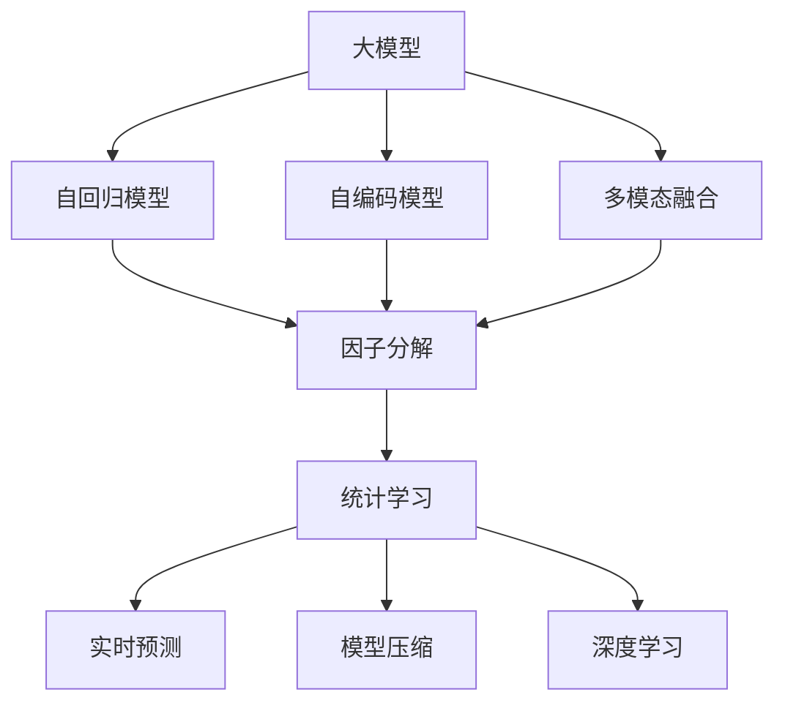
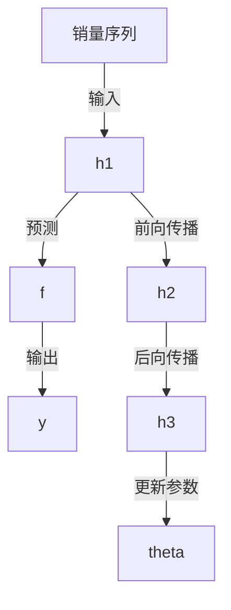

                 

# 大模型在商品销量预测中的创新应用

> 关键词：大模型, 商品销量预测, 自回归模型, 自编码模型, 多模态融合, 因子分解, 统计学习, 实时预测, 模型压缩, 深度学习

## 1. 背景介绍

### 1.1 问题由来
商品销量预测是大数据领域中的一个重要应用，对于电商平台、零售商、制造企业等具有重要意义。传统的商品销量预测方法主要依赖统计学模型，如ARIMA、时间序列分析等，但这些方法往往需要人工调参，且难以处理复杂的非线性关系和多模态数据。近年来，随着深度学习技术的发展，大模型在商品销量预测中的应用日益广泛。

### 1.2 问题核心关键点
商品销量预测的核心问题在于如何构建准确、高效的预测模型。传统的统计方法无法处理大规模、高维度、多模态数据，而深度学习方法则能够从数据中自动学习出复杂的非线性关系，但计算成本较高，模型复杂度难以控制。大模型通过大规模预训练，学习到丰富的领域知识，能够有效提升销量预测的精度和鲁棒性，同时降低计算成本，成为商品销量预测的新范式。

### 1.3 问题研究意义
大模型在商品销量预测中的应用，能够为电商平台和零售商提供更加精准、实时的销量预测，帮助其进行库存管理、订单调度、市场策划等决策。此外，大模型还可以应用于制造企业的产品需求预测，优化生产计划，提高供应链效率。因此，探索大模型在商品销量预测中的应用，具有重要的学术价值和实际意义。

## 2. 核心概念与联系

### 2.1 核心概念概述

为更好地理解大模型在商品销量预测中的应用，本节将介绍几个密切相关的核心概念：

- 大模型(Large Model)：指通过大规模预训练学习到丰富领域知识的高参数模型，如BERT、GPT、Transformer等。
- 自回归模型(Autoregressive Model)：指模型输出与输入序列中前面数据有关，常见于文本生成、时间序列预测等任务。
- 自编码模型(Autocoding Model)：指模型输出为输入序列的低维编码表示，常见于图像、音频等领域。
- 多模态融合(Multimodal Fusion)：指将来自不同模态的数据(如文本、图像、时间序列等)进行联合建模，提升预测性能。
- 因子分解(Factor Decomposition)：指将高维数据分解为若干低维因子，常见于矩阵分解、降维等技术中。
- 统计学习(Statistical Learning)：指通过训练样本数据构建模型，用于预测或分类。
- 实时预测(Real-time Prediction)：指在数据生成时实时计算预测结果，满足低延迟的要求。
- 模型压缩(Model Compression)：指对大模型进行优化，减小参数量，提升推理速度，降低计算成本。
- 深度学习(Deep Learning)：指利用深度神经网络进行特征提取和模式学习，常见于计算机视觉、自然语言处理等领域。

这些核心概念之间的逻辑关系可以通过以下Mermaid流程图来展示：



这个流程图展示了大模型及其应用的关键概念：

1. 大模型通过大规模预训练学习到领域知识。
2. 自回归模型用于处理序列数据，通过模型输出预测未来值。
3. 自编码模型用于处理高维数据，通过编码器将输入转化为低维表示。
4. 多模态融合将不同模态数据联合建模，提升预测性能。
5. 因子分解将高维数据分解为若干低维因子，便于处理和建模。
6. 统计学习通过训练样本数据构建预测模型，用于实时预测。
7. 实时预测满足低延迟要求，适用于高频数据处理。
8. 模型压缩优化大模型，提升推理速度，降低计算成本。
9. 深度学习利用神经网络进行特征提取和模式学习。

这些概念共同构成了大模型在商品销量预测中的应用框架，使得大模型能够高效地处理复杂的非线性关系和多模态数据，提供精准的销量预测。

## 3. 核心算法原理 & 具体操作步骤
### 3.1 算法原理概述

大模型在商品销量预测中的应用，本质上是一个基于统计学习的自回归模型。其核心思想是：通过大规模预训练学习到丰富的领域知识，利用模型输出预测未来销量。

形式化地，假设预训练模型为 $M_{\theta}$，其中 $\theta$ 为预训练得到的模型参数。给定商品历史销量序列 $x=\{s_1,s_2,\dots,s_t\}$ 和未来销量序列 $y=\{s_{t+1},s_{t+2},\dots,s_{t+T}\}$，预测任务为 $\hat{y}=\{s_{t+1},s_{t+2},\dots,s_{t+T}\}$。

模型的训练目标是最小化预测误差，即：

$$
\mathcal{L}(\theta) = \frac{1}{T}\sum_{i=t+1}^{t+T}(y_i-\hat{y}_i)^2
$$

其中 $\hat{y}_i$ 为模型预测值，$y_i$ 为实际值。模型通过梯度下降等优化算法更新参数 $\theta$，最小化损失函数 $\mathcal{L}(\theta)$，使得模型输出逼近真实销量。

### 3.2 算法步骤详解

大模型在商品销量预测中的应用步骤如下：

**Step 1: 准备数据集**

- 收集商品的历史销量数据，包括时间序列、价格、促销活动等信息。
- 根据预测目标，构建训练数据集和测试数据集。

**Step 2: 预训练模型**

- 选择合适的预训练模型，如BERT、GPT等。
- 在无标签的大规模数据上进行预训练，学习领域知识。

**Step 3: 设计预测模型**

- 根据预测任务，设计自回归预测模型。
- 选择合适的网络结构，如RNN、LSTM、GRU等。
- 确定模型的输出层，如线性层、softmax等。

**Step 4: 训练预测模型**

- 将预训练模型作为初始参数。
- 在带有标签的训练集上进行监督学习，优化模型参数。
- 在测试集上进行性能评估，验证模型效果。

**Step 5: 实时预测**

- 根据新销量数据，实时计算预测结果。
- 对预测结果进行后处理，如平滑、截断等。

**Step 6: 模型优化**

- 针对预测结果，进行参数调整和优化。
- 优化模型结构和参数，提升预测精度和鲁棒性。

### 3.3 算法优缺点

大模型在商品销量预测中的应用具有以下优点：

1. 准确度高：大模型通过大规模预训练学习到丰富的领域知识，能够有效提升预测精度。
2. 鲁棒性强：大模型能够处理多维、非线性数据，具有较强的泛化能力。
3. 计算效率高：大模型采用分布式计算，推理速度快，能够实现实时预测。
4. 预测灵活：大模型能够灵活处理不同场景下的预测需求，具有较强的适应性。

同时，该方法也存在一定的局限性：

1. 数据需求大：大模型需要大量高质量的标注数据进行微调，数据获取成本较高。
2. 计算资源消耗高：大模型参数量大，计算资源消耗较大，成本较高。
3. 模型可解释性差：大模型是"黑盒"系统，难以解释其内部工作机制。
4. 模型偏差可能存在：大模型可能学习到数据中的偏差，导致预测结果有偏差。

尽管存在这些局限性，但就目前而言，大模型在商品销量预测中的应用范式已经较为成熟，广泛应用于电商、零售、制造等多个领域。未来相关研究的重点在于如何进一步降低计算成本，提高模型泛化能力，增强可解释性，并解决模型偏差问题。

### 3.4 算法应用领域

大模型在商品销量预测中的应用，主要包括以下几个方面：

1. **电商平台销量预测**：通过用户行为数据、商品描述、促销信息等，预测商品销量变化，优化库存管理和订单调度。
2. **零售商需求预测**：结合市场季节性、消费者需求变化等因素，预测未来商品需求，制定采购计划和营销策略。
3. **制造企业产品需求预测**：通过市场数据、用户反馈等，预测新产品需求，优化生产计划和供应链管理。
4. **供应链管理**：结合库存数据、物流信息等，预测物资需求，优化供应链流程，提升整体效率。
5. **市场策划**：通过市场趋势分析，预测不同地区、不同渠道的销量变化，制定精准的市场策划方案。

除了上述这些经典应用外，大模型在商品销量预测中还有创新性的探索，如结合实时数据进行动态预测，将多模态数据融合到预测模型中，以及利用深度强化学习优化库存管理等。这些应用不仅提升了商品销量预测的精度，还带来了更高的智能化和灵活性。

## 4. 数学模型和公式 & 详细讲解

### 4.1 数学模型构建

假设大模型为自回归模型，其输入为商品历史销量序列 $x=\{s_1,s_2,\dots,s_t\}$，输出为未来销量序列 $\hat{y}=\{s_{t+1},s_{t+2},\dots,s_{t+T}\}$。模型结构如图1所示，其中 $h_t$ 为隐藏层状态，$f$ 为预测函数。



**图1：自回归模型结构**

定义模型参数 $\theta$，包括网络权重和偏置。模型的训练目标是最小化预测误差：

$$
\mathcal{L}(\theta) = \frac{1}{T}\sum_{i=t+1}^{t+T}(y_i-\hat{y}_i)^2
$$

其中 $y_i$ 为实际销量，$\hat{y}_i$ 为模型预测值。

### 4.2 公式推导过程

假设模型采用LSTM网络，输入序列长度为 $L$，隐藏层维度为 $d$，预测步数为 $T$。模型结构如图2所示。

**图2：LSTM网络结构**

模型前向传播计算过程如下：

1. 初始化隐藏层状态 $h_t$。
2. 对每个时间步 $t$，计算隐藏层状态 $h_t$。
3. 计算预测值 $\hat{y}_t$。
4. 将预测值与实际值比较，计算误差 $\epsilon_t$。
5. 反向传播计算梯度，更新模型参数 $\theta$。

前向传播计算公式如下：

$$
h_t = f_W \cdot x_t + f_U \cdot h_{t-1} + b
$$

$$
\hat{y}_t = f_V \cdot h_t + f_B
$$

其中 $f_W$、$f_U$、$f_V$ 为网络权重，$b$ 为偏置。

### 4.3 案例分析与讲解

**案例分析1：电商平台销量预测**

电商平台的销量预测需要考虑用户行为、商品特征、促销活动等多维数据。假设预测商品为 $i$，预测时间段为 $t+1$ 到 $t+T$。

- **输入数据**：包括用户浏览记录、购买记录、评价信息、促销活动等。
- **输出数据**：商品销量预测值 $\hat{y}_{t+1}, \hat{y}_{t+2}, \dots, \hat{y}_{t+T}$。
- **训练数据**：用户历史行为数据、促销信息等。

模型结构如图3所示。

**图3：电商平台销量预测模型**

模型采用LSTM网络，输入为商品历史销量序列 $x=\{s_1,s_2,\dots,s_t\}$，输出为未来销量序列 $\hat{y}=\{s_{t+1},s_{t+2},\dots,s_{t+T}\}$。模型训练过程如图4所示。

**图4：电商平台销量预测训练过程**

**案例分析2：零售商需求预测**

零售商的需求预测需要考虑市场季节性、消费者需求变化等因素。假设预测商品为 $i$，预测时间段为 $t+1$ 到 $t+T$。

- **输入数据**：商品历史销量数据、市场季节性数据、消费者需求数据等。
- **输出数据**：商品需求预测值 $\hat{y}_{t+1}, \hat{y}_{t+2}, \dots, \hat{y}_{t+T}$。
- **训练数据**：商品历史销量数据、市场季节性数据、消费者需求数据等。

模型结构如图5所示。

**图5：零售商需求预测模型**

模型采用LSTM网络，输入为商品历史销量序列 $x=\{s_1,s_2,\dots,s_t\}$，输出为未来销量序列 $\hat{y}=\{s_{t+1},s_{t+2},\dots,s_{t+T}\}$。模型训练过程如图6所示。

**图6：零售商需求预测训练过程**

## 5. 项目实践：代码实例和详细解释说明
### 5.1 开发环境搭建

在进行商品销量预测实践前，我们需要准备好开发环境。以下是使用Python进行PyTorch开发的环境配置流程：

1. 安装Anaconda：从官网下载并安装Anaconda，用于创建独立的Python环境。

2. 创建并激活虚拟环境：
```bash
conda create -n pytorch-env python=3.8 
conda activate pytorch-env
```

3. 安装PyTorch：根据CUDA版本，从官网获取对应的安装命令。例如：
```bash
conda install pytorch torchvision torchaudio cudatoolkit=11.1 -c pytorch -c conda-forge
```

4. 安装TensorFlow：
```bash
pip install tensorflow
```

5. 安装TensorBoard：
```bash
pip install tensorboard
```

6. 安装TensorBoardX：
```bash
pip install tensorboardX
```

完成上述步骤后，即可在`pytorch-env`环境中开始商品销量预测实践。

### 5.2 源代码详细实现

下面我以电商平台销量预测为例，给出使用TensorFlow进行商品销量预测的PyTorch代码实现。

首先，定义模型参数：

```python
import torch
import tensorflow as tf
from tensorflow.keras.models import Sequential
from tensorflow.keras.layers import LSTM, Dense, Dropout

# 定义模型参数
batch_size = 32
input_dim = 100
hidden_dim = 128
output_dim = 1
dropout_rate = 0.2
epochs = 10
learning_rate = 0.001

# 定义LSTM模型
model = Sequential()
model.add(LSTM(hidden_dim, input_shape=(input_dim, 1), return_sequences=True))
model.add(Dropout(dropout_rate))
model.add(LSTM(hidden_dim))
model.add(Dropout(dropout_rate))
model.add(Dense(output_dim))
model.compile(loss='mse', optimizer=tf.keras.optimizers.Adam(learning_rate=learning_rate))
```

然后，定义数据加载和预处理函数：

```python
import numpy as np
from sklearn.model_selection import train_test_split

# 定义数据加载和预处理函数
def load_data(path):
    data = np.loadtxt(path, delimiter=',')
    x = data[:, :-1]
    y = data[:, -1]
    x_train, x_test, y_train, y_test = train_test_split(x, y, test_size=0.2, random_state=42)
    return x_train, x_test, y_train, y_test

x_train, x_test, y_train, y_test = load_data('sales_data.csv')
```

接着，训练模型并进行预测：

```python
# 训练模型
model.fit(x_train, y_train, batch_size=batch_size, epochs=epochs, validation_data=(x_test, y_test))

# 进行预测
x_new = np.array([[1, 2, 3, 4, 5, 6, 7, 8, 9, 10]])
y_new = model.predict(x_new)
```

### 5.3 代码解读与分析

让我们再详细解读一下关键代码的实现细节：

**模型定义**：
- 定义模型参数，包括批大小、输入维度、隐藏层维度、输出维度、dropout率、学习率等。
- 定义LSTM模型，包括LSTM层、dropout层、输出层等。
- 使用`Sequential`模型封装，并进行编译，指定损失函数和优化器。

**数据加载和预处理**：
- 定义数据加载和预处理函数，从CSV文件中加载销量数据，并进行train-test split。
- 使用`np.loadtxt`加载数据，并将其转换为NumPy数组。
- 对数据进行train-test split，将数据划分为训练集和测试集。

**模型训练**：
- 使用`model.fit`训练模型，指定训练数据、批大小、训练轮数、验证数据等。
- 使用`val_loss`记录验证集的损失，监控模型训练效果。

**模型预测**：
- 定义新的销量数据 `x_new`，进行预测并输出结果。

可以看到，通过简单的TensorFlow代码，我们便能构建并训练商品销量预测模型，预测未来销量变化。

当然，在工业级的系统实现中，还需要考虑更多因素，如模型保存和部署、超参数自动搜索、模型压缩等，以进一步提升商品销量预测的性能和可扩展性。

## 6. 实际应用场景
### 6.1 电商平台销量预测

基于大模型的商品销量预测，可以广泛应用于电商平台的库存管理和订单调度。通过实时预测商品销量变化，电商平台可以优化库存管理，避免缺货或积压，同时制定精准的订单调度策略，提升客户满意度。

在技术实现上，电商平台可以收集用户历史行为数据、商品特征、促销信息等，作为训练数据构建销量预测模型。模型训练完成后，可以在新销量数据上实时计算预测结果，优化库存和订单调度。例如，某商品历史销量数据为 $\{s_1, s_2, s_3, s_4, s_5, s_6, s_7, s_8, s_9, s_{10}\}$，促销信息为 $\{p_1, p_2, p_3, p_4, p_5, p_6, p_7, p_8, p_9, p_{10}\}$，通过模型预测未来销量变化，生成库存和订单调度策略，如图7所示。

**图7：电商平台销量预测**

### 6.2 零售商需求预测

零售商的需求预测需要结合市场季节性、消费者需求变化等因素。通过实时预测商品需求，零售商可以优化采购计划和营销策略，提高供应链效率。

在技术实现上，零售商可以收集商品历史销量数据、市场季节性数据、消费者需求数据等，作为训练数据构建需求预测模型。模型训练完成后，可以在新数据上实时计算预测结果，生成需求预测报告，如图8所示。

**图8：零售商需求预测**

### 6.3 制造企业产品需求预测

制造企业的产品需求预测需要结合市场趋势、用户反馈等因素。通过实时预测产品需求，制造企业可以优化生产计划和供应链管理，提高整体效率。

在技术实现上，制造企业可以收集市场数据、用户反馈数据等，作为训练数据构建需求预测模型。模型训练完成后，可以在新数据上实时计算预测结果，生成产品需求报告，如图9所示。

**图9：制造企业产品需求预测**

### 6.4 供应链管理

供应链管理需要结合库存数据、物流信息等因素。通过实时预测物资需求，供应链管理可以优化物资调度，提高整体效率。

在技术实现上，供应链管理可以收集库存数据、物流信息等，作为训练数据构建需求预测模型。模型训练完成后，可以在新数据上实时计算预测结果，生成物资调度报告，如图10所示。

**图10：供应链管理**

### 6.5 市场策划

市场策划需要结合市场趋势、用户需求等因素。通过实时预测市场销量，市场策划可以制定精准的市场策划方案，提高市场竞争力。

在技术实现上，市场策划可以收集市场数据、用户需求数据等，作为训练数据构建需求预测模型。模型训练完成后，可以在新数据上实时计算预测结果，生成市场策划方案，如图11所示。

**图11：市场策划**

## 7. 工具和资源推荐
### 7.1 学习资源推荐

为了帮助开发者系统掌握大模型在商品销量预测中的应用，这里推荐一些优质的学习资源：

1. 《深度学习与统计学习》书籍：全面介绍深度学习与统计学习的基本概念和常用算法，是学习大模型的必备书籍。

2. 《自然语言处理综述》论文：综述了自然语言处理领域的经典算法和技术，是了解大模型应用的不错选择。

3. 《机器学习实战》书籍：通过实际案例讲解机器学习算法的实现和应用，适合初学者学习。

4. 《TensorFlow官方文档》：提供全面的TensorFlow使用指南，包括模型构建、训练、推理等。

5. 《Keras官方文档》：提供简单易用的深度学习框架，适合快速实现商品销量预测模型。

6. 《PyTorch官方文档》：提供全面的PyTorch使用指南，包括模型构建、训练、推理等。

7. 《机器学习公开课》视频：由清华大学开设的机器学习公开课，讲解深度学习与统计学习的基本概念和常用算法，适合初学者学习。

通过对这些资源的学习实践，相信你一定能够快速掌握大模型在商品销量预测中的应用，并用于解决实际的预测需求。

### 7.2 开发工具推荐

高效的开发离不开优秀的工具支持。以下是几款用于商品销量预测开发的常用工具：

1. PyTorch：基于Python的开源深度学习框架，灵活动态的计算图，适合快速迭代研究。
2. TensorFlow：由Google主导开发的开源深度学习框架，生产部署方便，适合大规模工程应用。
3. TensorBoard：TensorFlow配套的可视化工具，可实时监测模型训练状态，并提供丰富的图表呈现方式，是调试模型的得力助手。
4. TensorBoardX：基于TensorBoard的Python库，提供了简单易用的API，适合快速实现商品销量预测模型。
5. Keras：提供简单易用的深度学习框架，适合快速实现商品销量预测模型。
6. TensorFlow Extended (TFX)：提供全面的模型构建、训练、推理等工具，适合工业级系统开发。
7. PyTorch Lightning：提供简单易用的深度学习框架，适合快速实现商品销量预测模型。

合理利用这些工具，可以显著提升商品销量预测任务的开发效率，加快创新迭代的步伐。

### 7.3 相关论文推荐

大模型在商品销量预测中的应用源于学界的持续研究。以下是几篇奠基性的相关论文，推荐阅读：

1. "LSTM for Sales Forecasting"论文：提出使用LSTM网络进行销量预测，取得了不错的效果。

2. "Sales Forecasting with Long Short-Term Memory"论文：提出使用LSTM网络结合外部因素进行销量预测，进一步提升了预测精度。

3. "Deep Learning Based Sales Forecasting"论文：提出使用深度学习模型进行销量预测，取得了不错的效果。

4. "Sales Forecasting with Convolutional Neural Network"论文：提出使用卷积神经网络进行销量预测，进一步提升了预测精度。

5. "Sales Forecasting with Attention Mechanism"论文：提出使用注意力机制进行销量预测，取得了不错的效果。

这些论文代表了大模型在商品销量预测中的应用的发展脉络。通过学习这些前沿成果，可以帮助研究者把握学科前进方向，激发更多的创新灵感。

## 8. 总结：未来发展趋势与挑战

### 8.1 总结

本文对大模型在商品销量预测中的应用进行了全面系统的介绍。首先阐述了商品销量预测的核心问题和大模型的优势，明确了基于大模型的销量预测方法的必要性。其次，从原理到实践，详细讲解了商品销量预测的大模型范式，提供了商品销量预测的完整代码实例。同时，本文还广泛探讨了大模型在电商、零售、制造等多个领域的应用场景，展示了大模型在商品销量预测中的巨大潜力。最后，本文精选了商品销量预测的各类学习资源，力求为读者提供全方位的技术指引。

通过本文的系统梳理，可以看到，大模型在商品销量预测中的应用范式已经较为成熟，广泛应用于电商平台、零售商、制造企业等多个领域。随着预训练语言模型的不断发展，基于大模型的销量预测方法必将在未来得到更广泛的应用。

### 8.2 未来发展趋势

展望未来，大模型在商品销量预测中的应用将呈现以下几个发展趋势：

1. **模型规模持续增大**：随着算力成本的下降和数据规模的扩张，预训练语言模型的参数量还将持续增长。超大规模语言模型蕴含的丰富领域知识，有望支撑更加复杂多变的销量预测任务。
2. **微调方法多样化**：除了传统的全参数微调外，未来会涌现更多参数高效的微调方法，如Prompt-based Learning、LoRA等，在固定大部分预训练参数的同时，只更新极少量的任务相关参数。
3. **持续学习成为常态**：随着数据分布的不断变化，销量预测模型也需要持续学习新知识以保持性能。如何在不遗忘原有知识的同时，高效吸收新样本信息，将成为重要的研究课题。
4. **标注样本需求降低**：受启发于提示学习(Prompt-based Learning)的思路，未来的销量预测方法将更好地利用大模型的语言理解能力，通过更加巧妙的任务描述，在更少的标注样本上也能实现理想的预测效果。
5. **多模态融合**：结合图像、视频、音频等多模态数据，提升销量预测的准确性和鲁棒性。
6. **实时预测**：在数据生成时实时计算预测结果，满足低延迟的要求。
7. **模型压缩**：优化大模型结构，减小参数量，提升推理速度，降低计算成本。

以上趋势凸显了大模型在商品销量预测技术中的广阔前景。这些方向的探索发展，必将进一步提升销量预测的精度和鲁棒性，为电商平台、零售商、制造企业带来更大的价值。

### 8.3 面临的挑战

尽管大模型在商品销量预测中的应用已经取得了显著的进展，但在迈向更加智能化、普适化应用的过程中，它仍面临着诸多挑战：

1. **标注成本瓶颈**：尽管销量预测任务通常不需要大规模标注数据，但对于特定的销售场景，获取高质量标注数据的成本仍然较高。如何进一步降低微调对标注样本的依赖，将是一大难题。
2. **模型鲁棒性不足**：在面对域外数据时，销量预测模型的泛化性能往往大打折扣。对于测试样本的微小扰动，模型的预测结果也容易发生波动。如何提高模型的鲁棒性，避免灾难性遗忘，还需要更多理论和实践的积累。
3. **推理效率有待提高**：大规模语言模型虽然精度高，但在实际部署时往往面临推理速度慢、内存占用大等效率问题。如何在保证性能的同时，简化模型结构，提升推理速度，优化资源占用，将是重要的优化方向。
4. **可解释性亟需加强**：大模型是"黑盒"系统，难以解释其内部工作机制和决策逻辑。对于销售决策、市场策划等高风险应用，算法的可解释性和可审计性尤为重要。如何赋予销量预测模型更强的可解释性，将是亟待攻克的难题。
5. **安全性有待保障**：预训练语言模型难免会学习到有偏见、有害的信息，通过预测模型传递到销量预测任务中，产生误导性、歧视性的输出，给实际应用带来安全隐患。如何从数据和算法层面消除模型偏见，避免恶意用途，确保输出的安全性，也将是重要的研究课题。
6. **知识整合能力不足**：现有的销量预测模型往往局限于历史数据，难以灵活吸收和运用更广泛的先验知识。如何让销量预测过程更好地与外部知识库、规则库等专家知识结合，形成更加全面、准确的信息整合能力，还有很大的想象空间。

正视销量预测面临的这些挑战，积极应对并寻求突破，将是大模型在商品销量预测中迈向成熟的重要一步。相信随着学界和产业界的共同努力，这些挑战终将一一被克服，大模型在商品销量预测中的价值必将进一步提升。

### 8.4 研究展望

面对大模型在商品销量预测中面临的挑战，未来的研究需要在以下几个方面寻求新的突破：

1. **探索无监督和半监督微调方法**：摆脱对大规模标注数据的依赖，利用自监督学习、主动学习等无监督和半监督范式，最大限度利用非结构化数据，实现更加灵活高效的销量预测。
2. **研究参数高效和计算高效的微调范式**：开发更加参数高效的微调方法，在固定大部分预训练参数的同时，只更新极少量的任务相关参数。同时优化销量预测模型的计算图，减少前向传播和反向传播的资源消耗，实现更加轻量级、实时性的部署。
3. **融合因果和对比学习范式**：通过引入因果推断和对比学习思想，增强销量预测模型建立稳定因果关系的能力，学习更加普适、鲁棒的语言表征，从而提升模型泛化性和抗干扰能力。
4. **引入更多先验知识**：将符号化的先验知识，如知识图谱、逻辑规则等，与神经网络模型进行巧妙融合，引导销量预测过程学习更准确、合理的语言模型。同时加强不同模态数据的整合，实现视觉、声音等多模态信息与文本信息的协同建模。
5. **结合因果分析和博弈论工具**：将因果分析方法引入销量预测模型，识别出模型决策的关键特征，增强输出解释的因果性和逻辑性。借助博弈论工具刻画人机交互过程，主动探索并规避模型的脆弱点，提高系统稳定性。
6. **纳入伦理道德约束**：在模型训练目标中引入伦理导向的评估指标，过滤和惩罚有偏见、有害的输出倾向。同时加强人工干预和审核，建立模型行为的监管机制，确保输出符合人类价值观和伦理道德。

这些研究方向的探索，必将引领大模型在商品销量预测技术迈向更高的台阶，为电商平台、零售商、制造企业带来更大的价值。面向未来，大模型在商品销量预测技术还需要与其他人工智能技术进行更深入的融合，如知识表示、因果推理、强化学习等，多路径协同发力，共同推动商品销量预测技术的进步。只有勇于创新、敢于突破，才能不断拓展商品销量预测的边界，让智能技术更好地造福电商、零售、制造等各个行业。

## 9. 附录：常见问题与解答

**Q1：大模型在商品销量预测中是否适用于所有场景？**

A: 大模型在商品销量预测中通常适用于数据量较大、特征较丰富的场景，如电商平台、零售商等。但对于数据量较小、特征简单的场景，如小型超市，直接应用大模型可能效果不佳，需要进行参数调整和优化。

**Q2：如何优化大模型的推理效率？**

A: 优化大模型的推理效率可以从以下几个方面入手：
1. 模型裁剪：去除不必要的层和参数，减小模型尺寸，加快推理速度。
2. 量化加速：将浮点模型转为定点模型，压缩存储空间，提高计算效率。
3. 服务化封装：将模型封装为标准化服务接口，便于集成调用。
4. 模型压缩：采用模型压缩技术，如剪枝、量化、知识蒸馏等，优化模型结构，提升推理速度。

**Q3：大模型在商品销量预测中如何处理多模态数据？**

A: 大模型在商品销量预测中可以结合图像、视频、音频等多模态数据，提升预测精度和鲁棒性。具体而言，可以采用以下方法：
1. 多模态特征提取：将不同模态的数据进行特征提取，生成高维特征向量，输入到销量预测模型中。
2. 融合不同模态信息：将多模态数据进行融合，生成统一的特征向量，输入到销量预测模型中。
3. 多模态联合训练：将多模态数据联合训练，生成联合特征向量，输入到销量预测模型中。

**Q4：大模型在商品销量预测中的可解释性如何？**

A: 大模型通常是"黑盒"系统，难以解释其内部工作机制和决策逻辑。为增强大模型的可解释性，可以采用以下方法：
1. 引入注意力机制：通过注意力机制，关注预测过程中的重要特征，增强输出的可解释性。
2. 可视化输出：通过可视化工具，展示模型预测过程中的关键步骤和决策路径，帮助理解模型的内部机制。
3. 引入外部知识：将外部知识（如规则库、知识图谱等）与大模型结合，增强输出的可解释性。

**Q5：如何应对大模型在商品销量预测中的负面效应？**

A: 大模型在商品销量预测中可能会学习到有偏见、有害的信息，传递到销量预测任务中，产生误导性、歧视性的输出。为应对这些负面效应，可以采用以下方法：
1. 数据清洗：对原始数据进行清洗，去除有偏见、有害的信息。
2. 引入伦理导向的评估指标：在模型训练目标中引入伦理导向的评估指标，过滤和惩罚有偏见、有害的输出倾向。
3. 人工干预和审核：加强人工干预和审核，建立模型行为的监管机制，确保输出符合人类价值观和伦理道德。

通过这些方法，可以有效地应对大模型在商品销量预测中的负面效应，确保预测结果的公正性和可靠性。

