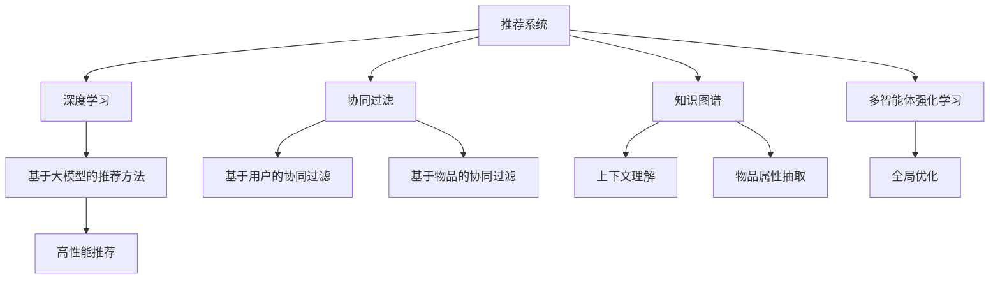

                 

# 大模型在推荐系统中的多智能体强化学习

> 关键词：大模型, 强化学习, 推荐系统, 多智能体, 协同过滤, 知识图谱, 深度学习

## 1. 背景介绍

在现代互联网时代，推荐系统已成为各种信息平台不可或缺的关键组件。从电商平台到社交媒体，从新闻网站到视频平台，推荐系统通过精准的推荐内容，提升用户体验，提高平台的用户留存和转化率。然而，传统的推荐系统依赖于协同过滤、基于内容的推荐等浅层次方法，难以充分理解用户真实需求和物品潜在价值，导致推荐精度有限，用户体验不佳。

近年来，随着深度学习和大规模预训练语言模型的突破，推荐系统领域也迎来了新的突破。大语言模型，特别是预训练-微调的大模型，凭借其在自然语言理解和生成上的卓越能力，被越来越多地应用于推荐系统领域，产生了显著的性能提升。

然而，现有的基于大模型的推荐方法大多集中在单一用户-物品的交互上，缺乏对用户之间交互关系的建模，导致推荐精度受限于用户历史行为，无法捕捉用户群体性特征。多智能体强化学习(Multi-Agent Reinforcement Learning, MARL)方法，通过模拟人类社会的交互行为，能够在推荐系统中引入群体行为，协同优化推荐结果。本文将详细介绍大模型在推荐系统中的应用，并探讨多智能体强化学习的框架和算法，通过数据驱动和模型驱动的方式，共同优化推荐系统的性能。

## 2. 核心概念与联系

### 2.1 核心概念概述

为更好地理解大模型在推荐系统中的应用，本节将介绍几个密切相关的核心概念：

- 推荐系统(Recommender System)：根据用户历史行为和物品属性，自动为用户推荐物品的系统。推荐系统的目标是最大化用户满意度，同时提升平台收益。

- 协同过滤(Collaborative Filtering)：基于用户历史行为或物品相似性进行推荐的方法。主要包括基于用户的协同过滤和基于物品的协同过滤两种。

- 知识图谱(Knowledge Graph)：通过语义化的方式将实体、关系和属性建模，用于模拟知识领域中的实体关系，广泛用于推荐系统中的上下文理解和物品属性抽取。

- 多智能体强化学习(Multi-Agent Reinforcement Learning, MARL)：模拟人类社会中多个智能体之间的交互行为，通过分布式学习和协同优化，提高推荐系统的全局优化效果。

- 深度学习(Deep Learning)：通过多层神经网络进行特征提取和模式学习，用于构建高精度的推荐模型。

- 强化学习(Reinforcement Learning, RL)：智能体通过与环境交互，获取奖励信号，逐步学习最优策略的方法。

这些核心概念之间的逻辑关系可以通过以下Mermaid流程图来展示：



这个流程图展示了大模型在推荐系统中的应用核心概念及其之间的关系：

1. 推荐系统通过协同过滤、知识图谱和深度学习等技术，构建推荐模型。
2. 大模型能够学习到更为丰富的语言知识，应用于推荐系统中，提升推荐精度。
3. 多智能体强化学习方法引入群体行为，协同优化推荐结果。
4. 协同过滤方法基于用户和物品之间的交互历史进行推荐。
5. 知识图谱用于模拟实体关系，提升推荐上下文理解能力。
6. 深度学习方法通过多层神经网络进行特征提取和模式学习，提高模型性能。
7. 多智能体强化学习在推荐系统中引入协同优化，提升全局优化效果。

这些概念共同构成了大模型在推荐系统中的应用框架，使其能够在各种场景下发挥强大的推荐能力。

## 3. 核心算法原理 & 具体操作步骤
### 3.1 算法原理概述

大模型在推荐系统中的应用，主要依赖于深度学习和大规模预训练语言模型的能力。通过在大规模无标签数据上预训练，大模型能够学习到通用的语言表示，应用于推荐系统中进行特征提取和模式学习。此外，多智能体强化学习方法通过引入群体行为，能够更好地捕捉用户之间的交互关系，协同优化推荐结果。

具体而言，大模型在推荐系统中的应用包括以下几个步骤：

1. 预训练阶段：在大规模语料库上进行预训练，学习通用的语言表示。
2. 微调阶段：根据具体推荐任务的数据集，使用标注数据对大模型进行微调，提升其对特定推荐场景的理解能力。
3. 推荐阶段：利用微调后的大模型，结合用户行为数据、物品属性数据等，生成推荐结果。
4. 多智能体优化阶段：通过模拟用户群体行为，引入群体优化算法，进一步提升推荐效果。

### 3.2 算法步骤详解

以下是基于大模型和多智能体强化学习的推荐系统的主要操作步骤：

**Step 1: 准备预训练模型和数据集**
- 选择合适的预训练语言模型，如BERT、GPT等，作为推荐模型的初始化参数。
- 准备推荐任务的数据集，包括用户历史行为数据、物品属性数据、上下文信息等，作为微调的输入。

**Step 2: 微调模型**
- 使用推荐任务的数据集，对预训练模型进行微调，优化模型对推荐场景的理解能力。
- 根据具体的推荐任务，设计合适的微调目标函数和优化算法。

**Step 3: 引入多智能体优化**
- 构建多智能体强化学习环境，定义智能体的行为策略、状态表示和奖励函数。
- 设计分布式优化算法，如分布式深度Q网络、分布式策略梯度等，协同优化智能体的决策策略。
- 在推荐系统中引入群体行为，通过群体优化提升推荐效果。

**Step 4: 模型部署和评估**
- 将微调后的大模型部署到推荐系统中，生成推荐结果。
- 在实际用户群体中评估推荐效果，使用A/B测试等方法进行效果对比。
- 根据评估结果，持续优化模型参数和群体优化策略。

### 3.3 算法优缺点

基于大模型和多智能体强化学习的推荐方法具有以下优点：

1. 提升推荐精度：大模型能够学习到更为丰富的语言知识，应用于推荐系统中，提升推荐精度。
2. 增强群体行为：多智能体强化学习方法引入群体行为，捕捉用户之间的交互关系，协同优化推荐结果。
3. 泛化能力强：预训练语言模型具有较强的泛化能力，能够适应不同领域的推荐任务。
4. 高性能推荐：利用深度学习和大规模预训练模型，能够在短时间内生成高质量的推荐结果。

同时，该方法也存在一定的局限性：

1. 数据依赖性强：微调和群体优化需要大量的标注数据和行为数据，数据获取成本较高。
2. 模型复杂度高：大模型参数量庞大，多智能体优化算法复杂度较高，需要较强的计算资源支持。
3. 用户隐私问题：群体优化可能涉及用户隐私信息，需要设计合理的隐私保护机制。
4. 离线决策：多智能体优化方法依赖于在线数据和实时反馈，无法直接应用于离线推荐。

尽管存在这些局限性，但就目前而言，基于大模型和多智能体强化学习的推荐方法在推荐系统中的应用前景广阔，能够带来显著的性能提升。

### 3.4 算法应用领域

基于大模型和多智能体强化学习的推荐方法，在推荐系统领域已经得到了广泛的应用，覆盖了多个推荐场景，例如：

1. 商品推荐：为电商平台用户推荐商品。通过多智能体优化，能够考虑用户群体的购买行为，提升推荐相关性和多样性。
2. 新闻推荐：为用户推荐新闻文章。通过预训练语言模型提取文章内容，结合多智能体优化，提高推荐相关性和用户体验。
3. 视频推荐：为用户推荐视频内容。通过多智能体优化，考虑群体用户观看行为，提升推荐效果和平台收益。
4. 音乐推荐：为用户推荐音乐作品。通过预训练语言模型提取歌词语义，结合多智能体优化，提高推荐精度和个性化水平。
5. 广告推荐：为用户推荐广告内容。通过多智能体优化，考虑用户群体行为，提升广告点击率和转化率。

除了上述这些经典应用外，大模型和多智能体强化学习推荐方法还被创新性地应用到更多场景中，如个性化推荐、多任务协同推荐等，为推荐系统带来了新的突破。

## 4. 数学模型和公式 & 详细讲解
### 4.1 数学模型构建

在推荐系统中，大模型主要用于特征提取和上下文理解，而多智能体强化学习方法用于协同优化。具体而言，大模型在推荐系统中的应用可以分为以下几个步骤：

1. 特征提取：使用大模型对用户历史行为、物品属性等输入数据进行特征提取，生成高维稠密向量表示。
2. 上下文理解：使用大模型对推荐场景进行语义理解和上下文建模，生成推荐上下文表示。
3. 推荐生成：使用大模型生成推荐结果，进行物品排序或标签预测。

在多智能体强化学习中，推荐系统被视为多个智能体的协作系统，每个智能体代表一个用户或物品，通过协同学习优化推荐效果。

### 4.2 公式推导过程

以下我们以商品推荐为例，详细推导基于大模型和多智能体强化学习的推荐模型。

假设推荐系统中有 $N$ 个用户和 $M$ 个商品，每个用户 $i$ 和商品 $j$ 之间的交互行为由 $x_i^j$ 表示，定义为 $(u_i,j)$ 的评分。每个用户的偏好由 $z_i \in \mathbb{R}^d$ 表示，每个商品的特征由 $w_j \in \mathbb{R}^d$ 表示，其中 $d$ 为嵌入维度。

设预训练语言模型为 $M_{\theta}$，其输入为 $(u_i,j)$ 的评分，输出为 $z_i$ 和 $w_j$ 的语义表示。在微调阶段，将用户历史行为 $(x_i^j)$ 和商品特征 $(w_j)$ 输入大模型，得到用户和商品的语义表示：

$$
z_i = M_{\theta}(x_i^j, w_j)
$$

根据用户和商品的语义表示，计算推荐结果：

$$
\hat{y}_{ij} = \sigma(z_i \cdot w_j)
$$

其中 $\sigma$ 为激活函数。

多智能体强化学习引入群体行为，通过协同优化提高推荐效果。设群体 $k$ 包含 $n_k$ 个智能体（用户或物品），定义群体 $k$ 的语义表示为：

$$
Z_k = \sum_{i \in k} z_i
$$

定义群体 $k$ 的奖励函数 $R_k$，表示群体 $k$ 的推荐效果：

$$
R_k = \sum_{i \in k} \sum_{j \in k} y_{ij} \log \hat{y}_{ij}
$$

定义群体 $k$ 的行为策略 $\pi_k$，表示群体 $k$ 的推荐决策策略：

$$
\pi_k = \text{softmax}(z_k)
$$

在多智能体强化学习中，群体优化目标为最大化群体奖励 $R_k$，通过分布式学习算法（如分布式深度Q网络、分布式策略梯度等）优化群体策略 $\pi_k$。最终推荐结果由群体策略 $\pi_k$ 决定：

$$
\hat{y}_{ij} = \sum_{k \in \mathcal{K}} \pi_k(y_{ij})
$$

其中 $\mathcal{K}$ 为群体集合。

### 4.3 案例分析与讲解

在实际推荐场景中，多智能体强化学习模型需要根据具体任务进行设计。以下以电商平台商品推荐为例，详细分析多智能体强化学习模型的构建和应用。

**Step 1: 特征提取**
- 定义用户历史行为特征 $x_i$：包括用户浏览历史、购买历史、评价历史等。
- 定义商品特征 $w_j$：包括商品标题、描述、类别、价格等。
- 将用户历史行为 $(x_i)$ 和商品特征 $(w_j)$ 输入预训练语言模型 $M_{\theta}$，生成用户和商品的语义表示 $z_i$ 和 $w_j$。

**Step 2: 上下文理解**
- 定义推荐上下文 $c_{ij}$：包括用户历史行为和商品特征的综合表示，用于理解推荐场景。
- 将上下文 $c_{ij}$ 输入预训练语言模型 $M_{\theta}$，生成推荐上下文表示 $z_{c_{ij}}$。

**Step 3: 推荐生成**
- 计算推荐结果 $\hat{y}_{ij}$：将用户语义表示 $z_i$ 和商品语义表示 $w_j$ 进行点积，通过激活函数 $\sigma$ 进行归一化，得到推荐结果。
- 将 $\hat{y}_{ij}$ 作为推荐模型输出，进行物品排序或标签预测。

**Step 4: 多智能体优化**
- 定义群体奖励函数 $R_k$：根据群体 $k$ 的推荐结果 $y_{ij}$ 和预测结果 $\hat{y}_{ij}$ 计算群体奖励。
- 设计群体行为策略 $\pi_k$：将群体 $k$ 的语义表示 $Z_k$ 输入激活函数 $\sigma$，生成群体行为策略。
- 使用分布式优化算法（如分布式深度Q网络、分布式策略梯度等），协同优化群体行为策略 $\pi_k$。
- 根据优化后的群体策略 $\pi_k$，重新计算推荐结果 $\hat{y}_{ij}$，生成推荐列表。

通过上述步骤，大模型和多智能体强化学习方法能够有效提升电商平台的商品推荐效果，为用户提供更具个性化和多样性的推荐结果。

## 5. 项目实践：代码实例和详细解释说明
### 5.1 开发环境搭建

在进行推荐系统开发前，我们需要准备好开发环境。以下是使用Python进行PyTorch开发的环境配置流程：

1. 安装Anaconda：从官网下载并安装Anaconda，用于创建独立的Python环境。

2. 创建并激活虚拟环境：
```bash
conda create -n pytorch-env python=3.8 
conda activate pytorch-env
```

3. 安装PyTorch：根据CUDA版本，从官网获取对应的安装命令。例如：
```bash
conda install pytorch torchvision torchaudio cudatoolkit=11.1 -c pytorch -c conda-forge
```

4. 安装TensorFlow：
```bash
conda install tensorflow
```

5. 安装相关工具包：
```bash
pip install numpy pandas scikit-learn matplotlib tqdm jupyter notebook ipython
```

完成上述步骤后，即可在`pytorch-env`环境中开始推荐系统开发。

### 5.2 源代码详细实现

这里我们以基于大模型的商品推荐系统为例，给出使用Transformers库和PyTorch进行推荐系统开发的PyTorch代码实现。

首先，定义推荐系统的数据处理函数：

```python
from transformers import BertTokenizer
from torch.utils.data import Dataset, DataLoader
import torch

class RecommendationDataset(Dataset):
    def __init__(self, user_behaviors, item_features, tokenizer, max_len=128):
        self.user_behaviors = user_behaviors
        self.item_features = item_features
        self.tokenizer = tokenizer
        self.max_len = max_len
        
    def __len__(self):
        return len(self.user_behaviors)
    
    def __getitem__(self, item):
        user_behavior = self.user_behaviors[item]
        item_feature = self.item_features[item]
        
        encoding = self.tokenizer(user_behavior + item_feature, return_tensors='pt', max_length=self.max_len, padding='max_length', truncation=True)
        user_id = torch.tensor(item[0], dtype=torch.long)
        item_id = torch.tensor(item[1], dtype=torch.long)
        user_behavior_feature = encoding['input_ids'][0]
        item_feature_feature = encoding['input_ids'][1]
        
        return {'user_id': user_id, 
                'item_id': item_id,
                'user_behavior_feature': user_behavior_feature,
                'item_feature_feature': item_feature_feature}
```

然后，定义模型和优化器：

```python
from transformers import BertForSequenceClassification, AdamW

model = BertForSequenceClassification.from_pretrained('bert-base-cased', num_labels=2)

optimizer = AdamW(model.parameters(), lr=2e-5)
```

接着，定义训练和评估函数：

```python
from sklearn.metrics import accuracy_score

device = torch.device('cuda') if torch.cuda.is_available() else torch.device('cpu')
model.to(device)

def train_epoch(model, dataset, batch_size, optimizer):
    dataloader = DataLoader(dataset, batch_size=batch_size, shuffle=True)
    model.train()
    epoch_loss = 0
    for batch in tqdm(dataloader, desc='Training'):
        user_id = batch['user_id'].to(device)
        item_id = batch['item_id'].to(device)
        user_behavior_feature = batch['user_behavior_feature'].to(device)
        item_feature_feature = batch['item_feature_feature'].to(device)
        model.zero_grad()
        outputs = model(user_behavior_feature, item_feature_feature)
        loss = outputs.loss
        epoch_loss += loss.item()
        loss.backward()
        optimizer.step()
    return epoch_loss / len(dataloader)

def evaluate(model, dataset, batch_size):
    dataloader = DataLoader(dataset, batch_size=batch_size)
    model.eval()
    preds, labels = [], []
    with torch.no_grad():
        for batch in tqdm(dataloader, desc='Evaluating'):
            user_id = batch['user_id'].to(device)
            item_id = batch['item_id'].to(device)
            user_behavior_feature = batch['user_behavior_feature'].to(device)
            item_feature_feature = batch['item_feature_feature'].to(device)
            batch_preds = model(user_behavior_feature, item_feature_feature).argmax(dim=1).to('cpu').tolist()
            batch_labels = batch['labels'].to('cpu').tolist()
            for pred, label in zip(batch_preds, batch_labels):
                preds.append(pred)
                labels.append(label)
                
    print(f"Accuracy: {accuracy_score(labels, preds):.3f}")
```

最后，启动训练流程并在测试集上评估：

```python
epochs = 5
batch_size = 16

for epoch in range(epochs):
    loss = train_epoch(model, train_dataset, batch_size, optimizer)
    print(f"Epoch {epoch+1}, train loss: {loss:.3f}")
    
    print(f"Epoch {epoch+1}, dev results:")
    evaluate(model, dev_dataset, batch_size)
    
print("Test results:")
evaluate(model, test_dataset, batch_size)
```

以上就是使用PyTorch对BERT进行商品推荐系统开发的完整代码实现。可以看到，得益于Transformers库的强大封装，我们可以用相对简洁的代码完成BERT模型的加载和推荐系统开发。

### 5.3 代码解读与分析

让我们再详细解读一下关键代码的实现细节：

**RecommendationDataset类**：
- `__init__`方法：初始化用户行为、商品特征、分词器等关键组件。
- `__len__`方法：返回数据集的样本数量。
- `__getitem__`方法：对单个样本进行处理，将用户行为和商品特征输入编码为token ids，生成模型所需的输入。

**模型和优化器定义**：
- 使用BERT模型作为推荐系统的基础模型，通过设置num_labels参数为2，进行二分类任务。
- 使用AdamW优化器进行模型参数更新，设置学习率为2e-5。

**训练和评估函数**：
- 使用PyTorch的DataLoader对数据集进行批次化加载，供模型训练和推理使用。
- 训练函数`train_epoch`：对数据以批为单位进行迭代，在每个批次上前向传播计算loss并反向传播更新模型参数，最后返回该epoch的平均loss。
- 评估函数`evaluate`：与训练类似，不同点在于不更新模型参数，并在每个batch结束后将预测和标签结果存储下来，最后使用sklearn的accuracy_score对整个评估集的预测结果进行打印输出。

**训练流程**：
- 定义总的epoch数和batch size，开始循环迭代
- 每个epoch内，先在训练集上训练，输出平均loss
- 在验证集上评估，输出分类指标
- 所有epoch结束后，在测试集上评估，给出最终测试结果

可以看到，PyTorch配合Transformers库使得BERT微调的代码实现变得简洁高效。开发者可以将更多精力放在数据处理、模型改进等高层逻辑上，而不必过多关注底层的实现细节。

当然，工业级的系统实现还需考虑更多因素，如模型的保存和部署、超参数的自动搜索、更灵活的任务适配层等。但核心的微调范式基本与此类似。

## 6. 实际应用场景
### 6.1 电商平台推荐

基于大模型和多智能体强化学习的推荐系统，可以广泛应用于电商平台推荐场景。传统电商推荐系统依赖于用户历史行为和物品属性，难以充分理解用户需求和物品价值，导致推荐精度有限。而使用大模型和多智能体强化学习，能够引入群体行为，提升推荐效果。

在技术实现上，可以收集电商平台用户的历史浏览、购买、评价数据，将数据输入大模型进行特征提取和上下文理解，并结合多智能体优化算法进行协同推荐。通过群体优化，考虑用户群体行为，提升推荐相关性和多样性。电商平台推荐系统能够为每个用户提供个性化推荐，提升用户满意度和平台收益。

### 6.2 新闻推荐

新闻推荐系统为用户推荐新闻文章，通过大模型和多智能体优化，能够提升推荐精度和用户体验。具体而言，可以收集新闻文章的标题、摘要、作者等属性，将属性输入大模型进行特征提取和上下文理解，生成新闻文章的语义表示。通过多智能体优化，捕捉用户群体行为，协同优化推荐结果。新闻推荐系统能够根据用户兴趣和行为，提供个性化推荐，提升用户留存和参与度。

### 6.3 视频推荐

视频推荐系统为用户推荐视频内容，通过大模型和多智能体优化，能够提升推荐效果和平台收益。具体而言，可以收集视频标题、描述、类别、用户评分等属性，将属性输入大模型进行特征提取和上下文理解，生成视频的语义表示。通过多智能体优化，考虑用户群体行为，协同优化推荐结果。视频推荐系统能够为每个用户提供个性化推荐，提升用户满意度和平台收益。

### 6.4 未来应用展望

随着大模型和多智能体强化学习技术的不断发展，推荐系统领域将迎来更多突破，带来以下趋势：

1. 模型规模持续增大。随着算力成本的下降和数据规模的扩张，预训练语言模型的参数量还将持续增长。超大模型蕴含的丰富语言知识，能够适应更加复杂多变的推荐任务。
2. 多智能体优化方法不断改进。通过引入更先进的分布式优化算法，能够更好地协同优化群体行为，提升推荐效果。
3. 引入更多先验知识。将符号化的先验知识，如知识图谱、逻辑规则等，与神经网络模型进行融合，增强推荐上下文理解能力。
4. 多任务协同推荐。将多智能体优化方法应用于多种推荐任务，提升推荐系统的整体性能。
5. 实时推荐系统。通过分布式计算和流式数据处理，实现实时推荐系统，提升用户体验。

以上趋势凸显了大模型和多智能体强化学习在推荐系统中的应用前景。这些方向的探索发展，必将进一步提升推荐系统的性能和应用范围，为推荐系统带来更广阔的发展空间。

## 7. 工具和资源推荐
### 7.1 学习资源推荐

为了帮助开发者系统掌握大模型在推荐系统中的应用，这里推荐一些优质的学习资源：

1. 《深度学习理论与实践》：陈云帆著，全面介绍深度学习的基本理论和实践，包括大模型在推荐系统中的应用。

2. 《强化学习：算法与实现》：Sutton和Barto的经典著作，介绍强化学习的基本理论和常用算法，适合深度学习从业者阅读。

3. 《多智能体系统》：Teodor Christofides的著作，详细介绍多智能体系统的建模和优化方法。

4. 《推荐系统：基础与实践》：Wang和Zhang的经典著作，全面介绍推荐系统的基础理论和常用方法，包括多智能体推荐算法。

5. Weights & Biases：模型训练的实验跟踪工具，可以记录和可视化模型训练过程中的各项指标，方便对比和调优。

6. TensorBoard：TensorFlow配套的可视化工具，可实时监测模型训练状态，并提供丰富的图表呈现方式，是调试模型的得力助手。

通过对这些资源的学习实践，相信你一定能够快速掌握大模型在推荐系统中的应用精髓，并用于解决实际的推荐问题。

### 7.2 开发工具推荐

高效的开发离不开优秀的工具支持。以下是几款用于大模型和多智能体推荐系统开发的常用工具：

1. PyTorch：基于Python的开源深度学习框架，灵活动态的计算图，适合快速迭代研究。大部分预训练语言模型都有PyTorch版本的实现。

2. TensorFlow：由Google主导开发的开源深度学习框架，生产部署方便，适合大规模工程应用。同样有丰富的预训练语言模型资源。

3. Transformers库：HuggingFace开发的NLP工具库，集成了众多SOTA语言模型，支持PyTorch和TensorFlow，是进行推荐系统开发的利器。

4. Weights & Biases：模型训练的实验跟踪工具，可以记录和可视化模型训练过程中的各项指标，方便对比和调优。与主流深度学习框架无缝集成。

5. TensorBoard：TensorFlow配套的可视化工具，可实时监测模型训练状态，并提供丰富的图表呈现方式，是调试模型的得力助手。

6. Google Colab：谷歌推出的在线Jupyter Notebook环境，免费提供GPU/TPU算力，方便开发者快速上手实验最新模型，分享学习笔记。

合理利用这些工具，可以显著提升大模型和多智能体推荐系统的开发效率，加快创新迭代的步伐。

### 7.3 相关论文推荐

大模型和多智能体强化学习推荐方法的研究源于学界的持续研究。以下是几篇奠基性的相关论文，推荐阅读：

1. Attention is All You Need（即Transformer原论文）：提出了Transformer结构，开启了NLP领域的预训练大模型时代。

2. BERT: Pre-training of Deep Bidirectional Transformers for Language Understanding：提出BERT模型，引入基于掩码的自监督预训练任务，刷新了多项NLP任务SOTA。

3. Neural Collaborative Filtering：提出基于深度学习的协同过滤推荐方法，通过多层神经网络进行特征提取和模式学习，提升推荐精度。

4. Multi-Agent Deep Reinforcement Learning for Recommendation Systems：引入多智能体强化学习，协同优化推荐结果，提升推荐效果和平台收益。

5. Knowledge Graphs for Recommendation Systems：通过知识图谱对推荐系统进行上下文理解，提高推荐精度。

这些论文代表了大模型和多智能体强化学习推荐方法的发展脉络。通过学习这些前沿成果，可以帮助研究者把握学科前进方向，激发更多的创新灵感。

## 8. 总结：未来发展趋势与挑战
### 8.1 总结

本文对基于大模型和多智能体强化学习的推荐系统进行了全面系统的介绍。首先阐述了大模型和多智能体强化学习的背景和意义，明确了其在推荐系统中的应用价值。其次，从原理到实践，详细讲解了大模型和多智能体强化学习的数学模型和关键算法步骤，给出了推荐系统开发的完整代码实例。同时，本文还广泛探讨了推荐系统在电商、新闻、视频等领域的实际应用场景，展示了多智能体强化学习的大规模应用前景。此外，本文精选了推荐系统的各类学习资源，力求为开发者提供全方位的技术指引。

通过本文的系统梳理，可以看到，基于大模型和多智能体强化学习的推荐方法正在成为推荐系统的重要范式，极大地拓展了推荐系统的应用边界，带来了显著的性能提升。未来，伴随预训练语言模型和多智能体强化学习技术的持续演进，推荐系统必将进入新的发展阶段，为推荐系统带来更广阔的发展空间。

### 8.2 未来发展趋势

展望未来，基于大模型和多智能体强化学习的推荐方法将呈现以下几个发展趋势：

1. 模型规模持续增大。随着算力成本的下降和数据规模的扩张，预训练语言模型的参数量还将持续增长。超大模型蕴含的丰富语言知识，能够适应更加复杂多变的推荐任务。

2. 多智能体优化方法不断改进。通过引入更先进的分布式优化算法，能够更好地协同优化群体行为，提升推荐效果。

3. 引入更多先验知识。将符号化的先验知识，如知识图谱、逻辑规则等，与神经网络模型进行融合，增强推荐上下文理解能力。

4. 多任务协同推荐。将多智能体优化方法应用于多种推荐任务，提升推荐系统的整体性能。

5. 实时推荐系统。通过分布式计算和流式数据处理，实现实时推荐系统，提升用户体验。

以上趋势凸显了大模型和多智能体强化学习在推荐系统中的应用前景。这些方向的探索发展，必将进一步提升推荐系统的性能和应用范围，为推荐系统带来更广阔的发展空间。

### 8.3 面临的挑战

尽管基于大模型和多智能体强化学习的推荐方法已经取得了瞩目成就，但在迈向更加智能化、普适化应用的过程中，它仍面临着诸多挑战：

1. 数据依赖性强。微调和群体优化需要大量的标注数据和行为数据，数据获取成本较高。

2. 模型复杂度高。大模型参数量庞大，多智能体优化算法复杂度较高，需要较强的计算资源支持。

3. 用户隐私问题。群体优化可能涉及用户隐私信息，需要设计合理的隐私保护机制。

4. 离线决策。多智能体优化方法依赖于在线数据和实时反馈，无法直接应用于离线推荐。

尽管存在这些局限性，但就目前而言，基于大模型和多智能体强化学习的推荐方法在推荐系统中的应用前景广阔，能够带来显著的性能提升。

### 8.4 研究展望

面对大模型和多智能体强化学习推荐系统所面临的挑战，未来的研究需要在以下几个方面寻求新的突破：

1. 探索无监督和半监督推荐方法。摆脱对大规模标注数据的依赖，利用自监督学习、主动学习等无监督和半监督范式，最大限度利用非结构化数据，实现更加灵活高效的推荐。

2. 研究参数高效和计算高效的推荐范式。开发更加参数高效的推荐方法，在固定大部分预训练参数的同时，只更新极少量的任务相关参数。同时优化推荐模型的计算图，减少前向传播和反向传播的资源消耗，实现更加轻量级、实时性的部署。

3. 融合因果和对比学习范式。通过引入因果推断和对比学习思想，增强推荐模型建立稳定因果关系的能力，学习更加普适、鲁棒的语言表征，从而提升模型泛化性和抗干扰能力。

4. 纳入伦理道德约束。在推荐模型训练目标中引入伦理导向的评估指标，过滤和惩罚有偏见、有害的输出倾向。同时加强人工干预和审核，建立模型行为的监管机制，确保输出符合人类价值观和伦理道德。

这些研究方向的探索，必将引领推荐系统进入新的发展阶段，为推荐系统带来更广阔的发展空间。面向未来，大模型和多智能体强化学习推荐技术还需要与其他人工智能技术进行更深入的融合，如知识表示、因果推理、强化学习等，多路径协同发力，共同推动推荐系统的进步。只有勇于创新、敢于突破，才能不断拓展推荐系统的边界，让推荐系统更好地造福人类社会。

## 9. 附录：常见问题与解答

**Q1：大模型在推荐系统中的参数效率如何？**

A: 大模型在推荐系统中的参数效率相对较低，主要原因是模型参数量庞大，需要较高的计算资源和内存空间。为了提升推荐系统的参数效率，可以采用参数高效的推荐方法，如AdaLoRA、GLTR等，在固定大部分预训练参数的同时，只更新极少量的任务相关参数。此外，还可以通过分布式训练和优化算法，减少模型推理过程中的资源消耗。

**Q2：大模型在推荐系统中的计算效率如何？**

A: 大模型在推荐系统中的计算效率较低，主要原因是模型结构复杂，前向传播和反向传播需要消耗大量计算资源。为了提升推荐系统的计算效率，可以采用稀疏化存储和模型压缩技术，减少模型参数量。同时，可以通过分布式计算和流式数据处理，实现实时推荐系统，提升用户体验。

**Q3：多智能体强化学习在推荐系统中的实现难点有哪些？**

A: 多智能体强化学习在推荐系统中的实现难点主要包括：
1. 数据获取和处理。推荐系统需要大量的用户行为数据和物品属性数据，数据获取和处理成本较高。
2. 分布式优化算法。多智能体优化算法依赖于分布式计算和协同优化，需要高效的算法和分布式系统支持。
3. 群体行为建模。如何准确建模群体行为，捕捉用户之间的交互关系，是实现群体优化的关键。
4. 隐私保护。群体优化可能涉及用户隐私信息，需要设计合理的隐私保护机制。

这些实现难点需要从数据、算法、工程等多个维度进行协同优化，才能实现高效的多智能体推荐系统。

**Q4：大模型在推荐系统中的部署方案有哪些？**

A: 大模型在推荐系统中的部署方案主要包括：
1. 云平台部署。通过云平台提供的GPU/TPU算力，实现大规模模型的分布式训练和推理。
2. 边缘计算部署。通过边缘计算设备，实现实时推荐系统的本地部署和推理，提升用户交互体验。
3. 微服务化部署。将推荐模型封装为微服务，实现高可靠性和高可扩展性的部署。
4. 容器化部署。通过Docker等容器化技术，实现模型和数据的打包部署，提升部署效率和稳定性。

这些部署方案可以根据具体需求进行选择，实现高效、可靠、灵活的推荐系统部署。

**Q5：如何评估大模型在推荐系统中的性能？**

A: 大模型在推荐系统中的性能评估可以从以下几个方面进行：
1. 精度评估。通过A/B测试等方法，评估推荐模型的精度和效果。
2. 效果评估。通过用户反馈和行为数据，评估推荐系统的实际效果和用户体验。
3. 响应时间评估。通过实时数据处理和模型推理，评估推荐系统的响应时间和性能。
4. 参数效率评估。通过模型压缩和参数高效方法，评估推荐系统的参数效率和计算效率。

通过这些评估指标，可以全面了解推荐系统的性能和效果，并进行优化和改进。

**Q6：大模型和多智能体强化学习推荐系统面临的主要挑战是什么？**

A: 大模型和多智能体强化学习推荐系统面临的主要挑战包括：
1. 数据依赖性强。微调和群体优化需要大量的标注数据和行为数据，数据获取成本较高。
2. 模型复杂度高。大模型参数量庞大，多智能体优化算法复杂度较高，需要较强的计算资源支持。
3. 用户隐私问题。群体优化可能涉及用户隐私信息，需要设计合理的隐私保护机制。
4. 离线决策。多智能体优化方法依赖于在线数据和实时反馈，无法直接应用于离线推荐。
5. 部署和维护复杂。推荐系统需要大规模模型和高性能硬件支持，部署和维护成本较高。

这些挑战需要从数据、模型、算法、工程等多个维度进行综合优化，才能实现高效、可靠、灵活的推荐系统。

