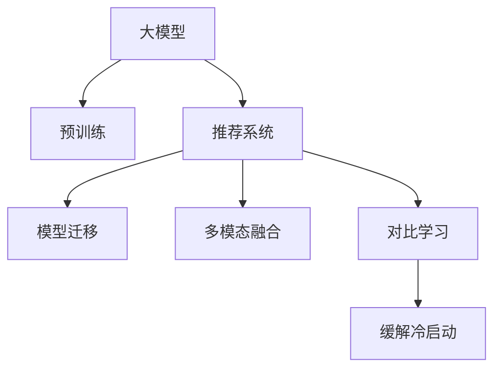

                 

# 大模型在推荐系统中的对比学习应用

> 关键词：大模型,对比学习,推荐系统,深度学习,模型迁移,数据融合

## 1. 背景介绍

### 1.1 问题由来
推荐系统作为互联网产品的重要组成部分，已广泛应用于电商、新闻、视频等多个领域。传统推荐系统通常基于协同过滤、基于内容的推荐等方法，这些方法在用户行为数据充足时表现良好，但在数据稀疏、多模态、长尾等问题上存在局限。随着深度学习技术的发展，基于神经网络的推荐模型如矩阵分解、深度协同过滤、深度神经网络等方法，逐步取代传统推荐算法，带来了更高的精准度、泛化能力和用户满意度。

然而，深度学习模型在实时性和泛化性方面存在短板。深度模型的训练和推理过程复杂耗时，实时推荐难以满足。此外，单一深度模型在多模态数据融合方面也存在局限。大模型作为一种强大的"特征提取器"，可以更好地适应多模态、异构数据融合的需求，在推荐系统中展现出巨大的潜力。

### 1.2 问题核心关键点
基于大模型的推荐系统主要面临以下几个核心问题：

- 如何高效融合多模态数据？
- 如何应对数据稀疏性？
- 如何平衡实时性和模型精度？
- 如何减少对新数据的冷启动现象？
- 如何提高模型的泛化能力？

本文聚焦于对比学习在大模型推荐系统中的应用，旨在探索通过对比学习，将多种特征表达融合到推荐模型中，提升模型对多模态数据的融合能力和泛化能力。

### 1.3 问题研究意义
通过对比学习，将大模型应用到推荐系统，可以带来以下几个方面的提升：

1. 多模态数据融合：通过融合文本、图像、音频等多种模态的数据，引入更丰富的用户行为特征。
2. 提高推荐模型泛化能力：对比学习能够学习到更普适的特征表示，提升模型在不同领域上的泛化性能。
3. 缓解冷启动问题：通过将不同领域的大模型知识迁移到推荐模型中，缓解新用户的冷启动问题。
4. 提升推荐实时性：使用轻量级模型，能够快速推理，提升推荐系统的实时性。
5. 增强推荐鲁棒性：通过对比学习提升模型的鲁棒性，减少对噪声数据的敏感性。

本研究对大模型在推荐系统中的应用进行了深入探讨，希望为推荐系统技术的发展提供新的思路和方法。

## 2. 核心概念与联系

### 2.1 核心概念概述

为更好地理解对比学习在大模型推荐系统中的应用，本节将介绍几个密切相关的核心概念：

- 大模型：以自回归(如GPT)或自编码(如BERT)模型为代表的大规模预训练语言模型。通过在大规模无标签文本语料上进行预训练，学习通用的语言知识，具备强大的语言理解和生成能力。
- 对比学习(Contrastive Learning)：一种无监督学习方法，通过将同一样本的不同视图或不同样本间的对比关系，提升模型在不同视角下的表示能力。
- 推荐系统(Recommender System)：通过分析用户行为和物品属性，预测用户对物品的喜好，并向用户推荐其可能感兴趣的物品的系统。
- 模型迁移(Transfer Learning)：将一个领域学习到的知识迁移到另一个不同但相关的领域。
- 多模态融合(Multimodal Fusion)：融合来自不同模态的数据，以获得更丰富的用户行为特征。
- 冷启动问题(Cold Start Problem)：新用户加入推荐系统时，缺乏足够的历史行为数据，难以提供精准推荐。

这些核心概念之间的逻辑关系可以通过以下Mermaid流程图来展示：



这个流程图展示了大模型在推荐系统中的应用框架，包括预训练、迁移学习、多模态融合和对比学习等关键环节。

## 3. 核心算法原理 & 具体操作步骤
### 3.1 算法原理概述

对比学习在大模型推荐系统中的应用，本质上是一种无监督学习方法，旨在通过对比不同视角下的样本表示，提升模型在不同场景下的泛化能力。其核心思想是：对于同一用户的不同行为数据或不同用户的行为数据，通过对比学习得到更一致的特征表示，从而提升推荐模型的预测能力。

具体而言，假设推荐系统涉及用户 $u$、物品 $i$ 和行为数据 $x$。推荐系统需要构建一个模型 $M$，预测用户对物品的评分 $y$。模型 $M$ 可以基于多模态数据进行训练，通过对比学习提升模型的泛化能力。

### 3.2 算法步骤详解

基于对比学习的大模型推荐系统一般包括以下几个关键步骤：

**Step 1: 准备多模态数据**

- 收集用户行为数据，包括点击、购买、浏览、评分等行为数据，分别提取用户-物品评分 $(x_{ui}, y_{ui})$。
- 对文本数据进行预处理，如分词、向量编码等。
- 对图像、音频等非结构化数据进行特征提取，如卷积神经网络、循环神经网络等。
- 将所有行为数据按用户进行分组，得到多模态特征矩阵 $X \in \mathbb{R}^{U \times F}$，其中 $U$ 为用户数，$F$ 为特征维度。

**Step 2: 构建对比学习损失函数**

- 定义用户-物品对比损失函数，将同一用户不同物品的对比作为训练样本，以提升模型对同一用户的稳定预测。
- 定义用户-物品间对比损失函数，将不同用户间的对比作为训练样本，以提升模型对不同用户的泛化能力。

**Step 3: 训练模型**

- 使用Adam等优化器，在对比学习损失函数下对模型进行优化。
- 在每个epoch中，将部分样本用于对比学习训练，另一部分样本用于监督学习训练。
- 在对比学习训练中，对同一用户不同物品的表示进行对比，最小化表示距离；在监督学习训练中，最小化用户-物品评分预测误差。

**Step 4: 推理和评估**

- 在训练完成后，将训练好的模型应用于推荐系统，对用户进行物品推荐。
- 在测试集上评估模型的推荐效果，如准确率、召回率、F1等指标。
- 根据评估结果，调整模型的超参数，进一步提升模型性能。

### 3.3 算法优缺点

基于对比学习的大模型推荐系统具有以下优点：

1. 提升模型泛化能力：对比学习能够学习到更普适的特征表示，提升模型在不同领域上的泛化性能。
2. 多模态数据融合：通过对比学习，能够高效融合文本、图像、音频等多种模态的数据，引入更丰富的用户行为特征。
3. 缓解冷启动问题：通过将不同领域的大模型知识迁移到推荐模型中，缓解新用户的冷启动问题。
4. 提升推荐实时性：使用轻量级模型，能够快速推理，提升推荐系统的实时性。

同时，该方法也存在一定的局限性：

1. 对标注数据依赖：多模态数据融合需要大量标注数据，标注成本较高。
2. 计算复杂度高：对比学习过程需要计算大量的样本相似度，计算复杂度较高。
3. 对抗样本敏感：对比学习过程容易受到对抗样本的影响，影响模型鲁棒性。
4. 泛化能力有限：如果不同模态数据分布差异较大，对比学习的效果可能受限。

尽管存在这些局限性，但就目前而言，基于对比学习的大模型推荐方法仍是大模型推荐系统应用的重要范式。未来相关研究的重点在于如何进一步降低计算成本，提高泛化能力，同时兼顾鲁棒性和实时性等因素。

### 3.4 算法应用领域

基于对比学习的大模型推荐系统，已经在电商、新闻、视频等多个领域得到广泛应用，为推荐系统技术的发展提供了新的思路和方法。

- **电商推荐系统**：通过融合用户的点击、浏览、评分等行为数据，提供个性化推荐。
- **新闻推荐系统**：通过融合用户的阅读历史和兴趣标签，推荐相关新闻内容。
- **视频推荐系统**：通过融合用户的观看历史和用户画像，推荐符合用户兴趣的视频内容。
- **音乐推荐系统**：通过融合用户的听歌历史和标签信息，推荐相关音乐作品。

除了这些经典应用外，大模型对比学习推荐系统还被创新性地应用于智能家居、智能交通等领域，为推荐系统技术带来了新的突破。随着对比学习和大模型的不断演进，相信推荐系统必将在更广阔的应用领域大放异彩。

## 4. 数学模型和公式 & 详细讲解 & 举例说明（备注：数学公式请使用latex格式，latex嵌入文中独立段落使用 $$，段落内使用 $)
### 4.1 数学模型构建

本节将使用数学语言对基于对比学习的大模型推荐过程进行更加严格的刻画。

假设推荐系统涉及用户 $u$、物品 $i$ 和行为数据 $x$。推荐系统需要构建一个模型 $M_{\theta}$，预测用户对物品的评分 $y$。其中 $\theta$ 为模型参数。

定义模型 $M_{\theta}$ 在输入 $x$ 上的输出为 $\hat{y}=M_{\theta}(x)$，表示用户对物品的预测评分。

定义用户-物品对比损失函数为 $L_{contrast}(M_{\theta})=\sum_{(u_i,u_j)}[\text{Sim}(x_{ui},x_{uj})]$，其中 $x_{ui}$ 和 $x_{uj}$ 为同一用户 $u$ 对不同物品 $i$ 和 $j$ 的行为数据表示，$\text{Sim}$ 为相似度函数。

定义用户-物品间对比损失函数为 $L_{cross}(M_{\theta})=\sum_{(u_i,u_j)}[\text{Sim}(x_{ui},x_{uj})]$，其中 $x_{ui}$ 和 $x_{uj}$ 为不同用户 $u$ 对同一物品 $i$ 和 $j$ 的行为数据表示，$\text{Sim}$ 为相似度函数。

整个推荐系统的损失函数为 $L(M_{\theta})=\alpha L_{contrast}(M_{\theta})+(1-\alpha)L_{cross}(M_{\theta})$，其中 $\alpha$ 为平衡系数。

在训练过程中，最小化 $L(M_{\theta})$，使得模型 $M_{\theta}$ 能够学习到更一致的用户行为表示，提升推荐性能。

### 4.2 公式推导过程

以下我们以文本-物品推荐为例，推导对比学习损失函数的计算公式。

假设用户对物品 $i$ 的评分 $y_{ui}$ 为文本行为数据 $x_{ui}$ 的线性函数，即 $\hat{y}_{ui}=W_{ui}^Tx_{ui}+b_{ui}$。其中 $W_{ui}$ 和 $b_{ui}$ 为模型参数。

用户-物品对比损失函数可以表示为：

$$
L_{contrast}(M_{\theta}) = \sum_{(u_i,u_j)}[\text{Sim}(W_{ui}^Tx_{ui},W_{uj}^Tx_{uj})]
$$

其中 $\text{Sim}$ 为相似度函数，如余弦相似度：$\text{Sim}(x,y)=\frac{x^Ty}{\|x\|\|y\|}$。

用户-物品间对比损失函数可以表示为：

$$
L_{cross}(M_{\theta}) = \sum_{(u_i,u_j)}[\text{Sim}(W_{ui}^Tx_{ui},W_{uj}^Tx_{uj})]
$$

整个推荐系统的损失函数为：

$$
L(M_{\theta}) = \alpha L_{contrast}(M_{\theta})+(1-\alpha)L_{cross}(M_{\theta})
$$

在得到损失函数的梯度后，即可带入参数更新公式，完成模型的迭代优化。重复上述过程直至收敛，最终得到适应推荐任务的最优模型参数 $\theta^*$。

## 5. 项目实践：代码实例和详细解释说明
### 5.1 开发环境搭建

在进行对比学习推荐系统实践前，我们需要准备好开发环境。以下是使用Python进行PyTorch开发的环境配置流程：

1. 安装Anaconda：从官网下载并安装Anaconda，用于创建独立的Python环境。

2. 创建并激活虚拟环境：
```bash
conda create -n pytorch-env python=3.8 
conda activate pytorch-env
```

3. 安装PyTorch：根据CUDA版本，从官网获取对应的安装命令。例如：
```bash
conda install pytorch torchvision torchaudio cudatoolkit=11.1 -c pytorch -c conda-forge
```

4. 安装Transformer库：
```bash
pip install transformers
```

5. 安装各类工具包：
```bash
pip install numpy pandas scikit-learn matplotlib tqdm jupyter notebook ipython
```

完成上述步骤后，即可在`pytorch-env`环境中开始对比学习推荐系统的实践。

### 5.2 源代码详细实现

下面我们以文本-物品推荐为例，给出使用Transformers库对BERT模型进行对比学习微调的PyTorch代码实现。

首先，定义数据处理函数：

```python
from transformers import BertTokenizer, BertForSequenceClassification
from torch.utils.data import Dataset
import torch

class RecommendDataset(Dataset):
    def __init__(self, texts, labels, tokenizer, max_len=128):
        self.texts = texts
        self.labels = labels
        self.tokenizer = tokenizer
        self.max_len = max_len
        
    def __len__(self):
        return len(self.texts)
    
    def __getitem__(self, item):
        text = self.texts[item]
        label = self.labels[item]
        
        encoding = self.tokenizer(text, return_tensors='pt', max_length=self.max_len, padding='max_length', truncation=True)
        input_ids = encoding['input_ids'][0]
        attention_mask = encoding['attention_mask'][0]
        
        # 将label进行one-hot编码
        label = torch.tensor([[label]], dtype=torch.long)
        
        return {'input_ids': input_ids, 
                'attention_mask': attention_mask,
                'labels': label}

# 标签与id的映射
tag2id = {'0': 0, '1': 1}
id2tag = {v: k for k, v in tag2id.items()}

# 创建dataset
tokenizer = BertTokenizer.from_pretrained('bert-base-cased')

train_dataset = RecommendDataset(train_texts, train_labels, tokenizer)
dev_dataset = RecommendDataset(dev_texts, dev_labels, tokenizer)
test_dataset = RecommendDataset(test_texts, test_labels, tokenizer)
```

然后，定义模型和优化器：

```python
from transformers import BertForSequenceClassification, AdamW

model = BertForSequenceClassification.from_pretrained('bert-base-cased', num_labels=2)

optimizer = AdamW(model.parameters(), lr=2e-5)
```

接着，定义训练和评估函数：

```python
from torch.utils.data import DataLoader
from tqdm import tqdm
from sklearn.metrics import accuracy_score

device = torch.device('cuda') if torch.cuda.is_available() else torch.device('cpu')
model.to(device)

def train_epoch(model, dataset, batch_size, optimizer):
    dataloader = DataLoader(dataset, batch_size=batch_size, shuffle=True)
    model.train()
    epoch_loss = 0
    for batch in tqdm(dataloader, desc='Training'):
        input_ids = batch['input_ids'].to(device)
        attention_mask = batch['attention_mask'].to(device)
        labels = batch['labels'].to(device)
        model.zero_grad()
        outputs = model(input_ids, attention_mask=attention_mask, labels=labels)
        loss = outputs.loss
        epoch_loss += loss.item()
        loss.backward()
        optimizer.step()
    return epoch_loss / len(dataloader)

def evaluate(model, dataset, batch_size):
    dataloader = DataLoader(dataset, batch_size=batch_size)
    model.eval()
    preds, labels = [], []
    with torch.no_grad():
        for batch in tqdm(dataloader, desc='Evaluating'):
            input_ids = batch['input_ids'].to(device)
            attention_mask = batch['attention_mask'].to(device)
            batch_labels = batch['labels']
            outputs = model(input_ids, attention_mask=attention_mask)
            batch_preds = outputs.logits.argmax(dim=1).to('cpu').tolist()
            batch_labels = batch_labels.to('cpu').tolist()
            for pred, label in zip(batch_preds, batch_labels):
                preds.append(pred.item())
                labels.append(label.item())
                
    print('Accuracy:', accuracy_score(labels, preds))
```

最后，启动训练流程并在测试集上评估：

```python
epochs = 5
batch_size = 16

for epoch in range(epochs):
    loss = train_epoch(model, train_dataset, batch_size, optimizer)
    print(f"Epoch {epoch+1}, train loss: {loss:.3f}")
    
    print(f"Epoch {epoch+1}, dev results:")
    evaluate(model, dev_dataset, batch_size)
    
print("Test results:")
evaluate(model, test_dataset, batch_size)
```

以上就是使用PyTorch对BERT进行文本-物品推荐任务对比学习微调的完整代码实现。可以看到，得益于Transformers库的强大封装，我们可以用相对简洁的代码完成BERT模型的加载和微调。

### 5.3 代码解读与分析

让我们再详细解读一下关键代码的实现细节：

**RecommendDataset类**：
- `__init__`方法：初始化文本、标签、分词器等关键组件。
- `__len__`方法：返回数据集的样本数量。
- `__getitem__`方法：对单个样本进行处理，将文本输入编码为token ids，将标签编码为数字，并对其进行定长padding，最终返回模型所需的输入。

**tag2id和id2tag字典**：
- 定义了标签与数字id之间的映射关系，用于将token-wise的预测结果解码回真实的标签。

**训练和评估函数**：
- 使用PyTorch的DataLoader对数据集进行批次化加载，供模型训练和推理使用。
- 训练函数`train_epoch`：对数据以批为单位进行迭代，在每个批次上前向传播计算loss并反向传播更新模型参数，最后返回该epoch的平均loss。
- 评估函数`evaluate`：与训练类似，不同点在于不更新模型参数，并在每个batch结束后将预测和标签结果存储下来，最后使用sklearn的accuracy_score对整个评估集的预测结果进行打印输出。

**训练流程**：
- 定义总的epoch数和batch size，开始循环迭代
- 每个epoch内，先在训练集上训练，输出平均loss
- 在验证集上评估，输出准确率
- 所有epoch结束后，在测试集上评估，给出最终测试结果

可以看到，PyTorch配合Transformers库使得BERT微调的代码实现变得简洁高效。开发者可以将更多精力放在数据处理、模型改进等高层逻辑上，而不必过多关注底层的实现细节。

当然，工业级的系统实现还需考虑更多因素，如模型的保存和部署、超参数的自动搜索、更灵活的任务适配层等。但核心的对比学习范式基本与此类似。

## 6. 实际应用场景
### 6.1 智能推荐系统

基于对比学习的大模型推荐系统，可以广泛应用于智能推荐系统的构建。传统推荐系统往往需要配备大量人力，高峰期响应缓慢，且一致性和专业性难以保证。而使用对比学习后的推荐模型，可以7x24小时不间断服务，快速响应用户推荐请求，用更丰富的用户行为特征提升推荐效果。

在技术实现上，可以收集用户的行为数据，将行为数据作为样本输入到预训练语言模型中，进行对比学习训练。对比学习能够学习到更一致的用户行为表示，从而提升推荐系统的实时性和精准度。

### 6.2 跨模态推荐系统

当前的推荐系统大多基于单一的特征，难以涵盖用户的多方面行为。随着移动互联网的普及，用户的行为数据已经不再局限于点击、浏览、评分等文本行为，还包含了用户的社交行为、地理位置、购物行为等多种数据源。这些多模态数据可以进一步融合到推荐模型中，提升推荐效果。

通过对比学习，将不同模态的数据融合到推荐模型中，可以学习到更丰富的用户行为特征。例如，将用户浏览行为和社交行为进行对比学习，可以提升推荐系统的精准度。

### 6.3 冷启动推荐

在推荐系统中，新用户的冷启动问题是一个常见的挑战。由于新用户缺乏足够的历史行为数据，推荐系统无法准确预测其兴趣偏好。通过对比学习，可以将不同领域的大模型知识迁移到推荐模型中，缓解新用户的冷启动问题。

例如，在电商推荐系统中，可以使用大模型的多模态表示学习用户行为特征，缓解新用户的冷启动问题。通过对比学习，将不同领域的知识进行迁移，可以提升新用户的推荐效果。

### 6.4 未来应用展望

随着对比学习和大模型的不断演进，基于对比学习的大模型推荐系统必将在更多领域得到应用，为推荐系统技术的发展提供新的思路和方法。

在智慧医疗领域，基于对比学习的大模型推荐系统可以应用于患者推荐、药品推荐等场景，提升医疗服务的智能化水平。

在智能教育领域，对比学习可以应用于个性化推荐、智能辅导等场景，因材施教，促进教育公平，提高教学质量。

在智慧城市治理中，对比学习可以应用于城市事件推荐、交通拥堵预测等场景，提高城市管理的自动化和智能化水平，构建更安全、高效的未来城市。

此外，在企业生产、社会治理、文娱传媒等众多领域，基于对比学习的大模型推荐系统也将不断涌现，为推荐系统技术带来新的突破。相信随着技术的日益成熟，对比学习方法将成为推荐系统技术的重要范式，推动推荐系统技术的快速发展。

## 7. 工具和资源推荐
### 7.1 学习资源推荐

为了帮助开发者系统掌握大模型对比学习的应用，这里推荐一些优质的学习资源：

1. 《Deep Learning for Recommender Systems》书籍：介绍深度学习在推荐系统中的应用，包含对比学习等前沿技术。

2. CS294-129《Recommender Systems》课程：斯坦福大学开设的推荐系统明星课程，涵盖多种推荐算法和深度学习模型。

3. 《Python for Deep Learning》书籍：介绍深度学习在推荐系统中的应用，包含对比学习等前沿技术。

4. HuggingFace官方文档：Transformers库的官方文档，提供了海量预训练模型和完整的对比学习样例代码，是上手实践的必备资料。

5. arXiv论文推荐：推荐的对比学习相关论文，涵盖多种算法和应用场景。

通过对这些资源的学习实践，相信你一定能够快速掌握对比学习在大模型推荐系统中的应用，并用于解决实际的推荐问题。
### 7.2 开发工具推荐

高效的开发离不开优秀的工具支持。以下是几款用于大模型对比学习推荐系统开发的常用工具：

1. PyTorch：基于Python的开源深度学习框架，灵活动态的计算图，适合快速迭代研究。大部分预训练语言模型都有PyTorch版本的实现。

2. TensorFlow：由Google主导开发的开源深度学习框架，生产部署方便，适合大规模工程应用。同样有丰富的预训练语言模型资源。

3. Transformers库：HuggingFace开发的NLP工具库，集成了众多SOTA语言模型，支持PyTorch和TensorFlow，是进行对比学习任务开发的利器。

4. Weights & Biases：模型训练的实验跟踪工具，可以记录和可视化模型训练过程中的各项指标，方便对比和调优。与主流深度学习框架无缝集成。

5. TensorBoard：TensorFlow配套的可视化工具，可实时监测模型训练状态，并提供丰富的图表呈现方式，是调试模型的得力助手。

6. Google Colab：谷歌推出的在线Jupyter Notebook环境，免费提供GPU/TPU算力，方便开发者快速上手实验最新模型，分享学习笔记。

合理利用这些工具，可以显著提升大模型对比学习推荐系统的开发效率，加快创新迭代的步伐。

### 7.3 相关论文推荐

大模型对比学习推荐系统的发展源于学界的持续研究。以下是几篇奠基性的相关论文，推荐阅读：

1. SimCLR: A Simple Framework for Deep Learning
2. MoCo: Momentum Contrast for Unsupervised Visual Representation Learning
3. PCL: Partially Supervised Contrastive Representation Learning
4. VAB: Visual-Audio-Text Alignment with Contrastive Learning
5. GLUE: A Multi-Task Benchmark and Analysis Platform for General-purpose Language Understanding Evaluation

这些论文代表了大模型对比学习推荐系统的发展脉络。通过学习这些前沿成果，可以帮助研究者把握学科前进方向，激发更多的创新灵感。

## 8. 总结：未来发展趋势与挑战

### 8.1 总结

本文对基于对比学习的大模型推荐系统进行了全面系统的介绍。首先阐述了对比学习和大模型推荐系统的研究背景和意义，明确了对比学习在大模型推荐系统中的独特价值。其次，从原理到实践，详细讲解了对比学习数学模型和关键步骤，给出了对比学习任务开发的完整代码实例。同时，本文还广泛探讨了对比学习在大模型推荐系统中的应用场景，展示了对比学习范式的巨大潜力。此外，本文精选了对比学习技术的各类学习资源，力求为读者提供全方位的技术指引。

通过本文的系统梳理，可以看到，基于对比学习的大模型推荐系统正在成为推荐系统技术的重要范式，极大地拓展了预训练语言模型的应用边界，带来了更高的精准度、泛化能力和用户满意度。未来，伴随对比学习和大模型的不断演进，相信推荐系统必将在更广阔的应用领域大放异彩，深刻影响人类的生产生活方式。

### 8.2 未来发展趋势

展望未来，对比学习和大模型推荐系统将呈现以下几个发展趋势：

1. 多模态数据融合：通过对比学习，能够高效融合文本、图像、音频等多种模态的数据，引入更丰富的用户行为特征。
2. 提升推荐模型泛化能力：对比学习能够学习到更普适的特征表示，提升模型在不同领域上的泛化性能。
3. 缓解冷启动问题：通过对比学习，将不同领域的大模型知识迁移到推荐模型中，缓解新用户的冷启动问题。
4. 提升推荐实时性：使用轻量级模型，能够快速推理，提升推荐系统的实时性。
5. 增强推荐鲁棒性：通过对比学习提升模型的鲁棒性，减少对噪声数据的敏感性。

以上趋势凸显了对比学习和大模型推荐系统的发展前景。这些方向的探索发展，必将进一步提升推荐系统的性能和应用范围，为推荐系统技术的发展提供新的思路和方法。

### 8.3 面临的挑战

尽管对比学习和大模型推荐系统已经取得了瞩目成就，但在迈向更加智能化、普适化应用的过程中，它仍面临着诸多挑战：

1. 标注成本瓶颈：对比学习需要大量标注数据，标注成本较高。
2. 计算复杂度高：对比学习过程需要计算大量的样本相似度，计算复杂度较高。
3. 对抗样本敏感：对比学习过程容易受到对抗样本的影响，影响模型鲁棒性。
4. 泛化能力有限：如果不同模态数据分布差异较大，对比学习的效果可能受限。
5. 冷启动问题：新用户的冷启动问题仍需进一步缓解。
6. 数据隐私保护：推荐系统需关注用户数据的隐私保护，避免数据泄露。

尽管存在这些挑战，但相信通过学界和产业界的共同努力，对比学习和大模型推荐系统必将在推荐系统技术的发展中扮演越来越重要的角色。

### 8.4 研究展望

面对对比学习和大模型推荐系统所面临的挑战，未来的研究需要在以下几个方面寻求新的突破：

1. 探索无监督和半监督对比学习方法：摆脱对大规模标注数据的依赖，利用自监督学习、主动学习等无监督和半监督范式，最大限度利用非结构化数据，实现更加灵活高效的对比学习。
2. 研究参数高效和计算高效的对比学习范式：开发更加参数高效的对比学习方法，在固定大部分预训练参数的同时，只更新极少量的任务相关参数。同时优化对比学习模型的计算图，减少前向传播和反向传播的资源消耗，实现更加轻量级、实时性的部署。
3. 融合因果和对比学习范式：通过引入因果推断和对比学习思想，增强对比学习模型建立稳定因果关系的能力，学习更加普适、鲁棒的语言表征，从而提升模型泛化性和抗干扰能力。
4. 引入更多先验知识：将符号化的先验知识，如知识图谱、逻辑规则等，与神经网络模型进行巧妙融合，引导对比学习过程学习更准确、合理的语言模型。同时加强不同模态数据的整合，实现视觉、语音等多模态信息与文本信息的协同建模。
5. 结合因果分析和博弈论工具：将因果分析方法引入对比学习模型，识别出模型决策的关键特征，增强对比学习模型的输出解释的因果性和逻辑性。借助博弈论工具刻画人机交互过程，主动探索并规避对比学习模型的脆弱点，提高系统稳定性。
6. 纳入伦理道德约束：在对比学习模型训练目标中引入伦理导向的评估指标，过滤和惩罚有偏见、有害的输出倾向。同时加强人工干预和审核，建立对比学习模型的监管机制，确保输出的安全性。

这些研究方向的探索，必将引领对比学习和大模型推荐系统技术迈向更高的台阶，为推荐系统技术的发展提供新的思路和方法。面向未来，对比学习和大模型推荐系统还需要与其他人工智能技术进行更深入的融合，如知识表示、因果推理、强化学习等，多路径协同发力，共同推动推荐系统技术的进步。只有勇于创新、敢于突破，才能不断拓展对比学习和大模型推荐系统的边界，让智能推荐技术更好地造福人类社会。

## 9. 附录：常见问题与解答

**Q1：大模型对比学习是否适用于所有推荐任务？**

A: 大模型对比学习在大多数推荐任务上都能取得不错的效果，特别是对于数据量较小的任务。但对于一些特定领域的任务，如医学、法律等，仅仅依靠通用语料预训练的模型可能难以很好地适应。此时需要在特定领域语料上进一步预训练，再进行对比学习，才能获得理想效果。

**Q2：对比学习过程中如何选择合适的学习率？**

A: 对比学习的学习率一般要比预训练时小1-2个数量级，如果使用过大的学习率，容易破坏预训练权重，导致过拟合。一般建议从1e-5开始调参，逐步减小学习率，直至收敛。也可以使用warmup策略，在开始阶段使用较小的学习率，再逐渐过渡到预设值。需要注意的是，不同的对比学习方法和优化器可能需要设置不同的学习率阈值。

**Q3：对比学习推荐系统在落地部署时需要注意哪些问题？**

A: 将对比学习推荐系统转化为实际应用，还需要考虑以下因素：
1. 模型裁剪：去除不必要的层和参数，减小模型尺寸，加快推理速度
2. 量化加速：将浮点模型转为定点模型，压缩存储空间，提高计算效率
3. 服务化封装：将模型封装为标准化服务接口，便于集成调用
4. 弹性伸缩：根据请求流量动态调整资源配置，平衡服务质量和成本
5. 监控告警：实时采集系统指标，设置异常告警阈值，确保服务稳定性
6. 安全防护：采用访问鉴权、数据脱敏等措施，保障数据和模型安全

对比学习推荐系统能够快速推理，提升推荐系统的实时性，但在落地部署时，需要注意对模型进行裁剪和量化加速，以及服务化封装和弹性伸缩等技术。通过合理的部署策略，才能实现对比学习推荐系统的实际应用。

**Q4：对比学习推荐系统如何缓解冷启动问题？**

A: 对比学习推荐系统可以通过将不同领域的大模型知识迁移到推荐模型中，缓解新用户的冷启动问题。例如，在电商推荐系统中，可以使用大模型的多模态表示学习用户行为特征，缓解新用户的冷启动问题。通过对比学习，将不同领域的知识进行迁移，可以提升新用户的推荐效果。

**Q5：对比学习推荐系统如何提升推荐鲁棒性？**

A: 对比学习推荐系统可以通过引入对抗样本学习，提升模型的鲁棒性。具体而言，可以在训练过程中引入对抗样本，使得模型能够在噪声数据下仍然保持稳定。同时，可以通过正则化技术，如L2正则、Dropout等，减少模型对噪声数据的敏感性。

**Q6：对比学习推荐系统如何提高推荐模型的泛化能力？**

A: 对比学习推荐系统可以通过将多模态数据融合到推荐模型中，提高模型的泛化能力。例如，将用户浏览行为和社交行为进行对比学习，可以提升推荐系统的精准度。通过对比学习，将不同模态的数据融合到推荐模型中，可以学习到更丰富的用户行为特征，提升模型的泛化能力。

通过对比学习，将大模型应用到推荐系统中，可以带来更高的精准度、泛化能力和用户满意度。未来的研究将进一步探索如何降低计算成本，提高泛化能力，同时兼顾鲁棒性和实时性等因素，推动对比学习推荐系统技术的进一步发展。

---

作者：禅与计算机程序设计艺术 / Zen and the Art of Computer Programming

