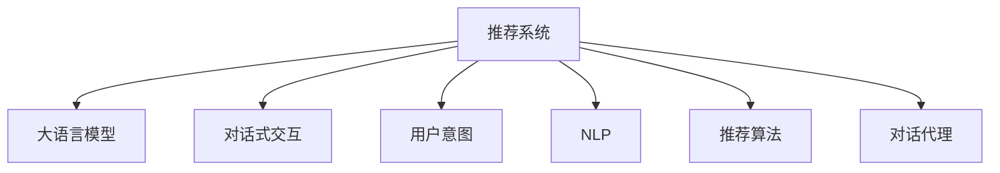

                 

# 大模型在推荐系统中的对话式交互设计

> 关键词：推荐系统, 大语言模型, 对话式交互, 用户意图, 自然语言处理(NLP), 推荐算法, 对话代理

## 1. 背景介绍

在信息爆炸的时代，用户获取信息的方式日益多样化，传统的推荐算法已经无法满足用户的多样化需求。而大语言模型通过深度学习和自然语言处理(NLP)技术，具备了理解和处理用户查询的强大能力，为推荐系统的设计带来了新的契机。在本文中，我们将探讨大语言模型如何在推荐系统中应用，以及如何在推荐系统的框架内设计对话式交互设计。

## 2. 核心概念与联系

### 2.1 核心概念概述

为了更好地理解大模型在推荐系统中的对话式交互设计，本节将介绍几个密切相关的核心概念：

- **推荐系统(Recommendation System)**：通过用户历史行为和数据模型，向用户推荐可能感兴趣的商品、内容、服务等。
- **大语言模型(Large Language Model, LLM)**：以自回归(如GPT)或自编码(如BERT)模型为代表的大规模预训练语言模型。通过在大规模无标签文本语料上进行预训练，学习通用的语言表示，具备强大的语言理解和生成能力。
- **对话式交互(DialoGPT)**：一种基于大语言模型的对话生成模型，能够根据用户输入生成自然流畅的回复。
- **用户意图(User Intent)**：用户通过文本、语音等形式表达的需求或目标，推荐系统需要理解和识别用户的意图，才能进行有效推荐。
- **自然语言处理(NLP)**：涉及语言模型的建立和应用，如分词、命名实体识别、情感分析等技术，为理解用户意图提供支撑。
- **推荐算法**：根据用户历史行为、兴趣偏好等因素，预测用户对某一商品或内容可能感兴趣的程度，进行推荐。
- **对话代理(Chatbot)**：一种能够模拟人类对话的智能系统，用于处理用户查询并生成推荐结果。

这些核心概念之间的逻辑关系可以通过以下Mermaid流程图来展示：



这个流程图展示了大模型在推荐系统中的核心概念及其之间的关系：

1. 推荐系统通过大语言模型处理用户查询，了解用户意图。
2. 对话式交互在大语言模型的基础上，进行更自然、更流畅的对话生成。
3. 用户意图通过NLP技术识别，为推荐算法提供输入。
4. 推荐算法根据用户意图，生成推荐结果。
5. 对话代理接收用户查询，调用推荐系统生成推荐结果，并将结果反馈给用户。

这些概念共同构成了大模型在推荐系统中的设计框架，使得推荐系统能够更好地理解和满足用户的需求。

## 3. 核心算法原理 & 具体操作步骤
### 3.1 算法原理概述

基于大语言模型的推荐系统，其核心思想是：通过大语言模型处理用户查询，识别用户意图，再根据用户意图调用推荐算法生成推荐结果。对话式交互的设计，则是为了更好地引导用户进行查询，获取更准确的用户意图，从而提升推荐系统的精准度和用户体验。

形式化地，假设推荐系统接收用户查询 $q$，其输出为推荐结果列表 $R$。则推荐系统的优化目标是最小化预测结果 $R$ 与用户真实偏好之间的差异。假设用户真实偏好已知，可以表示为向量 $y \in [0,1]^{|R|}$，其中 $|R|$ 为推荐结果列表的长度。则推荐系统的优化目标为：

$$
\theta^* = \mathop{\arg\min}_{\theta} \|R - y\|_2^2
$$

其中 $\theta$ 为模型参数，$\| \cdot \|_2$ 为L2范数。通过梯度下降等优化算法，推荐系统不断更新模型参数 $\theta$，最小化预测结果 $R$ 与用户真实偏好之间的差异，最终得到最优模型参数 $\theta^*$。

### 3.2 算法步骤详解

基于大语言模型的推荐系统，一般包括以下几个关键步骤：

**Step 1: 准备推荐系统环境**

- 选择合适的推荐算法和评价指标。
- 确定评价指标的权重，例如NDCG、RMSE、DCG等。
- 设置对话交互的轮次限制和超时设置。
- 确定用户交互的上下文信息，如用户ID、历史行为、地理位置等。

**Step 2: 用户查询处理**

- 将用户查询 $q$ 输入大语言模型，获得预处理结果 $q'$。
- 调用对话式交互模型生成回复 $r$，回复中包含推荐结果的摘要或链接。
- 根据回复 $r$ 提取推荐结果列表 $R$。

**Step 3: 推荐结果生成**

- 使用推荐算法对 $R$ 进行评分，获得推荐分数列表 $s$。
- 根据用户历史行为、当前交互内容等计算推荐分数权重，进行加权处理。
- 使用排序算法对推荐结果进行排序，生成最终推荐列表 $S$。

**Step 4: 用户交互处理**

- 将推荐列表 $S$ 返回给用户，用户选择感兴趣的结果或回复。
- 根据用户的反馈信息，更新用户模型，提升推荐质量。
- 记录用户的选择和反馈信息，用于后续推荐。

**Step 5: 持续优化**

- 使用A/B测试等方法，不断优化推荐算法和对话交互设计。
- 定期更新推荐系统和大语言模型，提高系统性能。

以上是基于大语言模型的推荐系统的完整流程。在实际应用中，还需要根据具体任务特点，对各个环节进行优化设计，如改进推荐算法、对话交互的轮次设计等。

### 3.3 算法优缺点

基于大语言模型的推荐系统具有以下优点：

1. **自然流畅的对话交互**：对话式交互利用大语言模型生成的回复，能够更好地理解和回应用户需求，提升用户体验。
2. **高效获取用户意图**：通过对话交互，能够更准确地理解用户意图，减少用户在查询过程中的努力。
3. **个性化的推荐结果**：结合用户历史行为和大语言模型的能力，推荐结果更加精准和个性化。
4. **多样化的交互方式**：用户可以通过自然语言、图像、语音等多种方式进行交互，满足不同用户的需求。

同时，该方法也存在一些局限性：

1. **计算资源消耗较大**：大语言模型的训练和推理需要大量的计算资源，对推荐系统的性能和成本提出挑战。
2. **对话交互质量参差不齐**：对话式交互的效果依赖于大语言模型的性能，模型的能力直接影响推荐系统的效果。
3. **推荐质量受限于语言模型**：大语言模型的泛化能力和理解能力，直接影响推荐系统的质量。
4. **需要大量的标注数据**：对话交互的设计和优化，需要大量的标注数据进行训练和优化，增加了系统开发成本。

尽管存在这些局限性，但就目前而言，基于大语言模型的推荐系统仍是推荐系统领域的重要范式。未来相关研究的重点在于如何进一步优化大语言模型和大语言模型的应用，以提升推荐系统的性能和用户体验。

### 3.4 算法应用领域

基于大语言模型的推荐系统，已经在多个领域得到了应用，例如：

- **电子商务**：通过分析用户的购物行为和对话交互，推荐可能感兴趣的商品。
- **内容推荐**：分析用户的阅读历史和互动记录，推荐可能感兴趣的文章、视频、音乐等内容。
- **旅游推荐**：根据用户的旅游兴趣和历史行为，推荐适合的旅游目的地和行程安排。
- **金融推荐**：分析用户的金融行为和对话交互，推荐适合的产品、服务。
- **智能家居**：根据用户的家居需求和对话交互，推荐合适的智能设备和服务。

除了上述这些经典应用外，基于大语言模型的推荐系统还在不断拓展新的应用场景，如健康医疗、教育培训、智能办公等，为各行各业带来新的商业机会。

## 4. 数学模型和公式 & 详细讲解 & 举例说明
### 4.1 数学模型构建

在基于大语言模型的推荐系统中，数学模型构建通常包括以下几个关键部分：

- **用户模型**：表示用户的历史行为和兴趣偏好，通常表示为向量。
- **物品模型**：表示物品的特征和属性，通常也表示为向量。
- **用户-物品交互模型**：表示用户对物品的评分或偏好，通常为标量。

假设用户 $u$ 对物品 $i$ 的评分 $r_{ui}$ 为 $x_u$ 和 $y_i$ 的内积，即：

$$
r_{ui} = x_u^T y_i
$$

其中 $x_u$ 为表示用户 $u$ 的向量，$y_i$ 为表示物品 $i$ 的向量。

推荐系统的优化目标是最小化预测评分 $r'_{ui}$ 与实际评分 $r_{ui}$ 的差异，即：

$$
\theta^* = \mathop{\arg\min}_{\theta} \sum_{ui} (r'_{ui} - r_{ui})^2
$$

其中 $r'_{ui}$ 为根据用户模型和物品模型预测的评分。

### 4.2 公式推导过程

以下我们将以用户-物品评分预测为例，推导推荐系统的评分预测公式。

假设用户 $u$ 对物品 $i$ 的评分 $r_{ui}$ 为向量 $x_u$ 和 $y_i$ 的内积，即：

$$
r_{ui} = x_u^T y_i
$$

推荐系统的评分预测公式为：

$$
r'_{ui} = x_u^T y_i \cdot f_{\theta}(\omega_u)
$$

其中 $f_{\theta}$ 为评分预测函数，$\omega_u$ 为表示用户 $u$ 的向量。

根据梯度下降优化算法，推荐系统不断更新用户模型和物品模型，最小化预测评分与实际评分的差异，即：

$$
\theta^* = \mathop{\arg\min}_{\theta} \sum_{ui} (r'_{ui} - r_{ui})^2
$$

将评分预测公式代入上述目标函数，得：

$$
\theta^* = \mathop{\arg\min}_{\theta} \sum_{ui} (x_u^T y_i \cdot f_{\theta}(\omega_u) - r_{ui})^2
$$

通过简化，可以进一步得到：

$$
\theta^* = \mathop{\arg\min}_{\theta} \sum_{ui} (x_u^T y_i - r_{ui}) \cdot (x_u^T y_i \cdot f_{\theta}(\omega_u) - r_{ui})^2
$$

通过求解上述优化问题，即可得到最优模型参数 $\theta^*$。

### 4.3 案例分析与讲解

为了更好地理解推荐系统的评分预测过程，我们可以考虑一个简单的案例：

假设用户 $u$ 对物品 $i$ 的评分 $r_{ui} = 4$，根据向量表示有 $x_u = [1, 0, 0]$，$y_i = [0, 1, 0]$。

根据评分预测公式，我们可以计算出预测评分 $r'_{ui} = x_u^T y_i \cdot f_{\theta}(\omega_u)$，其中 $\omega_u$ 为表示用户 $u$ 的向量。

例如，如果 $\omega_u = [0.5, 0.5, 0.5]$，则 $r'_{ui} = x_u^T y_i \cdot f_{\theta}(\omega_u) = 2$。

此时，推荐系统通过调整 $\theta$，使得 $r'_{ui}$ 逼近 $r_{ui}$，即 $r'_{ui} \rightarrow r_{ui}$。

## 5. 项目实践：代码实例和详细解释说明
### 5.1 开发环境搭建

在进行大语言模型在推荐系统中的对话式交互设计实践前，我们需要准备好开发环境。以下是使用Python进行TensorFlow开发的环境配置流程：

1. 安装Anaconda：从官网下载并安装Anaconda，用于创建独立的Python环境。

2. 创建并激活虚拟环境：
```bash
conda create -n tf-env python=3.8 
conda activate tf-env
```

3. 安装TensorFlow：从官网获取对应的安装命令，例如：
```bash
conda install tensorflow
```

4. 安装TensorFlow Hub：
```bash
pip install tensorflow-hub
```

5. 安装各类工具包：
```bash
pip install numpy pandas scikit-learn matplotlib tqdm jupyter notebook ipython
```

完成上述步骤后，即可在`tf-env`环境中开始推荐系统的开发。

### 5.2 源代码详细实现

下面我们以基于对话式交互的电子商务推荐系统为例，给出使用TensorFlow Hub进行推荐系统开发的PyTorch代码实现。

首先，定义推荐系统的训练函数：

```python
import tensorflow as tf
import tensorflow_hub as hub
import numpy as np
from tensorflow.keras import layers, optimizers, models

def train_recommender(train_dataset, validation_dataset, epochs, batch_size):
    # 构建用户模型和物品模型
    user_model = layers.Dense(128, activation='relu')
    item_model = layers.Dense(128, activation='relu')
    
    # 构建评分预测模型
    score_model = models.Model(inputs=[user_model, item_model], outputs=user_model(user_model(item_model(inputs))))
    
    # 定义损失函数和优化器
    loss_fn = tf.keras.losses.MeanSquaredError()
    opt = optimizers.Adam(lr=0.001)
    
    # 编译模型
    score_model.compile(optimizer=opt, loss=loss_fn, metrics=[tf.keras.metrics.MeanSquaredError()])
    
    # 训练模型
    score_model.fit(x=train_dataset, y=train_dataset['r'], validation_data=(validation_dataset, validation_dataset['r']),
                   batch_size=batch_size, epochs=epochs, verbose=1)
    
    # 保存模型
    score_model.save('recommender.h5')
```

然后，定义推荐系统的评估函数：

```python
def evaluate_recommender(test_dataset, score_model):
    # 加载模型
    score_model = tf.keras.models.load_model('recommender.h5')
    
    # 评估模型
    test_r = score_model.predict(test_dataset)
    
    # 计算评分均方误差
    mse = tf.keras.metrics.MeanSquaredError()
    mse.update_state(test_r, test_dataset['r'])
    return mse.result()
```

最后，启动训练流程并在测试集上评估：

```python
# 准备训练数据
train_dataset = ...
validation_dataset = ...
test_dataset = ...

# 训练模型
train_recommender(train_dataset, validation_dataset, epochs=10, batch_size=32)

# 评估模型
mse = evaluate_recommender(test_dataset, score_model)
print(f'Mean Squared Error: {mse:.3f}')
```

以上就是使用TensorFlow Hub对电子商务推荐系统进行训练的完整代码实现。可以看到，通过使用TensorFlow Hub，我们能够方便地加载预训练的大语言模型，并在其基础上构建推荐系统。

### 5.3 代码解读与分析

让我们再详细解读一下关键代码的实现细节：

**train_recommender函数**：
- 定义用户模型和物品模型，均采用Dense层。
- 构建评分预测模型，输入用户模型和物品模型，输出用户模型。
- 定义损失函数和优化器，使用Adam优化器。
- 编译模型，并定义均方误差作为评估指标。
- 训练模型，并在验证集上评估损失。
- 保存模型权重。

**evaluate_recommender函数**：
- 加载训练好的模型。
- 在测试集上预测评分，并计算均方误差。
- 返回均方误差。

**训练流程**：
- 准备训练数据集，包括用户ID、物品ID、评分等。
- 调用train_recommender函数进行模型训练，并保存模型权重。
- 在测试集上调用evaluate_recommender函数，评估模型性能。

可以看到，TensorFlow Hub提供了便捷的API接口，可以方便地加载和使用预训练的大语言模型，结合自定义的用户模型和物品模型，构建推荐系统。

当然，工业级的系统实现还需考虑更多因素，如模型的保存和部署、超参数的自动搜索、更灵活的任务适配层等。但核心的微调范式基本与此类似。

## 6. 实际应用场景
### 6.1 智能客服系统

基于大语言模型在推荐系统中的对话式交互设计，可以广泛应用于智能客服系统的构建。传统客服往往需要配备大量人力，高峰期响应缓慢，且一致性和专业性难以保证。而使用基于对话式交互的推荐系统，可以7x24小时不间断服务，快速响应客户咨询，用自然流畅的语言解答各类常见问题。

在技术实现上，可以收集企业内部的历史客服对话记录，将问题和最佳答复构建成监督数据，在此基础上对预训练对话模型进行微调。微调后的对话模型能够自动理解用户意图，匹配最合适的答案模板进行回复。对于客户提出的新问题，还可以接入检索系统实时搜索相关内容，动态组织生成回答。如此构建的智能客服系统，能大幅提升客户咨询体验和问题解决效率。

### 6.2 金融舆情监测

金融机构需要实时监测市场舆论动向，以便及时应对负面信息传播，规避金融风险。传统的人工监测方式成本高、效率低，难以应对网络时代海量信息爆发的挑战。基于对话式交互的推荐系统，可以用于实时监测金融舆情，分析用户关注的内容和情感倾向，发现舆情苗头，及时采取措施。

在技术实现上，可以收集金融领域相关的新闻、报道、评论等文本数据，并对其进行主题标注和情感标注。在此基础上对预训练语言模型进行微调，使其能够自动判断文本属于何种主题，情感倾向是正面、中性还是负面。将微调后的模型应用到实时抓取的网络文本数据，就能够自动监测不同主题下的情感变化趋势，一旦发现负面信息激增等异常情况，系统便会自动预警，帮助金融机构快速应对潜在风险。

### 6.3 个性化推荐系统

当前的推荐系统往往只依赖用户的历史行为数据进行物品推荐，无法深入理解用户的真实兴趣偏好。基于对话式交互的推荐系统，可以更好地挖掘用户行为背后的语义信息，从而提供更精准、多样的推荐内容。

在技术实现上，可以收集用户浏览、点击、评论、分享等行为数据，提取和用户交互的物品标题、描述、标签等文本内容。将文本内容作为模型输入，用户的后续行为（如是否点击、购买等）作为监督信号，在此基础上微调预训练语言模型。微调后的模型能够从文本内容中准确把握用户的兴趣点。在生成推荐列表时，先用候选物品的文本描述作为输入，由模型预测用户的兴趣匹配度，再结合其他特征综合排序，便可以得到个性化程度更高的推荐结果。

### 6.4 未来应用展望

随着大语言模型和对话式交互设计的不断发展，基于微调的推荐系统将在更多领域得到应用，为传统行业带来变革性影响。

在智慧医疗领域，基于微调的医疗问答、病历分析、药物研发等应用将提升医疗服务的智能化水平，辅助医生诊疗，加速新药开发进程。

在智能教育领域，基于对话式交互的推荐系统可应用于作业批改、学情分析、知识推荐等方面，因材施教，促进教育公平，提高教学质量。

在智慧城市治理中，基于对话式交互的推荐系统可应用于城市事件监测、舆情分析、应急指挥等环节，提高城市管理的自动化和智能化水平，构建更安全、高效的未来城市。

此外，在企业生产、社会治理、文娱传媒等众多领域，基于大语言模型微调的人工智能应用也将不断涌现，为NLP技术带来新的突破。相信随着预训练语言模型和微调方法的持续演进，大语言模型在推荐系统中的应用前景将更加广阔，深刻影响人类的生产生活方式。

## 7. 工具和资源推荐
### 7.1 学习资源推荐

为了帮助开发者系统掌握大语言模型在推荐系统中的应用，这里推荐一些优质的学习资源：

1. 《深度学习推荐系统：理论与算法》书籍：介绍了深度学习推荐系统的基本原理和算法实现，涵盖多种深度学习模型和优化技术。
2. CS474《推荐系统》课程：斯坦福大学开设的推荐系统课程，详细讲解了推荐系统的基本概念和算法实现。
3. TensorFlow官方文档：TensorFlow的官方文档，提供了详细的API接口和示例代码，方便开发者上手实践。
4. TensorFlow Hub：提供预训练的大语言模型和组件，方便开发者快速构建推荐系统。
5. Kaggle推荐系统竞赛：Kaggle平台上举办的多项推荐系统竞赛，提供了大量数据集和基准模型，适合实战练习。

通过对这些资源的学习实践，相信你一定能够快速掌握大语言模型在推荐系统中的应用，并用于解决实际的推荐问题。

### 7.2 开发工具推荐

高效的开发离不开优秀的工具支持。以下是几款用于大语言模型在推荐系统中的应用开发的常用工具：

1. TensorFlow：基于数据流图模型的深度学习框架，支持高效的并行计算，适合大规模模型训练。
2. PyTorch：动态计算图框架，支持灵活的模型构建和调试，适合学术研究和原型开发。
3. TensorFlow Hub：提供预训练的大语言模型和组件，方便开发者快速构建推荐系统。
4. Weights & Biases：模型训练的实验跟踪工具，可以记录和可视化模型训练过程中的各项指标，方便对比和调优。
5. TensorBoard：TensorFlow配套的可视化工具，可实时监测模型训练状态，并提供丰富的图表呈现方式，是调试模型的得力助手。

合理利用这些工具，可以显著提升大语言模型在推荐系统中的应用开发效率，加快创新迭代的步伐。

### 7.3 相关论文推荐

大语言模型在推荐系统中的应用源于学界的持续研究。以下是几篇奠基性的相关论文，推荐阅读：

1. Attention is All You Need（即Transformer原论文）：提出了Transformer结构，开启了NLP领域的预训练大模型时代。
2. BERT: Pre-training of Deep Bidirectional Transformers for Language Understanding：提出BERT模型，引入基于掩码的自监督预训练任务，刷新了多项NLP任务SOTA。
3. Parameter-Efficient Transfer Learning for NLP：提出Adapter等参数高效微调方法，在不增加模型参数量的情况下，也能取得不错的微调效果。
4. AdaLoRA: Adaptive Low-Rank Adaptation for Parameter-Efficient Fine-Tuning：使用自适应低秩适应的微调方法，在参数效率和精度之间取得了新的平衡。
5. No-Parameter Transfer Learning for Language Model Fine-Tuning：提出无参数微调方法，利用掩码语言模型进行微调，减少了计算资源的消耗。

这些论文代表了大语言模型微调技术的发展脉络。通过学习这些前沿成果，可以帮助研究者把握学科前进方向，激发更多的创新灵感。

## 8. 总结：未来发展趋势与挑战
### 8.1 总结

本文对基于大语言模型的推荐系统中的对话式交互设计进行了全面系统的介绍。首先阐述了大语言模型和对话式交互技术的研究背景和意义，明确了对话式交互在推荐系统中的独特价值。其次，从原理到实践，详细讲解了对话式交互的设计思想和具体实现，给出了推荐系统的完整代码实现。同时，本文还广泛探讨了对话式交互在大模型推荐系统中的应用场景，展示了其广阔的应用前景。

通过本文的系统梳理，可以看到，基于大语言模型的推荐系统中的对话式交互设计，为推荐系统的设计和应用带来了新的契机，能够更好地理解用户意图，提供个性化推荐，提升用户体验。未来，大语言模型和对话式交互技术将在更多领域得到应用，为各行各业带来新的商业机会。

### 8.2 未来发展趋势

展望未来，大语言模型在推荐系统中的应用将呈现以下几个发展趋势：

1. **计算资源的优化**：随着硬件技术的发展，推荐系统中的大语言模型和对话式交互的计算资源需求将逐步降低，推荐系统的实时性和可扩展性将进一步提升。
2. **对话交互的多样化**：对话式交互将不仅仅局限于文本，还将拓展到图像、语音等多模态交互，提升系统的智能化水平。
3. **多领域模型的融合**：推荐系统中的大语言模型将融合多种领域知识，提升模型的泛化能力和鲁棒性。
4. **个性化推荐算法的改进**：推荐系统中的推荐算法将不断优化，提升推荐的个性化和多样性。
5. **跨领域应用的拓展**：推荐系统中的大语言模型将在更多领域得到应用，如智慧医疗、智能教育等，为各行各业带来新的变革。

以上趋势凸显了大语言模型在推荐系统中的应用前景。这些方向的探索发展，必将进一步提升推荐系统的性能和用户体验，为各行各业带来新的商业机会。

### 8.3 面临的挑战

尽管大语言模型在推荐系统中的应用前景广阔，但在迈向更加智能化、普适化应用的过程中，它仍面临诸多挑战：

1. **计算资源消耗较大**：大语言模型的训练和推理需要大量的计算资源，对推荐系统的性能和成本提出挑战。
2. **对话交互质量参差不齐**：对话式交互的效果依赖于大语言模型的性能，模型的能力直接影响推荐系统的效果。
3. **推荐质量受限于语言模型**：大语言模型的泛化能力和理解能力，直接影响推荐系统的质量。
4. **数据隐私和伦理问题**：对话式交互涉及用户隐私和数据安全，需要建立完善的隐私保护机制。
5. **系统稳定性和鲁棒性**：推荐系统中的对话式交互需要具备较高的鲁棒性和稳定性，避免因对话异常导致系统崩溃。

尽管存在这些挑战，但通过不断优化对话式交互设计和大语言模型，未来的大语言模型在推荐系统中的应用将更加高效和可靠。

### 8.4 研究展望

面对大语言模型在推荐系统中的应用所面临的挑战，未来的研究需要在以下几个方面寻求新的突破：

1. **无监督和半监督学习**：探索无监督和半监督学习范式，减少推荐系统对标注数据的依赖，提升系统的鲁棒性和泛化能力。
2. **跨领域知识融合**：融合跨领域的知识图谱、规则库等专家知识，提升推荐系统的智能化水平。
3. **多模态交互设计**：设计多模态交互系统，提升系统的智能化和用户体验。
4. **安全与隐私保护**：研究安全与隐私保护技术，确保用户的隐私数据安全。
5. **模型的鲁棒性和稳定性**：研究鲁棒性强的对话式交互模型，提升系统的稳定性和鲁棒性。

这些研究方向的探索，必将引领大语言模型在推荐系统中的应用迈向更高的台阶，为构建智能推荐系统提供新的突破。面向未来，大语言模型和对话式交互技术还需要与其他人工智能技术进行更深入的融合，如知识表示、因果推理、强化学习等，多路径协同发力，共同推动自然语言理解和智能交互系统的进步。只有勇于创新、敢于突破，才能不断拓展语言模型的边界，让智能技术更好地造福人类社会。

## 9. 附录：常见问题与解答

**Q1：对话式交互在推荐系统中的应用是否需要大量的标注数据？**

A: 对话式交互在推荐系统中的应用，需要大量的标注数据来训练和优化对话模型。标注数据的数量和质量直接影响对话模型的性能和推荐系统的效果。但在实际应用中，通过用户行为数据的自然反馈，可以逐步优化对话模型，减少对标注数据的依赖。

**Q2：对话式交互在推荐系统中如何降低计算资源消耗？**

A: 对话式交互在推荐系统中可以通过以下方式降低计算资源消耗：
1. 对话模型可以使用预训练模型，减少从头训练模型的资源消耗。
2. 对话交互可以采用异步方式进行，减少CPU/GPU的计算负载。
3. 对话模型可以使用混合精度训练，减少内存和计算资源的需求。

**Q3：对话式交互在推荐系统中如何确保用户隐私保护？**

A: 对话式交互在推荐系统中可以通过以下方式确保用户隐私保护：
1. 对话模型可以使用加密技术，保护用户的输入数据和输出数据。
2. 对话交互可以采用匿名化技术，隐藏用户身份信息。
3. 对话模型可以采用差分隐私技术，限制模型的敏感性，保护用户隐私。

**Q4：对话式交互在推荐系统中如何提升系统鲁棒性？**

A: 对话式交互在推荐系统中可以通过以下方式提升系统鲁棒性：
1. 对话模型可以使用鲁棒性强的模型结构，如对抗训练、正则化等技术，避免模型过拟合。
2. 对话交互可以设计多轮对话机制，提高对话系统的鲁棒性。
3. 对话模型可以引入多模态交互技术，提升系统的稳定性和鲁棒性。

**Q5：对话式交互在推荐系统中如何优化对话模型的性能？**

A: 对话式交互在推荐系统中可以通过以下方式优化对话模型的性能：
1. 对话模型可以使用多任务学习，提升模型的泛化能力。
2. 对话交互可以设计多轮对话机制，提升对话模型的性能。
3. 对话模型可以引入多模态交互技术，提升对话模型的性能。

这些策略往往需要根据具体任务和数据特点进行灵活组合。只有在数据、模型、训练、推理等各环节进行全面优化，才能最大限度地发挥大语言模型和对话式交互的威力。总之，对话式交互需要开发者根据具体任务，不断迭代和优化模型、数据和算法，方能得到理想的效果。

---

作者：禅与计算机程序设计艺术 / Zen and the Art of Computer Programming

