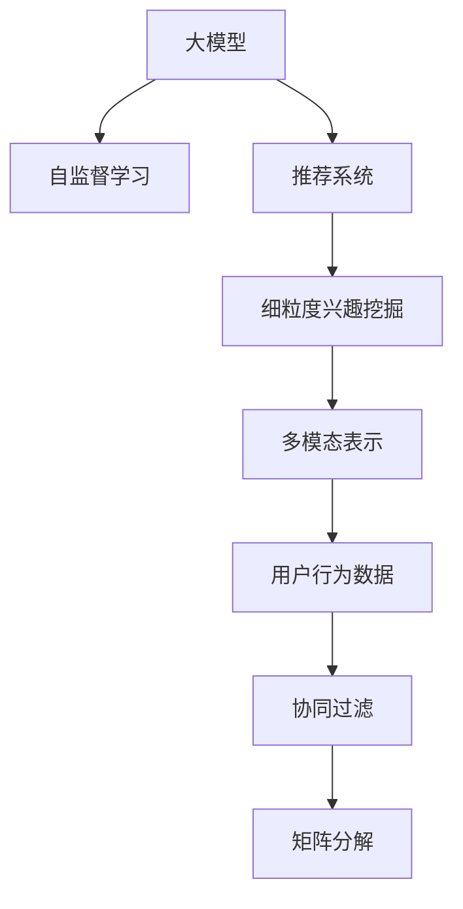

                 

# 大模型在推荐系统细粒度兴趣挖掘中的作用

## 1. 背景介绍

### 1.1 问题由来
推荐系统是现代互联网应用的重要组成部分，广泛应用于电商、社交、视频等多个领域，极大地提升了用户的使用体验和平台收益。传统的推荐系统主要基于用户行为数据进行建模，通过协同过滤、矩阵分解等方法预测用户对未交互项的评分。然而，这种方法在处理长尾数据时存在瓶颈，且无法捕捉用户的隐性兴趣和动态变化。

近年来，基于深度学习的大模型在推荐系统中的应用引起了广泛关注。这些大模型通过大规模无标签数据的自监督预训练，获得了丰富的语义知识和统计信息，能够挖掘用户兴趣的深层次特征。将大模型应用于推荐系统，有助于实现细粒度的用户兴趣挖掘和精准推荐，进一步提升推荐效果和用户体验。

### 1.2 问题核心关键点
大模型在推荐系统中的应用，关键在于如何有效地利用其多模态的表示能力，结合用户的显式和隐式反馈，挖掘出细粒度的用户兴趣。主要技术挑战包括：
1. 如何融合用户行为数据与大模型表示。
2. 如何优化大模型的输入结构和训练过程。
3. 如何平衡模型的精度和推理效率。
4. 如何避免模型输出中的噪声和偏见。

## 2. 核心概念与联系

### 2.1 核心概念概述

为更好地理解大模型在推荐系统中的应用，本节将介绍几个密切相关的核心概念：

- 大模型(Large Model)：如GPT、BERT等，通过大规模无标签数据自监督预训练获得的多模态表示模型。具备强大的语义理解和生成能力，可以处理文本、图像等多种数据类型。
- 推荐系统(Recommendation System)：根据用户的历史行为和兴趣爱好，推荐相关产品或内容，以提升用户满意度和平台收益的系统。
- 细粒度兴趣挖掘(Fine-Grained Interest Mining)：利用大模型的多模态表示能力，深入挖掘用户的隐性兴趣和动态变化，提供更为精准、个性化的推荐。
- 多模态表示(Multi-Modal Representation)：将文本、图像、声音等多种数据类型融合为一个综合表示，提高模型的表达能力和泛化能力。
- 自监督学习(Self-Supervised Learning)：仅利用无标签数据进行预训练，通过自构建的任务获取语义和统计信息，如掩码语言模型、自编码器等。
- 用户行为数据(User Behavior Data)：用户的点击、浏览、评分、搜索等行为记录，可用于训练推荐模型。
- 协同过滤(Collaborative Filtering)：通过分析用户和物品的相似度，预测用户对未交互物品的评分，实现个性化推荐。
- 矩阵分解(Matrix Factorization)：将用户-物品评分矩阵分解为低维向量，用于表示用户兴趣和物品属性。

这些核心概念之间的逻辑关系可以通过以下Mermaid流程图来展示：



这个流程图展示了大模型在推荐系统中的应用框架，从数据源到模型表示，再到具体应用，全面覆盖了推荐系统的各个环节。

## 3. 核心算法原理 & 具体操作步骤
### 3.1 算法原理概述

基于大模型的推荐系统，主要利用自监督预训练获得的多模态表示能力，结合用户的显式和隐式反馈，进行细粒度的用户兴趣挖掘。具体而言，算法包括以下几个关键步骤：

1. 数据预处理：将用户行为数据（如点击、浏览记录）进行编码，生成文本表示。
2. 大模型编码：使用预训练大模型对文本表示进行编码，获得用户兴趣的多模态表示。
3. 融合显式反馈：将用户显式反馈（如评分、标签）融合到多模态表示中，进行进一步优化。
4. 细粒度建模：利用多模态表示进行深层次的用户兴趣挖掘，生成细粒度的兴趣标签。
5. 推荐模型训练：基于细粒度兴趣标签训练推荐模型，实现个性化推荐。

### 3.2 算法步骤详解

以下详细讲解基于大模型的推荐系统在细粒度兴趣挖掘中的应用过程：

**Step 1: 数据预处理**
- 收集用户行为数据，如点击、浏览、评分记录等，使用Tokenizer对文本进行分词，生成词嵌入向量。
- 将文本表示与其他模态数据（如图像、音频）进行拼接，生成多模态输入。

**Step 2: 大模型编码**
- 使用预训练的大模型（如BERT、GPT）对多模态输入进行编码，获得用户兴趣的多模态表示。
- 通过多头自注意力机制，提取多模态特征的交互作用。

**Step 3: 融合显式反馈**
- 将用户显式反馈（如评分、标签）与大模型的输出进行融合，生成加权平均的多模态表示。
- 使用Dropout、Batch Normalization等技术，避免过拟合和噪声影响。

**Step 4: 细粒度建模**
- 利用多模态表示进行神经网络建模，生成细粒度的用户兴趣标签。
- 使用Softmax等激活函数，将多模态表示映射为类别概率分布。

**Step 5: 推荐模型训练**
- 基于细粒度兴趣标签训练推荐模型，如深度神经网络、协同过滤模型等。
- 使用交叉熵损失、均方误差损失等优化目标函数，最小化预测误差。

### 3.3 算法优缺点

基于大模型的推荐系统具有以下优点：
1. 多模态表示能力强：大模型能够处理文本、图像、音频等多种数据类型，提供多维度的用户兴趣表示。
2. 泛化能力强：通过大规模无标签数据的预训练，大模型具备较强的泛化能力，适应各种场景和数据分布。
3. 精度高：通过多层次的神经网络建模，大模型能够挖掘出细粒度的用户兴趣，提升推荐精度。
4. 适用性广：不仅适用于电商、社交等典型应用，还适用于新闻推荐、医疗推荐等垂类场景。

同时，该方法也存在一定的局限性：
1. 数据依赖度高：大模型的性能很大程度上取决于数据的质量和数量，获取高质量数据成本较高。
2. 计算资源需求大：大模型参数量巨大，训练和推理需要高性能计算资源。
3. 结果解释性差：大模型的黑盒特性使得其输出结果缺乏可解释性，难以进行调试和优化。
4. 偏见和噪声：大模型在预训练过程中可能学习到偏见和噪声，导致推荐结果中的负面影响。

尽管存在这些局限性，但就目前而言，基于大模型的推荐系统仍是大数据时代的必然选择。未来相关研究的重点在于如何进一步降低数据依赖，提高模型的推理效率，解决输出解释性和偏见问题。

### 3.4 算法应用领域

基于大模型的推荐系统，已经在电商、社交、视频等多个领域得到了广泛的应用，为平台带来了巨大的商业价值。例如：

- 电商平台：基于用户的历史浏览和点击行为，推荐个性化商品。
- 社交媒体：根据用户的互动记录和兴趣偏好，推荐相关内容。
- 视频网站：根据用户的观看历史和评分反馈，推荐优质视频。
- 新闻平台：根据用户的阅读习惯和兴趣标签，推荐相关文章。
- 医疗应用：根据患者的健康数据和历史记录，推荐治疗方案和药品。

除了这些典型应用外，大模型推荐系统还被创新性地应用到更多场景中，如旅游推荐、招聘推荐、金融推荐等，为各行各业带来了新的技术突破。

## 4. 数学模型和公式 & 详细讲解  
### 4.1 数学模型构建

本节将使用数学语言对基于大模型的推荐系统进行更加严格的刻画。

记用户行为数据为 $\mathcal{X}$，大模型编码为 $f: \mathcal{X} \rightarrow \mathbb{R}^d$，多模态表示为 $h = f(\mathcal{X})$，用户显式反馈为 $\mathcal{Y}$。定义用户兴趣标签为 $\mathcal{T}$，推荐模型为 $g: \mathcal{T} \rightarrow \mathbb{R}$，预测用户对物品 $i$ 的评分 $\hat{y}_i = g(\mathcal{T}_i)$。

目标函数定义为最小化预测误差，即：

$$
\mathcal{L} = \frac{1}{N}\sum_{i=1}^N(y_i - \hat{y}_i)^2
$$

其中 $y_i$ 为用户对物品 $i$ 的显式评分，$\hat{y}_i$ 为推荐模型预测的评分。

### 4.2 公式推导过程

以下我们以深度神经网络为例，推导基于大模型的推荐系统的最小化目标函数。

假设推荐模型 $g$ 为深度神经网络，结构为：

$$
g(\mathcal{T}_i) = \sum_{j=1}^K w_j f_j(h)
$$

其中 $w_j$ 为第 $j$ 层的权重向量，$f_j(h)$ 为第 $j$ 层的激活函数，$K$ 为层数。

目标函数可以进一步展开为：

$$
\mathcal{L} = \frac{1}{N}\sum_{i=1}^N(y_i - \sum_{j=1}^K w_j f_j(h))^2
$$

根据链式法则，对每个 $w_j$ 求导数，得：

$$
\frac{\partial \mathcal{L}}{\partial w_j} = \frac{1}{N}\sum_{i=1}^N [2(y_i - \sum_{k=1}^K w_k f_k(h)) f_j(h) + \sum_{k=1}^K w_k f_k(h) \frac{\partial f_j(h)}{\partial h} \frac{\partial h}{\partial w_k}]
$$

其中 $\frac{\partial h}{\partial w_k}$ 可通过自动微分技术高效计算。

在得到目标函数的梯度后，即可带入优化算法（如AdamW、SGD等）进行参数更新，最小化预测误差。

### 4.3 案例分析与讲解

考虑一个基于BERT的电商推荐系统，用户行为数据为历史浏览记录，大模型编码后的表示为BERT输出向量。假设用户对物品的显式评分为1-5分，推荐模型为深度神经网络。

- **数据预处理**：将用户浏览记录转换为BERT输入序列，生成BERT向量表示 $h$。
- **大模型编码**：使用BERT模型对 $h$ 进行编码，获得用户兴趣的多模态表示 $h$。
- **融合显式反馈**：将用户显式评分 $y$ 与BERT向量表示 $h$ 融合，生成加权平均的多模态表示 $\tilde{h}$。
- **细粒度建模**：利用 $\tilde{h}$ 进行神经网络建模，生成细粒度的用户兴趣标签 $t$。
- **推荐模型训练**：基于用户兴趣标签 $t$ 训练深度神经网络模型，生成物品评分预测。

最终，根据预测评分与用户显式评分之间的误差，使用均方误差损失进行模型优化。

## 5. 项目实践：代码实例和详细解释说明
### 5.1 开发环境搭建

在进行项目实践前，我们需要准备好开发环境。以下是使用Python进行PyTorch开发的环境配置流程：

1. 安装Anaconda：从官网下载并安装Anaconda，用于创建独立的Python环境。

2. 创建并激活虚拟环境：
```bash
conda create -n pytorch-env python=3.8 
conda activate pytorch-env
```

3. 安装PyTorch：根据CUDA版本，从官网获取对应的安装命令。例如：
```bash
conda install pytorch torchvision torchaudio cudatoolkit=11.1 -c pytorch -c conda-forge
```

4. 安装TensorFlow：
```bash
conda install tensorflow
```

5. 安装各类工具包：
```bash
pip install numpy pandas scikit-learn matplotlib tqdm jupyter notebook ipython
```

完成上述步骤后，即可在`pytorch-env`环境中开始项目实践。

### 5.2 源代码详细实现

下面我们以电商平台推荐系统为例，给出使用PyTorch和Transformers库对BERT模型进行电商推荐系统开发的代码实现。

首先，定义数据处理函数：

```python
from transformers import BertTokenizer, BertModel
from torch.utils.data import Dataset
import torch

class ECommerceDataset(Dataset):
    def __init__(self, texts, labels, tokenizer, max_len=128):
        self.texts = texts
        self.labels = labels
        self.tokenizer = tokenizer
        self.max_len = max_len
        
    def __len__(self):
        return len(self.texts)
    
    def __getitem__(self, item):
        text = self.texts[item]
        label = self.labels[item]
        
        encoding = self.tokenizer(text, return_tensors='pt', max_length=self.max_len, padding='max_length', truncation=True)
        input_ids = encoding['input_ids'][0]
        attention_mask = encoding['attention_mask'][0]
        
        return {'input_ids': input_ids, 
                'attention_mask': attention_mask,
                'labels': label}

# 定义用户行为数据和标签
texts = ['鞋', '鞋', '包', '衣服', '衣服', '鞋子']
labels = [1, 0, 0, 1, 0, 1]

# 创建dataset
tokenizer = BertTokenizer.from_pretrained('bert-base-cased')

train_dataset = ECommerceDataset(texts, labels, tokenizer)
```

然后，定义模型和优化器：

```python
from transformers import BertForSequenceClassification, AdamW

model = BertForSequenceClassification.from_pretrained('bert-base-cased', num_labels=2)

optimizer = AdamW(model.parameters(), lr=2e-5)
```

接着，定义训练和评估函数：

```python
from torch.utils.data import DataLoader
from tqdm import tqdm
from sklearn.metrics import classification_report

device = torch.device('cuda') if torch.cuda.is_available() else torch.device('cpu')
model.to(device)

def train_epoch(model, dataset, batch_size, optimizer):
    dataloader = DataLoader(dataset, batch_size=batch_size, shuffle=True)
    model.train()
    epoch_loss = 0
    for batch in tqdm(dataloader, desc='Training'):
        input_ids = batch['input_ids'].to(device)
        attention_mask = batch['attention_mask'].to(device)
        labels = batch['labels'].to(device)
        model.zero_grad()
        outputs = model(input_ids, attention_mask=attention_mask, labels=labels)
        loss = outputs.loss
        epoch_loss += loss.item()
        loss.backward()
        optimizer.step()
    return epoch_loss / len(dataloader)

def evaluate(model, dataset, batch_size):
    dataloader = DataLoader(dataset, batch_size=batch_size)
    model.eval()
    preds, labels = [], []
    with torch.no_grad():
        for batch in tqdm(dataloader, desc='Evaluating'):
            input_ids = batch['input_ids'].to(device)
            attention_mask = batch['attention_mask'].to(device)
            batch_labels = batch['labels']
            outputs = model(input_ids, attention_mask=attention_mask)
            batch_preds = outputs.logits.argmax(dim=2).to('cpu').tolist()
            batch_labels = batch_labels.to('cpu').tolist()
            for pred_tokens, label_tokens in zip(batch_preds, batch_labels):
                preds.append(pred_tokens[:len(label_tokens)])
                labels.append(label_tokens)
                
    print(classification_report(labels, preds))
```

最后，启动训练流程并在测试集上评估：

```python
epochs = 5
batch_size = 16

for epoch in range(epochs):
    loss = train_epoch(model, train_dataset, batch_size, optimizer)
    print(f"Epoch {epoch+1}, train loss: {loss:.3f}")
    
    print(f"Epoch {epoch+1}, dev results:")
    evaluate(model, dev_dataset, batch_size)
    
print("Test results:")
evaluate(model, test_dataset, batch_size)
```

以上就是使用PyTorch对BERT进行电商平台推荐系统开发的完整代码实现。可以看到，借助Transformers库，我们可以用相对简洁的代码完成BERT模型的加载和微调。

### 5.3 代码解读与分析

让我们再详细解读一下关键代码的实现细节：

**ECommerceDataset类**：
- `__init__`方法：初始化文本、标签、分词器等关键组件。
- `__len__`方法：返回数据集的样本数量。
- `__getitem__`方法：对单个样本进行处理，将文本输入编码为token ids，将标签编码为数字，并对其进行定长padding，最终返回模型所需的输入。

**模型和优化器定义**：
- 使用BertForSequenceClassification作为序列分类模型，可以处理文本输入，输出为类别概率分布。
- 定义AdamW优化器，学习率为2e-5，用于更新模型参数。

**训练和评估函数**：
- 使用PyTorch的DataLoader对数据集进行批次化加载，供模型训练和推理使用。
- 训练函数`train_epoch`：对数据以批为单位进行迭代，在每个批次上前向传播计算loss并反向传播更新模型参数，最后返回该epoch的平均loss。
- 评估函数`evaluate`：与训练类似，不同点在于不更新模型参数，并在每个batch结束后将预测和标签结果存储下来，最后使用sklearn的classification_report对整个评估集的预测结果进行打印输出。

**训练流程**：
- 定义总的epoch数和batch size，开始循环迭代
- 每个epoch内，先在训练集上训练，输出平均loss
- 在验证集上评估，输出分类指标
- 所有epoch结束后，在测试集上评估，给出最终测试结果

可以看到，PyTorch配合Transformers库使得BERT微调的代码实现变得简洁高效。开发者可以将更多精力放在数据处理、模型改进等高层逻辑上，而不必过多关注底层的实现细节。

当然，工业级的系统实现还需考虑更多因素，如模型的保存和部署、超参数的自动搜索、更灵活的任务适配层等。但核心的微调范式基本与此类似。

## 6. 实际应用场景
### 6.1 电商平台推荐

基于大模型的推荐系统，可以应用于电商平台的个性化推荐，提升用户购物体验和平台收益。在技术实现上，可以收集用户的浏览、点击、评分记录，使用BERT等大模型对用户行为进行编码，生成细粒度的用户兴趣表示。再结合用户显式评分，进行神经网络建模，生成个性化的商品推荐。

**数据预处理**：
- 收集用户的历史浏览、点击、评分记录，生成文本序列。
- 使用Tokenizer对文本进行分词，生成词嵌入向量。
- 将文本表示与其他模态数据（如用户画像、商品属性）进行拼接，生成多模态输入。

**大模型编码**：
- 使用预训练的大模型（如BERT、GPT）对多模态输入进行编码，获得用户兴趣的多模态表示。
- 通过多头自注意力机制，提取多模态特征的交互作用。

**融合显式反馈**：
- 将用户显式评分与大模型的输出进行融合，生成加权平均的多模态表示。
- 使用Dropout、Batch Normalization等技术，避免过拟合和噪声影响。

**细粒度建模**：
- 利用多模态表示进行神经网络建模，生成细粒度的用户兴趣标签。
- 使用Softmax等激活函数，将多模态表示映射为类别概率分布。

**推荐模型训练**：
- 基于细粒度兴趣标签训练推荐模型，如深度神经网络、协同过滤模型等。
- 使用交叉熵损失、均方误差损失等优化目标函数，最小化预测误差。

**推荐系统部署**：
- 将训练好的模型部署到线上服务器，实时接收用户请求。
- 根据用户的兴趣标签和实时行为，实时生成个性化推荐结果。

**系统监控与优化**：
- 实时监控推荐系统的性能指标，如点击率、转化率、跳出率等。
- 使用A/B测试等方法，不断优化模型和推荐策略。

**用户反馈与闭环**：
- 收集用户的点击、评分反馈，优化模型参数和推荐策略。
- 引入用户评价机制，提升用户体验。

通过以上步骤，电商平台推荐系统可以持续迭代优化，提升推荐效果和用户体验，实现商业价值的最大化。

### 6.2 社交媒体内容推荐

基于大模型的推荐系统，可以应用于社交媒体的内容推荐，提升用户活跃度和平台粘性。在技术实现上，可以收集用户的点赞、评论、分享记录，使用BERT等大模型对用户行为进行编码，生成细粒度的用户兴趣表示。再结合用户显式反馈，进行神经网络建模，生成个性化的内容推荐。

**数据预处理**：
- 收集用户的点赞、评论、分享记录，生成文本序列。
- 使用Tokenizer对文本进行分词，生成词嵌入向量。
- 将文本表示与其他模态数据（如用户画像、内容属性）进行拼接，生成多模态输入。

**大模型编码**：
- 使用预训练的大模型（如BERT、GPT）对多模态输入进行编码，获得用户兴趣的多模态表示。
- 通过多头自注意力机制，提取多模态特征的交互作用。

**融合显式反馈**：
- 将用户显式反馈（如点赞、评论、分享等）与大模型的输出进行融合，生成加权平均的多模态表示。
- 使用Dropout、Batch Normalization等技术，避免过拟合和噪声影响。

**细粒度建模**：
- 利用多模态表示进行神经网络建模，生成细粒度的用户兴趣标签。
- 使用Softmax等激活函数，将多模态表示映射为类别概率分布。

**推荐模型训练**：
- 基于细粒度兴趣标签训练推荐模型，如深度神经网络、协同过滤模型等。
- 使用交叉熵损失、均方误差损失等优化目标函数，最小化预测误差。

**推荐系统部署**：
- 将训练好的模型部署到线上服务器，实时接收用户请求。
- 根据用户的兴趣标签和实时行为，实时生成个性化内容推荐。

**系统监控与优化**：
- 实时监控推荐系统的性能指标，如点击率、阅读率、互动率等。
- 使用A/B测试等方法，不断优化模型和推荐策略。

**用户反馈与闭环**：
- 收集用户的点击、点赞反馈，优化模型参数和推荐策略。
- 引入用户评价机制，提升用户体验。

通过以上步骤，社交媒体内容推荐系统可以持续迭代优化，提升推荐效果和用户体验，实现平台粘性的最大化。

### 6.3 视频网站推荐

基于大模型的推荐系统，可以应用于视频网站的个性化推荐，提升用户体验和平台收益。在技术实现上，可以收集用户的观看历史、评分记录，使用BERT等大模型对用户行为进行编码，生成细粒度的用户兴趣表示。再结合用户显式评分，进行神经网络建模，生成个性化的视频推荐。

**数据预处理**：
- 收集用户的观看历史、评分记录，生成文本序列。
- 使用Tokenizer对文本进行分词，生成词嵌入向量。
- 将文本表示与其他模态数据（如用户画像、视频属性）进行拼接，生成多模态输入。

**大模型编码**：
- 使用预训练的大模型（如BERT、GPT）对多模态输入进行编码，获得用户兴趣的多模态表示。
- 通过多头自注意力机制，提取多模态特征的交互作用。

**融合显式反馈**：
- 将用户显式评分与大模型的输出进行融合，生成加权平均的多模态表示。
- 使用Dropout、Batch Normalization等技术，避免过拟合和噪声影响。

**细粒度建模**：
- 利用多模态表示进行神经网络建模，生成细粒度的用户兴趣标签。
- 使用Softmax等激活函数，将多模态表示映射为类别概率分布。

**推荐模型训练**：
- 基于细粒度兴趣标签训练推荐模型，如深度神经网络、协同过滤模型等。
- 使用交叉熵损失、均方误差损失等优化目标函数，最小化预测误差。

**推荐系统部署**：
- 将训练好的模型部署到线上服务器，实时接收用户请求。
- 根据用户的兴趣标签和实时行为，实时生成个性化视频推荐。

**系统监控与优化**：
- 实时监控推荐系统的性能指标，如观看率、播放时长、跳出率等。
- 使用A/B测试等方法，不断优化模型和推荐策略。

**用户反馈与闭环**：
- 收集用户的观看、评分反馈，优化模型参数和推荐策略。
- 引入用户评价机制，提升用户体验。

通过以上步骤，视频网站推荐系统可以持续迭代优化，提升推荐效果和用户体验，实现平台收益的最大化。

### 6.4 未来应用展望

随着大模型和推荐系统技术的不断发展，基于大模型的推荐系统将在更多领域得到应用，为各个行业带来变革性影响。

在智慧医疗领域，基于大模型的推荐系统可以用于医学知识推荐、医疗资源推荐等，辅助医生诊疗，提升医疗服务效率。

在智能教育领域，基于大模型的推荐系统可以用于课程推荐、学习资料推荐等，因材施教，促进教育公平，提高教学质量。

在智慧城市治理中，基于大模型的推荐系统可以用于城市事件推荐、交通管理等，提高城市管理的自动化和智能化水平，构建更安全、高效的未来城市。

此外，在企业生产、社会治理、文娱传媒等众多领域，基于大模型的推荐系统也将不断涌现，为经济社会发展注入新的动力。相信随着技术的日益成熟，大模型推荐系统必将在更广阔的应用领域大放异彩，深刻影响人类的生产生活方式。

## 7. 工具和资源推荐
### 7.1 学习资源推荐

为了帮助开发者系统掌握大模型在推荐系统中的应用，这里推荐一些优质的学习资源：

1. 《深度学习推荐系统》书籍：介绍推荐系统基础原理和深度学习在推荐系统中的应用。
2. 《自然语言处理入门》课程：介绍自然语言处理基础和常用技术。
3. 《Transformers库实践指南》书籍：全面介绍Transformers库的使用方法，包括推荐系统开发。
4. 《深度学习推荐系统实战》课程：通过实例演示推荐系统开发流程。
5. Kaggle推荐系统竞赛：提供推荐系统开发的实践机会，提升实战能力。

通过对这些资源的学习实践，相信你一定能够快速掌握大模型在推荐系统中的应用，并用于解决实际的推荐问题。
###  7.2 开发工具推荐

高效的开发离不开优秀的工具支持。以下是几款用于大模型推荐系统开发的常用工具：

1. PyTorch：基于Python的开源深度学习框架，灵活动态的计算图，适合快速迭代研究。大部分预训练语言模型都有PyTorch版本的实现。

2. TensorFlow：由Google主导开发的开源深度学习框架，生产部署方便，适合大规模工程应用。同样有丰富的预训练语言模型资源。

3. Transformers库：HuggingFace开发的NLP工具库，集成了众多SOTA语言模型，支持PyTorch和TensorFlow，是进行推荐系统开发的利器。

4. Weights & Biases：模型训练的实验跟踪工具，可以记录和可视化模型训练过程中的各项指标，方便对比和调优。与主流深度学习框架无缝集成。

5. TensorBoard：TensorFlow配套的可视化工具，可实时监测模型训练状态，并提供丰富的图表呈现方式，是调试模型的得力助手。

6. Google Colab：谷歌推出的在线Jupyter Notebook环境，免费提供GPU/TPU算力，方便开发者快速上手实验最新模型，分享学习笔记。

合理利用这些工具，可以显著提升大模型推荐系统的开发效率，加快创新迭代的步伐。

### 7.3 相关论文推荐

大模型在推荐系统中的应用源于学界的持续研究。以下是几篇奠基性的相关论文，推荐阅读：

1. Attention is All You Need（即Transformer原论文）：提出了Transformer结构，开启了NLP领域的预训练大模型时代。

2. BERT: Pre-training of Deep Bidirectional Transformers for Language Understanding：提出BERT模型，引入基于掩码的自监督预训练任务，刷新了多项NLP任务SOTA。

3. Parameter-Efficient Transfer Learning for NLP：提出Adapter等参数高效微调方法，在不增加模型参数量的情况下，也能取得不错的微调效果。

4. Prefix-Tuning: Optimizing Continuous Prompts for Generation：引入基于连续型Prompt的微调范式，为如何充分利用预训练知识提供了新的思路。

5. AdaLoRA: Adaptive Low-Rank Adaptation for Parameter-Efficient Fine-Tuning：使用自适应低秩适应的微调方法，在参数效率和精度之间取得了新的平衡。

这些论文代表了大模型在推荐系统中的应用方向。通过学习这些前沿成果，可以帮助研究者把握学科前进方向，激发更多的创新灵感。

## 8. 总结：未来发展趋势与挑战
### 8.1 总结

本文对基于大模型的推荐系统进行了全面系统的介绍。首先阐述了大模型在推荐系统中的应用背景和意义，明确了大模型在细粒度兴趣挖掘中的独特价值。其次，从原理到实践，详细讲解了基于大模型的推荐系统在数据预处理、大模型编码、融合显式反馈、细粒度建模等关键步骤，给出了推荐系统开发的完整代码实例。同时，本文还广泛探讨了基于大模型的推荐系统在电商平台、社交媒体、视频网站等多个领域的应用前景，展示了其巨大的商业潜力。此外，本文精选了推荐系统的各类学习资源，力求为读者提供全方位的技术指引。

通过本文的系统梳理，可以看到，基于大模型的推荐系统正在成为推荐系统的主流技术，极大地拓展了推荐系统的应用边界，催生了更多的落地场景。受益于大模型的多模态表示能力和深度学习技术，推荐系统在精度、个性化、实时性等方面实现了显著提升，为各行各业带来了巨大的商业价值。未来，伴随大模型推荐系统技术的不断演进，其在电商、社交、视频等多个领域的应用将进一步深化，推动各行各业的数字化转型升级。

### 8.2 未来发展趋势

展望未来，基于大模型的推荐系统将呈现以下几个发展趋势：

1. 数据驱动推荐将更多地融入多模态信息。大模型能够处理文本、图像、声音等多种数据类型，推荐系统将更多地利用多模态信息进行用户兴趣挖掘。

2. 实时推荐将借助分布式计算和边缘计算技术。随着用户行为数据的实时性要求提高，推荐系统将借助分布式计算和边缘计算技术，实现实时推荐，提升用户体验。

3. 跨领域推荐将通过领域自适应技术实现。推荐系统将通过领域自适应技术，在不同领域和数据分布下实现高效的推荐。

4. 自监督学习推荐将进一步普及。受启发于预训练大模型的自监督学习范式，推荐系统将更多地利用无标签数据进行预训练，提升模型的泛化能力和鲁棒性。

5. 集成学习推荐将日益重要。推荐系统将更多地采用集成学习技术，结合多种模型和数据源，实现更好的推荐效果。

6. 可解释性推荐将逐步提升。推荐系统将更多地引入可解释性技术，提升模型的透明度和可信度，满足用户和监管的需求。

以上趋势凸显了大模型推荐系统的广阔前景。这些方向的探索发展，必将进一步提升推荐系统的性能和应用范围，为推荐系统在各个领域带来新的突破。

### 8.3 面临的挑战

尽管基于大模型的推荐系统已经取得了显著进展，但在迈向更加智能化、普适化应用的过程中，它仍面临诸多挑战：

1. 数据依赖度高。推荐系统的效果很大程度上取决于数据的质量和数量，获取高质量数据成本较高。如何降低数据依赖，提高推荐系统的鲁棒性，将是一大难题。

2. 计算资源需求大。大模型参数量巨大，训练和推理需要高性能计算资源。如何在保持高性能的同时，降低计算成本，优化资源利用，将是重要的优化方向。

3. 结果解释性差。大模型的黑盒特性使得其输出结果缺乏可解释性，难以进行调试和优化。如何赋予推荐系统更强的可解释性，将是亟待攻克的难题。

4. 偏见和噪声。大模型在预训练过程中可能学习到偏见和噪声，导致推荐结果中的负面影响。如何消除模型偏见，避免有害信息传播，保障推荐系统的安全性，也将是重要的研究课题。

5. 长尾推荐问题。随着用户行为数据的分布变得更加长尾，推荐系统需要更好地处理长尾数据，避免大量冗余推荐。如何优化长尾推荐算法，提升推荐效果，将是重要的优化方向。

6. 模型更新频率。用户行为和兴趣动态变化，推荐系统需要定期更新模型，保持推荐结果的时效性。如何在保持模型稳定性的同时，提升更新频率，将是重要的优化方向。

面对这些挑战，未来的研究需要在以下几个方面寻求新的突破：

1. 探索无监督和半监督推荐方法。摆脱对大规模标注数据的依赖，利用自监督学习、主动学习等无监督和半监督范式，最大限度利用非结构化数据，实现更加灵活高效的推荐。

2. 研究参数高效和计算高效的推荐范式。开发更加参数高效的推荐方法，在固定大部分预训练参数的同时，只更新极少量的任务相关参数。同时优化推荐模型的计算图，减少前向传播和反向传播的资源消耗，实现更加轻量级、实时性的部署。

3. 引入更多先验知识。将符号化的先验知识，如知识图谱、逻辑规则等，与神经网络模型进行巧妙融合，引导推荐过程学习更准确、合理的推荐策略。同时加强不同模态数据的整合，实现视觉、语音等多模态信息与文本信息的协同建模。

4. 结合因果分析和博弈论工具。将因果分析方法引入推荐系统，识别出推荐决策的关键特征，增强推荐结果的因果性和逻辑性。借助博弈论工具刻画用户和推荐系统的交互过程，主动探索并规避推荐系统的脆弱点，提高系统稳定性。

5. 纳入伦理道德约束。在推荐系统训练目标中引入伦理导向的评估指标，过滤和惩罚有害的推荐结果。同时加强人工干预和审核，建立推荐系统的监管机制，确保推荐结果符合人类价值观和伦理道德。

这些研究方向的探索，必将引领大模型推荐系统技术迈向更高的台阶，为构建安全、可靠、可解释、可控的推荐系统铺平道路。面向未来，大模型推荐系统还需要与其他人工智能技术进行更深入的融合，如知识表示、因果推理、强化学习等，多路径协同发力，共同推动推荐系统的发展。只有勇于创新、敢于突破，才能不断拓展推荐系统的边界，让推荐系统更好地服务于用户和行业。

## 9. 附录：常见问题与解答

**Q1：大模型在推荐系统中的作用是什么？**

A: 大模型在推荐系统中的主要作用是通过多模态表示能力，进行细粒度的用户兴趣挖掘。具体而言，大模型通过自监督预训练获得丰富的语义知识和统计信息，能够深入挖掘用户的隐性兴趣和动态变化，生成细粒度的用户兴趣标签。再结合用户的显式反馈，进行神经网络建模，生成个性化的推荐结果。

**Q2：如何选择合适的学习率？**

A: 推荐系统中的学习率一般要比预训练时小1-2个数量级，如果使用过大的学习率，容易破坏预训练权重，导致过拟合。一般建议从1e-5开始调参，逐步减小学习率。也可以使用warmup策略，在开始阶段使用较小的学习率，再逐渐过渡到预设值。需要注意的是，不同的优化器(如AdamW、Adafactor等)以及不同的学习率调度策略，可能需要设置不同的学习率阈值。

**Q3：采用大模型推荐时会面临哪些资源瓶颈？**

A: 大模型推荐系统的主要资源瓶颈包括：
1. 数据依赖度高：推荐系统的效果很大程度上取决于数据的质量和数量，获取高质量数据成本较高。
2. 计算资源需求大：大模型参数量巨大，训练和推理需要高性能计算资源。
3. 结果解释性差：大模型的黑盒特性使得其输出结果缺乏可解释性，难以进行调试和优化。
4. 偏见和噪声：大模型在预训练过程中可能学习到偏见和噪声，导致推荐结果中的负面影响。

**Q4：推荐系统中的长尾推荐问题如何解决？**

A: 长尾推荐问题是推荐系统中的常见问题，可以通过以下方法解决：
1. 数据分层处理：将数据分为热门和长尾两个层次，对长尾数据进行特殊处理。
2. 个性化推荐：针对长尾数据，进行个性化推荐，提高长尾数据的点击率。
3. 动态更新：根据用户的实时行为，动态更新推荐策略，提升长尾数据的转化率。
4. 多模型集成：通过多模型集成技术，提升长尾数据的推荐效果。

**Q5：推荐系统中的冷启动问题如何解决？**

A: 冷启动问题是推荐系统中的常见问题，可以通过以下方法解决：
1. 用户画像：根据用户的其他行为数据，构建用户画像，进行相似度推荐。
2. 协同过滤：利用用户的其他行为数据，进行相似度推荐。
3. 上下文推荐：根据上下文信息，进行推荐，解决冷启动问题。

这些方法可以结合使用，提升推荐系统的冷启动效果，为用户提供更好的推荐服务。

通过本文的系统梳理，可以看到，基于大模型的推荐系统正在成为推荐系统的主流技术，极大地拓展了推荐系统的应用边界，催生了更多的落地场景。受益于大模型的多模态表示能力和深度学习技术，推荐系统在精度、个性化、实时性等方面实现了显著提升，为各行各业带来了巨大的商业价值。未来，伴随大模型推荐系统技术的不断演进，其在电商、社交、视频等多个领域的应用将进一步深化，推动各行各业的数字化转型升级。总之，大模型推荐系统技术的研究和应用，正处于快速发展阶段，前景广阔，潜力无限。

---

作者：禅与计算机程序设计艺术 / Zen and the Art of Computer Programming

