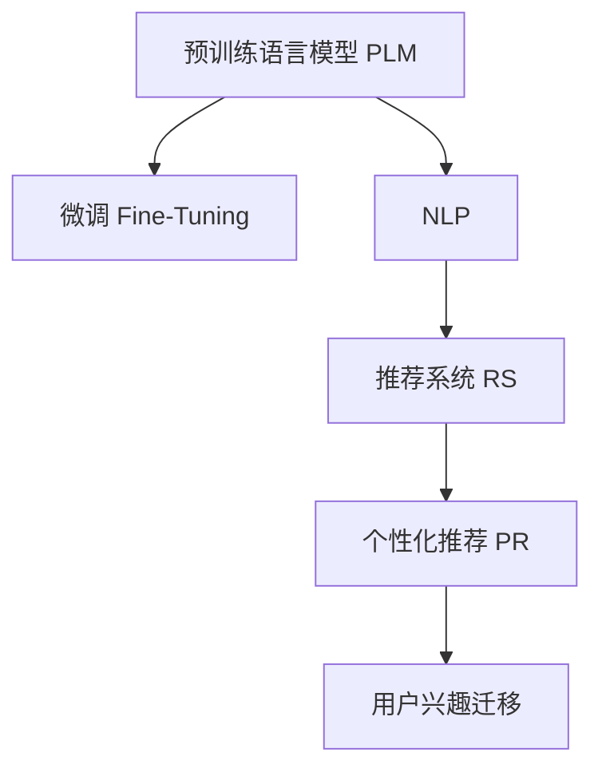

                 

# 大模型在电商平台用户兴趣迁移捕捉中的应用

## 1. 背景介绍

### 1.1 问题由来
随着电商平台的迅猛发展和互联网技术的普及，电商平台已经成为了消费者购物的主要渠道之一。然而，由于电商平台的用户量巨大、用户行为多变、商品种类繁多等特点，如何精准捕捉用户兴趣、提升用户体验、增加平台收益，成为电商运营中的关键挑战。

传统的电商平台推荐系统主要依赖于基于规则或协同过滤的方法，通过分析用户历史行为数据、商品属性信息等，生成推荐结果。这些方法在处理大规模数据、个性化需求等方面存在局限，难以应对电商平台的动态变化和复杂需求。

近年来，深度学习技术，尤其是预训练大模型的兴起，为电商平台推荐系统的创新提供了新的契机。预训练大模型通过在大规模无标签文本数据上预训练，学习到丰富的语言知识，具备强大的文本理解能力。将其应用于电商平台用户兴趣迁移捕捉中，能够更好地理解用户的长期兴趣和潜在需求，提供更加精准的推荐服务。

### 1.2 问题核心关键点
基于预训练大模型的电商平台推荐系统，核心在于通过微调学习用户的行为变化规律，捕捉用户兴趣的迁移轨迹，从而动态调整推荐策略，实现个性化推荐。主要关键点包括：

- 选择合适的预训练模型：如BERT、GPT等，利用其强大的语言理解能力，捕捉用户的行为变化规律。
- 设计合适的任务适配层：根据电商平台推荐任务的特点，设计相应的输出层和损失函数，确保模型学习到适于电商环境的特征表示。
- 微调过程的优化：通过设置适当的学习率、正则化技术等，避免模型过拟合，提升微调效果。
- 实时性要求：电商平台的推荐系统需要实时更新推荐结果，对微调模型的推理效率有较高要求。

## 2. 核心概念与联系

### 2.1 核心概念概述

为更好地理解基于大模型的电商平台用户兴趣迁移捕捉方法，本节将介绍几个密切相关的核心概念：

- 预训练语言模型(Pretrained Language Model, PLM)：以BERT、GPT等为代表的预训练大模型，通过在大规模无标签文本数据上自监督预训练，学习到丰富的语言知识和表征能力。
- 微调(Fine-Tuning)：在预训练模型的基础上，通过有监督的微调过程，学习特定任务的知识，提升模型在该任务上的性能。
- 自然语言处理(Natural Language Processing, NLP)：涉及计算机与人类语言交互的技术，包括文本分类、命名实体识别、情感分析、文本生成等。
- 推荐系统(Recommendation System)：基于用户行为、商品属性等数据，推荐用户可能感兴趣的商品或服务，提升用户体验和平台收益。
- 个性化推荐(Personalized Recommendation)：根据用户的历史行为、兴趣偏好等个性化特征，定制推荐策略，提供更符合用户需求的商品或服务。
- 用户兴趣迁移(User Interest Migration)：用户在不同时间段、不同情境下，对商品或服务的兴趣会发生变化，模型需要捕捉这种动态变化，调整推荐策略。

这些核心概念之间的逻辑关系可以通过以下Mermaid流程图来展示：



这个流程图展示了大模型推荐系统的核心概念及其之间的关系：

1. 预训练语言模型通过自监督学习获得丰富的语言知识。
2. 微调过程将语言知识转化为电商环境的特征表示。
3. 推荐系统根据特征表示生成推荐结果。
4. 个性化推荐策略捕捉用户兴趣的变化。
5. 用户兴趣迁移捕捉模型实时调整推荐策略。

## 3. 核心算法原理 & 具体操作步骤

### 3.1 算法原理概述

基于大模型的电商平台用户兴趣迁移捕捉方法，本质上是一个有监督的细粒度迁移学习过程。其核心思想是：将预训练大模型作为"特征提取器"，通过微调过程学习用户行为变化规律，捕捉用户兴趣迁移轨迹，从而动态调整推荐策略，实现个性化推荐。

具体来说，假设电商平台推荐系统采用预训练语言模型 $M_{\theta}$ 作为初始化参数，通过以下步骤实现用户兴趣迁移捕捉：

1. 收集用户的历史行为数据，如浏览记录、购买记录、评分记录等，构建监督数据集 $D=\{(x_i, y_i)\}_{i=1}^N$，其中 $x_i$ 为用户行为数据，$y_i$ 为用户的兴趣标签。
2. 设计任务适配层，将预训练模型 $M_{\theta}$ 与推荐系统的目标输出层 $O$ 进行连接，构建新的任务模型 $M_{\theta} \rightarrow O$。
3. 选择适合于电商环境的输出层和损失函数，如分类损失函数、回归损失函数等，训练模型 $M_{\theta} \rightarrow O$ 以最小化损失函数 $\mathcal{L}(M_{\theta},D)$。
4. 通过调整学习率、正则化技术等超参数，优化模型 $M_{\theta} \rightarrow O$ 的性能，捕捉用户兴趣迁移轨迹。
5. 根据用户兴趣迁移捕捉模型输出的特征表示，动态调整推荐策略，提供个性化推荐结果。

### 3.2 算法步骤详解

基于大模型的电商平台用户兴趣迁移捕捉方法，具体步骤如下：

**Step 1: 准备数据集**

1. 收集电商平台用户的历史行为数据，如浏览记录、购买记录、评分记录等，构建监督数据集 $D=\{(x_i, y_i)\}_{i=1}^N$，其中 $x_i$ 为用户行为数据，$y_i$ 为用户的兴趣标签。
2. 将数据集分为训练集、验证集和测试集，划分为不同的时间段和不同的用户群体，以便于评估模型在不同场景下的表现。

**Step 2: 模型初始化**

1. 选择适合电商平台的预训练语言模型 $M_{\theta}$，如BERT、GPT等。
2. 在预训练模型的顶层设计任务适配层，选择适合电商平台的输出层和损失函数。
3. 使用预训练模型 $M_{\theta}$ 作为初始化参数，构建新的任务模型 $M_{\theta} \rightarrow O$。

**Step 3: 微调过程**

1. 设定微调的学习率、正则化技术等超参数。
2. 使用训练集 $D$ 训练模型 $M_{\theta} \rightarrow O$，通过前向传播计算损失函数，反向传播更新模型参数。
3. 在验证集上评估模型性能，根据评估结果调整超参数，防止模型过拟合。
4. 在测试集上评估模型性能，输出兴趣迁移捕捉结果。

**Step 4: 推荐策略调整**

1. 根据用户兴趣迁移捕捉模型的输出特征表示，动态调整推荐策略。
2. 将特征表示输入推荐算法，生成个性化推荐结果。
3. 在推荐系统后台实时更新推荐结果，保证推荐的时效性和个性化。

**Step 5: 模型更新与迭代**

1. 定期更新用户行为数据，重新训练模型 $M_{\theta} \rightarrow O$，确保模型的时效性和泛化能力。
2. 根据用户反馈和推荐效果，调整模型超参数，优化推荐策略。

### 3.3 算法优缺点

基于大模型的电商平台用户兴趣迁移捕捉方法，具有以下优点：

1. 高泛化能力：预训练大模型具备强大的泛化能力，能够学习到用户在不同时间段、不同情境下的行为变化规律，适应电商环境的复杂需求。
2. 可解释性：预训练大模型的特征表示具有可解释性，有助于理解用户兴趣迁移的动态变化。
3. 动态调整：用户兴趣迁移捕捉模型能够实时调整推荐策略，提供个性化推荐结果，提升用户体验。

同时，该方法也存在一定的局限性：

1. 标注数据成本：收集用户行为数据并标注兴趣标签需要较高的成本，特别是对于大规模平台。
2. 模型训练时间：预训练大模型和微调过程需要较长的训练时间，对实时性要求较高的推荐系统带来挑战。
3. 数据隐私：用户行为数据涉及隐私，如何保护用户隐私并防止数据泄露，是必须关注的问题。

尽管存在这些局限性，但就目前而言，基于大模型的电商平台用户兴趣迁移捕捉方法仍是最主流范式。未来相关研究的重点在于如何进一步降低标注数据的成本，提高模型训练速度，同时兼顾数据隐私保护和用户信任。

### 3.4 算法应用领域

基于大模型的电商平台用户兴趣迁移捕捉方法，已在电商推荐系统、社交媒体推荐系统、音乐推荐系统等多个领域得到广泛应用，为提升推荐系统的效果和用户满意度提供了重要手段。

在电商推荐系统中，该方法通过捕捉用户兴趣迁移，实时调整推荐策略，提高了商品推荐的准确性和个性化程度。在社交媒体推荐系统中，通过学习用户在不同情境下的兴趣变化，实现了动态调整推荐内容，提升了用户粘性。在音乐推荐系统中，通过捕捉用户对音乐类别的兴趣迁移，实现了音乐内容的个性化推荐，提高了用户满意度。

## 4. 数学模型和公式 & 详细讲解

### 4.1 数学模型构建

本节将使用数学语言对基于大模型的电商平台用户兴趣迁移捕捉方法进行更加严格的刻画。

记预训练语言模型为 $M_{\theta}:\mathcal{X} \rightarrow \mathcal{Y}$，其中 $\mathcal{X}$ 为用户行为数据空间，$\mathcal{Y}$ 为用户兴趣标签空间，$\theta$ 为模型参数。假设电商平台推荐系统收集到的监督数据集为 $D=\{(x_i,y_i)\}_{i=1}^N$，其中 $x_i$ 为历史行为数据，$y_i$ 为兴趣标签。

定义模型 $M_{\theta}$ 在用户行为数据 $x$ 上的输出为 $\hat{y}=M_{\theta}(x) \in \mathcal{Y}$，表示模型预测的用户兴趣标签。在电商环境中，通常会使用分类损失函数，如交叉熵损失，计算模型的预测误差。假设任务适配层的输出层为 $O$，则模型的输出层损失函数定义为：

$$
\mathcal{L}(O, y_i) = -\sum_{i=1}^N \ell(O(x_i), y_i)
$$

其中 $\ell$ 为分类损失函数，如交叉熵损失。将目标输出层 $O$ 与预训练模型 $M_{\theta}$ 连接，得到最终的推荐模型 $M_{\theta} \rightarrow O$。

### 4.2 公式推导过程

以下我们以电商推荐系统为例，推导交叉熵损失函数及其梯度的计算公式。

假设模型 $M_{\theta}$ 在用户行为数据 $x$ 上的输出为 $\hat{y}=M_{\theta}(x) \in [0,1]$，表示模型预测用户兴趣的概率分布。真实标签 $y \in \{0,1\}$。则二分类交叉熵损失函数定义为：

$$
\ell(O(x_i),y_i) = -[y_i\log \hat{y}_i + (1-y_i)\log(1-\hat{y}_i)]
$$

将其代入经验风险公式，得：

$$
\mathcal{L}(O, D) = -\frac{1}{N}\sum_{i=1}^N \ell(O(x_i), y_i)
$$

根据链式法则，损失函数对参数 $\theta$ 的梯度为：

$$
\frac{\partial \mathcal{L}(O, D)}{\partial \theta} = -\frac{1}{N}\sum_{i=1}^N (\frac{y_i}{\hat{y}_i}-\frac{1-y_i}{1-\hat{y}_i}) \frac{\partial M_{\theta}(x_i)}{\partial \theta}
$$

其中 $\frac{\partial M_{\theta}(x_i)}{\partial \theta}$ 可进一步递归展开，利用自动微分技术完成计算。

在得到损失函数的梯度后，即可带入参数更新公式，完成模型的迭代优化。重复上述过程直至收敛，最终得到适应电商平台推荐任务的最优模型参数 $\theta$。

## 5. 项目实践：代码实例和详细解释说明

### 5.1 开发环境搭建

在进行微调实践前，我们需要准备好开发环境。以下是使用Python进行PyTorch开发的环境配置流程：

1. 安装Anaconda：从官网下载并安装Anaconda，用于创建独立的Python环境。

2. 创建并激活虚拟环境：
```bash
conda create -n pytorch-env python=3.8 
conda activate pytorch-env
```

3. 安装PyTorch：根据CUDA版本，从官网获取对应的安装命令。例如：
```bash
conda install pytorch torchvision torchaudio cudatoolkit=11.1 -c pytorch -c conda-forge
```

4. 安装Transformers库：
```bash
pip install transformers
```

5. 安装各类工具包：
```bash
pip install numpy pandas scikit-learn matplotlib tqdm jupyter notebook ipython
```

完成上述步骤后，即可在`pytorch-env`环境中开始微调实践。

### 5.2 源代码详细实现

下面我们以电商推荐系统为例，给出使用Transformers库对BERT模型进行微调的PyTorch代码实现。

首先，定义电商推荐系统的数据处理函数：

```python
from transformers import BertTokenizer
from torch.utils.data import Dataset
import torch

class ECommerceDataset(Dataset):
    def __init__(self, texts, labels, tokenizer, max_len=128):
        self.texts = texts
        self.labels = labels
        self.tokenizer = tokenizer
        self.max_len = max_len
        
    def __len__(self):
        return len(self.texts)
    
    def __getitem__(self, item):
        text = self.texts[item]
        label = self.labels[item]
        
        encoding = self.tokenizer(text, return_tensors='pt', max_length=self.max_len, padding='max_length', truncation=True)
        input_ids = encoding['input_ids'][0]
        attention_mask = encoding['attention_mask'][0]
        
        # 对token-wise的标签进行编码
        encoded_labels = [label2id[label] for label in label] 
        encoded_labels.extend([label2id['none']] * (self.max_len - len(encoded_labels)))
        labels = torch.tensor(encoded_labels, dtype=torch.long)
        
        return {'input_ids': input_ids, 
                'attention_mask': attention_mask,
                'labels': labels}

# 标签与id的映射
label2id = {'buy': 0, 'look': 1, 'review': 2}
id2label = {v: k for k, v in label2id.items()}

# 创建dataset
tokenizer = BertTokenizer.from_pretrained('bert-base-cased')

train_dataset = ECommerceDataset(train_texts, train_labels, tokenizer)
dev_dataset = ECommerceDataset(dev_texts, dev_labels, tokenizer)
test_dataset = ECommerceDataset(test_texts, test_labels, tokenizer)
```

然后，定义模型和优化器：

```python
from transformers import BertForTokenClassification, AdamW

model = BertForTokenClassification.from_pretrained('bert-base-cased', num_labels=len(label2id))

optimizer = AdamW(model.parameters(), lr=2e-5)
```

接着，定义训练和评估函数：

```python
from torch.utils.data import DataLoader
from tqdm import tqdm
from sklearn.metrics import classification_report

device = torch.device('cuda') if torch.cuda.is_available() else torch.device('cpu')
model.to(device)

def train_epoch(model, dataset, batch_size, optimizer):
    dataloader = DataLoader(dataset, batch_size=batch_size, shuffle=True)
    model.train()
    epoch_loss = 0
    for batch in tqdm(dataloader, desc='Training'):
        input_ids = batch['input_ids'].to(device)
        attention_mask = batch['attention_mask'].to(device)
        labels = batch['labels'].to(device)
        model.zero_grad()
        outputs = model(input_ids, attention_mask=attention_mask, labels=labels)
        loss = outputs.loss
        epoch_loss += loss.item()
        loss.backward()
        optimizer.step()
    return epoch_loss / len(dataloader)

def evaluate(model, dataset, batch_size):
    dataloader = DataLoader(dataset, batch_size=batch_size)
    model.eval()
    preds, labels = [], []
    with torch.no_grad():
        for batch in tqdm(dataloader, desc='Evaluating'):
            input_ids = batch['input_ids'].to(device)
            attention_mask = batch['attention_mask'].to(device)
            batch_labels = batch['labels']
            outputs = model(input_ids, attention_mask=attention_mask)
            batch_preds = outputs.logits.argmax(dim=2).to('cpu').tolist()
            batch_labels = batch_labels.to('cpu').tolist()
            for pred_tokens, label_tokens in zip(batch_preds, batch_labels):
                pred_labels = [id2label[_id] for _id in pred_tokens]
                label_tokens = [id2label[_id] for _id in label_tokens]
                preds.append(pred_labels[:len(label_tokens)])
                labels.append(label_tokens)
                
    print(classification_report(labels, preds))
```

最后，启动训练流程并在测试集上评估：

```python
epochs = 5
batch_size = 16

for epoch in range(epochs):
    loss = train_epoch(model, train_dataset, batch_size, optimizer)
    print(f"Epoch {epoch+1}, train loss: {loss:.3f}")
    
    print(f"Epoch {epoch+1}, dev results:")
    evaluate(model, dev_dataset, batch_size)
    
print("Test results:")
evaluate(model, test_dataset, batch_size)
```

以上就是使用PyTorch对BERT进行电商推荐系统微调的完整代码实现。可以看到，得益于Transformers库的强大封装，我们可以用相对简洁的代码完成BERT模型的加载和微调。

### 5.3 代码解读与分析

让我们再详细解读一下关键代码的实现细节：

**ECommerceDataset类**：
- `__init__`方法：初始化文本、标签、分词器等关键组件。
- `__len__`方法：返回数据集的样本数量。
- `__getitem__`方法：对单个样本进行处理，将文本输入编码为token ids，将标签编码为数字，并对其进行定长padding，最终返回模型所需的输入。

**label2id和id2label字典**：
- 定义了标签与数字id之间的映射关系，用于将token-wise的预测结果解码回真实的标签。

**训练和评估函数**：
- 使用PyTorch的DataLoader对数据集进行批次化加载，供模型训练和推理使用。
- 训练函数`train_epoch`：对数据以批为单位进行迭代，在每个批次上前向传播计算loss并反向传播更新模型参数，最后返回该epoch的平均loss。
- 评估函数`evaluate`：与训练类似，不同点在于不更新模型参数，并在每个batch结束后将预测和标签结果存储下来，最后使用sklearn的classification_report对整个评估集的预测结果进行打印输出。

**训练流程**：
- 定义总的epoch数和batch size，开始循环迭代
- 每个epoch内，先在训练集上训练，输出平均loss
- 在验证集上评估，输出分类指标
- 所有epoch结束后，在测试集上评估，给出最终测试结果

可以看到，PyTorch配合Transformers库使得BERT微调的代码实现变得简洁高效。开发者可以将更多精力放在数据处理、模型改进等高层逻辑上，而不必过多关注底层的实现细节。

当然，工业级的系统实现还需考虑更多因素，如模型的保存和部署、超参数的自动搜索、更灵活的任务适配层等。但核心的微调范式基本与此类似。

## 6. 实际应用场景

### 6.1 电商平台推荐

基于大语言模型微调的电商推荐系统，可以广泛应用于用户兴趣迁移捕捉和个性化推荐中。传统电商推荐系统往往依赖于静态的规则或基于历史行为的协同过滤，难以应对用户兴趣的变化和电商环境的动态性。

在技术实现上，可以收集用户的历史浏览记录、购买记录、评分记录等行为数据，将这些数据作为监督数据集，构建模型 $M_{\theta} \rightarrow O$ 进行微调。微调后的模型能够学习到用户在不同时间段、不同情境下的兴趣迁移轨迹，动态调整推荐策略。例如，用户此前对运动鞋感兴趣，近期更多关注户外装备，模型可以根据兴趣迁移轨迹，及时调整推荐内容，提供更符合用户需求的商品。

### 6.2 社交媒体推荐

社交媒体平台用户行为多样，兴趣变化频繁，如何提供个性化推荐是巨大挑战。传统社交媒体推荐系统往往依赖于静态的规则和协同过滤，难以捕捉用户兴趣的动态变化。

在技术实现上，可以收集用户的社交行为数据，如点赞、评论、分享等，将这些数据作为监督数据集，构建模型 $M_{\theta} \rightarrow O$ 进行微调。微调后的模型能够学习到用户在不同情境下的兴趣迁移轨迹，动态调整推荐内容。例如，用户近期更多关注体育赛事相关内容，社交媒体平台可以根据兴趣迁移轨迹，及时调整推荐内容，提供更符合用户兴趣的体育新闻、视频等。

### 6.3 音乐推荐

音乐推荐系统对用户兴趣变化的敏感性较高，如何提供动态个性化的推荐服务是一个重要问题。传统音乐推荐系统往往依赖于静态的规则和协同过滤，难以捕捉用户兴趣的动态变化。

在技术实现上，可以收集用户的历史听歌记录、评分记录等行为数据，将这些数据作为监督数据集，构建模型 $M_{\theta} \rightarrow O$ 进行微调。微调后的模型能够学习到用户在不同时间段、不同情境下的兴趣迁移轨迹，动态调整推荐内容。例如，用户近期更多关注古典音乐，音乐平台可以根据兴趣迁移轨迹，及时调整推荐内容，提供更多古典音乐相关歌曲和专辑。

### 6.4 未来应用展望

随着大语言模型微调技术的不断发展，其在电商平台用户兴趣迁移捕捉中的应用前景将更加广阔。未来，该技术有望在以下方向进一步深化：

1. 多模态兴趣迁移捕捉：结合用户行为数据、社交网络数据、图片和视频等多模态信息，构建多模态兴趣迁移捕捉模型，更全面地捕捉用户兴趣变化。

2. 实时性增强：优化模型训练和推理过程，降低计算成本，提高推荐系统的实时性，满足用户对实时推荐的需求。

3. 跨平台迁移：将兴趣迁移捕捉模型应用于不同平台（如电商平台、社交媒体、音乐平台），实现用户兴趣在不同平台间的无缝迁移。

4. 自适应学习：引入自适应学习技术，模型根据用户行为数据的变化自动调整超参数，增强模型的自适应能力。

5. 用户隐私保护：在模型训练和推荐过程中，采取数据脱敏、差分隐私等技术，保护用户隐私，增强用户信任。

通过以上技术的不断演进，大语言模型微调技术将在电商平台用户兴趣迁移捕捉中发挥更大作用，为提升用户体验和平台收益提供有力支持。

## 7. 工具和资源推荐

### 7.1 学习资源推荐

为了帮助开发者系统掌握大语言模型微调的理论基础和实践技巧，这里推荐一些优质的学习资源：

1. 《Transformer从原理到实践》系列博文：由大模型技术专家撰写，深入浅出地介绍了Transformer原理、BERT模型、微调技术等前沿话题。

2. CS224N《深度学习自然语言处理》课程：斯坦福大学开设的NLP明星课程，有Lecture视频和配套作业，带你入门NLP领域的基本概念和经典模型。

3. 《Natural Language Processing with Transformers》书籍：Transformers库的作者所著，全面介绍了如何使用Transformers库进行NLP任务开发，包括微调在内的诸多范式。

4. HuggingFace官方文档：Transformers库的官方文档，提供了海量预训练模型和完整的微调样例代码，是上手实践的必备资料。

5. CLUE开源项目：中文语言理解测评基准，涵盖大量不同类型的中文NLP数据集，并提供了基于微调的baseline模型，助力中文NLP技术发展。

通过对这些资源的学习实践，相信你一定能够快速掌握大语言模型微调的精髓，并用于解决实际的NLP问题。
###  7.2 开发工具推荐

高效的开发离不开优秀的工具支持。以下是几款用于大语言模型微调开发的常用工具：

1. PyTorch：基于Python的开源深度学习框架，灵活动态的计算图，适合快速迭代研究。大部分预训练语言模型都有PyTorch版本的实现。

2. TensorFlow：由Google主导开发的开源深度学习框架，生产部署方便，适合大规模工程应用。同样有丰富的预训练语言模型资源。

3. Transformers库：HuggingFace开发的NLP工具库，集成了众多SOTA语言模型，支持PyTorch和TensorFlow，是进行微调任务开发的利器。

4. Weights & Biases：模型训练的实验跟踪工具，可以记录和可视化模型训练过程中的各项指标，方便对比和调优。与主流深度学习框架无缝集成。

5. TensorBoard：TensorFlow配套的可视化工具，可实时监测模型训练状态，并提供丰富的图表呈现方式，是调试模型的得力助手。

6. Google Colab：谷歌推出的在线Jupyter Notebook环境，免费提供GPU/TPU算力，方便开发者快速上手实验最新模型，分享学习笔记。

合理利用这些工具，可以显著提升大语言模型微调任务的开发效率，加快创新迭代的步伐。

### 7.3 相关论文推荐

大语言模型和微调技术的发展源于学界的持续研究。以下是几篇奠基性的相关论文，推荐阅读：

1. Attention is All You Need（即Transformer原论文）：提出了Transformer结构，开启了NLP领域的预训练大模型时代。

2. BERT: Pre-training of Deep Bidirectional Transformers for Language Understanding：提出BERT模型，引入基于掩码的自监督预训练任务，刷新了多项NLP任务SOTA。

3. Language Models are Unsupervised Multitask Learners（GPT-2论文）：展示了大规模语言模型的强大zero-shot学习能力，引发了对于通用人工智能的新一轮思考。

4. Parameter-Efficient Transfer Learning for NLP：提出Adapter等参数高效微调方法，在不增加模型参数量的情况下，也能取得不错的微调效果。

5. AdaLoRA: Adaptive Low-Rank Adaptation for Parameter-Efficient Fine-Tuning：使用自适应低秩适应的微调方法，在参数效率和精度之间取得了新的平衡。

这些论文代表了大语言模型微调技术的发展脉络。通过学习这些前沿成果，可以帮助研究者把握学科前进方向，激发更多的创新灵感。

## 8. 总结：未来发展趋势与挑战

### 8.1 总结

本文对基于大模型的电商平台用户兴趣迁移捕捉方法进行了全面系统的介绍。首先阐述了大语言模型和微调技术的研究背景和意义，明确了微调在电商平台推荐系统中的应用价值。其次，从原理到实践，详细讲解了微调的过程和方法，给出了电商推荐系统的代码实现。同时，本文还广泛探讨了微调方法在电商平台推荐系统中的应用前景，展示了微调技术的巨大潜力。

通过本文的系统梳理，可以看到，基于大模型的电商平台用户兴趣迁移捕捉方法正在成为推荐系统的重要范式，极大地拓展了预训练语言模型的应用边界，催生了更多的落地场景。受益于大规模语料的预训练，微调模型能够捕捉用户兴趣的动态变化，实时调整推荐策略，提供个性化推荐服务，提升用户体验和平台收益。

### 8.2 未来发展趋势

展望未来，大语言模型微调技术将呈现以下几个发展趋势：

1. 模型规模持续增大。随着算力成本的下降和数据规模的扩张，预训练语言模型的参数量还将持续增长。超大规模语言模型蕴含的丰富语言知识，有望支撑更加复杂多变的推荐系统微调。

2. 微调方法日趋多样。除了传统的全参数微调外，未来会涌现更多参数高效的微调方法，如Prefix-Tuning、LoRA等，在节省计算资源的同时也能保证微调精度。

3. 持续学习成为常态。随着数据分布的不断变化，微调模型也需要持续学习新知识以保持性能。如何在不遗忘原有知识的同时，高效吸收新样本信息，将成为重要的研究课题。

4. 标注样本需求降低。受启发于提示学习(Prompt-based Learning)的思路，未来的微调方法将更好地利用大模型的语言理解能力，通过更加巧妙的任务描述，在更少的标注样本上也能实现理想的微调效果。

5. 多模态微调崛起。当前的微调主要聚焦于纯文本数据，未来会进一步拓展到图像、视频、语音等多模态数据微调。多模态信息的融合，将显著提升语言模型对现实世界的理解和建模能力。

6. 模型通用性增强。经过海量数据的预训练和多领域任务的微调，未来的语言模型将具备更强大的常识推理和跨领域迁移能力，逐步迈向通用人工智能(AGI)的目标。

以上趋势凸显了大语言模型微调技术的广阔前景。这些方向的探索发展，必将进一步提升推荐系统的性能和用户满意度，为电商平台带来更高效、更个性化的推荐服务。

### 8.3 面临的挑战

尽管大语言模型微调技术已经取得了瞩目成就，但在迈向更加智能化、普适化应用的过程中，它仍面临着诸多挑战：

1. 标注成本瓶颈。收集用户行为数据并标注兴趣标签需要较高的成本，特别是对于大规模平台。如何进一步降低微调对标注样本的依赖，将是一大难题。

2. 模型鲁棒性不足。面对域外数据时，微调模型的泛化性能往往大打折扣。对于测试样本的微小扰动，微调模型的预测也容易发生波动。如何提高微调模型的鲁棒性，避免灾难性遗忘，还需要更多理论和实践的积累。

3. 推理效率有待提高。大规模语言模型虽然精度高，但在实际部署时往往面临推理速度慢、内存占用大等效率问题。如何在保证性能的同时，简化模型结构，提升推理速度，优化资源占用，将是重要的优化方向。

4. 可解释性亟需加强。当前微调模型更像是"黑盒"系统，难以解释其内部工作机制和决策逻辑。对于医疗、金融等高风险应用，算法的可解释性和可审计性尤为重要。如何赋予微调模型更强的可解释性，将是亟待攻克的难题。

5. 安全性有待保障。预训练语言模型难免会学习到有偏见、有害的信息，通过微调传递到下游任务，产生误导性、歧视性的输出，给实际应用带来安全隐患。如何从数据和算法层面消除模型偏见，避免恶意用途，确保输出的安全性，也将是重要的研究课题。

6. 知识整合能力不足。现有的微调模型往往局限于任务内数据，难以灵活吸收和运用更广泛的先验知识。如何让微调过程更好地与外部知识库、规则库等专家知识结合，形成更加全面、准确的信息整合能力，还有很大的想象空间。

正视微调面临的这些挑战，积极应对并寻求突破，将是大语言模型微调走向成熟的必由之路。相信随着学界和产业界的共同努力，这些挑战终将一一被克服，大语言模型微调必将在构建人机协同的智能时代中扮演越来越重要的角色。

### 8.4 研究展望

面对大语言模型微调所面临的种种挑战，未来的研究需要在以下几个方面寻求新的突破：

1. 探索无监督和半监督微调方法。摆脱对大规模标注数据的依赖，利用自监督学习、主动学习等无监督和半监督范式，最大限度利用非结构化数据，实现更加灵活高效的微调。

2. 研究参数高效和计算高效的微调范式。开发更加参数高效的微调方法，在固定大部分预训练参数的同时，只更新极少量的任务相关参数。同时优化微调模型的计算图，减少前向传播和反向传播的资源消耗，实现更加轻量级、实时性的部署。

3. 融合因果和对比学习范式。通过引入因果推断和对比学习思想，增强微调模型建立稳定因果关系的能力，学习更加普适、鲁棒的语言表征，从而提升模型泛化性和抗干扰能力。

4. 引入更多先验知识。将符号化的先验知识，如知识图谱、逻辑规则等，与神经网络模型进行巧妙融合，引导微调过程学习更准确、合理的语言模型。同时加强不同模态数据的整合，实现视觉、语音等多模态信息与文本信息的协同建模。

5. 结合因果分析和博弈论工具。将因果分析方法引入微调模型，识别出模型决策的关键特征，增强输出解释的因果性和逻辑性。借助博弈论工具刻画人机交互过程，主动探索并规避模型的脆弱点，提高系统稳定性。

6. 纳入伦理道德约束。在模型训练目标中引入伦理导向的评估指标，过滤和惩罚有偏见、有害的输出倾向。同时加强人工干预和审核，建立模型行为的监管机制，确保输出符合人类价值观和伦理道德。

这些研究方向的探索，必将引领大语言模型微调技术迈向更高的台阶，为构建安全、可靠、可解释、可控的智能系统铺平道路。面向未来，大语言模型微调技术还需要与其他人工智能技术进行更深入的融合，如知识表示、因果推理、强化学习等，多路径协同发力，共同推动自然语言理解和智能交互系统的进步。只有勇于创新、敢于突破，才能不断拓展语言模型的边界，让智能技术更好地造福人类社会。

## 9. 附录：常见问题与解答

**Q1：大语言模型微调是否适用于所有推荐系统任务？**

A: 大语言模型微调在大多数推荐系统任务上都能取得不错的效果，特别是对于数据量较小的任务。但对于一些特定领域的任务，如医学、法律等，仅仅依靠通用语料预训练的模型可能难以很好地适应。此时需要在特定领域语料上进一步预训练，再进行微调，才能获得理想效果。此外，对于一些需要时效性、个性化很强的任务，如对话、推荐等，微调方法也需要针对性的改进优化。

**Q2：微调过程中如何选择合适的学习率？**

A: 微调的学习率一般要比预训练时小1-2个数量级，如果使用过大的学习率，容易破坏预训练权重，导致过拟合。一般建议从1e-5开始调参，逐步减小学习率，直至收敛。也可以使用warmup策略，在开始阶段使用较小的学习率，再逐渐过渡到预设值。需要注意的是，不同的优化器(如AdamW、Adafactor等)以及不同的学习率调度策略，可能需要设置不同的学习率阈值。

**Q3：采用大模型微调时会面临哪些资源瓶颈？**

A: 目前主流的预训练大模型动辄以亿计的参数规模，对算力、内存、存储都提出了很高的要求。GPU/TPU等高性能设备是必不可少的，但即便如此，超大批次的训练和推理也可能遇到显存不足的问题。因此需要采用一些资源优化技术，如梯度积累、混合精度训练、模型并行等，来突破硬件瓶颈。同时，模型的存储和读取也可能占用大量时间和空间，需要采用模型压缩、稀疏化存储等方法进行优化。

**Q4：如何缓解微调过程中的过拟合问题？**

A: 过拟合是微调面临的主要挑战，尤其是在标注数据不足的情况下。常见的缓解策略包括：
1. 数据增强：通过回译、近义替换等方式扩充训练集
2. 正则化：使用L2正则、Dropout、Early Stopping等避免过拟合
3. 对抗训练：引入对抗样本，提高模型鲁棒性
4. 参数高效微调：只调整少量参数(如Adapter、Prefix等)，减小过拟合风险
5. 多模型集成：训练多个微调模型，取平均输出，抑制过拟合

这些策略往往需要根据具体任务和数据特点进行灵活组合。只有在数据、模型、训练、推理等各环节进行全面优化，才能最大限度地发挥大模型微调的威力。

**Q5：微调模型在落地部署时需要注意哪些问题？**

A: 将微调模型转化为实际应用，还需要考虑以下因素：
1. 模型裁剪：去除不必要的层和参数，减小模型尺寸，加快推理速度
2. 量化加速：将浮点模型转为定点模型，压缩存储空间，提高计算效率
3. 服务化封装：将模型封装为标准化服务接口，便于集成调用
4. 弹性伸缩：根据请求流量动态调整资源配置，平衡服务质量和成本
5. 监控告警：实时采集系统指标，设置异常告警阈值，确保服务稳定性
6. 安全防护：采用访问鉴权、数据脱敏等措施，保障数据和模型安全

大语言模型微调为推荐系统提供了强大的动力，但如何将强大的性能转化为稳定、高效、安全的业务价值，还需要工程实践的不断打磨。唯有从数据、算法、工程、业务等多个维度协同发力，才能真正实现人工智能技术在垂直行业的规模化落地。总之，微调需要开发者根据具体任务，不断迭代和优化模型、数据和算法，方能得到理想的效果。

---

作者：禅与计算机程序设计艺术 / Zen and the Art of Computer Programming

