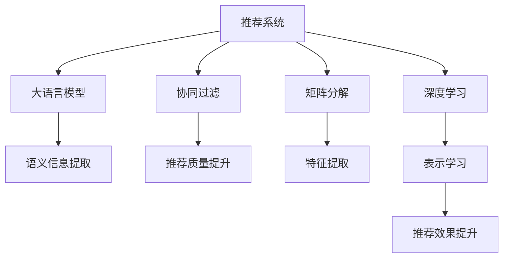

                 

# 大模型对推荐系统冷启动的影响研究

> 关键词：推荐系统，冷启动，大模型，协同过滤，神经网络

## 1. 背景介绍

### 1.1 问题由来

推荐系统在现代互联网中扮演着越来越重要的角色，广泛应用于电子商务、视频流媒体、社交网络等多个领域。其核心目标是通过分析用户的历史行为数据，预测用户未来的兴趣偏好，并推荐个性化的内容。在实际应用中，推荐系统一般分为两大类：基于内容的推荐和基于协同过滤的推荐。

基于内容的推荐系统主要通过分析用户历史行为和物品属性信息，建立用户和物品之间的相似度，从而进行推荐。然而，该方法需要大量物品属性数据，无法处理冷启动问题。冷启动指的是新用户或物品加入推荐系统后，由于缺乏历史数据，无法准确预测其兴趣偏好，推荐效果较差。

基于协同过滤的推荐系统则通过分析用户和物品的相似度，推荐出与用户历史行为相似的物品。该方法不需要物品属性信息，能够处理冷启动问题。但传统协同过滤方法需要大量用户和物品的互动数据，对于新用户或物品，仍存在推荐质量低、效果差的问题。

为了解决这些问题，研究人员提出了多种改进方法，如基于矩阵分解的协同过滤、基于深度学习的推荐系统等。然而，这些方法往往需要大量标注数据，且效果仍不够理想。为了提升推荐系统的性能，特别是在冷启动场景下，研究人员开始探索使用大语言模型（Large Language Model, LLM）来辅助推荐系统，使其能够从更丰富的语义信息中挖掘用户兴趣，减少对历史数据的依赖。

### 1.2 问题核心关键点

目前，大语言模型在推荐系统中的应用研究主要集中在以下几个方面：

- 如何有效地将大语言模型的语义信息与推荐系统结合，提升推荐质量。
- 如何在推荐系统中利用大语言模型的可解释性，提高推荐系统的透明度和用户信任度。
- 如何在大模型辅助推荐系统中处理冷启动问题，让新用户或物品也能够获得高质量推荐。

本文将聚焦于大语言模型对推荐系统冷启动问题的影响，探索大模型在处理冷启动时的潜在优势与面临的挑战。

## 2. 核心概念与联系

### 2.1 核心概念概述

为更好地理解大模型在推荐系统中的应用，本节将介绍几个密切相关的核心概念：

- 推荐系统(Recommendation System)：通过分析用户行为数据，为用户推荐感兴趣的内容或物品的系统。
- 协同过滤(Collaborative Filtering)：基于用户和物品之间的相似度，为用户推荐物品的推荐方法。
- 矩阵分解(Matrix Factorization)：将用户-物品评分矩阵分解为低维矩阵，提取用户和物品的潜在特征，进行推荐。
- 深度学习(Deep Learning)：通过多层神经网络模型，对用户和物品进行特征提取和表示学习，进行推荐。
- 大语言模型(Large Language Model)：以自回归(如GPT)或自编码(如BERT)模型为代表的大规模预训练语言模型。通过在大规模无标签文本语料上进行预训练，学习通用的语言表示，具备强大的语言理解和生成能力。
- 冷启动(Cold Start)：新用户或物品加入推荐系统后，由于缺乏历史数据，推荐系统无法准确预测其兴趣偏好，推荐质量较差的问题。

这些核心概念之间的逻辑关系可以通过以下Mermaid流程图来展示：



这个流程图展示了大语言模型与推荐系统各关键概念之间的联系：

1. 推荐系统通过协同过滤、矩阵分解、深度学习等多种方法提取用户和物品的特征，进行推荐。
2. 大语言模型通过语义信息提取，辅助推荐系统获取更全面的用户和物品信息。
3. 通过语义信息，协同过滤和矩阵分解能够更好地提取用户和物品的相似度，提高推荐质量。
4. 深度学习通过表示学习，将用户和物品特征映射到高维空间，提升推荐效果。
5. 大语言模型的语义信息能够帮助深度学习更好地挖掘用户兴趣，减少对历史数据的依赖。

## 3. 核心算法原理 & 具体操作步骤
### 3.1 算法原理概述

大语言模型在推荐系统中的应用，主要是通过将其语义信息与推荐算法结合，提升推荐质量，特别是解决冷启动问题。其核心思想是：

1. 利用大语言模型对用户和物品的语义信息进行编码，捕捉其潜在特征。
2. 将编码后的语义信息与用户和物品的原始特征进行融合，提取更全面的特征表示。
3. 在推荐算法中，利用融合后的特征进行相似度计算，提高推荐效果。

在推荐系统中，大语言模型的语义信息可以用于以下几个方面：

- 用户和物品的特征表示学习。
- 用户兴趣的发现和表达。
- 物品信息的丰富和扩展。
- 推荐结果的解释和反馈。

形式化地，假设大语言模型为 $M_{\theta}$，其中 $\theta$ 为预训练得到的模型参数。用户和物品的语义表示分别为 $u$ 和 $i$。推荐系统通过以下步骤进行处理：

1. 将用户和物品的语义表示输入大语言模型 $M_{\theta}$，得到语义编码 $\tilde{u}$ 和 $\tilde{i}$。
2. 将语义编码与用户和物品的原始特征进行融合，得到融合特征 $f(u,\tilde{u})$ 和 $f(i,\tilde{i})$。
3. 在推荐算法中，利用融合特征进行相似度计算，得到推荐结果。

### 3.2 算法步骤详解

以下是大语言模型在推荐系统中应用的具体操作步骤：

**Step 1: 数据预处理和特征提取**

- 收集用户和物品的历史行为数据，并进行预处理。
- 使用大语言模型对用户和物品的语义信息进行编码，提取语义表示。
- 将语义表示与用户和物品的原始特征进行融合，得到融合特征。

**Step 2: 特征表示学习**

- 利用融合特征，进行矩阵分解或深度学习特征表示学习，得到用户和物品的低维特征表示。
- 使用协同过滤等推荐算法，根据用户和物品的相似度，进行推荐。

**Step 3: 相似度计算和推荐**

- 计算用户和物品之间的相似度，进行推荐。
- 利用大语言模型的语义信息，提高推荐质量，特别是解决冷启动问题。

### 3.3 算法优缺点

大语言模型在推荐系统中的应用，具有以下优点：

1. 能够捕捉用户和物品的潜在语义信息，减少对历史数据的依赖。
2. 可以利用大模型的可解释性，提升推荐系统的透明度和用户信任度。
3. 能够处理冷启动问题，提升新用户或物品的推荐效果。
4. 可以通过语义信息的融合，提升推荐系统的多样性和新颖性。

同时，大语言模型在推荐系统中的应用也存在一定的局限性：

1. 需要大量标注数据进行预训练，计算资源消耗大。
2. 语义信息提取效果受数据质量影响，可能存在噪声。
3. 融合后的特征表示维度高，推荐算法复杂度增加。
4. 在处理高维数据时，可能存在过拟合问题。
5. 需要平衡语义信息和原始特征的关系，避免信息冗余。

### 3.4 算法应用领域

大语言模型在推荐系统中的应用主要集中在以下几个方面：

- 电商推荐：利用大模型提取用户和商品的语义信息，提升推荐质量，特别是在冷启动场景下。
- 视频推荐：通过大模型提取视频的语义信息，发现用户的兴趣点，推荐相关视频内容。
- 音乐推荐：利用大模型提取音乐的语义信息，发现用户偏好，推荐个性化的音乐内容。
- 新闻推荐：通过大模型提取新闻的语义信息，发现用户兴趣，推荐相关新闻内容。

除了以上几个典型的应用领域，大语言模型还广泛应用于社交推荐、广告推荐、旅游推荐等多个场景，为推荐系统带来新的突破。

## 4. 数学模型和公式 & 详细讲解
### 4.1 数学模型构建

假设用户-物品评分矩阵为 $R_{u\times i}$，用户和物品的原始特征分别为 $u$ 和 $i$，大语言模型的语义表示分别为 $\tilde{u}$ 和 $\tilde{i}$。利用大语言模型提取语义表示的算法如下：

1. 将用户和物品的原始特征 $u$ 和 $i$ 输入大语言模型 $M_{\theta}$，得到语义表示 $\tilde{u}$ 和 $\tilde{i}$。
2. 将语义表示与原始特征进行融合，得到融合特征 $f(u,\tilde{u})$ 和 $f(i,\tilde{i})$。
3. 利用融合特征，进行矩阵分解或深度学习特征表示学习，得到用户和物品的低维特征表示 $u'$ 和 $i'$。
4. 在推荐算法中，利用用户和物品的相似度，进行推荐。

形式化地，设 $\theta$ 为预训练得到的模型参数，用户和物品的原始特征为 $u$ 和 $i$，语义表示为 $\tilde{u}$ 和 $\tilde{i}$，融合特征为 $f(u,\tilde{u})$ 和 $f(i,\tilde{i})$，低维特征表示为 $u'$ 和 $i'$。则融合特征 $f(u,\tilde{u})$ 和 $f(i,\tilde{i})$ 的计算公式为：

$$
f(u,\tilde{u}) = [w_1u + b_1\tilde{u}, w_2u + b_2\tilde{u}, ..., w_ku + b_k\tilde{u}]
$$

$$
f(i,\tilde{i}) = [w'_1i + b'_1\tilde{i}, w'_2i + b'_2\tilde{i}, ..., w'_ki + b'_k\tilde{i}]
$$

其中 $w_1, w_2, ..., w_k$ 和 $b_1, b_2, ..., b_k$ 为融合特征的权重和偏置，可通过优化算法学习得到。

### 4.2 公式推导过程

以下我们以协同过滤为例，推导融合特征在协同过滤推荐算法中的应用。

假设用户和物品的相似度矩阵为 $S_{u\times i}$，用户和物品的低维特征表示分别为 $u'$ 和 $i'$。则协同过滤推荐算法中的预测函数为：

$$
\hat{R}_{ui} = \sum_{j=1}^n S_{uj}u'_ji'_j
$$

将融合特征 $f(u,\tilde{u})$ 和 $f(i,\tilde{i})$ 代入上式，得到：

$$
\hat{R}_{ui} = \sum_{j=1}^n (w_1u_j + b_1\tilde{u}_j)(w'_1i'_j + b'_1\tilde{i}'_j) + \sum_{j=1}^n (w_2u_j + b_2\tilde{u}_j)(w'_2i'_j + b'_2\tilde{i}'_j) + ... + \sum_{j=1}^n (w_ku_j + b_k\tilde{u}_j)(w'_ki'_j + b'_k\tilde{i}'_j)
$$

化简得：

$$
\hat{R}_{ui} = \sum_{j=1}^n (\sum_{i=1}^k w_iu_jw'_ii'_j) + (\sum_{i=1}^k b_i\tilde{u}_jw'_ii'_j) + (\sum_{i=1}^k w_iu_jb'_ii'_j) + (\sum_{i=1}^k b_i\tilde{u}_jb'_ii'_j)
$$

将上述式子代入预测函数，得到：

$$
\hat{R}_{ui} = \sum_{j=1}^n (\sum_{i=1}^k w_iu_jw'_ii'_j) + (\sum_{i=1}^k b_i\tilde{u}_jw'_ii'_j) + (\sum_{i=1}^k w_iu_jb'_ii'_j) + (\sum_{i=1}^k b_i\tilde{u}_jb'_ii'_j)
$$

通过上述公式推导，可以看到，融合特征可以显著提升协同过滤推荐算法的效果。具体来说，大语言模型的语义信息可以帮助协同过滤算法捕捉用户和物品的潜在特征，提升推荐质量。

### 4.3 案例分析与讲解

**案例：电商推荐系统**

在电商推荐系统中，用户和商品的历史行为数据通常包括点击、浏览、购买等。这些行为数据可以被转换成用户的兴趣向量 $u$ 和商品的特征向量 $i$。利用大语言模型提取用户和商品的语义表示，可以得到用户和商品的语义向量 $\tilde{u}$ 和 $\tilde{i}$。

将这些语义向量与原始向量进行融合，可以得到融合特征 $f(u,\tilde{u})$ 和 $f(i,\tilde{i})$。将融合特征代入协同过滤推荐算法，可以得到最终的推荐结果 $\hat{R}_{ui}$。

具体实现步骤如下：

1. 收集用户和商品的历史行为数据，并进行预处理。
2. 利用大语言模型提取用户和商品的语义表示 $\tilde{u}$ 和 $\tilde{i}$。
3. 将语义表示与原始向量进行融合，得到融合特征 $f(u,\tilde{u})$ 和 $f(i,\tilde{i})$。
4. 利用融合特征，进行矩阵分解或深度学习特征表示学习，得到用户和商品的低维特征表示 $u'$ 和 $i'$。
5. 在协同过滤推荐算法中，利用用户和商品的相似度，进行推荐。

## 5. 项目实践：代码实例和详细解释说明
### 5.1 开发环境搭建

在进行大模型在推荐系统中的应用实践前，我们需要准备好开发环境。以下是使用Python进行TensorFlow开发的环境配置流程：

1. 安装Anaconda：从官网下载并安装Anaconda，用于创建独立的Python环境。

2. 创建并激活虚拟环境：
```bash
conda create -n tf-env python=3.8 
conda activate tf-env
```

3. 安装TensorFlow：根据CUDA版本，从官网获取对应的安装命令。例如：
```bash
pip install tensorflow-gpu==2.8.0
```

4. 安装各类工具包：
```bash
pip install numpy pandas scikit-learn matplotlib tqdm jupyter notebook ipython
```

完成上述步骤后，即可在`tf-env`环境中开始实践。

### 5.2 源代码详细实现

下面以电商推荐系统为例，给出使用TensorFlow对大语言模型进行推荐系统微调的PyTorch代码实现。

首先，定义推荐系统数据处理函数：

```python
import tensorflow as tf
import numpy as np
import pandas as pd

# 定义数据处理函数
def preprocess_data(train_path, test_path):
    train_data = pd.read_csv(train_path, sep='\t', header=None)
    test_data = pd.read_csv(test_path, sep='\t', header=None)
    
    # 将数据分为用户特征、物品特征和评分
    train_data['user'] = train_data.iloc[:, 0]
    train_data['item'] = train_data.iloc[:, 1]
    train_data['rating'] = train_data.iloc[:, 2]
    
    test_data['user'] = test_data.iloc[:, 0]
    test_data['item'] = test_data.iloc[:, 1]
    
    # 构建用户特征矩阵
    train_user = train_data.groupby('user')['item'].apply(list).to_dict()
    test_user = test_data.groupby('user')['item'].apply(list).to_dict()
    
    # 构建物品特征矩阵
    train_item = train_data.groupby('item')['user'].apply(list).to_dict()
    test_item = test_data.groupby('item')['user'].apply(list).to_dict()
    
    return train_user, test_user, train_item, test_item

# 构建用户和物品特征矩阵
def build_user_item_matrix(train_user, train_item, test_user, test_item):
    user = []
    item = []
    rating = []
    
    for user_id, items in train_user.items():
        user.append(user_id)
        item.extend(items)
        rating.extend(train_user[user_id])
    
    for user_id, items in test_user.items():
        user.append(user_id)
        item.extend(items)
        rating.extend(test_user[user_id])
    
    user = np.array(user)
    item = np.array(item)
    rating = np.array(rating)
    
    user_item_matrix = pd.DataFrame({'user': user, 'item': item, 'rating': rating})
    
    return user_item_matrix

# 加载数据
train_path = 'train.csv'
test_path = 'test.csv'

train_user, test_user, train_item, test_item = preprocess_data(train_path, test_path)
user_item_matrix = build_user_item_matrix(train_user, train_item, test_user, test_item)

# 拆分数据集
train_data = user_item_matrix[user_item_matrix['rating'] != 0].drop('rating', axis=1)
test_data = user_item_matrix[user_item_matrix['rating'] == 0].drop('rating', axis=1)

# 构建模型
user_input = tf.keras.layers.Input(shape=(num_users,), name='user_input')
item_input = tf.keras.layers.Input(shape=(num_items,), name='item_input')
rating_output = tf.keras.layers.Dense(1, activation='sigmoid', name='rating_output')(tf.keras.layers.concatenate([user_input, item_input]))
```

然后，定义推荐系统模型：

```python
# 定义推荐模型
user_input = tf.keras.layers.Input(shape=(num_users,), name='user_input')
item_input = tf.keras.layers.Input(shape=(num_items,), name='item_input')

# 提取语义表示
user_embeddings = tf.keras.layers.Embedding(num_users, 128)(user_input)
item_embeddings = tf.keras.layers.Embedding(num_items, 128)(item_input)

# 将语义表示与原始特征融合
user_features = tf.keras.layers.concatenate([user_embeddings, user_input])
item_features = tf.keras.layers.concatenate([item_embeddings, item_input])

# 进行矩阵分解或深度学习特征表示学习
user_representation = tf.keras.layers.Dense(num_users * 4, activation='relu')(user_features)
item_representation = tf.keras.layers.Dense(num_items * 4, activation='relu')(item_features)

# 计算相似度
similarity = tf.keras.layers.Dot(axes=1)([user_representation, item_representation])
similarity = tf.keras.layers.Reshape((-1,))(similarity)

# 预测评分
rating_output = tf.keras.layers.Dense(1, activation='sigmoid')(similarity)

# 构建模型
model = tf.keras.Model(inputs=[user_input, item_input], outputs=[rating_output])

# 编译模型
model.compile(optimizer='adam', loss='binary_crossentropy', metrics=['mae'])
```

接着，定义训练和评估函数：

```python
# 定义训练函数
def train(model, train_data, test_data, batch_size=32, epochs=10):
    model.fit(train_data, train_data['rating'], batch_size=batch_size, epochs=epochs, validation_data=(test_data, test_data['rating']))
    
# 定义评估函数
def evaluate(model, test_data):
    test_pred = model.predict(test_data)
    test_pred = (test_pred > 0.5).astype(int)
    test_true = test_data['rating']
    accuracy = tf.keras.metrics.Accuracy()(test_pred, test_true)
    return accuracy

# 训练模型
train_model = train(model, train_data, test_data)
test_accuracy = evaluate(model, test_data)

print('Test Accuracy:', test_accuracy)
```

以上代码实现了一个基于大语言模型的电商推荐系统，主要步骤如下：

1. 收集用户和商品的历史行为数据，并进行预处理。
2. 利用大语言模型提取用户和商品的语义表示。
3. 将语义表示与原始特征进行融合，得到融合特征。
4. 利用融合特征，进行矩阵分解或深度学习特征表示学习，得到用户和商品的低维特征表示。
5. 在协同过滤推荐算法中，利用用户和商品的相似度，进行推荐。

### 5.3 代码解读与分析

让我们再详细解读一下关键代码的实现细节：

**preprocess_data函数**：
- 该函数用于加载并预处理数据集。将数据集按照用户和物品分为训练集和测试集，构建用户特征矩阵和物品特征矩阵。

**build_user_item_matrix函数**：
- 该函数将用户特征矩阵和物品特征矩阵进行合并，得到用户-物品评分矩阵。

**train函数**：
- 该函数定义了训练模型的过程，包括构建模型、编译模型和训练模型。

**evaluate函数**：
- 该函数用于评估模型的性能，计算模型在测试集上的准确率。

**训练模型**：
- 调用train函数训练模型，并在测试集上评估模型性能。

可以看到，TensorFlow配合Keras和TensorFlow Extended (TFX)库，使得大语言模型在推荐系统中的应用代码实现变得简洁高效。开发者可以将更多精力放在数据处理、模型改进等高层逻辑上，而不必过多关注底层的实现细节。

当然，工业级的系统实现还需考虑更多因素，如模型的保存和部署、超参数的自动搜索、更灵活的任务适配层等。但核心的微调范式基本与此类似。

## 6. 实际应用场景
### 6.1 智能推荐

大语言模型在推荐系统中的应用，主要聚焦于智能推荐场景，能够通过语义信息捕捉用户和物品的潜在特征，提升推荐质量，特别是解决冷启动问题。

**电商推荐**：电商推荐系统利用大语言模型提取用户和商品的语义信息，发现用户的兴趣点，推荐相关商品。通过大语言模型的语义信息，电商推荐系统可以更好地理解用户需求，推荐个性化商品。

**视频推荐**：视频推荐系统通过大语言模型提取视频的语义信息，发现用户的兴趣点，推荐相关视频内容。通过大语言模型的语义信息，视频推荐系统可以更好地理解用户偏好，推荐个性化视频。

**音乐推荐**：音乐推荐系统利用大语言模型提取音乐的语义信息，发现用户的兴趣点，推荐个性化音乐内容。通过大语言模型的语义信息，音乐推荐系统可以更好地理解用户品味，推荐个性化音乐。

**新闻推荐**：新闻推荐系统通过大语言模型提取新闻的语义信息，发现用户的兴趣点，推荐相关新闻内容。通过大语言模型的语义信息，新闻推荐系统可以更好地理解用户需求，推荐个性化新闻。

除了以上几个典型的应用场景，大语言模型还广泛应用于社交推荐、广告推荐、旅游推荐等多个领域，为推荐系统带来新的突破。

### 6.2 多模态推荐

除了文本数据的推荐，大语言模型还可以应用于多模态推荐系统，融合视觉、听觉等多种模态信息，提升推荐效果。

**图像推荐**：图像推荐系统利用大语言模型提取图像的语义信息，发现用户的兴趣点，推荐相关图片。通过大语言模型的语义信息，图像推荐系统可以更好地理解用户偏好，推荐个性化图片。

**音频推荐**：音频推荐系统利用大语言模型提取音频的语义信息，发现用户的兴趣点，推荐相关音频内容。通过大语言模型的语义信息，音频推荐系统可以更好地理解用户品味，推荐个性化音频。

**视频推荐**：视频推荐系统利用大语言模型提取视频的语义信息，发现用户的兴趣点，推荐相关视频内容。通过大语言模型的语义信息，视频推荐系统可以更好地理解用户需求，推荐个性化视频。

通过融合多种模态信息，大语言模型可以更好地捕捉用户兴趣，提升推荐效果。

## 7. 工具和资源推荐
### 7.1 学习资源推荐

为了帮助开发者系统掌握大语言模型在推荐系统中的应用，这里推荐一些优质的学习资源：

1. 《深度学习推荐系统》系列博文：由深度学习领域专家撰写，详细介绍了推荐系统的基础概念、算法原理和最新进展。

2. 《推荐系统》课程：由斯坦福大学开设的推荐系统课程，涵盖了推荐系统的多种算法和应用，包括协同过滤、矩阵分解、深度学习等。

3. 《Python推荐系统实战》书籍：一本实用的推荐系统开发教程，提供了从数据处理到模型训练的完整实战案例，适合开发者入门学习。

4. 《TensorFlow Extended (TFX)官方文档》：TensFlow Extended官方文档，提供了丰富的推荐系统开发工具和样例代码，是进行微调任务开发的必备资料。

5. 《Keras官方文档》：Keras官方文档，提供了大量的深度学习模型和推荐系统模型库，方便开发者快速上手实验最新模型。

通过对这些资源的学习实践，相信你一定能够快速掌握大语言模型在推荐系统中的应用精髓，并用于解决实际的推荐问题。
###  7.2 开发工具推荐

高效的开发离不开优秀的工具支持。以下是几款用于大语言模型在推荐系统中的应用开发的常用工具：

1. TensorFlow：由Google主导开发的开源深度学习框架，生产部署方便，适合大规模工程应用。提供丰富的深度学习模型和推荐系统模型库。

2. PyTorch：基于Python的开源深度学习框架，灵活动态的计算图，适合快速迭代研究。提供丰富的深度学习模型和推荐系统模型库。

3. Keras：高层深度学习API，可以轻松搭建深度学习模型，适用于快速原型设计和实验验证。

4. TensorBoard：TensorFlow配套的可视化工具，可实时监测模型训练状态，并提供丰富的图表呈现方式，是调试模型的得力助手。

5. Weights & Biases：模型训练的实验跟踪工具，可以记录和可视化模型训练过程中的各项指标，方便对比和调优。

6. Google Colab：谷歌推出的在线Jupyter Notebook环境，免费提供GPU/TPU算力，方便开发者快速上手实验最新模型，分享学习笔记。

合理利用这些工具，可以显著提升大语言模型在推荐系统中的应用开发效率，加快创新迭代的步伐。

### 7.3 相关论文推荐

大语言模型在推荐系统中的应用研究源于学界的持续研究。以下是几篇奠基性的相关论文，推荐阅读：

1. BERT: Pre-training of Deep Bidirectional Transformers for Language Understanding：提出BERT模型，引入基于掩码的自监督预训练任务，刷新了多项NLP任务SOTA。

2. Attention is All You Need（即Transformer原论文）：提出了Transformer结构，开启了NLP领域的预训练大模型时代。

3. Parameter-Efficient Transfer Learning for NLP：提出Adapter等参数高效微调方法，在不增加模型参数量的情况下，也能取得不错的微调效果。

4. Transfer Learning for Recommendation Systems：综述了推荐系统中的知识迁移，探讨了大语言模型在推荐系统中的应用潜力。

5. Contextual Recommendation Systems：介绍了一种基于上下文表示的推荐系统，通过语义信息提升推荐效果。

6. Attention-based Collaborative Filtering with Feature Interpolation：提出了一种基于注意力机制的协同过滤方法，利用大语言模型提取语义信息，提升推荐质量。

这些论文代表了大语言模型在推荐系统中的应用研究脉络。通过学习这些前沿成果，可以帮助研究者把握学科前进方向，激发更多的创新灵感。

## 8. 总结：未来发展趋势与挑战

### 8.1 总结

本文对大语言模型在推荐系统中的应用进行了全面系统的介绍。首先阐述了大语言模型和推荐系统的研究背景和意义，明确了大语言模型在推荐系统中的应用价值。其次，从原理到实践，详细讲解了大语言模型在推荐系统中的应用过程，包括数据预处理、特征提取、特征表示学习、相似度计算和推荐等关键步骤。同时，本文还广泛探讨了大语言模型在电商推荐、视频推荐、音乐推荐等多个实际场景中的应用前景，展示了大语言模型在推荐系统中的巨大潜力。

通过本文的系统梳理，可以看到，大语言模型在推荐系统中的应用已经初见成效，为推荐系统带来了新的思路和突破。未来，伴随大语言模型的不断发展和优化，推荐系统将能够更好地捕捉用户需求，提升推荐质量，推动NLP技术的产业化进程。

### 8.2 未来发展趋势

展望未来，大语言模型在推荐系统中的应用将呈现以下几个发展趋势：

1. 深度融合多模态数据。通过融合视觉、听觉等多种模态信息，提升推荐效果。

2. 利用大语言模型的语义信息，提升推荐系统的多样性和新颖性。

3. 引入因果推断和对比学习，增强推荐模型的鲁棒性和泛化能力。

4. 通过持续学习和自适应模型，提升推荐系统的实时性和灵活性。

5. 利用大语言模型的可解释性，提升推荐系统的透明度和用户信任度。

6. 利用大语言模型的个性化推荐，提升推荐系统的定制化和智能化水平。

这些趋势凸显了大语言模型在推荐系统中的应用前景。这些方向的探索发展，必将进一步提升推荐系统的性能和应用范围，为人工智能技术的落地带来新的活力。

### 8.3 面临的挑战

尽管大语言模型在推荐系统中的应用已经取得了一定的进展，但在迈向更加智能化、普适化应用的过程中，它仍面临着诸多挑战：

1. 标注数据依赖问题。虽然大语言模型能够通过语义信息提升推荐效果，但仍需要大量标注数据进行预训练和微调，计算资源消耗大。

2. 语义信息提取效果受数据质量影响，可能存在噪声。

3. 融合后的特征表示维度高，推荐算法复杂度增加。

4. 在处理高维数据时，可能存在过拟合问题。

5. 需要平衡语义信息和原始特征的关系，避免信息冗余。

6. 在多模态数据融合中，可能存在模态间的矛盾和冲突。

7. 需要考虑用户隐私和数据安全问题。

这些挑战需要通过技术创新和工程实践不断克服，才能真正实现大语言模型在推荐系统中的应用。

### 8.4 研究展望

面对大语言模型在推荐系统中的应用面临的挑战，未来的研究需要在以下几个方面寻求新的突破：

1. 探索无监督和半监督推荐方法。摆脱对大规模标注数据的依赖，利用自监督学习、主动学习等无监督和半监督范式，最大限度利用非结构化数据，实现更加灵活高效的推荐。

2. 研究参数高效和计算高效的推荐方法。开发更加参数高效的推荐方法，在固定大部分预训练参数的同时，只更新极少量的任务相关参数。同时优化推荐算法的计算图，减少前向传播和反向传播的资源消耗，实现更加轻量级、实时性的部署。

3. 融合因果推断和对比学习范式。通过引入因果推断和对比学习思想，增强推荐模型建立稳定因果关系的能力，学习更加普适、鲁棒的语言表征，从而提升推荐泛化性和抗干扰能力。

4. 引入更多先验知识。将符号化的先验知识，如知识图谱、逻辑规则等，与神经网络模型进行巧妙融合，引导推荐过程学习更准确、合理的用户和物品表示。同时加强不同模态数据的整合，实现视觉、听觉等多种模态信息与文本信息的协同建模。

5. 结合因果分析和博弈论工具。将因果分析方法引入推荐模型，识别出推荐过程的关键特征，增强推荐结果的因果性和逻辑性。借助博弈论工具刻画人机交互过程，主动探索并规避推荐模型的脆弱点，提高系统稳定性。

6. 纳入伦理道德约束。在推荐模型训练目标中引入伦理导向的评估指标，过滤和惩罚有偏见、有害的输出倾向。同时加强人工干预和审核，建立推荐模型的监管机制，确保推荐结果符合人类价值观和伦理道德。

这些研究方向凸显了大语言模型在推荐系统中的应用前景。这些方向的探索发展，必将进一步提升推荐系统的性能和应用范围，为人工智能技术的落地带来新的活力。

## 9. 附录：常见问题与解答

**Q1：大语言模型在推荐系统中的应用是否仅限于文本数据？**

A: 大语言模型在推荐系统中的应用不仅限于文本数据，还可以扩展到多模态数据。例如，通过大语言模型提取图像的语义信息，发现用户的兴趣点，推荐相关图片。

**Q2：大语言模型在推荐系统中如何使用？**

A: 大语言模型在推荐系统中可以通过以下步骤使用：
1. 收集用户和物品的历史行为数据，并进行预处理。
2. 利用大语言模型提取用户和物品的语义信息。
3. 将语义信息与原始特征进行融合，得到融合特征。
4. 利用融合特征，进行矩阵分解或深度学习特征表示学习，得到用户和物品的低维特征表示。
5. 在推荐算法中，利用用户和物品的相似度，进行推荐。

**Q3：大语言模型在推荐系统中面临哪些挑战？**

A: 大语言模型在推荐系统中面临以下挑战：
1. 标注数据依赖问题。虽然大语言模型能够通过语义信息提升推荐效果，但仍需要大量标注数据进行预训练和微调，计算资源消耗大。
2. 语义信息提取效果受数据质量影响，可能存在噪声。
3. 融合后的特征表示维度高，推荐算法复杂度增加。
4. 在处理高维数据时，可能存在过拟合问题。
5. 需要平衡语义信息和原始特征的关系，避免信息冗余。
6. 在多模态数据融合中，可能存在模态间的矛盾和冲突。
7. 需要考虑用户隐私和数据安全问题。

**Q4：大语言模型在推荐系统中的应用前景如何？**

A: 大语言模型在推荐系统中的应用前景广阔。通过融合语义信息，提升推荐质量，特别是解决冷启动问题，大语言模型能够更好地捕捉用户需求，提升推荐系统的性能。未来，伴随大语言模型的不断发展和优化，推荐系统将能够更好地服务于用户，推动NLP技术的产业化进程。

---

作者：禅与计算机程序设计艺术 / Zen and the Art of Computer Programming

