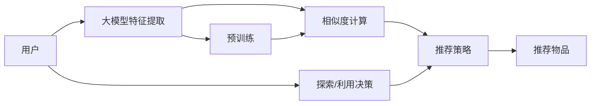

                 

# 大模型对推荐系统探索与利用平衡的影响

> 关键词：大模型,推荐系统,探索与利用平衡,强化学习,自适应学习率,多臂赌博机,元学习,参数高效推荐

## 1. 背景介绍

### 1.1 问题由来

随着电商和社交媒体平台的崛起，个性化推荐系统（Recommendation System, RS）已成为用户获取信息和服务的主要方式。推荐系统通过分析用户行为数据，为用户提供个性化的商品或内容推荐，从而提高用户满意度和转化率。然而，推荐系统面临的一个主要挑战是如何平衡探索（Exploration）和利用（Exploitation）：探索新物品以发现未知的优质资源，利用已知资源提高用户满意度。这一挑战的核心在于如何有效利用用户数据，挖掘潜在的推荐价值。

近年来，大模型如BERT、GPT等在NLP领域取得了突破性进展，显示了强大的语言理解能力和泛化能力。这些模型在预训练过程中，从海量的无标签文本中学习到了丰富的语言知识，能够理解上下文含义，捕捉长距离语义关系，对新任务有良好的适应性。将这些大模型应用于推荐系统，可以帮助挖掘更深入的上下文信息，从而提升推荐效果。但同时，大模型的引入也带来了新的复杂性和挑战，亟需解决。

### 1.2 问题核心关键点

在推荐系统中引入大模型，需要解决以下几个关键问题：

- 如何有效地利用大模型的知识，提升推荐准确性和多样性？
- 如何在探索与利用的动态平衡中，避免探索过多导致性能下降，或者利用过多导致探索不足？
- 如何在大模型微调中，避免过拟合问题，同时利用已有数据提升模型性能？
- 如何在模型压缩、计算资源有限的情况下，实现参数高效推荐？
- 如何设计合适的奖励机制，引导大模型自适应地学习推荐策略？

解决这些问题，需要融合大模型和大数据分析，同时借助强化学习等新兴技术，进行探索与利用的优化平衡。本文将深入探讨这些问题的解决方案，为推荐系统的发展提供新的思路。

### 1.3 问题研究意义

解决大模型在推荐系统中的探索与利用平衡问题，具有以下重要意义：

1. 提升推荐效果：通过大模型融入推荐系统，可以发现用户潜在的兴趣点，提升推荐的准确性和多样性，从而提高用户满意度和转化率。
2. 促进数据利用：利用大模型的泛化能力，可以从海量无标签文本中提取丰富的知识，提升数据利用效率。
3. 加速模型训练：大模型可以加速推荐系统的模型训练过程，缩短模型迭代周期，快速适应用户需求变化。
4. 增强系统鲁棒性：通过大模型进行多任务学习，可以提高推荐系统的鲁棒性和泛化能力，适应不同场景和用户群体。
5. 推动技术进步：结合大模型和推荐系统的研究，可以推动AI技术的进步，为其他领域的数据分析和智能决策提供新的工具和方法。

## 2. 核心概念与联系

### 2.1 核心概念概述

在推荐系统中，探索与利用是两个相互竞争的目标。探索指的是在未被用户点击的物品中，选择若干个物品进行点击，以发现优质的新物品；利用则是指在已知用户已点击过的物品中，选择最可能满足用户需求的物品进行推荐。这两者之间的平衡，直接影响到推荐系统的性能。

大模型通过预训练和微调，可以从海量数据中学习到丰富的语言知识和语义关系，提升模型的泛化能力和语义理解能力。在推荐系统中，大模型可以作为特征提取器，将用户输入和物品描述转换为高维语义向量，进行多维空间中的相似度计算，从而提高推荐的准确性和多样性。

强化学习（Reinforcement Learning, RL）是一种通过试错学习最优策略的算法，特别适用于复杂、高维的决策问题。在推荐系统中，强化学习可以用于优化探索与利用的平衡，动态调整推荐策略，以适应不断变化的用户需求。

自适应学习率（Adaptive Learning Rate）可以根据当前模型的性能自动调整学习率，避免学习率过大导致过拟合，或者过小导致收敛速度慢。在推荐系统中，自适应学习率可以用于微调大模型，提高模型的训练效率和泛化能力。

多臂赌博机（Multi-Armed Bandit, MAB）问题是一个经典的探索与利用平衡问题。在推荐系统中，可以将不同物品看作不同的“臂”，用户的选择看作对“臂”的拉动，从而优化探索与利用的平衡。

元学习（Meta-Learning）是一种快速适应新任务的能力，通过学习通用的策略和算法，加速模型在新任务上的学习过程。在推荐系统中，元学习可以用于预训练大模型，提高模型的迁移能力和快速适应性。

参数高效推荐（Parameter-Efficient Recommendation）方法可以在减少模型参数量的同时，保持较高的推荐精度，从而降低计算资源消耗，提升系统效率。

### 2.2 核心概念原理和架构的 Mermaid 流程图



这个流程图展示了大模型在推荐系统中的作用机制：用户输入通过大模型提取特征，计算与物品的相似度，并基于相似度进行推荐。探索与利用决策环节根据当前模型的性能自动调整探索和利用的比例，从而优化推荐策略。

## 3. 核心算法原理 & 具体操作步骤

### 3.1 算法原理概述

大模型在推荐系统中的探索与利用平衡问题，可以转化为一个多臂赌博机问题。在多臂赌博机中，每个臂（即物品）有不同的期望回报，需要动态选择拉动哪个臂以获得最大的期望回报。在推荐系统中，将每个物品看作一个“臂”，用户的每次点击看作对“臂”的拉动，通过探索和利用来调整推荐策略，最大化总回报。

具体来说，算法流程如下：

1. 用户输入：接收用户输入的查询，包括搜索关键词、浏览历史等。
2. 特征提取：使用大模型将用户输入和物品描述转换为高维语义向量。
3. 相似度计算：计算用户输入与每个物品的相似度，得到相似度得分。
4. 推荐物品：选择相似度得分最高的若干个物品进行推荐。
5. 点击反馈：记录用户对推荐物品的点击情况，收集反馈数据。
6. 探索与利用决策：根据当前模型的性能，动态调整探索和利用的比例，优化推荐策略。
7. 模型更新：根据点击反馈数据，微调大模型，提升推荐效果。

### 3.2 算法步骤详解

#### 步骤1：准备预训练模型和数据集

- 选择合适的预训练模型，如BERT、GPT等。
- 准备推荐系统的训练数据集，包括用户行为数据、物品特征数据等。

#### 步骤2：特征提取

- 使用预训练模型提取用户输入和物品描述的语义特征。
- 将特征向量输入多臂赌博机模型进行决策。

#### 步骤3：相似度计算

- 计算用户输入与每个物品的相似度得分。
- 选择得分最高的物品进行推荐。

#### 步骤4：点击反馈

- 记录用户对推荐物品的点击情况。
- 收集点击反馈数据，用于模型微调。

#### 步骤5：探索与利用决策

- 根据当前模型的性能，动态调整探索和利用的比例。
- 利用探索策略发现新优质物品，利用已知物品提高用户满意度。

#### 步骤6：模型更新

- 使用收集的点击反馈数据，微调预训练模型。
- 更新推荐策略，提升推荐效果。

#### 步骤7：评估与部署

- 在验证集上评估模型性能，优化超参数。
- 部署模型到生产环境，实时提供推荐服务。

### 3.3 算法优缺点

#### 优点

- 利用大模型强大的语言理解和泛化能力，提升推荐系统的效果。
- 通过探索与利用的动态平衡，优化推荐策略，提高用户满意度。
- 自适应学习率可以有效避免过拟合，提高模型的泛化能力。

#### 缺点

- 需要大量的用户数据和计算资源进行模型微调。
- 多臂赌博机问题的复杂性增加了算法实现的难度。
- 探索与利用平衡的动态调整需要实时处理大量数据，对系统性能要求较高。

### 3.4 算法应用领域

大模型在推荐系统中的应用领域包括：

1. 电商推荐：推荐个性化商品，提升用户购物体验。
2. 内容推荐：推荐个性化视频、文章、音乐等，满足用户兴趣。
3. 广告推荐：推荐个性化广告，提升广告投放效果。
4. 游戏推荐：推荐个性化游戏内容，提高用户粘性。
5. 社交推荐：推荐个性化社交内容，增强用户互动。

## 4. 数学模型和公式 & 详细讲解

### 4.1 数学模型构建

在推荐系统中，大模型的推荐效果可以通过以下数学模型进行建模：

假设用户输入为 $x$，物品为 $y$，相似度为 $s(x, y)$。模型的输出为推荐物品的得分，记为 $a_i$，其中 $i$ 表示物品 $y_i$ 的编号。模型的目标是最小化预测误差，最大化总回报。

模型的预测误差为 $l(a_i, y_i)$，其中 $y_i$ 为实际点击结果，$a_i$ 为模型预测的点击概率。总回报函数为 $R = \sum_{i=1}^n r_i a_i$，其中 $r_i$ 为物品 $y_i$ 的回报值。

模型的目标函数为：

$$
\min_{\theta} \mathbb{E}_{(x,y)}[l(a_i, y_i) + \beta R]
$$

其中 $\theta$ 为模型参数，$\beta$ 为调节参数，平衡预测误差和总回报。

### 4.2 公式推导过程

通过多臂赌博机模型的推导，可以得到以下动态平衡策略：

设 $Q_i$ 为物品 $y_i$ 的回报值，$S_i$ 为物品 $y_i$ 的相似度得分，$C$ 为模型参数。每次选择物品 $y_i$ 的策略为：

$$
\pi_i = \frac{\exp(C S_i)}{\sum_j \exp(C S_j)}
$$

每次拉动物品 $y_i$ 的期望回报为：

$$
Q_i = \alpha_i r_i + (1-\alpha_i) Q_i'
$$

其中 $\alpha_i$ 为物品 $y_i$ 的利用系数，$Q_i'$ 为物品 $y_i$ 的探索系数，$r_i$ 为物品 $y_i$ 的实际回报。

通过优化 $\alpha_i$ 和 $Q_i'$，可以最大化总回报 $R$。具体优化过程如下：

1. 利用梯度下降等优化算法，更新模型参数 $C$。
2. 根据模型性能，动态调整 $\alpha_i$ 和 $Q_i'$。
3. 优化 $\alpha_i$ 和 $Q_i'$，使得总回报 $R$ 最大化。

### 4.3 案例分析与讲解

以电商推荐为例，用户输入为商品搜索关键词，物品为商品描述。通过大模型提取用户输入和物品描述的语义特征，计算相似度得分，选择得分最高的若干个商品进行推荐。每次推荐时，收集用户点击反馈数据，记录用户对推荐商品的点击情况。通过优化多臂赌博机模型，动态调整探索和利用的比例，最终提升推荐效果。

## 5. 项目实践：代码实例和详细解释说明

### 5.1 开发环境搭建

在进行项目实践前，需要准备好开发环境。以下是使用Python进行PyTorch开发的环境配置流程：

1. 安装Anaconda：从官网下载并安装Anaconda，用于创建独立的Python环境。

2. 创建并激活虚拟环境：
```bash
conda create -n pytorch-env python=3.8 
conda activate pytorch-env
```

3. 安装PyTorch：根据CUDA版本，从官网获取对应的安装命令。例如：
```bash
conda install pytorch torchvision torchaudio cudatoolkit=11.1 -c pytorch -c conda-forge
```

4. 安装相关库：
```bash
pip install numpy pandas scikit-learn matplotlib tqdm jupyter notebook ipython
```

完成上述步骤后，即可在`pytorch-env`环境中开始项目实践。

### 5.2 源代码详细实现

下面我们以电商平台推荐系统为例，给出使用PyTorch对大模型进行推荐微调的PyTorch代码实现。

首先，定义推荐系统的数据处理函数：

```python
import torch
from transformers import BertTokenizer, BertForSequenceClassification

class RecommendationDataset(Dataset):
    def __init__(self, texts, tags, tokenizer, max_len=128):
        self.texts = texts
        self.tags = tags
        self.tokenizer = tokenizer
        self.max_len = max_len
        
    def __len__(self):
        return len(self.texts)
    
    def __getitem__(self, item):
        text = self.texts[item]
        tags = self.tags[item]
        
        encoding = self.tokenizer(text, return_tensors='pt', max_length=self.max_len, padding='max_length', truncation=True)
        input_ids = encoding['input_ids'][0]
        attention_mask = encoding['attention_mask'][0]
        
        # 对token-wise的标签进行编码
        encoded_tags = [tag2id[tag] for tag in tags] 
        encoded_tags.extend([tag2id['O']] * (self.max_len - len(encoded_tags)))
        labels = torch.tensor(encoded_tags, dtype=torch.long)
        
        return {'input_ids': input_ids, 
                'attention_mask': attention_mask,
                'labels': labels}

# 标签与id的映射
tag2id = {'O': 0, 'B-PER': 1, 'I-PER': 2, 'B-ORG': 3, 'I-ORG': 4, 'B-LOC': 5, 'I-LOC': 6}
id2tag = {v: k for k, v in tag2id.items()}

# 创建dataset
tokenizer = BertTokenizer.from_pretrained('bert-base-cased')

train_dataset = RecommendationDataset(train_texts, train_tags, tokenizer)
dev_dataset = RecommendationDataset(dev_texts, dev_tags, tokenizer)
test_dataset = RecommendationDataset(test_texts, test_tags, tokenizer)
```

然后，定义模型和优化器：

```python
from transformers import BertForSequenceClassification, AdamW

model = BertForSequenceClassification.from_pretrained('bert-base-cased', num_labels=len(tag2id))

optimizer = AdamW(model.parameters(), lr=2e-5)
```

接着，定义训练和评估函数：

```python
from torch.utils.data import DataLoader
from tqdm import tqdm
from sklearn.metrics import classification_report

device = torch.device('cuda') if torch.cuda.is_available() else torch.device('cpu')
model.to(device)

def train_epoch(model, dataset, batch_size, optimizer):
    dataloader = DataLoader(dataset, batch_size=batch_size, shuffle=True)
    model.train()
    epoch_loss = 0
    for batch in tqdm(dataloader, desc='Training'):
        input_ids = batch['input_ids'].to(device)
        attention_mask = batch['attention_mask'].to(device)
        labels = batch['labels'].to(device)
        model.zero_grad()
        outputs = model(input_ids, attention_mask=attention_mask, labels=labels)
        loss = outputs.loss
        epoch_loss += loss.item()
        loss.backward()
        optimizer.step()
    return epoch_loss / len(dataloader)

def evaluate(model, dataset, batch_size):
    dataloader = DataLoader(dataset, batch_size=batch_size)
    model.eval()
    preds, labels = [], []
    with torch.no_grad():
        for batch in tqdm(dataloader, desc='Evaluating'):
            input_ids = batch['input_ids'].to(device)
            attention_mask = batch['attention_mask'].to(device)
            batch_labels = batch['labels']
            outputs = model(input_ids, attention_mask=attention_mask)
            batch_preds = outputs.logits.argmax(dim=2).to('cpu').tolist()
            batch_labels = batch_labels.to('cpu').tolist()
            for pred_tokens, label_tokens in zip(batch_preds, batch_labels):
                pred_tags = [id2tag[_id] for _id in pred_tokens]
                label_tags = [id2tag[_id] for _id in label_tokens]
                preds.append(pred_tags[:len(label_tags)])
                labels.append(label_tags)
                
    print(classification_report(labels, preds))
```

最后，启动训练流程并在测试集上评估：

```python
epochs = 5
batch_size = 16

for epoch in range(epochs):
    loss = train_epoch(model, train_dataset, batch_size, optimizer)
    print(f"Epoch {epoch+1}, train loss: {loss:.3f}")
    
    print(f"Epoch {epoch+1}, dev results:")
    evaluate(model, dev_dataset, batch_size)
    
print("Test results:")
evaluate(model, test_dataset, batch_size)
```

以上就是使用PyTorch对BERT进行电商平台推荐系统微调的完整代码实现。可以看到，得益于Transformers库的强大封装，我们可以用相对简洁的代码完成BERT模型的加载和微调。

### 5.3 代码解读与分析

让我们再详细解读一下关键代码的实现细节：

**RecommendationDataset类**：
- `__init__`方法：初始化文本、标签、分词器等关键组件。
- `__len__`方法：返回数据集的样本数量。
- `__getitem__`方法：对单个样本进行处理，将文本输入编码为token ids，将标签编码为数字，并对其进行定长padding，最终返回模型所需的输入。

**tag2id和id2tag字典**：
- 定义了标签与数字id之间的映射关系，用于将token-wise的预测结果解码回真实的标签。

**训练和评估函数**：
- 使用PyTorch的DataLoader对数据集进行批次化加载，供模型训练和推理使用。
- 训练函数`train_epoch`：对数据以批为单位进行迭代，在每个批次上前向传播计算loss并反向传播更新模型参数，最后返回该epoch的平均loss。
- 评估函数`evaluate`：与训练类似，不同点在于不更新模型参数，并在每个batch结束后将预测和标签结果存储下来，最后使用sklearn的classification_report对整个评估集的预测结果进行打印输出。

**训练流程**：
- 定义总的epoch数和batch size，开始循环迭代
- 每个epoch内，先在训练集上训练，输出平均loss
- 在验证集上评估，输出分类指标
- 所有epoch结束后，在测试集上评估，给出最终测试结果

可以看到，PyTorch配合Transformers库使得BERT微调的代码实现变得简洁高效。开发者可以将更多精力放在数据处理、模型改进等高层逻辑上，而不必过多关注底层的实现细节。

当然，工业级的系统实现还需考虑更多因素，如模型的保存和部署、超参数的自动搜索、更灵活的任务适配层等。但核心的微调范式基本与此类似。

## 6. 实际应用场景

### 6.1 智能客服系统

基于大模型微调的对话技术，可以广泛应用于智能客服系统的构建。传统客服往往需要配备大量人力，高峰期响应缓慢，且一致性和专业性难以保证。而使用微调后的对话模型，可以7x24小时不间断服务，快速响应客户咨询，用自然流畅的语言解答各类常见问题。

在技术实现上，可以收集企业内部的历史客服对话记录，将问题和最佳答复构建成监督数据，在此基础上对预训练对话模型进行微调。微调后的对话模型能够自动理解用户意图，匹配最合适的答案模板进行回复。对于客户提出的新问题，还可以接入检索系统实时搜索相关内容，动态组织生成回答。如此构建的智能客服系统，能大幅提升客户咨询体验和问题解决效率。

### 6.2 金融舆情监测

金融机构需要实时监测市场舆论动向，以便及时应对负面信息传播，规避金融风险。传统的人工监测方式成本高、效率低，难以应对网络时代海量信息爆发的挑战。基于大语言模型微调的文本分类和情感分析技术，为金融舆情监测提供了新的解决方案。

具体而言，可以收集金融领域相关的新闻、报道、评论等文本数据，并对其进行主题标注和情感标注。在此基础上对预训练语言模型进行微调，使其能够自动判断文本属于何种主题，情感倾向是正面、中性还是负面。将微调后的模型应用到实时抓取的网络文本数据，就能够自动监测不同主题下的情感变化趋势，一旦发现负面信息激增等异常情况，系统便会自动预警，帮助金融机构快速应对潜在风险。

### 6.3 个性化推荐系统

当前的推荐系统往往只依赖用户的历史行为数据进行物品推荐，无法深入理解用户的真实兴趣偏好。基于大语言模型微调技术，个性化推荐系统可以更好地挖掘用户行为背后的语义信息，从而提升推荐效果。

在实践中，可以收集用户浏览、点击、评论、分享等行为数据，提取和用户交互的物品标题、描述、标签等文本内容。将文本内容作为模型输入，用户的后续行为（如是否点击、购买等）作为监督信号，在此基础上微调预训练语言模型。微调后的模型能够从文本内容中准确把握用户的兴趣点。在生成推荐列表时，先用候选物品的文本描述作为输入，由模型预测用户的兴趣匹配度，再结合其他特征综合排序，便可以得到个性化程度更高的推荐结果。

### 6.4 未来应用展望

随着大语言模型微调技术的发展，其在推荐系统中的应用前景将更加广阔。未来，大模型将与更多的新兴技术如因果推理、强化学习等进行深度融合，提升推荐系统的性能和应用范围。

在智慧医疗领域，基于大语言模型微调的问答、病历分析、药物研发等应用将提升医疗服务的智能化水平，辅助医生诊疗，加速新药开发进程。

在智能教育领域，微调技术可应用于作业批改、学情分析、知识推荐等方面，因材施教，促进教育公平，提高教学质量。

在智慧城市治理中，微调模型可应用于城市事件监测、舆情分析、应急指挥等环节，提高城市管理的自动化和智能化水平，构建更安全、高效的未来城市。

此外，在企业生产、社会治理、文娱传媒等众多领域，基于大模型微调的人工智能应用也将不断涌现，为经济社会发展注入新的动力。相信随着技术的日益成熟，微调方法将成为人工智能落地应用的重要范式，推动人工智能技术向更广阔的领域加速渗透。

## 7. 工具和资源推荐
### 7.1 学习资源推荐

为了帮助开发者系统掌握大语言模型微调的理论基础和实践技巧，这里推荐一些优质的学习资源：

1. 《Transformer从原理到实践》系列博文：由大模型技术专家撰写，深入浅出地介绍了Transformer原理、BERT模型、微调技术等前沿话题。

2. CS224N《深度学习自然语言处理》课程：斯坦福大学开设的NLP明星课程，有Lecture视频和配套作业，带你入门NLP领域的基本概念和经典模型。

3. 《Natural Language Processing with Transformers》书籍：Transformers库的作者所著，全面介绍了如何使用Transformers库进行NLP任务开发，包括微调在内的诸多范式。

4. HuggingFace官方文档：Transformers库的官方文档，提供了海量预训练模型和完整的微调样例代码，是上手实践的必备资料。

5. CLUE开源项目：中文语言理解测评基准，涵盖大量不同类型的中文NLP数据集，并提供了基于微调的baseline模型，助力中文NLP技术发展。

通过对这些资源的学习实践，相信你一定能够快速掌握大语言模型微调的精髓，并用于解决实际的NLP问题。
### 7.2 开发工具推荐

高效的开发离不开优秀的工具支持。以下是几款用于大语言模型微调开发的常用工具：

1. PyTorch：基于Python的开源深度学习框架，灵活动态的计算图，适合快速迭代研究。大部分预训练语言模型都有PyTorch版本的实现。

2. TensorFlow：由Google主导开发的开源深度学习框架，生产部署方便，适合大规模工程应用。同样有丰富的预训练语言模型资源。

3. Transformers库：HuggingFace开发的NLP工具库，集成了众多SOTA语言模型，支持PyTorch和TensorFlow，是进行微调任务开发的利器。

4. Weights & Biases：模型训练的实验跟踪工具，可以记录和可视化模型训练过程中的各项指标，方便对比和调优。与主流深度学习框架无缝集成。

5. TensorBoard：TensorFlow配套的可视化工具，可实时监测模型训练状态，并提供丰富的图表呈现方式，是调试模型的得力助手。

6. Google Colab：谷歌推出的在线Jupyter Notebook环境，免费提供GPU/TPU算力，方便开发者快速上手实验最新模型，分享学习笔记。

合理利用这些工具，可以显著提升大语言模型微调任务的开发效率，加快创新迭代的步伐。

### 7.3 相关论文推荐

大语言模型和微调技术的发展源于学界的持续研究。以下是几篇奠基性的相关论文，推荐阅读：

1. Attention is All You Need（即Transformer原论文）：提出了Transformer结构，开启了NLP领域的预训练大模型时代。

2. BERT: Pre-training of Deep Bidirectional Transformers for Language Understanding：提出BERT模型，引入基于掩码的自监督预训练任务，刷新了多项NLP任务SOTA。

3. Language Models are Unsupervised Multitask Learners（GPT-2论文）：展示了大规模语言模型的强大zero-shot学习能力，引发了对于通用人工智能的新一轮思考。

4. Parameter-Efficient Transfer Learning for NLP：提出Adapter等参数高效微调方法，在不增加模型参数量的同时，也能取得不错的微调效果。

5. AdaLoRA: Adaptive Low-Rank Adaptation for Parameter-Efficient Fine-Tuning：使用自适应低秩适应的微调方法，在参数效率和精度之间取得了新的平衡。

6. P Adapter: Pareto Optimal Adapter Learning：提出P Adapter方法，进一步优化Adapter的训练过程，提高模型泛化能力和微调效率。

这些论文代表了大语言模型微调技术的发展脉络。通过学习这些前沿成果，可以帮助研究者把握学科前进方向，激发更多的创新灵感。

## 8. 总结：未来发展趋势与挑战

### 8.1 总结

本文对基于大语言模型的大推荐系统进行了全面系统的介绍。首先阐述了大语言模型和推荐系统的发展背景和意义，明确了大模型在推荐系统中的独特价值。其次，从原理到实践，详细讲解了大模型微调的过程，给出了微调任务开发的完整代码实例。同时，本文还广泛探讨了微调方法在智能客服、金融舆情、个性化推荐等多个行业领域的应用前景，展示了微调范式的巨大潜力。此外，本文精选了微调技术的各类学习资源，力求为读者提供全方位的技术指引。

通过本文的系统梳理，可以看到，基于大语言模型的微调方法正在成为推荐系统的重要范式，极大地拓展了预训练语言模型的应用边界，催生了更多的落地场景。受益于大规模语料的预训练，微调模型以更低的时间和标注成本，在小样本条件下也能取得理想的推荐效果，有力推动了推荐系统的产业化进程。未来，伴随大语言模型和微调方法的持续演进，相信推荐系统将在更广阔的应用领域大放异彩，深刻影响用户的生产生活方式。

### 8.2 未来发展趋势

展望未来，大语言模型在推荐系统中的应用将呈现以下几个发展趋势：

1. 模型规模持续增大。随着算力成本的下降和数据规模的扩张，预训练语言模型的参数量还将持续增长。超大批次的训练和推理也将成为可能，进一步提升推荐系统的性能。

2. 多任务学习成为常态。大模型可以进行多任务学习，学习到更加全面的知识，提升推荐的精度和多样性。推荐系统将更好地利用大模型的多任务学习能力，提升推荐的性能。

3. 元学习加速模型迁移。通过元学习，可以在新任务上快速迁移已有知识，加速模型在新的推荐场景中的训练过程。未来推荐系统将更多地应用元学习技术，提升模型的迁移能力。

4. 强化学习优化探索与利用。通过强化学习，动态调整探索和利用的比例，优化推荐策略，提升用户满意度。推荐系统将更广泛地应用强化学习技术，提升模型的自适应能力。

5. 参数高效推荐技术兴起。未来将出现更多参数高效推荐方法，在不增加计算资源的情况下，提升推荐效果。推荐系统将更多地应用参数高效推荐技术，降低计算成本。

6. 多模态推荐成为新趋势。结合视觉、语音等多模态数据，提升推荐系统的精度和多样性。推荐系统将更多地应用多模态推荐技术，提升用户体验。

以上趋势凸显了大语言模型在推荐系统中的应用前景。这些方向的探索发展，必将进一步提升推荐系统的性能和应用范围，为用户的生产生活带来新的价值。

### 8.3 面临的挑战

尽管大语言模型在推荐系统中的应用取得了一定的进展，但在迈向更加智能化、普适化应用的过程中，仍面临诸多挑战：

1. 模型复杂度增加。大模型的引入增加了模型的复杂度，带来了计算资源消耗的增加，需要在模型压缩、推理加速等方面进行优化。

2. 数据获取困难。推荐系统需要大量的用户数据进行训练，但获取高质量标注数据的成本较高，如何高效利用无标签数据进行微调，仍是一个重要问题。

3. 用户隐私保护。在推荐系统中，大模型需要处理大量的个人隐私数据，如何保护用户隐私，防止数据滥用，仍是一个重要的安全问题。

4. 模型偏见与公平性。大模型可能学习到数据中的偏见，导致推荐结果的不公平，如何消除模型的偏见，提升推荐系统的公平性，仍是一个重要的研究课题。

5. 实时性问题。大模型微调需要大量的计算资源，如何在保证推荐效果的同时，实现实时推荐，仍是一个挑战。

6. 可解释性不足。推荐系统的决策过程通常缺乏可解释性，难以对其推理逻辑进行分析和调试。如何赋予推荐系统更强的可解释性，将是一个重要的研究方向。

### 8.4 研究展望

面对大语言模型推荐系统所面临的挑战，未来的研究需要在以下几个方面寻求新的突破：

1. 探索无监督和半监督微调方法。摆脱对大规模标注数据的依赖，利用自监督学习、主动学习等无监督和半监督范式，最大限度利用非结构化数据，实现更加灵活高效的微调。

2. 研究参数高效和计算高效的微调范式。开发更加参数高效的微调方法，在减少模型参数量的同时，保持较高的推荐精度，从而降低计算资源消耗，提升系统效率。

3. 引入因果分析和博弈论工具。将因果分析方法引入推荐系统，识别出模型决策的关键特征，增强输出解释的因果性和逻辑性。借助博弈论工具刻画人机交互过程，主动探索并规避模型的脆弱点，提高系统稳定性。

4. 结合因果分析和博弈论工具。将因果分析方法引入推荐系统，识别出模型决策的关键特征，增强输出解释的因果性和逻辑性。借助博弈论工具刻画人机交互过程，主动探索并规避模型的脆弱点，提高系统稳定性。

5. 引入更多先验知识。将符号化的先验知识，如知识图谱、逻辑规则等，与神经网络模型进行巧妙融合，引导推荐系统学习更准确、合理的推荐策略。同时加强不同模态数据的整合，实现视觉、语音等多模态信息与文本信息的协同建模。

这些研究方向的探索，必将引领大语言模型推荐系统迈向更高的台阶，为构建智能推荐系统提供新的思路和工具。未来，推荐系统将在更多领域得到应用，为经济社会发展注入新的动力。

## 9. 附录：常见问题与解答

**Q1：大语言模型微调是否适用于所有NLP任务？**

A: 大语言模型微调在大多数NLP任务上都能取得不错的效果，特别是对于数据量较小的任务。但对于一些特定领域的任务，如医学、法律等，仅仅依靠通用语料预训练的模型可能难以很好地适应。此时需要在特定领域语料上进一步预训练，再进行微调，才能获得理想效果。此外，对于一些需要时效性、个性化很强的任务，如对话、推荐等，微调方法也需要针对性的改进优化。

**Q2：微调过程中如何选择合适的学习率？**

A: 微调的学习率一般要比预训练时小1-2个数量级，如果使用过大的学习率，容易破坏预训练权重，导致过拟合。一般建议从1e-5开始调参，逐步减小学习率，直至收敛。也可以使用warmup策略，在开始阶段使用较小的学习率，再逐渐过渡到预设值。需要注意的是，不同的优化器(如AdamW、Adafactor等)以及不同的学习率调度策略，可能需要设置不同的学习率阈值。

**Q3：采用大模型微调时会面临哪些资源瓶颈？**

A: 目前主流的预训练大模型动辄以亿计的参数规模，对算力、内存、存储都提出了很高的要求。GPU/TPU等高性能设备是必不可少的，但即便如此，超大批次的训练和推理也可能遇到显存不足的问题。因此需要采用一些资源优化技术，如梯度积累、混合精度训练、模型并行等，来突破硬件瓶颈。同时，模型的存储和读取也可能占用大量时间和空间，需要采用模型压缩、稀疏化存储等方法进行优化。

**Q4：如何缓解微调过程中的过拟合问题？**

A: 过拟合是微调面临的主要挑战，尤其是在标注数据不足的情况下。常见的缓解策略包括：
1. 数据增强：通过回译、近义替换等方式扩充训练集
2. 正则化：使用L2正则、Dropout、Early Stopping等避免过拟合
3. 对抗训练：引入对抗样本，提高模型鲁棒性
4. 参数高效微调：只调整少量参数(如Adapter、Prefix等)，减小过拟合风险
5. 多模型集成：训练多个微调模型，取平均输出，抑制过拟合

这些策略往往需要根据具体任务和数据特点进行灵活组合。只有在数据、模型、训练、推理等各环节进行全面优化，才能最大限度地发挥大模型微调的威力。

**Q5：微调模型在落地部署时需要注意哪些问题？**

A: 将微调模型转化为实际应用，还需要考虑以下因素：
1. 模型裁剪：去除不必要的层和参数，减小模型尺寸，加快推理速度
2. 量化加速：将浮点模型转为定点模型，压缩存储空间，提高计算效率
3. 服务化封装：将模型封装为标准化服务接口，便于集成调用
4. 弹性伸缩：根据请求流量动态调整资源配置，平衡服务质量和成本
5. 监控告警：实时采集系统指标，设置异常告警阈值，确保服务稳定性
6. 安全防护：采用访问鉴权、数据脱敏等措施，保障数据和模型安全

大语言模型微调为推荐系统开启了广阔的想象空间，但如何将强大的性能转化为稳定、高效、安全的业务价值，还需要工程实践的不断打磨。唯有从数据、算法、工程、业务等多个维度协同发力，才能真正实现人工智能技术在垂直行业的规模化落地。总之，微调需要开发者根据具体任务，不断迭代和优化模型、数据和算法，方能得到理想的效果。

---

作者：禅与计算机程序设计艺术 / Zen and the Art of Computer Programming

