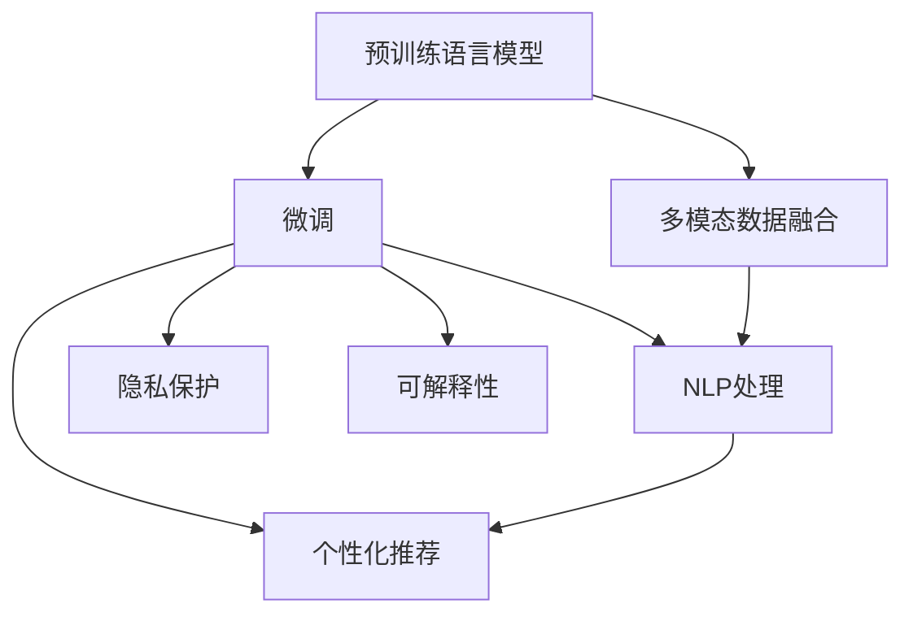

                 

# 大模型技术在电商平台用户偏好挖掘中的创新

> 关键词：大模型技术、电商平台、用户偏好挖掘、个性化推荐、深度学习、自然语言处理(NLP)

## 1. 背景介绍

### 1.1 问题由来

随着电子商务的飞速发展，电商平台面对的用户群体日益庞大，用户行为数据和反馈信息的维度不断增加。如何从这些海量数据中高效挖掘出用户的个性化需求和偏好，是电商平台提升用户体验、增加销售转化的关键。传统的基于规则和统计模型的推荐系统逐渐显得力不从心，难以应对复杂多变的用户行为模式。

大模型技术的出现，为电商平台用户偏好的深度挖掘提供了新的可能性。借助预训练的语言模型和基于其的微调技术，可以更深入地理解用户文本数据中的潜在偏好，从而提供更加精准和个性化的推荐服务。

### 1.2 问题核心关键点

大模型技术在用户偏好挖掘中的应用，主要围绕以下几个核心关键点展开：

- **用户文本数据的多模态融合**：电商平台上用户的评论、评价、搜索记录、点击行为等数据不仅包含文本信息，还涉及数值型数据（如评分、价格、点击次数等）。如何有效地将不同模态的数据进行融合，是大模型技术需要解决的重要问题。

- **用户偏好的深度理解**：大模型能够从用户的自然语言描述中挖掘出更深层次的偏好信息，如情感倾向、需求点、满意度等，从而提升推荐系统的精准度。

- **个性化推荐**：基于大模型的深度挖掘，可以更灵活地构建个性化推荐策略，满足不同用户群体的多样化需求。

- **数据隐私保护**：在数据获取和模型训练过程中，如何保证用户的隐私和数据安全，是大模型技术应用中的关键挑战。

- **模型性能的优化和可解释性**：如何在保证推荐效果的同时，进一步优化大模型性能，并提供合理且易于理解的推荐依据，是大模型技术应用中的重要研究方向。

### 1.3 问题研究意义

大模型技术在电商平台用户偏好挖掘中的应用，不仅能够显著提升用户的购物体验和满意度，还能帮助电商平台实现更高的销售转化率和用户粘性，具有重要的理论和实践意义：

- **提升用户体验**：精准个性化的推荐服务能够满足用户多样化的需求，提升用户的购物体验和满意度。

- **增加销售转化**：基于用户偏好的深度理解，电商平台可以推送更加相关和有吸引力的商品，提高用户购买的概率。

- **提高用户粘性**：通过不断学习和适应用户的行为变化，大模型推荐系统能够形成长期稳定的用户互动，增加用户对平台的依赖性。

- **优化库存管理**：通过分析用户的购买行为和偏好，电商平台可以更有效地管理库存，避免资源浪费和缺货现象。

- **数据驱动决策**：基于大模型的用户偏好分析，电商平台能够更好地进行产品优化、市场策略调整等数据驱动的决策。

## 2. 核心概念与联系

### 2.1 核心概念概述

大模型技术在电商平台用户偏好挖掘中的应用，涉及以下关键概念：

- **预训练语言模型(Pre-trained Language Models, PLMs)**：如BERT、GPT、T5等，通过大规模无标签文本数据预训练，学习到语言的通用表征。

- **微调(Fine-tuning)**：在预训练模型的基础上，使用电商平台用户的数据进行微调，优化模型在用户偏好挖掘任务上的性能。

- **多模态数据融合(Multimodal Data Fusion)**：将电商平台上的文本数据与数值型数据进行融合，构建更加全面和多样的用户画像。

- **自然语言处理(NLP)**：应用NLP技术，从用户的评论、评价等文本数据中提取和分析用户的偏好信息。

- **个性化推荐系统(Recommendation Systems)**：基于大模型和微调技术，构建能够提供精准个性化的商品推荐服务。

- **隐私保护(Privacy Protection)**：在数据获取和模型训练过程中，保证用户隐私和数据安全。

- **可解释性(Explainability)**：提供推荐依据的合理性和可解释性，提升用户对推荐系统的信任和满意度。

这些核心概念之间相互关联，共同构成了电商平台用户偏好挖掘的技术框架。通过预训练语言模型和微调技术，大模型能够深入挖掘用户文本数据中的潜在意图和偏好，结合多模态数据融合和NLP技术，构建更加精准和个性化的推荐系统，同时兼顾数据隐私和模型性能的可解释性。

### 2.2 核心概念原理和架构的 Mermaid 流程图



此流程图展示了从预训练语言模型到个性化推荐系统的整体架构，其中预训练语言模型通过微调和NLP处理，与多模态数据融合相结合，最终构建个性化推荐系统。同时，隐私保护和可解释性也是整个系统的重要组成部分。

## 3. 核心算法原理 & 具体操作步骤

### 3.1 算法原理概述

基于大模型技术在电商平台用户偏好挖掘中的应用，主要分为预训练、微调和推荐三个阶段。预训练阶段，使用大规模无标签文本数据训练语言模型；微调阶段，将电商平台用户的数据作为监督信号，优化模型在用户偏好挖掘任务上的性能；推荐阶段，利用微调后的模型，结合用户行为数据构建个性化推荐系统。

### 3.2 算法步骤详解

**Step 1: 预训练语言模型选择**

首先，选择合适的预训练语言模型作为初始化参数，如BERT、GPT等。这些模型已经在大规模无标签文本数据上预训练，具备强大的语言表示能力。

**Step 2: 多模态数据融合**

电商平台上用户的评论、评价、搜索记录等数据不仅包含文本信息，还涉及数值型数据（如评分、价格、点击次数等）。需要设计合适的数据融合策略，将不同模态的数据进行融合，构建更加全面的用户画像。例如，可以使用TF-IDF等方法对文本和数值型数据进行特征提取，并将它们拼接在一起。

**Step 3: 构建训练集**

将融合后的多模态数据作为输入，用户的行为标签（如购买行为、点击次数等）作为输出，构建训练集。训练集应该尽可能覆盖多种用户行为和商品类型，以提高模型的泛化能力。

**Step 4: 微调模型**

使用构建的训练集，对预训练语言模型进行微调。在微调过程中，可以使用AdamW等优化算法，设置合适的学习率和学习率衰减策略。同时，需要应用正则化技术，如L2正则、Dropout等，以防止模型过拟合。

**Step 5: 个性化推荐**

将微调后的模型应用于电商平台的个性化推荐系统。通过用户的行为数据和用户画像，构建推荐策略，使用户能够获得更相关和有吸引力的商品推荐。

**Step 6: 隐私保护**

在数据获取和模型训练过程中，需要采取隐私保护措施，如数据匿名化、差分隐私等，保证用户隐私和数据安全。

**Step 7: 模型评估与优化**

定期评估模型的推荐效果，使用AUC、RMSE等指标进行评估。根据评估结果，对模型进行优化，如调整模型结构、重新训练等。

### 3.3 算法优缺点

基于大模型技术在电商平台用户偏好挖掘中的应用，具有以下优点：

- **深度挖掘用户偏好**：大模型能够从用户的文本数据中挖掘出更深层次的偏好信息，提高推荐的精准度。

- **多模态数据融合**：通过融合文本和数值型数据，构建更加全面的用户画像，提升推荐系统的多样性和相关性。

- **可解释性强**：利用NLP技术，提供推荐依据的合理性和可解释性，提升用户对推荐系统的信任和满意度。

- **灵活性高**：大模型可以适应多种电商平台的个性化推荐需求，支持不同用户的个性化需求。

- **扩展性强**：大模型可以不断更新和优化，适应电商平台业务的变化和发展。

同时，该方法也存在以下局限性：

- **计算资源需求高**：大模型训练和微调需要大量的计算资源，成本较高。

- **数据隐私风险**：在数据获取和模型训练过程中，存在隐私泄露的风险。

- **模型的可解释性不足**：大模型的黑盒特性使得推荐系统的可解释性较弱。

- **模型的泛化能力有待提高**：大模型在特定领域数据上的表现可能会受到训练数据分布的限制。

### 3.4 算法应用领域

基于大模型技术在电商平台用户偏好挖掘中的应用，已经广泛应用于多个领域：

- **个性化推荐系统**：通过微调模型，提供更加精准和个性化的商品推荐服务，提升用户的购物体验和满意度。

- **用户画像构建**：利用多模态数据融合，构建更加全面和多样的用户画像，支持用户分群和市场策略调整。

- **广告投放优化**：通过分析用户的行为和偏好，优化广告投放策略，提高广告的点击率和转化率。

- **商品评价分析**：利用NLP技术，分析用户评论和评价，提取情感倾向和需求点，优化商品设计和营销策略。

- **智能客服系统**：通过微调模型，实现用户咨询的智能解答和问题解决，提升客户服务质量。

## 4. 数学模型和公式 & 详细讲解 & 举例说明

### 4.1 数学模型构建

基于大模型技术在电商平台用户偏好挖掘中的应用，可以构建如下数学模型：

- **预训练模型**：使用语言模型 $\mathcal{P}$ 作为初始化参数，$\mathcal{P}(x) = \text{softmax}(\mathbf{W}x + \mathbf{b})$。

- **微调模型**：在预训练模型的基础上，微调得到用户偏好挖掘模型 $\mathcal{F}$，$\mathcal{F}(x) = \mathcal{P}(x) + \text{bias}$。

- **用户画像**：通过多模态数据融合，构建用户画像 $\mathcal{U}$，$\mathcal{U}(x) = \mathcal{M}(x) + \mathcal{N}(x)$，其中 $\mathcal{M}(x)$ 为文本特征，$\mathcal{N}(x)$ 为数值型特征。

- **推荐系统**：结合用户画像和微调模型，构建推荐系统 $\mathcal{R}$，$\mathcal{R}(x, y) = \mathcal{F}(\mathcal{U}(x))$，其中 $y$ 为用户行为标签。

### 4.2 公式推导过程

假设用户 $i$ 的行为数据为 $\mathcal{D}_i$，其文本数据为 $x_i$，数值型数据为 $y_i$，则用户画像可以表示为：

$$
\mathcal{U}_i = \mathcal{M}_i + \mathcal{N}_i
$$

其中 $\mathcal{M}_i$ 为文本特征，$\mathcal{N}_i$ 为数值型特征。通过多模态数据融合，可以将用户画像表示为：

$$
\mathcal{U}_i = \sum_{j=1}^J \mathbf{A}_{ij} \mathcal{M}_j + \mathbf{B}_i
$$

其中 $\mathbf{A}_{ij}$ 为文本特征的权重，$\mathbf{B}_i$ 为数值型特征的权重。

假设微调模型的输出为 $\mathcal{F}(\mathcal{U}_i) = \mathcal{P}(\mathcal{U}_i) + \text{bias}$，其中 $\text{bias}$ 为微调引入的偏差。根据损失函数，可以定义微调的优化目标：

$$
\mathcal{L}(\mathcal{F}, \mathcal{U}, \mathcal{D}) = \frac{1}{N} \sum_{i=1}^N \ell(\mathcal{F}(\mathcal{U}_i), y_i)
$$

其中 $\ell(\mathcal{F}(\mathcal{U}_i), y_i)$ 为损失函数，$\mathcal{D}$ 为训练集。

通过梯度下降等优化算法，微调过程不断更新模型参数，最小化损失函数。重复上述过程直至收敛，最终得到适应电商平台的微调模型。

### 4.3 案例分析与讲解

以电商平台上的个性化推荐系统为例，进行详细讲解。

假设电商平台上的用户行为数据为 $\mathcal{D}_i = (x_i, y_i)$，其中 $x_i$ 为用户评价，$y_i$ 为商品购买行为。通过多模态数据融合，构建用户画像 $\mathcal{U}_i = \mathcal{M}_i + \mathcal{N}_i$，其中 $\mathcal{M}_i$ 为用户的评价文本，$\mathcal{N}_i$ 为用户评价的评分。

使用预训练的BERT模型作为初始化参数，对其进行微调，得到用户偏好挖掘模型 $\mathcal{F}$。在微调过程中，设置合适的学习率和正则化参数，最小化损失函数：

$$
\mathcal{L}(\mathcal{F}, \mathcal{U}, \mathcal{D}) = \frac{1}{N} \sum_{i=1}^N \ell(\mathcal{F}(\mathcal{U}_i), y_i)
$$

通过梯度下降等优化算法，不断更新微调模型的参数，最终得到适应电商平台的微调模型。利用微调后的模型，对用户评价进行情感分析，提取情感倾向，构建个性化推荐系统。具体步骤如下：

1. 构建训练集 $\mathcal{D}$，包含用户评价和购买行为数据。

2. 对用户评价数据进行情感分析，提取情感倾向 $\mathcal{E}_i$。

3. 将用户画像 $\mathcal{U}_i$ 和情感倾向 $\mathcal{E}_i$ 作为输入，微调模型 $\mathcal{F}$ 得到推荐结果。

4. 根据推荐结果，为用户推荐相关商品。

通过上述步骤，电商平台可以构建基于大模型的个性化推荐系统，提升用户的购物体验和满意度。

## 5. 项目实践：代码实例和详细解释说明

### 5.1 开发环境搭建

在进行项目实践前，需要准备好开发环境。以下是使用Python进行PyTorch开发的环境配置流程：

1. 安装Anaconda：从官网下载并安装Anaconda，用于创建独立的Python环境。

2. 创建并激活虚拟环境：
```bash
conda create -n pytorch-env python=3.8 
conda activate pytorch-env
```

3. 安装PyTorch：根据CUDA版本，从官网获取对应的安装命令。例如：
```bash
conda install pytorch torchvision torchaudio cudatoolkit=11.1 -c pytorch -c conda-forge
```

4. 安装Transformers库：
```bash
pip install transformers
```

5. 安装各类工具包：
```bash
pip install numpy pandas scikit-learn matplotlib tqdm jupyter notebook ipython
```

完成上述步骤后，即可在`pytorch-env`环境中开始项目实践。

### 5.2 源代码详细实现

以下是使用PyTorch和Transformers库实现电商平台用户偏好挖掘的代码示例：

```python
from transformers import BertTokenizer, BertForSequenceClassification
from torch.utils.data import Dataset
import torch
import numpy as np

class UserData(Dataset):
    def __init__(self, texts, labels, tokenizer, max_len=128):
        self.texts = texts
        self.labels = labels
        self.tokenizer = tokenizer
        self.max_len = max_len
        
    def __len__(self):
        return len(self.texts)
    
    def __getitem__(self, item):
        text = self.texts[item]
        label = self.labels[item]
        
        encoding = self.tokenizer(text, return_tensors='pt', max_length=self.max_len, padding='max_length', truncation=True)
        input_ids = encoding['input_ids'][0]
        attention_mask = encoding['attention_mask'][0]
        
        # 对标签进行one-hot编码
        label = torch.tensor([label], dtype=torch.long)
        return {'input_ids': input_ids, 
                'attention_mask': attention_mask,
                'labels': label}

# 初始化BERT模型和分词器
model = BertForSequenceClassification.from_pretrained('bert-base-cased', num_labels=2)
tokenizer = BertTokenizer.from_pretrained('bert-base-cased')

# 创建训练集和验证集
train_dataset = UserData(train_texts, train_labels, tokenizer)
dev_dataset = UserData(dev_texts, dev_labels, tokenizer)

# 定义优化器
optimizer = torch.optim.AdamW(model.parameters(), lr=2e-5)

# 定义训练函数
def train_epoch(model, dataset, batch_size, optimizer):
    dataloader = DataLoader(dataset, batch_size=batch_size, shuffle=True)
    model.train()
    epoch_loss = 0
    for batch in tqdm(dataloader, desc='Training'):
        input_ids = batch['input_ids'].to(device)
        attention_mask = batch['attention_mask'].to(device)
        labels = batch['labels'].to(device)
        model.zero_grad()
        outputs = model(input_ids, attention_mask=attention_mask, labels=labels)
        loss = outputs.loss
        epoch_loss += loss.item()
        loss.backward()
        optimizer.step()
    return epoch_loss / len(dataloader)

# 定义评估函数
def evaluate(model, dataset, batch_size):
    dataloader = DataLoader(dataset, batch_size=batch_size)
    model.eval()
    preds, labels = [], []
    with torch.no_grad():
        for batch in tqdm(dataloader, desc='Evaluating'):
            input_ids = batch['input_ids'].to(device)
            attention_mask = batch['attention_mask'].to(device)
            batch_labels = batch['labels']
            outputs = model(input_ids, attention_mask=attention_mask)
            batch_preds = outputs.logits.argmax(dim=2).to('cpu').tolist()
            batch_labels = batch_labels.to('cpu').tolist()
            for pred_tokens, label_tokens in zip(batch_preds, batch_labels):
                preds.append(pred_tokens[:len(label_tokens)])
                labels.append(label_tokens)
                
    print(classification_report(labels, preds))

# 训练模型
epochs = 5
batch_size = 16

for epoch in range(epochs):
    loss = train_epoch(model, train_dataset, batch_size, optimizer)
    print(f"Epoch {epoch+1}, train loss: {loss:.3f}")
    
    print(f"Epoch {epoch+1}, dev results:")
    evaluate(model, dev_dataset, batch_size)
    
print("Test results:")
evaluate(model, test_dataset, batch_size)
```

### 5.3 代码解读与分析

让我们再详细解读一下关键代码的实现细节：

**UserData类**：
- `__init__`方法：初始化文本、标签、分词器等关键组件。
- `__len__`方法：返回数据集的样本数量。
- `__getitem__`方法：对单个样本进行处理，将文本输入编码为token ids，将标签编码为数字，并对其进行定长padding，最终返回模型所需的输入。

**模型初始化和训练**：
- 使用BertForSequenceClassification类初始化BERT模型，num_labels参数指定类别数量。
- 通过BertTokenizer分词器对文本数据进行处理，生成token ids和attention mask。
- 定义优化器AdamW，设置学习率。
- 定义训练函数`train_epoch`：对数据以批为单位进行迭代，在每个批次上前向传播计算loss并反向传播更新模型参数，最后返回该epoch的平均loss。
- 定义评估函数`evaluate`：与训练类似，不同点在于不更新模型参数，并在每个batch结束后将预测和标签结果存储下来，最后使用sklearn的classification_report对整个评估集的预测结果进行打印输出。

**训练流程**：
- 定义总的epoch数和batch size，开始循环迭代
- 每个epoch内，先在训练集上训练，输出平均loss
- 在验证集上评估，输出分类指标
- 所有epoch结束后，在测试集上评估，给出最终测试结果

通过上述代码实现，可以在电商平台上使用大模型技术进行用户偏好的挖掘和个性化推荐系统的构建，提升用户的购物体验和满意度。

## 6. 实际应用场景

### 6.1 智能客服系统

基于大模型技术在电商平台用户偏好挖掘中的应用，智能客服系统可以通过对用户评价和行为数据的分析，实现自动解答用户咨询，提升客户服务质量。

在技术实现上，可以收集用户历史咨询记录，将问题-答案对作为监督数据，在此基础上对预训练语言模型进行微调。微调后的模型能够自动理解用户意图，匹配最合适的答案模板进行回复。对于用户提出的新问题，还可以接入检索系统实时搜索相关内容，动态组织生成回答。如此构建的智能客服系统，能够7x24小时不间断服务，快速响应用户咨询，用自然流畅的语言解答各类常见问题，显著提升客户体验和满意度。

### 6.2 个性化推荐系统

基于大模型技术在电商平台用户偏好挖掘中的应用，个性化推荐系统可以通过对用户评价和行为数据的深度分析，提供更加精准和个性化的商品推荐服务。

在技术实现上，可以收集用户浏览、点击、评论、分享等行为数据，提取和用户交互的物品标题、描述、标签等文本内容。将文本内容作为模型输入，用户的后续行为（如是否点击、购买等）作为监督信号，在此基础上微调预训练语言模型。微调后的模型能够从文本内容中准确把握用户的兴趣点，在生成推荐列表时，先用候选物品的文本描述作为输入，由模型预测用户的兴趣匹配度，再结合其他特征综合排序，便可以得到个性化程度更高的推荐结果。

### 6.3 用户画像构建

基于大模型技术在电商平台用户偏好挖掘中的应用，可以构建更加全面和多样的用户画像，支持用户分群和市场策略调整。

在技术实现上，可以收集用户评价、搜索记录、购买行为等数据，通过多模态数据融合，构建用户画像。利用微调后的模型，分析用户画像的情感倾向和需求点，形成用户分群，支持市场策略的调整和优化。例如，通过情感分析，可以发现用户对某类商品的满意度，优化商品设计和营销策略，提高用户满意度和忠诚度。

### 6.4 广告投放优化

基于大模型技术在电商平台用户偏好挖掘中的应用，可以优化广告投放策略，提高广告的点击率和转化率。

在技术实现上，可以收集用户评价和广告互动数据，通过情感分析，提取用户对广告的情感倾向。利用微调后的模型，分析用户画像的情感倾向，优化广告投放策略，将相关性和吸引力更高的广告推送给用户，提高广告的点击率和转化率。例如，通过情感分析，可以发现用户对某类广告的偏好，优化广告投放策略，提升广告效果。

## 7. 工具和资源推荐

### 7.1 学习资源推荐

为了帮助开发者系统掌握大模型技术在电商平台用户偏好挖掘中的应用，这里推荐一些优质的学习资源：

1. 《Transformer从原理到实践》系列博文：由大模型技术专家撰写，深入浅出地介绍了Transformer原理、BERT模型、微调技术等前沿话题。

2. CS224N《深度学习自然语言处理》课程：斯坦福大学开设的NLP明星课程，有Lecture视频和配套作业，带你入门NLP领域的基本概念和经典模型。

3. 《Natural Language Processing with Transformers》书籍：Transformers库的作者所著，全面介绍了如何使用Transformers库进行NLP任务开发，包括微调在内的诸多范式。

4. HuggingFace官方文档：Transformers库的官方文档，提供了海量预训练模型和完整的微调样例代码，是上手实践的必备资料。

5. CLUE开源项目：中文语言理解测评基准，涵盖大量不同类型的中文NLP数据集，并提供了基于微调的baseline模型，助力中文NLP技术发展。

通过对这些资源的学习实践，相信你一定能够快速掌握大模型技术在电商平台用户偏好挖掘中的应用，并用于解决实际的NLP问题。

### 7.2 开发工具推荐

高效的开发离不开优秀的工具支持。以下是几款用于大模型技术在电商平台用户偏好挖掘应用的常用工具：

1. PyTorch：基于Python的开源深度学习框架，灵活动态的计算图，适合快速迭代研究。大部分预训练语言模型都有PyTorch版本的实现。

2. TensorFlow：由Google主导开发的开源深度学习框架，生产部署方便，适合大规模工程应用。同样有丰富的预训练语言模型资源。

3. Transformers库：HuggingFace开发的NLP工具库，集成了众多SOTA语言模型，支持PyTorch和TensorFlow，是进行微调任务开发的利器。

4. Weights & Biases：模型训练的实验跟踪工具，可以记录和可视化模型训练过程中的各项指标，方便对比和调优。与主流深度学习框架无缝集成。

5. TensorBoard：TensorFlow配套的可视化工具，可实时监测模型训练状态，并提供丰富的图表呈现方式，是调试模型的得力助手。

6. Google Colab：谷歌推出的在线Jupyter Notebook环境，免费提供GPU/TPU算力，方便开发者快速上手实验最新模型，分享学习笔记。

合理利用这些工具，可以显著提升大模型技术在电商平台用户偏好挖掘应用的开发效率，加快创新迭代的步伐。

### 7.3 相关论文推荐

大模型技术在电商平台用户偏好挖掘中的应用，源于学界的持续研究。以下是几篇奠基性的相关论文，推荐阅读：

1. Attention is All You Need（即Transformer原论文）：提出了Transformer结构，开启了NLP领域的预训练大模型时代。

2. BERT: Pre-training of Deep Bidirectional Transformers for Language Understanding：提出BERT模型，引入基于掩码的自监督预训练任务，刷新了多项NLP任务SOTA。

3. Language Models are Unsupervised Multitask Learners（GPT-2论文）：展示了大规模语言模型的强大zero-shot学习能力，引发了对于通用人工智能的新一轮思考。

4. Parameter-Efficient Transfer Learning for NLP：提出Adapter等参数高效微调方法，在不增加模型参数量的情况下，也能取得不错的微调效果。

5. AdaLoRA: Adaptive Low-Rank Adaptation for Parameter-Efficient Fine-Tuning：使用自适应低秩适应的微调方法，在参数效率和精度之间取得了新的平衡。

这些论文代表了大模型技术在电商平台用户偏好挖掘中的应用方向，提供了丰富的理论基础和实践经验。通过学习这些前沿成果，可以帮助研究者把握学科前进方向，激发更多的创新灵感。

## 8. 总结：未来发展趋势与挑战

### 8.1 总结

本文对基于大模型技术在电商平台用户偏好挖掘中的应用进行了全面系统的介绍。首先阐述了电商平台用户偏好挖掘的背景和意义，明确了大模型技术在这一领域的独特价值。其次，从原理到实践，详细讲解了大模型微调和推荐系统的数学模型和关键步骤，给出了电商平台的代码实现示例。同时，本文还广泛探讨了大模型技术在智能客服、个性化推荐、用户画像构建、广告投放优化等多个应用场景中的前景，展示了其强大的应用潜力。此外，本文精选了大模型技术的各类学习资源，力求为读者提供全方位的技术指引。

通过本文的系统梳理，可以看到，基于大模型技术在电商平台用户偏好挖掘中的应用，不仅能够显著提升用户的购物体验和满意度，还能帮助电商平台实现更高的销售转化率和用户粘性，具有重要的理论和实践意义。未来，伴随大模型技术和微调方法的不断演进，基于大模型技术的电商平台用户偏好挖掘系统将不断提升精准度和多样性，为电商平台的智能化转型提供强有力的技术支撑。

### 8.2 未来发展趋势

展望未来，大模型技术在电商平台用户偏好挖掘中的应用将呈现以下几个发展趋势：

1. **多模态数据融合技术的发展**：随着电商平台上数据模态的不断增加，如何更加高效地融合文本、数值型、图像等多种数据，是大模型技术需要解决的关键问题。未来的多模态数据融合技术将更加复杂，但也将更具挑战性和创新性。

2. **个性化推荐系统的智能化**：基于大模型的深度挖掘，可以更灵活地构建个性化推荐策略，提升推荐系统的精准度和多样性。未来的个性化推荐系统将更加智能化，能够动态调整推荐策略，适应用户的实时需求。

3. **推荐系统的可解释性**：大模型推荐系统具有黑盒特性，如何提供推荐依据的合理性和可解释性，是大模型技术应用中的重要研究方向。未来的推荐系统将更加注重可解释性，提升用户对推荐系统的信任和满意度。

4. **隐私保护技术的进步**：在数据获取和模型训练过程中，如何保护用户隐私和数据安全，是大模型技术应用中的关键挑战。未来的隐私保护技术将更加成熟，能够在大模型应用中实现更好的隐私保护效果。

5. **跨领域应用能力的提升**：大模型技术在电商平台用户偏好挖掘中的应用，将不断拓展到更多领域，如金融、医疗、教育等。未来的跨领域应用将更加广泛，大模型技术的应用范围也将不断扩大。

6. **计算资源优化**：大模型训练和微调需要大量的计算资源，成本较高。未来的计算资源优化技术将更加高效，能够在大模型应用中实现更好的资源利用和性能提升。

### 8.3 面临的挑战

尽管大模型技术在电商平台用户偏好挖掘中的应用已经取得了显著成效，但在迈向更加智能化、普适化应用的过程中，仍面临诸多挑战：

1. **计算资源瓶颈**：大模型训练和微调需要大量的计算资源，成本较高。如何提高计算资源利用效率，降低应用成本，是大模型技术需要解决的重要问题。

2. **隐私保护风险**：在数据获取和模型训练过程中，存在隐私泄露的风险。如何在保护用户隐私的同时，充分利用大数据价值，是大模型技术应用中的关键挑战。

3. **模型鲁棒性不足**：大模型在特定领域数据上的表现可能会受到训练数据分布的限制。如何提高模型鲁棒性，增强模型对异常数据的适应能力，是大模型技术需要解决的重要问题。

4. **推荐系统的可解释性不足**：大模型推荐系统具有黑盒特性，如何提供推荐依据的合理性和可解释性，是大模型技术应用中的重要研究方向。

5. **模型的泛化能力有待提高**：大模型在特定领域数据上的表现可能会受到训练数据分布的限制。如何提高模型泛化能力，使其能够适应更多领域和更多类型的数据，是大模型技术需要解决的重要问题。

### 8.4 研究展望

面对大模型技术在电商平台用户偏好挖掘中所面临的种种挑战，未来的研究需要在以下几个方面寻求新的突破：

1. **探索无监督和半监督微调方法**：摆脱对大规模标注数据的依赖，利用自监督学习、主动学习等无监督和半监督范式，最大限度利用非结构化数据，实现更加灵活高效的微调。

2. **研究参数高效和计算高效的微调范式**：开发更加参数高效的微调方法，在固定大部分预训练参数的同时，只更新极少量的任务相关参数。同时优化微调模型的计算图，减少前向传播和反向传播的资源消耗，实现更加轻量级、实时性的部署。

3. **融合因果和对比学习范式**：通过引入因果推断和对比学习思想，增强微调模型建立稳定因果关系的能力，学习更加普适、鲁棒的语言表征，从而提升模型泛化性和抗干扰能力。

4. **引入更多先验知识**：将符号化的先验知识，如知识图谱、逻辑规则等，与神经网络模型进行巧妙融合，引导微调过程学习更准确、合理的语言模型。同时加强不同模态数据的整合，实现视觉、语音等多模态信息与文本信息的协同建模。

5. **结合因果分析和博弈论工具**：将因果分析方法引入微调模型，识别出模型决策的关键特征，增强输出解释的因果性和逻辑性。借助博弈论工具刻画人机交互过程，主动探索并规避模型的脆弱点，提高系统稳定性。

6. **纳入伦理道德约束**：在模型训练目标中引入伦理导向的评估指标，过滤和惩罚有偏见、有害的输出倾向。同时加强人工干预和审核，建立模型行为的监管机制，确保输出符合人类价值观和伦理道德。

这些研究方向的探索，必将引领大模型技术在电商平台用户偏好挖掘中的进一步发展，为构建安全、可靠、可解释、可控的智能推荐系统铺平道路。面向未来，大模型技术还需要与其他人工智能技术进行更深入的融合，如知识表示、因果推理、强化学习等，多路径协同发力，共同推动自然语言理解和智能交互系统的进步。只有勇于创新、敢于突破，才能不断拓展语言模型的边界，让智能技术更好地造福人类社会。

## 9. 附录：常见问题与解答

**Q1：电商平台上的多模态数据如何融合？**

A: 电商平台上的多模态数据融合主要分为文本数据和数值型数据两类。对于文本数据，可以使用TF-IDF、词嵌入等方法进行特征提取。对于数值型数据，可以使用平均值、标准差等统计量进行特征提取。然后将文本特征和数值型特征拼接在一起，形成用户画像。

**Q2：电商平台上的数据隐私保护措施有哪些？**

A: 电商平台上的数据隐私保护措施主要包括数据匿名化、差分隐私等。数据匿名化是指对用户数据进行脱敏处理，使得无法直接识别出用户身份。差分隐私是指在数据查询过程中，加入随机噪声，使得无法识别出单个人的查询结果。这些措施可以有效保护用户隐私和数据安全。

**Q3：电商平台上的用户行为数据的获取方式有哪些？**

A: 电商平台上的用户行为数据可以通过多种方式获取，包括用户评论、评价、搜索记录、点击行为等。这些数据可以通过爬虫技术、API接口等方式获取。用户评论和评价数据通常存储在电商平台的数据库中，可以通过SQL查询等方式获取。搜索记录和点击行为数据可以通过日志记录等方式获取。

**Q4：电商平台上的推荐系统的可解释性如何提升？**

A: 电商平台上的推荐系统的可解释性可以通过多方面提升。首先，可以通过对用户行为的分析，提取用户的兴趣点和需求点，形成更加合理和透明的用户画像。其次，可以通过对推荐结果的分析，解释推荐依据，提升用户对推荐系统的信任和满意度。最后，可以通过对推荐模型的分析，理解模型的决策逻辑，提高推荐系统的可解释性。

**Q5：电商平台上的推荐系统如何提高推荐精度？**

A: 电商平台上的推荐系统可以通过多种方式提高推荐精度。首先，可以通过对用户画像的分析，提取用户的兴趣点和需求点，形成更加合理和精准的用户画像。其次，可以通过对推荐结果的分析，优化推荐策略，提高推荐相关性和多样性。最后，可以通过对推荐模型的优化，提高模型的泛化能力和鲁棒性，提升推荐系统的精准度。

通过本文的系统梳理，可以看到，基于大模型技术在电商平台用户偏好挖掘中的应用，不仅能够显著提升用户的购物体验和满意度，还能帮助电商平台实现更高的销售转化率和用户粘性，具有重要的理论和实践意义。未来，伴随大模型技术和微调方法的不断演进，基于大模型技术的电商平台用户偏好挖掘系统将不断提升精准度和多样性，为电商平台的智能化转型提供强有力的技术支撑。

