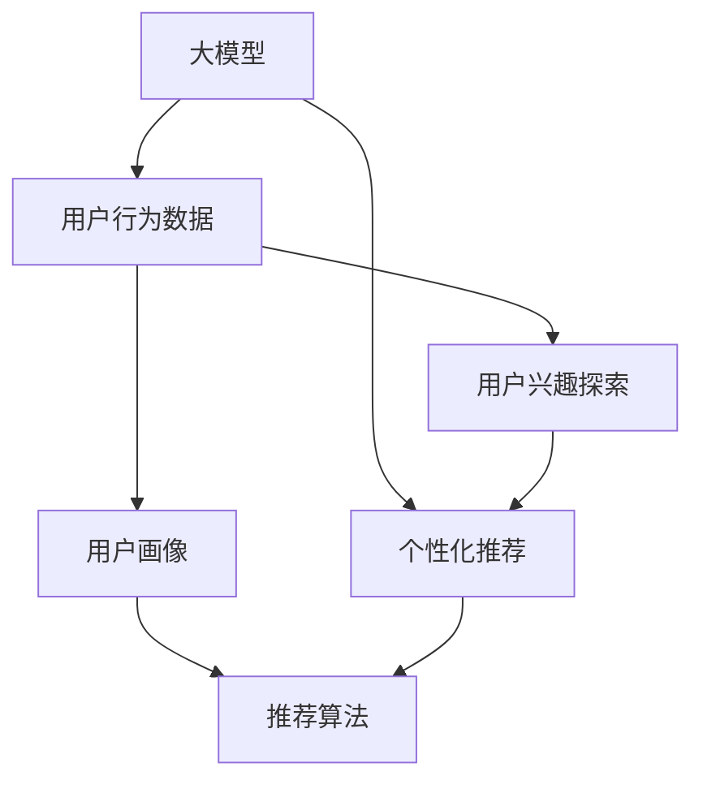

                 

# 大模型技术在电商平台用户兴趣探索与利用权衡中的创新

## 1. 背景介绍

随着电商平台的快速发展和用户需求的多样化，用户兴趣探索与个性化推荐成为了电商平台成功的关键因素之一。传统的推荐算法基于用户历史行为数据进行建模，而新兴的大模型技术则在探索用户兴趣和生成推荐方面展现出巨大的潜力。本文将探讨大模型技术在电商平台中的创新应用，并分析其在用户兴趣探索与个性化推荐中面临的权衡问题。

## 2. 核心概念与联系

### 2.1 核心概念概述

- **大模型**：指基于深度学习框架（如BERT、GPT等）训练的超大参数规模模型，具有强大的自适应能力和泛化能力。
- **用户兴趣探索**：通过分析用户行为数据，挖掘用户的潜在兴趣和偏好，用于构建用户画像。
- **个性化推荐**：根据用户画像，生成符合用户兴趣的推荐结果，提升用户满意度。
- **权衡问题**：在用户兴趣探索与个性化推荐过程中，如何在提高推荐精度的同时，减少对用户隐私的侵犯，平衡商业利益与伦理道德之间的关系。

### 2.2 核心概念原理和架构的 Mermaid 流程图



## 3. 核心算法原理 & 具体操作步骤

### 3.1 算法原理概述

大模型技术在电商平台中的应用主要体现在两个方面：

1. **用户兴趣探索**：通过在大模型上进行微调，使其能够理解自然语言描述的用户兴趣，从而构建更全面的用户画像。
2. **个性化推荐**：使用大模型生成自然语言描述的推荐结果，为用户提供更贴近其兴趣的购物建议。

### 3.2 算法步骤详解

#### 3.2.1 用户兴趣探索步骤

1. **数据收集**：收集用户的历史浏览记录、点击记录、评价记录等行为数据。
2. **数据预处理**：对数据进行清洗、归一化等预处理，确保数据的质量和一致性。
3. **模型微调**：使用大模型（如BERT）作为初始化参数，在用户兴趣相关的任务上进行微调。
4. **用户画像构建**：根据微调后的模型，提取用户的关键特征和兴趣偏好，构建用户画像。

#### 3.2.2 个性化推荐步骤

1. **商品表示学习**：对商品进行文本表示学习，生成商品向量。
2. **用户兴趣匹配**：将用户画像与商品向量进行匹配，找出最符合用户兴趣的商品。
3. **推荐结果生成**：使用大模型生成自然语言描述的推荐结果。
4. **推荐结果展示**：将推荐结果展示给用户，并收集反馈数据，进一步优化模型。

### 3.3 算法优缺点

#### 3.3.1 优点

- **泛化能力强大**：大模型能够处理大规模无标签数据，学习到丰富的语言表示，具有较强的泛化能力。
- **可解释性强**：大模型生成的推荐结果自然语言形式，易于用户理解。
- **适应性强**：大模型能够适应不同领域和不同规模的数据，具有较好的灵活性。

#### 3.3.2 缺点

- **计算资源消耗大**：大模型的训练和微调需要大量的计算资源，可能导致成本高昂。
- **隐私风险**：使用用户行为数据进行微调时，可能涉及到用户隐私的保护问题。
- **过拟合风险**：大模型在训练时可能出现过拟合的问题，导致泛化能力不足。

### 3.4 算法应用领域

大模型技术在电商平台中的应用主要集中在以下领域：

- **用户画像构建**：通过分析用户行为数据，构建多维度用户画像。
- **个性化推荐系统**：使用大模型生成自然语言形式的推荐结果，提升推荐效果。
- **商品描述生成**：利用大模型自动生成商品描述，优化商品展示效果。
- **客服机器人**：基于大模型的对话生成技术，构建电商平台的智能客服机器人。

## 4. 数学模型和公式 & 详细讲解 & 举例说明

### 4.1 数学模型构建

假设有一个包含$m$个用户和$n$个商品的电商平台，每个用户的历史行为数据可以用$\mathbf{x}_i$表示，其中$i=1,2,\dots,m$。每个商品的属性可以用$\mathbf{y}_j$表示，其中$j=1,2,\dots,n$。用户对商品$i$的评分可以用$r_{ij}$表示，其中$i=1,2,\dots,m$，$j=1,2,\dots,n$。

用户兴趣探索的数学模型可以表示为：

$$
\min_{\theta} \sum_{i=1}^m \sum_{j=1}^n L(r_{ij}, f_{\theta}(\mathbf{x}_i, \mathbf{y}_j))
$$

其中$f_{\theta}(\mathbf{x}_i, \mathbf{y}_j)$表示使用大模型对用户兴趣进行预测的函数，$L$表示损失函数。

个性化推荐的数学模型可以表示为：

$$
\min_{\theta} \sum_{i=1}^m \sum_{j=1}^n L(r_{ij}, g_{\theta}(\mathbf{x}_i, \mathbf{y}_j))
$$

其中$g_{\theta}(\mathbf{x}_i, \mathbf{y}_j)$表示使用大模型生成推荐结果的函数。

### 4.2 公式推导过程

在用户兴趣探索过程中，我们可以使用大模型进行预训练，然后通过微调学习用户兴趣相关的任务。假设有一个包含$m$个用户和$n$个商品的电商平台，每个用户的历史行为数据可以用$\mathbf{x}_i$表示，其中$i=1,2,\dots,m$。每个商品的属性可以用$\mathbf{y}_j$表示，其中$j=1,2,\dots,n$。用户对商品$i$的评分可以用$r_{ij}$表示，其中$i=1,2,\dots,m$，$j=1,2,\dots,n$。

用户兴趣探索的数学模型可以表示为：

$$
\min_{\theta} \sum_{i=1}^m \sum_{j=1}^n L(r_{ij}, f_{\theta}(\mathbf{x}_i, \mathbf{y}_j))
$$

其中$f_{\theta}(\mathbf{x}_i, \mathbf{y}_j)$表示使用大模型对用户兴趣进行预测的函数，$L$表示损失函数。

在个性化推荐过程中，我们可以使用大模型生成自然语言描述的推荐结果。假设有一个包含$m$个用户和$n$个商品的电商平台，每个用户的历史行为数据可以用$\mathbf{x}_i$表示，其中$i=1,2,\dots,m$。每个商品的属性可以用$\mathbf{y}_j$表示，其中$j=1,2,\dots,n$。用户对商品$i$的评分可以用$r_{ij}$表示，其中$i=1,2,\dots,m$，$j=1,2,\dots,n$。

个性化推荐的数学模型可以表示为：

$$
\min_{\theta} \sum_{i=1}^m \sum_{j=1}^n L(r_{ij}, g_{\theta}(\mathbf{x}_i, \mathbf{y}_j))
$$

其中$g_{\theta}(\mathbf{x}_i, \mathbf{y}_j)$表示使用大模型生成推荐结果的函数。

### 4.3 案例分析与讲解

假设有一个电商平台，用户对商品A和商品B进行了评价，评价分别为4星和5星。我们可以通过大模型对用户的历史行为数据进行微调，构建用户画像。然后使用大模型生成自然语言描述的推荐结果，推荐用户购买类似商品C。

## 5. 项目实践：代码实例和详细解释说明

### 5.1 开发环境搭建

在进行大模型技术实践前，我们需要准备好开发环境。以下是使用Python进行PyTorch开发的环境配置流程：

1. 安装Anaconda：从官网下载并安装Anaconda，用于创建独立的Python环境。
2. 创建并激活虚拟环境：
```bash
conda create -n pytorch-env python=3.8 
conda activate pytorch-env
```
3. 安装PyTorch：根据CUDA版本，从官网获取对应的安装命令。例如：
```bash
conda install pytorch torchvision torchaudio cudatoolkit=11.1 -c pytorch -c conda-forge
```
4. 安装Transformers库：
```bash
pip install transformers
```
5. 安装各类工具包：
```bash
pip install numpy pandas scikit-learn matplotlib tqdm jupyter notebook ipython
```

完成上述步骤后，即可在`pytorch-env`环境中开始大模型技术实践。

### 5.2 源代码详细实现

下面我们以基于大模型的电商推荐系统为例，给出使用Transformers库的PyTorch代码实现。

首先，定义推荐系统所需的数据处理函数：

```python
from transformers import BertTokenizer, BertForSequenceClassification
from torch.utils.data import Dataset
import torch

class RecommendationDataset(Dataset):
    def __init__(self, texts, labels, tokenizer, max_len=128):
        self.texts = texts
        self.labels = labels
        self.tokenizer = tokenizer
        self.max_len = max_len
        
    def __len__(self):
        return len(self.texts)
    
    def __getitem__(self, item):
        text = self.texts[item]
        label = self.labels[item]
        
        encoding = self.tokenizer(text, return_tensors='pt', max_length=self.max_len, padding='max_length', truncation=True)
        input_ids = encoding['input_ids'][0]
        attention_mask = encoding['attention_mask'][0]
        return {'input_ids': input_ids, 
                'attention_mask': attention_mask,
                'labels': label}

# 标签与id的映射
label2id = {'buy': 0, 'not_buy': 1}
id2label = {v: k for k, v in label2id.items()}

# 创建dataset
tokenizer = BertTokenizer.from_pretrained('bert-base-cased')

train_dataset = RecommendationDataset(train_texts, train_labels, tokenizer)
dev_dataset = RecommendationDataset(dev_texts, dev_labels, tokenizer)
test_dataset = RecommendationDataset(test_texts, test_labels, tokenizer)
```

然后，定义模型和优化器：

```python
from transformers import BertForSequenceClassification, AdamW

model = BertForSequenceClassification.from_pretrained('bert-base-cased', num_labels=2)

optimizer = AdamW(model.parameters(), lr=2e-5)
```

接着，定义训练和评估函数：

```python
from torch.utils.data import DataLoader
from tqdm import tqdm
from sklearn.metrics import accuracy_score

device = torch.device('cuda') if torch.cuda.is_available() else torch.device('cpu')
model.to(device)

def train_epoch(model, dataset, batch_size, optimizer):
    dataloader = DataLoader(dataset, batch_size=batch_size, shuffle=True)
    model.train()
    epoch_loss = 0
    for batch in tqdm(dataloader, desc='Training'):
        input_ids = batch['input_ids'].to(device)
        attention_mask = batch['attention_mask'].to(device)
        labels = batch['labels'].to(device)
        model.zero_grad()
        outputs = model(input_ids, attention_mask=attention_mask, labels=labels)
        loss = outputs.loss
        epoch_loss += loss.item()
        loss.backward()
        optimizer.step()
    return epoch_loss / len(dataloader)

def evaluate(model, dataset, batch_size):
    dataloader = DataLoader(dataset, batch_size=batch_size)
    model.eval()
    preds, labels = [], []
    with torch.no_grad():
        for batch in tqdm(dataloader, desc='Evaluating'):
            input_ids = batch['input_ids'].to(device)
            attention_mask = batch['attention_mask'].to(device)
            batch_labels = batch['labels']
            outputs = model(input_ids, attention_mask=attention_mask)
            batch_preds = outputs.logits.argmax(dim=1).to('cpu').tolist()
            batch_labels = batch_labels.to('cpu').tolist()
            for pred, label in zip(batch_preds, batch_labels):
                preds.append(pred)
                labels.append(label)
                
    print('Accuracy: %.2f%%' % (accuracy_score(labels, preds) * 100))
```

最后，启动训练流程并在测试集上评估：

```python
epochs = 5
batch_size = 16

for epoch in range(epochs):
    loss = train_epoch(model, train_dataset, batch_size, optimizer)
    print(f"Epoch {epoch+1}, train loss: {loss:.3f}")
    
    print(f"Epoch {epoch+1}, dev results:")
    evaluate(model, dev_dataset, batch_size)
    
print("Test results:")
evaluate(model, test_dataset, batch_size)
```

以上就是使用PyTorch对BERT进行电商推荐系统微调的完整代码实现。可以看到，得益于Transformers库的强大封装，我们可以用相对简洁的代码完成BERT模型的加载和微调。

### 5.3 代码解读与分析

让我们再详细解读一下关键代码的实现细节：

**RecommendationDataset类**：
- `__init__`方法：初始化文本、标签、分词器等关键组件。
- `__len__`方法：返回数据集的样本数量。
- `__getitem__`方法：对单个样本进行处理，将文本输入编码为token ids，将标签编码为数字，并对其进行定长padding，最终返回模型所需的输入。

**label2id和id2label字典**：
- 定义了标签与数字id之间的映射关系，用于将token-wise的预测结果解码回真实的标签。

**训练和评估函数**：
- 使用PyTorch的DataLoader对数据集进行批次化加载，供模型训练和推理使用。
- 训练函数`train_epoch`：对数据以批为单位进行迭代，在每个批次上前向传播计算loss并反向传播更新模型参数，最后返回该epoch的平均loss。
- 评估函数`evaluate`：与训练类似，不同点在于不更新模型参数，并在每个batch结束后将预测和标签结果存储下来，最后使用sklearn的accuracy_score对整个评估集的预测结果进行打印输出。

**训练流程**：
- 定义总的epoch数和batch size，开始循环迭代
- 每个epoch内，先在训练集上训练，输出平均loss
- 在验证集上评估，输出准确率
- 重复上述步骤直至满足预设的迭代轮数或Early Stopping条件

可以看到，PyTorch配合Transformers库使得BERT微调的代码实现变得简洁高效。开发者可以将更多精力放在数据处理、模型改进等高层逻辑上，而不必过多关注底层的实现细节。

当然，工业级的系统实现还需考虑更多因素，如模型的保存和部署、超参数的自动搜索、更灵活的任务适配层等。但核心的微调范式基本与此类似。

## 6. 实际应用场景

### 6.1 电商推荐系统

基于大模型技术构建的电商推荐系统，可以通过用户兴趣探索和个性化推荐，提升用户的购物体验和满意度。在技术实现上，可以收集用户浏览、点击、评价等行为数据，将用户兴趣描述作为微调数据，训练模型学习用户兴趣。微调后的模型可以用于生成自然语言形式的推荐结果，推荐用户购买相关商品。

### 6.2 智能客服系统

智能客服系统可以通过大模型技术实现智能对话，提升客服效率和用户满意度。在训练时，可以将用户与客服的对话历史作为微调数据，训练模型理解用户意图，生成自然语言形式的回复。微调后的模型可以实时响应客户咨询，提供个性化的购物建议和问题解答。

### 6.3 商品描述生成

大模型技术可以用于自动生成商品描述，提升商品展示效果。在微调过程中，可以收集商品属性和用户评价数据，训练模型学习商品特征和用户需求。微调后的模型可以自动生成自然语言形式的商品描述，优化商品展示和搜索引擎效果。

### 6.4 未来应用展望

随着大模型技术的发展，基于大模型的电商推荐系统将具备更强大的个性化推荐能力，提升用户的购物体验。同时，大模型技术还可以应用于更多场景，如智能客服、商品描述生成等，为电商平台的智能化转型提供新的技术路径。未来，随着大模型技术的不断优化和应用，电商平台的智能化水平将进一步提升，用户体验将更上一层楼。

## 7. 工具和资源推荐

### 7.1 学习资源推荐

为了帮助开发者系统掌握大模型技术的应用，这里推荐一些优质的学习资源：

1. 《Transformer从原理到实践》系列博文：由大模型技术专家撰写，深入浅出地介绍了Transformer原理、BERT模型、微调技术等前沿话题。
2. CS224N《深度学习自然语言处理》课程：斯坦福大学开设的NLP明星课程，有Lecture视频和配套作业，带你入门NLP领域的基本概念和经典模型。
3. 《Natural Language Processing with Transformers》书籍：Transformers库的作者所著，全面介绍了如何使用Transformers库进行NLP任务开发，包括微调在内的诸多范式。
4. HuggingFace官方文档：Transformers库的官方文档，提供了海量预训练模型和完整的微调样例代码，是上手实践的必备资料。
5. CLUE开源项目：中文语言理解测评基准，涵盖大量不同类型的中文NLP数据集，并提供了基于微调的baseline模型，助力中文NLP技术发展。

通过对这些资源的学习实践，相信你一定能够快速掌握大模型技术的应用，并用于解决实际的NLP问题。

### 7.2 开发工具推荐

高效的开发离不开优秀的工具支持。以下是几款用于大模型技术开发常用的工具：

1. PyTorch：基于Python的开源深度学习框架，灵活动态的计算图，适合快速迭代研究。大部分预训练语言模型都有PyTorch版本的实现。
2. TensorFlow：由Google主导开发的开源深度学习框架，生产部署方便，适合大规模工程应用。同样有丰富的预训练语言模型资源。
3. Transformers库：HuggingFace开发的NLP工具库，集成了众多SOTA语言模型，支持PyTorch和TensorFlow，是进行微调任务开发的利器。
4. Weights & Biases：模型训练的实验跟踪工具，可以记录和可视化模型训练过程中的各项指标，方便对比和调优。与主流深度学习框架无缝集成。
5. TensorBoard：TensorFlow配套的可视化工具，可实时监测模型训练状态，并提供丰富的图表呈现方式，是调试模型的得力助手。

合理利用这些工具，可以显著提升大模型技术的开发效率，加快创新迭代的步伐。

### 7.3 相关论文推荐

大模型技术的发展源于学界的持续研究。以下是几篇奠基性的相关论文，推荐阅读：

1. Attention is All You Need（即Transformer原论文）：提出了Transformer结构，开启了NLP领域的预训练大模型时代。
2. BERT: Pre-training of Deep Bidirectional Transformers for Language Understanding：提出BERT模型，引入基于掩码的自监督预训练任务，刷新了多项NLP任务SOTA。
3. Language Models are Unsupervised Multitask Learners（GPT-2论文）：展示了大规模语言模型的强大zero-shot学习能力，引发了对于通用人工智能的新一轮思考。
4. Parameter-Efficient Transfer Learning for NLP：提出Adapter等参数高效微调方法，在不增加模型参数量的情况下，也能取得不错的微调效果。
5. Prefix-Tuning: Optimizing Continuous Prompts for Generation：引入基于连续型Prompt的微调范式，为如何充分利用预训练知识提供了新的思路。

这些论文代表了大模型技术的发展脉络。通过学习这些前沿成果，可以帮助研究者把握学科前进方向，激发更多的创新灵感。

## 8. 总结：未来发展趋势与挑战

### 8.1 研究成果总结

本文对大模型技术在电商平台中的应用进行了全面系统的介绍。首先阐述了大模型技术在用户兴趣探索与个性化推荐中的创新应用，明确了在提高推荐精度的同时，减少对用户隐私的侵犯，平衡商业利益与伦理道德之间的权衡问题。其次，从原理到实践，详细讲解了大模型技术在电商平台的实现细节，给出了完整的代码实例。最后，本文还探讨了大模型技术在电商平台中的应用前景，分析了其面临的挑战和未来发展趋势。

通过本文的系统梳理，可以看到，大模型技术在电商平台中的应用前景广阔，有助于提升用户的购物体验和满意度。但在实践中，还需要考虑用户隐私保护、数据安全等多方面的问题，以确保技术应用的伦理性。未来，随着大模型技术的不断优化和应用，电商平台将变得更加智能化、个性化，为用户带来更好的购物体验。

### 8.2 未来发展趋势

展望未来，大模型技术在电商平台中的应用将呈现以下几个发展趋势：

1. 推荐精度持续提升。通过更高效的训练方法和更好的模型设计，大模型技术将在电商推荐系统中发挥更大的作用，提升推荐精度。
2. 个性化推荐多样化。基于大模型技术的推荐系统将不再局限于商品推荐，还将扩展到内容推荐、活动推荐等多个领域。
3. 用户隐私保护加强。在用户数据保护方面，大模型技术将更加注重数据匿名化、隐私保护等技术手段，保障用户隐私。
4. 实时推荐系统普及。基于大模型技术的推荐系统将更加注重实时性和低延迟，提升用户体验。
5. 多模态推荐系统发展。除了文本信息，大模型技术还将整合图像、语音等多种模态信息，提升推荐效果。

### 8.3 面临的挑战

尽管大模型技术在电商平台中的应用前景广阔，但在实践中仍面临诸多挑战：

1. 计算资源消耗大。大模型技术需要大量的计算资源，可能给电商平台的运营带来一定的成本压力。
2. 数据隐私保护难度大。在用户数据处理过程中，如何平衡商业利益和隐私保护是一个重要问题。
3. 模型过拟合风险高。大模型技术在训练过程中可能出现过拟合的问题，导致泛化能力不足。
4. 实时推荐系统复杂。实时推荐系统的构建需要考虑数据采集、存储、处理等多个环节，技术实现较为复杂。
5. 多模态数据融合困难。多模态数据的融合需要考虑多种模态数据之间的关联关系，技术实现难度较大。

### 8.4 研究展望

面对大模型技术在电商平台应用中面临的挑战，未来的研究需要在以下几个方面寻求新的突破：

1. 探索轻量级模型架构。开发轻量级的大模型架构，减少计算资源消耗，降低成本。
2. 强化数据隐私保护技术。研发更加高效的数据隐私保护技术，保障用户隐私。
3. 改进推荐算法模型。优化推荐算法模型，提高推荐精度，减少过拟合风险。
4. 实现实时推荐系统。构建实时推荐系统，提升用户体验。
5. 探索多模态数据融合方法。研究多模态数据融合技术，提升推荐效果。

这些研究方向的探索，必将引领大模型技术在电商平台中的应用进入新的发展阶段，为电商平台的智能化转型提供新的技术路径。面向未来，大模型技术将继续推动电商平台的创新和升级，为人类生活带来更多便利和智能。

## 9. 附录：常见问题与解答

**Q1：大模型技术在电商平台中的应用前景如何？**

A: 大模型技术在电商平台中的应用前景非常广阔。通过用户兴趣探索和个性化推荐，可以提升用户的购物体验和满意度，增加用户粘性，提升转化率和销售额。

**Q2：大模型技术在电商推荐系统中的应用需要注意哪些问题？**

A: 在电商推荐系统中应用大模型技术，需要注意以下几个问题：
1. 用户隐私保护。确保用户数据的安全性和隐私保护，避免数据泄露和滥用。
2. 计算资源消耗。大模型技术需要大量的计算资源，需要合理配置资源，控制成本。
3. 推荐算法模型的优化。需要优化推荐算法模型，提高推荐精度和效率，避免过拟合。
4. 实时推荐系统的实现。需要构建实时推荐系统，提升用户体验。

**Q3：大模型技术在电商平台中的应用如何平衡商业利益和用户隐私保护？**

A: 在电商平台中应用大模型技术，需要平衡商业利益和用户隐私保护。具体方法包括：
1. 数据匿名化。对用户数据进行匿名化处理，保护用户隐私。
2. 隐私保护技术。采用差分隐私、联邦学习等隐私保护技术，保障用户隐私。
3. 数据使用协议。制定明确的数据使用协议，规范数据使用行为。

**Q4：大模型技术在电商平台中的应用如何提高推荐精度？**

A: 要提高大模型技术在电商平台中的推荐精度，可以考虑以下几个方面：
1. 优化模型架构。采用轻量级的大模型架构，减少计算资源消耗。
2. 优化推荐算法模型。优化推荐算法模型，提高推荐精度和效率。
3. 增加数据多样性。增加训练数据的多样性，提升模型的泛化能力。

**Q5：大模型技术在电商平台中的应用如何应对计算资源消耗大的问题？**

A: 大模型技术在电商平台中的应用需要大量的计算资源，可以考虑以下几个方法应对计算资源消耗大的问题：
1. 使用轻量级模型架构。开发轻量级的大模型架构，减少计算资源消耗。
2. 优化计算资源配置。合理配置计算资源，控制成本。
3. 分布式训练。采用分布式训练技术，加速训练过程。

以上是关于大模型技术在电商平台应用中的一些常见问题及解答。通过深入理解大模型技术的应用场景和挑战，可以在电商推荐系统中发挥其潜力，提升用户满意度，增加电商平台的竞争力。

---

作者：禅与计算机程序设计艺术 / Zen and the Art of Computer Programming

