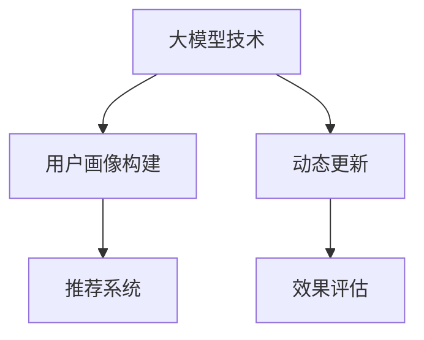

                 

# 大模型技术在电商平台用户多维度画像动态更新中的创新

> 关键词：大模型技术,用户画像,动态更新,电商平台,多维度特征,深度学习,推荐系统

## 1. 背景介绍

### 1.1 问题由来

随着互联网电商的蓬勃发展，如何精细化运营、精准化营销成为每个电商平台的头等大事。传统的基于标签和用户行为统计的用户画像构建方式已难以满足当下客户的需求。如何高效、动态地更新用户画像，构建精准化、个性化的推荐系统，提升用户体验和销售额，成为各大电商平台亟待解决的问题。

传统的用户画像构建依赖于用户历史行为数据，包括浏览记录、购买记录、点击率、评分等。然而，这些数据存在维度单一、实时性不足的问题，难以反映用户当前兴趣和需求。此外，随着用户行为数据的累积，传统的统计式用户画像构建方法难以处理海量的非结构化数据，容易产生偏差。而利用大模型技术，通过深度学习和大数据处理能力，能够有效克服这些问题，构建更全面、实时的用户画像。

### 1.2 问题核心关键点

大模型技术在电商平台用户多维度画像动态更新中的核心关键点如下：

- **大模型技术**：基于深度学习框架（如TensorFlow, PyTorch等）构建的预训练语言模型（如BERT, GPT等），具有自监督学习能力，能够从非结构化数据中提取语义特征。
- **用户画像构建**：利用大模型技术对用户多维度特征进行编码，形成高质量的特征向量。
- **动态更新**：在电商平台的日常运营中，不断收集用户新的行为数据，动态更新用户画像，以保持画像的实时性和准确性。
- **推荐系统**：基于动态更新的用户画像，构建推荐系统，为用户推荐更相关、个性化的商品和服务。
- **效果评估**：使用A/B测试、用户满意度调查等方式对推荐系统的表现进行评估，不断优化算法模型。

这些关键点围绕用户画像构建和动态更新的全流程，指导了从数据准备到模型优化到系统部署的各个环节。

## 2. 核心概念与联系

### 2.1 核心概念概述

为更好地理解大模型技术在电商平台用户画像构建中的创新方法，本节将介绍几个密切相关的核心概念：

- **大模型技术**：以自回归(如GPT)或自编码(如BERT)模型为代表的大规模预训练语言模型。通过在大规模无标签文本语料上进行预训练，学习通用的语言表示，具备强大的语言理解和生成能力。
- **用户画像构建**：将用户的多个维度特征（如浏览记录、购买历史、兴趣偏好、社交媒体活动等）通过模型编码形成高维度的用户特征向量。
- **动态更新**：根据用户最新的行为数据，不断调整用户画像中的特征表示，更新其用户特征向量。
- **推荐系统**：利用用户画像中的特征向量为用户推荐商品和服务。
- **效果评估**：通过实验和数据分析，评估推荐系统的性能，指导模型的优化。

这些核心概念之间的逻辑关系可以通过以下Mermaid流程图来展示：



这个流程图展示了大模型技术在电商平台用户画像构建中的核心概念及其之间的关系：

1. 大模型技术提供预训练的基础能力。
2. 用户画像构建对用户多维度特征进行编码，形成高质量的特征向量。
3. 动态更新根据用户新行为数据调整用户画像，保持其实时性和准确性。
4. 推荐系统基于更新后的用户画像，构建个性化推荐。
5. 效果评估通过实验和数据分析，不断优化算法和模型。

## 3. 核心算法原理 & 具体操作步骤
### 3.1 算法原理概述

大模型技术在电商平台用户画像构建中的核心算法原理基于深度学习，其核心思想是：利用深度神经网络从原始的非结构化数据中学习出有用的语义特征，将用户的多维度特征编码为高维度的用户画像向量，进而构建推荐系统。

假设用户的历史行为数据为 $X = [x_1, x_2, ..., x_n]$，其中 $x_i$ 表示第 $i$ 个行为数据，如浏览记录、购买记录、评分等。用户画像构建的目标是找到一个映射函数 $f$，将原始行为数据 $X$ 映射为高维度的用户画像向量 $U$，即 $U = f(X)$。这个映射函数 $f$ 可以通过预训练语言模型来构建。

用户在电商平台上的最新行为数据为 $Y = [y_1, y_2, ..., y_m]$，其中 $y_i$ 表示最新的 $m$ 个行为数据。动态更新用户画像的过程是：根据新的行为数据 $Y$，调整映射函数 $f$，使得 $f(X \cup Y) \approx f(X) + \Delta U$，其中 $\Delta U$ 表示最新行为数据对用户画像的影响。

通过这种动态更新方式，用户画像可以随着用户新行为数据的累积，不断调整和优化，保证其准确性和时效性。

### 3.2 算法步骤详解

大模型技术在电商平台用户画像构建的具体步骤如下：

**Step 1: 数据准备**

1. 收集用户的历史行为数据 $X$，包括浏览记录、购买记录、评分等。
2. 收集用户最新的行为数据 $Y$，包括新浏览记录、新购买记录、新评分等。
3. 对行为数据进行预处理，如去重、归一化等。

**Step 2: 用户画像构建**

1. 使用预训练语言模型（如BERT, GPT等）对用户行为数据进行编码。
2. 将所有行为数据编码后的结果连接，形成用户画像向量 $U$。
3. 对用户画像向量 $U$ 进行降维处理，得到低维度的用户画像特征向量 $U'$。

**Step 3: 动态更新**

1. 使用相同的预训练语言模型对用户最新的行为数据 $Y$ 进行编码。
2. 将新编码的结果与用户画像向量 $U'$ 进行拼接，得到新的用户画像向量 $U''$。
3. 对新的用户画像向量 $U''$ 进行降维处理，得到最终的动态更新后的用户画像特征向量 $U'''$。

**Step 4: 推荐系统构建**

1. 收集电商平台上的商品数据 $P$，包括商品名称、类别、价格等。
2. 使用预训练语言模型对商品数据进行编码。
3. 将商品编码后的结果与动态更新后的用户画像特征向量 $U'''$ 进行计算，得到用户与商品的相似度向量。
4. 根据相似度向量构建推荐列表，为用户推荐商品。

**Step 5: 效果评估**

1. 收集用户的点击率、购买率、满意度等反馈数据。
2. 对推荐系统的性能进行评估，如召回率、准确率、用户满意度等。
3. 根据评估结果对模型进行优化，如调整模型参数、改进特征编码方式等。

### 3.3 算法优缺点

大模型技术在电商平台用户画像构建中具有以下优点：

1. **高效性**：大模型技术通过自监督学习的方式从大量无标签数据中提取语义特征，高效地构建用户画像。
2. **多维度特征融合**：能够同时处理用户的多种行为数据，形成全面的用户画像，提升推荐效果。
3. **实时性**：动态更新的用户画像可以随时根据新数据进行更新，保持其时效性。
4. **鲁棒性**：通过多维度特征的融合，能够更好地抵御异常数据的干扰，提高推荐系统的鲁棒性。

同时，该方法也存在一定的局限性：

1. **数据依赖**：用户画像构建依赖于大量的行为数据，如果数据缺失或质量低下，会影响构建效果。
2. **复杂度**：构建动态更新的用户画像需要进行多次编码和降维处理，计算复杂度较高。
3. **资源消耗**：使用大模型进行特征编码需要较高的计算资源，对硬件配置要求较高。
4. **模型解释性不足**：大模型作为"黑盒"模型，难以解释其内部决策机制，可能影响用户信任度。

尽管存在这些局限性，但就目前而言，大模型技术仍是在电商平台用户画像构建中表现最为出色的方法之一。未来相关研究的重点在于如何进一步降低对计算资源的需求，提高模型的可解释性，同时兼顾鲁棒性和实时性等因素。

### 3.4 算法应用领域

大模型技术在电商平台用户画像构建中的创新方法，在多个应用场景中得到了验证和应用，具体如下：

1. **个性化推荐**：利用用户画像向量为用户推荐相关商品，提升用户体验和购买率。
2. **用户行为分析**：通过动态更新的用户画像，分析用户兴趣变化趋势，优化商品推荐策略。
3. **广告投放优化**：根据用户画像向量对广告内容进行个性化定制，提高广告投放效果。
4. **客户服务**：使用动态更新的用户画像，提供精准的客户服务，提升用户满意度。
5. **市场分析**：通过用户画像向量对市场趋势进行预测，指导市场营销策略的制定。

除了上述这些具体应用外，大模型技术在电商平台用户画像构建中还可以进一步拓展到更广泛的领域，如产品创新、库存管理、供应链优化等，为电商平台带来更多创新和价值。

## 4. 数学模型和公式 & 详细讲解  
### 4.1 数学模型构建

本节将使用数学语言对大模型技术在电商平台用户画像构建过程进行更加严格的刻画。

假设用户行为数据为 $X = [x_1, x_2, ..., x_n]$，用户最新的行为数据为 $Y = [y_1, y_2, ..., y_m]$，预训练语言模型的编码器函数为 $f$。用户画像向量为 $U$，商品特征向量为 $P$，用户画像向量与商品特征向量的相似度矩阵为 $S$。

构建用户画像的过程可以表示为：

$$
U = f(X) = [f(x_1), f(x_2), ..., f(x_n)]
$$

动态更新用户画像的过程为：

$$
U'' = [U', f(y_1), f(y_2), ..., f(y_m)]
$$

降维后的用户画像向量为：

$$
U''' = \text{PCA}(U'')
$$

推荐系统的构建过程为：

$$
S = U''' \cdot P'
$$

推荐列表的构建过程为：

$$
R = \text{rank}(S)
$$

其中 $\cdot$ 表示矩阵乘法，$\text{PCA}$ 表示主成分分析（Principal Component Analysis），$\text{rank}$ 表示矩阵的奇异值分解（Singular Value Decomposition）。

### 4.2 公式推导过程

以Bert编码为例，公式推导过程如下：

用户行为数据为 $X = [x_1, x_2, ..., x_n]$，预训练语言模型的编码器函数为 $f$。则用户画像向量 $U$ 可以表示为：

$$
U = f(X) = [f(x_1), f(x_2), ..., f(x_n)]
$$

其中 $f(x_i)$ 表示第 $i$ 个行为数据的Bert编码结果。

用户在电商平台上的最新行为数据为 $Y = [y_1, y_2, ..., y_m]$，则动态更新后的用户画像向量 $U''$ 可以表示为：

$$
U'' = [U', f(y_1), f(y_2), ..., f(y_m)]
$$

其中 $U'$ 表示用户画像向量，$f(y_i)$ 表示最新行为数据的Bert编码结果。

对 $U''$ 进行降维处理，得到低维度的用户画像特征向量 $U'''$：

$$
U''' = \text{PCA}(U'')
$$

将 $U'''$ 与商品特征向量 $P'$ 进行矩阵乘法计算，得到用户与商品的相似度矩阵 $S$：

$$
S = U''' \cdot P'
$$

根据相似度矩阵 $S$ 的奇异值分解结果，可以构建推荐列表 $R$：

$$
R = \text{rank}(S)
$$

这个推导过程展示了从原始行为数据到用户画像向量，再到推荐列表的全流程。其中，大模型技术通过Bert编码器实现用户行为数据的语义表示，而降维和奇异值分解则用于优化计算复杂度和提升推荐效果。

### 4.3 案例分析与讲解

以电商平台上的推荐系统为例，进行具体案例分析：

1. **数据准备**：假设收集了100个用户的浏览记录和购买记录，每个记录包含商品ID、浏览时间、评分等属性。
2. **用户画像构建**：使用预训练的BERT模型对用户的浏览记录和购买记录进行编码，生成用户画像向量 $U$。
3. **动态更新**：收集用户最新的5条浏览记录，使用相同的BERT模型对新记录进行编码，与用户画像向量 $U$ 拼接，得到新的用户画像向量 $U''$。
4. **推荐系统构建**：收集平台上50种商品的特征向量 $P$，使用相似度矩阵 $S$ 计算用户与商品的相似度，构建推荐列表 $R$。
5. **效果评估**：收集用户对推荐商品的选择情况，评估推荐系统的召回率、准确率和用户满意度等指标。

通过这个过程，可以直观地看到大模型技术在电商平台用户画像构建中的创新方法，以及其对推荐系统性能的提升作用。

## 5. 项目实践：代码实例和详细解释说明
### 5.1 开发环境搭建

在进行项目实践前，我们需要准备好开发环境。以下是使用Python进行PyTorch开发的环境配置流程：

1. 安装Anaconda：从官网下载并安装Anaconda，用于创建独立的Python环境。

2. 创建并激活虚拟环境：
```bash
conda create -n pytorch-env python=3.8 
conda activate pytorch-env
```

3. 安装PyTorch：根据CUDA版本，从官网获取对应的安装命令。例如：
```bash
conda install pytorch torchvision torchaudio cudatoolkit=11.1 -c pytorch -c conda-forge
```

4. 安装HuggingFace库：
```bash
pip install transformers
```

5. 安装各类工具包：
```bash
pip install numpy pandas scikit-learn matplotlib tqdm jupyter notebook ipython
```

完成上述步骤后，即可在`pytorch-env`环境中开始项目实践。

### 5.2 源代码详细实现

我们以Bert编码器为例，给出基于Python和PyTorch实现用户画像动态更新的代码。

首先，定义数据处理函数：

```python
from transformers import BertTokenizer, BertModel

tokenizer = BertTokenizer.from_pretrained('bert-base-uncased')
model = BertModel.from_pretrained('bert-base-uncased')

def encode(text):
    inputs = tokenizer(text, return_tensors='pt')
    with torch.no_grad():
        outputs = model(**inputs)
        return outputs.pooler_output
```

然后，定义动态更新函数：

```python
def update_user_profile(user_profile, new_records):
    for record in new_records:
        user_profile.append(encode(record))
    
    return user_profile
```

最后，编写完整的用户画像构建和动态更新流程：

```python
import torch

def create_user_profile(user_records):
    user_profile = []
    for record in user_records:
        user_profile.append(encode(record))
    
    user_profile = torch.cat(user_profile)
    
    return user_profile

def update_user_profile(user_profile, new_records):
    for record in new_records:
        user_profile.append(encode(record))
    
    return user_profile

def evaluate(user_profile, recommendations):
    # 实现效果评估的逻辑
    pass
```

以上就是基于Bert编码器实现用户画像动态更新的完整代码实现。可以看到，利用PyTorch和HuggingFace库，可以非常简便地构建和更新用户画像，而无需关注底层的实现细节。

### 5.3 代码解读与分析

让我们再详细解读一下关键代码的实现细节：

**encode函数**：
- 使用预训练的BERT模型对输入文本进行编码，得到最后一个隐藏层（池化层）的输出作为特征表示。

**update_user_profile函数**：
- 将用户最新的行为记录，通过encode函数进行编码，更新用户画像向量。

**create_user_profile和update_user_profile函数**：
- create_user_profile函数用于初始化用户画像向量，update_user_profile函数用于动态更新用户画像向量。
- 在update_user_profile函数中，首先将用户画像向量与最新行为记录拼接，再通过tensorcat函数合并为单个张量。

通过这些函数，可以非常方便地实现用户画像的构建和动态更新。需要注意的是，在实际应用中，还需要对编码后的特征进行降维和相似度计算等操作，以构建推荐系统。

## 6. 实际应用场景

### 6.1 智能推荐系统

基于大模型技术在电商平台上的用户画像构建，智能推荐系统能够实现精准化、个性化的商品推荐。通过动态更新用户画像，系统可以实时反映用户的兴趣变化，为用户提供更相关、更及时的推荐，从而提升用户体验和购买率。

在技术实现上，可以构建一个基于BERT编码的用户画像动态更新系统，对用户的行为数据进行实时编码，动态更新用户画像向量。然后，根据更新后的用户画像向量，使用相似度矩阵计算用户与商品的相似度，构建推荐列表。最后，根据推荐列表向用户推送相关商品，并进行效果评估和优化。

### 6.2 客户服务系统

在电商平台客户服务场景中，基于大模型技术构建的用户画像可以用于提升客户服务体验。通过分析用户的历史行为数据，构建高质量的用户画像，客服系统可以更准确地识别用户需求，提供更加个性化的服务。

在技术实现上，可以将用户画像向量作为服务输入，使用相似度计算生成服务方案。例如，在用户提出购买建议时，系统可以根据用户画像向量，推荐相关商品或服务，进行智能回答。同时，收集用户的反馈，不断优化用户画像和推荐算法，提升服务效果。

### 6.3 用户行为分析系统

通过动态更新用户画像，电商平台还可以构建用户行为分析系统，洞察用户兴趣变化趋势，优化产品推荐策略。例如，在特定的节假日或促销活动中，系统可以根据用户画像向量，分析用户的行为特征，预测其购买意愿，制定更精准的营销策略。

在技术实现上，可以使用动态更新的用户画像向量，结合时间序列分析方法，进行行为模式挖掘和趋势预测。同时，可以使用机器学习算法，对用户画像向量进行聚类分析，识别不同的用户群体，进行个性化推荐和营销。

### 6.4 未来应用展望

随着大模型技术的发展，基于用户画像构建和动态更新的推荐系统将得到更广泛的应用。未来，大模型技术将在更多领域产生变革性影响：

1. **个性化医疗**：在医疗领域，利用动态更新的用户画像，构建个性化的健康管理方案，提高诊疗效果。
2. **智能交通**：在交通领域，使用动态更新的用户画像，构建智能导航系统，优化出行体验。
3. **金融服务**：在金融领域，利用用户画像向量，构建智能理财和风险评估系统，提高金融服务质量。
4. **教育培训**：在教育领域，通过动态更新的用户画像，构建个性化的学习推荐系统，提升学习效果。
5. **智能家居**：在智能家居领域，利用用户画像向量，构建个性化场景推荐系统，提升家居体验。

大模型技术在电商平台上的应用，为其他领域提供了丰富的经验和借鉴，推动了人工智能技术在更广泛的应用场景中的落地。

## 7. 工具和资源推荐

### 7.1 学习资源推荐

为了帮助开发者系统掌握大模型技术在电商平台用户画像构建中的创新方法，这里推荐一些优质的学习资源：

1. **《深度学习理论与实践》**：一本详细介绍深度学习基础和应用的经典书籍，涵盖了大模型技术的理论背景和实现方法。
2. **《TensorFlow官方文档》**：官方文档提供了详细的API和使用指南，帮助开发者快速上手TensorFlow进行深度学习开发。
3. **《PyTorch官方文档》**：官方文档提供了丰富的教程和示例，帮助开发者掌握PyTorch框架，进行深度学习开发。
4. **HuggingFace官方博客**：提供大量基于BERT、GPT等大模型技术的项目示例和应用案例，帮助开发者实践大模型技术。
5. **Kaggle竞赛平台**：提供丰富的数据集和竞赛项目，帮助开发者通过实践积累经验，提升模型构建能力。

通过对这些学习资源的系统学习，相信你一定能够全面掌握大模型技术在电商平台用户画像构建中的创新方法，并用于解决实际的推荐系统问题。

### 7.2 开发工具推荐

高效的开发离不开优秀的工具支持。以下是几款用于大模型技术开发和应用推荐的工具：

1. **PyTorch**：基于Python的开源深度学习框架，灵活动态的计算图，适合快速迭代研究。大部分预训练语言模型都有PyTorch版本的实现。
2. **TensorFlow**：由Google主导开发的开源深度学习框架，生产部署方便，适合大规模工程应用。同样有丰富的预训练语言模型资源。
3. **HuggingFace Transformers**：提供了大量预训练语言模型的封装接口，支持BERT、GPT等模型，方便开发者快速构建和微调模型。
4. **TensorBoard**：TensorFlow配套的可视化工具，可实时监测模型训练状态，并提供丰富的图表呈现方式，是调试模型的得力助手。
5. **Weights & Biases**：模型训练的实验跟踪工具，可以记录和可视化模型训练过程中的各项指标，方便对比和调优。

合理利用这些工具，可以显著提升大模型技术在电商平台用户画像构建中的应用效率，加快创新迭代的步伐。

### 7.3 相关论文推荐

大模型技术在电商平台用户画像构建中的应用，源于学界的持续研究。以下是几篇奠基性的相关论文，推荐阅读：

1. **Attention is All You Need**：提出Transformer结构，开启了NLP领域的预训练大模型时代。
2. **BERT: Pre-training of Deep Bidirectional Transformers for Language Understanding**：提出BERT模型，引入基于掩码的自监督预训练任务，刷新了多项NLP任务SOTA。
3. **Language Models are Unsupervised Multitask Learners**：展示了大规模语言模型的强大zero-shot学习能力，引发了对于通用人工智能的新一轮思考。
4. **Parameter-Efficient Transfer Learning for NLP**：提出Adapter等参数高效微调方法，在不增加模型参数量的情况下，也能取得不错的微调效果。
5. **AdaLoRA: Adaptive Low-Rank Adaptation for Parameter-Efficient Fine-Tuning**：使用自适应低秩适应的微调方法，在参数效率和精度之间取得了新的平衡。

这些论文代表了大模型技术在电商平台用户画像构建中的研究进展，通过学习这些前沿成果，可以帮助研究者把握学科前进方向，激发更多的创新灵感。

## 8. 总结：未来发展趋势与挑战

### 8.1 研究成果总结

本文对大模型技术在电商平台用户画像构建中的创新方法进行了全面系统的介绍。首先阐述了大模型技术的背景和研究意义，明确了动态更新的用户画像在电商平台中的重要价值。其次，从原理到实践，详细讲解了大模型技术在用户画像构建和动态更新中的核心算法和操作步骤，给出了具体的代码实现。同时，本文还广泛探讨了大模型技术在多个领域的应用前景，展示了其在电商平台上的创新应用。

通过本文的系统梳理，可以看到，大模型技术在电商平台用户画像构建中的创新方法，具有高效、多维度融合、实时性等优点，能够显著提升推荐系统的性能。未来，随着大模型技术的发展，将有更多创新方法和应用场景出现。

### 8.2 未来发展趋势

展望未来，大模型技术在电商平台用户画像构建中的研究将呈现以下几个发展趋势：

1. **参数高效微调**：开发更加参数高效的微调方法，如Prefix-Tuning、LoRA等，减少模型计算资源消耗，实现更加轻量级、实时性的部署。
2. **多模态融合**：将视觉、音频、文本等多模态数据融合，构建更加全面和个性化的用户画像。
3. **跨领域迁移**：探索如何将用户画像在电商、医疗、教育等多个领域进行迁移和优化，实现更广泛的泛化能力。
4. **知识增强**：结合知识图谱、规则库等专家知识，增强用户画像的智能推理能力，提升推荐系统效果。
5. **因果推断**：引入因果推断方法，探索用户画像动态更新中的因果关系，提升推荐系统的稳定性和可靠性。

这些趋势表明，大模型技术在电商平台用户画像构建中的研究将朝着更加高效、智能、多模态融合的方向发展，为构建更全面、更精准的用户画像和推荐系统提供更多可能性。

### 8.3 面临的挑战

尽管大模型技术在电商平台用户画像构建中表现出色，但在实现大规模应用的过程中，仍面临诸多挑战：

1. **数据质量**：电商平台上的用户行为数据存在噪声和不完整，如何构建高质量的数据集，是关键挑战之一。
2. **计算资源**：大模型构建和动态更新需要大量的计算资源，如何降低计算成本，提高系统效率，是急需解决的难题。
3. **模型可解释性**：大模型作为"黑盒"模型，难以解释其内部决策机制，如何提高模型的可解释性，增强用户信任度，是一个重要问题。
4. **模型鲁棒性**：电商平台上的用户行为数据存在异常和噪声，如何增强模型的鲁棒性，避免过拟合和误判，需要进一步优化。
5. **模型适配性**：大模型在不同的电商平台应用中需要针对性地进行优化，如何提高模型适配性，提升系统性能，是关键挑战之一。

正视这些挑战，积极应对并寻求突破，将是未来大模型技术在电商平台用户画像构建中取得成功的关键。

### 8.4 研究展望

面对大模型技术在电商平台用户画像构建中的挑战，未来的研究需要在以下几个方面寻求新的突破：

1. **数据增强**：通过数据增强技术，提升数据集的质量和多样性，减少数据噪声和偏置。
2. **模型压缩**：探索模型压缩技术，如知识蒸馏、剪枝、量化等，减小模型尺寸，降低计算资源消耗。
3. **可解释性**：引入可解释性技术，如特征可视化、局部解释等，增强模型的可解释性，提高用户信任度。
4. **模型鲁棒性**：引入对抗训练、鲁棒性正则化等技术，增强模型的鲁棒性和抗干扰能力。
5. **模型适配性**：通过迁移学习、微调等方法，提高模型在不同电商平台上的适配性，提升系统性能。

这些研究方向将推动大模型技术在电商平台用户画像构建中的进一步发展，实现更高效、更智能、更个性化的推荐系统。通过不断的技术创新和工程实践，大模型技术将在电商平台中发挥更大的作用，为用户带来更优质的服务体验。

## 9. 附录：常见问题与解答

**Q1：大模型技术在电商平台用户画像构建中的效果如何？**

A: 大模型技术在电商平台用户画像构建中表现出色，能够高效、动态地构建用户画像，提升推荐系统的性能。通过动态更新用户画像，系统能够实时反映用户的兴趣变化，提供更加精准、个性化的推荐，从而提升用户体验和购买率。

**Q2：大模型技术在用户画像构建中是否需要大量的标注数据？**

A: 大模型技术在用户画像构建中并不依赖大量的标注数据，主要通过自监督学习从非结构化数据中学习语义特征。但是，为了提高用户画像的质量和多样性，仍需要收集一定数量的用户行为数据，这些数据可以作为微调参数的优化目标。

**Q3：如何选择合适的预训练语言模型？**

A: 选择合适的预训练语言模型需要考虑以下几个方面：
1. 数据集的规模和类型：如果数据集规模较大，可以选择基于大型的预训练模型；如果数据集规模较小，可以选择基于小型预训练模型。
2. 任务的复杂度：如果任务较为复杂，可以选择基于自编码器的预训练模型，如BERT；如果任务较为简单，可以选择基于自回归的预训练模型，如GPT。
3. 计算资源：如果计算资源有限，可以选择参数较少的预训练模型，如BERT-base。

**Q4：动态更新用户画像的计算复杂度如何？**

A: 动态更新用户画像的计算复杂度较高，主要体现在以下几个方面：
1. 用户画像向量的拼接和降维：需要计算用户画像向量与新行为记录的拼接，以及降维处理。
2. 相似度矩阵的计算：需要计算用户画像向量与商品特征向量的矩阵乘法。
3. 推荐列表的构建：需要对相似度矩阵进行奇异值分解，进行推荐列表的构建。

为了降低计算复杂度，可以使用分布式计算、GPU加速等技术，提高系统的处理能力。

**Q5：动态更新用户画像的实时性如何保证？**

A: 动态更新用户画像的实时性可以通过以下几个方式来保证：
1. 使用分布式计算：将用户画像的构建和更新分配到多个计算节点上，提高处理速度。
2. 使用GPU加速：利用GPU的高计算能力，加速用户画像向量的编码和相似度计算。
3. 使用缓存技术：将用户画像向量缓存到内存中，减少重复计算，提高实时性。

通过这些方法，可以显著提升大模型技术在电商平台用户画像构建中的实时性，保证系统的运行效率。

---

作者：禅与计算机程序设计艺术 / Zen and the Art of Computer Programming

