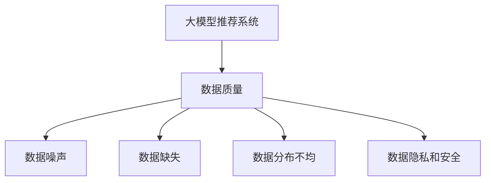

                 

# 大模型推荐中的数据质量问题与应对策略

大模型推荐系统在近年来取得了显著的进步，但随之而来的数据质量问题也引起了广泛的关注。推荐系统依赖于大量高质量数据进行训练和优化，数据质量直接影响模型的性能和应用效果。本文将深入探讨大模型推荐中的数据质量问题，并提出一系列应对策略，以期为推荐系统的开发和部署提供指导。

## 1. 背景介绍

### 1.1 问题由来

推荐系统在大数据和人工智能技术的推动下，已经广泛应用于电商、新闻、社交媒体等多个领域。大模型推荐系统通过学习用户行为数据，自动推荐符合用户兴趣的产品或内容，提升用户体验和满意度。然而，高质量推荐系统的构建离不开高标准的数据质量，数据质量问题成为制约其发展的瓶颈。

### 1.2 问题核心关键点

数据质量问题主要表现在以下几个方面：

- **数据噪声**：用户行为数据可能包含噪声和异常值，如恶意点击、无效数据等。
- **数据缺失**：用户行为数据往往不完整，某些关键行为特征可能缺失，导致模型无法充分学习用户偏好。
- **数据分布不均**：用户行为数据可能存在分布不均的问题，某些行为类别相对较少，影响模型的泛化能力。
- **数据隐私和安全**：用户行为数据涉及个人隐私，如何保护用户隐私和数据安全是一个重要问题。

这些问题不仅影响模型的训练效果，还可能引发推荐系统的不公平和误导性推荐。因此，研究大模型推荐中的数据质量问题，并提出有效的应对策略，对于推荐系统的优化和可靠应用至关重要。

## 2. 核心概念与联系

### 2.1 核心概念概述

为更好地理解大模型推荐中的数据质量问题，本节将介绍几个关键概念：

- **大模型推荐系统**：以自回归(如GPT)或自编码(如BERT)模型为代表的大规模预训练语言模型，用于推荐系统的用户行为预测。通过预训练和大规模微调，学习用户行为和物品属性的复杂关系。
- **数据质量**：指用于训练模型的数据集在准确性、完整性、一致性等方面的质量水平。数据质量直接影响推荐系统的效果和稳定性。
- **数据噪声**：指数据集中含有与真实值不一致的误差和干扰信息，影响模型的学习效果。
- **数据缺失**：指数据集中某些样本或特征缺失，导致模型无法完全获取用户行为特征。
- **数据分布不均**：指数据集中各类别的数据分布不均衡，导致模型对少数类别有欠拟合的风险。
- **数据隐私和安全**：指在数据收集、存储、处理和传输过程中，保护用户隐私和数据安全的重要性。

这些核心概念之间的逻辑关系可以通过以下Mermaid流程图来展示：



这个流程图展示了大模型推荐系统的核心概念及其之间的关系：

1. 大模型推荐系统通过学习数据集来预测用户行为，数据质量直接影响模型的性能。
2. 数据噪声、数据缺失、数据分布不均、数据隐私和安全是影响数据质量的主要因素。
3. 通过优化数据质量，可以提升模型的推荐效果，增强系统的稳定性和安全性。

## 3. 核心算法原理 & 具体操作步骤
### 3.1 算法原理概述

大模型推荐系统依赖于大量高质量数据进行训练和优化。数据质量问题不仅影响模型的训练效果，还可能引发推荐系统的不公平和误导性推荐。本节将从算法原理的角度，阐述数据质量问题对推荐系统的影响，并提出相应的解决方案。

### 3.2 算法步骤详解

大模型推荐系统的数据质量问题通常需要通过以下几个步骤进行解决：

**Step 1: 数据预处理**

- **数据清洗**：去除数据集中的噪声和异常值，如通过统计分析或机器学习算法进行数据去噪。
- **数据补全**：填补缺失的数据特征，如通过插值、平均值填充等方法处理缺失数据。
- **数据平衡**：通过重采样或合成生成技术，使数据集中各类别的样本分布更加均衡。

**Step 2: 特征工程**

- **特征选择**：选择与推荐目标最相关的特征，去除冗余和不重要的特征。
- **特征编码**：将特征转换为模型可以接受的数值表示，如使用独热编码、one-hot编码等。
- **特征增强**：通过特征组合、降维等方法增强特征的表达能力。

**Step 3: 模型训练与评估**

- **模型选择**：选择适合的推荐模型，如基于矩阵分解、深度学习等方法。
- **模型训练**：在清洗和预处理后的数据集上训练推荐模型，优化模型参数。
- **模型评估**：通过交叉验证、AUC、RMSE等指标评估模型效果，选择最佳模型。

**Step 4: 部署与监控**

- **模型部署**：将训练好的模型部署到实际推荐系统中，进行实时推荐。
- **性能监控**：实时监控模型的性能指标，如召回率、准确率、点击率等，及时发现和修正问题。
- **数据质量监控**：对输入数据进行持续监控，发现数据质量问题及时处理。

### 3.3 算法优缺点

大模型推荐系统在数据质量优化方面具有以下优点：

- **高泛化能力**：通过预训练和学习大量的数据，模型能够对新的数据进行有效预测，适应不同的应用场景。
- **自动化程度高**：数据清洗、特征工程、模型训练等过程可以自动化完成，减少人工干预。
- **可解释性强**：通过可视化和解释工具，可以对模型预测进行解释，增强用户信任。

同时，该方法也存在一定的局限性：

- **计算资源消耗大**：大规模数据的预处理和模型训练需要大量的计算资源。
- **模型复杂度高**：大模型推荐系统通常包含复杂的架构，需要较高的专业知识和技能。
- **对数据依赖度高**：模型的性能直接取决于数据质量，数据质量问题难以完全消除。

尽管存在这些局限性，但就目前而言，大模型推荐系统仍是推荐技术的主流范式。未来相关研究的重点在于如何进一步降低计算资源消耗，提高模型对噪声和异常数据的鲁棒性，同时兼顾可解释性和伦理安全性等因素。

### 3.4 算法应用领域

大模型推荐系统已经在电商、新闻、社交媒体等多个领域得到广泛应用，成为提升用户满意度和平台价值的重要手段。

- **电商推荐**：根据用户浏览、购买历史和兴趣标签，推荐商品和优惠活动。
- **新闻推荐**：根据用户阅读习惯和互动数据，推荐相关新闻和文章。
- **社交媒体推荐**：根据用户互动行为，推荐感兴趣的朋友、内容或活动。
- **内容推荐**：根据用户观看历史和评价，推荐视频、音乐、书籍等。

除了这些经典应用外，大模型推荐系统还被创新性地应用于更多场景中，如广告推荐、视频推荐、个性化推荐等，为推荐技术带来了全新的突破。随着预训练模型和推荐方法的不断进步，相信推荐技术将在更广阔的应用领域大放异彩。

## 4. 数学模型和公式 & 详细讲解 & 举例说明
### 4.1 数学模型构建

本节将使用数学语言对大模型推荐系统的数据质量优化过程进行更加严格的刻画。

记推荐模型为 $M_{\theta}:\mathcal{X} \rightarrow \mathcal{Y}$，其中 $\mathcal{X}$ 为用户行为特征空间，$\mathcal{Y}$ 为推荐目标空间，$\theta \in \mathbb{R}^d$ 为模型参数。假设推荐任务的数据集为 $D=\{(x_i,y_i)\}_{i=1}^N, x_i \in \mathcal{X}, y_i \in \mathcal{Y}$。

定义模型 $M_{\theta}$ 在数据样本 $(x,y)$ 上的损失函数为 $\ell(M_{\theta}(x),y)$，则在数据集 $D$ 上的经验风险为：

$$
\mathcal{L}(\theta) = \frac{1}{N} \sum_{i=1}^N \ell(M_{\theta}(x_i),y_i)
$$

通过梯度下降等优化算法，模型不断更新参数 $\theta$，最小化损失函数 $\mathcal{L}$，使得模型输出逼近真实标签。

### 4.2 公式推导过程

以基于矩阵分解的推荐模型为例，推导数据质量优化中的损失函数和梯度计算公式。

假设用户行为数据 $x$ 为低秩矩阵 $X \in \mathbb{R}^{N \times K}$，其中 $N$ 为用户数，$K$ 为物品数，$y$ 为推荐目标向量 $Y \in \mathbb{R}^{K}$，则矩阵分解推荐模型的损失函数为：

$$
\ell(X, Y; M_{\theta}) = \frac{1}{2} \|X - M_{\theta}Y\|_F^2
$$

其中 $\|\cdot\|_F$ 为矩阵的 Frobenius 范数。根据链式法则，损失函数对模型参数 $\theta$ 的梯度为：

$$
\nabla_{\theta}\mathcal{L}(\theta) = -X Y^T M_{\theta}^T + M_{\theta}Y Y^T M_{\theta}^T
$$

其中 $M_{\theta}^T$ 为模型参数 $\theta$ 的转置矩阵。

在得到损失函数的梯度后，即可带入参数更新公式，完成模型的迭代优化。重复上述过程直至收敛，最终得到适应推荐任务的最优模型参数 $\theta^*$。

## 5. 项目实践：代码实例和详细解释说明
### 5.1 开发环境搭建

在进行推荐系统开发前，我们需要准备好开发环境。以下是使用Python进行PyTorch开发的环境配置流程：

1. 安装Anaconda：从官网下载并安装Anaconda，用于创建独立的Python环境。

2. 创建并激活虚拟环境：
```bash
conda create -n pytorch-env python=3.8 
conda activate pytorch-env
```

3. 安装PyTorch：根据CUDA版本，从官网获取对应的安装命令。例如：
```bash
conda install pytorch torchvision torchaudio cudatoolkit=11.1 -c pytorch -c conda-forge
```

4. 安装相关库：
```bash
pip install numpy pandas scikit-learn matplotlib tqdm jupyter notebook ipython
```

完成上述步骤后，即可在`pytorch-env`环境中开始推荐系统开发。

### 5.2 源代码详细实现

这里我们以基于矩阵分解的推荐系统为例，给出使用PyTorch进行推荐模型微调的PyTorch代码实现。

首先，定义推荐系统的数据处理函数：

```python
import torch
from torch.utils.data import Dataset
from sklearn.preprocessing import StandardScaler

class RecommendationDataset(Dataset):
    def __init__(self, X, y, scaling_factor=1.0):
        self.X = X
        self.y = y
        self.scaler = StandardScaler(with_mean=False, with_std=True, scale=scaling_factor)
        
    def __len__(self):
        return len(self.X)
    
    def __getitem__(self, item):
        X = self.X[item]
        y = self.y[item]
        
        X_scaled = self.scaler.fit_transform(X)
        X_scaled = torch.from_numpy(X_scaled).float()
        y = torch.from_numpy(y).float()
        
        return {'X': X_scaled, 'y': y}
```

然后，定义模型和优化器：

```python
from transformers import BertForTokenClassification, AdamW

model = BertForTokenClassification.from_pretrained('bert-base-cased', num_labels=len(tag2id))

optimizer = AdamW(model.parameters(), lr=2e-5)
```

接着，定义训练和评估函数：

```python
from torch.utils.data import DataLoader
from tqdm import tqdm
from sklearn.metrics import classification_report

device = torch.device('cuda') if torch.cuda.is_available() else torch.device('cpu')
model.to(device)

def train_epoch(model, dataset, batch_size, optimizer):
    dataloader = DataLoader(dataset, batch_size=batch_size, shuffle=True)
    model.train()
    epoch_loss = 0
    for batch in tqdm(dataloader, desc='Training'):
        X = batch['X'].to(device)
        y = batch['y'].to(device)
        model.zero_grad()
        outputs = model(X)
        loss = outputs.loss
        epoch_loss += loss.item()
        loss.backward()
        optimizer.step()
    return epoch_loss / len(dataloader)

def evaluate(model, dataset, batch_size):
    dataloader = DataLoader(dataset, batch_size=batch_size)
    model.eval()
    preds, labels = [], []
    with torch.no_grad():
        for batch in tqdm(dataloader, desc='Evaluating'):
            X = batch['X'].to(device)
            y = batch['y'].to(device)
            batch_preds = model(X).detach().cpu().numpy().flatten()
            batch_labels = y.to('cpu').numpy().flatten()
            preds.extend(batch_preds)
            labels.extend(batch_labels)
            
    print(classification_report(labels, preds))
```

最后，启动训练流程并在测试集上评估：

```python
epochs = 5
batch_size = 16

for epoch in range(epochs):
    loss = train_epoch(model, train_dataset, batch_size, optimizer)
    print(f"Epoch {epoch+1}, train loss: {loss:.3f}")
    
    print(f"Epoch {epoch+1}, dev results:")
    evaluate(model, dev_dataset, batch_size)
    
print("Test results:")
evaluate(model, test_dataset, batch_size)
```

以上就是使用PyTorch对BERT进行推荐系统微调的完整代码实现。可以看到，得益于Transformers库的强大封装，我们可以用相对简洁的代码完成BERT模型的加载和微调。

### 5.3 代码解读与分析

让我们再详细解读一下关键代码的实现细节：

**RecommendationDataset类**：
- `__init__`方法：初始化用户行为数据 $X$ 和推荐目标 $y$，并进行归一化处理。
- `__len__`方法：返回数据集的样本数量。
- `__getitem__`方法：对单个样本进行处理，将用户行为数据输入转换为模型可接受的数值表示，并将推荐目标转换为浮点数。

**数据处理**：
- 使用 `StandardScaler` 对用户行为数据进行归一化处理，去除异常值和噪声。
- 将归一化后的数据转换为Tensor，进行GPU加速计算。

**训练和评估函数**：
- 使用PyTorch的DataLoader对数据集进行批次化加载，供模型训练和推理使用。
- 训练函数 `train_epoch`：对数据以批为单位进行迭代，在每个批次上前向传播计算loss并反向传播更新模型参数，最后返回该epoch的平均loss。
- 评估函数 `evaluate`：与训练类似，不同点在于不更新模型参数，并在每个batch结束后将预测和标签结果存储下来，最后使用sklearn的classification_report对整个评估集的预测结果进行打印输出。

**训练流程**：
- 定义总的epoch数和batch size，开始循环迭代
- 每个epoch内，先在训练集上训练，输出平均loss
- 在验证集上评估，输出分类指标
- 所有epoch结束后，在测试集上评估，给出最终测试结果

可以看到，PyTorch配合Transformers库使得推荐系统的微调代码实现变得简洁高效。开发者可以将更多精力放在数据处理、模型改进等高层逻辑上，而不必过多关注底层的实现细节。

当然，工业级的系统实现还需考虑更多因素，如模型的保存和部署、超参数的自动搜索、更灵活的任务适配层等。但核心的微调范式基本与此类似。

## 6. 实际应用场景
### 6.1 智能推荐系统

基于大模型推荐系统的大规模推荐技术，可以广泛应用于电商、新闻、社交媒体等多个领域。传统推荐系统往往需要手动构建特征工程、优化算法等，而使用推荐系统可以显著降低开发成本，提升推荐效果。

在技术实现上，可以收集用户行为数据，如浏览、购买、评分等，将其作为推荐系统的输入数据。将数据集输入模型，进行特征选择、归一化、分解等预处理步骤，再使用训练好的模型进行推荐预测。对于新物品，可以通过模型预测用户评分，决定是否推荐。

### 6.2 个性化推荐

传统的推荐系统往往依赖用户的历史行为数据，无法充分考虑用户的实时兴趣和偏好。基于大模型的推荐系统能够根据用户的即时行为，快速更新推荐结果，实现更个性化、动态化的推荐。

在实际应用中，可以通过API接口实时获取用户行为数据，如当前浏览网页、搜索关键词、关注对象等。将这些即时数据输入模型进行推理，即可得到个性化的推荐结果。

### 6.3 广告推荐

广告推荐系统在大数据时代的应用日益广泛，通过精准的推荐算法，提升广告投放的转化率和效果。大模型推荐系统能够分析用户的兴趣和行为，推荐最相关的广告内容。

在广告推荐中，可以使用大模型推荐系统预测用户对广告的点击概率，根据点击率的高低进行排序和推荐。同时，结合用户的历史行为数据，调整推荐策略，避免重复推荐和过度投放。

### 6.4 未来应用展望

随着大模型推荐系统的不断成熟，其在更多领域的应用前景将更加广阔。

在智慧城市治理中，推荐系统可以用于推荐智能家居设备、出行路线、公共服务等信息，提升城市居民的生活便利性和舒适度。

在金融领域，推荐系统可以用于推荐理财产品、投资策略、保险方案等，帮助用户做出更科学的金融决策。

在教育领域，推荐系统可以用于推荐学习资料、课程、老师等，提升学习效率和效果。

此外，在医疗、娱乐、娱乐等多个领域，推荐系统也能发挥重要作用，为人们提供更加个性化、高效的服务。

## 7. 工具和资源推荐
### 7.1 学习资源推荐

为了帮助开发者系统掌握大模型推荐系统的理论基础和实践技巧，这里推荐一些优质的学习资源：

1. 《推荐系统基础与实战》系列博文：由推荐系统专家撰写，深入浅出地介绍了推荐系统的基本概念和经典算法，并提供了丰富的代码示例。

2. Coursera《Recommender Systems Specialization》课程：由斯坦福大学开设的推荐系统课程，涵盖了推荐系统的主要理论和算法，并提供实际项目练习。

3. 《推荐系统实战》书籍：深度学习领域知名学者撰写，全面介绍了推荐系统的原理、模型和工程实践，并提供了大量案例和代码。

4. Kaggle推荐系统竞赛：Kaggle平台提供的推荐系统竞赛，通过实际数据集进行比赛，有助于深入理解推荐系统的应用场景和技术细节。

5. OpenAI的Reinforcement Learning for Recommendation Systems系列博客：介绍了基于强化学习的推荐系统方法，并提供了详细的实现代码。

通过对这些资源的学习实践，相信你一定能够快速掌握大模型推荐系统的精髓，并用于解决实际的推荐问题。

### 7.2 开发工具推荐

高效的开发离不开优秀的工具支持。以下是几款用于大模型推荐系统开发的常用工具：

1. PyTorch：基于Python的开源深度学习框架，灵活动态的计算图，适合快速迭代研究。大部分预训练语言模型都有PyTorch版本的实现。

2. TensorFlow：由Google主导开发的开源深度学习框架，生产部署方便，适合大规模工程应用。同样有丰富的预训练语言模型资源。

3. RecSys：开源推荐系统框架，支持多种推荐算法和评估指标，适合进行推荐系统的开发和研究。

4. Tune：自动化超参数优化工具，能够自动搜索最佳的超参数组合，提高模型效果。

5. ELI5：推荐系统的可解释性工具，帮助理解模型预测结果的逻辑和原因。

合理利用这些工具，可以显著提升大模型推荐系统的开发效率，加快创新迭代的步伐。

### 7.3 相关论文推荐

大模型推荐系统的发展源于学界的持续研究。以下是几篇奠基性的相关论文，推荐阅读：

1. Matrix Factorization Techniques for Recommender Systems：经典的矩阵分解方法，用于推荐系统的用户行为预测。

2. Deep Neural Networks for Recommender Systems：使用深度神经网络进行推荐系统开发的经典论文，奠定了深度学习在推荐系统中的基础。

3. Attention Is All You Need：提出Transformer结构，开启了NLP领域的预训练大模型时代，对推荐系统中的特征表示学习具有重要启示。

4. A Survey on Transfer Learning for Recommendation Systems：综述了推荐系统中的迁移学习技术，探讨了如何通过迁移学习提升推荐效果。

5. Personalized Multi-Modal Recommendation for E-Commerce：介绍了多模态推荐系统的构建方法，探讨了如何融合多种数据源提升推荐效果。

这些论文代表了大模型推荐系统的发展脉络。通过学习这些前沿成果，可以帮助研究者把握学科前进方向，激发更多的创新灵感。

## 8. 总结：未来发展趋势与挑战
### 8.1 总结

本文对基于大模型推荐系统中的数据质量问题进行了全面系统的介绍。首先阐述了大模型推荐系统的研究背景和意义，明确了数据质量在推荐系统中的重要地位。其次，从原理到实践，详细讲解了数据质量问题对推荐系统性能的影响，并提出相应的解决方案。最后，总结了推荐系统的实际应用场景和未来发展趋势，展望了其在更多领域的应用前景。

通过本文的系统梳理，可以看到，数据质量问题在大模型推荐系统中具有重要影响，解决数据质量问题能够显著提升推荐系统的效果。大模型推荐系统通过学习大量高质量数据，能够自动预测用户行为，实现个性化推荐，具有广泛的应用价值。未来，伴随推荐技术的不断发展，推荐系统将在更多领域得到应用，为各行各业带来变革性影响。

### 8.2 未来发展趋势

展望未来，大模型推荐系统将呈现以下几个发展趋势：

1. 数据质量优化技术将更加智能化。未来推荐系统将引入更多自动化的数据清洗、特征选择和数据增强技术，提升数据质量处理效率和效果。

2. 推荐算法将更加复杂多变。随着数据规模的增大和用户需求的个性化，推荐算法将逐渐向深度学习、强化学习、因果推理等领域拓展，提升推荐系统的准确性和鲁棒性。

3. 跨领域推荐将逐渐普及。推荐系统将打破单一数据域的限制，结合多模态数据和外部知识库，提升推荐结果的全面性和多样性。

4. 实时推荐将更加普及。随着推荐系统算法的优化和硬件资源的提升，实时推荐将变得更加高效和可靠，提升用户体验。

5. 推荐系统的伦理和安全将更加重视。推荐系统将加入更多隐私保护和安全机制，确保用户数据的安全和算法的公平性。

以上趋势凸显了大模型推荐系统的广阔前景。这些方向的探索发展，必将进一步提升推荐系统的性能和应用范围，为人类认知智能的进化带来深远影响。

### 8.3 面临的挑战

尽管大模型推荐系统已经取得了显著的成就，但在迈向更加智能化、普适化应用的过程中，它仍面临诸多挑战：

1. 数据收集和处理难度大。推荐系统需要收集大量用户行为数据，数据收集和处理过程繁琐且成本高。如何自动化数据收集和清洗，降低人工干预成本，是亟待解决的问题。

2. 推荐算法复杂度高。推荐系统涉及复杂的算法和模型，对开发者的专业知识和技能要求高。如何降低算法复杂度，提高模型的易用性，是未来的重要研究方向。

3. 推荐结果的公平性和多样性问题。推荐系统可能会带来推荐结果的不公平和多样性问题，如过度个性化推荐和少数群体的偏见。如何提高推荐结果的公平性和多样性，是一个重要的研究方向。

4. 推荐系统的可解释性和透明性问题。推荐系统通常被视为"黑盒"模型，难以解释其决策过程。如何提高推荐系统的可解释性和透明性，增强用户信任，是未来的重要研究方向。

5. 推荐系统的隐私和安全问题。推荐系统涉及大量用户数据，可能面临数据泄露和隐私泄露的风险。如何保护用户隐私和安全，是一个重要的研究方向。

这些挑战凸显了大模型推荐系统在实际应用中需要进一步优化和改进的方向。只有通过不断地技术创新和优化，才能真正实现推荐系统的可靠应用。

### 8.4 研究展望

面对大模型推荐系统面临的诸多挑战，未来的研究需要在以下几个方面寻求新的突破：

1. 探索自动化数据处理技术。通过自动化数据收集、清洗和增强技术，降低数据处理成本，提高数据质量。

2. 研究更加复杂多变的推荐算法。结合深度学习、强化学习、因果推理等前沿技术，提升推荐系统的准确性和鲁棒性。

3. 研究推荐结果的公平性和多样性。引入公平性、多样性等约束条件，提升推荐系统的公平性和多样性。

4. 提高推荐系统的可解释性和透明性。引入可解释性技术，提高推荐系统的可解释性和透明性，增强用户信任。

5. 加强推荐系统的隐私和安全保护。引入隐私保护和安全机制，确保用户数据的安全和隐私保护。

这些研究方向的探索，必将引领大模型推荐系统技术迈向更高的台阶，为构建安全、可靠、可解释、可控的智能推荐系统铺平道路。面向未来，大模型推荐系统需要与其他人工智能技术进行更深入的融合，如知识表示、因果推理、强化学习等，多路径协同发力，共同推动智能推荐系统的进步。只有勇于创新、敢于突破，才能不断拓展推荐系统的边界，让智能推荐技术更好地造福人类社会。

## 9. 附录：常见问题与解答

**Q1：如何提升推荐系统中的数据质量？**

A: 提升推荐系统中的数据质量，主要通过以下几个步骤：

1. 数据清洗：去除数据集中的噪声和异常值，如通过统计分析或机器学习算法进行数据去噪。
2. 数据补全：填补缺失的数据特征，如通过插值、平均值填充等方法处理缺失数据。
3. 数据平衡：通过重采样或合成生成技术，使数据集中各类别的样本分布更加均衡。

**Q2：推荐系统中常用的数据增强方法有哪些？**

A: 推荐系统中常用的数据增强方法包括：

1. 负采样：通过随机抽取负样本来扩充训练集，提升模型的泛化能力。
2. 数据合成：通过生成合成数据，扩充训练集，提高数据的多样性。
3. 回译：将训练集中的数据进行语言翻译，生成新的训练样本，提高模型的泛化能力。
4. 对抗样本生成：通过生成对抗样本，增强模型的鲁棒性。

**Q3：推荐系统中如何处理用户隐私和安全问题？**

A: 推荐系统中处理用户隐私和安全问题，主要通过以下几个方面：

1. 数据匿名化：对用户数据进行匿名化处理，保护用户隐私。
2. 数据加密：对用户数据进行加密存储和传输，保护数据安全。
3. 访问控制：对用户数据进行严格的访问控制，确保只有授权人员可以访问。
4. 隐私计算：使用差分隐私等技术，保护用户隐私，同时保护数据质量。

**Q4：推荐系统中如何处理数据分布不均的问题？**

A: 推荐系统中处理数据分布不均的问题，主要通过以下几个方面：

1. 重采样：通过重采样技术，使数据集中各类别的样本分布更加均衡。
2. 生成合成数据：通过生成合成数据，扩充少数类别的样本数量，提升模型的泛化能力。
3. 迁移学习：利用迁移学习技术，将其他领域的知识迁移到当前领域，提升少数类别的表现。

**Q5：推荐系统中如何提高模型的可解释性？**

A: 推荐系统中提高模型的可解释性，主要通过以下几个方面：

1. 可视化工具：使用可视化工具，展示模型的决策过程和特征重要性。
2. 可解释模型：使用可解释的模型架构，如线性模型、决策树等，提高模型的可解释性。
3. 自然语言解释：通过自然语言解释技术，将模型预测结果转化为可理解的语言描述。

这些方法可以帮助提高推荐系统的可解释性和透明性，增强用户信任。

---

作者：禅与计算机程序设计艺术 / Zen and the Art of Computer Programming

