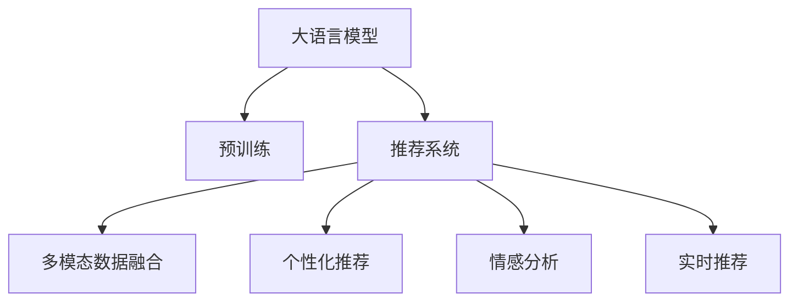

                 

# 大模型推荐中的用户体验提升新思路与实践

> 关键词：大模型推荐,用户体验,推荐算法,数据处理,特征工程,模型优化,推荐系统,算法优化,用户体验提升

## 1. 背景介绍

### 1.1 问题由来
随着互联网的迅速发展，用户在海量信息中快速找到符合自己需求的内容已成为一大挑战。推荐系统应运而生，通过分析用户行为数据，预测用户兴趣，为用户推荐个性化内容。然而，传统的推荐算法往往过于简化，忽略用户的深层次需求和情感因素，难以提供符合预期的用户体验。

近年来，大模型（如GPT-3、BERT等）在自然语言处理（NLP）领域取得了显著进展。大模型通过大规模无标签文本数据的预训练，具备强大的语言理解和生成能力，可以用于推荐系统中进行多模态信息的处理和推荐结果生成。将大模型应用到推荐系统中，可以显著提升推荐系统的准确性和个性化程度，改善用户体验。

### 1.2 问题核心关键点
大模型在推荐系统中的应用，主要体现在以下几个方面：

- **多模态数据处理**：利用大模型强大的语义理解能力，处理和融合文本、图像、音频等多模态数据。
- **个性化推荐生成**：通过大模型对用户行为和兴趣进行深度分析，生成更加精准的推荐结果。
- **情感分析与反馈优化**：通过大模型对用户情感进行分析和反馈优化，提升推荐系统的互动性和用户体验。
- **实时推荐更新**：利用大模型进行实时数据处理和推荐更新，提升推荐系统的响应速度和时效性。

这些关键点共同构成大模型在推荐系统中的核心优势，帮助系统更好地满足用户需求，提升用户体验。

### 1.3 问题研究意义
研究大模型在推荐系统中的应用，对于提升推荐系统性能、改善用户体验、推动技术创新具有重要意义：

1. **提升推荐精度**：大模型通过复杂的特征学习和生成模型，能够捕捉用户行为和内容的深层关系，提供更精准的推荐结果。
2. **增强个性化**：大模型具备自适应学习能力，能够根据用户偏好和行为动态调整推荐策略，提供更符合用户需求的个性化服务。
3. **优化用户交互**：通过情感分析和用户反馈，大模型能够优化推荐系统的交互设计，提升用户满意度和忠诚度。
4. **加速技术落地**：大模型的应用能够降低推荐系统开发的复杂度和成本，加速技术的商业化应用。

因此，将大模型引入推荐系统，是大数据时代提升用户体验的重要手段。

## 2. 核心概念与联系

### 2.1 核心概念概述

为更好地理解大模型在推荐系统中的应用，本节将介绍几个密切相关的核心概念：

- **大模型(大语言模型, LLM)**：以自回归（如GPT-3）或自编码（如BERT）模型为代表的大规模预训练语言模型。通过大规模无标签文本数据的预训练，学习通用的语言表示，具备强大的语言理解和生成能力。

- **预训练(Pre-training)**：指在大规模无标签文本数据上，通过自监督学习任务训练通用语言模型的过程。预训练使得模型学习到语言的通用表示。

- **推荐系统(Recommender System)**：通过分析用户行为数据，预测用户兴趣，为用户推荐个性化内容。包括基于内容的推荐、协同过滤推荐、混合推荐等多种算法。

- **多模态数据融合(Multi-modal Data Fusion)**：通过融合文本、图像、音频等多种数据，提供更加丰富的推荐信息，提升推荐系统的多样性和用户体验。

- **个性化推荐(Personalized Recommendation)**：根据用户偏好和行为，生成符合用户需求和兴趣的推荐结果。

- **情感分析(Sentiment Analysis)**：通过分析用户评论、评分等文本数据，识别用户情感倾向，优化推荐系统。

- **实时推荐(Real-time Recommendation)**：利用实时数据处理和计算能力，动态更新推荐结果，提升推荐系统的响应速度。

这些核心概念之间的逻辑关系可以通过以下Mermaid流程图来展示：



这个流程图展示了大模型的核心概念及其与推荐系统的联系：

1. 大模型通过预训练获得基础能力。
2. 推荐系统利用大模型处理多模态数据，生成个性化推荐。
3. 情感分析引导推荐系统优化推荐策略。
4. 实时推荐支持动态更新推荐结果，提升用户交互体验。

## 3. 核心算法原理 & 具体操作步骤
### 3.1 算法原理概述

基于大模型的推荐系统，本质上是一个通过自监督学习和深度生成模型，结合用户行为数据进行推荐决策的过程。其核心思想是：将大模型视作一个强大的"特征提取器"，通过融合多模态数据，生成用户兴趣和内容的表示，再结合用户行为数据，进行个性化推荐。

形式化地，假设推荐系统输入为 $U$（用户）和 $I$（物品），大模型 $M_{\theta}$ 通过预训练获得基础能力，通过 $f(\cdot)$ 函数生成用户兴趣 $u$ 和物品特征 $i$。推荐系统的目标函数为：

$$
\max_{\theta} \mathbb{E}_{(x_i,y_i) \sim D}[log \sigma(f_{\theta}(x_i))] - \lambda \mathbb{E}_{(x_i,y_i) \sim D}[\|\theta\|_2^2]
$$

其中 $D$ 为推荐数据集，$\sigma(\cdot)$ 为sigmoid函数，$\lambda$ 为正则化系数，$\|\theta\|_2$ 为模型参数的L2正则项。目标函数中，第一部分为推荐系统性能指标，第二部分为模型复杂度控制。

### 3.2 算法步骤详解

基于大模型的推荐系统一般包括以下几个关键步骤：

**Step 1: 数据准备与预处理**
- 收集推荐数据集 $D$，包括用户行为数据、物品属性数据、文本描述等多模态数据。
- 清洗数据，去除噪声和缺失值，进行数据增强。
- 分批处理数据，生成训练集、验证集和测试集。

**Step 2: 构建大模型**
- 选择合适的预训练语言模型，如BERT、GPT-3等，进行微调。
- 在大模型基础上构建推荐模型，如融合多模态数据的自注意力机制，生成个性化推荐。

**Step 3: 模型训练与优化**
- 设计合适的损失函数，如交叉熵损失、均方误差损失等。
- 设置合适的优化算法及其参数，如Adam、SGD等。
- 设置合适的学习率、批大小、迭代轮数等。

**Step 4: 模型评估与测试**
- 在验证集上评估模型性能，优化模型参数。
- 在测试集上评估推荐系统性能，对比微调前后的效果。

**Step 5: 部署与应用**
- 将训练好的模型部署到推荐系统中，进行实时推荐。
- 持续收集用户反馈和行为数据，进行模型更新和迭代优化。

以上是基于大模型的推荐系统的一般流程。在实际应用中，还需要针对具体任务的特点，对模型构建、数据处理、模型优化等环节进行优化设计，以进一步提升推荐系统性能。

### 3.3 算法优缺点

基于大模型的推荐系统具有以下优点：
1. 提升推荐精度：大模型强大的语义理解能力，能够捕捉用户行为和内容的深层关系，生成更精准的推荐结果。
2. 增强个性化：大模型具备自适应学习能力，能够根据用户偏好和行为动态调整推荐策略，提供更符合用户需求的个性化服务。
3. 优化用户体验：通过情感分析和用户反馈，优化推荐系统的交互设计，提升用户满意度和忠诚度。
4. 降低开发成本：利用大模型强大的语义理解能力，减少特征工程的工作量和成本，加速推荐系统的开发。

同时，该方法也存在一定的局限性：
1. 数据依赖性强：大模型的性能很大程度上取决于数据的质量和数量，需要收集大规模、高质量的多模态数据。
2. 模型复杂度高：大模型的参数量和计算复杂度高，对硬件资源和计算能力要求较高。
3. 可解释性差：大模型往往作为黑盒模型，难以解释其内部决策过程和推荐依据。
4. 处理速度慢：大模型的推理速度较慢，可能影响推荐系统的实时性。

尽管存在这些局限性，但就目前而言，基于大模型的推荐系统仍然是一种有效的推荐方式，能够显著提升推荐系统的性能和用户体验。未来相关研究的重点在于如何进一步降低推荐系统对数据的依赖，提高模型的可解释性和实时性，同时兼顾精度和效率。

### 3.4 算法应用领域

基于大模型的推荐系统已经在多个领域得到应用，例如：

- 电子商务：通过分析用户浏览、购买等行为数据，推荐商品。
- 内容推荐：如音乐、视频、新闻等内容的推荐。
- 新闻个性化：根据用户阅读偏好推荐相关新闻。
- 社交网络：推荐用户感兴趣的内容和关系链。
- 健康医疗：根据用户健康数据和查询历史，推荐健康管理方案。

除了这些经典应用外，大模型推荐系统还在智慧城市、教育、金融等领域展现出广阔的应用前景，为各行各业带来新的价值和机遇。

## 4. 数学模型和公式 & 详细讲解  
### 4.1 数学模型构建

本节将使用数学语言对基于大模型的推荐系统进行更加严格的刻画。

记推荐系统输入为 $U=(u_1,u_2,\dots,u_M)$，物品为 $I=(i_1,i_2,\dots,i_N)$，其中 $u$ 为用户兴趣，$i$ 为物品特征。假设大模型 $M_{\theta}$ 通过预训练获得基础能力，生成用户兴趣和物品特征的表示。推荐系统的目标函数为：

$$
\max_{\theta} \mathbb{E}_{(x_i,y_i) \sim D}[log \sigma(f_{\theta}(x_i))] - \lambda \mathbb{E}_{(x_i,y_i) \sim D}[\|\theta\|_2^2]
$$

其中 $D$ 为推荐数据集，$\sigma(\cdot)$ 为sigmoid函数，$\lambda$ 为正则化系数，$\|\theta\|_2$ 为模型参数的L2正则项。目标函数中，第一部分为推荐系统性能指标，第二部分为模型复杂度控制。

### 4.2 公式推导过程

以下我们以用户兴趣推荐为例，推导基于大模型的推荐系统目标函数及其梯度计算公式。

假设大模型 $M_{\theta}$ 在用户兴趣 $u$ 上的表示为 $\hat{u}=M_{\theta}(u)$，物品 $i$ 的表示为 $\hat{i}=M_{\theta}(i)$。定义用户兴趣 $u$ 与物品 $i$ 的匹配度为 $\alpha_{ui}=\hat{u} \cdot \hat{i}$。推荐系统的目标函数可以表示为：

$$
\max_{\theta} \mathbb{E}_{(u_i,y_i) \sim D}[log \sigma(\alpha_{ui})]
$$

其中 $\sigma(\cdot)$ 为sigmoid函数，$\alpha_{ui}$ 为匹配度。目标函数的意义是最大化用户与物品之间的匹配度。

根据链式法则，目标函数对大模型参数 $\theta$ 的梯度为：

$$
\nabla_{\theta} \mathcal{L}(\theta) = \mathbb{E}_{(u_i,y_i) \sim D}[\frac{\partial \alpha_{ui}}{\partial \theta} \nabla_{\alpha_{ui}}log \sigma(\alpha_{ui})]
$$

其中 $\nabla_{\alpha_{ui}}log \sigma(\alpha_{ui})$ 为匹配度对sigmoid函数的梯度，可以通过链式法则递归展开计算。

在得到目标函数的梯度后，即可带入优化算法，完成推荐系统的迭代优化。重复上述过程直至收敛，最终得到适应推荐任务的最优模型参数 $\theta^*$。

## 5. 项目实践：代码实例和详细解释说明
### 5.1 开发环境搭建

在进行推荐系统开发前，我们需要准备好开发环境。以下是使用Python进行PyTorch开发的环境配置流程：

1. 安装Anaconda：从官网下载并安装Anaconda，用于创建独立的Python环境。

2. 创建并激活虚拟环境：
```bash
conda create -n recsys-env python=3.8 
conda activate recsys-env
```

3. 安装PyTorch：根据CUDA版本，从官网获取对应的安装命令。例如：
```bash
conda install pytorch torchvision torchaudio cudatoolkit=11.1 -c pytorch -c conda-forge
```

4. 安装推荐系统相关库：
```bash
pip install pandas numpy scikit-learn matplotlib tqdm jupyter notebook ipython
```

5. 安装大模型相关库：
```bash
pip install transformers
```

完成上述步骤后，即可在`recsys-env`环境中开始推荐系统开发。

### 5.2 源代码详细实现

下面我们以用户兴趣推荐为例，给出使用Transformers库对BERT模型进行推荐系统微调的PyTorch代码实现。

首先，定义推荐系统数据处理函数：

```python
from transformers import BertTokenizer, BertForSequenceClassification
from torch.utils.data import Dataset
import torch

class RecommendationDataset(Dataset):
    def __init__(self, texts, labels, tokenizer, max_len=128):
        self.texts = texts
        self.labels = labels
        self.tokenizer = tokenizer
        self.max_len = max_len
        
    def __len__(self):
        return len(self.texts)
    
    def __getitem__(self, item):
        text = self.texts[item]
        label = self.labels[item]
        
        encoding = self.tokenizer(text, return_tensors='pt', max_length=self.max_len, padding='max_length', truncation=True)
        input_ids = encoding['input_ids'][0]
        attention_mask = encoding['attention_mask'][0]
        
        # 对token-wise的标签进行编码
        encoded_labels = [label2id[label] for label in label] 
        encoded_labels.extend([label2id['0']] * (self.max_len - len(encoded_labels)))
        labels = torch.tensor(encoded_labels, dtype=torch.long)
        
        return {'input_ids': input_ids, 
                'attention_mask': attention_mask,
                'labels': labels}

# 标签与id的映射
label2id = {'0': 0, '1': 1, '2': 2, '3': 3, '4': 4}
id2label = {v: k for k, v in label2id.items()}

# 创建dataset
tokenizer = BertTokenizer.from_pretrained('bert-base-cased')

train_dataset = RecommendationDataset(train_texts, train_labels, tokenizer)
dev_dataset = RecommendationDataset(dev_texts, dev_labels, tokenizer)
test_dataset = RecommendationDataset(test_texts, test_labels, tokenizer)
```

然后，定义模型和优化器：

```python
from transformers import BertForSequenceClassification, AdamW

model = BertForSequenceClassification.from_pretrained('bert-base-cased', num_labels=len(label2id))

optimizer = AdamW(model.parameters(), lr=2e-5)
```

接着，定义训练和评估函数：

```python
from torch.utils.data import DataLoader
from tqdm import tqdm
from sklearn.metrics import accuracy_score

device = torch.device('cuda') if torch.cuda.is_available() else torch.device('cpu')
model.to(device)

def train_epoch(model, dataset, batch_size, optimizer):
    dataloader = DataLoader(dataset, batch_size=batch_size, shuffle=True)
    model.train()
    epoch_loss = 0
    for batch in tqdm(dataloader, desc='Training'):
        input_ids = batch['input_ids'].to(device)
        attention_mask = batch['attention_mask'].to(device)
        labels = batch['labels'].to(device)
        model.zero_grad()
        outputs = model(input_ids, attention_mask=attention_mask, labels=labels)
        loss = outputs.loss
        epoch_loss += loss.item()
        loss.backward()
        optimizer.step()
    return epoch_loss / len(dataloader)

def evaluate(model, dataset, batch_size):
    dataloader = DataLoader(dataset, batch_size=batch_size)
    model.eval()
    preds, labels = [], []
    with torch.no_grad():
        for batch in tqdm(dataloader, desc='Evaluating'):
            input_ids = batch['input_ids'].to(device)
            attention_mask = batch['attention_mask'].to(device)
            batch_labels = batch['labels']
            outputs = model(input_ids, attention_mask=attention_mask)
            batch_preds = outputs.logits.argmax(dim=2).to('cpu').tolist()
            batch_labels = batch_labels.to('cpu').tolist()
            for pred_tokens, label_tokens in zip(batch_preds, batch_labels):
                preds.append(pred_tokens[:len(label_tokens)])
                labels.append(label_tokens)
                
    print(accuracy_score(labels, preds))
```

最后，启动训练流程并在测试集上评估：

```python
epochs = 5
batch_size = 16

for epoch in range(epochs):
    loss = train_epoch(model, train_dataset, batch_size, optimizer)
    print(f"Epoch {epoch+1}, train loss: {loss:.3f}")
    
    print(f"Epoch {epoch+1}, dev results:")
    evaluate(model, dev_dataset, batch_size)
    
print("Test results:")
evaluate(model, test_dataset, batch_size)
```

以上就是使用PyTorch对BERT进行用户兴趣推荐任务的微调的完整代码实现。可以看到，得益于Transformers库的强大封装，我们可以用相对简洁的代码完成BERT模型的加载和微调。

### 5.3 代码解读与分析

让我们再详细解读一下关键代码的实现细节：

**RecommendationDataset类**：
- `__init__`方法：初始化文本、标签、分词器等关键组件。
- `__len__`方法：返回数据集的样本数量。
- `__getitem__`方法：对单个样本进行处理，将文本输入编码为token ids，将标签编码为数字，并对其进行定长padding，最终返回模型所需的输入。

**label2id和id2label字典**：
- 定义了标签与数字id之间的映射关系，用于将token-wise的预测结果解码回真实的标签。

**训练和评估函数**：
- 使用PyTorch的DataLoader对数据集进行批次化加载，供模型训练和推理使用。
- 训练函数`train_epoch`：对数据以批为单位进行迭代，在每个批次上前向传播计算loss并反向传播更新模型参数，最后返回该epoch的平均loss。
- 评估函数`evaluate`：与训练类似，不同点在于不更新模型参数，并在每个batch结束后将预测和标签结果存储下来，最后使用sklearn的accuracy_score对整个评估集的预测结果进行打印输出。

**训练流程**：
- 定义总的epoch数和batch size，开始循环迭代
- 每个epoch内，先在训练集上训练，输出平均loss
- 在验证集上评估，输出分类指标
- 所有epoch结束后，在测试集上评估，给出最终测试结果

可以看到，PyTorch配合Transformers库使得BERT微调的代码实现变得简洁高效。开发者可以将更多精力放在数据处理、模型改进等高层逻辑上，而不必过多关注底层的实现细节。

当然，工业级的系统实现还需考虑更多因素，如模型的保存和部署、超参数的自动搜索、更灵活的任务适配层等。但核心的微调范式基本与此类似。

## 6. 实际应用场景
### 6.1 智能推荐引擎

智能推荐引擎利用大模型强大的多模态数据处理能力，为用户提供个性化的内容推荐。传统推荐系统往往依赖单一特征，如用户行为、物品属性等，难以捕捉深层次的语义信息。而通过大模型的多模态融合，推荐引擎能够充分利用用户行为、文本、图像等多维数据，生成更加精准和多样化的推荐结果。

在技术实现上，可以收集用户浏览历史、评分记录、评论文本等多模态数据，对数据进行预处理和编码。在大模型上进行多模态融合，生成用户兴趣和物品特征的表示。结合用户行为数据，利用推荐算法生成推荐结果。通过定期更新模型参数，保持推荐系统的时效性。

### 6.2 社交网络推荐系统

社交网络推荐系统利用大模型处理用户社交关系和行为数据，为用户推荐新的朋友和内容。推荐系统通过分析用户互动数据，识别出用户的朋友圈和兴趣点，生成推荐结果。

具体而言，可以收集用户的社交关系、评论记录、互动行为等数据，对数据进行预处理和编码。在大模型上进行多模态融合，生成用户和物品的表示。结合社交关系数据，利用推荐算法生成推荐结果。通过定期更新模型参数，保持推荐系统的时效性。

### 6.3 实时推荐系统

实时推荐系统利用大模型强大的实时处理能力，动态更新推荐结果，提升推荐系统的响应速度。推荐系统通过分析用户实时行为数据，动态生成推荐结果，提高用户交互的即时性。

具体而言，可以收集用户的实时行为数据，如搜索记录、点击行为等，对数据进行预处理和编码。在大模型上进行实时处理，生成用户兴趣和物品特征的表示。结合实时行为数据，利用推荐算法生成推荐结果。通过实时更新模型参数，保持推荐系统的时效性。

### 6.4 未来应用展望

随着大模型推荐系统的不断发展，其在更多领域的应用前景广阔，为各行各业带来新的价值和机遇。

在智慧城市中，推荐系统可以用于推荐实时交通信息、旅游路线等，提升城市管理和居民生活体验。

在医疗领域，推荐系统可以用于推荐健康管理方案、药品、医院等，提升医疗服务的个性化和效率。

在教育领域，推荐系统可以用于推荐学习资源、课程、教材等，提升教育质量和学习效果。

此外，在智慧金融、智能家居、智慧物流等领域，大模型推荐系统也将广泛应用，为各个行业的数字化转型提供新的动力。

## 7. 工具和资源推荐
### 7.1 学习资源推荐

为了帮助开发者系统掌握大模型在推荐系统中的应用，这里推荐一些优质的学习资源：

1. 《Recommender Systems in Practice》系列博文：由大模型技术专家撰写，深入浅出地介绍了推荐系统原理、模型构建、特征工程等基本概念。

2. CS234《Deep Learning for Recommender Systems》课程：斯坦福大学开设的推荐系统明星课程，有Lecture视频和配套作业，带你入门推荐系统领域。

3. 《Deep Recommendation Systems》书籍：详细介绍了推荐系统的各种算法和技术，涵盖多模态数据处理、模型优化等内容。

4. KDD 2019 workshop on Deep Learning and Recommendation Systems：推荐的最新研究动态和论文，帮助你了解前沿研究进展。

5. PyTorch官方文档：PyTorch的推荐系统官方文档，提供了丰富的代码样例和教程，是上手实践的必备资料。

通过对这些资源的学习实践，相信你一定能够快速掌握大模型在推荐系统中的应用，并用于解决实际的推荐问题。
###  7.2 开发工具推荐

高效的开发离不开优秀的工具支持。以下是几款用于大模型推荐系统开发的常用工具：

1. PyTorch：基于Python的开源深度学习框架，灵活动态的计算图，适合快速迭代研究。大部分预训练语言模型都有PyTorch版本的实现。

2. TensorFlow：由Google主导开发的开源深度学习框架，生产部署方便，适合大规模工程应用。同样有丰富的预训练语言模型资源。

3. Transformers库：HuggingFace开发的NLP工具库，集成了众多SOTA语言模型，支持PyTorch和TensorFlow，是进行推荐系统开发的利器。

4. Weights & Biases：模型训练的实验跟踪工具，可以记录和可视化模型训练过程中的各项指标，方便对比和调优。与主流深度学习框架无缝集成。

5. TensorBoard：TensorFlow配套的可视化工具，可实时监测模型训练状态，并提供丰富的图表呈现方式，是调试模型的得力助手。

6. Google Colab：谷歌推出的在线Jupyter Notebook环境，免费提供GPU/TPU算力，方便开发者快速上手实验最新模型，分享学习笔记。

合理利用这些工具，可以显著提升大模型推荐系统的开发效率，加快创新迭代的步伐。

### 7.3 相关论文推荐

大模型推荐系统的研究源于学界的持续研究。以下是几篇奠基性的相关论文，推荐阅读：

1. Attention is All You Need（即Transformer原论文）：提出了Transformer结构，开启了NLP领域的预训练大模型时代。

2. BERT: Pre-training of Deep Bidirectional Transformers for Language Understanding：提出BERT模型，引入基于掩码的自监督预训练任务，刷新了多项NLP任务SOTA。

3. MAML: Learning to Recommend with Missing Features via Meta-Learning：提出Meta-Learning方法，利用少量有标注数据，训练推荐模型。

4. Dive into Deep Learning：推荐系统领域的经典教材，详细介绍了推荐系统的各种算法和技术。

5. Deep Collaborative Filtering using Neural Factor Graphs：提出神经因子图模型，利用神经网络处理推荐系统中的协同过滤问题。

这些论文代表了大模型推荐系统的发展脉络。通过学习这些前沿成果，可以帮助研究者把握学科前进方向，激发更多的创新灵感。

## 8. 总结：未来发展趋势与挑战

### 8.1 总结

本文对基于大模型的推荐系统进行了全面系统的介绍。首先阐述了大模型和推荐系统的研究背景和意义，明确了其在提升推荐系统性能和用户体验方面的独特价值。其次，从原理到实践，详细讲解了大模型推荐系统的数学原理和关键步骤，给出了推荐系统开发的完整代码实例。同时，本文还广泛探讨了大模型推荐系统在多个领域的应用前景，展示了其在提升用户体验方面的巨大潜力。此外，本文精选了大模型推荐系统的各类学习资源，力求为读者提供全方位的技术指引。

通过本文的系统梳理，可以看到，大模型在推荐系统中的应用，对于提升推荐系统性能、改善用户体验、推动技术创新具有重要意义。大模型的强大多模态处理能力，能够捕捉用户行为和内容的深层关系，生成更加精准和多样化的推荐结果。大模型的实时处理能力，能够动态更新推荐结果，提高推荐系统的响应速度。大模型的强大表达能力，能够处理多维数据，提高推荐系统的个性化和多样性。

### 8.2 未来发展趋势

展望未来，大模型在推荐系统中的应用将呈现以下几个发展趋势：

1. 多模态数据融合。利用大模型的多模态处理能力，融合用户行为、文本、图像、音频等多种数据，生成更加丰富和多样化的推荐结果。

2. 实时推荐技术。利用大模型的实时处理能力，动态更新推荐结果，提高推荐系统的响应速度和时效性。

3. 参数高效的推荐算法。开发更加参数高效的推荐算法，减少大模型参数量，降低计算资源消耗，提高推荐系统效率。

4. 用户情感分析。利用大模型的情感分析能力，识别用户情感倾向，优化推荐策略，提高推荐系统的主观性和互动性。

5. 跨领域推荐系统。利用大模型的跨领域迁移能力，将推荐系统应用于不同领域，提升推荐系统的普适性和覆盖面。

6. 集成学习与推荐。结合集成学习技术，利用多个模型的优势，提高推荐系统的稳定性和鲁棒性。

以上趋势凸显了大模型在推荐系统中的核心优势，帮助推荐系统更好地满足用户需求，提升用户体验。

### 8.3 面临的挑战

尽管大模型推荐系统取得了显著进展，但在迈向更加智能化、普适化应用的过程中，仍面临以下挑战：

1. 数据依赖性强。大模型的性能很大程度上取决于数据的质量和数量，需要收集大规模、高质量的多模态数据。数据获取和预处理成本较高。

2. 模型复杂度高。大模型的参数量和计算复杂度高，对硬件资源和计算能力要求较高。资源优化技术有待进一步提升。

3. 可解释性差。大模型往往作为黑盒模型，难以解释其内部决策过程和推荐依据。用户难以理解和信任推荐结果。

4. 处理速度慢。大模型的推理速度较慢，可能影响推荐系统的实时性。模型优化技术有待进一步提升。

尽管存在这些挑战，但通过不断优化和创新，大模型推荐系统仍有望在未来的推荐系统中发挥重要作用，为各行各业带来新的价值和机遇。未来研究需要在降低数据依赖、提高模型可解释性、优化实时性能等方面寻求新的突破。

### 8.4 研究展望

面向未来，大模型推荐系统需要继续探索和创新，不断提升其性能和用户体验。以下是几个研究方向：

1. 探索无监督和半监督推荐方法。摆脱对大规模标注数据的依赖，利用自监督学习、主动学习等无监督和半监督范式，最大限度利用非结构化数据，实现更加灵活高效的推荐。

2. 研究参数高效和计算高效的推荐算法。开发更加参数高效的推荐算法，减少大模型参数量，降低计算资源消耗，提高推荐系统效率。

3. 融合因果和对比学习范式。通过引入因果推断和对比学习思想，增强推荐系统的稳定性，学习更加普适、鲁棒的用户表示。

4. 引入更多先验知识。将符号化的先验知识，如知识图谱、逻辑规则等，与神经网络模型进行巧妙融合，引导推荐系统学习更准确、合理的用户表示。

5. 结合因果分析和博弈论工具。将因果分析方法引入推荐系统，识别出推荐系统的关键特征，增强推荐系统的稳定性。借助博弈论工具刻画人机交互过程，主动探索并规避系统的脆弱点，提高系统稳定性。

6. 纳入伦理道德约束。在推荐系统训练目标中引入伦理导向的评估指标，过滤和惩罚有偏见、有害的输出倾向。同时加强人工干预和审核，建立推荐系统的监管机制，确保推荐系统的公平性和可信度。

这些研究方向的探索，必将引领大模型推荐系统技术迈向更高的台阶，为构建安全、可靠、可解释、可控的智能系统铺平道路。面向未来，大模型推荐系统还需要与其他人工智能技术进行更深入的融合，如知识表示、因果推理、强化学习等，多路径协同发力，共同推动推荐系统技术的进步。

## 9. 附录：常见问题与解答

**Q1：大模型推荐是否适用于所有推荐场景？**

A: 大模型推荐系统在大多数推荐场景中都能取得不错的效果，特别是对于数据量较小的场景。但对于一些特定领域的推荐，如医疗、法律等，仅仅依靠通用语料预训练的模型可能难以很好地适应。此时需要在特定领域语料上进一步预训练，再进行推荐，才能获得理想效果。

**Q2：推荐系统中的用户兴趣如何建模？**

A: 用户兴趣建模是推荐系统的核心问题。在基于大模型的推荐系统中，用户兴趣可以通过大模型对用户行为和内容的语义表示进行建模。具体而言，可以使用预训练的大模型生成用户兴趣的表示，再结合用户行为数据进行训练，优化用户兴趣的表示。此外，可以利用多模态融合技术，进一步提升用户兴趣建模的准确性和多样性。

**Q3：如何优化大模型的实时推荐性能？**

A: 实时推荐系统需要高效的实时处理能力，才能动态更新推荐结果，提高推荐系统的响应速度。优化实时推荐性能的关键在于选择合适的模型结构和优化算法，减少前向传播和反向传播的计算量。同时，可以采用并行计算和分布式训练等技术，加速模型训练和推理过程。

**Q4：大模型推荐系统如何应对数据稀疏性问题？**

A: 数据稀疏性是大模型推荐系统面临的一个重要问题。大模型推荐系统可以通过以下方法应对数据稀疏性：
1. 数据增强：通过回译、近义替换等方式扩充训练集。
2. 隐式反馈：利用用户的隐式反馈（如点击、浏览记录）进行推荐，减少对显式标注数据的依赖。
3. 对抗训练：引入对抗样本，提高模型的鲁棒性，减少数据稀疏性的影响。

**Q5：大模型推荐系统如何降低计算成本？**

A: 大模型推荐系统在高计算资源投入下，如何提升效率，降低计算成本，是当前研究的重点之一。以下是几种可行的方法：
1. 参数高效推荐算法：开发更加参数高效的推荐算法，减少大模型参数量，降低计算资源消耗。
2. 知识蒸馏：通过知识蒸馏技术，将大模型的知识转移到轻量级模型，减少计算资源消耗。
3. 多任务学习：通过多任务学习技术，让大模型在多个推荐任务中共享参数，减少模型训练和推理的计算量。

这些方法可以帮助大模型推荐系统在高效利用计算资源的同时，提升推荐系统的性能和实时性。

---

作者：禅与计算机程序设计艺术 / Zen and the Art of Computer Programming

