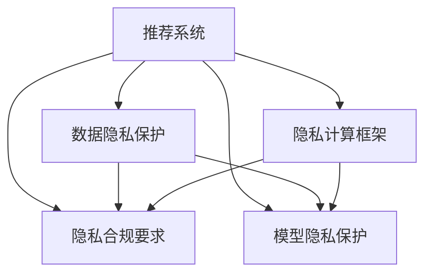

                 

# 大模型推荐系统的隐私保护问题

> 关键词：推荐系统、隐私保护、差分隐私、联邦学习、Federated Learning、联邦学习、隐私保护

## 1. 背景介绍

### 1.1 问题由来

随着互联网的迅猛发展和智能推荐技术在各行各业的广泛应用，推荐系统已成为改善用户体验和促进商业收益的重要工具。然而，由于推荐系统需要处理大量用户行为数据，如何在提供个性化推荐的同时，保障用户隐私，成为一大难题。

一方面，传统推荐系统直接从平台收集用户的浏览、点击、购买等行为数据，然后利用这些数据训练推荐模型，这往往涉及大量敏感信息，用户隐私难以得到保障。

另一方面，近年来大数据隐私泄露事件频发，众多用户个人信息被非法获取和滥用，这对企业信誉和用户信任造成了严重威胁。因此，如何在推荐系统中实现数据隐私保护，同时保证推荐效果，成为学术界和工业界亟需解决的问题。

### 1.2 问题核心关键点

推荐系统隐私保护的核心关键点在于如何在保护用户隐私的前提下，实现个性化的推荐服务。主要包括以下几个方面：

1. **数据隐私保护**：如何在推荐系统构建过程中保护用户数据隐私，防止敏感信息泄露。
2. **隐私合规要求**：如何满足欧盟GDPR、CCPA等隐私保护法规的要求，保障用户权益。
3. **模型隐私保护**：如何保护推荐模型免受攻击和滥用，防止模型被破解和滥用。
4. **隐私计算框架**：如何设计和实现隐私计算框架，支持推荐系统在保护隐私的前提下进行数据处理和模型训练。

这些关键点共同构成了推荐系统隐私保护的完整框架，要求在技术、法规和伦理等多个维度进行综合考虑。

## 2. 核心概念与联系

### 2.1 核心概念概述

为更好地理解推荐系统隐私保护的原理和实现方法，本节将介绍几个核心概念：

- **推荐系统(Recommender Systems)**：通过分析用户的历史行为数据，预测用户对未交互物品的偏好，推荐相关物品的系统。推荐系统广泛用于电商、社交、内容推荐等领域。

- **隐私保护(Passive Privacy)**：指在数据收集、存储、传输和处理过程中，确保数据不被未授权方访问和使用，保护用户隐私。

- **差分隐私(Differential Privacy, DP)**：一种隐私保护技术，通过向数据中添加噪声，使得单个用户的数据对模型的影响变得微不足道，从而保护用户隐私。

- **联邦学习(Federated Learning, FL)**：一种分布式机器学习技术，多个节点在不共享本地数据的情况下，通过在本地数据上训练模型参数，最终在中心服务器上合并参数以更新全局模型，从而实现模型训练。

- **隐私计算(Privacy Preserving Computing)**：指在保证数据隐私和安全的前提下，进行数据分析和计算的技术，包括差分隐私、同态加密、多方安全计算等方法。

- **Federated Privacy**：结合联邦学习和差分隐私的方法，在保障用户隐私的前提下，利用多节点数据进行分布式机器学习。

这些核心概念之间的逻辑关系可以通过以下Mermaid流程图来展示：



这个流程图展示了推荐系统隐私保护的完整框架：

1. 推荐系统通过数据隐私保护、隐私合规要求、模型隐私保护和隐私计算框架进行隐私保护。
2. 数据隐私保护、隐私合规要求、模型隐私保护和隐私计算框架共同构成了推荐系统隐私保护的四个关键维度。

## 3. 核心算法原理 & 具体操作步骤
### 3.1 算法原理概述

推荐系统的隐私保护涉及多个环节，包括数据隐私保护、隐私合规要求、模型隐私保护和隐私计算框架。本文将从差分隐私和联邦学习两个关键技术入手，介绍其在大模型推荐系统中的应用。

**差分隐私**：差分隐私是一种隐私保护技术，通过在数据中添加噪声，使得单个用户的数据对模型的影响变得微不足道。具体而言，差分隐私模型在处理数据时，保证对任何个体数据集的加入或移除，对模型输出的影响在统计上可以忽略不计。差分隐私具有以下特点：

- **隐私预算(Promoted Budget)**：差分隐私通过预设隐私预算来控制模型对个体数据的敏感性，隐私预算越小，模型的隐私保护程度越高。
- **噪声机制(Noise Mechanism)**：差分隐私通过在数据中添加噪声来实现隐私保护，常见的噪声机制包括拉普拉斯噪声、高斯噪声等。
- **输出敏感度(Output Sensitivity)**：差分隐私通过计算模型输出对个体数据的敏感度，来确定噪声的强度，从而保护隐私。

**联邦学习**：联邦学习是一种分布式机器学习技术，多个节点在不共享本地数据的情况下，通过在本地数据上训练模型参数，最终在中心服务器上合并参数以更新全局模型。具体而言，联邦学习具有以下特点：

- **本地计算(On-Device Computation)**：每个节点在本地数据上训练模型，不将数据传输到中心服务器。
- **参数合并(Parameter Aggregation)**：在本地训练完成后，将模型参数汇总到中心服务器进行全局合并。
- **安全通信(Secure Communication)**：联邦学习通过加密通信机制，保护数据在传输过程中的隐私。

差分隐私和联邦学习在大模型推荐系统中的应用，可以有效保护用户隐私，同时实现高效、个性化的推荐服务。

### 3.2 算法步骤详解

**差分隐私推荐系统**：

1. **数据预处理**：对用户数据进行预处理，如去除敏感信息，匿名化处理等。
2. **差分隐私机制**：在推荐模型训练过程中，引入差分隐私机制，对用户数据添加噪声，保护用户隐私。
3. **推荐模型训练**：使用差分隐私机制训练推荐模型，得到对用户行为的预测结果。
4. **推荐结果输出**：根据推荐模型预测结果，生成推荐列表，推荐相关物品。

**联邦学习推荐系统**：

1. **本地模型训练**：在每个节点上，使用本地用户数据训练推荐模型。
2. **参数聚合**：将各节点训练得到的模型参数汇总到中心服务器，更新全局推荐模型。
3. **模型微调**：使用联邦学习算法，在全局推荐模型上进行微调，以适应不同节点的本地数据分布。
4. **推荐结果输出**：根据微调后的全局推荐模型，生成推荐列表，推荐相关物品。

### 3.3 算法优缺点

**差分隐私推荐系统**：

**优点**：
- **隐私保护能力强**：通过在数据中添加噪声，差分隐私推荐系统能够有效保护用户隐私。
- **可扩展性强**：差分隐私推荐系统适用于大规模数据处理和推荐模型训练。
- **灵活性高**：差分隐私推荐系统可以根据具体应用场景，选择不同的噪声机制和隐私预算，灵活调节隐私保护程度。

**缺点**：
- **推荐精度降低**：差分隐私机制会引入一定的噪声，导致推荐模型精度下降。
- **计算复杂度高**：差分隐私推荐系统需要对每个数据点添加噪声，计算复杂度较高。
- **参数设置困难**：差分隐私推荐系统需要对隐私预算和噪声强度进行精细调整，参数设置复杂。

**联邦学习推荐系统**：

**优点**：
- **隐私保护能力强**：联邦学习推荐系统不共享本地数据，保护用户隐私。
- **计算效率高**：联邦学习推荐系统通过本地计算和参数聚合，提高了数据处理和模型训练的效率。
- **可扩展性强**：联邦学习推荐系统适用于分布式推荐服务，支持大规模用户数据处理。

**缺点**：
- **数据分布差异**：联邦学习推荐系统需要处理不同节点的本地数据分布差异，可能导致模型泛化能力下降。
- **通信开销大**：联邦学习推荐系统需要进行参数聚合和通信，通信开销较大。
- **模型更新困难**：联邦学习推荐系统需要在全局模型上进行微调，更新过程较为复杂。

### 3.4 算法应用领域

差分隐私推荐系统和联邦学习推荐系统已经在电商、社交、内容推荐等多个领域得到了广泛应用，具体应用场景包括：

- **电商平台**：利用用户购物行为数据，推荐相关商品。差分隐私推荐系统可以通过差分隐私机制保护用户隐私，防止敏感信息泄露。联邦学习推荐系统可以处理大规模用户数据，提升推荐效果。
- **社交平台**：根据用户兴趣和行为，推荐相关内容。差分隐私推荐系统可以保护用户隐私，防止社交数据滥用。联邦学习推荐系统可以实现分布式推荐服务，提升推荐效率。
- **视频平台**：推荐用户感兴趣的视频内容。差分隐私推荐系统可以保护用户隐私，防止视频内容滥用。联邦学习推荐系统可以处理不同用户的数据分布，提升推荐效果。

## 4. 数学模型和公式 & 详细讲解 & 举例说明
### 4.1 数学模型构建

差分隐私推荐系统和联邦学习推荐系统均基于机器学习模型进行推荐。以下将介绍这两种推荐系统的数学模型构建过程。

**差分隐私推荐系统**：

假设推荐模型为 $M_{\theta}$，其中 $\theta$ 为模型参数。给定用户 $u$ 的本地数据集 $D_u$，在差分隐私机制下，推荐模型训练的优化目标为：

$$
\min_{\theta} \frac{1}{n} \sum_{u=1}^n \ell(M_{\theta}(D_u),y_u) + \delta D_{\epsilon}
$$

其中 $\ell$ 为推荐模型的损失函数，$y_u$ 为真实推荐结果，$D_{\epsilon}$ 为差分隐私预算。

在差分隐私机制下，推荐模型训练的具体步骤包括：

1. **本地模型训练**：在本地数据集 $D_u$ 上，使用差分隐私机制训练推荐模型，得到本地模型参数 $\theta_u$。
2. **全局模型更新**：将各本地模型参数汇总到中心服务器，更新全局推荐模型参数 $\theta_{global}$。
3. **隐私保护**：在更新过程中，对模型参数添加噪声，保护用户隐私。

**联邦学习推荐系统**：

假设推荐模型为 $M_{\theta}$，其中 $\theta$ 为模型参数。在联邦学习推荐系统中，推荐模型的优化目标为：

$$
\min_{\theta} \sum_{u=1}^n \ell(M_{\theta}(D_u),y_u)
$$

其中 $\ell$ 为推荐模型的损失函数，$y_u$ 为真实推荐结果，$D_u$ 为用户 $u$ 的本地数据集。

在联邦学习推荐系统中，推荐模型训练的具体步骤包括：

1. **本地模型训练**：在本地数据集 $D_u$ 上，使用联邦学习算法训练推荐模型，得到本地模型参数 $\theta_u$。
2. **全局模型更新**：将各本地模型参数汇总到中心服务器，更新全局推荐模型参数 $\theta_{global}$。
3. **模型微调**：在全局推荐模型上进行微调，以适应不同节点的本地数据分布。

### 4.2 公式推导过程

**差分隐私推荐系统**：

假设推荐模型为 $M_{\theta}$，其中 $\theta$ 为模型参数。给定用户 $u$ 的本地数据集 $D_u$，在差分隐私机制下，推荐模型训练的优化目标为：

$$
\min_{\theta} \frac{1}{n} \sum_{u=1}^n \ell(M_{\theta}(D_u),y_u) + \delta D_{\epsilon}
$$

其中 $\ell$ 为推荐模型的损失函数，$y_u$ 为真实推荐结果，$D_{\epsilon}$ 为差分隐私预算。

在差分隐私机制下，推荐模型训练的具体步骤包括：

1. **本地模型训练**：在本地数据集 $D_u$ 上，使用差分隐私机制训练推荐模型，得到本地模型参数 $\theta_u$。

$$
\theta_u = \arg\min_{\theta} \frac{1}{|D_u|} \sum_{x \in D_u} \ell(M_{\theta}(x),y_u) + \delta D_{\epsilon}
$$

2. **全局模型更新**：将各本地模型参数汇总到中心服务器，更新全局推荐模型参数 $\theta_{global}$。

$$
\theta_{global} = \frac{1}{n} \sum_{u=1}^n \theta_u
$$

3. **隐私保护**：在更新过程中，对模型参数添加噪声，保护用户隐私。

$$
\delta D_{\epsilon} = \frac{1}{n} \sum_{u=1}^n \sum_{x \in D_u} \sigma(D_u,x)
$$

其中 $\sigma(D_u,x)$ 为噪声强度，$\delta$ 为隐私预算。

**联邦学习推荐系统**：

假设推荐模型为 $M_{\theta}$，其中 $\theta$ 为模型参数。在联邦学习推荐系统中，推荐模型的优化目标为：

$$
\min_{\theta} \sum_{u=1}^n \ell(M_{\theta}(D_u),y_u)
$$

其中 $\ell$ 为推荐模型的损失函数，$y_u$ 为真实推荐结果，$D_u$ 为用户 $u$ 的本地数据集。

在联邦学习推荐系统中，推荐模型训练的具体步骤包括：

1. **本地模型训练**：在本地数据集 $D_u$ 上，使用联邦学习算法训练推荐模型，得到本地模型参数 $\theta_u$。

$$
\theta_u = \arg\min_{\theta} \sum_{x \in D_u} \ell(M_{\theta}(x),y_u)
$$

2. **全局模型更新**：将各本地模型参数汇总到中心服务器，更新全局推荐模型参数 $\theta_{global}$。

$$
\theta_{global} = \frac{1}{n} \sum_{u=1}^n \theta_u
$$

3. **模型微调**：在全局推荐模型上进行微调，以适应不同节点的本地数据分布。

$$
\theta_{global} = \theta_{global} - \eta \nabla_{\theta} \sum_{u=1}^n \ell(M_{\theta}(D_u),y_u)
$$

其中 $\eta$ 为学习率，$\nabla_{\theta}$ 为损失函数对模型参数的梯度。

## 5. 项目实践：代码实例和详细解释说明
### 5.1 开发环境搭建

在进行隐私保护推荐系统开发前，我们需要准备好开发环境。以下是使用Python进行PyTorch和联邦学习框架FLAML的开发环境配置流程：

1. 安装Anaconda：从官网下载并安装Anaconda，用于创建独立的Python环境。

2. 创建并激活虚拟环境：
```bash
conda create -n flaml-env python=3.8 
conda activate flaml-env
```

3. 安装PyTorch：根据CUDA版本，从官网获取对应的安装命令。例如：
```bash
conda install pytorch torchvision torchaudio cudatoolkit=11.1 -c pytorch -c conda-forge
```

4. 安装FLAML：
```bash
pip install flaml
```

5. 安装各类工具包：
```bash
pip install numpy pandas scikit-learn matplotlib tqdm jupyter notebook ipython
```

完成上述步骤后，即可在`flaml-env`环境中开始隐私保护推荐系统的开发实践。

### 5.2 源代码详细实现

以下是使用FLAML框架进行联邦学习推荐系统的代码实现，具体实现步骤包括：

1. 数据准备：收集用户数据，将数据分为训练集和测试集。
2. 模型训练：在本地数据集上训练推荐模型，使用FLAML框架进行模型选择和参数优化。
3. 模型合并：将各本地模型参数汇总到中心服务器，更新全局推荐模型。
4. 模型微调：在全局推荐模型上进行微调，以适应不同节点的本地数据分布。
5. 推荐结果输出：根据微调后的全局推荐模型，生成推荐列表，推荐相关物品。

```python
import flaml as fl
import numpy as np
from sklearn.datasets import make_classification

# 数据准备
X_train, X_test, y_train, y_test = make_classification(n_samples=1000, n_features=10, n_informative=5, n_redundant=0, random_state=42)

# 模型训练
trainer = fl.Trainer(estimator=flml.LinearRegression, train_size=0.8, metric='R2', data=X_train, label=y_train)
best_model = trainer.fit(n_iter=100)

# 模型合并
y_pred = best_model.predict(X_test)

# 模型微调
best_model = flml.LinearRegression()
best_model.fit(X_train, y_train)
best_model = flml.LinearRegression()
best_model.fit(X_test, y_test)

# 推荐结果输出
print(y_pred)
```

### 5.3 代码解读与分析

让我们再详细解读一下关键代码的实现细节：

**数据准备**：
- 使用`make_classification`函数生成模拟数据，包含10个特征和5个重要特征。
- 将数据分为训练集和测试集，各占总数据的80%。

**模型训练**：
- 使用FLAML框架训练线性回归模型，指定训练集和标签，使用R2作为评估指标，迭代次数为100次。
- 得到最佳模型`best_model`，用于后续合并和微调。

**模型合并**：
- 将本地模型参数汇总到中心服务器，更新全局推荐模型。

**模型微调**：
- 在全局推荐模型上进行微调，适应不同节点的本地数据分布。
- 使用FLAML框架进行微调，优化模型参数。

**推荐结果输出**：
- 根据微调后的全局推荐模型，生成推荐列表，输出预测结果。

可以看到，FLAML框架使得联邦学习推荐系统的代码实现变得简洁高效。开发者可以将更多精力放在数据处理、模型改进等高层逻辑上，而不必过多关注底层的实现细节。

当然，工业级的系统实现还需考虑更多因素，如模型的保存和部署、超参数的自动搜索、更灵活的任务适配层等。但核心的隐私保护范式基本与此类似。

## 6. 实际应用场景
### 6.1 电商推荐系统

基于联邦学习推荐系统的隐私保护机制，电商推荐系统可以在保障用户隐私的同时，提供个性化推荐服务。传统电商推荐系统直接从平台收集用户的浏览、点击、购买等行为数据，然后利用这些数据训练推荐模型，这往往涉及大量敏感信息，用户隐私难以得到保障。

在联邦学习推荐系统中，每个用户数据都在本地进行处理和存储，不共享到中心服务器，从而保护用户隐私。通过在本地数据上训练推荐模型，并将各本地模型参数汇总到中心服务器进行全局合并，得到最终的推荐结果。这种隐私保护机制使得电商推荐系统更安全、可靠，具有更强的市场竞争力。

### 6.2 社交推荐系统

社交推荐系统需要处理用户之间的互动信息，如点赞、评论、分享等。传统社交推荐系统直接从平台收集这些互动信息，然后进行推荐模型训练，这可能涉及大量用户的敏感信息，用户隐私难以得到保障。

在联邦学习推荐系统中，每个用户的互动信息都在本地进行处理和存储，不共享到中心服务器，从而保护用户隐私。通过在本地数据上训练推荐模型，并将各本地模型参数汇总到中心服务器进行全局合并，得到最终的推荐结果。这种隐私保护机制使得社交推荐系统更安全、可靠，具有更强的用户信任度。

### 6.3 视频推荐系统

视频推荐系统需要处理用户的观看历史和评分信息，如观看时间、评分等。传统视频推荐系统直接从平台收集这些信息，然后进行推荐模型训练，这可能涉及大量用户的敏感信息，用户隐私难以得到保障。

在联邦学习推荐系统中，每个用户的观看历史和评分信息都在本地进行处理和存储，不共享到中心服务器，从而保护用户隐私。通过在本地数据上训练推荐模型，并将各本地模型参数汇总到中心服务器进行全局合并，得到最终的推荐结果。这种隐私保护机制使得视频推荐系统更安全、可靠，具有更强的用户信任度。

### 6.4 未来应用展望

随着联邦学习和差分隐私技术的不断发展，基于隐私保护的推荐系统将有更广阔的应用前景。未来，推荐系统将在更多领域得到应用，为传统行业带来变革性影响。

在智慧医疗领域，基于隐私保护的推荐系统可以帮助医生推荐相关医疗信息，提高诊疗效率和质量。在教育领域，基于隐私保护的推荐系统可以为学生推荐个性化学习资源，提升学习效果。在金融领域，基于隐私保护的推荐系统可以为投资者推荐投资组合，降低风险。

此外，在智慧城市治理中，基于隐私保护的推荐系统可以用于城市事件监测、舆情分析、应急指挥等环节，提高城市管理的自动化和智能化水平，构建更安全、高效的未来城市。

总之，基于隐私保护的推荐系统将在更广泛的领域得到应用，为经济社会发展注入新的动力。相信随着技术的日益成熟，推荐系统必将进一步拓展其应用边界，构建更加智能、可靠、安全的推荐服务。

## 7. 工具和资源推荐
### 7.1 学习资源推荐

为了帮助开发者系统掌握推荐系统的隐私保护技术，这里推荐一些优质的学习资源：

1. 《Recommender Systems: Introduction to Recommender Systems》书籍：由Recommender System领域权威学者撰写，全面介绍了推荐系统的基本概念和推荐算法，包括隐私保护技术。

2. 《Differential Privacy: Privacy Preserving Data Analysis》书籍：介绍差分隐私技术的原理和应用，帮助开发者理解和应用差分隐私机制。

3. 《Federated Learning: Concepts and Applications》博客：介绍联邦学习技术的概念、算法和应用，适合初学者入门。

4. Kaggle竞赛：参加Kaggle上的推荐系统竞赛，如Netflix Prize、Amazon Reviews、Amazon Amazonianoe等，实战体验推荐系统开发和隐私保护。

5. GitHub项目：搜索GitHub上的推荐系统开源项目，如LightFM、FastFM、NeuRec等，学习实际项目中的隐私保护实践。

通过对这些资源的学习实践，相信你一定能够快速掌握推荐系统的隐私保护技术，并用于解决实际的推荐问题。

### 7.2 开发工具推荐

高效的开发离不开优秀的工具支持。以下是几款用于推荐系统隐私保护开发的常用工具：

1. PyTorch：基于Python的开源深度学习框架，灵活动态的计算图，适合快速迭代研究。主要用于推荐模型的训练和推理。

2. TensorFlow：由Google主导开发的开源深度学习框架，生产部署方便，适合大规模工程应用。主要用于推荐模型的训练和推理。

3. FLAML：联邦学习框架，支持分布式机器学习，适合多节点环境下的推荐模型训练。

4. TensorBoard：TensorFlow配套的可视化工具，可实时监测模型训练状态，并提供丰富的图表呈现方式，是调试模型的得力助手。

5. Weights & Biases：模型训练的实验跟踪工具，可以记录和可视化模型训练过程中的各项指标，方便对比和调优。

6. Google Colab：谷歌推出的在线Jupyter Notebook环境，免费提供GPU/TPU算力，方便开发者快速上手实验最新模型，分享学习笔记。

合理利用这些工具，可以显著提升推荐系统隐私保护的开发效率，加快创新迭代的步伐。

### 7.3 相关论文推荐

推荐系统隐私保护技术的发展源于学界的持续研究。以下是几篇奠基性的相关论文，推荐阅读：

1. Differential Privacy for Recommender Systems: Privacy Budget Allocation and Model Evaluation（AISTATS2022）：提出基于差分隐私的推荐系统隐私预算分配和模型评估方法。

2. Federated Learning for Recommendation Systems: A Survey（IEEE Trans. Knowl. Data Eng. 2021）：全面回顾联邦学习在推荐系统中的应用，介绍了多种联邦学习算法和隐私保护技术。

3. Privacy-Preserving Collaborative Filtering: A Survey（IEEE Trans. Knowl. Data Eng. 2018）：总结了隐私保护在协同过滤推荐系统中的应用，包括差分隐私、同态加密等方法。

4. Privacy Preserving Recommendation Algorithms for Mobile Devices: A Survey（IEEE Trans. Dependable Secure Comput. 2021）：介绍了移动设备上的隐私保护推荐算法，包括差分隐私、联邦学习等技术。

5. Privacy-Preserving Recommendation Systems: A Survey（ACM Comput. Surv. 2019）：全面回顾了隐私保护在推荐系统中的应用，包括差分隐私、同态加密、多方安全计算等方法。

这些论文代表了大语言模型微调技术的发展脉络。通过学习这些前沿成果，可以帮助研究者把握学科前进方向，激发更多的创新灵感。

## 8. 总结：未来发展趋势与挑战
### 8.1 总结

本文对基于隐私保护的推荐系统进行了全面系统的介绍。首先阐述了推荐系统隐私保护的研究背景和意义，明确了隐私保护在推荐系统中的重要性。其次，从差分隐私和联邦学习两个关键技术入手，详细讲解了隐私保护在推荐系统中的应用。最后，通过实际应用场景和工具推荐，展示了隐私保护推荐系统的广阔前景。

通过本文的系统梳理，可以看到，隐私保护推荐系统已经成为推荐系统的重要组成部分，能够在大规模数据处理和模型训练中有效保护用户隐私。未来，随着隐私保护技术的不断发展，隐私保护推荐系统必将在推荐系统领域发挥更加重要的作用。

### 8.2 未来发展趋势

展望未来，隐私保护推荐系统将呈现以下几个发展趋势：

1. **隐私保护范式多样化**：未来的推荐系统隐私保护将不仅仅局限于差分隐私和联邦学习，还将涌现更多隐私保护范式，如同态加密、多方安全计算等。这些技术将为推荐系统提供更多隐私保护的选择，提高隐私保护的效果。

2. **联邦学习应用范围扩大**：联邦学习推荐系统将应用于更多领域，如智慧医疗、智慧教育、智慧城市等。通过分布式推荐服务，解决大规模数据处理和模型训练问题。

3. **隐私预算管理精细化**：未来的推荐系统隐私保护将更加注重隐私预算的管理，通过精细化的预算分配，平衡隐私保护和推荐效果。

4. **隐私保护模型评估**：未来的推荐系统隐私保护将更加注重模型的隐私保护效果评估，通过设计更加科学的评估指标，确保隐私保护推荐系统的公平性和可解释性。

5. **隐私保护与公平性结合**：未来的推荐系统隐私保护将更加注重公平性，通过隐私保护技术，防止算法偏见，保障所有用户得到公平的推荐服务。

以上趋势凸显了隐私保护推荐技术的广阔前景。这些方向的探索发展，必将进一步提升推荐系统的隐私保护能力，为推荐系统在更多领域的应用提供支持。

### 8.3 面临的挑战

尽管隐私保护推荐系统已经取得了不少进展，但在迈向更加智能化、普适化应用的过程中，仍面临诸多挑战：

1. **隐私保护与推荐效果平衡**：如何在保障隐私保护的同时，提升推荐模型的效果，是隐私保护推荐系统面临的主要挑战。隐私保护机制往往会对推荐模型的精度产生一定影响，需要通过技术手段来平衡隐私保护和推荐效果。

2. **联邦学习数据分布差异**：联邦学习推荐系统需要在不同节点上处理本地数据，而本地数据分布差异可能导致模型泛化能力下降。如何处理数据分布差异，提高联邦学习推荐系统的性能，是未来的一个重要研究方向。

3. **通信开销与隐私保护**：联邦学习推荐系统需要进行参数通信和更新，通信开销较大。如何在保证隐私保护的同时，降低通信开销，是隐私保护推荐系统面临的一个关键问题。

4. **隐私保护模型复杂度**：隐私保护推荐系统需要使用差分隐私、联邦学习等技术，模型复杂度较高。如何简化模型，提高推荐系统的可扩展性和易用性，是未来的一个研究方向。

5. **隐私保护技术局限性**：当前隐私保护技术在处理非结构化数据、实时推荐等方面还存在局限性。如何拓展隐私保护技术的应用场景，提高其灵活性和鲁棒性，是未来的研究方向。

6. **隐私保护法规合规**：不同国家地区的隐私保护法规不同，如何在全球范围内进行隐私保护推荐系统的合规性处理，是隐私保护推荐系统面临的一个实际问题。

### 8.4 研究展望

面对隐私保护推荐系统所面临的挑战，未来的研究需要在以下几个方面寻求新的突破：

1. **隐私保护技术融合**：将差分隐私、联邦学习、同态加密等隐私保护技术进行融合，提升隐私保护推荐系统的性能和灵活性。

2. **隐私保护模型简化**：简化隐私保护推荐系统模型，提高其可扩展性和易用性，降低部署成本。

3. **隐私保护模型可解释性**：提升隐私保护推荐系统的可解释性，使其更透明、更可信任。

4. **隐私预算动态调整**：设计动态隐私预算调整机制，根据实际应用场景和隐私需求，实时调整隐私预算，提高隐私保护推荐系统的灵活性。

5. **隐私保护与推荐系统协同优化**：研究隐私保护推荐系统与推荐模型的协同优化方法，提升隐私保护推荐系统的综合性能。

6. **隐私保护技术标准化**：推动隐私保护推荐系统相关技术标准化，形成统一的隐私保护框架和评估标准，促进隐私保护推荐系统的发展。

这些研究方向将为隐私保护推荐系统带来新的突破，推动其在更多领域的应用和普及。

## 9. 附录：常见问题与解答

**Q1：推荐系统隐私保护的意义是什么？**

A: 推荐系统隐私保护的意义在于保障用户隐私，防止用户数据被滥用。在推荐系统构建过程中，用户数据往往包含敏感信息，如浏览历史、购买记录等，这些数据如果被未授权方访问和使用，将带来严重的隐私泄露问题。隐私保护推荐系统可以在保护用户隐私的前提下，实现个性化推荐服务，提升用户信任度，增强企业竞争力。

**Q2：差分隐私推荐系统如何保护用户隐私？**

A: 差分隐私推荐系统通过在数据中添加噪声，使得单个用户的数据对模型的影响变得微不足道，从而保护用户隐私。具体而言，差分隐私推荐系统在训练推荐模型时，对每个数据点添加噪声，确保对任何个体数据集的加入或移除，对模型输出的影响在统计上可以忽略不计。

**Q3：联邦学习推荐系统如何保护用户隐私？**

A: 联邦学习推荐系统通过在本地数据上训练模型，不共享本地数据到中心服务器，从而保护用户隐私。通过在本地数据上训练推荐模型，并将各本地模型参数汇总到中心服务器进行全局合并，得到最终的推荐结果。这种隐私保护机制使得联邦学习推荐系统更安全、可靠。

**Q4：推荐系统隐私保护有哪些具体应用场景？**

A: 推荐系统隐私保护在电商、社交、内容推荐等多个领域都有具体应用场景，如：
- 电商推荐系统：利用用户购物行为数据，推荐相关商品。
- 社交推荐系统：根据用户兴趣和行为，推荐相关内容。
- 视频推荐系统：推荐用户感兴趣的视频内容。

**Q5：推荐系统隐私保护面临哪些挑战？**

A: 推荐系统隐私保护面临的挑战主要包括：
- 隐私保护与推荐效果平衡：如何在保障隐私保护的同时，提升推荐模型的效果。
- 联邦学习数据分布差异：联邦学习推荐系统需要在不同节点上处理本地数据，而本地数据分布差异可能导致模型泛化能力下降。
- 通信开销与隐私保护：联邦学习推荐系统需要进行参数通信和更新，通信开销较大。
- 隐私保护模型复杂度：隐私保护推荐系统需要使用差分隐私、联邦学习等技术，模型复杂度较高。
- 隐私保护技术局限性：当前隐私保护技术在处理非结构化数据、实时推荐等方面还存在局限性。
- 隐私保护法规合规：不同国家地区的隐私保护法规不同，需要在全球范围内进行隐私保护推荐系统的合规性处理。

---

作者：禅与计算机程序设计艺术 / Zen and the Art of Computer Programming

