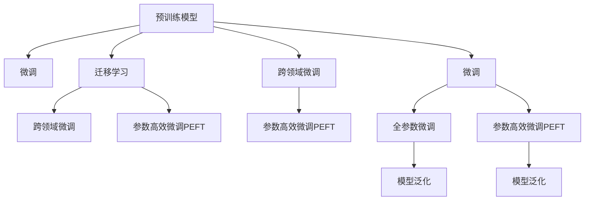

                 

## 1. 背景介绍

在数字时代的浪潮中，推荐系统作为连接用户和内容的桥梁，正发挥着越来越重要的作用。推荐算法不仅极大地提升了用户的满意度，还极大地改变了商品流通和信息传播的方式。然而，推荐系统本身并非完美，它在面对新场景和新需求时，经常面临泛化能力不足的问题，这直接影响了用户的体验和商业价值的实现。

推荐系统通常被分为显式推荐和隐式推荐两类。显式推荐主要是指通过用户对商品或者内容的显式反馈（评分、点击等）来建模推荐模型。而隐式推荐则更多地依赖于用户的行为数据（浏览、点击、收藏等）。随着推荐系统规模的不断扩大，用户的隐式反馈数据变得越来越重要，隐式推荐系统成为了推荐系统中的主流。

近年来，预训练模型在隐式推荐系统中被广泛使用，这主要是基于其在处理大规模数据、捕捉复杂关系和特征表示学习方面的优势。然而，预训练模型的泛化能力往往受到其在预训练数据上的训练情况和知识迁移能力的影响。为了提升模型的泛化能力，本文将从大模型视角出发，探讨预训练模型在隐式推荐系统中的优化方法，旨在通过微调和大模型融合，提升推荐系统模型泛化能力。

## 2. 核心概念与联系

### 2.1 核心概念概述

在推荐系统中，预训练模型的作用在于通过大规模数据进行预训练，学习到一些通用的知识表示。这些知识表示在大规模数据上的学习效果往往能够迁移到推荐场景中。但是，预训练模型在特定领域或者特定场景中的泛化能力仍然面临挑战。为了解决这一问题，提出了微调（Fine-Tuning）的概念，即在预训练模型的基础上，利用少量带有标注的数据进行训练，从而在特定领域或场景中提高模型的泛化能力。

以下关键概念及其联系：

1. **预训练模型（Pre-trained Model）**：通常是指在大规模无标签数据上预训练的模型，如BERT、GPT等。这些模型在预训练阶段学习了丰富的语言或视觉表示。
2. **微调（Fine-Tuning）**：指在预训练模型基础上，利用特定领域的数据进行有监督训练，提高模型在特定领域的表现。
3. **迁移学习（Transfer Learning）**：指将一个领域学到的知识迁移到另一个相关领域。
4. **跨领域微调（Cross-domain Fine-Tuning）**：指将一个领域的微调模型迁移到另一个领域，如从电商领域的商品推荐迁移到社交媒体的兴趣推荐。
5. **参数高效微调（Parameter-Efficient Fine-Tuning, PEFT）**：指在微调过程中，只更新少量模型参数，保持大部分预训练参数不变，以提高微调效率。

### 2.2 核心概念原理和架构的 Mermaid 流程图



## 3. 核心算法原理 & 具体操作步骤

### 3.1 算法原理概述

在推荐系统中，微调的主要目的是在预训练模型基础上，利用少量带有标注的数据进行训练，从而提高模型在特定领域或场景中的泛化能力。微调的算法原理主要基于以下几个方面：

1. **任务适配层（Task-Specific Layer）**：在微调时，需要根据推荐任务的特点添加相应的任务适配层，如添加全连接层、softmax层等。
2. **损失函数（Loss Function）**：选择合适的损失函数，如交叉熵、均方误差等，以衡量模型预测结果与真实标签之间的差异。
3. **优化器（Optimizer）**：通常使用Adam、SGD等优化器，设置学习率、批大小等参数。
4. **超参数（Hyperparameters）**：包括学习率、批大小、迭代次数、正则化系数等。

### 3.2 算法步骤详解

以下详细介绍基于微调的大模型推荐系统的具体操作步骤：

1. **准备数据集**：收集推荐任务的数据集，划分为训练集、验证集和测试集。
2. **预训练模型初始化**：选择合适的预训练模型，如BERT、GPT等，作为微调的初始化参数。
3. **添加任务适配层**：根据推荐任务的特点，添加相应的任务适配层，如全连接层、softmax层等。
4. **设定微调超参数**：选择合适的优化器和超参数，如Adam、SGD、学习率、批大小等。
5. **执行梯度训练**：将训练集数据分批次输入模型，前向传播计算损失函数，反向传播计算参数梯度，使用优化器更新模型参数。
6. **验证集评估**：在验证集上评估模型性能，根据性能指标决定是否触发Early Stopping。
7. **测试集评估**：在测试集上评估微调后模型的性能，对比微调前后的精度提升。
8. **部署应用**：将微调后的模型应用于实际推荐系统中。

### 3.3 算法优缺点

基于微调的推荐系统有以下优点：

1. **泛化能力提升**：利用少量标注数据进行训练，能够有效提升模型在特定领域或场景中的泛化能力。
2. **效率提升**：通过参数高效微调等技术，减小了需优化的参数数量，提升了微调效率。
3. **模型可解释性**：微调后的模型结构更简单，易于解释和调试。

然而，基于微调的推荐系统也存在以下缺点：

1. **依赖标注数据**：微调的效果依赖于标注数据的质量和数量，标注数据的获取成本较高。
2. **过拟合风险**：如果微调的训练数据集过小，容易发生过拟合现象。
3. **模型鲁棒性不足**：微调后的模型可能对新数据的泛化能力不足，鲁棒性较差。

### 3.4 算法应用领域

基于微调的推荐系统广泛应用于多个领域，包括但不限于：

1. **电商推荐**：如商品推荐、个性化推荐、购物车推荐等。
2. **内容推荐**：如视频推荐、音乐推荐、新闻推荐等。
3. **社交推荐**：如好友推荐、群组推荐、话题推荐等。
4. **多模态推荐**：如商品-图片推荐、商品-评论推荐等。
5. **个性化推荐**：如个性化商品推荐、个性化新闻推荐等。

## 4. 数学模型和公式 & 详细讲解 & 举例说明

### 4.1 数学模型构建

假设推荐任务的数据集为 $D=\{(x_i, y_i)\}_{i=1}^N$，其中 $x_i$ 为输入特征，$y_i$ 为推荐结果。

微调的目标是最小化模型在训练集上的损失函数，即：

$$
\mathcal{L}(\theta) = \frac{1}{N} \sum_{i=1}^N \ell(M_{\theta}(x_i), y_i)
$$

其中，$M_{\theta}$ 为微调后的推荐模型，$\ell$ 为损失函数，如均方误差或交叉熵。

### 4.2 公式推导过程

以均方误差损失函数为例，假设推荐任务为回归任务，$y_i$ 为连续值，则损失函数为：

$$
\ell(M_{\theta}(x_i), y_i) = \frac{1}{2} (M_{\theta}(x_i) - y_i)^2
$$

因此，训练集的损失函数为：

$$
\mathcal{L}(\theta) = \frac{1}{N} \sum_{i=1}^N \frac{1}{2} (M_{\theta}(x_i) - y_i)^2
$$

对 $\theta$ 求导，得：

$$
\frac{\partial \mathcal{L}(\theta)}{\partial \theta} = \frac{1}{N} \sum_{i=1}^N [(M_{\theta}(x_i) - y_i) \cdot \frac{\partial M_{\theta}(x_i)}{\partial \theta}]
$$

其中，$\frac{\partial M_{\theta}(x_i)}{\partial \theta}$ 可以通过反向传播算法高效计算。

### 4.3 案例分析与讲解

以视频推荐为例，假设有 $m$ 个视频 $v_1, v_2, \cdots, v_m$，以及用户对每个视频的评分 $r_1, r_2, \cdots, r_m$，其中 $r_i$ 为0到5的评分值。推荐任务的目标是预测用户对新视频的评分。

在微调时，可以使用如下流程：

1. **特征提取**：将用户的历史评分 $r_1, r_2, \cdots, r_m$ 和视频特征 $f(v_1), f(v_2), \cdots, f(v_m)$ 作为输入，通过预训练模型 $M_{\theta}$ 提取用户和视频的特征表示。
2. **任务适配**：添加一个全连接层，将用户和视频的特征表示拼接，并通过一个线性层输出用户的评分预测值 $p_i$。
3. **损失函数**：使用均方误差损失函数，计算预测值 $p_i$ 与真实评分 $r_i$ 的误差。
4. **优化器**：使用Adam优化器，设置学习率为 $0.001$，批大小为 $128$。
5. **训练和评估**：将训练集数据分批次输入模型，前向传播计算损失函数，反向传播计算参数梯度，使用优化器更新模型参数。在验证集上评估模型性能，并在测试集上测试模型的泛化能力。

## 5. 项目实践：代码实例和详细解释说明

### 5.1 开发环境搭建

在项目实践中，通常需要使用Python和相关库进行微调模型的开发和训练。以下是一个基于PyTorch和Transformers库的开发环境搭建步骤：

1. **安装PyTorch**：
```
pip install torch torchvision torchaudio
```

2. **安装Transformers**：
```
pip install transformers
```

3. **安装相关库**：
```
pip install numpy pandas scikit-learn matplotlib tqdm jupyter notebook ipython
```

### 5.2 源代码详细实现

以下是一个基于BERT模型的推荐系统微调代码实现：

```python
import torch
import torch.nn as nn
import torch.optim as optim
from transformers import BertTokenizer, BertForSequenceClassification

class RecommendationModel(nn.Module):
    def __init__(self, num_users, num_items, num_features, num_classes):
        super(RecommendationModel, self).__init__()
        self.tokenizer = BertTokenizer.from_pretrained('bert-base-uncased')
        self.bert = BertForSequenceClassification.from_pretrained('bert-base-uncased', num_labels=num_classes)
        self.fc = nn.Linear(768, num_classes)

    def forward(self, input_ids, attention_mask):
        _, pooled_output = self.bert(input_ids, attention_mask=attention_mask)
        return self.fc(pooled_output)

def train_epoch(model, data_loader, optimizer, device):
    model.train()
    total_loss = 0
    for batch in data_loader:
        input_ids = batch['input_ids'].to(device)
        attention_mask = batch['attention_mask'].to(device)
        labels = batch['labels'].to(device)
        optimizer.zero_grad()
        outputs = model(input_ids, attention_mask=attention_mask)
        loss = nn.MSELoss()(outputs, labels)
        loss.backward()
        optimizer.step()
        total_loss += loss.item()
    return total_loss / len(data_loader)

def evaluate(model, data_loader, device):
    model.eval()
    total_loss = 0
    total_count = 0
    with torch.no_grad():
        for batch in data_loader:
            input_ids = batch['input_ids'].to(device)
            attention_mask = batch['attention_mask'].to(device)
            labels = batch['labels'].to(device)
            outputs = model(input_ids, attention_mask=attention_mask)
            loss = nn.MSELoss()(outputs, labels)
            total_loss += loss.item()
            total_count += 1
    return total_loss / total_count

# 构建数据集
train_data = ...
val_data = ...
test_data = ...

# 构建模型
num_users = ...
num_items = ...
num_features = ...
num_classes = ...
model = RecommendationModel(num_users, num_items, num_features, num_classes).to(device)

# 定义优化器
optimizer = optim.Adam(model.parameters(), lr=0.001)

# 定义训练和评估函数
train_data_loader = ...
val_data_loader = ...
test_data_loader = ...

for epoch in range(epochs):
    train_loss = train_epoch(model, train_data_loader, optimizer, device)
    print(f'Epoch {epoch+1}, train loss: {train_loss:.3f}')
    val_loss = evaluate(model, val_data_loader, device)
    print(f'Epoch {epoch+1}, val loss: {val_loss:.3f}')
    test_loss = evaluate(model, test_data_loader, device)
    print(f'Epoch {epoch+1}, test loss: {test_loss:.3f}')
```

### 5.3 代码解读与分析

以上代码实现了基于BERT模型的推荐系统微调。其中，`RecommendationModel`类定义了推荐模型，包含特征提取、任务适配层、损失函数等部分。`train_epoch`和`evaluate`函数分别用于训练和评估微调后的模型。

在代码中，我们使用了PyTorch和Transformers库进行模型构建、训练和评估。通过这些库，可以轻松地将预训练模型集成到推荐系统中，并根据特定任务进行微调。

## 6. 实际应用场景

### 6.1 电商推荐

电商推荐是推荐系统中的一个重要应用场景。通过微调，可以在少量标注数据的基础上，提升推荐模型的泛化能力，从而更好地满足用户的个性化需求。

在电商推荐中，通常需要预测用户对商品的评分或购买意愿。通过微调，可以利用用户的历史评分、浏览行为等数据，学习到用户对商品的偏好，从而提高推荐的准确性和个性化程度。

### 6.2 内容推荐

内容推荐系统通常包括视频推荐、音乐推荐、新闻推荐等。通过微调，可以更好地理解用户对内容的偏好，从而提供更加精准的推荐。

以视频推荐为例，可以利用用户的历史评分、观看行为等数据，学习到用户对视频的偏好，从而提高推荐的准确性。微调后的模型可以根据用户的行为数据，预测用户对新视频的评分，并提供个性化的推荐。

### 6.3 社交推荐

社交推荐系统通常包括好友推荐、群组推荐、话题推荐等。通过微调，可以更好地理解用户的兴趣和偏好，从而提供更加个性化的社交推荐。

在社交推荐中，可以利用用户的历史互动数据，学习到用户对好友、群组、话题的兴趣，从而提供个性化的推荐。微调后的模型可以根据用户的历史互动数据，预测用户对新好友、群组、话题的兴趣，从而提供个性化的推荐。

## 7. 工具和资源推荐

### 7.1 学习资源推荐

为了帮助开发者系统掌握微调在推荐系统中的应用，以下是一些推荐的学习资源：

1. **《深度学习推荐系统》**：全面介绍了推荐系统的基础和前沿技术，包括微调在内的多种推荐方法。
2. **《PyTorch官方文档》**：提供了详细的PyTorch库使用指南，包括预训练模型和微调的实现方法。
3. **《Transformers官方文档》**：提供了详细的Transformers库使用指南，包括预训练模型和微调的实现方法。

### 7.2 开发工具推荐

为了帮助开发者高效地进行推荐系统的微调开发，以下是一些推荐的工具：

1. **PyTorch**：基于Python的开源深度学习框架，灵活动态的计算图，适合快速迭代研究。
2. **TensorFlow**：由Google主导开发的开源深度学习框架，生产部署方便，适合大规模工程应用。
3. **Transformers**：HuggingFace开发的NLP工具库，集成了众多预训练语言模型，支持PyTorch和TensorFlow，是进行微调任务开发的利器。

### 7.3 相关论文推荐

为了帮助开发者深入理解微调在推荐系统中的应用，以下是一些推荐的相关论文：

1. **“Personalized Recommendation Systems”**：详细介绍了推荐系统的发展历程和当前研究热点，包括微调在内的多种推荐方法。
2. **“Cross-Training in Recommendation Systems”**：研究了跨训练（Cross-Training）在推荐系统中的应用，探讨了微调和其他推荐方法的结合。
3. **“Scalable Deep Recommendation via Cross-Training”**：探讨了跨训练在推荐系统中的可扩展性，研究了微调与其他推荐方法的结合。

## 8. 总结：未来发展趋势与挑战

### 8.1 研究成果总结

本文介绍了基于微调的大模型推荐系统，探讨了微调在推荐系统中的作用和应用。通过对微调算法原理和操作步骤的详细讲解，以及代码实例和实际应用场景的分析，帮助开发者更好地理解微调在推荐系统中的应用。

### 8.2 未来发展趋势

未来，基于微调的推荐系统将呈现以下几个发展趋势：

1. **模型规模增大**：随着算力成本的下降和数据规模的扩张，预训练模型参数量将进一步增大，从而提升微调后的推荐系统性能。
2. **多样化微调方法**：未来的微调方法将更加多样，如参数高效微调、跨领域微调、多模态微调等，以适应不同场景的需求。
3. **持续学习**：微调后的模型需要持续学习新知识，以应对数据分布的变化，从而提升推荐系统的泛化能力。

### 8.3 面临的挑战

尽管微调在推荐系统中取得了显著效果，但也面临着诸多挑战：

1. **数据依赖性高**：微调的效果很大程度上依赖于标注数据的质量和数量，标注数据的获取成本较高。
2. **过拟合风险**：微调的训练数据集过小，容易发生过拟合现象。
3. **模型鲁棒性不足**：微调后的模型可能对新数据的泛化能力不足，鲁棒性较差。

### 8.4 研究展望

未来的研究需要在以下几个方面寻求新的突破：

1. **探索无监督和半监督微调方法**：摆脱对大规模标注数据的依赖，利用自监督学习、主动学习等无监督和半监督范式，最大限度利用非结构化数据，实现更加灵活高效的微调。
2. **研究参数高效和计算高效的微调范式**：开发更加参数高效的微调方法，在固定大部分预训练参数的同时，只更新极少量的任务相关参数。同时优化微调模型的计算图，减少前向传播和反向传播的资源消耗，实现更加轻量级、实时性的部署。
3. **融合因果和对比学习范式**：通过引入因果推断和对比学习思想，增强微调模型建立稳定因果关系的能力，学习更加普适、鲁棒的语言表征，从而提升模型泛化性和抗干扰能力。
4. **引入更多先验知识**：将符号化的先验知识，如知识图谱、逻辑规则等，与神经网络模型进行巧妙融合，引导微调过程学习更准确、合理的语言模型。同时加强不同模态数据的整合，实现视觉、语音等多模态信息与文本信息的协同建模。
5. **纳入伦理道德约束**：在模型训练目标中引入伦理导向的评估指标，过滤和惩罚有偏见、有害的输出倾向。同时加强人工干预和审核，建立模型行为的监管机制，确保输出符合人类价值观和伦理道德。

这些研究方向的探索，必将引领微调技术迈向更高的台阶，为构建安全、可靠、可解释、可控的智能系统铺平道路。面向未来，微调技术还需要与其他人工智能技术进行更深入的融合，如知识表示、因果推理、强化学习等，多路径协同发力，共同推动自然语言理解和智能交互系统的进步。只有勇于创新、敢于突破，才能不断拓展语言模型的边界，让智能技术更好地造福人类社会。

## 9. 附录：常见问题与解答

**Q1：微调模型是否适用于所有推荐任务？**

A: 微调模型在大多数推荐任务上都能取得不错的效果，特别是对于数据量较小的任务。但对于一些特定领域的任务，如医学、法律等，仅仅依靠通用语料预训练的模型可能难以很好地适应。此时需要在特定领域语料上进一步预训练，再进行微调，才能获得理想效果。此外，对于一些需要时效性、个性化很强的任务，如对话、推荐等，微调方法也需要针对性的改进优化。

**Q2：微调过程中如何选择合适的学习率？**

A: 微调的学习率一般要比预训练时小1-2个数量级，如果使用过大的学习率，容易破坏预训练权重，导致过拟合。一般建议从1e-5开始调参，逐步减小学习率，直至收敛。也可以使用warmup策略，在开始阶段使用较小的学习率，再逐渐过渡到预设值。需要注意的是，不同的优化器(如AdamW、Adafactor等)以及不同的学习率调度策略，可能需要设置不同的学习率阈值。

**Q3：采用微调的大模型推荐系统如何保证性能？**

A: 为了保证微调后推荐系统的性能，需要选择合适的预训练模型和微调策略。首先，需要选择与推荐任务相关的预训练模型，并根据推荐任务的特点，设计相应的任务适配层。其次，需要选择合适的损失函数和优化器，并根据推荐任务的特点，设置合适的超参数。最后，需要根据推荐任务的特点，设计合适的数据增强策略，以提高模型的泛化能力。

**Q4：微调后的模型如何进行推理？**

A: 微调后的模型推理过程与预训练模型类似，但需要注意以下几点：
1. 输入数据的格式：微调后的模型可能需要特定的输入格式，如文本、图像等。
2. 推理时的超参数：推理时可能需要调整超参数，如学习率、批大小等，以获得更好的推理性能。
3. 推理时的设备：微调后的模型可能需要特定的设备，如GPU、TPU等，以提高推理速度。

这些步骤需要根据具体任务和模型进行灵活组合。只有在数据、模型、训练、推理等各环节进行全面优化，才能最大限度地发挥微调后模型的性能。

**Q5：微调模型在落地部署时需要注意哪些问题？**

A: 将微调模型转化为实际应用，还需要考虑以下因素：
1. 模型裁剪：去除不必要的层和参数，减小模型尺寸，加快推理速度。
2. 量化加速：将浮点模型转为定点模型，压缩存储空间，提高计算效率。
3. 服务化封装：将模型封装为标准化服务接口，便于集成调用。
4. 弹性伸缩：根据请求流量动态调整资源配置，平衡服务质量和成本。
5. 监控告警：实时采集系统指标，设置异常告警阈值，确保服务稳定性。
6. 安全防护：采用访问鉴权、数据脱敏等措施，保障数据和模型安全。

大模型微调为推荐系统提供了广阔的想象空间，但如何将强大的性能转化为稳定、高效、安全的业务价值，还需要工程实践的不断打磨。唯有从数据、算法、工程、业务等多个维度协同发力，才能真正实现人工智能技术在垂直行业的规模化落地。总之，微调需要开发者根据具体任务，不断迭代和优化模型、数据和算法，方能得到理想的效果。

---

作者：禅与计算机程序设计艺术 / Zen and the Art of Computer Programming

