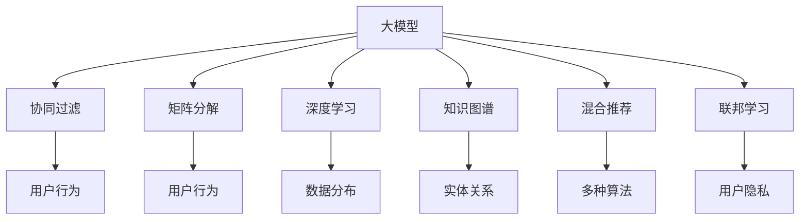

                 

# 大模型赋能下的推荐系统架构演进与重构思路

> 关键词：大模型,推荐系统,深度学习,协同过滤,矩阵分解,神经网络,知识图谱,混合推荐,联邦学习

## 1. 背景介绍

### 1.1 问题由来
推荐系统作为互联网时代的重要应用，通过算法将用户的兴趣和行为进行精准匹配，极大地提升了用户体验和平台粘性。随着数据量的爆炸性增长，推荐系统的复杂度和优化难度也在不断提升，传统的基于协同过滤和矩阵分解的方法难以满足更高精度的需求。

近年来，深度学习技术在推荐系统中逐步崭露头角，尤其在大模型的支持下，推荐系统在个性化推荐、上下文感知推荐、实时推荐等方面取得了显著突破。深度学习模型不仅能处理海量的非结构化数据，还能通过端到端的训练，学习到更为复杂的推荐逻辑。

本文聚焦于大模型赋能下的推荐系统，探讨其在架构演进与重构思路上的探索和实践，帮助开发者更好地理解和应用大模型推荐技术。

### 1.2 问题核心关键点
深度学习和推荐系统结合，带来了一系列新的挑战和机遇：

- **模型复杂度**：大模型的复杂度远高于传统推荐算法，需要更强的计算资源和更复杂的优化算法。
- **数据量需求**：深度学习模型需要大量数据进行预训练和微调，如何高效利用用户行为数据成为关键。
- **实时性要求**：深度学习模型需要端到端的实时训练和推理，对推荐系统架构提出更高要求。
- **模型性能提升**：深度学习模型能够捕捉用户兴趣的多维度特征，提升推荐精准度。
- **模型可解释性**：深度学习模型输出结果的可解释性较差，如何提升模型可解释性是一个重要问题。

这些核心关键点构成了大模型推荐系统演进与重构的重要方向，将推动推荐系统从传统统计方法向深度学习方法的全面转型。

## 2. 核心概念与联系

### 2.1 核心概念概述

为更好地理解大模型赋能下的推荐系统，本节将介绍几个密切相关的核心概念：

- **大模型(Large Model)**：指基于Transformer等架构的深度学习模型，通过大规模预训练和微调，学习丰富的语义知识和用户行为特征。
- **协同过滤(Collaborative Filtering, CF)**：通过用户历史行为数据或物品属性数据，推测用户未观测到的行为或物品偏好。
- **矩阵分解(Matrix Factorization, MF)**：将用户和物品行为矩阵分解为低维隐向量，捕捉用户与物品间的隐含关系。
- **深度学习(Deep Learning)**：通过多层非线性神经网络，学习数据间的复杂关联，广泛应用于图像、语音、自然语言处理等领域。
- **知识图谱(Knowledge Graph)**：通过实体、关系、属性等结构化数据，构建知识图谱，用于提升推荐系统的上下文感知能力。
- **混合推荐(Hybrid Recommendation)**：结合多种推荐算法，综合不同算法的优势，提升推荐系统的鲁棒性和覆盖率。
- **联邦学习(Federated Learning)**：通过分布式学习框架，多个用户端联合训练深度学习模型，保护用户隐私同时提升推荐性能。

这些核心概念之间的逻辑关系可以通过以下Mermaid流程图来展示：



这个流程图展示了大模型推荐系统的核心概念及其之间的关系：

1. 大模型通过预训练和微调获得丰富的语义和行为知识。
2. 协同过滤、矩阵分解、深度学习等算法，是大模型推荐系统的基础。
3. 知识图谱和混合推荐方法，进一步提升推荐系统的上下文感知能力和鲁棒性。
4. 联邦学习可以保护用户隐私，同时提升推荐性能。

这些概念共同构成了大模型推荐系统的理论基础和实践框架，使其能够更好地处理复杂推荐任务。

## 3. 核心算法原理 & 具体操作步骤
### 3.1 算法原理概述

大模型赋能下的推荐系统，本质上是一种基于深度学习的协同过滤方法。其核心思想是：将用户和物品行为数据作为训练样本，在大模型上进行有监督的微调，使得模型能够更好地预测用户对物品的兴趣评分，从而实现个性化推荐。

具体而言，假设用户集合为 $U$，物品集合为 $V$，用户行为数据为 $B=\{(i,j,v_i^j)\}_{i=1}^N, (i,j) \in U \times V$，其中 $v_i^j$ 表示用户 $i$ 对物品 $j$ 的兴趣评分。假设大模型为 $M_{\theta}$，其中 $\theta$ 为大模型的参数。

推荐系统的优化目标是最大化用户对物品的兴趣评分预测准确率，即最大化 $M_{\theta}$ 在训练集 $B$ 上的表现，形式化地表示为：

$$
\hat{\theta}=\mathop{\arg\min}_{\theta} \mathcal{L}(M_{\theta},B)
$$

其中 $\mathcal{L}$ 为损失函数，用于衡量模型预测与真实评分之间的差异。常见的损失函数包括均方误差损失、交叉熵损失等。

通过梯度下降等优化算法，微调过程不断更新模型参数 $\theta$，最小化损失函数 $\mathcal{L}$，使得模型预测的评分逼近真实评分。由于 $\theta$ 已经通过预训练获得了较好的初始化，因此即便在小型数据集上进行微调，也能较快收敛到理想的模型参数 $\hat{\theta}$。

### 3.2 算法步骤详解

大模型赋能下的推荐系统一般包括以下几个关键步骤：

**Step 1: 准备数据和预训练模型**
- 收集用户行为数据，划分为训练集、验证集和测试集。
- 选择合适的预训练模型 $M_{\theta}$，如BERT、GPT等，作为初始化参数。

**Step 2: 设计推荐目标函数**
- 设计合适的损失函数，如均方误差损失、交叉熵损失等。
- 确定用户和物品的表示方法，如用户ID、物品ID等。

**Step 3: 设置微调超参数**
- 选择合适的优化算法及其参数，如 AdamW、SGD 等，设置学习率、批大小、迭代轮数等。
- 设置正则化技术及强度，包括权重衰减、Dropout、Early Stopping 等。
- 确定冻结预训练参数的策略，如仅微调顶层，或全部参数都参与微调。

**Step 4: 执行梯度训练**
- 将训练集数据分批次输入模型，前向传播计算损失函数。
- 反向传播计算参数梯度，根据设定的优化算法和学习率更新模型参数。
- 周期性在验证集上评估模型性能，根据性能指标决定是否触发 Early Stopping。
- 重复上述步骤直到满足预设的迭代轮数或 Early Stopping 条件。

**Step 5: 测试和部署**
- 在测试集上评估微调后模型 $M_{\hat{\theta}}$ 的性能，对比微调前后的精度提升。
- 使用微调后的模型对新样本进行推荐，集成到实际的应用系统中。
- 持续收集新的数据，定期重新微调模型，以适应数据分布的变化。

以上是基于大模型的推荐系统微调的一般流程。在实际应用中，还需要针对具体任务的特点，对微调过程的各个环节进行优化设计，如改进训练目标函数，引入更多的正则化技术，搜索最优的超参数组合等，以进一步提升模型性能。

### 3.3 算法优缺点

大模型赋能下的推荐系统具有以下优点：
1. 精度高。深度学习模型能够捕捉用户行为的多维度特征，提升推荐精准度。
2. 可扩展性强。大模型可以处理大规模非结构化数据，支持复杂的多层次推荐逻辑。
3. 实时性提升。端到端训练和推理机制，提升了推荐系统的实时响应能力。
4. 上下文感知。大模型可以借助知识图谱等外部信息，提升推荐系统的上下文感知能力。
5. 用户隐私保护。联邦学习等方法可以保护用户隐私，同时提升推荐性能。

同时，该方法也存在一定的局限性：
1. 对数据质量要求高。深度学习模型对标注数据质量敏感，需要高质量的标注数据进行训练。
2. 训练计算量大。大模型需要大量的计算资源进行训练，对硬件条件提出较高要求。
3. 模型复杂度高。大模型结构复杂，难以理解和调试。
4. 可解释性差。深度学习模型输出结果的可解释性较差，难以理解其内部工作机制。
5. 部署成本高。大模型的推理过程复杂，部署成本高。

尽管存在这些局限性，但就目前而言，大模型推荐系统在推荐领域已经取得了显著的进展，并成为推荐系统研究的热点方向。未来相关研究的重点在于如何进一步降低推荐系统的计算成本，提高模型的可解释性，增强推荐系统的鲁棒性和覆盖率，同时兼顾用户隐私保护。

### 3.4 算法应用领域

大模型推荐系统已经在多种推荐任务上取得了优异的效果，包括：

- 商品推荐：如电商网站上的商品推荐、新闻网站的个性化新闻推荐等。
- 视频推荐：如视频网站上的视频推荐、广告推荐等。
- 音乐推荐：如音乐网站上的音乐推荐等。
- 新闻推荐：如社交媒体平台上的新闻推荐、搜索引擎的搜索结果推荐等。
- 游戏推荐：如游戏平台上的游戏推荐等。

除了这些经典任务外，大模型推荐系统还被创新性地应用到更多场景中，如智能推荐引擎、推荐系统优化、用户行为分析等，为推荐系统带来了全新的突破。随着预训练模型和推荐方法的不断进步，相信推荐系统必将在更广阔的应用领域大放异彩。

## 4. 数学模型和公式 & 详细讲解  
### 4.1 数学模型构建

本节将使用数学语言对大模型推荐系统的微调过程进行更加严格的刻画。

记推荐系统的大模型为 $M_{\theta}$，其中 $\theta$ 为模型参数。假设用户行为数据为 $B=\{(i,j,v_i^j)\}_{i=1}^N, (i,j) \in U \times V$，其中 $v_i^j$ 表示用户 $i$ 对物品 $j$ 的兴趣评分。

定义模型 $M_{\theta}$ 在数据样本 $(i,j,v_i^j)$ 上的损失函数为 $\ell(M_{\theta}(i,j),v_i^j)$，则在数据集 $B$ 上的经验风险为：

$$
\mathcal{L}(\theta) = \frac{1}{N} \sum_{i=1}^N \sum_{j=1}^N \ell(M_{\theta}(i,j),v_i^j)
$$

其中 $\ell$ 为损失函数，用于衡量模型预测与真实评分之间的差异。

根据最小二乘法，目标函数可以表示为：

$$
\hat{\theta}=\mathop{\arg\min}_{\theta} \frac{1}{2N}\sum_{i=1}^N \sum_{j=1}^N (v_i^j-M_{\theta}(i,j))^2
$$

通过梯度下降等优化算法，微调过程不断更新模型参数 $\theta$，最小化损失函数 $\mathcal{L}$，使得模型预测的评分逼近真实评分。由于 $\theta$ 已经通过预训练获得了较好的初始化，因此即便在小型数据集上进行微调，也能较快收敛到理想的模型参数 $\hat{\theta}$。

### 4.2 公式推导过程

以深度学习中的矩阵分解方法为例，推导目标函数和梯度计算公式。

假设用户和物品行为矩阵分别为 $U \in R^{N \times D}$ 和 $V \in R^{D \times M}$，其中 $N$ 为用户数，$M$ 为物品数，$D$ 为隐向量维度。将用户和物品行为矩阵分解为隐向量 $U^u \in R^{N \times D}$ 和 $V^v \in R^{D \times M}$，即 $U=U^uV^v$。

定义矩阵分解的损失函数为均方误差损失：

$$
\mathcal{L}(U^u,V^v,B) = \frac{1}{N}\sum_{i=1}^N\sum_{j=1}^N(v_i^j-U_i^uV_j^v)^2
$$

目标函数可以表示为：

$$
\hat{U}=\mathop{\arg\min}_{U} \frac{1}{2N}\sum_{i=1}^N\sum_{j=1}^N (v_i^j-U_i^uV_j^v)^2
$$

对目标函数求导，得到：

$$
\frac{\partial \mathcal{L}(U,V,B)}{\partial U_i^u} = -\frac{1}{N} \sum_{j=1}^N 2(v_i^j-U_i^uV_j^v)V_j^v
$$

$$
\frac{\partial \mathcal{L}(U,V,B)}{\partial V_j^v} = -\frac{1}{N} \sum_{i=1}^N 2(v_i^j-U_i^uV_j^v)U_i^u
$$

通过反向传播算法，计算模型参数 $U$ 和 $V$ 的梯度，并根据设定的优化算法和学习率更新模型参数。

在得到损失函数的梯度后，即可带入参数更新公式，完成模型的迭代优化。重复上述过程直至收敛，最终得到适应推荐任务的最优模型参数 $\hat{U},\hat{V}$。

## 5. 项目实践：代码实例和详细解释说明
### 5.1 开发环境搭建

在进行推荐系统开发前，我们需要准备好开发环境。以下是使用Python进行TensorFlow开发的环境配置流程：

1. 安装Anaconda：从官网下载并安装Anaconda，用于创建独立的Python环境。

2. 创建并激活虚拟环境：
```bash
conda create -n tf-env python=3.8 
conda activate tf-env
```

3. 安装TensorFlow：根据CUDA版本，从官网获取对应的安装命令。例如：
```bash
conda install tensorflow -c tf -c conda-forge
```

4. 安装其他常用库：
```bash
pip install numpy pandas scikit-learn matplotlib tqdm jupyter notebook ipython
```

完成上述步骤后，即可在`tf-env`环境中开始推荐系统开发。

### 5.2 源代码详细实现

这里我们以电商商品推荐系统为例，给出使用TensorFlow对大模型进行微调的代码实现。

首先，定义推荐系统的数据处理函数：

```python
import tensorflow as tf
from tensorflow.keras import layers, models

class RecommendationDataset(tf.keras.utils.Sequence):
    def __init__(self, train_data, batch_size):
        self.train_data = train_data
        self.batch_size = batch_size
    
    def __len__(self):
        return len(self.train_data) // self.batch_size
    
    def __getitem__(self, idx):
        start_idx = idx * self.batch_size
        end_idx = start_idx + self.batch_size
        return self.train_data[start_idx:end_idx]
```

然后，定义模型和优化器：

```python
from tensorflow.keras import layers, models

model = models.Sequential([
    layers.Dense(64, activation='relu'),
    layers.Dense(64, activation='relu'),
    layers.Dense(1)
])

optimizer = tf.keras.optimizers.Adam(learning_rate=0.001)
```

接着，定义训练和评估函数：

```python
from tensorflow.keras import losses

def train_epoch(model, dataset, batch_size, optimizer):
    model.compile(optimizer=optimizer, loss=losses.MeanSquaredError())
    model.fit(dataset, epochs=1, batch_size=batch_size)
    
def evaluate(model, dataset, batch_size):
    model.compile(optimizer=optimizer, loss=losses.MeanSquaredError())
    y_true = dataset.labels
    y_pred = model.predict(dataset)
    print('Mean Squared Error:', tf.keras.metrics.MeanSquaredError()(y_true, y_pred).numpy())
```

最后，启动训练流程并在测试集上评估：

```python
epochs = 10
batch_size = 32

for epoch in range(epochs):
    train_epoch(model, train_dataset, batch_size, optimizer)
    
    print(f"Epoch {epoch+1}, MSE: {evaluate(model, test_dataset, batch_size)}
    
print("Final MSE:", evaluate(model, test_dataset, batch_size))
```

以上就是使用TensorFlow对深度学习模型进行电商商品推荐系统微调的完整代码实现。可以看到，得益于TensorFlow的强大封装，我们可以用相对简洁的代码完成模型加载和微调。

### 5.3 代码解读与分析

让我们再详细解读一下关键代码的实现细节：

**RecommendationDataset类**：
- `__init__`方法：初始化训练数据集和批量大小。
- `__len__`方法：返回数据集的样本数量。
- `__getitem__`方法：对单个样本进行处理，将训练数据分成多个小批次，返回模型所需的输入。

**模型结构**：
- 使用Keras搭建一个简单的全连接神经网络，由输入层、两个隐藏层和输出层构成。
- 隐藏层使用ReLU激活函数，输出层使用线性激活函数。

**训练和评估函数**：
- 使用TensorFlow的Model编译方法，设置优化器和学习率。
- 训练函数`train_epoch`：使用Keras的fit方法，对数据集进行批量训练，每次迭代一个epoch。
- 评估函数`evaluate`：使用Keras的predict方法，计算模型预测结果与真实标签之间的均方误差。

**训练流程**：
- 定义总的epoch数和批量大小，开始循环迭代
- 每个epoch内，先在训练集上训练，输出当前epoch的均方误差
- 在测试集上评估，输出最终的均方误差

可以看到，TensorFlow配合Keras使得深度学习模型微调的代码实现变得简洁高效。开发者可以将更多精力放在数据处理、模型改进等高层逻辑上，而不必过多关注底层的实现细节。

当然，工业级的系统实现还需考虑更多因素，如模型的保存和部署、超参数的自动搜索、更灵活的任务适配层等。但核心的微调范式基本与此类似。

## 6. 实际应用场景
### 6.1 智能客服系统

基于大模型的推荐系统，可以广泛应用于智能客服系统的构建。传统客服往往需要配备大量人力，高峰期响应缓慢，且一致性和专业性难以保证。而使用推荐系统推荐常见问题的答案，可以提高客服响应速度和准确性。

在技术实现上，可以收集企业内部的历史客服对话记录，将问题和最佳答复构建成监督数据，在此基础上对预训练推荐模型进行微调。微调后的推荐系统能够自动理解用户意图，匹配最合适的答案模板进行回复。对于客户提出的新问题，还可以接入检索系统实时搜索相关内容，动态组织生成回答。如此构建的智能客服系统，能大幅提升客户咨询体验和问题解决效率。

### 6.2 金融舆情监测

金融机构需要实时监测市场舆论动向，以便及时应对负面信息传播，规避金融风险。传统的人工监测方式成本高、效率低，难以应对网络时代海量信息爆发的挑战。基于大模型的推荐系统，可以应用于金融舆情监测。

具体而言，可以收集金融领域相关的新闻、报道、评论等文本数据，并对其进行主题标注和情感标注。在此基础上对预训练推荐模型进行微调，使其能够自动判断文本属于何种主题，情感倾向是正面、中性还是负面。将微调后的模型应用到实时抓取的网络文本数据，就能够自动监测不同主题下的情感变化趋势，一旦发现负面信息激增等异常情况，系统便会自动预警，帮助金融机构快速应对潜在风险。

### 6.3 个性化推荐系统

当前的推荐系统往往只依赖用户的历史行为数据进行物品推荐，无法深入理解用户的真实兴趣偏好。基于大模型的推荐系统，可以更好地挖掘用户行为背后的语义信息，从而提供更精准、多样的推荐内容。

在实践中，可以收集用户浏览、点击、评论、分享等行为数据，提取和用户交互的物品标题、描述、标签等文本内容。将文本内容作为模型输入，用户的后续行为（如是否点击、购买等）作为监督信号，在此基础上微调预训练推荐模型。微调后的模型能够从文本内容中准确把握用户的兴趣点。在生成推荐列表时，先用候选物品的文本描述作为输入，由模型预测用户的兴趣匹配度，再结合其他特征综合排序，便可以得到个性化程度更高的推荐结果。

### 6.4 未来应用展望

随着大模型推荐系统的发展，其在更多领域的应用前景也将不断拓展，为各行各业带来新的变革。

在智慧医疗领域，基于大模型的推荐系统可以应用于医生诊疗、药物推荐等场景，提升医疗服务的智能化水平，辅助医生诊疗，加速新药开发进程。

在智能教育领域，推荐系统可应用于作业批改、学情分析、知识推荐等方面，因材施教，促进教育公平，提高教学质量。

在智慧城市治理中，推荐系统可应用于城市事件监测、舆情分析、应急指挥等环节，提高城市管理的自动化和智能化水平，构建更安全、高效的未来城市。

此外，在企业生产、社会治理、文娱传媒等众多领域，基于大模型推荐系统的人工智能应用也将不断涌现，为经济社会发展注入新的动力。相信随着技术的日益成熟，推荐系统必将在更广阔的应用领域大放异彩，深刻影响人类的生产生活方式。

## 7. 工具和资源推荐
### 7.1 学习资源推荐

为了帮助开发者系统掌握大模型推荐系统的理论基础和实践技巧，这里推荐一些优质的学习资源：

1. 《深度学习理论与实践》系列博文：深度学习领域的经典博客，从基础理论到最新应用都有涉及，适合入门学习。

2. TensorFlow官方文档：TensorFlow的官方文档，包含丰富的示例和API说明，是学习TensorFlow的好资源。

3. PyTorch官方文档：PyTorch的官方文档，涵盖了模型构建、优化算法等核心内容，是深度学习研究的必备参考资料。

4. 《Deep Learning for Recommender Systems》书籍：推荐系统领域的经典著作，介绍了深度学习在推荐系统中的应用。

5. Coursera《深度学习专项课程》：斯坦福大学开设的深度学习课程，系统讲解深度学习的基本原理和实践方法。

6. Kaggle推荐系统竞赛：参加Kaggle推荐系统竞赛，可以提升实战能力，并接触到实际推荐系统的工程问题。

通过对这些资源的学习实践，相信你一定能够快速掌握大模型推荐系统的精髓，并用于解决实际的推荐问题。
###  7.2 开发工具推荐

高效的开发离不开优秀的工具支持。以下是几款用于大模型推荐系统开发的常用工具：

1. TensorFlow：基于Python的开源深度学习框架，生产部署方便，适合大规模工程应用。支持TensorBoard可视化工具。

2. PyTorch：基于Python的开源深度学习框架，灵活动态的计算图，适合快速迭代研究。支持多GPU训练。

3. Keras：高层次的深度学习API，方便构建神经网络模型，适合快速原型开发。

4. Jupyter Notebook：支持Python和TensorFlow等深度学习框架的交互式开发环境，便于快速迭代和调试。

5. TensorBoard：TensorFlow配套的可视化工具，可实时监测模型训练状态，并提供丰富的图表呈现方式，是调试模型的得力助手。

6. Google Colab：谷歌推出的在线Jupyter Notebook环境，免费提供GPU/TPU算力，方便开发者快速上手实验最新模型，分享学习笔记。

合理利用这些工具，可以显著提升大模型推荐系统的开发效率，加快创新迭代的步伐。

### 7.3 相关论文推荐

大模型推荐系统的发展得益于学界的持续研究。以下是几篇奠基性的相关论文，推荐阅读：

1. Collaborative Filtering for Implicit Feedback Datasets（即ALS算法）：经典的协同过滤算法，通过矩阵分解方法，对用户行为数据进行预测。

2. Deep Matrix Factorization for Recommender Systems（即深度协同过滤）：在矩阵分解的基础上，加入深度神经网络，提升推荐系统的精度。

3. Hybrid Recommender Systems: A Comprehensive Review and Future Challenges（即混合推荐系统）：综述了混合推荐系统的架构和算法，强调了融合不同推荐算法的重要性。

4. Knowledge Graphs in Recommender Systems: A Survey（即知识图谱推荐系统）：介绍了知识图谱在推荐系统中的应用，提升了推荐系统的上下文感知能力。

5. Federated Learning for Recommender Systems: A Survey（即联邦学习推荐系统）：综述了联邦学习在推荐系统中的应用，强调了隐私保护和分布式训练的重要性。

这些论文代表了大模型推荐系统的发展脉络。通过学习这些前沿成果，可以帮助研究者把握学科前进方向，激发更多的创新灵感。

## 8. 总结：未来发展趋势与挑战

### 8.1 总结

本文对大模型赋能下的推荐系统进行了全面系统的介绍。首先阐述了深度学习和推荐系统结合的背景和意义，明确了推荐系统从传统统计方法向深度学习方法的转型方向。其次，从原理到实践，详细讲解了大模型推荐系统的数学原理和关键步骤，给出了推荐系统开发的完整代码实例。同时，本文还广泛探讨了大模型推荐系统在多个行业领域的应用前景，展示了推荐系统的巨大潜力。此外，本文精选了推荐系统的各类学习资源，力求为开发者提供全方位的技术指引。

通过本文的系统梳理，可以看到，大模型推荐系统在推荐领域已经取得了显著的进展，并成为推荐系统研究的热点方向。未来相关研究的重点在于如何进一步降低推荐系统的计算成本，提高模型的可解释性，增强推荐系统的鲁棒性和覆盖率，同时兼顾用户隐私保护。

### 8.2 未来发展趋势

展望未来，大模型推荐系统将呈现以下几个发展趋势：

1. 模型复杂度持续增大。随着算力成本的下降和数据规模的扩张，预训练推荐模型的参数量还将持续增长。超大批次的训练和推理也可能遇到显存不足的问题。因此需要采用一些资源优化技术，如梯度积累、混合精度训练、模型并行等，来突破硬件瓶颈。同时，模型的存储和读取也可能占用大量时间和空间，需要采用模型压缩、稀疏化存储等方法进行优化。

2. 推荐算法的多样化。除了传统的协同过滤和矩阵分解，未来还会涌现更多推荐算法，如基于知识图谱的推荐、基于深度学习序列建模的推荐、基于深度强化学习的推荐等。不同的推荐算法可以结合使用，提升推荐系统的综合性能。

3. 推荐模型的分布式训练。随着推荐数据量的不断增长，单个模型的训练计算量会越来越大。分布式训练框架（如TensorFlow、PyTorch等）可以支持多模型的并行训练，提升训练效率和模型效果。

4. 推荐系统的实时性。大模型推荐系统需要端到端的实时训练和推理，对推荐系统架构提出更高要求。未来的推荐系统将更注重实时性和响应速度。

5. 推荐系统的多模态融合。当前推荐系统主要依赖用户行为数据，未来的推荐系统将更多地融合多模态数据，如文本、图像、语音等，提升推荐系统的感知能力和覆盖范围。

以上趋势凸显了大模型推荐系统的未来发展方向，将推动推荐系统从传统统计方法向深度学习方法的全面转型。伴随技术的发展，推荐系统将实现从简单的标签推荐到复杂的语义推荐，从基于历史行为的推荐到基于上下文的推荐，为推荐系统带来更多的可能性和创新。

### 8.3 面临的挑战

尽管大模型推荐系统在推荐领域已经取得了显著的进展，但在迈向更加智能化、普适化应用的过程中，它仍面临着诸多挑战：

1. 标注成本瓶颈。虽然深度学习模型对标注数据质量敏感，需要高质量的标注数据进行训练。但对于长尾应用场景，难以获得充足的高质量标注数据，成为制约推荐系统的瓶颈。如何进一步降低推荐系统的计算成本，提高模型的可解释性，增强推荐系统的鲁棒性和覆盖率，同时兼顾用户隐私保护，仍是一个重要的问题。

2. 训练计算量大。大模型推荐系统需要大量的计算资源进行训练，对硬件条件提出较高要求。随着数据量的不断增长，单个模型的训练计算量会越来越大，需要采用分布式训练等技术进行优化。

3. 模型复杂度高。大模型推荐系统结构复杂，难以理解和调试。如何在保证模型精度的前提下，降低模型的复杂度，提高模型的可解释性，是未来的一个重要方向。

4. 推荐系统的可解释性。当前深度学习模型输出结果的可解释性较差，难以理解其内部工作机制。推荐系统输出结果的可解释性对于医疗、金融等高风险应用尤为重要。

5. 用户隐私保护。当前推荐系统往往依赖用户行为数据进行训练，如何保护用户隐私，同时提升推荐系统的效果，是一个重要的研究方向。

6. 推荐系统的鲁棒性和稳定性。当前推荐系统往往只依赖历史行为数据进行训练，对于新用户和新场景的推荐效果不佳。如何提升推荐系统的鲁棒性和稳定性，是一个亟待解决的问题。

这些挑战凸显了大模型推荐系统的技术难点，需要在多个方面进行深入研究，才能真正实现推荐系统的智能化和普适化。

### 8.4 研究展望

面对大模型推荐系统所面临的种种挑战，未来的研究需要在以下几个方面寻求新的突破：

1. 探索无监督和半监督推荐方法。摆脱对大规模标注数据的依赖，利用自监督学习、主动学习等无监督和半监督范式，最大限度利用用户行为数据，实现更加灵活高效的推荐。

2. 研究推荐模型的分布式训练。采用分布式训练框架，提升推荐系统的训练效率和模型效果，同时保护用户隐私。

3. 研究推荐模型的知识图谱融合。将知识图谱与深度学习模型进行结合，提升推荐系统的上下文感知能力和推理能力。

4. 引入因果分析和博弈论工具。将因果分析方法引入推荐系统，识别出推荐过程的关键特征，增强推荐系统输出的因果性和逻辑性。借助博弈论工具刻画人机交互过程，主动探索并规避推荐系统的脆弱点，提高系统稳定性。

5. 纳入伦理道德约束。在推荐系统训练目标中引入伦理导向的评估指标，过滤和惩罚有偏见、有害的输出倾向。同时加强人工干预和审核，建立推荐系统的监管机制，确保推荐结果符合人类价值观和伦理道德。

这些研究方向的探索，必将引领大模型推荐系统走向更高的台阶，为推荐系统带来更多的可能性和创新。面对未来，大模型推荐系统还需要与其他人工智能技术进行更深入的融合，如知识表示、因果推理、强化学习等，多路径协同发力，共同推动推荐系统技术的进步。只有勇于创新、敢于突破，才能真正实现推荐系统的智能化和普适化，为各行各业带来新的变革。

## 9. 附录：常见问题与解答

**Q1：大模型推荐系统是否适用于所有推荐任务？**

A: 大模型推荐系统在大多数推荐任务上都能取得不错的效果，特别是对于数据量较小的任务。但对于一些特定领域的任务，如医学、法律等，仅仅依靠通用语料预训练的模型可能难以很好地适应。此时需要在特定领域语料上进一步预训练，再进行微调，才能获得理想效果。此外，对于一些需要时效性、个性化很强的任务，如对话推荐、实时推荐等，微调方法也需要针对性的改进优化。

**Q2：推荐系统中如何设计推荐目标函数？**

A: 推荐系统的目标函数可以基于不同的评估指标设计，如均方误差、交叉熵、ROC-AUC等。常见的目标函数设计包括：
1. 均方误差：预测值与真实值之间的均方误差。
2. 交叉熵：预测值与真实值之间的交叉熵。
3. ROC-AUC：二分类任务中，真正率与假正率之下的曲线面积。

选择合适的目标函数需要根据具体的推荐任务和数据特点进行设计。一般建议根据任务类型和数据分布选择合适的目标函数，如电商推荐任务适合使用均方误差，新闻推荐任务适合使用交叉熵。

**Q3：推荐系统中如何处理长尾数据？**

A: 长尾数据是推荐系统面临的常见问题，推荐系统需要处理海量的长尾物品和用户。为了提升长尾物品的曝光率和点击率，可以采用以下方法：
1. 引入负采样。在训练样本中引入负样本，平衡正面样本和负样本的数量。
2. 使用余弦相似度。在相似度计算中引入余弦相似度，对长尾物品进行加权。
3. 引入多任务学习。在多任务学习框架下，同时训练多个推荐任务，提升长尾物品的推荐效果。
4. 使用知识图谱。将知识图谱与推荐系统结合，提升长尾物品的推荐效果。

通过以上方法，可以有效处理长尾数据，提升推荐系统的全面覆盖能力。

**Q4：推荐系统中如何处理数据稀疏性？**

A: 数据稀疏性是推荐系统面临的常见问题，推荐系统需要处理大量的用户-物品行为数据，但用户-物品行为数据往往是不完整的。为了处理数据稀疏性，可以采用以下方法：
1. 矩阵填充。将缺失的用户-物品行为数据填充，可以使用均值、中位数等简单方法，也可以使用矩阵分解等复杂方法。
2. 数据增强。通过回译、近义替换等方式扩充训练集，平衡用户-物品行为数据的不完整性。
3. 引入深度学习。在深度学习模型中加入正则化技术，如L2正则、Dropout等，抑制过拟合，提高推荐系统的泛化能力。

通过以上方法，可以有效处理数据稀疏性，提升推荐系统的推荐效果。

**Q5：推荐系统中如何降低计算成本？**

A: 推荐系统的计算成本主要来自于模型训练和推理。为了降低计算成本，可以采用以下方法：
1. 模型压缩。通过模型剪枝、量化等方法，减少模型参数量和计算量。
2. 分布式训练。采用分布式训练框架，提升推荐系统的训练效率和模型效果。
3. 模型并行。将推荐模型并行化，提升推荐系统的推理速度和效率。
4. 数据预处理。通过数据预处理技术，如特征选择、特征降维等，降低推荐系统的计算成本。
5. 知识图谱融合。将知识图谱与深度学习模型进行结合，提升推荐系统的推理能力和效率。

通过以上方法，可以有效降低推荐系统的计算成本，提升推荐系统的效率和效果。

---

作者：禅与计算机程序设计艺术 / Zen and the Art of Computer Programming

