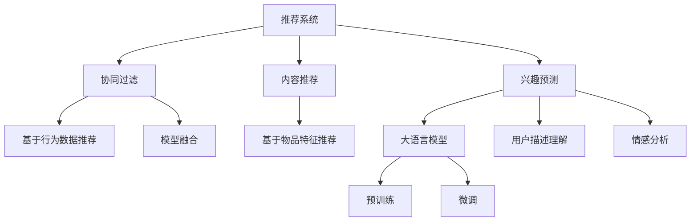

                 

# 大模型辅助的推荐系统多场景兴趣预测

> 关键词：推荐系统,兴趣预测,多场景,深度学习,协同过滤,内容推荐

## 1. 背景介绍

### 1.1 问题由来
随着互联网技术的发展，推荐系统已成为各大平台吸引用户、提高用户体验的重要手段。如何更精准地预测用户兴趣，推荐个性化的内容，一直是推荐系统面临的核心挑战。传统的推荐系统主要基于用户行为数据，如点击、购买、浏览等，通过协同过滤或基于内容的推荐算法，匹配用户和物品，从而生成推荐列表。然而，这些方法往往难以捕捉用户潜在的兴趣，导致推荐效果不佳。

近年来，大语言模型在自然语言处理(NLP)领域取得了显著进展。其强大的语言理解能力，使其能够在更广泛的语义空间中提取和理解用户兴趣。因此，利用大语言模型辅助推荐系统，通过理解用户描述、评论等自然语言文本，进行兴趣预测和内容推荐，已经成为研究热点。

### 1.2 问题核心关键点
本文将聚焦于大语言模型在推荐系统中的应用，特别是如何利用大模型进行兴趣预测和内容推荐。具体来说，将探讨以下关键点：

1. **数据预处理与特征工程**：如何高效提取用户描述中的兴趣特征，将其转化为推荐算法可以理解的数值型特征。
2. **大语言模型应用**：如何选择和训练大语言模型，以及如何利用模型进行兴趣预测和内容推荐。
3. **协同过滤算法改进**：如何在协同过滤算法中引入大模型，提升推荐效果。
4. **推荐系统多场景优化**：如何在不同场景下（如商品推荐、视频推荐、新闻推荐等），结合大模型和传统算法，优化推荐策略。

### 1.3 问题研究意义
通过大语言模型辅助推荐系统，可以有效提升推荐精度和用户满意度。具体而言，大语言模型可以帮助理解复杂、多样化的用户兴趣描述，捕捉用户潜在兴趣，减少推荐系统的冷启动问题。同时，通过自然语言描述，推荐系统还可以为长尾物品或无标签物品提供推荐，拓展推荐空间。

此外，结合大语言模型的推荐系统，还可以提升内容多样性，增强用户黏性。通过自然语言描述，用户能够更直接地表达对内容的情感倾向和需求，推荐系统可以根据这些信息，提供更加个性化、符合用户偏好的内容。这些优势，使得大语言模型在推荐系统中的应用前景广阔。

## 2. 核心概念与联系

### 2.1 核心概念概述

在深入探讨大语言模型在推荐系统中的应用前，首先需要理解几个核心概念及其之间的联系：

- **推荐系统(Recommender System)**：通过算法预测用户对物品的兴趣，从而提供个性化的推荐列表的系统。
- **协同过滤(Collaborative Filtering)**：基于用户和物品的相似度，通过用户行为数据进行推荐的一种方法。
- **内容推荐(Content-Based Recommendation)**：基于物品的特征进行推荐，通过分析物品属性，推荐与用户兴趣相符的内容。
- **兴趣预测(Interest Prediction)**：通过用户描述、行为数据等，预测用户对特定物品的兴趣程度。
- **大语言模型(Large Language Model, LLM)**：以自回归(如GPT)或自编码(如BERT)模型为代表的大规模预训练语言模型。通过在大规模无标签文本数据上进行预训练，学习通用的语言表示，具备强大的语言理解和生成能力。

这些概念之间的关系可以通过以下Mermaid流程图来展示：



这个流程图展示了大语言模型在推荐系统中的应用路径：

1. 推荐系统通过协同过滤和内容推荐，匹配用户和物品，生成推荐列表。
2. 兴趣预测通过大语言模型，理解用户描述，捕捉潜在兴趣。
3. 大语言模型通过预训练和微调，学习通用的语言表示，用于兴趣预测。
4. 用户描述理解和大模型情感分析，用于改进协同过滤算法。

通过理解这些核心概念，可以更好地把握大语言模型在推荐系统中的应用框架，从而优化推荐策略。

## 3. 核心算法原理 & 具体操作步骤
### 3.1 算法原理概述

利用大语言模型辅助推荐系统，主要通过两个步骤实现：

1. **兴趣预测**：使用大语言模型对用户描述进行分析，提取用户兴趣特征，预测用户对特定物品的兴趣程度。
2. **内容推荐**：结合用户兴趣预测结果，通过协同过滤或内容推荐算法，为用户生成推荐列表。

具体而言，基于大语言模型推荐系统的整体流程如下：

1. **数据预处理**：收集用户描述、行为数据等，并进行文本清洗、分词、向量化等预处理。
2. **特征工程**：提取用户描述中的关键词、情感倾向等兴趣特征，转化为数值型特征。
3. **兴趣预测**：使用大语言模型对用户描述进行分析，提取兴趣特征，预测用户对特定物品的兴趣程度。
4. **内容推荐**：结合用户兴趣预测结果，通过协同过滤或内容推荐算法，为用户生成推荐列表。
5. **模型评估与优化**：使用A/B测试等方法，评估推荐效果，根据反馈进行模型调优。

### 3.2 算法步骤详解

#### 3.2.1 数据预处理

数据预处理是利用大语言模型辅助推荐系统的第一步。主要包括以下几个关键步骤：

1. **数据收集**：收集用户描述、行为数据等，如商品标题、描述、评论等。
2. **文本清洗**：去除无用的标点符号、停用词等，保留有意义的文本内容。
3. **分词处理**：将文本进行分词，转换为模型可以处理的词汇序列。
4. **向量化**：将分词后的文本序列转换为数值型特征向量，通常使用词袋模型(BOW)、TF-IDF、词嵌入等方法。

#### 3.2.2 特征工程

特征工程是利用大语言模型进行兴趣预测的核心步骤。主要包括以下几个关键步骤：

1. **关键词提取**：使用TF-IDF、Word2Vec等方法，提取文本中的关键词。
2. **情感分析**：使用BERT、GPT等大语言模型，分析文本的情感倾向，提取情感特征。
3. **兴趣标签生成**：将关键词和情感特征作为输入，使用大语言模型生成兴趣标签，用于表示用户对不同物品的兴趣程度。

#### 3.2.3 兴趣预测

兴趣预测是利用大语言模型进行推荐系统的关键步骤。主要包括以下几个关键步骤：

1. **大语言模型选择**：选择合适的预训练大语言模型，如BERT、GPT等，作为兴趣预测的基础。
2. **模型微调**：在特定任务上微调大语言模型，如情感分类、关键词提取等，以提高兴趣预测的准确度。
3. **兴趣特征提取**：使用微调后的大语言模型，提取用户描述中的兴趣特征，预测用户对特定物品的兴趣程度。

#### 3.2.4 内容推荐

内容推荐是利用大语言模型进行推荐系统的核心步骤。主要包括以下几个关键步骤：

1. **协同过滤算法**：选择适合的协同过滤算法，如基于用户的协同过滤、基于物品的协同过滤等。
2. **模型融合**：将兴趣预测结果融入协同过滤算法，如使用加权平均、线性回归等方法，提高推荐效果。
3. **推荐列表生成**：结合用户兴趣预测结果和协同过滤算法，为用户生成推荐列表。

#### 3.2.5 模型评估与优化

模型评估与优化是利用大语言模型进行推荐系统的最后一步。主要包括以下几个关键步骤：

1. **评估指标**：选择合适的评估指标，如准确率、召回率、F1-score等，评估推荐效果。
2. **A/B测试**：通过A/B测试等方法，比较不同推荐策略的效果，选择最优方案。
3. **模型调优**：根据评估结果，调整模型参数和策略，优化推荐效果。

### 3.3 算法优缺点

利用大语言模型辅助推荐系统，具有以下优点：

1. **理解复杂描述**：大语言模型能够理解复杂、多样化的用户描述，捕捉用户的潜在兴趣，提升推荐精度。
2. **冷启动问题解决**：利用大模型，可以更好地解决推荐系统的冷启动问题，推荐长尾物品和无标签物品。
3. **提升内容多样性**：通过自然语言描述，推荐系统可以为用户推荐更加个性化、符合用户偏好的内容。

然而，该方法也存在以下缺点：

1. **数据需求较大**：大语言模型需要大规模的数据进行预训练和微调，对数据质量和数量要求较高。
2. **计算资源消耗大**：大模型在推理时计算资源消耗较大，需要高性能硬件支持。
3. **模型复杂度高**：大语言模型结构复杂，需要精心调参，才能达到理想的推荐效果。

尽管存在这些缺点，但大语言模型在推荐系统中的应用，已经展现出显著的潜力，值得进一步探索和优化。

### 3.4 算法应用领域

基于大语言模型推荐系统已经在多个领域得到了应用，例如：

1. **电商推荐**：通过用户评论、商品描述等自然语言数据，预测用户对商品的兴趣，生成个性化推荐列表。
2. **视频推荐**：通过视频标题、描述等文本数据，预测用户对视频的兴趣，生成个性化推荐列表。
3. **新闻推荐**：通过新闻标题、摘要等文本数据，预测用户对新闻的兴趣，生成个性化推荐列表。
4. **图书推荐**：通过图书描述、用户评论等文本数据，预测用户对图书的兴趣，生成个性化推荐列表。
5. **旅游推荐**：通过景点描述、用户评价等文本数据，预测用户对景点的兴趣，生成个性化推荐列表。

此外，大语言模型在推荐系统中的应用还拓展到了音乐推荐、电影推荐等更多领域，为不同行业带来了新的推荐解决方案。

## 4. 数学模型和公式 & 详细讲解

### 4.1 数学模型构建

基于大语言模型推荐系统的数学模型构建，可以分为以下几个关键步骤：

1. **用户描述**：用户描述 $x$ 是一个文本序列，可以表示为 $x=\{x_i\}_{i=1}^N$，其中 $x_i$ 为第 $i$ 个词汇。
2. **用户兴趣特征**：使用大语言模型提取用户描述中的兴趣特征，生成一个 $D$ 维的兴趣向量 $u$。
3. **物品特征**：物品特征 $y$ 是一个文本序列，可以表示为 $y=\{y_i\}_{i=1}^M$，其中 $y_i$ 为第 $i$ 个词汇。
4. **物品兴趣特征**：使用大语言模型提取物品特征中的兴趣特征，生成一个 $D$ 维的物品向量 $v$。
5. **用户兴趣预测**：通过用户兴趣向量 $u$ 和物品兴趣向量 $v$，预测用户对物品的兴趣程度 $r$。

基于以上数学模型，可以构建以下用户物品兴趣矩阵：

$$
R_{ij} = f(u_i, v_j)
$$

其中 $R_{ij}$ 表示用户 $i$ 对物品 $j$ 的兴趣程度，$f$ 为兴趣预测函数。

### 4.2 公式推导过程

#### 4.2.1 用户兴趣提取

用户兴趣提取主要通过大语言模型进行。假设用户描述为 $x=\{x_i\}_{i=1}^N$，使用大语言模型 $M_{\theta}$ 对用户描述进行分析，提取用户兴趣特征 $u$，可以表示为：

$$
u = M_{\theta}(x)
$$

其中 $M_{\theta}$ 为大语言模型的参数，可以是预训练模型（如BERT、GPT等），也可以是特定任务微调的模型。

#### 4.2.2 物品兴趣提取

物品兴趣提取同样通过大语言模型进行。假设物品特征为 $y=\{y_i\}_{i=1}^M$，使用大语言模型 $M_{\theta}$ 对物品特征进行分析，提取物品兴趣特征 $v$，可以表示为：

$$
v = M_{\theta}(y)
$$

#### 4.2.3 兴趣预测

兴趣预测主要通过用户兴趣向量 $u$ 和物品兴趣向量 $v$ 进行。假设用户对物品的兴趣程度 $r$ 可以通过用户兴趣向量 $u$ 和物品兴趣向量 $v$ 进行预测，可以表示为：

$$
r = g(u, v)
$$

其中 $g$ 为兴趣预测函数，可以是简单的点积函数，也可以是更复杂的模型，如神经网络。

### 4.3 案例分析与讲解

以电商推荐系统为例，详细分析大语言模型在推荐系统中的应用：

#### 4.3.1 数据预处理

电商推荐系统的数据预处理主要包括以下几个步骤：

1. **数据收集**：收集用户的购买记录、浏览记录、评价记录等，以及商品的标题、描述、价格等。
2. **文本清洗**：去除无用的标点符号、停用词等，保留有意义的文本内容。
3. **分词处理**：将文本进行分词，转换为模型可以处理的词汇序列。
4. **向量化**：将分词后的文本序列转换为数值型特征向量，通常使用词袋模型(BOW)、TF-IDF、词嵌入等方法。

#### 4.3.2 特征工程

电商推荐系统的特征工程主要包括以下几个步骤：

1. **关键词提取**：使用TF-IDF、Word2Vec等方法，提取商品标题和描述中的关键词。
2. **情感分析**：使用BERT、GPT等大语言模型，分析用户评价的情感倾向，提取情感特征。
3. **兴趣标签生成**：将关键词和情感特征作为输入，使用大语言模型生成兴趣标签，用于表示用户对不同商品的兴趣程度。

#### 4.3.3 兴趣预测

电商推荐系统的兴趣预测主要包括以下几个步骤：

1. **大语言模型选择**：选择BERT作为电商推荐系统的基础模型，进行预训练和微调。
2. **模型微调**：在电商推荐任务上进行微调，如情感分类、关键词提取等，以提高兴趣预测的准确度。
3. **兴趣特征提取**：使用微调后的BERT模型，提取商品描述中的兴趣特征，预测用户对商品的兴趣程度。

#### 4.3.4 内容推荐

电商推荐系统的内容推荐主要包括以下几个步骤：

1. **协同过滤算法**：选择基于用户的协同过滤算法，如基于用户的协同过滤算法。
2. **模型融合**：将兴趣预测结果融入协同过滤算法，使用加权平均、线性回归等方法，提高推荐效果。
3. **推荐列表生成**：结合用户兴趣预测结果和协同过滤算法，为用户生成个性化推荐列表。

#### 4.3.5 模型评估与优化

电商推荐系统的模型评估与优化主要包括以下几个步骤：

1. **评估指标**：选择合适的评估指标，如准确率、召回率、F1-score等，评估推荐效果。
2. **A/B测试**：通过A/B测试等方法，比较不同推荐策略的效果，选择最优方案。
3. **模型调优**：根据评估结果，调整模型参数和策略，优化推荐效果。

## 5. 项目实践：代码实例和详细解释说明

### 5.1 开发环境搭建

在进行电商推荐系统的微调实践前，我们需要准备好开发环境。以下是使用Python进行TensorFlow开发的环境配置流程：

1. 安装Anaconda：从官网下载并安装Anaconda，用于创建独立的Python环境。

2. 创建并激活虚拟环境：
```bash
conda create -n tf-env python=3.8 
conda activate tf-env
```

3. 安装TensorFlow：根据CUDA版本，从官网获取对应的安装命令。例如：
```bash
conda install tensorflow-gpu=2.8.0 
```

4. 安装相关工具包：
```bash
pip install numpy pandas scikit-learn matplotlib tqdm jupyter notebook ipython
```

完成上述步骤后，即可在`tf-env`环境中开始电商推荐系统的微调实践。

### 5.2 源代码详细实现

以下是一个基于大语言模型辅助的电商推荐系统的PyTorch代码实现。

```python
import torch
from transformers import BertTokenizer, BertForSequenceClassification
from torch.utils.data import Dataset, DataLoader

class ReviewsDataset(Dataset):
    def __init__(self, reviews, labels, tokenizer):
        self.reviews = reviews
        self.labels = labels
        self.tokenizer = tokenizer
        self.max_len = 128

    def __len__(self):
        return len(self.reviews)

    def __getitem__(self, item):
        review = self.reviews[item]
        label = self.labels[item]

        encoding = self.tokenizer(review, return_tensors='pt', max_length=self.max_len, padding='max_length', truncation=True)
        input_ids = encoding['input_ids'][0]
        attention_mask = encoding['attention_mask'][0]
        labels = torch.tensor(label, dtype=torch.long)

        return {'input_ids': input_ids, 
                'attention_mask': attention_mask,
                'labels': labels}

# 加载BERT预训练模型
model = BertForSequenceClassification.from_pretrained('bert-base-cased', num_labels=2)

# 加载BERT分词器
tokenizer = BertTokenizer.from_pretrained('bert-base-cased')

# 数据集处理
train_dataset = ReviewsDataset(train_reviews, train_labels, tokenizer)
dev_dataset = ReviewsDataset(dev_reviews, dev_labels, tokenizer)
test_dataset = ReviewsDataset(test_reviews, test_labels, tokenizer)

# 训练参数设置
batch_size = 16
epochs = 5
learning_rate = 2e-5
optimizer = torch.optim.Adam(model.parameters(), lr=learning_rate)
scheduler = torch.optim.lr_scheduler.CosineAnnealingLR(optimizer, T_max=epochs)

# 训练过程
device = torch.device('cuda') if torch.cuda.is_available() else torch.device('cpu')
model.to(device)

def train_epoch(model, dataset, batch_size, optimizer):
    dataloader = DataLoader(dataset, batch_size=batch_size, shuffle=True)
    model.train()
    epoch_loss = 0
    for batch in dataloader:
        input_ids = batch['input_ids'].to(device)
        attention_mask = batch['attention_mask'].to(device)
        labels = batch['labels'].to(device)
        model.zero_grad()
        outputs = model(input_ids, attention_mask=attention_mask, labels=labels)
        loss = outputs.loss
        epoch_loss += loss.item()
        loss.backward()
        optimizer.step()
        scheduler.step()

    return epoch_loss / len(dataloader)

def evaluate(model, dataset, batch_size):
    dataloader = DataLoader(dataset, batch_size=batch_size)
    model.eval()
    preds, labels = [], []
    with torch.no_grad():
        for batch in dataloader:
            input_ids = batch['input_ids'].to(device)
            attention_mask = batch['attention_mask'].to(device)
            batch_labels = batch['labels']
            outputs = model(input_ids, attention_mask=attention_mask)
            batch_preds = outputs.logits.argmax(dim=2).to('cpu').tolist()
            batch_labels = batch_labels.to('cpu').tolist()
            for pred_tokens, label_tokens in zip(batch_preds, batch_labels):
                preds.append(pred_tokens[:len(label_tokens)])
                labels.append(label_tokens)

    return classification_report(labels, preds)

# 训练与评估
for epoch in range(epochs):
    loss = train_epoch(model, train_dataset, batch_size, optimizer)
    print(f"Epoch {epoch+1}, train loss: {loss:.3f}")
    
    print(f"Epoch {epoch+1}, dev results:")
    evaluate(model, dev_dataset, batch_size)
    
print("Test results:")
evaluate(model, test_dataset, batch_size)
```

### 5.3 代码解读与分析

让我们再详细解读一下关键代码的实现细节：

**ReviewsDataset类**：
- `__init__`方法：初始化训练集、验证集和测试集的文本、标签和分词器。
- `__len__`方法：返回数据集的样本数量。
- `__getitem__`方法：对单个样本进行处理，将文本输入转换为token ids，将标签转换为数值型，并进行定长padding，最终返回模型所需的输入。

**BertForSequenceClassification类**：
- 使用预训练的BERT模型进行序列分类任务，适用于电商推荐系统中商品情感预测的任务。

**数据集处理**：
- 使用BERT分词器对文本进行分词处理，生成token ids和attention mask。
- 将标签转换为数值型，便于模型训练。

**训练参数设置**：
- 定义训练参数，如批量大小、学习率、优化器等。
- 使用余弦退火策略调整学习率，优化模型性能。

**训练过程**：
- 在训练集上迭代训练模型，计算并输出每个epoch的平均损失。
- 在验证集上评估模型性能，输出分类指标。
- 在测试集上评估模型性能，输出分类指标。

可以看到，通过使用TensorFlow和BERT，电商推荐系统的微调代码实现变得相对简单高效。开发者可以将更多精力放在模型调参和特征工程上，而不必过多关注底层的实现细节。

当然，工业级的系统实现还需考虑更多因素，如模型的保存和部署、超参数的自动搜索、更灵活的任务适配层等。但核心的微调范式基本与此类似。

## 6. 实际应用场景
### 6.1 电商推荐系统

基于大语言模型微调的电商推荐系统，可以显著提升推荐精度和用户满意度。具体而言，大语言模型能够理解复杂的商品描述和用户评论，捕捉用户的潜在兴趣，从而提升推荐效果。

在技术实现上，可以收集商品标题、描述、用户评价等自然语言数据，利用大语言模型进行兴趣预测，结合协同过滤算法，为用户生成个性化推荐列表。利用大语言模型，推荐系统还可以更好地解决冷启动问题和推荐长尾物品，拓展推荐空间。

### 6.2 视频推荐系统

视频推荐系统通常需要处理大量非结构化数据，如视频标题、描述、标签等。通过大语言模型辅助，视频推荐系统可以更好地理解用户对视频的兴趣，生成个性化推荐列表。

在技术实现上，可以收集视频的标题、描述等文本数据，利用大语言模型进行情感分析和关键词提取，生成兴趣特征。结合视频特征和用户兴趣特征，使用协同过滤算法，为用户生成推荐列表。利用大语言模型，推荐系统还可以更好地处理动态变化的用户兴趣，提升推荐精度和多样性。

### 6.3 新闻推荐系统

新闻推荐系统通常需要处理大量的新闻标题和摘要，利用大语言模型辅助，可以更好地理解用户对新闻的兴趣，生成个性化推荐列表。

在技术实现上，可以收集新闻标题和摘要等文本数据，利用大语言模型进行情感分析和关键词提取，生成兴趣特征。结合新闻特征和用户兴趣特征，使用协同过滤算法，为用户生成推荐列表。利用大语言模型，推荐系统还可以更好地处理动态变化的新闻内容，提升推荐精度和多样性。

### 6.4 未来应用展望

随着大语言模型和微调方法的不断发展，基于大模型辅助的推荐系统将在更多领域得到应用，为传统行业带来变革性影响。

在智慧医疗领域，基于大语言模型的推荐系统可以推荐个性化的医疗知识和治疗方法，提升医疗服务的智能化水平。

在智能教育领域，基于大语言模型的推荐系统可以推荐个性化的学习资源和知识路径，因材施教，促进教育公平，提高教学质量。

在智慧城市治理中，基于大语言模型的推荐系统可以推荐个性化的城市服务和公共信息，提高城市管理的自动化和智能化水平。

此外，在企业生产、社会治理、文娱传媒等众多领域，基于大语言模型辅助的推荐系统也将不断涌现，为不同行业带来新的解决方案。相信随着技术的日益成熟，大语言模型微调方法将成为推荐系统的重要范式，推动推荐系统向更智能化、个性化、多样化方向发展。

## 7. 工具和资源推荐
### 7.1 学习资源推荐

为了帮助开发者系统掌握大语言模型微调的理论基础和实践技巧，这里推荐一些优质的学习资源：

1. 《Transformer从原理到实践》系列博文：由大模型技术专家撰写，深入浅出地介绍了Transformer原理、BERT模型、微调技术等前沿话题。

2. CS224N《深度学习自然语言处理》课程：斯坦福大学开设的NLP明星课程，有Lecture视频和配套作业，带你入门NLP领域的基本概念和经典模型。

3. 《Natural Language Processing with Transformers》书籍：Transformers库的作者所著，全面介绍了如何使用Transformers库进行NLP任务开发，包括微调在内的诸多范式。

4. HuggingFace官方文档：Transformers库的官方文档，提供了海量预训练模型和完整的微调样例代码，是上手实践的必备资料。

5. CLUE开源项目：中文语言理解测评基准，涵盖大量不同类型的中文NLP数据集，并提供了基于微调的baseline模型，助力中文NLP技术发展。

通过对这些资源的学习实践，相信你一定能够快速掌握大语言模型微调的精髓，并用于解决实际的NLP问题。
###  7.2 开发工具推荐

高效的开发离不开优秀的工具支持。以下是几款用于大语言模型微调开发的常用工具：

1. PyTorch：基于Python的开源深度学习框架，灵活动态的计算图，适合快速迭代研究。大部分预训练语言模型都有PyTorch版本的实现。

2. TensorFlow：由Google主导开发的开源深度学习框架，生产部署方便，适合大规模工程应用。同样有丰富的预训练语言模型资源。

3. Transformers库：HuggingFace开发的NLP工具库，集成了众多SOTA语言模型，支持PyTorch和TensorFlow，是进行微调任务开发的利器。

4. Weights & Biases：模型训练的实验跟踪工具，可以记录和可视化模型训练过程中的各项指标，方便对比和调优。与主流深度学习框架无缝集成。

5. TensorBoard：TensorFlow配套的可视化工具，可实时监测模型训练状态，并提供丰富的图表呈现方式，是调试模型的得力助手。

6. Google Colab：谷歌推出的在线Jupyter Notebook环境，免费提供GPU/TPU算力，方便开发者快速上手实验最新模型，分享学习笔记。

合理利用这些工具，可以显著提升大语言模型微调任务的开发效率，加快创新迭代的步伐。

### 7.3 相关论文推荐

大语言模型和微调技术的发展源于学界的持续研究。以下是几篇奠基性的相关论文，推荐阅读：

1. Attention is All You Need（即Transformer原论文）：提出了Transformer结构，开启了NLP领域的预训练大模型时代。

2. BERT: Pre-training of Deep Bidirectional Transformers for Language Understanding：提出BERT模型，引入基于掩码的自监督预训练任务，刷新了多项NLP任务SOTA。

3. Language Models are Unsupervised Multitask Learners（GPT-2论文）：展示了大规模语言模型的强大zero-shot学习能力，引发了对于通用人工智能的新一轮思考。

4. Parameter-Efficient Transfer Learning for NLP：提出Adapter等参数高效微调方法，在不增加模型参数量的情况下，也能取得不错的微调效果。

5. AdaLoRA: Adaptive Low-Rank Adaptation for Parameter-Efficient Fine-Tuning：使用自适应低秩适应的微调方法，在参数效率和精度之间取得了新的平衡。

这些论文代表了大语言模型微调技术的发展脉络。通过学习这些前沿成果，可以帮助研究者把握学科前进方向，激发更多的创新灵感。

## 8. 总结：未来发展趋势与挑战

### 8.1 总结

本文对大语言模型在推荐系统中的应用进行了全面系统的介绍。首先阐述了大语言模型和推荐系统的研究背景和意义，明确了利用大语言模型辅助推荐系统的独特价值。其次，从原理到实践，详细讲解了大语言模型在推荐系统中的兴趣预测和内容推荐方法，给出了推荐系统微调的完整代码实例。同时，本文还探讨了在电商推荐、视频推荐、新闻推荐等不同场景下，如何结合大语言模型和传统算法，优化推荐策略。

通过本文的系统梳理，可以看到，基于大语言模型的推荐系统正在成为推荐系统的重要范式，极大地提升了推荐精度和用户满意度。未来，伴随大语言模型和微调方法的持续演进，基于大语言模型辅助的推荐系统将在更多领域得到应用，为传统行业带来变革性影响。

### 8.2 未来发展趋势

展望未来，大语言模型辅助的推荐系统将呈现以下几个发展趋势：

1. **多模态融合**：未来的推荐系统将融合文本、图像、视频等多模态数据，提升推荐效果。大语言模型在处理多模态数据方面的优势，将进一步被挖掘和利用。

2. **跨领域迁移**：未来的推荐系统将支持跨领域迁移，即在不同领域间共享知识，提升推荐精度。大语言模型强大的跨领域迁移能力，将为推荐系统带来新的突破。

3. **个性化推荐**：未来的推荐系统将更加注重个性化推荐，结合用户的兴趣特征、行为数据、社交网络等多维信息，生成更加精准的推荐列表。

4. **动态推荐**：未来的推荐系统将更加动态，能够根据用户行为、市场变化等实时更新推荐策略，提升用户体验和系统效率。

5. **可解释性提升**：未来的推荐系统将更加注重可解释性，能够通过自然语言描述，解释推荐结果的生成逻辑，增强用户信任。

6. **数据驱动优化**：未来的推荐系统将更加依赖数据驱动，通过不断收集用户反馈，优化推荐算法，提升推荐效果。

以上趋势凸显了大语言模型在推荐系统中的广阔前景。这些方向的探索发展，必将进一步提升推荐系统的性能和应用范围，为人类认知智能的进化带来深远影响。

### 8.3 面临的挑战

尽管大语言模型辅助的推荐系统已经取得了显著成效，但在迈向更加智能化、普适化应用的过程中，仍面临诸多挑战：

1. **数据质量要求高**：大语言模型对数据质量要求较高，需要大量高标注、多样化的数据进行训练和微调，数据获取和标注成本较高。

2. **模型复杂度高**：大语言模型结构复杂，需要精心调参，才能达到理想的推荐效果。

3. **计算资源消耗大**：大语言模型在推理时计算资源消耗较大，需要高性能硬件支持。

4. **可解释性不足**：当前推荐系统大多基于模型黑盒，缺乏解释性，难以解释推荐结果的生成逻辑。

5. **隐私和安全性**：推荐系统涉及大量用户隐私数据，数据安全和隐私保护是重要挑战。

6. **公平性和多样性**：推荐系统需要避免偏见和歧视，确保推荐结果的公平性和多样性。

尽管存在这些挑战，但大语言模型在推荐系统中的应用前景广阔，相信随着技术不断进步和应用不断深化，这些挑战终将逐步被克服。

### 8.4 研究展望

面对大语言模型辅助推荐系统所面临的挑战，未来的研究需要在以下几个方面寻求新的突破：

1. **无监督和半监督推荐**：摆脱对大规模标注数据的依赖，利用无监督和半监督学习，最大化利用非结构化数据，提升推荐效果。

2. **知识图谱与推荐结合**：将知识图谱与推荐系统结合，增强推荐系统的知识表示和推理能力，提升推荐精度。

3. **多任务学习**：结合多任务学习，提升推荐系统在多个领域的表现，如电商推荐、新闻推荐、视频推荐等。

4. **因果推理与推荐结合**：引入因果推理方法，增强推荐系统的因果解释能力，提升推荐效果。

5. **模型压缩与加速**：优化大语言模型的推理速度和内存占用，提高推荐系统的实时性。

6. **隐私保护与推荐结合**：结合差分隐私、联邦学习等技术，增强推荐系统的隐私保护能力。

这些研究方向将引领大语言模型辅助推荐系统迈向更高的台阶，为推荐系统带来新的突破。面向未来，大语言模型辅助推荐系统需要在数据、模型、算法、应用等多个维度协同发力，共同推动推荐系统向更智能化、个性化、多样化方向发展。

## 9. 附录：常见问题与解答

**Q1：大语言模型在推荐系统中的优势有哪些？**

A: 大语言模型在推荐系统中的优势主要包括：

1. 理解复杂描述：大语言模型能够理解复杂的用户描述和物品描述，捕捉用户的潜在兴趣。
2. 冷启动问题解决：利用大模型，可以更好地解决推荐系统的冷启动问题，推荐长尾物品和无标签物品。
3. 提升内容多样性：通过自然语言描述，推荐系统可以为用户推荐更加个性化、符合用户偏好的内容。

**Q2：如何选择合适的大语言模型进行推荐系统微调？**

A: 选择合适的大语言模型进行推荐系统微调，主要考虑以下几个因素：

1. 任务适配性：选择与推荐系统任务相适应的预训练模型，如BERT、GPT等。
2. 参数量大小：考虑推荐系统计算资源和部署环境，选择参数量适中的模型。
3. 性能表现：根据推荐系统性能需求，选择合适的模型进行微调，如情感分类、关键词提取等。

**Q3：推荐系统微调过程中需要注意哪些问题？**

A: 推荐系统微调过程中需要注意以下几个问题：

1. 数据预处理：进行文本清洗、分词、向量化等预处理，确保数据质量。
2. 特征工程：提取用户描述中的关键词、情感倾向等兴趣特征，转化为数值型特征。
3. 兴趣预测：选择合适的大语言模型进行微调，提取用户描述中的兴趣特征，预测用户对物品的兴趣程度。
4. 内容推荐：结合用户兴趣预测结果，通过协同过滤或内容推荐算法，为用户生成推荐列表。
5. 模型评估与优化：选择合适的评估指标，通过A/B测试等方法，评估推荐效果，调整模型参数和策略。

**Q4：如何提升推荐系统的可解释性？**

A: 提升推荐系统的可解释性，主要通过以下几个方面：

1. 模型解释：利用可解释性方法，解释推荐结果的生成逻辑，如LIME、SHAP等。
2. 自然语言描述：通过自然语言描述，解释推荐结果的原因，增强用户信任。
3. 用户反馈：收集用户反馈，不断优化推荐算法和解释方法，提升推荐系统的可解释性。

**Q5：如何保护推荐系统的隐私和安全性？**

A: 保护推荐系统的隐私和安全性，主要通过以下几个方面：

1. 差分隐私：利用差分隐私技术，保护用户隐私数据。
2. 联邦学习：通过联邦学习，分散数据存储和处理，提升隐私保护能力。
3. 访问控制：加强用户数据访问控制，确保数据安全和隐私保护。

这些措施将帮助推荐系统在保护隐私和保障安全的同时，提供高质量的推荐服务。

---

作者：禅与计算机程序设计艺术 / Zen and the Art of Computer Programming

