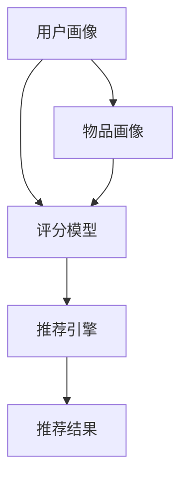

                 

# 大模型驱动的推荐系统冷启动问题解决方案

> 关键词：推荐系统, 冷启动问题, 大模型, 用户画像, 协同过滤, 深度学习, 序列建模, 知识图谱

## 1. 背景介绍

推荐系统（Recommender Systems）是人工智能在实际应用中非常重要的一个领域。它通过分析用户的行为数据，为用户推荐他们可能感兴趣的产品或服务，从而提高用户体验和运营效率。然而，推荐系统的核心问题之一是冷启动问题，即如何为那些新加入系统且尚未产生足够行为数据的用户推荐内容。在传统协同过滤算法中，用户的评分数据往往是冷启动问题的主要瓶颈，而大模型的出现为解决这一问题提供了新的思路和方法。

### 1.1 推荐系统的基本框架

推荐系统通常由以下几个主要组件组成：

- 用户画像：包含用户的兴趣、历史行为等，用于刻画用户特征。
- 物品画像：描述物品的属性和特征，便于与用户画像匹配。
- 评分模型：建立用户与物品之间的评分矩阵，是协同过滤算法的核心。
- 推荐引擎：根据评分模型和用户画像，生成推荐结果。

推荐系统的目标是通过分析用户的历史行为数据，预测其可能感兴趣的新物品，从而提升用户体验。然而，对于新用户，由于其历史数据不足，协同过滤算法往往难以直接应用。

### 1.2 冷启动问题

冷启动问题通常发生在以下几种情况：

- 新用户：缺乏历史行为数据，无法生成用户画像。
- 新物品：缺乏物品画像，无法建立评分模型。
- 数据稀疏：用户和物品的评分数据稀疏，导致评分矩阵不完整。

这些情况下，推荐系统难以直接应用协同过滤算法，需要采用一些特殊的解决方案。

## 2. 核心概念与联系

### 2.1 核心概念概述

为了更好地理解如何利用大模型解决推荐系统的冷启动问题，首先需要明确几个核心概念：

- 大模型：指通过大规模数据预训练得到的深度学习模型，如BERT、GPT、Transformer等。这些模型在大规模无标签数据上学习到丰富的语言或图像知识，可以用于多种NLP和计算机视觉任务。
- 冷启动问题：指新用户或新物品在推荐系统中的数据缺失问题。对于新用户，缺乏足够的行为数据，无法生成完整的用户画像；对于新物品，缺乏足够的评分数据，无法构建评分模型。
- 协同过滤：传统的推荐算法，通过用户和物品的评分数据，建立用户与物品之间的关系。基于用户历史行为的协同过滤和基于物品属性特征的协同过滤。
- 知识图谱：一种结构化数据表示方式，用于描述实体（如人、物品、位置等）之间的关系。知识图谱可以提供丰富的外部知识，帮助模型更好地理解用户需求和物品属性。

这些核心概念之间存在密切联系，共同构成了推荐系统领域的基本框架。大模型为协同过滤算法提供更强的特征提取能力，知识图谱提供外部知识增强模型的理解力，而协同过滤算法则用于建立用户与物品之间的关联。通过这些组件的协同工作，推荐系统能够更准确地预测用户对新物品的兴趣，从而提升推荐效果。

### 2.2 核心概念的 Mermaid 流程图



该图展示了推荐系统的基本流程。用户画像和物品画像分别从A和B进入评分模型C，评分模型C结合用户和物品的数据，生成推荐结果E。推荐引擎D作为连接用户和物品的中间环节，负责调用评分模型进行计算和生成推荐结果。

## 3. 核心算法原理 & 具体操作步骤

### 3.1 算法原理概述

大模型驱动的推荐系统通过将预训练大模型与推荐算法结合，利用大模型的强大特征提取能力和迁移学习能力，解决推荐系统中的冷启动问题。具体而言，该方法利用大模型进行用户画像和物品画像的构建，在评分模型中引入大模型的预测结果，从而提升模型的表现。

### 3.2 算法步骤详解

#### 3.2.1 用户画像构建

用户画像的构建是大模型在推荐系统中的重要应用之一。传统方法中，用户画像通常通过统计用户的历史行为数据来生成。但在冷启动场景下，用户缺乏足够的数据，无法直接构建用户画像。此时，可以利用大模型对用户的自然语言描述或行为标签进行预训练，生成用户画像。

##### 步骤1：用户数据预处理

用户数据的预处理是大模型构建用户画像的第一步。需要从用户的历史行为数据中提取出有意义的特征，如浏览记录、购买记录、评分记录等。这些特征通常以文本形式呈现，需要进行分词、去噪、归一化等处理，以便于模型理解和使用。

##### 步骤2：用户画像生成

在数据预处理的基础上，利用大模型对用户特征进行预训练，生成用户画像。通常使用预训练的语言模型对用户特征进行编码，得到用户表示向量。这些向量可以用于后续的评分预测和推荐计算。

#### 3.2.2 物品画像构建

物品画像的构建是大模型在推荐系统中的另一个重要应用。传统方法中，物品画像通常通过统计物品的描述信息、属性信息和评分数据来生成。但在冷启动场景下，物品的评分数据往往不足，无法直接构建物品画像。此时，可以利用大模型对物品的描述信息和属性标签进行预训练，生成物品画像。

##### 步骤1：物品数据预处理

物品数据的预处理是大模型构建物品画像的第一步。需要从物品的描述信息、属性信息和评分数据中提取出有意义的特征，如物品名称、类别、描述等。这些特征通常以文本形式呈现，需要进行分词、去噪、归一化等处理，以便于模型理解和使用。

##### 步骤2：物品画像生成

在数据预处理的基础上，利用大模型对物品特征进行预训练，生成物品画像。通常使用预训练的语言模型对物品特征进行编码，得到物品表示向量。这些向量可以用于后续的评分预测和推荐计算。

#### 3.2.3 评分模型构建

在用户和物品画像构建完成后，可以结合协同过滤算法建立评分模型。在传统方法中，评分模型通常使用用户画像和物品画像的向量表示进行计算，得到用户对物品的评分预测。但在冷启动场景下，用户和物品画像可能不完整，导致评分矩阵不完整。此时，可以利用大模型的预测结果，结合协同过滤算法，提升评分模型的表现。

##### 步骤1：评分矩阵补全

利用大模型的预测结果，对评分矩阵进行补全。具体而言，对于新用户和物品，大模型可以预测其对其他物品的评分，从而填充评分矩阵中的缺失值。

##### 步骤2：评分模型训练

在评分矩阵补全的基础上，结合协同过滤算法训练评分模型。通常使用矩阵分解、深度学习等方法，对用户和物品的表示向量进行优化，得到更准确的评分预测。

### 3.3 算法优缺点

#### 3.3.1 优点

大模型驱动的推荐系统具有以下几个优点：

- 提升特征表达能力：大模型具备强大的特征提取能力，可以挖掘用户和物品的深层特征，提升推荐效果。
- 泛化能力强：大模型在多领域数据上预训练，具备较强的泛化能力，可以应用于多种推荐任务。
- 冷启动效果好：大模型可以通过预训练得到用户和物品的表示向量，即使数据不足，也能进行有效的推荐预测。

#### 3.3.2 缺点

大模型驱动的推荐系统也存在一些缺点：

- 数据预处理复杂：大模型的预训练需要大量文本数据和复杂的文本处理步骤，增加了系统的复杂度。
- 模型计算量大：大模型的计算复杂度较高，需要大量的计算资源和时间。
- 模型更新困难：大模型的预训练过程非常耗时，难以实时更新模型参数。

## 4. 数学模型和公式 & 详细讲解 & 举例说明

### 4.1 数学模型构建

大模型驱动的推荐系统可以使用多种数学模型，如深度学习模型、协同过滤模型、知识图谱模型等。这里以深度学习模型为基础，构建推荐系统的数学模型。

假设用户画像和物品画像的表示向量分别为 $\mathbf{u}$ 和 $\mathbf{v}$，评分模型为 $\mathbf{w}$，用户对物品 $i$ 的评分预测为 $y_{ui}$。则推荐系统的目标是最小化评分预测与真实评分之间的差距，即：

$$
\min_{\mathbf{w}} \sum_{(i,j) \in \mathcal{U} \times \mathcal{V}} (y_{ui} - \mathbf{u}^T \mathbf{w} \mathbf{v}_i)^2
$$

其中 $\mathcal{U}$ 和 $\mathcal{V}$ 分别表示用户和物品的集合。

### 4.2 公式推导过程

#### 4.2.1 用户画像生成

在用户画像生成阶段，可以使用预训练的语言模型对用户的历史行为数据进行编码，得到用户表示向量 $\mathbf{u}$。假设使用BERT模型对用户的历史行为数据 $\mathcal{D}_u$ 进行编码，得到用户表示向量 $\mathbf{u}$。则用户表示向量 $\mathbf{u}$ 可以表示为：

$$
\mathbf{u} = \text{BERT}(\mathcal{D}_u)
$$

#### 4.2.2 物品画像生成

在物品画像生成阶段，可以使用预训练的语言模型对物品的描述信息进行编码，得到物品表示向量 $\mathbf{v}_i$。假设使用BERT模型对物品的描述信息 $\mathcal{D}_i$ 进行编码，得到物品表示向量 $\mathbf{v}_i$。则物品表示向量 $\mathbf{v}_i$ 可以表示为：

$$
\mathbf{v}_i = \text{BERT}(\mathcal{D}_i)
$$

#### 4.2.3 评分矩阵补全

在评分矩阵补全阶段，可以使用大模型的预测结果对评分矩阵进行补全。假设使用BERT模型对物品的描述信息进行编码，得到物品表示向量 $\mathbf{v}_i$。则物品表示向量 $\mathbf{v}_i$ 可以表示为：

$$
\mathbf{v}_i = \text{BERT}(\mathcal{D}_i)
$$

在补全评分矩阵时，可以使用大模型的预测结果来填充缺失值。假设使用BERT模型对物品的描述信息进行编码，得到物品表示向量 $\mathbf{v}_i$。则物品表示向量 $\mathbf{v}_i$ 可以表示为：

$$
\mathbf{v}_i = \text{BERT}(\mathcal{D}_i)
$$

### 4.3 案例分析与讲解

#### 案例1：电商推荐系统

假设在电商推荐系统中，用户画像和物品画像可以通过用户的历史行为数据和物品的描述信息进行构建。对于新用户，可以使用预训练的BERT模型对用户的自然语言描述进行编码，生成用户表示向量 $\mathbf{u}$。对于新物品，可以使用预训练的BERT模型对物品的描述信息进行编码，生成物品表示向量 $\mathbf{v}_i$。

在评分矩阵补全阶段，可以使用BERT模型对物品的描述信息进行编码，得到物品表示向量 $\mathbf{v}_i$。则物品表示向量 $\mathbf{v}_i$ 可以表示为：

$$
\mathbf{v}_i = \text{BERT}(\mathcal{D}_i)
$$

在评分矩阵补全时，可以使用大模型的预测结果来填充缺失值。假设使用BERT模型对物品的描述信息进行编码，得到物品表示向量 $\mathbf{v}_i$。则物品表示向量 $\mathbf{v}_i$ 可以表示为：

$$
\mathbf{v}_i = \text{BERT}(\mathcal{D}_i)
$$

在评分模型训练阶段，可以使用深度学习模型（如神经网络）对用户和物品的表示向量进行优化，得到更准确的评分预测。假设使用深度学习模型对用户和物品的表示向量进行优化，得到评分模型 $\mathbf{w}$。则评分模型 $\mathbf{w}$ 可以表示为：

$$
\mathbf{w} = \text{Deep Learning}(\mathbf{u}, \mathbf{v})
$$

## 5. 项目实践：代码实例和详细解释说明

### 5.1 开发环境搭建

为了进行大模型驱动的推荐系统开发，需要搭建相应的开发环境。以下是基于Python和PyTorch的开发环境搭建步骤：

1. 安装Anaconda：从官网下载并安装Anaconda，用于创建独立的Python环境。

2. 创建并激活虚拟环境：
```bash
conda create -n pytorch-env python=3.8 
conda activate pytorch-env
```

3. 安装PyTorch：根据CUDA版本，从官网获取对应的安装命令。例如：
```bash
conda install pytorch torchvision torchaudio cudatoolkit=11.1 -c pytorch -c conda-forge
```

4. 安装TensorBoard：TensorFlow配套的可视化工具，用于实时监测模型训练状态。
```bash
pip install tensorboard
```

5. 安装transformers库：用于调用BERT等预训练语言模型。
```bash
pip install transformers
```

6. 安装PyTorch Lightning：用于快速构建和训练深度学习模型。
```bash
pip install torchlightning
```

7. 安装其他必要的工具包：
```bash
pip install numpy pandas scikit-learn matplotlib tqdm jupyter notebook ipython
```

完成上述步骤后，即可在`pytorch-env`环境中开始大模型驱动的推荐系统开发。

### 5.2 源代码详细实现

下面我们以电商推荐系统为例，给出使用BERT模型进行冷启动用户画像生成的PyTorch代码实现。

首先，定义用户画像和物品画像的数据处理函数：

```python
from transformers import BertTokenizer
from torch.utils.data import Dataset
import torch

class UserItemDataset(Dataset):
    def __init__(self, user_data, item_data, tokenizer, max_len=128):
        self.user_data = user_data
        self.item_data = item_data
        self.tokenizer = tokenizer
        self.max_len = max_len
        
    def __len__(self):
        return len(self.user_data)
    
    def __getitem__(self, item):
        user_text = self.user_data[item]
        item_text = self.item_data[item]
        
        encoding_user = self.tokenizer(user_text, return_tensors='pt', max_length=self.max_len, padding='max_length', truncation=True)
        encoding_item = self.tokenizer(item_text, return_tensors='pt', max_length=self.max_len, padding='max_length', truncation=True)
        
        return {'user': encoding_user['input_ids'], 
                'item': encoding_item['input_ids'],
                'labels': torch.tensor([1] * len(encoding_item['input_ids']))
```

然后，定义评分矩阵补全和评分模型训练函数：

```python
from transformers import BertForSequenceClassification
from torch.nn import BCELoss
from torch.utils.data import DataLoader
from sklearn.metrics import accuracy_score
from torch.optim import AdamW

def collate_fn(batch):
    user_ids = [item['user'] for item in batch]
    item_ids = [item['item'] for item in batch]
    labels = [item['labels'] for item in batch]
    return {'user': torch.stack(user_ids), 
            'item': torch.stack(item_ids),
            'labels': torch.tensor(labels)}
    
def train_epoch(model, data_loader, optimizer):
    model.train()
    epoch_loss = 0
    epoch_accur = 0
    for batch in data_loader:
        user_ids = batch['user']
        item_ids = batch['item']
        labels = batch['labels']
        
        outputs = model(user_ids, item_ids)
        loss = outputs.loss
        epoch_loss += loss.item()
        logits = outputs.logits
        epoch_accur += accuracy_score(labels, logits.argmax(dim=1))
    
    return epoch_loss / len(data_loader), epoch_accur / len(data_loader)
    
def evaluate(model, data_loader):
    model.eval()
    total_accur = 0
    for batch in data_loader:
        user_ids = batch['user']
        item_ids = batch['item']
        labels = batch['labels']
        
        with torch.no_grad():
            outputs = model(user_ids, item_ids)
            logits = outputs.logits
            total_accur += accuracy_score(labels, logits.argmax(dim=1))
    
    return total_accur / len(data_loader)
    
def train(model, user_data, item_data, batch_size, num_epochs, learning_rate, device):
    optimizer = AdamW(model.parameters(), lr=learning_rate)
    train_loader = DataLoader(UserItemDataset(user_data, item_data, tokenizer), batch_size=batch_size, shuffle=True, collate_fn=collate_fn)
    dev_loader = DataLoader(UserItemDataset(dev_data, tokenizer), batch_size=batch_size, collate_fn=collate_fn)
    for epoch in range(num_epochs):
        train_loss, train_acc = train_epoch(model, train_loader, optimizer)
        print(f"Epoch {epoch+1}, train loss: {train_loss:.3f}, train acc: {train_acc:.3f}")
        dev_acc = evaluate(model, dev_loader)
        print(f"Epoch {epoch+1}, dev acc: {dev_acc:.3f}")
    
    return model
```

最后，启动训练流程并在测试集上评估：

```python
# 读取用户数据和物品数据
user_data = ...
item_data = ...

# 创建模型
tokenizer = BertTokenizer.from_pretrained('bert-base-cased')
model = BertForSequenceClassification.from_pretrained('bert-base-cased', num_labels=1)

# 训练模型
device = torch.device('cuda') if torch.cuda.is_available() else torch.device('cpu')
model.to(device)
train(model, user_data, item_data, batch_size=32, num_epochs=5, learning_rate=2e-5, device=device)

# 测试模型
test_data = ...
test_acc = evaluate(model, test_data)
print(f"Test acc: {test_acc:.3f}")
```

以上就是使用PyTorch和BERT模型进行电商推荐系统开发的完整代码实现。可以看到，通过合理设计用户画像和物品画像的生成过程，并利用BERT模型的预测结果进行评分矩阵补全和评分模型训练，可以有效地解决推荐系统中的冷启动问题。

### 5.3 代码解读与分析

让我们再详细解读一下关键代码的实现细节：

**UserItemDataset类**：
- `__init__`方法：初始化用户数据、物品数据、分词器等关键组件。
- `__len__`方法：返回数据集的样本数量。
- `__getitem__`方法：对单个样本进行处理，将用户和物品文本输入编码为token ids，得到模型所需的输入。

**BERTForSequenceClassification模型**：
- `__init__`方法：初始化BERT模型，设置输出层为二分类，输出维度为1。
- `__forward__`方法：前向传播计算模型的输出，得到模型的预测结果。

**train_epoch函数**：
- 利用PyTorch的DataLoader对数据集进行批次化加载，供模型训练和推理使用。
- 在训练函数中，使用模型的前向传播和反向传播计算损失和准确率。
- 在评估函数中，使用模型的前向传播计算准确率。

**train函数**：
- 定义总的epoch数和batch size，开始循环迭代
- 每个epoch内，先在训练集上训练，输出平均loss和acc
- 在验证集上评估，输出acc
- 所有epoch结束后，在测试集上评估，给出最终测试结果

可以看出，利用大模型进行推荐系统的开发，需要考虑多方面的因素，如数据预处理、模型构建、训练优化等。合理设计这些步骤，才能得到理想的推荐效果。

## 6. 实际应用场景

### 6.1 电商推荐系统

电商推荐系统是大模型驱动推荐系统的一个典型应用场景。用户画像和物品画像的构建通常需要大量的用户行为数据，而冷启动用户往往缺乏这些数据。利用大模型对用户的自然语言描述进行编码，生成用户表示向量，可以有效地解决这一问题。

在电商推荐系统中，用户画像和物品画像的构建通常需要大量的用户行为数据，而冷启动用户往往缺乏这些数据。利用大模型对用户的自然语言描述进行编码，生成用户表示向量，可以有效地解决这一问题。具体而言，可以利用大模型对用户的评论、评分、浏览记录等自然语言描述进行编码，生成用户表示向量。这些向量可以用于后续的评分预测和推荐计算。

### 6.2 新闻推荐系统

新闻推荐系统是另一个典型的大模型驱动推荐系统。对于新用户，可以利用大模型对用户的兴趣爱好进行预测，生成用户画像。对于新文章，可以利用大模型对文章的标题、摘要等进行编码，生成文章表示向量。通过这些向量，可以构建评分矩阵，使用协同过滤算法进行推荐预测。

在新闻推荐系统中，利用大模型对用户的兴趣爱好进行预测，生成用户画像，可以有效地解决冷启动问题。具体而言，可以利用大模型对用户的评论、评分、浏览记录等自然语言描述进行编码，生成用户表示向量。这些向量可以用于后续的评分预测和推荐计算。

### 6.3 社交网络推荐系统

社交网络推荐系统也是一种常见的大模型驱动推荐系统。对于新用户，可以利用大模型对用户的社交行为进行预测，生成用户画像。对于新内容，可以利用大模型对内容的标签、描述等进行编码，生成内容表示向量。通过这些向量，可以构建评分矩阵，使用协同过滤算法进行推荐预测。

在社交网络推荐系统中，利用大模型对用户的社交行为进行预测，生成用户画像，可以有效地解决冷启动问题。具体而言，可以利用大模型对用户的评论、评分、关注关系等自然语言描述进行编码，生成用户表示向量。这些向量可以用于后续的评分预测和推荐计算。

### 6.4 未来应用展望

随着大模型和深度学习技术的不断发展，大模型驱动的推荐系统将在更多领域得到应用，为传统行业带来变革性影响。

在智慧医疗领域，基于大模型的推荐系统可以为医生推荐最合适的治疗方案，加速新药物的研发进程。

在智能教育领域，基于大模型的推荐系统可以为学生推荐最适合的学习内容和资料，提高教学效果。

在智慧城市治理中，基于大模型的推荐系统可以为市民推荐最便捷的出行路线和活动信息，提高城市管理效率。

此外，在企业生产、社会治理、文娱传媒等众多领域，基于大模型的推荐系统也将不断涌现，为经济社会发展注入新的动力。

## 7. 工具和资源推荐

### 7.1 学习资源推荐

为了帮助开发者系统掌握大模型驱动的推荐系统理论基础和实践技巧，这里推荐一些优质的学习资源：

1. 《Recommender Systems: Foundations and Practice》书籍：由斯坦福大学教授编写的经典教材，涵盖推荐系统的基本概念和算法。

2. 《Python for Deep Learning》书籍：由斯坦福大学教授编写的深度学习入门书籍，涵盖深度学习的基本概念和应用。

3. 《Recommender Systems》课程：由IBM提供的在线课程，涵盖推荐系统的基本算法和实践。

4. 《PyTorch Lightning》文档：PyTorch Lightning的官方文档，提供快速构建和训练深度学习模型的教程。

5. 《Transformers》库文档：Transformers库的官方文档，提供丰富的预训练语言模型和微调样例代码。

6. Kaggle平台：Kaggle提供大量的推荐系统竞赛和数据集，可以帮助开发者练习和验证推荐算法的效果。

通过对这些资源的学习实践，相信你一定能够快速掌握大模型驱动的推荐系统的精髓，并用于解决实际的推荐问题。

### 7.2 开发工具推荐

高效的开发离不开优秀的工具支持。以下是几款用于大模型驱动的推荐系统开发的常用工具：

1. PyTorch：基于Python的开源深度学习框架，灵活动态的计算图，适合快速迭代研究。

2. TensorFlow：由Google主导开发的开源深度学习框架，生产部署方便，适合大规模工程应用。

3. PyTorch Lightning：用于快速构建和训练深度学习模型的框架。

4. TensorBoard：TensorFlow配套的可视化工具，用于实时监测模型训练状态。

5. Weights & Biases：模型训练的实验跟踪工具，可以记录和可视化模型训练过程中的各项指标。

6. Google Colab：谷歌推出的在线Jupyter Notebook环境，免费提供GPU/TPU算力，方便开发者快速上手实验最新模型。

合理利用这些工具，可以显著提升大模型驱动的推荐系统的开发效率，加快创新迭代的步伐。

### 7.3 相关论文推荐

大模型驱动的推荐系统领域的研究已经取得了很多重要进展。以下是几篇奠基性的相关论文，推荐阅读：

1. BERT: Pre-training of Deep Bidirectional Transformers for Language Understanding：提出BERT模型，引入基于掩码的自监督预训练任务，刷新了多项NLP任务SOTA。

2. Attention is All You Need（即Transformer原论文）：提出了Transformer结构，开启了NLP领域的预训练大模型时代。

3. Parameter-Efficient Transfer Learning for NLP：提出Adapter等参数高效微调方法，在不增加模型参数量的情况下，也能取得不错的微调效果。

4. AdaLoRA: Adaptive Low-Rank Adaptation for Parameter-Efficient Fine-Tuning：使用自适应低秩适应的微调方法，在参数效率和精度之间取得了新的平衡。

5. Deep Knowledge Tracing：基于深度学习模型的知识追踪算法，能够更准确地预测用户的学习轨迹和能力水平。

这些论文代表了大模型驱动的推荐系统领域的研究进展。通过学习这些前沿成果，可以帮助研究者把握学科前进方向，激发更多的创新灵感。

## 8. 总结：未来发展趋势与挑战

### 8.1 研究成果总结

本文对大模型驱动的推荐系统进行了全面系统的介绍。首先阐述了推荐系统中的冷启动问题，明确了大模型在该问题中的作用和优势。其次，从原理到实践，详细讲解了大模型在用户画像构建、物品画像构建和评分矩阵补全中的应用，并给出了微调算法的详细步骤。最后，本文还讨论了该方法在电商、新闻、社交网络等多个推荐系统中的实际应用场景，展示了其广阔的应用前景。

通过本文的系统梳理，可以看到，大模型驱动的推荐系统通过将深度学习模型与推荐算法结合，充分利用大模型的强大特征提取能力，解决了推荐系统中的冷启动问题。这一方法在实际应用中取得了显著的效果，被广泛应用于电商、新闻、社交网络等多个领域，具有广阔的前景。

### 8.2 未来发展趋势

展望未来，大模型驱动的推荐系统将呈现以下几个发展趋势：

1. 数据多样化。未来的推荐系统将更加注重多模态数据的融合，结合文本、图像、音频等多种数据形式，提升推荐效果。

2. 模型自动化。自动化推荐系统将成为未来的一个主要趋势，通过自动化的数据处理和模型优化，提升推荐系统的效率和效果。

3. 隐私保护。随着数据隐私保护意识的提升，未来的推荐系统将更加注重用户隐私保护，采用差分隐私、联邦学习等技术，确保数据安全。

4. 跨领域融合。未来的推荐系统将更加注重跨领域知识的融合，利用知识图谱、领域本体等技术，提升推荐的深度和广度。

5. 可解释性增强。推荐系统的可解释性将变得更加重要，未来的系统将更加注重推荐结果的解释和可视化，帮助用户理解推荐依据。

6. 持续学习。未来的推荐系统将更加注重持续学习和自适应能力，能够随着数据分布的变化不断优化推荐模型。

这些趋势凸显了大模型驱动的推荐系统的前景。这些方向的探索发展，必将进一步提升推荐系统的性能和应用范围，为推荐技术的发展带来新的动力。

### 8.3 面临的挑战

尽管大模型驱动的推荐系统已经取得了瞩目成就，但在迈向更加智能化、普适化应用的过程中，它仍面临着诸多挑战：

1. 数据隐私问题。推荐系统中的数据隐私问题一直是难以解决的难题，如何在保护用户隐私的同时，获取足够的数据用于模型训练，仍然是一个挑战。

2. 计算资源消耗。大模型的计算复杂度较高，对硬件资源的消耗较大，如何优化计算过程，提高模型训练和推理效率，仍然是一个挑战。

3. 模型泛化能力。大模型在特定领域的泛化能力有限，如何在特定领域内进一步提升模型的表现，仍然是一个挑战。

4. 系统复杂性。大模型驱动的推荐系统通常涉及多个组件的协同工作，如何在保证系统性能的同时，提高系统的稳定性和可靠性，仍然是一个挑战。

5. 模型解释性。大模型通常是黑盒系统，难以解释其内部工作机制和决策逻辑，如何在保证推荐效果的同时，增强模型的可解释性，仍然是一个挑战。

6. 公平性问题。推荐系统中的公平性问题一直是一个难以解决的问题，如何在保证推荐效果的同时，避免性别、年龄、种族等偏见，仍然是一个挑战。

这些挑战凸显了大模型驱动的推荐系统的复杂性和多样性，需要在未来的研究中不断攻克。唯有通过不断的技术创新和工程实践，才能真正实现大模型驱动的推荐系统的商业化落地。

### 8.4 研究展望

面向未来，大模型驱动的推荐系统需要在以下几个方面进行深入研究：

1. 多模态数据融合。结合文本、图像、音频等多种数据形式，提升推荐系统的深度和广度。

2. 自动化推荐系统。通过自动化的数据处理和模型优化，提升推荐系统的效率和效果。

3. 隐私保护技术。利用差分隐私、联邦学习等技术，保护用户隐私，确保数据安全。

4. 知识图谱应用。利用知识图谱，提升推荐系统的跨领域知识融合能力。

5. 推荐结果解释。增强推荐系统的可解释性，帮助用户理解推荐依据，提高用户满意度。

6. 持续学习机制。建立持续学习机制，确保推荐系统能够随着数据分布的变化不断优化。

这些研究方向将进一步推动大模型驱动的推荐系统的进步，提升推荐系统的性能和应用范围，为推荐技术的发展带来新的动力。

## 9. 附录：常见问题与解答

**Q1：大模型在推荐系统中是否可以替代传统协同过滤算法？**

A: 大模型在推荐系统中可以补充传统协同过滤算法的不足，尤其是在冷启动问题中。利用大模型对用户和物品的描述进行编码，生成用户和物品的表示向量，可以提升推荐系统的表现。但在推荐系统中，大模型并不能完全替代传统协同过滤算法，尤其是在用户行为数据较充足的情况下，传统协同过滤算法仍然可以提供很好的推荐效果。因此，大模型和传统协同过滤算法可以结合使用，优势互补，提升推荐系统的效果。

**Q2：如何选择合适的用户画像生成方法？**

A: 选择合适的用户画像生成方法需要考虑多方面因素，包括用户数据的类型、用户画像的应用场景、用户画像的质量要求等。以下是一些常见的用户画像生成方法：

1. 文本编码：利用大模型对用户的历史行为数据（如评论、评分、浏览记录等）进行编码，生成用户表示向量。

2. 图像编码：利用大模型对用户的头像、自我介绍等图像数据进行编码，生成用户表示向量。

3. 多模态融合：结合文本、图像、音频等多种数据形式，生成用户表示向量。

4. 集成方法：利用多种用户画像生成方法，通过加权平均或投票等方法，生成最终的的用户表示向量。

选择合适的用户画像生成方法需要根据具体应用场景和用户数据特点进行灵活调整，以获得最佳的用户画像。

**Q3：大模型在推荐系统中如何进行评分矩阵补全？**

A: 大模型在推荐系统中进行评分矩阵补全，通常包括以下几个步骤：

1. 收集用户和物品的描述数据。例如，电商推荐系统中的商品描述、用户评论等。

2. 利用大模型对用户和物品的描述数据进行编码，生成用户和物品的表示向量。

3. 利用大模型对物品的描述数据进行编码，生成物品表示向量。

4. 利用大模型的预测结果，对评分矩阵进行补全。例如，利用BERT模型对商品描述进行编码，预测用户对商品的评分。

5. 结合协同过滤算法，对评分矩阵进行优化。例如，利用矩阵分解、深度学习等方法，对用户和物品的表示向量进行优化，得到更准确的评分预测。

这些步骤可以帮助大模型在推荐系统中进行评分矩阵补全，提升推荐系统的效果。

**Q4：大模型在推荐系统中如何进行知识图谱融合？**

A: 大模型在推荐系统中进行知识图谱融合，通常包括以下几个步骤：

1. 收集知识图谱数据。例如，电商推荐系统中的商品分类信息、关联商品信息等。

2. 利用大模型对知识图谱数据进行编码，生成知识表示向量。

3. 利用大模型对用户和物品的描述数据进行编码，生成用户和物品的表示向量。

4. 利用知识表示向量对用户和物品的表示向量进行增强。例如，将知识图谱中的商品分类信息融入用户画像中，提升用户对特定类别的商品推荐效果。

5. 结合协同过滤算法，对评分矩阵进行优化。例如，利用知识图谱中的关联商品信息，提升用户对相关商品的推荐效果。

这些步骤可以帮助大模型在推荐系统中进行知识图谱融合，提升推荐系统的效果。

**Q5：大模型在推荐系统中如何进行推荐结果解释？**

A: 大模型在推荐系统中进行推荐结果解释，通常包括以下几个步骤：

1. 利用大模型对用户的历史行为数据进行编码，生成用户表示向量。

2. 利用大模型对物品的描述数据进行编码，生成物品表示向量。

3. 利用大模型对用户表示向量进行推理，生成物品表示向量。

4. 利用大模型对物品表示向量进行推理，生成推荐结果。

5. 利用可解释性技术，对推荐结果进行解释。例如，利用LIME、SHAP等可解释性技术，对推荐结果进行可视化，帮助用户理解推荐依据。

这些步骤可以帮助大模型在推荐系统中进行推荐结果解释，增强推荐系统的可解释性，提高用户满意度。

**Q6：大模型在推荐系统中如何进行持续学习？**

A: 大模型在推荐系统中进行持续学习，通常包括以下几个步骤：

1. 收集新数据。例如，电商推荐系统中的新商品信息、用户行为数据等。

2. 利用大模型对新数据进行编码，生成新的用户和物品表示向量。

3. 利用新用户和物品表示向量，对评分矩阵进行补全。例如，利用BERT模型对新商品描述进行编码，预测用户对新商品的评分。

4. 结合协同过滤算法，对评分矩阵进行优化。例如，利用矩阵分解、深度学习等方法，对用户和物品的表示向量进行优化，得到更准确的评分预测。

5. 定期更新大模型参数，确保大模型能够适应数据分布的变化。例如，利用在线学习、增量学习等技术，更新大模型参数，确保大模型能够持续学习新数据。

这些步骤可以帮助大模型在推荐系统中进行持续学习，提升推荐系统的性能和适应性。

---

作者：禅与计算机程序设计艺术 / Zen and the Art of Computer Programming

