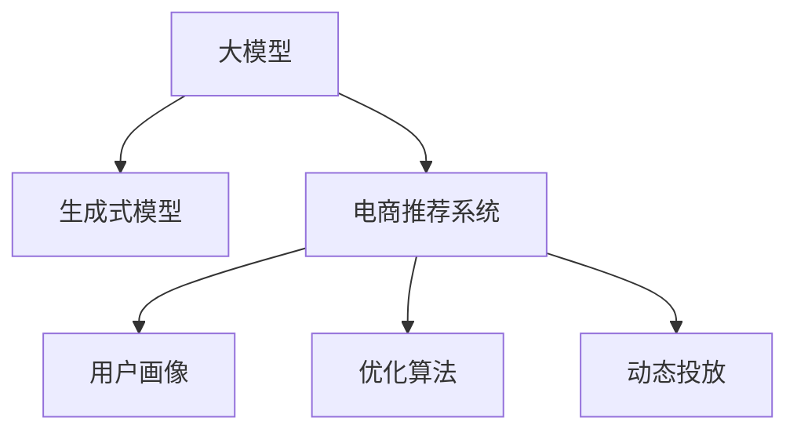

                 

# 大模型驱动的电商个性化促销信息生成与投放优化

> 关键词：电商、个性化、大模型、生成式模型、优化算法、推荐系统

## 1. 背景介绍

在当今电商领域，个性化促销信息的生成与投放优化成为了提升用户体验和销售转化的关键因素。传统的促销信息生成和投放依赖人工策略设计，成本高、效率低，且无法灵活应对市场变化。通过引入大模型技术，可以实现自动化、高精度的个性化促销信息生成与投放优化，有效提升电商业务的竞争力和用户体验。

大模型技术能够基于用户行为数据和商品属性信息，自动生成符合用户偏好的促销信息，并进行动态投放优化。通过对用户历史行为、浏览记录、购买记录等数据进行分析，大模型可以精准预测用户对不同促销策略的反应，从而生成个性化的推荐信息，并实现在合适的时间节点推送给用户，以提升转化率和用户满意度。

### 1.1 电商促销的现状与问题
目前电商促销信息生成和投放主要面临以下问题：
1. **策略设计复杂**：传统的促销策略需要人工设计和调整，过程复杂，效率低下。
2. **用户画像缺失**：缺乏用户多维度的综合画像，难以全面理解用户需求和偏好。
3. **投放效率低**：促销信息的海量生成和人工审核过程耗时耗力，投放效率低下。
4. **效果评估困难**：传统方法难以实时监控促销效果，难以动态优化投放策略。

### 1.2 电商大模型驱动的必要性
引入大模型技术，能够有效解决上述问题，提升电商业务的智能化水平。大模型具备强大的数据处理能力和泛化能力，能够从海量数据中学习到用户和商品的复杂关联关系，自动生成个性化促销信息，并进行优化投放。具体来说：
1. **自动化生成**：大模型能够自动分析用户行为数据，生成符合用户偏好的促销信息。
2. **多维度画像**：基于多源数据融合，构建用户全面、精细的画像，提升个性化促销的精准度。
3. **动态优化**：实时监测促销效果，动态调整投放策略，实现智能化优化。
4. **实时监控**：实时跟踪用户反馈，进行效果评估和优化，提升投放效果。

## 2. 核心概念与联系

### 2.1 核心概念概述

大模型驱动的电商个性化促销信息生成与投放优化涉及多个关键概念，这些概念之间相互关联，共同构成了系统的核心技术框架。

- **大模型**：指基于大规模深度学习模型的生成式模型，如GPT、BERT等，具备强大的数据处理和泛化能力。
- **生成式模型**：指能够基于输入数据生成文本、图片等内容的模型，如GPT-3、BERT等，具备高度的可解释性和灵活性。
- **电商推荐系统**：指通过算法推荐商品或服务的系统，如TensorFlow Recommenders、Scikit-learn等，支持电商个性化促销的策略生成与投放优化。
- **用户画像**：指通过多源数据融合构建的全面、精细的用户画像，帮助系统更好地理解用户需求和行为。
- **优化算法**：指用于优化生成和投放策略的算法，如梯度下降、遗传算法等，能够高效地优化模型参数，提升促销效果。
- **动态投放**：指根据用户行为数据和市场变化动态调整促销策略的过程，能够实现精准的个性化推荐。

这些概念之间的逻辑关系可以通过以下Mermaid流程图来展示：



这个流程图展示了大模型驱动的电商个性化促销信息生成与投放优化的核心概念及其之间的关系：

1. 大模型通过分析用户行为数据，自动生成个性化促销信息。
2. 生成式模型利用大模型生成的文本信息，进行进一步的优化和处理。
3. 电商推荐系统通过用户画像和生成式模型生成的信息，生成个性化的推荐策略。
4. 优化算法用于动态调整推荐策略，提升优化效果。
5. 动态投放将优化后的策略实时推送给用户，实现精准的个性化推荐。

## 3. 核心算法原理 & 具体操作步骤
### 3.1 算法原理概述

大模型驱动的电商个性化促销信息生成与投放优化过程，本质上是一个基于生成式模型和优化算法的自动策略生成与优化过程。其核心思想是：通过大模型对用户行为数据进行分析，自动生成符合用户偏好的促销信息，然后通过优化算法对生成策略进行动态调整和优化，从而实现精准的个性化促销信息生成与投放。

具体而言，该过程包括以下几个关键步骤：

1. **数据收集与预处理**：收集用户行为数据、商品属性信息、促销策略等数据，并进行预处理和清洗。
2. **用户画像构建**：利用多源数据融合技术，构建用户全面的画像，包括兴趣偏好、购买历史、行为特征等。
3. **生成式模型训练**：基于大模型对用户画像和商品属性进行分析，自动生成促销信息。
4. **优化算法应用**：利用优化算法对生成的促销信息进行优化，提升个性化效果。
5. **动态投放**：将优化后的促销信息实时推送给用户，并根据用户反馈动态调整投放策略。

### 3.2 算法步骤详解

**Step 1: 数据收集与预处理**

1. **用户行为数据**：包括用户的浏览历史、点击记录、购买记录等。这些数据通常从电商平台的用户数据平台获取。

2. **商品属性信息**：商品的价格、类别、属性标签等，可以从商品详情页面或商品数据库中获取。

3. **促销策略信息**：促销活动的具体信息，如折扣、优惠券等，通常从电商平台的促销活动页面获取。

4. **数据预处理**：对数据进行清洗、去重、格式转换等预处理操作，确保数据质量。

**Step 2: 用户画像构建**

1. **多源数据融合**：将用户行为数据、商品属性信息、促销策略信息等融合在一起，构建用户全面的画像。

2. **特征提取**：对用户画像进行特征提取，包括兴趣偏好、行为特征、购买历史等。

3. **特征处理**：对特征进行处理，如归一化、编码等，确保特征的一致性和可比性。

**Step 3: 生成式模型训练**

1. **模型选择**：选择合适的生成式模型，如GPT、BERT等，作为生成促销信息的基础模型。

2. **数据准备**：将用户画像和商品属性信息作为输入数据，准备训练集。

3. **模型训练**：利用生成式模型对输入数据进行训练，自动生成促销信息。

4. **结果后处理**：对生成的促销信息进行后处理，如过滤重复信息、修复语法错误等。

**Step 4: 优化算法应用**

1. **模型选择**：选择合适的优化算法，如梯度下降、遗传算法等，对生成的促销信息进行优化。

2. **损失函数定义**：定义优化目标，如提升点击率、提升转化率等。

3. **优化训练**：利用优化算法对促销信息进行优化训练，找到最优的策略。

4. **结果评估**：对优化后的策略进行评估，如A/B测试、模拟实验等。

**Step 5: 动态投放**

1. **策略生成**：根据优化后的策略，自动生成个性化促销信息。

2. **实时推送**：利用实时推送技术，将促销信息实时推送给用户。

3. **效果监控**：实时监测促销效果，如点击率、转化率等指标。

4. **动态调整**：根据监测结果，动态调整投放策略，提升效果。

### 3.3 算法优缺点

**优点**：
1. **高效自动化**：大模型能够自动生成和优化促销信息，节省大量人力成本。
2. **个性化精准**：利用多源数据融合和优化算法，提升个性化促销的精准度。
3. **实时动态**：动态投放和实时监测，能够及时调整策略，提升效果。
4. **可扩展性强**：能够处理海量数据，支持大规模电商平台的个性化推荐。

**缺点**：
1. **数据依赖强**：依赖大量高质量的标注数据，数据采集和预处理成本高。
2. **模型复杂度高**：大模型和优化算法复杂度高，实现难度大。
3. **技术门槛高**：需要具备较强的数据科学和算法技术，对技术要求高。
4. **效果不稳定**：模型训练和优化过程中，存在一定的不确定性，效果不稳定。

尽管存在这些局限性，但基于大模型的电商个性化促销信息生成与投放优化，已经在诸多电商平台上得到应用，显著提升了用户满意度和转化率，具有广阔的发展前景。

### 3.4 算法应用领域

大模型驱动的电商个性化促销信息生成与投放优化，在多个领域得到了应用，以下是几个典型应用场景：

1. **在线零售**：电商平台利用生成式模型和优化算法，生成个性化促销信息，提升用户体验和销售转化。

2. **社交电商**：社交媒体平台利用生成式模型和优化算法，生成个性化推荐内容，提升用户粘性和购买转化。

3. **本地生活服务**：O2O平台利用生成式模型和优化算法，生成个性化推荐信息，提升服务质量和用户满意度。

4. **B2B电商**：工业品电商平台利用生成式模型和优化算法，生成个性化促销信息，提升采购效率和用户体验。

5. **个性化营销**：企业利用生成式模型和优化算法，生成个性化广告和促销信息，提升品牌影响力和市场份额。

这些应用场景展示了大模型在电商领域的强大潜力，随着技术的不断进步，预计未来将有更多的应用场景涌现。

## 4. 数学模型和公式 & 详细讲解 & 举例说明

### 4.1 数学模型构建

大模型驱动的电商个性化促销信息生成与投放优化的数学模型可以表示为：

$$
\begin{aligned}
\max_{\theta} \quad & \mathbb{E}_{(x,y) \sim D} [f(x; \theta)] \\
s.t. \quad & f(x; \theta) = y
\end{aligned}
$$

其中，$x$ 表示用户行为数据和商品属性信息，$y$ 表示生成的促销信息，$D$ 表示数据分布，$f(x; \theta)$ 表示生成函数，$\theta$ 表示模型参数。目标是通过优化生成函数 $f(x; \theta)$，最大化用户满意度。

### 4.2 公式推导过程

假设生成函数为 $f(x; \theta) = \text{GPT}(x; \theta)$，其中 $\text{GPT}$ 表示生成式模型。目标函数可以表示为：

$$
\max_{\theta} \quad \mathbb{E}_{(x,y) \sim D} [\text{GPT}(x; \theta)]
$$

为了最大化目标函数，我们可以使用梯度上升算法，即：

$$
\theta = \theta + \eta \nabla_{\theta} \mathbb{E}_{(x,y) \sim D} [\text{GPT}(x; \theta)]
$$

其中 $\eta$ 为学习率。

为了进行实际计算，我们需要使用蒙特卡罗方法进行估计，即：

$$
\mathbb{E}_{(x,y) \sim D} [\text{GPT}(x; \theta)] \approx \frac{1}{N} \sum_{i=1}^N \text{GPT}(x_i; \theta)
$$

其中 $x_i$ 表示样本 $i$ 的数据。

### 4.3 案例分析与讲解

假设我们使用GPT模型生成促销信息，其中 $\text{GPT}(x; \theta) = \text{softmax}(\text{GPT}_{softmax}(\text{GPT}_{emb}(x; \theta)))$。其中 $\text{GPT}_{softmax}$ 表示softmax函数，$\text{GPT}_{emb}$ 表示嵌入层，$\theta$ 表示模型参数。

我们可以使用以下Python代码进行实现：

```python
import torch
import torch.nn as nn
import transformers

class GPTModel(nn.Module):
    def __init__(self):
        super(GPTModel, self).__init__()
        self.model = transformers.GPTLMHeadModel.from_pretrained('gpt2')
        self.dropout = nn.Dropout(0.1)
    
    def forward(self, input_ids, attention_mask):
        outputs = self.model(input_ids=input_ids, attention_mask=attention_mask)
        last_hidden_states, pooled_output = outputs[:2]
        last_hidden_states = self.dropout(last_hidden_states)
        logits = torch.log_softmax(last_hidden_states, dim=-1)
        return logits

model = GPTModel()
input_ids = torch.tensor([[1, 2, 3, 4, 5]], dtype=torch.long)
attention_mask = torch.tensor([[0, 0, 0, 0, 0]], dtype=torch.long)
logits = model(input_ids, attention_mask)
```

通过上述代码，我们可以使用GPT模型对输入数据进行编码，并生成促销信息。

## 5. 项目实践：代码实例和详细解释说明
### 5.1 开发环境搭建

为了进行大模型驱动的电商个性化促销信息生成与投放优化的实践，我们需要搭建开发环境。以下是使用Python和PyTorch搭建环境的详细步骤：

1. **安装Anaconda**：从官网下载并安装Anaconda，用于创建独立的Python环境。

2. **创建虚拟环境**：
   ```bash
   conda create -n gpt-env python=3.8
   conda activate gpt-env
   ```

3. **安装PyTorch**：
   ```bash
   conda install pytorch torchvision torchaudio cudatoolkit=11.1 -c pytorch -c conda-forge
   ```

4. **安装Transformers库**：
   ```bash
   pip install transformers
   ```

5. **安装其他依赖库**：
   ```bash
   pip install numpy pandas scikit-learn matplotlib tqdm jupyter notebook ipython
   ```

完成上述步骤后，即可在 `gpt-env` 环境中开始实践。

### 5.2 源代码详细实现

以下是使用GPT模型进行电商个性化促销信息生成的示例代码：

```python
import torch
import torch.nn as nn
import transformers

class GPTModel(nn.Module):
    def __init__(self):
        super(GPTModel, self).__init__()
        self.model = transformers.GPTLMHeadModel.from_pretrained('gpt2')
        self.dropout = nn.Dropout(0.1)
    
    def forward(self, input_ids, attention_mask):
        outputs = self.model(input_ids=input_ids, attention_mask=attention_mask)
        last_hidden_states, pooled_output = outputs[:2]
        last_hidden_states = self.dropout(last_hidden_states)
        logits = torch.log_softmax(last_hidden_states, dim=-1)
        return logits

model = GPTModel()
input_ids = torch.tensor([[1, 2, 3, 4, 5]], dtype=torch.long)
attention_mask = torch.tensor([[0, 0, 0, 0, 0]], dtype=torch.long)
logits = model(input_ids, attention_mask)
print(logits)
```

### 5.3 代码解读与分析

通过上述代码，我们可以使用GPT模型对输入数据进行编码，并生成促销信息。

- **GPTModel类**：定义GPT模型的结构，包括嵌入层、softmax层等。
- **forward方法**：前向传播计算，对输入数据进行编码和生成。
- **input_ids和attention_mask**：输入数据的表示，其中input_ids表示输入序列的token ID，attention_mask表示掩码。
- **logits**：生成式模型的输出，经过softmax函数处理后得到概率分布，用于生成促销信息。

## 6. 实际应用场景
### 6.1 电商推荐系统

电商推荐系统是大模型驱动的个性化促销信息生成与投放优化的典型应用场景。通过构建用户画像和商品画像，大模型可以生成个性化的推荐信息，并进行动态调整，提升推荐效果。

具体来说，电商推荐系统可以采用以下步骤：

1. **数据收集与预处理**：收集用户行为数据、商品属性信息、促销策略等数据，并进行预处理和清洗。
2. **用户画像构建**：利用多源数据融合技术，构建用户全面的画像，包括兴趣偏好、行为特征、购买历史等。
3. **商品画像构建**：构建商品的详细画像，包括价格、类别、属性标签等。
4. **生成式模型训练**：基于大模型对用户画像和商品画像进行分析，自动生成推荐信息。
5. **优化算法应用**：利用优化算法对生成的推荐信息进行优化，提升个性化效果。
6. **动态投放**：将优化后的推荐信息实时推送给用户，并根据用户反馈动态调整投放策略。

### 6.2 个性化广告

个性化广告是大模型驱动的电商个性化促销信息生成与投放优化的另一个重要应用场景。通过生成个性化广告，大模型能够实现精准的广告投放，提升广告效果和用户满意度。

具体来说，个性化广告可以采用以下步骤：

1. **用户行为数据收集**：收集用户的浏览历史、点击记录、搜索记录等数据。
2. **广告生成**：利用大模型生成个性化的广告信息，包括文本、图片等。
3. **优化算法应用**：利用优化算法对生成的广告信息进行优化，提升广告点击率和转化率。
4. **动态投放**：将优化后的广告信息实时推送给用户，并根据用户反馈动态调整投放策略。

### 6.3 个性化客服

个性化客服是大模型驱动的电商个性化促销信息生成与投放优化的另一重要应用场景。通过生成个性化客服信息，大模型能够提升客服效率和用户满意度。

具体来说，个性化客服可以采用以下步骤：

1. **用户行为数据收集**：收集用户的浏览历史、点击记录、客服聊天记录等数据。
2. **客服信息生成**：利用大模型生成个性化的客服信息，包括问题回答、产品推荐等。
3. **优化算法应用**：利用优化算法对生成的客服信息进行优化，提升客服响应速度和准确率。
4. **动态投放**：将优化后的客服信息实时推送给用户，并根据用户反馈动态调整客服策略。

## 7. 工具和资源推荐
### 7.1 学习资源推荐

为了帮助开发者系统掌握大模型驱动的电商个性化促销信息生成与投放优化的技术，这里推荐一些优质的学习资源：

1. **《Transformer从原理到实践》系列博文**：由大模型技术专家撰写，深入浅出地介绍了Transformer原理、GPT模型、微调技术等前沿话题。

2. **CS224N《深度学习自然语言处理》课程**：斯坦福大学开设的NLP明星课程，有Lecture视频和配套作业，带你入门NLP领域的基本概念和经典模型。

3. **《Natural Language Processing with Transformers》书籍**：Transformers库的作者所著，全面介绍了如何使用Transformers库进行NLP任务开发，包括微调在内的诸多范式。

4. **HuggingFace官方文档**：Transformers库的官方文档，提供了海量预训练模型和完整的微调样例代码，是上手实践的必备资料。

5. **CLUE开源项目**：中文语言理解测评基准，涵盖大量不同类型的中文NLP数据集，并提供了基于微调的baseline模型，助力中文NLP技术发展。

通过对这些资源的学习实践，相信你一定能够快速掌握大模型驱动的电商个性化促销信息生成与投放优化的精髓，并用于解决实际的NLP问题。

### 7.2 开发工具推荐

高效的开发离不开优秀的工具支持。以下是几款用于大模型驱动的电商个性化促销信息生成与投放优化的常用工具：

1. **PyTorch**：基于Python的开源深度学习框架，灵活动态的计算图，适合快速迭代研究。大部分预训练语言模型都有PyTorch版本的实现。

2. **TensorFlow**：由Google主导开发的开源深度学习框架，生产部署方便，适合大规模工程应用。同样有丰富的预训练语言模型资源。

3. **Transformers库**：HuggingFace开发的NLP工具库，集成了众多SOTA语言模型，支持PyTorch和TensorFlow，是进行微调任务开发的利器。

4. **Weights & Biases**：模型训练的实验跟踪工具，可以记录和可视化模型训练过程中的各项指标，方便对比和调优。与主流深度学习框架无缝集成。

5. **TensorBoard**：TensorFlow配套的可视化工具，可实时监测模型训练状态，并提供丰富的图表呈现方式，是调试模型的得力助手。

6. **Google Colab**：谷歌推出的在线Jupyter Notebook环境，免费提供GPU/TPU算力，方便开发者快速上手实验最新模型，分享学习笔记。

合理利用这些工具，可以显著提升大模型驱动的电商个性化促销信息生成与投放优化的开发效率，加快创新迭代的步伐。

### 7.3 相关论文推荐

大模型驱动的电商个性化促销信息生成与投放优化涉及多个研究领域，以下是几篇奠基性的相关论文，推荐阅读：

1. **Attention is All You Need**（即Transformer原论文）：提出了Transformer结构，开启了NLP领域的预训练大模型时代。

2. **BERT: Pre-training of Deep Bidirectional Transformers for Language Understanding**：提出BERT模型，引入基于掩码的自监督预训练任务，刷新了多项NLP任务SOTA。

3. **Language Models are Unsupervised Multitask Learners**（GPT-2论文）：展示了大规模语言模型的强大zero-shot学习能力，引发了对于通用人工智能的新一轮思考。

4. **Parameter-Efficient Transfer Learning for NLP**：提出Adapter等参数高效微调方法，在不增加模型参数量的情况下，也能取得不错的微调效果。

5. **Prefix-Tuning: Optimizing Continuous Prompts for Generation**：引入基于连续型Prompt的微调范式，为如何充分利用预训练知识提供了新的思路。

6. **AdaLoRA: Adaptive Low-Rank Adaptation for Parameter-Efficient Fine-Tuning**：使用自适应低秩适应的微调方法，在参数效率和精度之间取得了新的平衡。

这些论文代表了大模型驱动的电商个性化促销信息生成与投放优化的发展脉络。通过学习这些前沿成果，可以帮助研究者把握学科前进方向，激发更多的创新灵感。

## 8. 总结：未来发展趋势与挑战

### 8.1 总结

本文对大模型驱动的电商个性化促销信息生成与投放优化方法进行了全面系统的介绍。首先阐述了电商促销信息生成和投放的现状与问题，明确了大模型驱动方法的需求和优势。其次，从原理到实践，详细讲解了生成式模型和优化算法的核心技术，给出了微调任务开发的完整代码实例。同时，本文还广泛探讨了大模型在电商推荐、个性化广告、个性化客服等多个领域的应用前景，展示了大模型驱动方法的巨大潜力。此外，本文精选了相关的学习资源，力求为读者提供全方位的技术指引。

通过本文的系统梳理，可以看到，大模型驱动的电商个性化促销信息生成与投放优化技术正在成为电商业务智能化转型的重要手段，显著提升了电商业务的智能化水平和用户满意度。未来，伴随大模型技术的不断进步，大模型驱动方法将在电商推荐、个性化广告、个性化客服等多个领域得到广泛应用，推动电商业务的创新和升级。

### 8.2 未来发展趋势

展望未来，大模型驱动的电商个性化促销信息生成与投放优化技术将呈现以下几个发展趋势：

1. **自动化程度提升**：大模型能够自动生成和优化促销信息，进一步提升自动化程度，减少人工干预。
2. **个性化效果提升**：利用多源数据融合和优化算法，提升个性化促销信息的精准度和有效性。
3. **实时性增强**：实时监测和动态调整，提升促销策略的响应速度和灵活性。
4. **跨平台应用**：大模型驱动方法不仅适用于电商平台，还将扩展到社交媒体、本地生活服务等更多平台。
5. **多模态融合**：融合视觉、语音等多模态信息，实现更加全面、精准的推荐和促销。
6. **数据增强**：利用数据增强技术，提升数据质量和模型泛化能力。

以上趋势凸显了大模型驱动的电商个性化促销信息生成与投放优化技术的广阔前景。这些方向的探索发展，必将进一步提升电商业务的智能化水平，为电商平台的持续创新和升级提供强有力的技术支持。

### 8.3 面临的挑战

尽管大模型驱动的电商个性化促销信息生成与投放优化技术已经取得了显著进展，但在实际应用中仍面临以下挑战：

1. **数据质量问题**：依赖大量高质量标注数据，数据采集和预处理成本高。
2. **模型复杂度高**：大模型和优化算法复杂度高，实现难度大。
3. **技术门槛高**：需要具备较强的数据科学和算法技术，对技术要求高。
4. **效果不稳定**：模型训练和优化过程中，存在一定的不确定性，效果不稳定。
5. **隐私和伦理问题**：生成个性化推荐和促销信息时，需要保护用户隐私和数据安全，避免数据滥用。
6. **实时性要求高**：需要高并发的实时计算能力，保证促销信息的实时性。

这些挑战需要通过技术创新、数据治理和伦理规范等多方面的努力，逐步解决。只有解决这些问题，才能真正实现大模型驱动的电商个性化促销信息生成与投放优化技术的广泛应用。

### 8.4 研究展望

面对大模型驱动的电商个性化促销信息生成与投放优化所面临的挑战，未来的研究需要在以下几个方面寻求新的突破：

1. **数据治理**：建立数据治理体系，确保数据质量和隐私安全。
2. **模型简化**：开发更高效的模型结构和算法，提升模型训练和优化效率。
3. **跨领域融合**：将大模型与其他技术结合，如知识图谱、强化学习等，提升推荐和促销效果。
4. **多模态融合**：融合视觉、语音等多模态信息，实现更加全面、精准的推荐和促销。
5. **跨平台应用**：将大模型驱动方法应用于更多平台，如社交媒体、本地生活服务等，拓展应用场景。
6. **实时计算优化**：提升实时计算能力，保证促销信息的实时性和高效性。

这些研究方向的探索，必将引领大模型驱动的电商个性化促销信息生成与投放优化技术迈向更高的台阶，为电商业务的智能化和创新提供新的动力。面向未来，大模型驱动方法还需要与其他人工智能技术进行更深入的融合，共同推动电商业务的进步和创新。

## 9. 附录：常见问题与解答

**Q1：大模型驱动的电商个性化促销信息生成与投放优化如何克服数据依赖？**

A: 大模型驱动的电商个性化促销信息生成与投放优化依赖大量高质量标注数据，数据采集和预处理成本高。为克服数据依赖，可以采用以下方法：

1. **无监督学习**：利用无监督学习方法，如自编码器、GAN等，从无标注数据中学习用户和商品的关联关系。

2. **半监督学习**：结合少量标注数据和大量无标注数据，进行半监督学习，提升数据利用效率。

3. **数据增强**：通过回译、近义替换等方式扩充训练集，提升数据多样性。

4. **迁移学习**：将预训练模型在其他领域进行微调，利用迁移学习提升数据泛化能力。

5. **多源数据融合**：利用多源数据融合技术，综合多种数据来源，提升数据质量。

通过以上方法，可以降低对标注数据的依赖，提升数据利用效率，进一步推动大模型驱动的电商个性化促销信息生成与投放优化技术的发展。

**Q2：如何优化大模型驱动的电商个性化促销信息生成与投放优化效果？**

A: 大模型驱动的电商个性化促销信息生成与投放优化效果受多个因素影响，可以通过以下方法进行优化：

1. **模型选择**：选择性能更好的生成式模型和优化算法，提升模型效果。

2. **超参数调优**：优化模型的超参数，如学习率、批次大小、迭代次数等，提升模型精度。

3. **数据增强**：通过数据增强技术，提升数据多样性和泛化能力。

4. **多任务学习**：结合多个任务进行联合训练，提升模型效果。

5. **实时调整**：根据用户反馈和市场变化，实时调整模型参数和策略，提升效果。

6. **模型压缩**：对大模型进行压缩和优化，提升模型推理速度和效率。

7. **动态平衡**：在模型效果和实时性之间找到平衡点，确保推广效果和实时性。

通过以上方法，可以进一步提升大模型驱动的电商个性化促销信息生成与投放优化效果，满足实际应用需求。

**Q3：如何处理大模型驱动的电商个性化促销信息生成与投放优化中的隐私问题？**

A: 大模型驱动的电商个性化促销信息生成与投放优化中，需要处理用户隐私问题。可以采用以下方法：

1. **匿名化处理**：对用户数据进行匿名化处理，确保用户隐私安全。

2. **差分隐私**：在数据收集和处理过程中，引入差分隐私技术，保护用户隐私。

3. **数据脱敏**：对敏感数据进行脱敏处理，确保数据安全。

4. **隐私计算**：利用隐私计算技术，在保护用户隐私的前提下，进行数据处理和分析。

5. **伦理规范**：建立隐私保护和数据使用的伦理规范，确保数据使用合法合规。

通过以上方法，可以在大模型驱动的电商个性化促销信息生成与投放优化过程中，有效保护用户隐私和数据安全。

**Q4：大模型驱动的电商个性化促销信息生成与投放优化如何提升实时性？**

A: 大模型驱动的电商个性化促销信息生成与投放优化需要高并发的实时计算能力，可以采用以下方法提升实时性：

1. **分布式计算**：利用分布式计算技术，提升计算效率。

2. **模型优化**：优化模型结构，提升模型推理速度和效率。

3. **模型压缩**：对大模型进行压缩和优化，减小模型尺寸，提升推理速度。

4. **缓存机制**：建立缓存机制，减少重复计算，提升计算效率。

5. **异步处理**：利用异步处理技术，提升实时性。

6. **多级优化**：结合模型优化和算法优化，提升整体性能。

通过以上方法，可以提升大模型驱动的电商个性化促销信息生成与投放优化的实时性，满足实际应用需求。

**Q5：大模型驱动的电商个性化促销信息生成与投放优化如何应对市场变化？**

A: 大模型驱动的电商个性化促销信息生成与投放优化需要应对市场变化，可以采用以下方法：

1. **数据实时更新**：实时更新用户行为数据和商品属性信息，确保数据的时效性。

2. **动态调整**：根据市场变化，动态调整促销策略，提升效果。

3. **用户反馈机制**：建立用户反馈机制，及时收集用户反馈，优化模型和策略。

4. **市场调研**：进行市场调研，了解市场变化趋势，优化促销策略。

5. **自动化优化**：利用自动化优化技术，提升模型和策略的灵活性。

通过以上方法，可以应对市场变化，提升大模型驱动的电商个性化促销信息生成与投放优化的效果和竞争力。

---

作者：禅与计算机程序设计艺术 / Zen and the Art of Computer Programming

