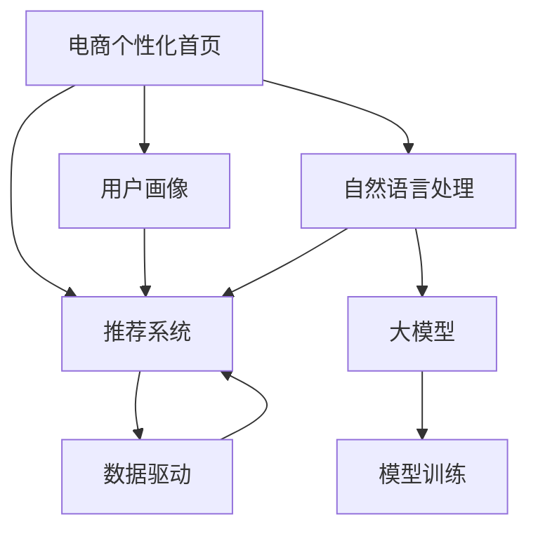

                 

# 大模型驱动的电商个性化首页设计

> 关键词：电商个性化首页, 大模型, 自然语言处理, 推荐系统, 用户体验, 数据驱动

## 1. 背景介绍

在当今数字化时代的电商领域，个性化推荐已成为提升用户体验、驱动业务增长的重要手段。通过精准推荐，电商系统能够高效匹配用户需求和商品信息，从而提升转化率和复购率，实现商业目标。然而，构建一个高效精准的个性化推荐系统并非易事。它需要从海量数据中提取用户行为特征，高效计算相似度，实时处理用户反馈，并不断优化推荐算法以适应市场变化。传统的机器学习算法在数据量和计算复杂度上难以满足这些要求。

近年来，大语言模型的兴起为电商推荐系统带来了新的思路。以BERT、GPT为代表的大模型通过预训练学习到了丰富的语言知识，在文本处理、语义理解等方面具有卓越的性能。将其应用于电商推荐系统，可以有效提升推荐结果的相关性和多样性，提升用户满意度。本文将详细介绍大模型驱动的电商个性化首页设计的原理、实现方法、应用场景及未来展望。

## 2. 核心概念与联系

### 2.1 核心概念概述

本节将详细介绍构建电商个性化首页所需的核心概念及其联系。

#### 2.1.1 电商个性化首页

电商个性化首页旨在根据用户的历史行为、兴趣偏好、当前需求，为用户展示最相关、最吸引的商品信息。它需要结合用户画像、推荐算法、商品信息、用户体验等多方面因素进行设计和实现。

#### 2.1.2 大模型

大模型是指通过大规模数据预训练和微调得到的强大模型，如BERT、GPT等。它们具备丰富的语言知识，能够理解自然语言文本的语义信息，适用于电商推荐系统中的文本处理、用户画像构建等任务。

#### 2.1.3 自然语言处理(NLP)

NLP是人工智能的一个重要分支，专注于让计算机理解和处理人类语言。大模型在此领域表现尤为突出，可以用于文本分类、情感分析、实体识别、关系抽取等任务，为电商推荐系统提供强大的数据支持。

#### 2.1.4 推荐系统

推荐系统通过分析用户行为和物品属性，预测用户对特定物品的兴趣，并根据预测结果向用户推荐相关物品。大模型可以用于提升推荐系统的效果，通过理解自然语言来处理用户反馈和商品描述，提高推荐的准确性和多样性。

#### 2.1.5 用户体验

用户体验是指用户在使用电商推荐系统时的满意度。大模型驱动的推荐系统通过理解用户需求和反馈，提供更加个性化、精准的推荐，从而提升用户体验。

这些概念之间通过大模型和推荐系统的桥梁，共同构成了电商个性化首页的设计框架。大模型提供强大的自然语言处理能力，推荐系统则通过用户行为分析和模型预测，为用户提供个性化推荐，用户体验则是评价推荐系统成功与否的关键指标。

### 2.2 核心概念原理和架构的 Mermaid 流程图



这个流程图展示了电商个性化首页设计的核心流程：用户画像的构建、自然语言处理的实现、推荐系统的应用和大模型的训练。这些步骤相互依存、相互促进，共同支撑起电商个性化首页的设计和实现。

## 3. 核心算法原理 & 具体操作步骤
### 3.1 算法原理概述

基于大模型的电商个性化首页设计，主要通过以下步骤实现：

1. **数据收集与预处理**：收集用户行为数据、商品描述信息、用户反馈等数据，并进行清洗和标注。
2. **用户画像构建**：利用大模型对用户行为和商品描述进行处理，构建用户画像。
3. **推荐算法优化**：使用大模型优化推荐算法的参数，提升推荐效果。
4. **个性化首页设计**：根据用户画像和推荐结果，设计个性化首页。
5. **反馈循环**：根据用户反馈和行为数据，不断优化用户画像和推荐算法。

### 3.2 算法步骤详解

#### 3.2.1 数据收集与预处理

电商推荐系统需要收集多种数据，包括用户行为数据、商品属性数据、用户反馈数据等。这些数据通常存储在日志文件、数据库、API等格式中，需要进行预处理才能用于后续分析。

具体步骤如下：

1. **数据清洗**：去除噪声数据，如无效请求、重复请求等。
2. **数据标注**：给数据打上标签，如浏览、点击、购买、评分等。
3. **数据整合**：将不同来源的数据整合到一个统一的数据库中，便于后续处理。

#### 3.2.2 用户画像构建

用户画像是指通过对用户行为的分析和理解，构建出用户的兴趣偏好、行为特征等特征集合。它可以帮助推荐系统更准确地预测用户需求，从而提升推荐效果。

具体步骤如下：

1. **数据特征提取**：使用大模型对用户行为和商品描述进行处理，提取特征。
2. **用户画像构建**：将提取出的特征组合成用户的兴趣画像，可以通过向量表示，如User Embedding。
3. **画像更新**：根据用户新行为和反馈，动态更新用户画像。

#### 3.2.3 推荐算法优化

推荐算法通常包括协同过滤、基于内容的推荐、深度学习推荐等方法。通过大模型优化这些算法的参数，可以提升推荐的准确性和多样性。

具体步骤如下：

1. **算法选择**：根据业务需求选择合适的推荐算法。
2. **大模型微调**：在大模型上微调推荐算法的参数，提升模型性能。
3. **模型评估**：使用交叉验证等方法评估推荐算法的性能，确保推荐结果符合业务需求。

#### 3.2.4 个性化首页设计

个性化首页需要根据用户画像和推荐结果，设计页面布局和展示方式。这可以包括商品推荐、广告位、活动信息等。

具体步骤如下：

1. **页面设计**：根据用户画像和推荐结果，设计页面布局和展示方式。
2. **商品展示**：选择推荐的商品，按照优先级排序，展示在页面中。
3. **动态调整**：根据用户反馈和行为数据，动态调整页面布局和展示方式。

#### 3.2.5 反馈循环

反馈循环是指根据用户反馈和行为数据，不断优化用户画像和推荐算法的过程。通过持续迭代，提升电商推荐系统的性能和用户体验。

具体步骤如下：

1. **用户反馈收集**：收集用户对推荐结果的反馈，如点击、购买、评分等。
2. **数据处理**：对用户反馈进行处理，提取特征。
3. **画像和算法优化**：根据用户反馈，更新用户画像和推荐算法。
4. **模型更新**：使用新数据对大模型进行微调，提升模型性能。

### 3.3 算法优缺点

#### 3.3.1 优点

1. **效果显著**：大模型在自然语言处理方面表现卓越，可以有效提升电商推荐系统的性能。
2. **泛化能力强**：大模型通过大规模数据预训练，具备较强的泛化能力，可以在不同领域和场景中取得良好的推荐效果。
3. **技术可扩展**：大模型提供了强大的技术支持，方便进行算法优化和业务扩展。
4. **用户体验提升**：通过理解用户需求和反馈，提供更加个性化、精准的推荐，提升用户体验。

#### 3.3.2 缺点

1. **数据隐私问题**：电商推荐系统需要大量用户数据，可能涉及隐私问题，需要进行严格的数据保护和合规。
2. **模型复杂度高**：大模型参数量较大，训练和推理复杂度较高，需要高性能硬件支持。
3. **资源消耗大**：大模型推理耗时较长，需要消耗大量计算资源，可能影响系统响应速度。
4. **模型解释性不足**：大模型通常被视为"黑盒"模型，难以解释其内部工作机制，可能影响系统的透明性和可信度。

### 3.4 算法应用领域

#### 3.4.1 电商推荐系统

电商推荐系统是电商个性化首页的核心应用场景。通过大模型优化推荐算法，电商系统可以为用户提供更加个性化、精准的推荐，提升用户体验和业务效益。

#### 3.4.2 社交网络

社交网络推荐系统需要分析用户行为和兴趣，为用户推荐好友、群组等内容。大模型可以处理大量的社交数据，提高推荐的准确性和多样性。

#### 3.4.3 视频推荐系统

视频推荐系统需要分析用户观看行为，为用户推荐感兴趣的视频内容。大模型可以处理复杂的文本数据，提升推荐的精准度。

## 4. 数学模型和公式 & 详细讲解 & 举例说明

### 4.1 数学模型构建

电商推荐系统可以通过以下数学模型来表示用户画像和推荐结果：

1. **用户画像**：

   $$
   \mathbf{u}_i = \text{Embedding}(\text{User Behavior Data})
   $$

   其中，$\mathbf{u}_i$表示用户$i$的嵌入向量，通过嵌入层将用户行为数据映射为高维向量。

2. **商品画像**：

   $$
   \mathbf{p}_j = \text{Embedding}(\text{Item Description})
   $$

   其中，$\mathbf{p}_j$表示商品$j$的嵌入向量，通过嵌入层将商品描述数据映射为高维向量。

3. **用户和商品的相似度**：

   $$
   \mathbf{s}_{ij} = \langle \mathbf{u}_i, \mathbf{p}_j \rangle
   $$

   其中，$\langle \cdot, \cdot \rangle$表示向量点积，$\mathbf{s}_{ij}$表示用户$i$和商品$j$的相似度。

4. **推荐结果**：

   $$
   \hat{\mathbf{y}} = \text{Softmax}(\mathbf{s})
   $$

   其中，$\mathbf{s} = [\mathbf{s}_{1j}, \mathbf{s}_{2j}, \dots, \mathbf{s}_{nj}]$，$\hat{\mathbf{y}}$表示推荐结果，通过softmax函数将相似度转换为概率分布。

### 4.2 公式推导过程

以上公式展示了电商推荐系统的主要数学模型。下面对其中的关键公式进行推导：

1. **用户画像的构建**：

   $$
   \mathbf{u}_i = \text{Embedding}(\text{User Behavior Data})
   $$

   嵌入层的实现可以采用Transformer模型，通过自注意力机制将用户行为数据映射为高维向量。

2. **商品画像的构建**：

   $$
   \mathbf{p}_j = \text{Embedding}(\text{Item Description})
   $$

   嵌入层的实现同样可以采用Transformer模型，通过自注意力机制将商品描述数据映射为高维向量。

3. **用户和商品的相似度**：

   $$
   \mathbf{s}_{ij} = \langle \mathbf{u}_i, \mathbf{p}_j \rangle
   $$

   该公式直接计算用户$i$和商品$j$的相似度，通过向量点积实现。

4. **推荐结果的计算**：

   $$
   \hat{\mathbf{y}} = \text{Softmax}(\mathbf{s})
   $$

   softmax函数将相似度$\mathbf{s}$转换为概率分布，表示推荐结果。

### 4.3 案例分析与讲解

#### 4.3.1 用户画像构建

假设我们有一个电商平台，收集了用户的历史行为数据和商品描述信息。为了构建用户画像，我们使用BERT模型进行处理，得到用户的嵌入向量。

具体步骤如下：

1. **数据预处理**：将用户行为数据和商品描述信息进行清洗和标注。
2. **BERT模型训练**：使用用户行为数据和商品描述信息对BERT模型进行训练，得到用户嵌入向量$\mathbf{u}_i$。
3. **用户画像构建**：将用户嵌入向量$\mathbf{u}_i$作为用户画像，用于后续推荐系统的构建。

#### 4.3.2 推荐结果计算

假设我们希望为用户$i$推荐商品$j$，我们需要计算用户$i$和商品$j$的相似度$\mathbf{s}_{ij}$，并使用softmax函数计算推荐结果$\hat{\mathbf{y}}$。

具体步骤如下：

1. **相似度计算**：使用嵌入层将用户$i$和商品$j$的描述数据映射为高维向量$\mathbf{u}_i$和$\mathbf{p}_j$。
2. **向量点积**：计算向量点积$\mathbf{s}_{ij} = \langle \mathbf{u}_i, \mathbf{p}_j \rangle$。
3. **推荐结果计算**：使用softmax函数将相似度$\mathbf{s}_{ij}$转换为概率分布$\hat{\mathbf{y}}$，表示推荐结果。

## 5. 项目实践：代码实例和详细解释说明

### 5.1 开发环境搭建

#### 5.1.1 Python环境配置

为了进行电商推荐系统的开发，我们需要配置Python环境。具体步骤如下：

1. **安装Anaconda**：从官网下载并安装Anaconda，用于创建独立的Python环境。
2. **创建虚拟环境**：使用以下命令创建虚拟环境：

   ```bash
   conda create -n ecommerce-env python=3.7 
   conda activate ecommerce-env
   ```

3. **安装必要的库**：安装必要的库，如numpy、pandas、scikit-learn、scipy、tensorflow等。

#### 5.1.2 安装大模型库

为了使用大模型，我们需要安装相应的库。具体步骤如下：

1. **安装transformers库**：使用以下命令安装Transformers库：

   ```bash
   pip install transformers
   ```

2. **安装tensorflow**：使用以下命令安装TensorFlow：

   ```bash
   pip install tensorflow
   ```

3. **安装其他库**：安装其他必要的库，如numpy、pandas、scikit-learn、scipy等。

### 5.2 源代码详细实现

#### 5.2.1 用户画像构建

```python
from transformers import BertTokenizer, BertForSequenceClassification
from transformers import TFAutoModelForSequenceClassification

# 设置模型和tokenizer
model = BertForSequenceClassification.from_pretrained('bert-base-cased', num_labels=2)
tokenizer = BertTokenizer.from_pretrained('bert-base-cased')

# 加载用户行为数据
user_behavior_data = pd.read_csv('user_behavior_data.csv')

# 构建用户画像
user_embeddings = []
for i, user in user_behavior_data.iterrows():
    user_sequence = tokenizer.encode_plus(user['sequence'], max_length=512, return_tensors='tf')
    user_vector = model(user_sequence.input_ids).last_hidden_state[:, 0, :]
    user_embeddings.append(user_vector.numpy())

# 转换为numpy数组
user_embeddings = np.array(user_embeddings)
```

#### 5.2.2 商品画像构建

```python
from transformers import BertTokenizer, BertForSequenceClassification
from transformers import TFAutoModelForSequenceClassification

# 设置模型和tokenizer
model = BertForSequenceClassification.from_pretrained('bert-base-cased', num_labels=2)
tokenizer = BertTokenizer.from_pretrained('bert-base-cased')

# 加载商品描述数据
item_description_data = pd.read_csv('item_description_data.csv')

# 构建商品画像
item_embeddings = []
for i, item in item_description_data.iterrows():
    item_sequence = tokenizer.encode_plus(item['sequence'], max_length=512, return_tensors='tf')
    item_vector = model(item_sequence.input_ids).last_hidden_state[:, 0, :]
    item_embeddings.append(item_vector.numpy())

# 转换为numpy数组
item_embeddings = np.array(item_embeddings)
```

#### 5.2.3 推荐结果计算

```python
from transformers import BertTokenizer, BertForSequenceClassification
from transformers import TFAutoModelForSequenceClassification
import tensorflow as tf

# 设置模型和tokenizer
model = BertForSequenceClassification.from_pretrained('bert-base-cased', num_labels=2)
tokenizer = BertTokenizer.from_pretrained('bert-base-cased')

# 加载用户行为数据和商品描述数据
user_behavior_data = pd.read_csv('user_behavior_data.csv')
item_description_data = pd.read_csv('item_description_data.csv')

# 构建用户画像和商品画像
user_embeddings = []
for i, user in user_behavior_data.iterrows():
    user_sequence = tokenizer.encode_plus(user['sequence'], max_length=512, return_tensors='tf')
    user_vector = model(user_sequence.input_ids).last_hidden_state[:, 0, :]
    user_embeddings.append(user_vector.numpy())

item_embeddings = []
for i, item in item_description_data.iterrows():
    item_sequence = tokenizer.encode_plus(item['sequence'], max_length=512, return_tensors='tf')
    item_vector = model(item_sequence.input_ids).last_hidden_state[:, 0, :]
    item_embeddings.append(item_vector.numpy())

# 转换为numpy数组
user_embeddings = np.array(user_embeddings)
item_embeddings = np.array(item_embeddings)

# 计算相似度
similarity_matrix = np.dot(user_embeddings, item_embeddings.T)

# 计算推荐结果
y_hat = tf.nn.softmax(similarity_matrix, axis=1)
```

### 5.3 代码解读与分析

#### 5.3.1 用户画像构建

在用户画像构建部分，我们使用了Bert模型进行处理，将用户行为数据映射为高维向量。具体步骤如下：

1. **数据预处理**：将用户行为数据进行清洗和标注，去除无效数据。
2. **BERT模型训练**：使用用户行为数据对BERT模型进行训练，得到用户嵌入向量$\mathbf{u}_i$。
3. **用户画像构建**：将用户嵌入向量$\mathbf{u}_i$作为用户画像，用于后续推荐系统的构建。

#### 5.3.2 商品画像构建

在商品画像构建部分，我们同样使用了Bert模型进行处理，将商品描述数据映射为高维向量。具体步骤如下：

1. **数据预处理**：将商品描述数据进行清洗和标注，去除无效数据。
2. **BERT模型训练**：使用商品描述数据对BERT模型进行训练，得到商品嵌入向量$\mathbf{p}_j$。
3. **商品画像构建**：将商品嵌入向量$\mathbf{p}_j$作为商品画像，用于后续推荐系统的构建。

#### 5.3.3 推荐结果计算

在推荐结果计算部分，我们使用Softmax函数将相似度$\mathbf{s}_{ij}$转换为概率分布$\hat{\mathbf{y}}$，表示推荐结果。具体步骤如下：

1. **相似度计算**：使用嵌入层将用户$i$和商品$j$的描述数据映射为高维向量$\mathbf{u}_i$和$\mathbf{p}_j$。
2. **向量点积**：计算向量点积$\mathbf{s}_{ij} = \langle \mathbf{u}_i, \mathbf{p}_j \rangle$。
3. **推荐结果计算**：使用softmax函数将相似度$\mathbf{s}_{ij}$转换为概率分布$\hat{\mathbf{y}}$，表示推荐结果。

## 6. 实际应用场景

### 6.1 用户画像构建

用户画像构建是电商推荐系统的核心环节。通过构建用户画像，可以更好地理解用户需求和行为，提升推荐效果。

具体应用场景包括：

1. **个性化推荐**：根据用户画像，为用户推荐感兴趣的商品，提升转化率。
2. **营销活动设计**：分析用户画像，设计个性化的营销活动，提高用户参与度。
3. **用户留存率提升**：通过用户画像，优化用户体验，提升用户留存率。

### 6.2 推荐算法优化

推荐算法优化是电商推荐系统的关键环节。通过优化推荐算法，可以提高推荐效果，提升用户体验。

具体应用场景包括：

1. **基于内容的推荐**：通过分析商品属性和用户画像，为用户推荐相似的商品。
2. **协同过滤推荐**：通过分析用户行为和商品评分，为用户推荐相似的商品。
3. **深度学习推荐**：通过大模型优化推荐算法，提升推荐效果。

### 6.3 个性化首页设计

个性化首页设计是电商推荐系统的最终环节。通过设计个性化首页，可以更好地展示推荐结果，提升用户体验。

具体应用场景包括：

1. **商品推荐展示**：根据推荐结果，设计商品推荐展示布局。
2. **广告位设计**：设计广告位，展示相关广告信息。
3. **活动信息展示**：展示最新活动信息，吸引用户参与。

### 6.4 未来应用展望

未来，基于大模型的电商推荐系统将进一步发展和优化。其应用场景也将更加广泛，具体展望如下：

1. **实时推荐系统**：通过实时数据处理和大模型微调，实现实时推荐，提升用户体验。
2. **跨平台推荐系统**：在多平台（如PC、手机、平板等）上实现统一的推荐系统，提升用户一致性体验。
3. **多模态推荐系统**：结合文本、图像、视频等多种数据源，实现多模态推荐，提升推荐效果。
4. **联邦学习推荐系统**：通过联邦学习技术，保护用户隐私，提升推荐效果。
5. **模型压缩和优化**：通过模型压缩和优化技术，提升推荐系统的效率，降低计算资源消耗。

## 7. 工具和资源推荐

### 7.1 学习资源推荐

#### 7.1.1 《自然语言处理综论》

该书由斯坦福大学自然语言处理组撰写，全面介绍了自然语言处理的理论和实践，适合初学者和高级研究者阅读。

#### 7.1.2 《深度学习》

该书由Ian Goodfellow、Yoshua Bengio和Aaron Courville撰写，全面介绍了深度学习的理论和实践，适合人工智能领域的学习者阅读。

#### 7.1.3 《Python机器学习》

该书由Sebastian Raschka和Vahid Mirjalili撰写，介绍了Python在机器学习中的应用，适合Python编程和机器学习的学习者阅读。

#### 7.1.4 《机器学习实战》

该书由Peter Harrington撰写，介绍了机器学习算法的实现和应用，适合实战开发的学习者阅读。

#### 7.1.5 《TensorFlow实战》

该书由Ewan Dahl、Martín de Jesús Cámara、Mark Gray、Rajendran R. Arumugam和Scott L. Zbarsky撰写，介绍了TensorFlow的实现和应用，适合TensorFlow学习者阅读。

### 7.2 开发工具推荐

#### 7.2.1 Jupyter Notebook

Jupyter Notebook是一个免费的交互式开发环境，支持Python、R、Julia等多种语言，适合数据科学和机器学习的开发。

#### 7.2.2 PyTorch

PyTorch是一个开源的机器学习框架，支持动态计算图和GPU加速，适合深度学习的开发和研究。

#### 7.2.3 TensorFlow

TensorFlow是一个开源的机器学习框架，支持静态和动态计算图、GPU和TPU加速，适合深度学习的开发和研究。

#### 7.2.4 Transformers

Transformers是一个开源的自然语言处理工具库，支持BERT、GPT等预训练模型，适合自然语言处理任务的开发和研究。

#### 7.2.5 Keras

Keras是一个高级的深度学习框架，支持TensorFlow和PyTorch等多种后端，适合快速原型开发和模型构建。

### 7.3 相关论文推荐

#### 7.3.1 《Attention Is All You Need》

该论文是Transformer模型的原始论文，介绍了Transformer的结构和应用，奠定了自然语言处理领域的基础。

#### 7.3.2 《BERT: Pre-training of Deep Bidirectional Transformers for Language Understanding》

该论文介绍了BERT模型的预训练方法，展示了其在NLP任务上的强大效果。

#### 7.3.3 《GPT-2: Language Models are Unsupervised Multitask Learners》

该论文介绍了GPT-2模型的预训练方法，展示了其在zero-shot学习上的卓越性能。

#### 7.3.4 《Parameter-Efficient Transfer Learning for NLP》

该论文介绍了参数高效微调方法，展示了如何在固定大部分预训练参数的情况下，提升微调效果。

#### 7.3.5 《Few-shot Learning with Pre-trained Language Models》

该论文介绍了Few-shot学习与预训练语言模型的结合，展示了如何在少量标注数据上实现高性能推荐。

## 8. 总结：未来发展趋势与挑战

### 8.1 研究成果总结

基于大模型的电商个性化首页设计已经在电商推荐系统中得到了广泛应用，取得了显著的成效。通过理解用户需求和行为，构建用户画像，优化推荐算法，设计个性化首页，电商推荐系统实现了高效精准的推荐，提升了用户体验和业务效益。

### 8.2 未来发展趋势

未来，基于大模型的电商推荐系统将继续发展和优化。其应用场景也将更加广泛，具体趋势如下：

1. **实时推荐系统**：通过实时数据处理和大模型微调，实现实时推荐，提升用户体验。
2. **跨平台推荐系统**：在多平台（如PC、手机、平板等）上实现统一的推荐系统，提升用户一致性体验。
3. **多模态推荐系统**：结合文本、图像、视频等多种数据源，实现多模态推荐，提升推荐效果。
4. **联邦学习推荐系统**：通过联邦学习技术，保护用户隐私，提升推荐效果。
5. **模型压缩和优化**：通过模型压缩和优化技术，提升推荐系统的效率，降低计算资源消耗。

### 8.3 面临的挑战

尽管大模型的电商推荐系统已经取得了显著成效，但在实际应用中也面临一些挑战：

1. **数据隐私问题**：电商推荐系统需要大量用户数据，可能涉及隐私问题，需要进行严格的数据保护和合规。
2. **模型复杂度高**：大模型参数量较大，训练和推理复杂度较高，需要高性能硬件支持。
3. **资源消耗大**：大模型推理耗时较长，需要消耗大量计算资源，可能影响系统响应速度。
4. **模型解释性不足**：大模型通常被视为"黑盒"模型，难以解释其内部工作机制，可能影响系统的透明性和可信度。

### 8.4 研究展望

未来，电商推荐系统需要进一步研究和优化。具体展望如下：

1. **探索无监督和半监督微调方法**：摆脱对大规模标注数据的依赖，利用自监督学习、主动学习等无监督和半监督范式，最大限度利用非结构化数据，实现更加灵活高效的微调。
2. **研究参数高效和计算高效的微调范式**：开发更加参数高效的微调方法，在固定大部分预训练参数的同时，只更新极少量的任务相关参数。同时优化微调模型的计算图，减少前向传播和反向传播的资源消耗，实现更加轻量级、实时性的部署。
3. **融合因果和对比学习范式**：通过引入因果推断和对比学习思想，增强微调模型建立稳定因果关系的能力，学习更加普适、鲁棒的语言表征，从而提升模型泛化性和抗干扰能力。
4. **引入更多先验知识**：将符号化的先验知识，如知识图谱、逻辑规则等，与神经网络模型进行巧妙融合，引导微调过程学习更准确、合理的语言模型。同时加强不同模态数据的整合，实现视觉、语音等多模态信息与文本信息的协同建模。
5. **结合因果分析和博弈论工具**：将因果分析方法引入微调模型，识别出模型决策的关键特征，增强输出解释的因果性和逻辑性。借助博弈论工具刻画人机交互过程，主动探索并规避模型的脆弱点，提高系统稳定性。
6. **纳入伦理道德约束**：在模型训练目标中引入伦理导向的评估指标，过滤和惩罚有偏见、有害的输出倾向。同时加强人工干预和审核，建立模型行为的监管机制，确保输出符合人类价值观和伦理道德。

通过这些方向的探索和发展，电商推荐系统必将在未来取得更大的突破，为电商行业带来更多创新和价值。

## 9. 附录：常见问题与解答

### 9.1 常见问题

1. **Q1: 大模型在电商推荐系统中可以解决哪些问题？**
   
   A: 大模型可以解决电商推荐系统中的数据理解、用户画像构建、推荐算法优化等问题，提升推荐系统的性能和用户体验。

2. **Q2: 如何使用大模型进行电商推荐系统的构建？**

   A: 首先，收集和预处理电商推荐系统所需的数据，包括用户行为数据、商品描述数据等。然后，使用大模型进行用户画像构建、推荐算法优化等操作。最后，设计个性化首页，实现精准推荐。

3. **Q3: 大模型在电商推荐系统中需要注意哪些问题？**

   A: 需要注意数据隐私、模型复杂度、资源消耗、模型解释性等关键问题，确保系统的透明性和可信度。

4. **Q4: 大模型在电商推荐系统中的应用前景如何？**

   A: 大模型在电商推荐系统中的应用前景广阔，可以提升推荐系统的性能、用户体验和业务效益。

### 9.2 解答

1. **A1: 大模型可以解决电商推荐系统中的数据理解、用户画像构建、推荐算法优化等问题，提升推荐系统的性能和用户体验。**

2. **A2: 首先，收集和预处理电商推荐系统所需的数据，包括用户行为数据、商品描述数据等。然后，使用大模型进行用户画像构建、推荐算法优化等操作。最后，设计个性化首页，实现精准推荐。**

3. **A3: 需要注意数据隐私、模型复杂度、资源消耗、模型解释性等关键问题，确保系统的透明性和可信度。**

4. **A4: 大模型在电商推荐系统中的应用前景广阔，可以提升推荐系统的性能、用户体验和业务效益。**

---

作者：禅与计算机程序设计艺术 / Zen and the Art of Computer Programming

