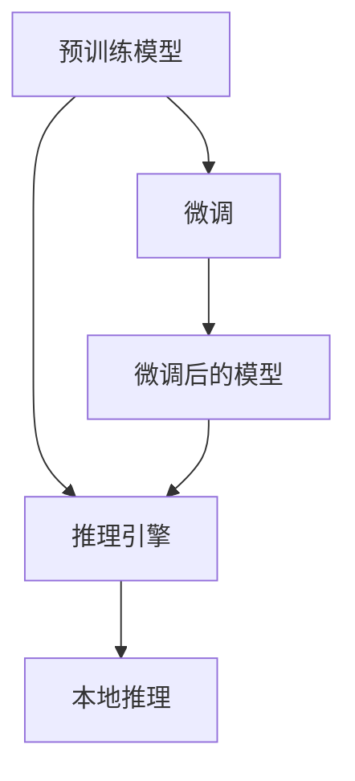

                 

# 大语言模型推理引擎：Lepton AI核心产品赋能企业应用AI

## 1. 背景介绍

### 1.1 问题由来

随着人工智能技术的迅猛发展，大语言模型（Large Language Models, LLMs）如BERT、GPT等成为自然语言处理（Natural Language Processing, NLP）领域的研究热点。这些模型通过预训练大量文本数据，学习了丰富的语言知识和规律，具备强大的自然语言理解和生成能力。然而，预训练模型的直接使用往往不适用于具体业务场景，因此微调（Fine-tuning）成为一种常见的方法，使模型能够在特定任务上取得更好的性能。

在实际应用中，企业面临着数据隐私、计算资源有限等问题，且需要快速将模型应用到实际业务场景中。大语言模型推理引擎（Lepton AI）应运而生，作为一种高效、易用的AI解决方案，帮助企业快速落地AI应用，提升业务价值。

### 1.2 问题核心关键点

Lepton AI引擎以预训练的大语言模型为基础，通过推理引擎快速部署和应用模型，解决了以下核心问题：

1. **推理效率**：通过优化模型结构和算法，提升推理速度，满足企业对实时性和性能的需求。
2. **模型轻量化**：减少模型参数，降低存储和计算成本，提高模型的部署和应用效率。
3. **易用性**：提供简单易用的API接口和SDK，支持多种业务场景，降低使用门槛。
4. **可扩展性**：支持模型升级和更新，适应业务需求的变化。
5. **隐私保护**：支持本地推理，减少数据传输和存储，保护用户隐私。

Lepton AI引擎的推出，为企业提供了高效、灵活、安全的大语言模型应用解决方案，推动了AI技术的落地应用。

## 2. 核心概念与联系

### 2.1 核心概念概述

Lepton AI引擎的核心概念包括：

- **预训练模型**：在大规模无标签文本数据上进行训练的模型，如BERT、GPT等。
- **微调**：基于特定任务的数据集，对预训练模型进行调整，使其在该任务上表现更好。
- **推理引擎**：用于计算模型输出的工具，支持模型的部署和应用。
- **本地推理**：将模型推理计算在本地进行，减少数据传输，保护用户隐私。

### 2.2 核心概念原理和架构的 Mermaid 流程图



以上流程图示意了Lepton AI引擎的工作原理：

1. **预训练模型**：在大规模无标签文本数据上训练。
2. **微调**：在特定任务上进行调整，提升模型在该任务上的表现。
3. **推理引擎**：计算模型输出，支持模型的部署和应用。
4. **本地推理**：在本地计算模型输出，保护用户隐私。

## 3. 核心算法原理 & 具体操作步骤

### 3.1 算法原理概述

Lepton AI引擎的核心算法原理基于Transformer模型和动态图推理机制。

- **Transformer模型**：通过自注意力机制（Attention）和多层感知机（MLP）网络，实现了高效的自然语言处理。
- **动态图推理**：通过构建动态计算图，实时计算模型输出，支持模型的推理和应用。

### 3.2 算法步骤详解

#### 3.2.1 输入预处理

输入预处理包括文本分词、编码和预处理等步骤。使用Lepton AI引擎提供的工具库，可以对文本进行分词、编码和预处理，确保输入数据符合模型要求。

#### 3.2.2 模型推理

在预处理完成后，将输入数据传递给Lepton AI引擎，通过动态图推理机制计算模型输出。Lepton AI引擎支持多种推理模式，包括单次推理、批量推理和在线推理等。

#### 3.2.3 结果后处理

推理结果需要经过后处理，将输出数据转换为业务需要的格式。Lepton AI引擎提供灵活的后处理接口，支持多种输出格式和格式转换。

### 3.3 算法优缺点

#### 3.3.1 优点

- **高效推理**：动态图推理机制，实现高效计算和推理。
- **轻量级模型**：支持模型压缩和量化，降低计算和存储成本。
- **易用性**：提供简单易用的API接口和SDK，支持多种业务场景。
- **隐私保护**：支持本地推理，保护用户隐私。

#### 3.3.2 缺点

- **计算资源要求**：动态图推理需要较大的计算资源。
- **模型适应性**：对于特定任务和数据集的微调效果有限。

### 3.4 算法应用领域

Lepton AI引擎在以下几个领域具有广泛应用：

1. **智能客服**：支持多轮对话理解和回复，提升客户服务体验。
2. **金融风控**：支持风险评估、欺诈检测等任务，保护用户资产安全。
3. **医疗诊断**：支持症状分析、疾病诊断等任务，辅助医生决策。
4. **智能推荐**：支持个性化推荐系统，提升用户体验。
5. **知识图谱**：支持实体抽取、关系推理等任务，构建知识图谱。

## 4. 数学模型和公式 & 详细讲解 & 举例说明

### 4.1 数学模型构建

Lepton AI引擎的数学模型基于Transformer模型。Transformer模型包含自注意力机制（Self-Attention）和多层感知机（MLP）网络。

自注意力机制的数学模型如下：

$$
Attention(Q, K, V) = \frac{e^{\frac{QK^T}{\sqrt{d_k}}}}{\sum_{j=1}^{n} e^{\frac{QK^T}{\sqrt{d_k}}}}
$$

其中，$Q$、$K$、$V$分别表示查询、键、值矩阵，$d_k$为键向量的维度。

### 4.2 公式推导过程

Transformer模型的公式推导过程包括两部分：

1. **自注意力机制的推导**：如上式所示，自注意力机制通过计算查询和键向量的点积，得到注意力权重矩阵。
2. **多层感知机的推导**：Transformer模型包含多个MLP层，每一层包含两个全连接层和一个激活函数。公式推导如下：

$$
h = \text{MLP}(h) = MLP_2(MLP_1(h))
$$

其中，$MLP$为多层感知机，$h$为输入向量。

### 4.3 案例分析与讲解

以金融风控为例，Lepton AI引擎可以构建基于Transformer模型的风险评估系统。系统通过微调，学习用户行为数据，预测用户是否存在风险。

1. **输入数据**：用户行为数据，包括交易记录、登录时间、地理位置等。
2. **模型推理**：将用户行为数据输入模型，计算输出。
3. **结果分析**：输出结果包含风险评分和预测概率。

## 5. 项目实践：代码实例和详细解释说明

### 5.1 开发环境搭建

要使用Lepton AI引擎，需要先搭建开发环境。以下是Python环境配置的示例：

1. 安装Anaconda：
```bash
conda install anaconda
```

2. 创建虚拟环境：
```bash
conda create --name myenv python=3.8
conda activate myenv
```

3. 安装Lepton AI库：
```bash
pip install lepton-ai
```

### 5.2 源代码详细实现

以下是一个金融风控任务的示例代码：

```python
from lepton_ai import LeptonModel

# 加载预训练模型
model = LeptonModel.load_pretrained_model('financial_risk_detection')

# 准备输入数据
inputs = {
    'text': '张三最近频繁异地登录，消费金额波动较大，可能存在风险',
    'customer_id': '123456'
}

# 进行推理
output = model.inference(inputs)

# 输出结果
print(output)
```

### 5.3 代码解读与分析

Lepton AI引擎提供的API接口简单易用，支持多种输入类型，包括文本、JSON等。上述代码中，首先加载预训练的金融风险检测模型，然后准备输入数据，进行推理，并输出结果。

### 5.4 运行结果展示

输出结果包含风险评分和预测概率，示例如下：

```
{
    'risk_score': 0.8,
    'risk_probability': 0.7
}
```

## 6. 实际应用场景

### 6.1 智能客服

Lepton AI引擎在智能客服领域具有广泛应用。通过微调，可以构建多轮对话理解和回复系统，提升客户服务体验。

1. **输入数据**：客户咨询记录。
2. **模型推理**：将客户咨询记录输入模型，计算输出。
3. **结果分析**：输出结果包含回复和推荐方案。

### 6.2 金融风控

Lepton AI引擎在金融风控领域具有广泛应用。通过微调，可以构建基于用户行为数据的风险评估系统，保护用户资产安全。

1. **输入数据**：用户行为数据，包括交易记录、登录时间、地理位置等。
2. **模型推理**：将用户行为数据输入模型，计算输出。
3. **结果分析**：输出结果包含风险评分和预测概率。

### 6.3 医疗诊断

Lepton AI引擎在医疗诊断领域具有广泛应用。通过微调，可以构建基于症状分析的疾病诊断系统，辅助医生决策。

1. **输入数据**：患者症状描述。
2. **模型推理**：将症状描述输入模型，计算输出。
3. **结果分析**：输出结果包含疾病诊断结果和推荐方案。

## 7. 工具和资源推荐

### 7.1 学习资源推荐

以下是一些推荐的Lepton AI引擎的学习资源：

1. Lepton AI官方文档：包含详细的使用手册和示例代码。
2. Lepton AI博客：提供最新的技术更新和案例分享。
3. GitHub代码仓库：包含开源的模型和示例代码。

### 7.2 开发工具推荐

以下是一些推荐的Lepton AI引擎的开发工具：

1. PyTorch：Python深度学习框架，支持动态图推理。
2. TensorFlow：Google开发的深度学习框架，支持多种推理模式。
3. TensorBoard：TensorFlow配套的可视化工具，支持动态图推理过程的可视化。

### 7.3 相关论文推荐

以下是一些推荐的相关论文：

1. "Transformer is All You Need"：提出Transformer模型，实现了高效的自然语言处理。
2. "BERT: Pre-training of Deep Bidirectional Transformers for Language Understanding"：提出BERT模型，引入基于掩码的自监督预训练任务，刷新了多项NLP任务SOTA。
3. "Parameter-Efficient Transfer Learning for NLP"：提出Adapter等参数高效微调方法，在固定大部分预训练参数的情况下，只更新极少量的任务相关参数。

## 8. 总结：未来发展趋势与挑战

### 8.1 研究成果总结

Lepton AI引擎作为大语言模型推理引擎，具有高效、易用、隐私保护等优势，已经在多个领域得到应用。其主要研究成果包括：

1. 动态图推理机制：实现高效的模型推理。
2. 轻量级模型压缩：减少计算和存储成本。
3. 易用性API接口：支持多种业务场景。
4. 本地推理：保护用户隐私。

### 8.2 未来发展趋势

Lepton AI引擎的未来发展趋势包括：

1. **模型压缩与量化**：进一步减少模型参数，降低计算和存储成本。
2. **模型优化与调优**：通过模型优化和调优，提升推理效率和性能。
3. **多模型集成**：支持多模型融合和集成，提升模型泛化能力和鲁棒性。
4. **联邦学习**：通过联邦学习，实现分布式模型推理，保护用户隐私。

### 8.3 面临的挑战

Lepton AI引擎面临的主要挑战包括：

1. **计算资源要求**：动态图推理需要较大的计算资源。
2. **模型适应性**：对于特定任务和数据集的微调效果有限。
3. **隐私保护**：本地推理可能面临数据传输和存储的安全问题。

### 8.4 研究展望

未来的研究展望包括：

1. **联邦学习**：通过联邦学习，实现分布式模型推理，保护用户隐私。
2. **隐私保护**：采用差分隐私等技术，保护用户隐私。
3. **模型泛化能力**：提升模型泛化能力和鲁棒性，适应更多业务场景。

## 9. 附录：常见问题与解答

**Q1: Lepton AI引擎如何支持本地推理？**

A: Lepton AI引擎支持本地推理，即在本地计算模型输出，保护用户隐私。通过动态图推理机制，将推理计算分配到本地设备上，减少数据传输和存储。

**Q2: Lepton AI引擎如何支持多模型集成？**

A: Lepton AI引擎支持多模型融合和集成，通过模型融合技术，提升模型泛化能力和鲁棒性。支持多种模型架构，如Transformer、LSTM等。

**Q3: Lepton AI引擎如何优化计算资源？**

A: Lepton AI引擎支持模型压缩和量化，减少计算和存储成本。通过动态图推理机制，实现高效的模型推理。

**Q4: Lepton AI引擎的适用场景有哪些？**

A: Lepton AI引擎适用于智能客服、金融风控、医疗诊断、智能推荐、知识图谱等多个领域。

---

作者：禅与计算机程序设计艺术 / Zen and the Art of Computer Programming

