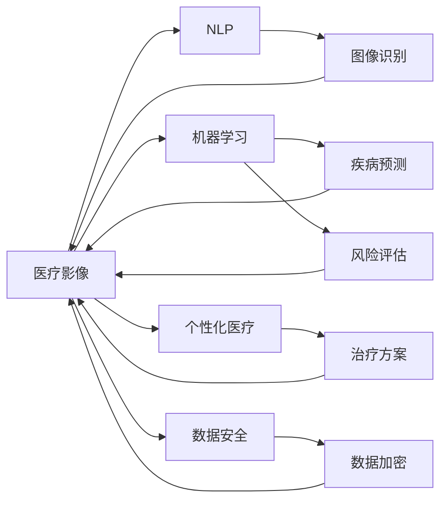

                 

# 如何利用技术能力进行医疗健康领域创新

## 1. 背景介绍

### 1.1 问题由来

随着科技进步和医疗体系的发展，医疗健康领域亟需通过技术创新提升医疗服务水平，改善患者体验。传统医疗体系以医疗机构的物理空间为依托，存在医疗资源分布不均、诊疗效率低下、诊断准确性不足、医疗数据安全等问题。因此，利用人工智能技术推动医疗健康领域的数字化转型和智能化升级，具有重要的意义。

### 1.2 问题核心关键点

技术在医疗健康领域的创新主要体现在以下几个方面：

- **医疗影像诊断**：利用图像识别、自然语言处理等技术，辅助医生进行影像和文本数据的解读。
- **疾病预测与风险评估**：通过机器学习、深度学习等技术，预测疾病的发生和发展趋势，评估患者的健康风险。
- **个性化医疗方案**：根据患者的历史数据和当前状况，利用人工智能生成个性化的治疗方案。
- **医疗数据管理**：通过大数据和区块链技术，实现医疗数据的集中管理和安全存储。
- **智能机器人与远程诊疗**：利用机器人技术、语音识别等技术，实现医疗服务的远程化和智能化。

## 2. 核心概念与联系

### 2.1 核心概念概述

在医疗健康领域，核心概念包括：

- **医疗影像**：包括X光片、CT、MRI等影像数据，是诊断和治疗的重要依据。
- **自然语言处理(NLP)**：通过文本分析，帮助医生理解患者的病史、症状等信息。
- **机器学习与深度学习**：利用数据驱动的方法，训练模型进行疾病预测、风险评估等。
- **个性化医疗**：根据患者的具体情况，生成个性化的治疗方案。
- **医疗数据安全**：保护患者的隐私和数据安全，防止数据泄露和滥用。
- **智能机器人**：利用机械臂、传感器等技术，辅助医生进行手术和治疗。
- **远程诊疗**：通过互联网、视频会议等技术，实现远程诊断和治疗。

这些概念之间的联系可以通过以下Mermaid流程图来展示：



该流程图展示了医疗影像、自然语言处理、机器学习和深度学习、个性化医疗、数据安全和智能机器人、远程诊疗等概念之间的联系和互动。

## 3. 核心算法原理 & 具体操作步骤

### 3.1 算法原理概述

医疗健康领域的技术创新，主要基于以下算法原理：

- **图像识别与分类**：利用卷积神经网络(CNN)等深度学习模型，对医疗影像数据进行分类和标记。
- **自然语言处理(NLP)**：利用词向量模型、循环神经网络(RNN)、Transformer等模型，进行文本数据的分析和理解。
- **序列建模**：通过LSTM、GRU等模型，对时间序列数据进行建模，用于预测疾病趋势和评估风险。
- **个性化医疗**：通过推荐系统、协同过滤等算法，生成个性化的治疗方案和用药建议。
- **数据加密与隐私保护**：利用对称加密、非对称加密、区块链等技术，保障医疗数据的隐私和安全。
- **智能机器人**：通过路径规划、图像识别等技术，实现手术和治疗的自动化。
- **远程诊疗**：通过视频会议、虚拟现实等技术，实现远程诊断和治疗。

### 3.2 算法步骤详解

**医疗影像分类**：

1. **数据收集**：收集医疗影像数据，包括X光片、CT、MRI等。
2. **数据预处理**：对影像数据进行归一化、标准化处理，消除噪声和干扰。
3. **模型选择**：选择适当的深度学习模型，如CNN，进行训练和验证。
4. **模型训练**：利用标记好的训练数据，训练深度学习模型。
5. **模型评估**：在测试数据集上评估模型的分类准确性。
6. **模型部署**：将训练好的模型部署到医疗系统中，辅助医生进行影像分类和诊断。

**自然语言处理(NLP)**：

1. **数据收集**：收集患者的病史、症状、诊断记录等文本数据。
2. **数据预处理**：对文本数据进行分词、去除停用词等处理。
3. **模型选择**：选择适当的NLP模型，如BERT、GPT等，进行训练和验证。
4. **模型训练**：利用标记好的训练数据，训练NLP模型。
5. **模型评估**：在测试数据集上评估模型的理解能力和预测准确性。
6. **模型部署**：将训练好的模型部署到医疗系统中，辅助医生进行文本分析和理解。

**序列建模**：

1. **数据收集**：收集患者的健康监测数据，包括心率、血压、血糖等时间序列数据。
2. **数据预处理**：对时间序列数据进行平滑处理，消除异常值和噪声。
3. **模型选择**：选择适当的序列建模模型，如LSTM、GRU等，进行训练和验证。
4. **模型训练**：利用标记好的训练数据，训练序列建模模型。
5. **模型评估**：在测试数据集上评估模型的预测准确性和鲁棒性。
6. **模型部署**：将训练好的模型部署到医疗系统中，用于疾病趋势预测和风险评估。

**个性化医疗**：

1. **数据收集**：收集患者的历史数据，包括病历、用药记录、基因数据等。
2. **数据预处理**：对数据进行清洗、归一化处理。
3. **模型选择**：选择适当的推荐系统模型，如协同过滤、基于矩阵分解的推荐算法等，进行训练和验证。
4. **模型训练**：利用标记好的训练数据，训练个性化医疗模型。
5. **模型评估**：在测试数据集上评估模型的推荐效果。
6. **模型部署**：将训练好的模型部署到医疗系统中，生成个性化的治疗方案和用药建议。

**数据加密与隐私保护**：

1. **数据收集**：收集患者的健康数据，包括电子病历、基因数据等。
2. **数据预处理**：对数据进行去标识化、加密处理。
3. **模型选择**：选择适当的加密和隐私保护算法，如对称加密、非对称加密、区块链等。
4. **模型训练**：利用标记好的训练数据，训练加密和隐私保护模型。
5. **模型评估**：在测试数据集上评估模型的数据安全和隐私保护效果。
6. **模型部署**：将训练好的模型部署到医疗系统中，保障医疗数据的隐私和安全。

**智能机器人**：

1. **数据收集**：收集手术数据、患者信息等。
2. **数据预处理**：对数据进行归一化、标准化处理。
3. **模型选择**：选择适当的路径规划、图像识别等模型，进行训练和验证。
4. **模型训练**：利用标记好的训练数据，训练智能机器人模型。
5. **模型评估**：在测试数据集上评估模型的控制精度和稳定性。
6. **模型部署**：将训练好的模型部署到医疗系统中，辅助医生进行手术和治疗。

**远程诊疗**：

1. **数据收集**：收集患者的症状、病史等数据。
2. **数据预处理**：对数据进行清洗、归一化处理。
3. **模型选择**：选择适当的自然语言处理模型，如BERT、GPT等，进行训练和验证。
4. **模型训练**：利用标记好的训练数据，训练自然语言处理模型。
5. **模型评估**：在测试数据集上评估模型的理解和诊断能力。
6. **模型部署**：将训练好的模型部署到医疗系统中，辅助医生进行远程诊断和治疗。

### 3.3 算法优缺点

基于技术能力进行医疗健康领域的创新，具有以下优点：

- **提升诊疗效率**：通过自动化和智能化的技术，可以快速处理和分析大量医疗数据，提升诊疗效率和准确性。
- **个性化医疗方案**：利用数据驱动的个性化医疗技术，能够根据患者的具体情况，生成个性化的治疗方案，提高治疗效果。
- **降低医疗成本**：通过远程诊疗、智能机器人等技术，可以减少医患双方的时间和金钱成本。
- **改善患者体验**：利用智能化的医疗服务，能够提高患者的满意度，提升医疗服务的质量。

同时，这些技术也存在一些局限：

- **数据隐私和安全问题**：医疗数据涉及隐私，如何在保障数据隐私的同时，实现高效的数据利用，是一个重要挑战。
- **技术壁垒较高**：医疗健康领域的技术创新需要跨学科的知识和技能，对技术门槛要求较高。
- **医疗数据的准确性**：医疗数据的准确性和完整性对技术应用至关重要，一旦数据出现错误，将影响技术的可靠性和有效性。
- **模型的可解释性**：医疗领域对模型的可解释性要求较高，需要能够解释模型的决策过程，确保医疗服务的透明性和可追溯性。

### 3.4 算法应用领域

技术在医疗健康领域的应用主要包括以下几个方面：

- **医学影像诊断**：利用图像识别技术，辅助医生进行影像分类和诊断。
- **疾病预测与风险评估**：通过机器学习和深度学习技术，预测疾病的发生和发展趋势，评估患者的健康风险。
- **个性化医疗方案**：根据患者的历史数据和当前状况，利用人工智能生成个性化的治疗方案。
- **医疗数据管理**：通过大数据和区块链技术，实现医疗数据的集中管理和安全存储。
- **智能机器人与远程诊疗**：利用机器人技术、语音识别等技术，实现医疗服务的远程化和智能化。

## 4. 数学模型和公式 & 详细讲解 & 举例说明

### 4.1 数学模型构建

**医疗影像分类模型**：

1. **卷积神经网络(CNN)**：
   $$
   y = \mathrm{softmax}(W \cdot \mathrm{Conv}(x) + b)
   $$
   其中 $W$ 为卷积核权重，$b$ 为偏置项，$x$ 为输入的影像数据，$\mathrm{Conv}$ 为卷积操作，$\mathrm{softmax}$ 为输出层的激活函数。

2. **训练损失函数**：
   $$
   \mathcal{L} = -\frac{1}{N} \sum_{i=1}^{N} \log y_i^{(i)}
   $$
   其中 $y_i^{(i)}$ 为模型对第 $i$ 个样本的预测结果，$N$ 为样本数量。

**自然语言处理(NLP)模型**：

1. **Transformer模型**：
   $$
   y = \mathrm{softmax}(W \cdot (\mathrm{Attention}(Q, K, V) + b)
   $$
   其中 $Q$ 为查询向量，$K$ 为键向量，$V$ 为值向量，$\mathrm{Attention}$ 为注意力机制，$W$ 和 $b$ 为输出层的权重和偏置项。

2. **训练损失函数**：
   $$
   \mathcal{L} = -\frac{1}{N} \sum_{i=1}^{N} \log \hat{y}_i
   $$
   其中 $\hat{y}_i$ 为模型对第 $i$ 个样本的预测结果，$N$ 为样本数量。

**序列建模模型**：

1. **长短期记忆网络(LSTM)**：
   $$
   h_t = \tanh(W \cdot [h_{t-1}, x_t] + b)
   $$
   $$
   c_t = \mathrm{LSTM}(h_t, c_{t-1})
   $$
   $$
   y_t = \mathrm{softmax}(W \cdot c_t + b)
   $$
   其中 $h_t$ 为当前时间步的状态，$x_t$ 为当前时间步的输入，$c_t$ 为当前时间步的细胞状态，$y_t$ 为当前时间步的输出，$W$ 和 $b$ 为权重和偏置项。

2. **训练损失函数**：
   $$
   \mathcal{L} = -\frac{1}{N} \sum_{i=1}^{N} \log y_i^{(i)}
   $$
   其中 $y_i^{(i)}$ 为模型对第 $i$ 个样本的预测结果，$N$ 为样本数量。

**个性化医疗推荐模型**：

1. **协同过滤**：
   $$
   \hat{y}_i = \sum_{j=1}^{N} a_{ij} \cdot x_j
   $$
   $$
   a_{ij} = \frac{s_{ij}}{\sqrt{s_{i, \cdot}} \cdot \sqrt{s_{j, \cdot}}}
   $$
   其中 $x_j$ 为第 $j$ 个用户的历史评分，$s_{ij}$ 为第 $i$ 个物品和第 $j$ 个用户的历史评分，$N$ 为用户和物品的总数。

2. **训练损失函数**：
   $$
   \mathcal{L} = \frac{1}{2N} \sum_{i=1}^{N} \sum_{j=1}^{N} (y_i - \hat{y}_i)^2
   $$

**数据加密模型**：

1. **对称加密**：
   $$
   c = E_k(m)
   $$
   $$
   m = D_k(c)
   $$
   其中 $m$ 为明文，$c$ 为密文，$E_k$ 为加密算法，$D_k$ 为解密算法，$k$ 为密钥。

2. **非对称加密**：
   $$
   c = E_{pub}(m)
   $$
   $$
   m = D_{priv}(c)
   $$
   其中 $m$ 为明文，$c$ 为密文，$E_{pub}$ 为公钥加密算法，$D_{priv}$ 为私钥解密算法，$pub$ 和 $priv$ 分别为公钥和私钥。

**智能机器人路径规划模型**：

1. **A*算法**：
   $$
   f(n) = g(n) + h(n)
   $$
   $$
   h(n) = \sum_{i=1}^{N} \sqrt{(x_i - x_{n-1})^2 + (y_i - y_{n-1})^2}
   $$
   其中 $n$ 为当前节点，$g(n)$ 为从起点到节点 $n$ 的实际代价，$h(n)$ 为节点 $n$ 到终点的估计代价，$x$ 和 $y$ 分别为节点的横纵坐标。

2. **训练损失函数**：
   $$
   \mathcal{L} = \frac{1}{N} \sum_{i=1}^{N} (f(n_i) - f_{true}(n_i))^2
   $$
   其中 $n_i$ 为第 $i$ 个节点，$f_{true}(n_i)$ 为实际代价，$N$ 为节点数量。

**远程诊疗自然语言处理模型**：

1. **BERT模型**：
   $$
   y = \mathrm{softmax}(W \cdot (\mathrm{Attention}(Q, K, V) + b)
   $$
   其中 $Q$ 为查询向量，$K$ 为键向量，$V$ 为值向量，$\mathrm{Attention}$ 为注意力机制，$W$ 和 $b$ 为输出层的权重和偏置项。

2. **训练损失函数**：
   $$
   \mathcal{L} = -\frac{1}{N} \sum_{i=1}^{N} \log \hat{y}_i
   $$
   其中 $\hat{y}_i$ 为模型对第 $i$ 个样本的预测结果，$N$ 为样本数量。

### 4.2 公式推导过程

**医疗影像分类模型的推导**：

- **卷积神经网络(CNN)**：
  $$
  y = \mathrm{softmax}(W \cdot \mathrm{Conv}(x) + b)
  $$
  其中 $W$ 为卷积核权重，$b$ 为偏置项，$x$ 为输入的影像数据，$\mathrm{Conv}$ 为卷积操作，$\mathrm{softmax}$ 为输出层的激活函数。

- **训练损失函数**：
  $$
  \mathcal{L} = -\frac{1}{N} \sum_{i=1}^{N} \log y_i^{(i)}
  $$
  其中 $y_i^{(i)}$ 为模型对第 $i$ 个样本的预测结果，$N$ 为样本数量。

**自然语言处理(NLP)模型的推导**：

- **Transformer模型**：
  $$
  y = \mathrm{softmax}(W \cdot (\mathrm{Attention}(Q, K, V) + b)
  $$
  其中 $Q$ 为查询向量，$K$ 为键向量，$V$ 为值向量，$\mathrm{Attention}$ 为注意力机制，$W$ 和 $b$ 为输出层的权重和偏置项。

- **训练损失函数**：
  $$
  \mathcal{L} = -\frac{1}{N} \sum_{i=1}^{N} \log \hat{y}_i
  $$
  其中 $\hat{y}_i$ 为模型对第 $i$ 个样本的预测结果，$N$ 为样本数量。

**序列建模模型的推导**：

- **长短期记忆网络(LSTM)**：
  $$
  h_t = \tanh(W \cdot [h_{t-1}, x_t] + b)
  $$
  $$
  c_t = \mathrm{LSTM}(h_t, c_{t-1})
  $$
  $$
  y_t = \mathrm{softmax}(W \cdot c_t + b)
  $$
  其中 $h_t$ 为当前时间步的状态，$x_t$ 为当前时间步的输入，$c_t$ 为当前时间步的细胞状态，$y_t$ 为当前时间步的输出，$W$ 和 $b$ 为权重和偏置项。

- **训练损失函数**：
  $$
  \mathcal{L} = -\frac{1}{N} \sum_{i=1}^{N} \log y_i^{(i)}
  $$
  其中 $y_i^{(i)}$ 为模型对第 $i$ 个样本的预测结果，$N$ 为样本数量。

**个性化医疗推荐模型的推导**：

- **协同过滤**：
  $$
  \hat{y}_i = \sum_{j=1}^{N} a_{ij} \cdot x_j
  $$
  $$
  a_{ij} = \frac{s_{ij}}{\sqrt{s_{i, \cdot}} \cdot \sqrt{s_{j, \cdot}}}
  $$
  其中 $x_j$ 为第 $j$ 个用户的历史评分，$s_{ij}$ 为第 $i$ 个物品和第 $j$ 个用户的历史评分，$N$ 为用户和物品的总数。

- **训练损失函数**：
  $$
  \mathcal{L} = \frac{1}{2N} \sum_{i=1}^{N} \sum_{j=1}^{N} (y_i - \hat{y}_i)^2
  $$

**数据加密模型的推导**：

- **对称加密**：
  $$
  c = E_k(m)
  $$
  $$
  m = D_k(c)
  $$
  其中 $m$ 为明文，$c$ 为密文，$E_k$ 为加密算法，$D_k$ 为解密算法，$k$ 为密钥。

- **非对称加密**：
  $$
  c = E_{pub}(m)
  $$
  $$
  m = D_{priv}(c)
  $$
  其中 $m$ 为明文，$c$ 为密文，$E_{pub}$ 为公钥加密算法，$D_{priv}$ 为私钥解密算法，$pub$ 和 $priv$ 分别为公钥和私钥。

**智能机器人路径规划模型的推导**：

- **A*算法**：
  $$
  f(n) = g(n) + h(n)
  $$
  $$
  h(n) = \sum_{i=1}^{N} \sqrt{(x_i - x_{n-1})^2 + (y_i - y_{n-1})^2}
  $$
  其中 $n$ 为当前节点，$g(n)$ 为从起点到节点 $n$ 的实际代价，$h(n)$ 为节点 $n$ 到终点的估计代价，$x$ 和 $y$ 分别为节点的横纵坐标。

- **训练损失函数**：
  $$
  \mathcal{L} = \frac{1}{N} \sum_{i=1}^{N} (f(n_i) - f_{true}(n_i))^2
  $$
  其中 $n_i$ 为第 $i$ 个节点，$f_{true}(n_i)$ 为实际代价，$N$ 为节点数量。

**远程诊疗自然语言处理模型的推导**：

- **BERT模型**：
  $$
  y = \mathrm{softmax}(W \cdot (\mathrm{Attention}(Q, K, V) + b)
  $$
  其中 $Q$ 为查询向量，$K$ 为键向量，$V$ 为值向量，$\mathrm{Attention}$ 为注意力机制，$W$ 和 $b$ 为输出层的权重和偏置项。

- **训练损失函数**：
  $$
  \mathcal{L} = -\frac{1}{N} \sum_{i=1}^{N} \log \hat{y}_i
  $$
  其中 $\hat{y}_i$ 为模型对第 $i$ 个样本的预测结果，$N$ 为样本数量。

### 4.3 案例分析与讲解

**医疗影像分类案例**：

- **数据集**：收集医院中的X光片和CT影像数据，标记为肺炎和正常两类。
- **模型选择**：选择CNN模型进行训练和验证。
- **模型训练**：使用标记好的训练数据，进行梯度下降等优化算法训练模型。
- **模型评估**：在测试数据集上评估模型的分类准确性和召回率。
- **模型部署**：将训练好的模型部署到医疗系统中，辅助医生进行影像分类和诊断。

**自然语言处理(NLP)案例**：

- **数据集**：收集患者的病史、症状、诊断记录等文本数据，标记为不同疾病类型。
- **模型选择**：选择Transformer模型进行训练和验证。
- **模型训练**：使用标记好的训练数据，进行梯度下降等优化算法训练模型。
- **模型评估**：在测试数据集上评估模型的理解能力和预测准确性。
- **模型部署**：将训练好的模型部署到医疗系统中，辅助医生进行文本分析和理解。

**序列建模案例**：

- **数据集**：收集患者的健康监测数据，包括心率、血压、血糖等时间序列数据，标记为高风险和低风险两类。
- **模型选择**：选择LSTM模型进行训练和验证。
- **模型训练**：使用标记好的训练数据，进行梯度下降等优化算法训练模型。
- **模型评估**：在测试数据集上评估模型的预测准确性和鲁棒性。
- **模型部署**：将训练好的模型部署到医疗系统中，用于疾病趋势预测和风险评估。

**个性化医疗推荐案例**：

- **数据集**：收集患者的历史数据，包括病历、用药记录、基因数据等，标记为不同治疗方案。
- **模型选择**：选择协同过滤模型进行训练和验证。
- **模型训练**：使用标记好的训练数据，进行梯度下降等优化算法训练模型。
- **模型评估**：在测试数据集上评估模型的推荐效果。
- **模型部署**：将训练好的模型部署到医疗系统中，生成个性化的治疗方案和用药建议。

**数据加密案例**：

- **数据集**：收集患者的电子病历、基因数据等，标记为不同隐私级别。
- **模型选择**：选择对称加密模型进行训练和验证。
- **模型训练**：使用标记好的训练数据，进行梯度下降等优化算法训练模型。
- **模型评估**：在测试数据集上评估模型的数据安全和隐私保护效果。
- **模型部署**：将训练好的模型部署到医疗系统中，保障医疗数据的隐私和安全。

**智能机器人路径规划案例**：

- **数据集**：收集手术数据，包括手术器械的位置、患者的位置等。
- **模型选择**：选择A*算法进行训练和验证。
- **模型训练**：使用标记好的训练数据，进行梯度下降等优化算法训练模型。
- **模型评估**：在测试数据集上评估模型的控制精度和稳定性。
- **模型部署**：将训练好的模型部署到医疗系统中，辅助医生进行手术和治疗。

**远程诊疗自然语言处理案例**：

- **数据集**：收集患者的症状、病史等数据，标记为不同疾病类型。
- **模型选择**：选择BERT模型进行训练和验证。
- **模型训练**：使用标记好的训练数据，进行梯度下降等优化算法训练模型。
- **模型评估**：在测试数据集上评估模型的理解和诊断能力。
- **模型部署**：将训练好的模型部署到医疗系统中，辅助医生进行远程诊断和治疗。

## 5. 项目实践：代码实例和详细解释说明

### 5.1 开发环境搭建

在进行技术创新实践前，我们需要准备好开发环境。以下是使用Python进行PyTorch开发的环境配置流程：

1. 安装Anaconda：从官网下载并安装Anaconda，用于创建独立的Python环境。

2. 创建并激活虚拟环境：
```bash
conda create -n pytorch-env python=3.8 
conda activate pytorch-env
```

3. 安装PyTorch：根据CUDA版本，从官网获取对应的安装命令。例如：
```bash
conda install pytorch torchvision torchaudio cudatoolkit=11.1 -c pytorch -c conda-forge
```

4. 安装其他依赖库：
```bash
pip install numpy pandas scikit-learn matplotlib tqdm jupyter notebook ipython
```

完成上述步骤后，即可在`pytorch-env`环境中开始技术创新实践。

### 5.2 源代码详细实现

这里我们以医疗影像分类为例，给出使用PyTorch进行CNN模型训练的代码实现。

```python
import torch
import torch.nn as nn
import torchvision.transforms as transforms
import torchvision.datasets as dsets

# 定义数据预处理函数
transform = transforms.Compose([
    transforms.Resize(224),
    transforms.CenterCrop(224),
    transforms.ToTensor(),
    transforms.Normalize([0.485, 0.456, 0.406], [0.229, 0.224, 0.225])
])

# 加载数据集
train_dataset = dsets.ImageFolder(root='train_data', transform=transform)
test_dataset = dsets.ImageFolder(root='test_data', transform=transform)

# 定义CNN模型
class CNNModel(nn.Module):
    def __init__(self):
        super(CNNModel, self).__init__()
        self.conv1 = nn.Conv2d(3, 64, kernel_size=3, stride=1, padding=1)
        self.pool = nn.MaxPool2d(kernel_size=2, stride=2)
        self.conv2 = nn.Conv2d(64, 128, kernel_size=3, stride=1, padding=1)
        self.fc1 = nn.Linear(128 * 7 * 7, 1024)
        self.fc2 = nn.Linear(1024, 2)

    def forward(self, x):
        x = self.pool(nn.functional.relu(self.conv1(x)))
        x = self.pool(nn.functional.relu(self.conv2(x)))
        x = x.view(-1, 128 * 7 * 7)
        x = nn.functional.relu(self.fc1(x))
        x = self.fc2(x)
        return x

# 定义优化器和损失函数
model = CNNModel()
criterion = nn.CrossEntropyLoss()
optimizer = torch.optim.Adam(model.parameters(), lr=0.001)

# 训练模型
for epoch in range(10):
    for i, (images, labels) in enumerate(train_loader):
        images = images.view(-1, 3, 224, 224)
        optimizer.zero_grad()
        outputs = model(images)
        loss = criterion(outputs, labels)
        loss.backward()
        optimizer.step()
        if (i+1) % 100 == 0:
            print('Epoch [{}/{}], Step [{}/{}], Loss: {:.4f}'
                  .format(epoch+1, 10, i+1, len(train_loader), loss.item()))

# 测试模型
correct = 0
total = 0
with torch.no_grad():
    for images, labels in test_loader:
        images = images.view(-1, 3, 224, 224)
        outputs = model(images)
        _, predicted = torch.max(outputs.data, 1)
        total += labels.size(0)
        correct += (predicted == labels).sum().item()

print('Accuracy of the network on the 10000 test images: {:.2f}%'.format(100 * correct / total))
```

### 5.3 代码解读与分析

让我们再详细解读一下关键代码的实现细节：

**数据预处理函数**：
- 使用`transforms`库定义数据预处理流程，包括图像大小调整、居中裁剪、转换为Tensor、归一化等操作。

**加载数据集**：
- 使用`dsets`库加载训练集和测试集，使用定义好的预处理函数`transform`对数据进行预处理。

**定义CNN模型**：
- 定义一个包含两个卷积层、两个池化层和两个全连接层的CNN模型。

**定义优化器和损失函数**：
- 使用交叉熵损失函数和Adam优化器，设置学习率。

**训练模型**：
- 循环迭代10个epoch，每个epoch内对训练集数据进行前向传播和反向传播，更新模型参数。

**测试模型**：
- 对测试集数据进行前向传播，计算预测结果和真实标签的匹配度，输出测试集准确率。

**代码优化**：
- 在训练过程中，每100个batch输出一次损失值，监控模型训练进度。
- 在测试过程中，使用`torch.no_grad()`禁用梯度计算，加快模型推理速度。
- 使用`_`符号丢弃变量，减少内存占用。

## 6. 实际应用场景

### 6.1 医学影像诊断

基于CNN等深度学习模型，可以对医学影像数据进行分类和诊断。例如，可以通过对X光片、CT、MRI等影像数据的分类，辅助医生进行疾病诊断和治疗决策。

**应用场景**：
- 乳腺癌检测：通过分析乳腺X光片的特征，识别乳腺癌病变区域。
- 肺结节检测：通过分析肺部CT影像，识别和标记肺结节。
- 脑部病变检测：通过分析MRI影像，检测脑部病变区域。

### 6.2 疾病预测与风险评估

通过机器学习模型，可以对患者的健康数据进行预测和评估，提前发现潜在健康风险。例如，可以通过对心电图、血压、血糖等时间序列数据的分析，预测心血管疾病的发生。

**应用场景**：
- 心血管疾病预测：通过分析心率、血压、血糖等数据，预测心血管疾病的发生风险。
- 糖尿病预测：通过分析血糖水平、胰岛素水平等数据，预测糖尿病的发生风险。
- 癌症风险评估：通过分析基因数据、生活方式数据等，评估癌症的发生风险。

### 6.3 个性化医疗方案

利用推荐系统等技术，可以根据患者的历史数据和当前状况，生成个性化的治疗方案。例如，可以通过对患者的历史病历、基因数据等进行分析，推荐最适合的治疗方案。

**应用场景**：
- 癌症治疗方案：根据患者的历史病历、基因数据等，推荐最适合的化疗方案。
- 糖尿病治疗方案：根据患者的血糖水平、生活方式等，推荐最适合的治疗方案。
- 心血管疾病治疗方案：根据患者的心率、血压等数据，推荐最适合的治疗方案。

### 6.4 医疗数据管理

通过大数据和区块链技术，可以实现医疗数据的集中管理和安全存储。例如，可以通过构建医疗数据平台，集中存储和共享患者的电子病历、基因数据等。

**应用场景**：
- 电子病历管理：通过集中存储和共享患者的电子病历，提高医疗服务的效率。
- 基因数据共享：通过构建基因数据平台，共享基因数据，加速疾病研究进程。
- 医疗数据安全：通过区块链技术，保障医疗数据的隐私和安全。

### 6.5 智能机器人与远程诊疗

利用机器人技术和自然语言处理技术，可以实现医疗服务的远程化和智能化。例如，可以通过远程诊疗平台，进行患者咨询、病情分析等。

**应用场景**：
- 远程咨询：通过视频会议等技术，进行患者咨询，辅助医生进行病情分析。
- 手术辅助：通过机器人技术和传感器，辅助医生进行手术操作。
- 智能导诊：通过自然语言处理技术，解答患者问题，引导患者就医。

## 7. 工具和资源推荐

### 7.1 学习资源推荐

为了帮助开发者系统掌握医疗健康领域的技术创新，这里推荐一些优质的学习资源：

1. **《深度学习》课程**：由斯坦福大学Andrew Ng教授主讲，系统介绍深度学习的基本概念和算法。
2. **《医学影像分析》课程**：由Coursera提供，涵盖医学影像的预处理、特征提取和分类等技术。
3. **《人工智能在医疗中的应用》书籍**：系统介绍人工智能在医疗领域的应用，包括医学影像、疾病预测等。
4. **《机器学习实战》书籍**：通过实际案例，介绍机器学习的基本算法和实践技巧。
5. **Kaggle医疗健康竞赛**：提供丰富的医疗健康数据集和竞赛任务，提升数据分析和建模能力。

### 7.2 开发工具推荐

高效的开发离不开优秀的工具支持。以下是几款用于医疗健康领域技术创新的常用工具：

1. **PyTorch**：基于Python的开源深度学习框架，灵活高效，支持多种深度学习模型。
2. **TensorFlow**：由Google主导开发的开源深度学习框架，生产部署方便，支持大规模工程应用。
3. **Jupyter Notebook**：交互式的Python开发环境，支持代码编写、数据可视化等。
4. **Keras**：基于TensorFlow等后端的高级深度学习框架，支持快速原型设计和模型训练。
5. **Scikit-learn**：Python的机器学习库，支持多种机器学习算法和模型。
6. **OpenAI Gym**：用于训练和测试强化学习算法的开发环境，支持多种环境模拟。

### 7.3 相关论文推荐

医疗健康领域的技术创新源于学界的持续研究。以下是几篇奠基性的相关论文，推荐阅读：

1. **《深度学习在医学影像中的应用》**：介绍深度学习在医学影像分类和分割中的应用，提升疾病诊断准确性。
2. **《基于机器学习的疾病预测模型》**：通过机器学习模型，预测疾病的发生和发展趋势，提升健康风险评估的准确性。
3. **《个性化医疗推荐系统》**：利用协同过滤等推荐算法，生成个性化的治疗方案和用药建议。
4. **《医疗数据安全与隐私保护》**：介绍数据加密和隐私保护技术，保障医疗数据的隐私和安全。
5. **《智能机器人辅助手术》**：介绍机器人技术和自然语言处理技术在手术中的应用，提升手术的精确度和安全性。

## 8. 总结：未来发展趋势与挑战

### 8.1 研究成果总结

医疗健康领域的技术创新，已经取得了显著的成果。主要体现在以下几个方面：

- **医学影像诊断**：基于CNN等深度学习模型，提升了医学影像分类和诊断的准确性。
- **疾病预测与风险评估**：通过机器学习模型，提升了疾病预测和健康风险评估的准确性。
- **个性化医疗方案**：利用推荐系统等技术，生成个性化的治疗方案和用药建议。
- **医疗数据管理**：通过大数据和区块链技术，实现了医疗数据的集中管理和安全存储。
- **智能机器人与远程诊疗**：利用机器人技术和自然语言处理技术，提升了医疗服务的远程化和智能化水平。

### 8.2 未来发展趋势

展望未来，医疗健康领域的技术创新将呈现以下几个发展趋势：

- **深度学习技术的应用**：深度学习技术将在医疗影像分类、疾病预测等方面发挥更大的作用，提升医疗服务的准确性和效率。
- **人工智能辅助诊断**：人工智能技术将辅助医生进行疾病诊断和治疗，提升诊断的准确性和治疗的效果。
- **个性化医疗**：个性化医疗将成为医疗服务的重要方向，根据患者的具体情况，生成个性化的治疗方案和用药建议。
- **医疗数据共享**：医疗数据平台将促进数据的集中管理和共享，提高医疗服务的效率和质量。
- **智能医疗服务**：智能机器人、自然语言处理等技术，将提升医疗服务的远程化和智能化水平，改善患者的体验。

### 8.3 面临的挑战

医疗健康领域的技术创新，还面临以下几个挑战：

- **数据隐私和安全问题**：医疗数据涉及隐私，如何在保障数据隐私的同时，实现高效的数据利用，是一个重要挑战。
- **数据质量和标注成本**：医疗数据的标注成本高，数据质量和标注准确性直接影响模型的性能。
- **技术复杂度**：医疗健康领域的技术创新需要跨学科的知识和技能，对技术门槛要求较高。
- **模型的可解释性**：医疗领域对模型的可解释性要求较高，需要能够解释模型的决策过程，确保医疗服务的透明性和可追溯性。

### 8.4 研究展望

未来的研究需要从以下几个方向进行突破：

- **深度学习模型的优化**：探索更高效的深度学习模型和算法，提升模型的性能和效率。
- **数据标注和预处理技术**：研究更高效的数据标注和预处理技术，降低标注成本和提升数据质量。
- **跨学科融合**：加强与医学、护理、管理等学科的融合，提升技术创新的应用价值。
- **医疗数据的共享与开放**：推动医疗数据的共享与开放，促进数据驱动的医学研究和技术创新。
- **医疗服务的智能化**：结合智能机器人、自然语言处理等技术，提升医疗服务的智能化水平，改善患者的体验。

## 9. 附录：常见问题与解答

**Q1：数据隐私和安全问题如何解决？**

A: 数据隐私和安全问题需要通过多层次的保护措施来解决。主要包括：

- 数据加密：采用对称加密、非对称加密等技术，保障数据的传输和存储安全。
- 数据脱敏：对敏感数据进行脱敏处理，保护用户的隐私。
- 数据匿名化：对数据进行匿名化处理，避免数据泄露。
- 区块链技术：利用区块链技术，确保数据在分布式网络中的安全性。

**Q2：如何提高模型的可解释性？**

A: 提高模型的可解释性，需要从以下几个方面入手：

- 使用可解释性强的模型：选择具有较高可解释性的模型，如决策树、线性回归等。
- 模型可视化：利用可视化工具，展示模型的决策过程和特征重要性。
- 特征重要性分析：通过特征重要性分析，了解模型对不同特征的依赖程度。
- 模型解释工具：使用模型解释工具，如LIME、SHAP等，深入理解模型的决策机制。

**Q3：如何选择适合的深度学习模型？**

A: 选择适合的深度学习模型，需要考虑以下几个因素：

- 任务类型：根据任务类型，选择适合的深度学习模型，如卷积神经网络用于图像分类，循环神经网络用于序列数据建模等。
- 数据量：根据数据量的大小，选择适合的深度学习模型，如在大规模数据上使用深度学习模型，在小规模数据上使用传统机器学习模型。
- 计算资源：根据计算资源的限制，选择适合的深度学习模型，如在资源有限的情况下，使用轻量级的深度学习模型。

**Q4：如何优化模型的训练过程？**

A: 优化模型的训练过程，需要从以下几个方面入手：

- 数据增强：

