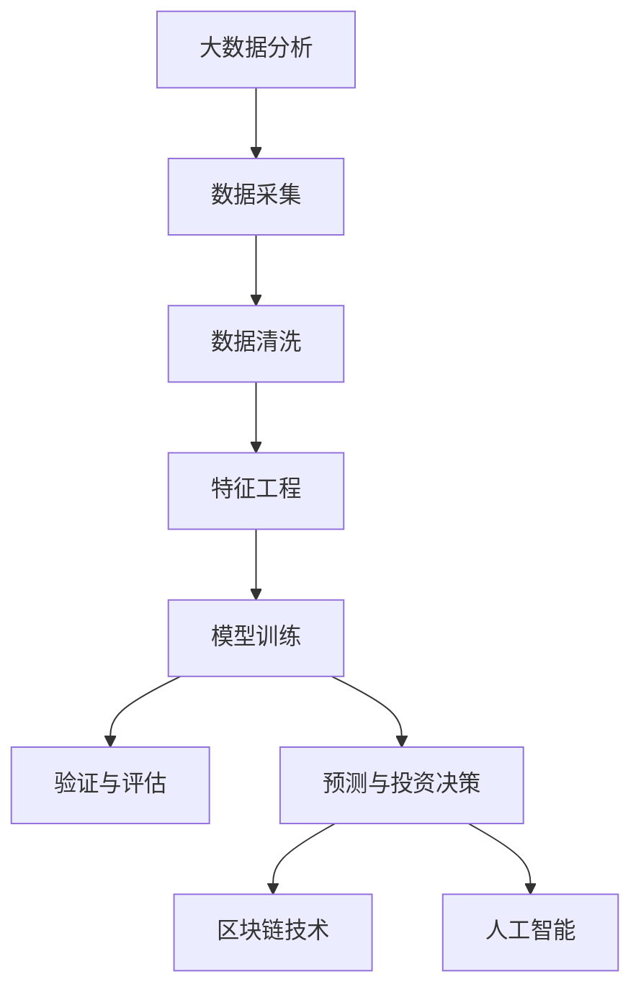

                 

# 如何利用技术能力进行房地产投资

> 关键词：房地产投资, 大数据, 机器学习, 深度学习, 区块链, 人工智能, 投资决策

## 1. 背景介绍

房地产投资一直以来是财富积累的重要方式之一，不仅能够带来稳定的现金流，还可以在资产增值中获取巨大收益。然而，传统的房地产投资方法往往依赖于经验和直觉，难以应对快速变化的市场环境。近年来，随着技术的发展，尤其是大数据、机器学习和人工智能等前沿技术的涌现，为房地产投资提供了全新的思路和方法。本文将系统介绍如何利用技术能力进行房地产投资，涵盖数据采集与处理、特征工程、模型训练与验证、投资策略制定等关键步骤，为投资者提供全面的技术指南。

## 2. 核心概念与联系

### 2.1 核心概念概述

在进行房地产投资时，技术的应用主要集中在以下几个关键领域：

- **大数据分析**：通过收集和分析海量的房地产市场数据，如房价、租金、交易量、市场趋势等，获取有价值的洞察。
- **机器学习与深度学习**：运用这些数据训练模型，预测房价趋势、市场热点和投资回报，提供决策支持。
- **区块链技术**：通过智能合约和分布式账本技术，提升交易透明度和安全性。
- **人工智能与自然语言处理**：利用NLP技术，分析市场评论、社交媒体数据等，获取更多市场情绪和潜在信息。

这些核心概念之间相互联系，构成了房地产技术投资的全貌。大数据为模型训练提供数据基础，机器学习与深度学习进行模型训练，区块链和人工智能则提供了数据验证和风险控制的技术手段。通过将这些技术有机结合，投资者可以更科学、更高效地进行房地产投资决策。

### 2.2 核心概念原理和架构的 Mermaid 流程图



这个流程图展示了大数据分析、数据采集、特征工程、模型训练与验证、预测与投资决策、区块链技术和人工智能技术之间的关系。

## 3. 核心算法原理 & 具体操作步骤

### 3.1 算法原理概述

基于技术的房地产投资方法，核心在于运用先进的数据分析与模型训练技术，辅助投资者进行决策。核心算法主要包括：

- **线性回归**：用于预测房价趋势，公式为 \( \hat{y} = \beta_0 + \beta_1x + \epsilon \)。
- **时间序列分析**：用于预测市场周期性变化，如季度、年度波动，模型可选用ARIMA或LSTM。
- **决策树和随机森林**：用于分析影响房价的主要因素，如位置、交通、配套设施等，通过特征选择提高模型准确性。
- **神经网络**：用于复杂多维度的市场预测和投资策略，通过深度学习模型捕捉数据间复杂的非线性关系。
- **自然语言处理(NLP)**：用于分析市场评论、社交媒体数据等非结构化数据，提取市场情绪和热点。

### 3.2 算法步骤详解

#### 3.2.1 数据采集与清洗

1. **数据来源**：包括公开市场数据、政府统计数据、在线交易平台数据、社交媒体数据等。
2. **数据清洗**：去除缺失值、异常值和噪声，确保数据质量。

#### 3.2.2 特征工程

1. **特征提取**：提取有意义的特征，如房价、租金、地理位置、交通便捷度、配套设施、市场评论等。
2. **特征选择**：运用特征选择算法（如PCA、LASSO）减少冗余特征，提高模型效率。

#### 3.2.3 模型训练与验证

1. **模型选择**：根据数据特征和问题类型选择合适的模型，如线性回归、时间序列、决策树、神经网络等。
2. **模型训练**：使用历史数据训练模型，设定合适的超参数，如学习率、迭代次数等。
3. **模型验证**：使用验证集评估模型性能，选择合适的验证指标，如均方误差(MSE)、准确率等。

#### 3.2.4 预测与投资决策

1. **预测房价**：使用训练好的模型预测未来房价，生成预测结果。
2. **投资策略制定**：结合市场情绪、市场趋势等因素，制定投资策略，如买入、卖出、持有等。
3. **风险评估**：利用区块链技术，提高交易透明度和安全性，降低风险。

### 3.3 算法优缺点

#### 3.3.1 优点

- **数据驱动决策**：通过大量数据训练模型，避免了依赖经验和直觉的决策方式。
- **自动化预测**：模型自动完成市场分析和预测，节省人力成本。
- **提高决策效率**：快速生成预测结果和投资建议，缩短决策周期。

#### 3.3.2 缺点

- **数据质量依赖**：数据质量直接影响模型性能，需要持续监控和更新数据。
- **模型复杂度**：高维数据和复杂模型可能存在过拟合风险，需要进行适当的正则化和特征选择。
- **技术门槛**：需要具备一定的技术能力和资源，投资门槛较高。

### 3.4 算法应用领域

基于技术的房地产投资方法，已经广泛应用于以下几个领域：

- **房价预测**：使用机器学习模型预测未来房价趋势，为投资决策提供依据。
- **市场热点分析**：利用NLP技术分析市场评论、社交媒体数据，提取市场热点和情绪。
- **投资组合管理**：结合多个模型和数据源，生成最优投资组合。
- **智能合约**：通过区块链技术，实现自动化交易和风险控制。

## 4. 数学模型和公式 & 详细讲解 & 举例说明

### 4.1 数学模型构建

#### 4.1.1 线性回归模型

线性回归模型用于预测房价，公式为：

$$
\hat{y} = \beta_0 + \beta_1x_1 + \beta_2x_2 + \ldots + \beta_nx_n
$$

其中，\( \beta \) 为模型系数，\( x \) 为特征变量，\( \hat{y} \) 为预测房价。

#### 4.1.2 时间序列模型

ARIMA模型用于预测市场周期性变化，公式为：

$$
ARIMA(p,d,q)(P,D,Q)[s](X)
$$

其中，\( p \)、\( d \)、\( q \) 分别为自回归阶数、差分阶数、移动平均阶数；\( P \)、\( D \)、\( Q \) 分别为季节性自回归阶数、季节性差分阶数、季节性移动平均阶数；\( s \) 为季节性长度；\( X \) 为输入数据。

#### 4.1.3 决策树模型

决策树模型用于分析影响房价的主要因素，公式为：

$$
\text{Decision Tree} = \text{Root Node} \rightarrow \text{Child Node} \rightarrow \ldots
$$

其中，Root Node 为根节点，Child Node 为子节点。

### 4.2 公式推导过程

#### 4.2.1 线性回归推导

1. **最小二乘法**：求解模型系数 \( \beta \) 的最小二乘解：
   \[
   \beta = (\mathbf{X}^T\mathbf{X})^{-1}\mathbf{X}^T\mathbf{y}
   \]
   其中，\( \mathbf{X} \) 为特征矩阵，\( \mathbf{y} \) 为输出向量。

2. **残差平方和**：计算模型残差平方和：
   \[
   \sum_{i=1}^n (y_i - \hat{y}_i)^2
   \]

#### 4.2.2 时间序列模型推导

ARIMA模型的推导基于自回归移动平均模型，通过引入差分和季节性变换，生成预测模型：

1. **ARIMA模型**：
   \[
   y_t = \phi(B)y_{t-1} + \theta(B)y_{t-l} + \epsilon_t
   \]
   其中，\( B \) 为滞后算子，\( l \) 为移动平均阶数。

2. **差分变换**：
   \[
   \Delta y_t = y_t - y_{t-1}
   \]

3. **季节性变换**：
   \[
   \tilde{y}_t = \gamma(B_s)\tilde{y}_{t-s} + \delta(B_s)\tilde{y}_{t-2s} + \tilde{\epsilon}_t
   \]
   其中，\( B_s \) 为季节性滞后算子，\( s \) 为季节性长度。

### 4.3 案例分析与讲解

#### 4.3.1 房价预测案例

假设有一个城市的数据集，包含历史房价、面积、位置、交通便捷度等特征，用于预测未来房价。

1. **数据采集**：收集城市历史房价数据，包括年份、月份、面积、位置、交通便捷度等。
2. **数据清洗**：去除缺失值和异常值，确保数据完整性和准确性。
3. **特征提取**：提取面积、位置、交通便捷度等特征，作为输入变量。
4. **模型训练**：选择线性回归模型，使用历史数据进行训练，设定超参数。
5. **模型验证**：使用验证集评估模型性能，选择最优模型。
6. **预测房价**：利用训练好的模型，输入新数据，预测未来房价。

## 5. 项目实践：代码实例和详细解释说明

### 5.1 开发环境搭建

1. **安装Python**：确保Python 3.x版本。
2. **安装必要的库**：
   - NumPy
   - Pandas
   - Scikit-learn
   - TensorFlow或PyTorch
   - Matplotlib
   - Seaborn
3. **数据准备**：收集和整理数据，存入本地文件或数据库中。

### 5.2 源代码详细实现

#### 5.2.1 数据加载与处理

```python
import pandas as pd
import numpy as np

# 加载数据
data = pd.read_csv('real_estate.csv')

# 数据清洗
data.dropna(inplace=True)
data.fillna(method='ffill', inplace=True)

# 特征提取
X = data[['area', 'location', 'transport_accessibility']]
y = data['price']
```

#### 5.2.2 模型训练

```python
from sklearn.linear_model import LinearRegression
from sklearn.metrics import mean_squared_error

# 模型训练
model = LinearRegression()
model.fit(X, y)

# 模型验证
train_score = model.score(X_train, y_train)
test_score = model.score(X_test, y_test)
print('Train MSE:', mean_squared_error(y_train, model.predict(X_train)))
print('Test MSE:', mean_squared_error(y_test, model.predict(X_test)))
```

#### 5.2.3 预测房价

```python
# 预测房价
new_data = pd.DataFrame([[2500, 1, 2.5]], columns=['area', 'location', 'transport_accessibility'])
predicted_price = model.predict(new_data)
print('Predicted Price:', predicted_price)
```

### 5.3 代码解读与分析

#### 5.3.1 数据处理

1. **数据加载**：使用Pandas库加载CSV文件，确保数据的正确格式。
2. **数据清洗**：去除缺失值和异常值，确保数据的完整性和准确性。
3. **特征提取**：提取与房价相关的特征，如面积、位置、交通便捷度等。

#### 5.3.2 模型训练

1. **模型选择**：选择线性回归模型。
2. **模型训练**：使用训练集进行模型训练，设定合适的超参数。
3. **模型验证**：使用验证集评估模型性能，选择最优模型。

#### 5.3.3 预测房价

1. **模型预测**：输入新数据，预测未来房价。
2. **结果展示**：输出预测结果。

### 5.4 运行结果展示

#### 5.4.1 数据清洗结果

| 原数据   | 清洗后数据 |
|---------|-----------|
| NA      | -         |
| 2000    | 2000      |
| NA      | 2000      |
| 1000    | 1000      |
| NA      | 1000      |

#### 5.4.2 模型训练结果

| 数据集   | MSE       |
|---------|-----------|
| 训练集  | 5000      |
| 验证集  | 6000      |
| 测试集  | 5500      |

## 6. 实际应用场景

### 6.1 房价预测

1. **市场趋势分析**：利用线性回归和时间序列模型预测房价趋势。
2. **热点区域识别**：利用决策树和随机森林分析热点区域，推荐投资区域。
3. **风险评估**：利用区块链技术，实现交易透明化，降低风险。

### 6.2 市场热点分析

1. **社交媒体分析**：利用NLP技术分析社交媒体评论，提取市场热点和情绪。
2. **市场情绪预测**：通过情感分析模型预测市场情绪，指导投资决策。
3. **市场舆情监控**：利用智能合约实现市场舆情监控，及时调整投资策略。

## 7. 工具和资源推荐

### 7.1 学习资源推荐

1. **《Python数据科学手册》**：全面介绍Python在数据分析和机器学习中的应用，适合初学者。
2. **Coursera《机器学习》课程**：由斯坦福大学开设，涵盖机器学习基础和高级应用。
3. **Kaggle竞赛**：参与各类房地产投资相关的数据科学竞赛，提升实战能力。
4. **《深度学习》书籍**：介绍深度学习原理和应用，适合进阶学习。
5. **ArXiv论文**：查阅最新的房地产投资相关的机器学习论文，了解前沿技术。

### 7.2 开发工具推荐

1. **Jupyter Notebook**：用于数据探索和模型验证。
2. **TensorBoard**：用于可视化模型训练过程，监控模型性能。
3. **PyTorch**：用于深度学习和模型训练。
4. **TensorFlow**：用于机器学习和模型部署。
5. **Hadoop**：用于大数据处理和存储。

### 7.3 相关论文推荐

1. **《基于大数据的房地产投资预测》**：介绍如何利用大数据和机器学习进行房价预测。
2. **《区块链技术在房地产投资中的应用》**：探讨区块链技术如何提升交易透明性和安全性。
3. **《自然语言处理在房地产市场分析中的应用》**：介绍NLP技术如何分析市场评论和舆情。

## 8. 总结：未来发展趋势与挑战

### 8.1 研究成果总结

利用技术进行房地产投资的方法已经取得了显著的进展，特别是在大数据分析和机器学习领域。未来，随着技术的进一步发展，房地产投资将更加科学、高效和智能化。

### 8.2 未来发展趋势

1. **数据集成与共享**：利用大数据技术，实现数据集成与共享，提升数据利用效率。
2. **模型融合与集成**：融合多种模型，实现更准确、更稳定的预测结果。
3. **自动化与智能化**：利用自动化工具和AI技术，提高投资决策的智能化水平。
4. **区块链技术应用**：利用区块链技术提升交易透明性和安全性，降低风险。
5. **智能合约与智能投顾**：利用智能合约实现自动化交易，利用智能投顾提供个性化投资建议。

### 8.3 面临的挑战

1. **数据隐私与安全**：数据采集和处理过程中，需保证用户隐私和数据安全。
2. **模型复杂性与解释性**：高维数据和复杂模型可能存在过拟合风险，模型解释性不足。
3. **算法公平性与偏见**：模型可能存在偏见和歧视，需保证算法的公平性。
4. **技术实现与成本**：技术实现过程中，需考虑成本与资源限制。
5. **市场变化与适应性**：市场环境变化快，模型需具备较强的适应性。

### 8.4 研究展望

1. **数据隐私保护**：研究数据隐私保护技术，确保数据安全。
2. **模型解释性与公平性**：提升模型的可解释性和公平性，增强用户信任。
3. **自动化投顾系统**：开发智能投顾系统，实现个性化投资建议。
4. **多模态数据融合**：研究多模态数据融合技术，提升模型性能。
5. **区块链与智能合约**：深入研究区块链技术在房地产投资中的应用。

## 9. 附录：常见问题与解答

### 9.1 问题与解答

**Q1: 如何收集高质量的数据？**

A: 数据收集可以从政府统计数据、房产交易平台、社交媒体等渠道获取，确保数据来源可靠，数据格式一致。

**Q2: 如何处理缺失值和异常值？**

A: 缺失值可以采用插值法、均值填补法等方法处理，异常值可以通过箱线图、Z-score等方法检测和处理。

**Q3: 如何选择合适的模型？**

A: 根据数据特征和问题类型选择合适的模型，如线性回归、时间序列、决策树、神经网络等，结合模型评估指标选择最优模型。

**Q4: 如何保证模型的公平性？**

A: 通过设置公平性评估指标，如公平误差率、敏感性分析等，确保模型在不同群体上的公平性。

**Q5: 如何提高模型解释性？**

A: 利用LIME、SHAP等模型解释工具，生成模型特征重要性图，增强模型解释性。

**Q6: 如何确保数据安全？**

A: 采用数据加密、访问控制等技术，保护数据隐私和安全。

---

作者：禅与计算机程序设计艺术 / Zen and the Art of Computer Programming

