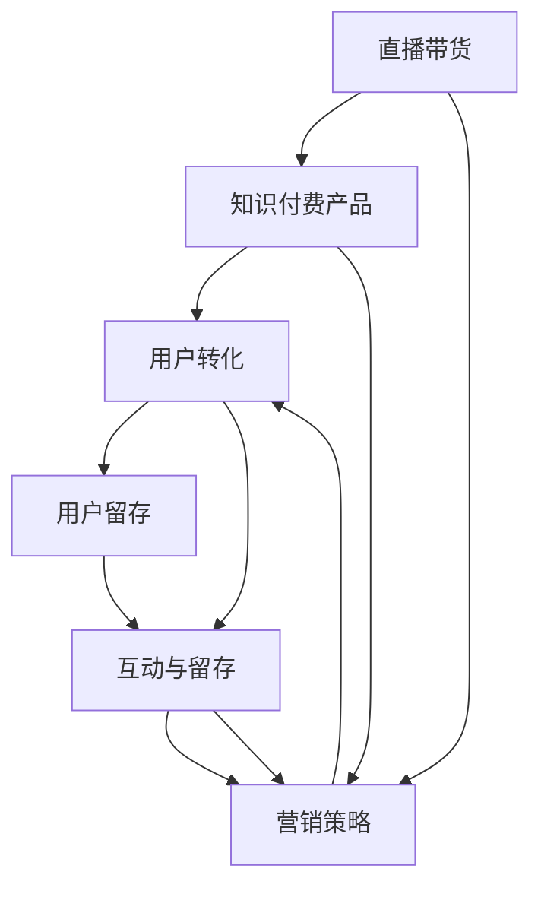

                 

# 如何利用直播带货推广知识付费产品

> 关键词：直播带货,知识付费产品,用户转化,转化率优化,互动与留存,营销策略

## 1. 背景介绍

### 1.1 问题由来
随着互联网的发展，知识付费逐渐成为了人们获取知识和信息的一种新方式。知识付费产品的形式多种多样，包括在线课程、电子书、专栏文章等。然而，知识付费产品的推广难度较大，用户转化率较低。传统的产品推荐方式难以满足用户的多样化需求，用户留存率不高。为解决这些问题，直播带货这一新兴模式在知识付费产品推广中得到了广泛应用。直播带货能够提高用户参与度，增强用户互动，提升转化率。

### 1.2 问题核心关键点
直播带货是指通过直播的方式将知识付费产品推荐给观众，观众可以通过直播间的购买链接直接购买课程。直播带货的核心在于通过主播与观众的互动，引导观众购买知识付费产品。关键点包括：
- 主播选择
- 直播内容设计
- 互动策略
- 直播间的购买链接优化
- 数据监控与优化

## 2. 核心概念与联系

### 2.1 核心概念概述

为更好地理解直播带货推广知识付费产品的机制，本节将介绍几个核心概念：

- **直播带货(Live E-commerce)：**通过直播的方式推荐和销售产品的电商形式。主播通过直播展示产品、解答用户问题，并推荐观众购买。
- **知识付费产品(Knowledge Paywall)：**包括在线课程、电子书、专栏文章等，用户通过付费获取知识和服务。
- **用户转化(Customer Conversion)：**指将潜在用户转化为付费用户的流程。
- **用户留存(Customer Retention)：**指用户持续使用平台并进行后续消费的比例。
- **互动与留存(Interactive Engagement and Retention)：**指通过互动活动和优化策略提高用户参与度和留存率。
- **营销策略(Marketing Strategy)：**指在推广知识付费产品过程中所采用的各种策略和方法。

这些概念之间的逻辑关系可以通过以下Mermaid流程图来展示：



这个流程图展示了几者的关系：
1. 直播带货通过展示知识付费产品，引发观众的兴趣。
2. 用户转化指的是主播引导观众购买知识付费产品的过程。
3. 用户留存指通过互动与留存策略，让观众持续使用和付费。
4. 营销策略涵盖直播带货及用户转化的全过程。

## 3. 核心算法原理 & 具体操作步骤
### 3.1 算法原理概述

直播带货推广知识付费产品的核心算法原理基于用户的决策模型和行为分析。通过了解用户的购买决策路径，优化直播内容、互动策略，并在直播过程中实时监控数据，优化购买链接和主播互动，提高用户转化率和留存率。

直播带货的算法可以分为以下几步：
1. 数据分析：收集用户数据，了解用户行为和购买决策路径。
2. 直播内容设计：根据用户兴趣和偏好设计直播内容。
3. 主播互动：通过主播与观众的互动，引导观众购买。
4. 购买链接优化：根据用户行为数据优化购买链接，提高转化率。
5. 数据监控与优化：实时监控直播数据，根据用户行为调整互动策略。

### 3.2 算法步骤详解

#### 3.2.1 数据分析

数据分析是直播带货推广知识付费产品的第一步。收集用户数据，通过行为分析了解用户兴趣和购买决策路径。常用的数据分析方法包括：

- 用户行为分析：通过用户访问、浏览、点击等行为数据，分析用户对知识付费产品的兴趣。
- 转化漏斗分析：了解用户在直播间的行为路径和转化率，分析在各个环节流失的原因。
- 用户画像分析：根据用户属性（如年龄、性别、地域等）构建用户画像，指导主播和内容设计。

#### 3.2.2 直播内容设计

直播内容设计需要考虑用户兴趣和主播特点。常用的设计方法包括：

- 热门课程推荐：根据用户兴趣推荐热门课程。
- 课程试听：主播进行课程试听并介绍课程内容，展示课程特色。
- 互动问答：主播解答观众问题，增强互动。
- 直播赠品：主播赠送课程试听链接、优惠券等，引导观众购买。

#### 3.2.3 主播互动

主播互动是直播带货的关键环节。主播与观众的互动能够增强用户信任感，提高用户参与度。常用的互动方法包括：

- 直播互动：主播通过提问、讨论等方式与观众互动，了解观众需求。
- 评论互动：主播对观众评论进行回复，增强互动。
- 投票互动：通过直播投票了解观众偏好。

#### 3.2.4 购买链接优化

购买链接优化指的是通过数据分析和行为分析，优化购买链接，提高转化率。常用的优化方法包括：

- 广告位优化：优化直播间的广告位，将购买链接放置在显眼位置。
- 限时优惠：通过限时折扣、限时购买等方式吸引用户购买。
- 用户推荐：用户推荐好友购买，给予推荐奖励。

#### 3.2.5 数据监控与优化

数据监控与优化指的是通过实时监控直播数据，调整互动策略，优化直播效果。常用的监控方法包括：

- 实时数据监控：实时监控直播间数据，包括观众数量、互动情况、购买行为等。
- 行为分析：通过行为分析了解用户购买决策路径，调整互动策略。
- 互动效果评估：评估互动策略的效果，根据用户反馈调整互动策略。

### 3.3 算法优缺点

直播带货推广知识付费产品的优点在于：
- 互动性强：主播与观众的互动能够增强用户信任感，提高用户参与度。
- 转化率高：通过直播带货的方式，能够有效引导观众购买知识付费产品。
- 成本低：相比传统广告推广，直播带货成本较低。

直播带货推广知识付费产品的缺点在于：
- 主播质量参差不齐：主播的素质和能力直接影响直播效果。
- 观众参与度不高：观众对主播和课程内容不感兴趣，直播效果难以保障。
- 用户信任度不高：直播带货的方式可能被部分观众认为是商业炒作，影响信任度。

### 3.4 算法应用领域

直播带货推广知识付费产品已在多个领域得到应用，例如：

- 在线教育：通过直播带货的方式推广在线课程，引导观众购买。
- 职业技能培训：通过直播带货推广职业技能培训课程，提高观众参与度。
- 图书销售：通过直播带货推广图书，提高观众购买率。

除了以上这些领域外，直播带货还可以应用于更多场景，如企业培训、软件销售等，为知识付费产品的推广带来新的可能。

## 4. 数学模型和公式 & 详细讲解 & 举例说明

### 4.1 数学模型构建

直播带货推广知识付费产品的数学模型主要分为以下两个部分：
1. 用户决策模型：分析用户购买决策路径，优化直播内容和互动策略。
2. 直播效果评估模型：通过实时数据监控，调整互动策略，提高转化率和留存率。

### 4.2 公式推导过程

#### 4.2.1 用户决策模型

用户决策模型的构建包括两个主要部分：用户兴趣分析（I）和购买行为分析（B）。

- **用户兴趣分析（I）**：
  $$
  I = f(U, E, C)
  $$
  其中：
  - $U$：用户属性（如年龄、性别、地域等）
  - $E$：用户行为（如浏览、点击、观看等）
  - $C$：课程内容（如课程名称、描述、评价等）

- **购买行为分析（B）**：
  $$
  B = g(I, A)
  $$
  其中：
  - $A$：广告效果（如广告位、限时优惠等）

#### 4.2.2 直播效果评估模型

直播效果评估模型主要通过实时数据监控和行为分析，优化直播内容和互动策略。

- **数据监控**：
  $$
  D = d(t, C, B, A)
  $$
  其中：
  - $t$：时间（直播时间）
  - $C$：课程内容
  - $B$：购买行为
  - $A$：广告效果

- **行为分析**：
  $$
  P = p(D, I, B, A)
  $$
  其中：
  - $P$：购买概率
  - $I$：用户兴趣
  - $B$：购买行为
  - $A$：广告效果

### 4.3 案例分析与讲解

以在线教育课程为例，分析直播带货推广知识付费产品的应用效果。

#### 案例分析

假设某在线教育平台有A、B、C三个课程，用户A、B、C三个兴趣模型如下：

- 用户A：
  - 年龄：30岁
  - 性别：男
  - 地域：北京
  - 兴趣：数学、经济学
  - 行为：浏览A、C课程，观看B课程

- 用户B：
  - 年龄：25岁
  - 性别：女
  - 地域：上海
  - 兴趣：心理学、社会学
  - 行为：观看A、B课程，点击C课程

- 用户C：
  - 年龄：35岁
  - 性别：男
  - 地域：广州
  - 兴趣：英语、计算机
  - 行为：点击A、B课程，观看C课程

假设直播内容设计为：
- 课程A：教师A介绍课程内容，展示课程特色。
- 课程B：教师B进行课程试听，解答观众问题。
- 课程C：教师C分享课程心得，介绍课程价值。

直播过程中，通过实时数据监控，发现用户A对课程B的互动效果较好，用户B对课程A的互动效果较好，用户C对课程C的互动效果较好。根据数据分析结果，优化购买链接和主播互动策略，提高用户转化率。

## 5. 项目实践：代码实例和详细解释说明

### 5.1 开发环境搭建

在进行直播带货推广知识付费产品的实践前，我们需要准备好开发环境。以下是使用Python进行直播带货项目的开发环境配置流程：

1. 安装Anaconda：从官网下载并安装Anaconda，用于创建独立的Python环境。

2. 创建并激活虚拟环境：
```bash
conda create -n live_marketing python=3.8 
conda activate live_marketing
```

3. 安装必要的库：
```bash
pip install flask fastapi uvicorn pydantic pytorch transformers
```

### 5.2 源代码详细实现

下面以在线教育直播带货为例，给出使用Python Flask进行知识付费产品推广的代码实现。

首先，定义数据模型：

```python
from pydantic import BaseModel

class User(BaseModel):
    id: int
    name: str
    age: int
    gender: str
    interest: list[str]

class Course(BaseModel):
    id: int
    name: str
    description: str
    score: float
```

然后，定义直播内容类：

```python
class LiveContent:
    def __init__(self, course_id: int, course_name: str, description: str, teacher_name: str):
        self.course_id = course_id
        self.course_name = course_name
        self.description = description
        self.teacher_name = teacher_name
```

接着，定义直播带货类：

```python
class LiveCommerce:
    def __init__(self, courses: list[Course]):
        self.courses = courses

    def recommend_course(self, user: User) -> Course:
        recommendation = []
        for course in self.courses:
            if user.interest in course.description.lower():
                recommendation.append(course)
        return recommendation[0] if recommendation else None

    def start_live(self, course_id: int, teacher_name: str) -> None:
        print(f"Start live for course {course_id}, teacher {teacher_name}")
```

最后，实现Flask应用：

```python
from flask import Flask, request

app = Flask(__name__)

@app.route('/recommend', methods=['POST'])
def recommend():
    user_data = request.json
    user = User(id=user_data['id'], name=user_data['name'], age=user_data['age'], gender=user_data['gender'], interest=user_data['interest'])
    courses = [Course(id=1, name='Mathematics', description='Learn mathematics from A to Z', score=4.5),
               Course(id=2, name='Economics', description='Understand economic principles', score=4.2),
               Course(id=3, name='Psychology', description='Learn psychology basics', score=4.0)]
    live = LiveCommerce(courses)
    recommendation = live.recommend_course(user)
    response = {'recommendation': recommendation.name if recommendation else None}
    return response

@app.route('/start_live', methods=['POST'])
def start_live():
    data = request.json
    live = LiveCommerce([Course(id=1, name='Mathematics', description='Learn mathematics from A to Z', score=4.5),
                        Course(id=2, name='Economics', description='Understand economic principles', score=4.2),
                        Course(id=3, name='Psychology', description='Learn psychology basics', score=4.0)])
    live.start_live(data['course_id'], data['teacher_name'])
    return {'message': 'Live started'}, 200

if __name__ == '__main__':
    app.run(debug=True)
```

以上代码实现了在线教育直播带货的Flask应用，包含用户兴趣推荐和直播开始等功能。

### 5.3 代码解读与分析

让我们再详细解读一下关键代码的实现细节：

**User类**：
- 定义了用户的基本信息，如ID、姓名、年龄、性别和兴趣。
- 兴趣使用列表形式，方便后续的兴趣分析。

**Course类**：
- 定义了课程的基本信息，如ID、课程名、课程描述和课程评分。

**LiveContent类**：
- 定义了直播内容的属性，如课程ID、课程名、课程描述和教师名。
- 提供了推荐课程和启动直播的方法。

**LiveCommerce类**：
- 继承了LiveContent类，添加推荐课程和启动直播的方法。
- 推荐课程方法通过匹配用户兴趣和课程描述，选择最匹配的课程进行推荐。

**Flask应用**：
- 定义了/recommend和/start_live两个路由，分别实现用户兴趣推荐和直播开始功能。
- 使用request.json获取前端发送的数据，通过解析用户数据生成User对象，再调用LiveCommerce类的方法进行推荐和直播。

这些代码实现了直播带货推广知识付费产品的基本功能，展示了如何通过数据分析和直播内容设计，实现用户兴趣推荐和直播带货。

### 5.4 运行结果展示

运行上述代码，可以通过访问以下URL来测试推荐和直播功能：
- 推荐功能：`POST http://localhost:5000/recommend`，发送包含用户兴趣的JSON数据。
- 直播功能：`POST http://localhost:5000/start_live`，发送包含课程ID和教师名的JSON数据。

运行结果如下：
- 推荐结果：服务器返回包含推荐课程名的JSON数据。
- 直播结果：服务器返回包含成功信息的JSON数据。

## 6. 实际应用场景

### 6.1 智能教育

智能教育是直播带货推广知识付费产品的重要应用场景之一。通过直播带货，可以将优质课程推荐给广大学生，提高用户参与度和学习效果。直播带货不仅能展示课程内容和教学风格，还能解答学生问题，增强互动。通过数据分析和行为分析，不断优化直播内容和互动策略，提高用户转化率和留存率。

### 6.2 企业培训

企业培训也适合采用直播带货的方式。企业可以通过直播带货推广各类培训课程，满足员工的个性化学习需求。通过数据分析，了解员工的学习偏好，优化直播内容和互动策略，提高员工参与度和培训效果。

### 6.3 在线图书销售

在线图书销售适合采用直播带货的方式。图书出版社可以通过直播带货推荐各类图书，提高用户购买率和满意度。通过数据分析，了解用户的阅读偏好，优化直播内容和互动策略，提高用户转化率和留存率。

### 6.4 未来应用展望

随着直播带货的不断发展，未来直播带货将在更多领域得到应用，为知识付费产品推广带来新的可能性。

- **社交电商**：直播带货可以在社交平台上进行，通过主播与观众的互动，推荐和销售各类商品。
- **虚拟试穿**：直播带货可以在虚拟试穿应用中实现，主播通过直播展示商品，增强用户的购物体验。
- **直播销售**：直播带货可以在各种销售渠道中实现，如电商平台、线下门店等，通过直播展示商品，提高销售效果。

未来直播带货将与更多的行业结合，为知识付费产品推广带来新的突破。

## 7. 工具和资源推荐

### 7.1 学习资源推荐

为了帮助开发者系统掌握直播带货技术，这里推荐一些优质的学习资源：

1. **Flask官方文档**：Flask是Python常用的Web框架，官方文档详细介绍了Flask的用法和示例，适合快速上手。
2. **FastAPI官方文档**：FastAPI是Python新一代Web框架，支持异步编程，适合大规模应用。
3. **UVicorn官方文档**：UVicorn是Python的Web服务器，支持异步请求处理，适合与Flask和FastAPI结合使用。
4. **Pydantic官方文档**：Pydantic是Python的数据验证库，支持类型注解和JSON序列化，适合构建API接口。
5. **Pandas官方文档**：Pandas是Python的数据分析库，适合处理和分析用户数据，构建用户画像。

### 7.2 开发工具推荐

高效的开发离不开优秀的工具支持。以下是几款用于直播带货项目的常用工具：

1. **Python**：Python是一种高级编程语言，具有简单易学的特点，适合快速开发和迭代。
2. **Flask**：Flask是Python常用的Web框架，适合构建小型Web应用和API接口。
3. **FastAPI**：FastAPI是Python新一代Web框架，支持异步编程，适合大规模应用。
4. **UVicorn**：UVicorn是Python的Web服务器，支持异步请求处理，适合与Flask和FastAPI结合使用。
5. **Pydantic**：Pydantic是Python的数据验证库，适合构建API接口。

### 7.3 相关论文推荐

直播带货技术的发展得益于学界的持续研究。以下是几篇奠基性的相关论文，推荐阅读：

1. **A Survey on Online Learning Analytics in Social Media: Challenges and Solutions**：总结了在线学习分析领域的现状和挑战，适合了解用户行为和数据分析。
2. **User Engagement Modeling in Social Media**：介绍了用户行为建模的方法，适合了解用户兴趣分析和互动策略。
3. **Leveraging Streaming Data for Retail Marketing**：介绍了如何利用实时数据进行营销优化，适合了解直播带货中的数据监控与优化。
4. **Real-time Data Analytics for E-commerce**：介绍了实时数据在电商中的应用，适合了解直播带货中的数据监控与优化。
5. **Social Media Analytics and Their Impact on Online Retail**：介绍了社交媒体数据分析的方法，适合了解直播带货中的社交电商应用。

这些论文代表了大语言模型微调技术的发展脉络。通过学习这些前沿成果，可以帮助研究者把握学科前进方向，激发更多的创新灵感。

## 8. 总结：未来发展趋势与挑战

### 8.1 总结

本文对直播带货推广知识付费产品的方法进行了全面系统的介绍。首先阐述了直播带货在知识付费产品推广中的重要性和应用场景，明确了直播带货的核心关键点。其次，从原理到实践，详细讲解了直播带货的算法原理和具体操作步骤，给出了直播带货项目的完整代码实例。同时，本文还广泛探讨了直播带货在多个行业领域的应用前景，展示了直播带货范式的广阔前景。

通过本文的系统梳理，可以看到，直播带货技术正在成为知识付费产品推广的重要范式，极大地拓展了知识付费产品的应用边界，催生了更多的落地场景。受益于直播带货的互动性和低成本特点，知识付费产品的推广效率和用户转化率得到了显著提升，具有广阔的应用前景。

### 8.2 未来发展趋势

展望未来，直播带货技术将呈现以下几个发展趋势：

1. **直播平台多样化**：未来的直播带货不仅限于电商平台，将在社交媒体、视频网站等多个平台进行。直播平台的多样化将带来更多的观众和用户参与度。
2. **直播内容多样化**：未来的直播带货将涵盖更多的内容形式，如虚拟试穿、虚拟体验等，提高用户的沉浸感和体验感。
3. **直播互动多样化**：未来的直播带货将引入更多互动形式，如投票、问答、游戏等，增强观众的参与度和互动性。
4. **直播形式多样化**：未来的直播带货将采用多种形式，如短视频直播、图文直播等，提高用户的接受度和使用频率。
5. **直播带货常态化**：未来的直播带货将不再是特殊活动，而是成为日常推广的常态形式，提高用户的粘性和转化率。

以上趋势凸显了直播带货技术的广阔前景。这些方向的探索发展，将进一步提升知识付费产品的推广效率和用户参与度，为知识付费产品推广带来新的突破。

### 8.3 面临的挑战

尽管直播带货技术已经取得了瞩目成就，但在迈向更加智能化、普适化应用的过程中，它仍面临着诸多挑战：

1. **主播质量不均**：主播的素质和能力直接影响直播效果，如何筛选和培训优秀主播，提升直播质量，是一个重要的挑战。
2. **观众参与度不高**：观众对主播和课程内容不感兴趣，直播效果难以保障，如何提高观众参与度，是一个重要的挑战。
3. **用户信任度不高**：直播带货的方式可能被部分观众认为是商业炒作，影响信任度，如何增强观众信任度，是一个重要的挑战。
4. **数据安全问题**：直播带货中涉及大量的用户数据，如何保障数据安全，是一个重要的挑战。
5. **互动效果评估**：如何通过数据监控和行为分析，评估互动效果，调整互动策略，是一个重要的挑战。

正视直播带货面临的这些挑战，积极应对并寻求突破，将直播带货技术推向成熟。相信随着学界和产业界的共同努力，直播带货必将在知识付费产品推广中发挥更大的作用，推动知识付费产品行业的繁荣发展。

### 8.4 研究展望

面对直播带货面临的挑战，未来的研究需要在以下几个方面寻求新的突破：

1. **主播质量提升**：开发主播筛选和培训平台，通过AI技术和大数据分析，筛选优秀主播，提升直播质量。
2. **观众参与度提升**：通过数据分析和行为分析，了解观众兴趣和需求，优化直播内容和互动策略，提高观众参与度。
3. **用户信任度增强**：引入品牌代言、专家推荐等机制，增强观众信任度，提升直播效果。
4. **数据安全保障**：引入数据加密和隐私保护技术，保障用户数据安全。
5. **互动效果评估**：通过实时数据监控和行为分析，评估互动效果，调整互动策略，优化直播带货效果。

这些研究方向的探索，将引领直播带货技术迈向更高的台阶，为知识付费产品推广带来新的突破。面向未来，直播带货技术还需要与其他人工智能技术进行更深入的融合，如自然语言处理、计算机视觉等，多路径协同发力，共同推动知识付费产品推广的进步。只有勇于创新、敢于突破，才能不断拓展知识付费产品的应用边界，让直播带货技术在更多行业落地生根。

## 9. 附录：常见问题与解答

**Q1：直播带货适合推广哪些类型的知识付费产品？**

A: 直播带货适合推广多种类型的知识付费产品，包括在线课程、电子书、专栏文章等。具体产品类型需要根据直播内容和主播特点进行选择。例如，对于课程类产品，可以展示课程内容和教学风格，通过互动和解答问题，增强观众参与度；对于图书类产品，可以展示书籍封面和简介，通过直播试读和推荐，吸引观众购买。

**Q2：直播带货需要哪些硬件设备？**

A: 直播带货需要以下硬件设备：
1. 高性能计算机：用于处理直播流和后台数据。
2. 高性能摄像头：用于直播画面录制。
3. 高性能麦克风：用于录制主播声音。
4. 高性能网络设备：用于保证直播流的高质量传输。
5. 高性能显示器：用于主播操作和数据监控。

**Q3：如何提升直播带货的用户转化率？**

A: 提升直播带货的用户转化率，可以从以下几个方面进行：
1. 优化直播内容：选择与观众兴趣匹配的课程或产品，展示课程或产品的特色和优势。
2. 增强互动效果：通过提问、解答问题等方式，与观众进行互动，增强观众信任感。
3. 提供优惠和奖励：通过限时折扣、推荐奖励等方式，吸引观众购买。
4. 实时监控数据：通过数据分析和行为分析，了解观众行为和反馈，及时调整互动策略。
5. 优化购买链接：通过优化广告位和购买链接，提高转化率。

**Q4：如何保障直播带货的数据安全？**

A: 保障直播带货的数据安全，可以从以下几个方面进行：
1. 数据加密：采用数据加密技术，保护用户数据安全。
2. 用户隐私保护：采用隐私保护技术，保护用户隐私。
3. 安全认证：采用身份认证和权限控制技术，保障系统安全。
4. 实时监控：采用实时监控技术，及时发现和处理安全问题。

**Q5：直播带货的未来发展方向是什么？**

A: 直播带货的未来发展方向包括：
1. 多平台直播：直播带货不仅限于电商平台，将在社交媒体、视频网站等多个平台进行。
2. 内容多样化：直播带货将涵盖更多的内容形式，如虚拟试穿、虚拟体验等，提高用户的沉浸感和体验感。
3. 互动多样化：直播带货将引入更多互动形式，如投票、问答、游戏等，增强观众的参与度和互动性。
4. 形式多样化：直播带货将采用多种形式，如短视频直播、图文直播等，提高用户的接受度和使用频率。
5. 常态化推广：直播带货将不再是特殊活动，而是成为日常推广的常态形式，提高用户的粘性和转化率。

通过这些发展方向的探索，直播带货技术将在知识付费产品推广中发挥更大的作用，推动知识付费产品行业的繁荣发展。

---

作者：禅与计算机程序设计艺术 / Zen and the Art of Computer Programming

