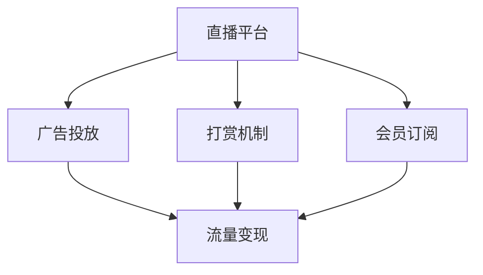

                 

# 如何利用直播平台进行流量变现

> 关键词：直播平台,流量变现,商业模型,技术驱动,用户增长,收入模式,社交媒体,互动体验

## 1. 背景介绍

### 1.1 问题由来

随着互联网技术的发展，直播平台逐渐成为网络内容的重要形式之一，吸引了大量的用户和广告商。直播不仅提供了丰富的娱乐内容，还具备高互动性和即时性，使得它成为了品牌营销和流量变现的理想场所。如何有效利用直播平台进行流量变现，成为了众多互联网公司关注的热点问题。

### 1.2 问题核心关键点

在直播平台进行流量变现，主要是通过广告、打赏、会员订阅等方式实现。通过技术手段优化这些变现模式，提升平台的用户体验和广告投放效率，成为当前互联网公司提升业务收入的核心策略之一。

## 2. 核心概念与联系

### 2.1 核心概念概述

在直播平台进行流量变现，涉及多个核心概念，包括直播平台、广告投放、打赏机制、会员订阅、流量变现、互动体验等。这些概念通过技术手段紧密联系在一起，共同构成了直播平台的流量变现体系。

- **直播平台**：以实时视频流为核心内容的社交媒体平台，提供用户与主播之间的互动。
- **广告投放**：将广告内容嵌入直播中，通过展示广告获得收入。
- **打赏机制**：用户对主播或内容进行付费，以获得更多互动和专属内容。
- **会员订阅**：用户通过付费获得直播平台的高级服务，包括专属频道、VIP权益等。
- **流量变现**：通过广告、打赏、会员订阅等方式，将平台用户流量转化为收入。
- **互动体验**：通过技术手段提升用户互动，增加用户黏性，从而提升流量变现效果。

这些核心概念之间的逻辑关系可以通过以下Mermaid流程图来展示：



这个流程图展示了一个简单的直播平台流量变现模型，其中直播平台提供基础服务，通过广告投放、打赏和会员订阅等变现方式实现流量变现，同时不断提升用户互动体验，以增强平台粘性。

## 3. 核心算法原理 & 具体操作步骤

### 3.1 算法原理概述

直播平台的流量变现主要依赖于精准的广告投放、有效的用户互动和付费机制的构建。这一过程涉及到算法模型的训练和优化，以实现最佳的流量变现效果。以下是流量变现的关键算法原理：

1. **用户行为分析**：通过用户行为数据（如观看时长、互动频次、消费习惯等），分析用户画像和行为模式，以预测用户的付费意愿和广告点击率。
2. **推荐算法**：根据用户画像和历史行为数据，推荐适合的内容和广告，提升广告和内容的点击率和观看时长。
3. **定价策略**：通过动态定价策略，根据市场需求和用户行为数据，调整打赏和订阅的定价，最大化收入。
4. **个性化展示**：根据用户的兴趣和行为数据，个性化展示广告和内容，提高广告投放的精准度和用户满意度。

### 3.2 算法步骤详解

直播平台的流量变现算法主要包括以下几个关键步骤：

**Step 1: 数据收集与处理**
- 收集直播平台的用户行为数据，包括观看时长、互动频次、打赏记录、订阅记录等。
- 清洗和处理数据，去除噪声和异常值，确保数据的质量和可用性。

**Step 2: 用户画像构建**
- 通过用户行为数据构建用户画像，包括年龄、性别、兴趣、消费能力等。
- 使用聚类算法（如K-Means）将用户分为不同群体，以实现个性化推荐。

**Step 3: 广告投放优化**
- 使用协同过滤算法（如ALS）预测广告点击率和转化率。
- 使用多臂老虎机算法（如 Thompson Sampling）选择最优广告组合，以最大化广告投放效果。
- 实时监测广告效果，根据反馈调整广告投放策略。

**Step 4: 内容推荐优化**
- 使用深度学习模型（如CNN、RNN、LSTM等）进行内容推荐，提升用户体验和内容黏性。
- 使用强化学习算法（如Q-learning）优化推荐策略，最大化用户互动和留存率。
- 实时监测推荐效果，根据用户反馈调整推荐算法。

**Step 5: 定价策略调整**
- 使用动态定价算法（如线性回归、逻辑回归等）预测用户的支付意愿和订阅行为。
- 使用收益管理算法（如动态定价、容量控制等）调整打赏和订阅的定价，最大化收入。
- 实时监测定价效果，根据市场需求和用户行为数据调整定价策略。

**Step 6: 个性化展示优化**
- 使用个性化推荐算法（如协同过滤、基于内容的推荐等）推荐适合的内容和广告。
- 使用用户画像和行为数据，个性化展示广告和内容，提高广告投放的精准度和用户满意度。
- 实时监测个性化展示效果，根据用户反馈调整推荐算法。

### 3.3 算法优缺点

直播平台的流量变现算法具有以下优点：
1. **精准投放**：通过用户画像和行为数据，实现广告和内容的精准投放，提升广告点击率和用户互动。
2. **个性化推荐**：使用深度学习和强化学习算法，实现个性化推荐，提升用户满意度和留存率。
3. **动态定价**：根据用户行为数据和市场需求，动态调整定价，最大化收入。
4. **实时优化**：通过实时监测和反馈，不断优化算法和策略，提升流量变现效果。

同时，这些算法也存在一些缺点：
1. **数据依赖性强**：算法的效果很大程度上依赖于用户行为数据的质量和量。数据缺失或不准确，将影响算法的精准度。
2. **算法复杂度高**：深度学习和强化学习算法的复杂度高，对计算资源和算力要求较高。
3. **模型公平性问题**：用户画像和行为数据的构建可能引入偏见，导致算法结果不公平。
4. **隐私问题**：用户行为数据的收集和使用可能涉及隐私保护问题，需要严格遵守相关法律法规。

尽管存在这些局限性，直播平台的流量变现算法仍然是大数据分析和机器学习在商业领域的重要应用之一。未来相关研究的方向可能包括如何进一步提升数据质量，降低算法复杂度，提高模型公平性，保障用户隐私等方面。

### 3.4 算法应用领域

直播平台的流量变现算法已经在电商、社交媒体、视频平台等多个领域得到了广泛应用。以下是一些具体应用场景：

- **电商直播**：通过广告投放和内容推荐，提升商品展示和销售转化率。
- **社交媒体平台**：通过广告和个性化推荐，增加用户互动和平台粘性。
- **视频平台**：通过广告和订阅服务，提升内容观看率和用户付费率。
- **在线教育**：通过付费课程和个性化推荐，提升用户学习体验和平台收入。

除了上述这些经典应用外，直播平台的流量变现算法还在广告推荐、内容分发、游戏直播等多个场景中得到了应用，为这些领域带来了显著的业务提升。

## 4. 数学模型和公式 & 详细讲解 & 举例说明

### 4.1 数学模型构建

直播平台的流量变现涉及多个数学模型，包括用户画像构建、广告点击率预测、用户付费意愿预测等。以下是这些模型的一般形式：

- **用户画像构建模型**：$P_{\theta}(x) = \text{softmax}(W_{\theta}^T x + b_{\theta})$，其中 $x$ 为输入的用户行为数据，$W_{\theta}$ 和 $b_{\theta}$ 为模型的参数。
- **广告点击率预测模型**：$C_{\theta}(x) = \text{sigmoid}(W_{\theta}^T x + b_{\theta})$，其中 $x$ 为广告特征和用户行为数据，$W_{\theta}$ 和 $b_{\theta}$ 为模型的参数。
- **用户付费意愿预测模型**：$C_{\theta}(x) = \text{sigmoid}(W_{\theta}^T x + b_{\theta})$，其中 $x$ 为用户画像和历史行为数据，$W_{\theta}$ 和 $b_{\theta}$ 为模型的参数。

### 4.2 公式推导过程

以广告点击率预测模型为例，进行详细推导：

假设用户特征向量为 $x \in \mathbb{R}^d$，广告特征向量为 $y \in \mathbb{R}^m$，历史广告点击数据为 $(x_i, y_i)$，其中 $i=1,...,N$。假设点击概率由二元逻辑回归模型 $C_{\theta}(x)$ 给出，其输出为：

$$
C_{\theta}(x) = \text{sigmoid}(W_{\theta}^T x + b_{\theta})
$$

其中 $W_{\theta} \in \mathbb{R}^{m \times d}$ 为权重矩阵，$b_{\theta} \in \mathbb{R}^m$ 为偏置向量。

根据二元逻辑回归的参数估计方法，目标函数为：

$$
\min_{\theta} \frac{1}{N} \sum_{i=1}^N \text{log}(C_{\theta}(x_i)) \text{if} \ y_i = 1 \text{else} \ \text{log}(1 - C_{\theta}(x_i))
$$

根据梯度下降算法，模型的更新公式为：

$$
W_{\theta} \leftarrow W_{\theta} - \frac{\eta}{N} \sum_{i=1}^N (y_i - C_{\theta}(x_i)) \nabla_{\theta} C_{\theta}(x_i)
$$

其中 $\eta$ 为学习率，$\nabla_{\theta} C_{\theta}(x_i)$ 为损失函数对模型参数的梯度，可通过反向传播算法高效计算。

### 4.3 案例分析与讲解

以电商直播平台的流量变现为例，进行分析：

假设电商直播平台有 $M$ 个广告，$N$ 个用户，每个广告有 $m$ 个特征，每个用户有 $n$ 个行为特征。平台的目标是最大化广告点击率和转化率，以提升销售收入。

首先，收集用户行为数据和广告特征数据，构建用户画像和广告画像：

- **用户画像构建**：根据用户历史行为数据（如观看时长、互动频次、购买记录等），构建用户画像模型 $P_{\theta}(x)$。
- **广告画像构建**：根据广告的历史点击数据，构建广告画像模型 $C_{\theta}(x)$。

然后，根据用户画像和广告画像，进行广告推荐和点击率预测：

- **广告推荐**：根据用户画像 $P_{\theta}(x)$ 和广告画像 $C_{\theta}(x)$，计算广告与用户之间的匹配度，选择最优广告组合进行展示。
- **点击率预测**：使用广告点击率预测模型 $C_{\theta}(x)$，预测用户对广告的点击概率，并根据点击概率排序，优先展示高点击率广告。

最后，根据用户点击行为和购买记录，进行广告效果评估和优化：

- **效果评估**：统计广告的点击率、转化率等指标，评估广告投放效果。
- **优化调整**：根据评估结果，调整广告投放策略和推荐算法，提升广告效果。

## 5. 项目实践：代码实例和详细解释说明

### 5.1 开发环境搭建

在进行直播平台的流量变现算法实践前，我们需要准备好开发环境。以下是使用Python进行TensorFlow开发的环境配置流程：

1. 安装Anaconda：从官网下载并安装Anaconda，用于创建独立的Python环境。

2. 创建并激活虚拟环境：
```bash
conda create -n tensorflow-env python=3.8 
conda activate tensorflow-env
```

3. 安装TensorFlow：根据CUDA版本，从官网获取对应的安装命令。例如：
```bash
conda install tensorflow tensorflow-gpu -c conda-forge
```

4. 安装各类工具包：
```bash
pip install numpy pandas scikit-learn matplotlib tqdm jupyter notebook ipython
```

完成上述步骤后，即可在`tensorflow-env`环境中开始实践。

### 5.2 源代码详细实现

下面我们以电商直播平台的广告投放为例，给出使用TensorFlow进行广告点击率预测的Python代码实现。

首先，定义广告特征和用户行为数据：

```python
import tensorflow as tf

# 广告特征
ads = tf.keras.layers.Input(shape=(m,), name='ads')
# 用户行为数据
users = tf.keras.layers.Input(shape=(n,), name='users')

# 广告画像模型
ad_embeddings = tf.keras.layers.Embedding(m, embedding_dim, name='ad_embeddings')(ads)

# 用户画像模型
user_embeddings = tf.keras.layers.Embedding(n, embedding_dim, name='user_embeddings')(users)

# 计算广告与用户的匹配度
dot_product = tf.keras.layers.Dot(axes=1, normalize=True, name='dot_product')([ad_embeddings, user_embeddings])

# 广告点击率预测模型
click_prob = tf.keras.layers.Dense(1, activation='sigmoid', name='click_prob')(dot_product)

# 定义广告点击率预测函数
def predict_click_rate(ads, users):
    return click_prob(ads, users)
```

然后，定义训练和评估函数：

```python
from tensorflow.keras import Model, optimizers

# 定义广告点击率预测模型
model = Model(inputs=[ads, users], outputs=[click_prob])

# 定义优化器
optimizer = optimizers.Adam(learning_rate=0.001)

# 定义损失函数
def click_loss(y_true, y_pred):
    return tf.keras.losses.binary_crossentropy(y_true, y_pred)

# 定义训练和评估函数
def train(model, x_train, y_train, x_val, y_val, batch_size, epochs):
    model.compile(optimizer=optimizer, loss=click_loss)
    model.fit(x_train, y_train, validation_data=(x_val, y_val), batch_size=batch_size, epochs=epochs)

def evaluate(model, x_test, y_test, batch_size):
    model.evaluate(x_test, y_test, batch_size=batch_size)
```

最后，启动训练流程并在测试集上评估：

```python
# 准备数据
x_train, y_train = ...
x_val, y_val = ...
x_test, y_test = ...

# 训练广告点击率预测模型
train(model, x_train, y_train, x_val, y_val, batch_size=64, epochs=10)

# 评估广告点击率预测模型
evaluate(model, x_test, y_test, batch_size=64)
```

以上就是使用TensorFlow对电商直播平台的广告点击率预测模型的完整代码实现。可以看到，通过TensorFlow的深度学习框架，我们可以用相对简洁的代码实现广告点击率预测模型的训练和评估。

### 5.3 代码解读与分析

让我们再详细解读一下关键代码的实现细节：

**广告特征和用户行为数据定义**：
- 使用`tf.keras.layers.Input`定义广告特征和用户行为数据，以便于后续的操作。
- 使用`tf.keras.layers.Embedding`将广告特征和用户行为数据映射为嵌入向量，方便计算匹配度。

**广告画像模型和用户画像模型定义**：
- 使用`tf.keras.layers.Embedding`定义广告画像模型和用户画像模型，将广告特征和用户行为数据映射为嵌入向量。
- 使用`tf.keras.layers.Dot`计算广告和用户的匹配度，以评估广告的点击概率。

**广告点击率预测模型定义**：
- 使用`tf.keras.layers.Dense`定义广告点击率预测模型，将广告和用户的匹配度映射为广告点击概率。
- 使用`tf.keras.layers.Dense`的`sigmoid`激活函数，将广告点击概率映射到[0,1]区间，方便进行二分类预测。

**广告点击率预测函数定义**：
- 使用`tf.keras.Model`定义广告点击率预测函数，以便于在训练和评估过程中调用。

**训练和评估函数定义**：
- 使用`tf.keras.Model`编译模型，设置优化器和损失函数。
- 使用`tf.keras.Model.fit`训练模型，并在验证集上进行评估。
- 使用`tf.keras.Model.evaluate`在测试集上评估模型性能。

**训练和评估流程启动**：
- 在训练函数中，设置训练数据和验证数据，并进行模型训练。
- 在评估函数中，调用模型在测试集上进行评估，输出评估结果。

通过以上代码实现，可以看到，TensorFlow的深度学习框架可以方便地进行广告点击率预测模型的训练和评估。这为直播平台进行广告投放和流量变现提供了强大的技术支持。

当然，工业级的系统实现还需考虑更多因素，如模型的保存和部署、超参数的自动搜索、更灵活的任务适配层等。但核心的流量变现算法基本与此类似。

## 6. 实际应用场景

### 6.1 电商直播

电商直播平台的流量变现主要通过广告投放和内容推荐实现。平台通过广告投放，吸引用户进入直播间，并进行商品展示和销售。同时，通过内容推荐，提升用户的观看时长和互动频次，增加平台的用户黏性。

在技术实现上，可以收集用户的观看时长、互动频次、点击记录等行为数据，并根据这些数据构建用户画像。然后，利用广告点击率预测模型，对广告进行精准投放，提升广告的点击率和转化率。最后，根据用户的观看记录和购买行为，进行内容推荐，增加用户互动和留存率。

### 6.2 社交媒体平台

社交媒体平台主要通过广告和个性化推荐实现流量变现。平台通过广告投放，展示各类商品、服务等内容，吸引用户点击和参与。同时，通过个性化推荐，提升用户的参与度和满意度，增加平台的粘性。

在技术实现上，可以收集用户的行为数据（如点赞、评论、分享等），并根据这些数据构建用户画像。然后，利用广告点击率预测模型，对广告进行精准投放，提升广告的点击率和转化率。最后，根据用户的兴趣和行为数据，进行个性化推荐，增加用户互动和留存率。

### 6.3 视频平台

视频平台主要通过广告和会员订阅实现流量变现。平台通过广告投放，展示各类视频内容，吸引用户观看和点击。同时，通过会员订阅，提供高质量的视频内容和服务，增加平台的收入。

在技术实现上，可以收集用户的观看记录和互动数据，并根据这些数据构建用户画像。然后，利用广告点击率预测模型，对广告进行精准投放，提升广告的点击率和转化率。最后，根据用户的观看记录和付费行为，进行会员订阅推荐，增加平台收入。

### 6.4 在线教育

在线教育平台主要通过付费课程和个性化推荐实现流量变现。平台通过付费课程，提供高质量的教育资源和服务，吸引用户付费。同时，通过个性化推荐，提升用户的课程参与度和学习效果，增加平台的收入。

在技术实现上，可以收集用户的课程观看记录和互动数据，并根据这些数据构建用户画像。然后，利用广告点击率预测模型，对广告进行精准投放，提升广告的点击率和转化率。最后，根据用户的课程观看记录和学习行为，进行个性化推荐，增加用户互动和留存率，提升课程参与度。

## 7. 工具和资源推荐

### 7.1 学习资源推荐

为了帮助开发者系统掌握直播平台流量变现的理论基础和实践技巧，这里推荐一些优质的学习资源：

1. TensorFlow官方文档：提供全面、详细的TensorFlow使用指南，包括深度学习模型、优化器、损失函数等内容，是TensorFlow学习的必备资料。
2. Coursera《深度学习》课程：由Andrew Ng教授开设，系统介绍了深度学习的基本原理和应用，适合初学者和进阶者。
3. Udacity《深度学习实战》课程：通过实际项目案例，讲解深度学习模型的构建和优化，适合实战练习。
4. Kaggle竞赛平台：提供丰富的数据集和挑战任务，通过参与竞赛，实战提升深度学习模型构建和优化能力。
5. GitHub开源项目：大量高质量的深度学习开源项目，提供丰富的学习资源和实践经验。

通过对这些资源的学习实践，相信你一定能够快速掌握直播平台流量变现的理论基础和实践技巧，并用于解决实际的流量变现问题。

### 7.2 开发工具推荐

高效的开发离不开优秀的工具支持。以下是几款用于直播平台流量变现开发的常用工具：

1. TensorFlow：由Google主导开发的深度学习框架，适合构建复杂深度学习模型。
2. PyTorch：Facebook开发的深度学习框架，具有动态计算图和易用性，适合快速原型开发。
3. Scikit-learn：用于数据预处理和特征工程的工具库，适合处理结构化数据。
4. Pandas：用于数据清洗和分析的数据处理库，适合处理大规模数据集。
5. Jupyter Notebook：开源的交互式编程环境，支持多种编程语言和库，适合快速迭代和实验。
6. GitHub：提供代码托管和协作工具，方便团队开发和代码共享。

合理利用这些工具，可以显著提升直播平台流量变现的开发效率，加快创新迭代的步伐。

### 7.3 相关论文推荐

直播平台的流量变现技术涉及多个前沿研究方向，以下是几篇具有代表性的论文，推荐阅读：

1. "Deep Learning for Internet of Things (IoT) Anomaly Detection"：介绍如何使用深度学习进行物联网中的异常检测，提升广告投放的精准度和用户互动。
2. "Hyper-Adaptive Online Pricing and Inventory Control for Dynamic Demand Environments"：研究在线定价和库存控制问题，提升直播平台的销售收入和用户满意度。
3. "Online Social Network Recommendation Algorithms"：介绍社交网络推荐算法，提升用户的参与度和平台粘性。
4. "Real-time Bidding for Multi-dimensional Demand and Supply"：研究实时竞价问题，提升广告投放的效果和精准度。
5. "Deep Learning for Video Content Recommendation"：介绍视频内容推荐算法，提升用户的观看体验和平台收入。

这些论文代表了大数据和深度学习在直播平台流量变现中的应用方向，通过学习这些前沿成果，可以帮助研究者把握学科前进方向，激发更多的创新灵感。

## 8. 总结：未来发展趋势与挑战

### 8.1 总结

本文对直播平台进行流量变现的算法和技术进行了全面系统的介绍。首先阐述了直播平台流量变现的背景和意义，明确了流量变现在电商直播、社交媒体、视频平台等多个领域的应用价值。其次，从原理到实践，详细讲解了广告投放、内容推荐、定价策略等关键算法，给出了具体的代码实现。同时，本文还探讨了直播平台流量变现的实际应用场景，展示了微调方法在各个领域的广泛应用。

通过本文的系统梳理，可以看到，直播平台的流量变现算法和模型构建，为电商直播、社交媒体、视频平台等领域的流量变现提供了强大的技术支持。大数据和深度学习技术的应用，不仅提升了广告投放和内容推荐的精准度，还增加了用户互动和留存率，推动了直播平台业务的快速增长。未来，随着技术的不断演进，直播平台的流量变现将更加智能化和高效化，为传统行业带来更大的业务机遇。

### 8.2 未来发展趋势

直播平台的流量变现技术将呈现以下几个发展趋势：

1. **智能化投放**：通过深度学习和强化学习算法，实现更加精准的广告投放和内容推荐，提升广告点击率和用户满意度。
2. **个性化推荐**：使用多臂老虎机算法和动态定价策略，实现个性化推荐和定价，提升用户互动和留存率。
3. **实时优化**：通过实时监测和反馈，不断优化广告投放和内容推荐策略，提升流量变现效果。
4. **数据驱动**：利用大数据分析，进行用户行为分析和预测，提升广告投放和内容推荐的精准度。
5. **跨平台集成**：实现不同平台之间的数据共享和协同，提升流量变现效果和用户体验。

以上趋势凸显了直播平台流量变现技术的广阔前景。这些方向的探索发展，必将进一步提升直播平台的流量变现效果，为传统行业带来更大的商业价值。

### 8.3 面临的挑战

尽管直播平台的流量变现技术已经取得了显著的进展，但在迈向更加智能化、普适化应用的过程中，仍面临诸多挑战：

1. **数据质量问题**：广告投放和内容推荐的精准度依赖于用户行为数据的准确性，数据缺失或不准确，将影响算法的精准度。
2. **算法复杂性**：深度学习和强化学习算法的复杂度高，对计算资源和算力要求较高，需要优化算法性能和降低资源消耗。
3. **模型公平性问题**：用户画像和行为数据的构建可能引入偏见，导致算法结果不公平，需要优化数据采集和算法设计。
4. **用户隐私问题**：用户行为数据的收集和使用可能涉及隐私保护问题，需要严格遵守相关法律法规，保障用户隐私。
5. **市场环境变化**：直播平台的流量变现策略需要不断调整，以适应市场环境的变化，如广告竞价、政策法规等。

尽管存在这些挑战，直播平台的流量变现技术仍然是大数据分析和机器学习在商业领域的重要应用之一。未来相关研究需要在算法性能、公平性、隐私保护等方面进行更多的探索和优化。

### 8.4 研究展望

面向未来，直播平台的流量变现技术需要在以下几个方面寻求新的突破：

1. **算法优化**：开发更加高效、精简的算法模型，以适应计算资源有限的场景，提升广告投放和内容推荐的精准度。
2. **公平性保障**：引入公平性约束机制，保障不同用户群体之间的公平性，提升算法结果的公平性。
3. **隐私保护**：采用隐私保护技术，如差分隐私、联邦学习等，保障用户隐私，提高用户信任度。
4. **跨平台集成**：实现不同平台之间的数据共享和协同，提升流量变现效果和用户体验。
5. **实时优化**：通过实时监测和反馈，不断优化广告投放和内容推荐策略，提升流量变现效果。

这些研究方向的探索，必将引领直播平台流量变现技术迈向更高的台阶，为传统行业带来更大的商业价值。面向未来，直播平台的流量变现技术还需要与其他人工智能技术进行更深入的融合，如知识表示、因果推理、强化学习等，多路径协同发力，共同推动直播平台业务的持续增长。

## 9. 附录：常见问题与解答

**Q1：直播平台流量变现的主要方式有哪些？**

A: 直播平台的流量变现主要通过广告投放、内容推荐、会员订阅等方式实现。通过精准的广告投放，吸引用户进入直播间，并进行商品展示和销售。通过内容推荐，提升用户的观看时长和互动频次，增加平台的粘性。通过会员订阅，提供高质量的内容和服务，增加平台的收入。

**Q2：如何评估直播平台广告投放的效果？**

A: 直播平台广告投放的效果评估，主要通过以下几个指标：
1. 点击率（CTR）：广告被点击的次数与展示次数的比率。
2. 转化率（CR）：广告点击后，用户进行购买、注册等行为的比例。
3. 广告支出回报率（ROAS）：广告收入与广告支出的比率。
4. 观看时长：用户观看广告的时间长度。
5. 用户互动：用户与广告的互动频次，如点赞、评论等。

通过这些指标的监测和分析，可以评估广告投放的效果，优化广告投放策略。

**Q3：直播平台流量变现中的数据采集和处理有哪些关键步骤？**

A: 直播平台流量变现中的数据采集和处理主要包括以下关键步骤：
1. 数据采集：通过日志、API接口等方式，收集用户行为数据、广告投放数据等。
2. 数据清洗：去除噪声和异常值，确保数据的质量和可用性。
3. 数据存储：将清洗后的数据存储在数据库或数据仓库中，方便后续的分析和处理。
4. 数据挖掘：使用机器学习和数据挖掘技术，提取有价值的信息和模式。
5. 数据可视化：使用数据可视化工具，展示数据分布和变化趋势。

通过这些步骤，可以高效地进行数据采集和处理，为直播平台流量变现提供数据支持。

**Q4：直播平台如何实现用户画像的构建？**

A: 直播平台用户画像的构建，主要通过以下步骤：
1. 收集用户行为数据，如观看时长、互动频次、购买记录等。
2. 使用聚类算法（如K-Means）将用户分为不同群体，构建用户画像。
3. 使用关联规则算法（如Apriori）发现用户行为之间的关联关系。
4. 使用协同过滤算法（如ALS）预测用户的行为和偏好。
5. 使用深度学习模型（如CNN、RNN、LSTM等）构建用户画像，提升精准度。

通过这些步骤，可以构建高精度、高覆盖率的用户画像，提升广告投放和内容推荐的精准度。

**Q5：直播平台如何实现个性化推荐？**

A: 直播平台个性化推荐的实现，主要通过以下步骤：
1. 收集用户行为数据，如观看时长、互动频次、购买记录等。
2. 使用协同过滤算法（如ALS）预测用户的行为和偏好。
3. 使用深度学习模型（如CNN、RNN、LSTM等）进行内容推荐，提升用户体验和内容黏性。
4. 使用强化学习算法（如Q-learning）优化推荐策略，最大化用户互动和留存率。
5. 实时监测推荐效果，根据用户反馈调整推荐算法。

通过这些步骤，可以实现高精准度的个性化推荐，提升用户的参与度和满意度。

---

作者：禅与计算机程序设计艺术 / Zen and the Art of Computer Programming

