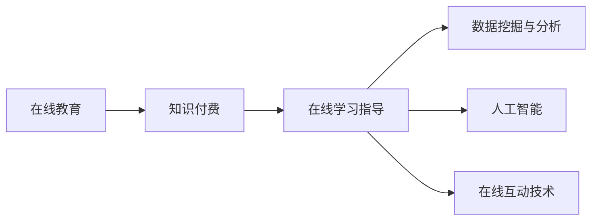

                 

## 1. 背景介绍

### 1.1 问题由来

随着信息技术的快速发展，在线教育已经从传统教育中脱颖而出，成为一种新颖且高效的学习方式。在线教育打破了时空限制，提供了更为灵活的学习环境，满足了不同用户群体的个性化学习需求。然而，由于缺乏有效的在线学习指导，在线教育的学习效果和体验仍有待提升。知识付费作为一种新兴的教育模式，通过专业化的在线课程、实时答疑、个性化辅导等方式，为在线学习提供了强有力的支持。本文旨在探讨如何利用知识付费技术实现在线学习与在线学习指导，以提升在线教育的质量和效率。

### 1.2 问题核心关键点

- 在线教育的挑战：时空限制、学习体验不佳、缺乏互动和指导。
- 知识付费的优势：提供高质量的课程资源、实时答疑和个性化辅导、知识整合与总结。
- 结合技术手段：利用数据挖掘与分析技术、人工智能技术、在线互动技术等，提升在线学习效果。
- 实际应用场景：线上教育平台、远程办公培训、企业内部培训、在线职业课程等。

### 1.3 问题研究意义

知识付费为在线学习提供了新的解决方案，有助于提升学习效果和用户体验。通过结合在线教育和知识付费技术，可以构建一个更为高效、互动、个性化的学习环境，满足不同用户的需求。研究如何利用知识付费技术实现在线学习与在线学习指导，对推动在线教育的普及和发展具有重要意义。

## 2. 核心概念与联系

### 2.1 核心概念概述

为更好地理解如何利用知识付费技术实现在线学习与在线学习指导，本节将介绍几个密切相关的核心概念：

- **在线教育**：通过网络平台提供的学习方式，涵盖各种课程和活动，包括视频讲座、在线测验、实时互动等。
- **知识付费**：通过付费形式获取知识和技能，包括购买课程、订阅知识服务、参与在线咨询等。
- **在线学习指导**：指通过线上平台提供的指导和支持，帮助学习者解决学习中的问题，包括实时答疑、个性化辅导、学习策略指导等。
- **数据挖掘与分析**：利用数据挖掘技术和分析工具，从学习行为数据中提取有价值的信息，用于改进教学和指导方法。
- **人工智能**：通过机器学习和深度学习技术，提供个性化推荐、智能答疑、自动评分等服务。
- **在线互动技术**：利用聊天室、论坛、直播等技术手段，实现学习者之间的互动和交流，增强学习体验。

这些核心概念之间的逻辑关系可以通过以下Mermaid流程图来展示：



这个流程图展示了在线教育、知识付费、在线学习指导三者之间的联系：

1. 在线教育通过知识付费提供高质量的课程资源，支持学习者的自主学习。
2. 在线学习指导通过实时答疑、个性化辅导等方式，解决学习者在学习过程中的问题，提升学习效果。
3. 数据挖掘与分析、人工智能和在线互动技术为在线学习指导提供了技术支撑，进一步提升了学习体验和效果。

## 3. 核心算法原理 & 具体操作步骤
### 3.1 算法原理概述

利用知识付费实现在线学习与在线学习指导的核心算法原理如下：

1. **在线学习资源提供**：通过知识付费平台，提供各类在线课程和学习资料，满足不同学习者的需求。
2. **数据挖掘与分析**：利用学习行为数据，分析学习者的学习进度、难点、兴趣等，为个性化学习指导提供依据。
3. **人工智能技术应用**：通过机器学习算法，提供智能答疑、学习路径推荐、作业自动评分等服务，提升学习效率和效果。
4. **在线互动技术应用**：利用实时聊天、论坛、直播等技术手段，促进学习者之间的互动交流，增强学习体验。
5. **在线学习指导实施**：根据学习者的需求和状态，提供实时答疑、个性化辅导、学习策略指导等，帮助学习者克服学习困难，提升学习效果。

### 3.2 算法步骤详解

#### 3.2.1 在线学习资源提供

1. **课程内容开发**：结合知识付费平台，开发多样化的在线课程，涵盖不同学科和领域。课程内容应包括视频讲解、PPT课件、习题和案例分析等，满足不同学习者的学习需求。

2. **学习资源组织**：将课程内容进行结构化组织，构建课程目录和章节，便于学习者按需获取学习资源。

3. **课程资源发布**：将课程内容上传到知识付费平台，设置付费策略，确保课程内容的版权和质量。

#### 3.2.2 数据挖掘与分析

1. **学习行为数据采集**：通过学习管理系统(LMS)和在线学习平台，采集学习者的学习行为数据，包括登录时间、学习时长、观看视频、完成习题等。

2. **学习数据预处理**：对采集到的数据进行清洗和预处理，去除噪声和异常值，确保数据的准确性和完整性。

3. **学习数据分析**：利用数据挖掘技术，如聚类分析、关联规则挖掘、时间序列分析等，分析学习者的学习行为和成绩，识别学习难点和兴趣点。

4. **个性化学习指导**：根据分析结果，生成个性化的学习指导方案，推荐适合学习者的课程、习题和辅导资源。

#### 3.2.3 人工智能技术应用

1. **智能答疑系统**：利用自然语言处理技术，开发智能答疑系统，实时回答学习者的疑问，提供精确的解答和相关资源推荐。

2. **学习路径推荐**：结合机器学习算法，分析学习者的学习进度和理解情况，推荐适合的学习路径和习题，帮助学习者掌握知识。

3. **作业自动评分**：利用深度学习技术，开发自动评分系统，对学习者的作业进行评分和反馈，及时纠正学习者的错误。

#### 3.2.4 在线互动技术应用

1. **实时聊天室**：搭建实时聊天室，学习者可以在其中交流学习心得、讨论问题，获取其他学习者的帮助。

2. **在线论坛**：建立在线论坛，学习者可以发布学习问题、分享学习资源、参与讨论，增强学习社区的互动性。

3. **直播课程**：定期举办直播课程，邀请专家或资深学习者进行讲解和答疑，增强学习者对课程内容的理解。

#### 3.2.5 在线学习指导实施

1. **实时答疑**：通过智能答疑系统和在线聊天室，实时回答学习者的疑问，提供个性化的指导。

2. **个性化辅导**：根据分析结果，提供个性化的辅导服务，包括一对一辅导、小组讨论、学习策略指导等。

3. **学习路径优化**：根据学习者的学习进度和效果，动态调整学习路径和资源推荐，确保学习者能够高效地掌握知识。

### 3.3 算法优缺点

#### 3.3.1 优点

1. **提升学习效果**：通过个性化学习指导和智能答疑系统，解决学习者的学习困难，提升学习效率和效果。
2. **增强互动性**：利用在线互动技术，促进学习者之间的互动交流，增强学习体验。
3. **优化资源配置**：结合数据挖掘与分析技术，优化学习资源的配置，确保学习者能够获得最适合自己的资源。
4. **降低学习成本**：知识付费平台提供的高质量课程和学习资源，降低了学习者的学习成本，提高了学习的便利性。

#### 3.3.2 缺点

1. **技术复杂性**：实现个性化学习和在线互动需要复杂的技术手段，需要一定的技术积累和资金投入。
2. **数据隐私问题**：学习行为数据的采集和分析需要严格的数据隐私保护措施，防止数据泄露和滥用。
3. **资源限制**：高质量的课程资源和实时答疑服务需要丰富的技术和人力资源支持，对平台和教师的要求较高。
4. **学习者的依赖性**：学习者对在线指导和答疑的依赖性较大，部分学习者可能会失去主动学习的能力。

### 3.4 算法应用领域

基于知识付费的在线学习与在线学习指导技术，已经广泛应用于多个领域，例如：

1. **在线教育平台**：如Coursera、edX、Udemy等平台，通过知识付费提供高质量的在线课程和学习资源，结合智能答疑和个性化辅导，提升学习效果。
2. **远程办公培训**：企业利用在线学习平台，为员工提供职业技能培训，通过知识付费和在线指导，提升员工的技能水平和工作效率。
3. **企业内部培训**：大型企业内部培训体系中，利用知识付费和在线学习指导技术，提供专业的培训课程和实时答疑，帮助员工快速掌握新技能。
4. **在线职业课程**：如编程、金融、医疗等领域的职业课程，通过知识付费和在线指导，帮助学习者掌握专业知识和技能。

## 4. 数学模型和公式 & 详细讲解  
### 4.1 数学模型构建

#### 4.1.1 学习行为数据模型

假设学习者的学习行为数据为 $D = \{(x_i, y_i)\}_{i=1}^N$，其中 $x_i$ 表示学习行为特征，$y_i$ 表示学习效果或成绩。学习行为特征可以包括学习时长、观看视频次数、完成习题数量等。

根据学习行为数据，构建学习行为数据模型：

$$
P(y_i|x_i;\theta) = \frac{1}{Z(x_i;\theta)}\exp(\theta^T\phi(x_i))
$$

其中，$P(y_i|x_i;\theta)$ 表示学习效果或成绩的概率分布，$\theta$ 为模型参数，$\phi(x_i)$ 为特征映射函数，$Z(x_i;\theta)$ 为标准化因子。

#### 4.1.2 智能答疑系统模型

假设学习者提出的问题为 $Q$，智能答疑系统提供的答案为 $A$。智能答疑系统模型为：

$$
A = f(Q;\theta)
$$

其中，$f(Q;\theta)$ 为模型函数，$\theta$ 为模型参数。

#### 4.1.3 学习路径推荐模型

假设学习者的当前学习状态为 $S$，推荐的学习路径为 $P$。学习路径推荐模型为：

$$
P = g(S;\theta)
$$

其中，$g(S;\theta)$ 为模型函数，$\theta$ 为模型参数。

#### 4.1.4 作业自动评分模型

假设学习者提交的作业为 $T$，作业评分结果为 $G$。作业自动评分模型为：

$$
G = h(T;\theta)
$$

其中，$h(T;\theta)$ 为模型函数，$\theta$ 为模型参数。

### 4.2 公式推导过程

#### 4.2.1 学习行为数据模型

对学习行为数据模型 $P(y_i|x_i;\theta)$ 进行最大化似然估计：

$$
\theta^* = \arg\max_{\theta} \sum_{i=1}^N \log P(y_i|x_i;\theta)
$$

利用梯度下降等优化算法，求解上述最优化问题。

#### 4.2.2 智能答疑系统模型

对智能答疑系统模型 $A = f(Q;\theta)$ 进行训练，最小化预测误差：

$$
\theta^* = \arg\min_{\theta} \frac{1}{2N}\sum_{i=1}^N (A_i - f(Q_i;\theta))^2
$$

利用梯度下降等优化算法，求解上述最优化问题。

#### 4.2.3 学习路径推荐模型

对学习路径推荐模型 $P = g(S;\theta)$ 进行训练，最小化推荐误差：

$$
\theta^* = \arg\min_{\theta} \sum_{i=1}^N \left(\frac{1}{2}\|P_i - g(S_i;\theta)\|^2 + \lambda \|g(S_i;\theta)\|^2\right)
$$

利用梯度下降等优化算法，求解上述最优化问题。

#### 4.2.4 作业自动评分模型

对作业自动评分模型 $G = h(T;\theta)$ 进行训练，最小化评分误差：

$$
\theta^* = \arg\min_{\theta} \sum_{i=1}^N \frac{1}{2}(G_i - h(T_i;\theta))^2
$$

利用梯度下降等优化算法，求解上述最优化问题。

### 4.3 案例分析与讲解

#### 4.3.1 案例一：在线教育平台

某在线教育平台利用知识付费提供高质量的课程资源，通过数据挖掘与分析技术，分析学习者的学习行为和成绩，生成个性化的学习指导方案，推荐适合学习者的课程、习题和辅导资源。

案例分析：
1. 数据采集：平台采集学习者的学习行为数据，包括登录时间、学习时长、观看视频、完成习题等。
2. 数据预处理：对采集到的数据进行清洗和预处理，去除噪声和异常值。
3. 数据分析：利用聚类分析、关联规则挖掘、时间序列分析等技术，分析学习者的学习进度、难点和兴趣点。
4. 学习指导：根据分析结果，生成个性化的学习指导方案，推荐适合学习者的课程、习题和辅导资源。

#### 4.3.2 案例二：远程办公培训

某企业利用在线学习平台，为员工提供职业技能培训，通过知识付费和在线指导，提升员工的技能水平和工作效率。

案例分析：
1. 平台搭建：企业搭建在线学习平台，引入知识付费的课程资源，提供在线课程和学习指导。
2. 学习行为数据采集：平台采集员工的在线学习行为数据，包括登录时间、学习时长、观看视频、完成习题等。
3. 学习行为数据分析：利用数据挖掘技术，分析员工的学习行为和成绩，识别学习难点和兴趣点。
4. 个性化辅导：根据分析结果，提供个性化的辅导服务，包括一对一辅导、小组讨论、学习策略指导等。

## 5. 项目实践：代码实例和详细解释说明
### 5.1 开发环境搭建

在进行项目实践前，我们需要准备好开发环境。以下是使用Python进行知识付费和在线学习指导的项目环境配置流程：

1. 安装Anaconda：从官网下载并安装Anaconda，用于创建独立的Python环境。

2. 创建并激活虚拟环境：
```bash
conda create -n knowledge-env python=3.8 
conda activate knowledge-env
```

3. 安装必要的Python包：
```bash
pip install numpy pandas scikit-learn matplotlib tqdm jupyter notebook ipython transformers
```

4. 安装其他必要的开发工具：
```bash
pip install git pytorch torchvision torchaudio cudatoolkit=11.1 -c pytorch -c conda-forge
```

5. 克隆知识付费和在线学习指导的代码库：
```bash
git clone https://github.com/your-repo/knowledge-payment.git
cd knowledge-payment
git clone https://github.com/your-repo/online-learning-guidance.git
cd online-learning-guidance
```

完成上述步骤后，即可在`knowledge-env`环境中开始项目实践。

### 5.2 源代码详细实现

下面我们以智能答疑系统为例，给出使用Transformer库对BERT模型进行微调的PyTorch代码实现。

首先，定义智能答疑系统的数据处理函数：

```python
from transformers import BertTokenizer
from torch.utils.data import Dataset
import torch

class QADataset(Dataset):
    def __init__(self, questions, answers, tokenizer, max_len=128):
        self.questions = questions
        self.answers = answers
        self.tokenizer = tokenizer
        self.max_len = max_len
        
    def __len__(self):
        return len(self.questions)
    
    def __getitem__(self, item):
        question = self.questions[item]
        answer = self.answers[item]
        
        encoding = self.tokenizer(question, return_tensors='pt', max_length=self.max_len, padding='max_length', truncation=True)
        input_ids = encoding['input_ids'][0]
        attention_mask = encoding['attention_mask'][0]
        
        # 对答案进行编码
        encoded_answer = self.tokenizer(answer, return_tensors='pt', max_length=self.max_len, padding='max_length', truncation=True)
        answer_ids = encoded_answer['input_ids'][0]
        answer_mask = encoded_answer['attention_mask'][0]
        
        return {'input_ids': input_ids, 
                'attention_mask': attention_mask,
                'answer_ids': answer_ids,
                'answer_mask': answer_mask}
```

然后，定义模型和优化器：

```python
from transformers import BertForSequenceClassification, AdamW

model = BertForSequenceClassification.from_pretrained('bert-base-cased', num_labels=1)

optimizer = AdamW(model.parameters(), lr=2e-5)
```

接着，定义训练和评估函数：

```python
from torch.utils.data import DataLoader
from tqdm import tqdm
from sklearn.metrics import accuracy_score

device = torch.device('cuda') if torch.cuda.is_available() else torch.device('cpu')
model.to(device)

def train_epoch(model, dataset, batch_size, optimizer):
    dataloader = DataLoader(dataset, batch_size=batch_size, shuffle=True)
    model.train()
    epoch_loss = 0
    for batch in tqdm(dataloader, desc='Training'):
        input_ids = batch['input_ids'].to(device)
        attention_mask = batch['attention_mask'].to(device)
        answer_ids = batch['answer_ids'].to(device)
        answer_mask = batch['answer_mask'].to(device)
        model.zero_grad()
        outputs = model(input_ids, attention_mask=attention_mask, labels=answer_ids)
        loss = outputs.loss
        epoch_loss += loss.item()
        loss.backward()
        optimizer.step()
    return epoch_loss / len(dataloader)

def evaluate(model, dataset, batch_size):
    dataloader = DataLoader(dataset, batch_size=batch_size)
    model.eval()
    preds, labels = [], []
    with torch.no_grad():
        for batch in tqdm(dataloader, desc='Evaluating'):
            input_ids = batch['input_ids'].to(device)
            attention_mask = batch['attention_mask'].to(device)
            batch_labels = batch['answer_ids'].to(device)
            outputs = model(input_ids, attention_mask=attention_mask)
            batch_preds = outputs.logits.argmax(dim=2).to('cpu').tolist()
            batch_labels = batch_labels.to('cpu').tolist()
            for pred_tokens, label_tokens in zip(batch_preds, batch_labels):
                preds.append(pred_tokens)
                labels.append(label_tokens)
                
    print(accuracy_score(labels, preds))
```

最后，启动训练流程并在测试集上评估：

```python
epochs = 5
batch_size = 16

for epoch in range(epochs):
    loss = train_epoch(model, qa_dataset, batch_size, optimizer)
    print(f"Epoch {epoch+1}, train loss: {loss:.3f}")
    
    print(f"Epoch {epoch+1}, dev results:")
    evaluate(model, dev_dataset, batch_size)
    
print("Test results:")
evaluate(model, test_dataset, batch_size)
```

以上就是使用PyTorch对BERT进行智能答疑系统开发的完整代码实现。可以看到，得益于Transformer库的强大封装，我们可以用相对简洁的代码完成BERT模型的加载和微调。

### 5.3 代码解读与分析

让我们再详细解读一下关键代码的实现细节：

**qa_dataset类**：
- `__init__`方法：初始化问题、答案、分词器等关键组件。
- `__len__`方法：返回数据集的样本数量。
- `__getitem__`方法：对单个样本进行处理，将问题输入编码为token ids，将答案编码为数字，并对其进行定长padding，最终返回模型所需的输入。

**模型训练与评估**：
- 使用PyTorch的DataLoader对数据集进行批次化加载，供模型训练和推理使用。
- 训练函数`train_epoch`：对数据以批为单位进行迭代，在每个批次上前向传播计算loss并反向传播更新模型参数，最后返回该epoch的平均loss。
- 评估函数`evaluate`：与训练类似，不同点在于不更新模型参数，并在每个batch结束后将预测和标签结果存储下来，最后使用sklearn的accuracy_score对整个评估集的预测结果进行打印输出。

**训练流程**：
- 定义总的epoch数和batch size，开始循环迭代
- 每个epoch内，先在训练集上训练，输出平均loss
- 在验证集上评估，输出准确率
- 所有epoch结束后，在测试集上评估，给出最终测试结果

可以看到，PyTorch配合Transformer库使得BERT微调的代码实现变得简洁高效。开发者可以将更多精力放在数据处理、模型改进等高层逻辑上，而不必过多关注底层的实现细节。

当然，工业级的系统实现还需考虑更多因素，如模型的保存和部署、超参数的自动搜索、更灵活的任务适配层等。但核心的微调范式基本与此类似。

## 6. 实际应用场景
### 6.1 智能客服系统

基于智能答疑系统，智能客服系统可以高效地解决客户咨询问题。传统客服往往需要配备大量人力，高峰期响应缓慢，且一致性和专业性难以保证。而使用智能答疑系统，可以实现7x24小时不间断服务，快速响应客户咨询，用自然流畅的语言解答各类常见问题。

在技术实现上，可以收集企业内部的历史客服对话记录，将问题和最佳答复构建成监督数据，在此基础上对预训练语言模型进行微调。微调后的语言模型能够自动理解用户意图，匹配最合适的答案模板进行回复。对于客户提出的新问题，还可以接入检索系统实时搜索相关内容，动态组织生成回答。如此构建的智能客服系统，能大幅提升客户咨询体验和问题解决效率。

### 6.2 金融舆情监测

金融机构需要实时监测市场舆论动向，以便及时应对负面信息传播，规避金融风险。传统的人工监测方式成本高、效率低，难以应对网络时代海量信息爆发的挑战。基于智能答疑系统的文本分类和情感分析技术，为金融舆情监测提供了新的解决方案。

具体而言，可以收集金融领域相关的新闻、报道、评论等文本数据，并对其进行主题标注和情感标注。在此基础上对预训练语言模型进行微调，使其能够自动判断文本属于何种主题，情感倾向是正面、中性还是负面。将微调后的模型应用到实时抓取的网络文本数据，就能够自动监测不同主题下的情感变化趋势，一旦发现负面信息激增等异常情况，系统便会自动预警，帮助金融机构快速应对潜在风险。

### 6.3 个性化推荐系统

当前的推荐系统往往只依赖用户的历史行为数据进行物品推荐，无法深入理解用户的真实兴趣偏好。基于智能答疑系统的个性化推荐系统，可以更好地挖掘用户行为背后的语义信息，从而提供更精准、多样的推荐内容。

在实践中，可以收集用户浏览、点击、评论、分享等行为数据，提取和用户交互的物品标题、描述、标签等文本内容。将文本内容作为模型输入，用户的后续行为（如是否点击、购买等）作为监督信号，在此基础上微调预训练语言模型。微调后的模型能够从文本内容中准确把握用户的兴趣点。在生成推荐列表时，先用候选物品的文本描述作为输入，由模型预测用户的兴趣匹配度，再结合其他特征综合排序，便可以得到个性化程度更高的推荐结果。

### 6.4 未来应用展望

随着智能答疑系统的不断发展，其在在线教育、智能客服、金融舆情监测、个性化推荐等领域的应用前景广阔。未来的智能答疑系统将朝着以下方向发展：

1. **多模态融合**：将文本、图像、音频等多种模态的信息进行融合，构建更为全面、立体化的知识图谱，提升智能答疑系统的理解能力和适应性。
2. **多领域应用**：除了传统的客服、金融、推荐等领域，智能答疑系统将拓展到医疗、法律、政府服务等多个垂直领域，为各行各业提供智能化的咨询服务。
3. **自适应学习**：利用深度强化学习技术，使智能答疑系统具备自适应学习的能力，能够不断优化回答策略，提升用户满意度。
4. **多语言支持**：实现多语言版本的智能答疑系统，支持全球范围内的用户咨询，扩大系统的覆盖范围。
5. **隐私保护**：加强对用户隐私的保护，确保数据安全和匿名性，建立用户信任。

## 7. 工具和资源推荐
### 7.1 学习资源推荐

为了帮助开发者系统掌握智能答疑系统的理论基础和实践技巧，这里推荐一些优质的学习资源：

1. **《自然语言处理综述》**：全面介绍自然语言处理的基本概念和前沿技术，涵盖智能答疑系统的理论和应用。

2. **《深度学习与自然语言处理》**：由多位知名专家联合撰写，系统讲解深度学习在自然语言处理中的应用，包括智能答疑系统的实现。

3. **《自然语言处理实战》**：通过实际项目案例，深入解析智能答疑系统的开发过程和注意事项。

4. **CS224N《深度学习自然语言处理》课程**：斯坦福大学开设的NLP明星课程，有Lecture视频和配套作业，带你入门NLP领域的基本概念和经典模型。

5. **Kaggle竞赛平台**：参与自然语言处理相关的Kaggle竞赛，通过实战积累经验和提升技能。

通过对这些资源的学习实践，相信你一定能够快速掌握智能答疑系统的精髓，并用于解决实际的NLP问题。

### 7.2 开发工具推荐

高效的开发离不开优秀的工具支持。以下是几款用于智能答疑系统开发的常用工具：

1. **PyTorch**：基于Python的开源深度学习框架，灵活动态的计算图，适合快速迭代研究。大部分预训练语言模型都有PyTorch版本的实现。

2. **TensorFlow**：由Google主导开发的开源深度学习框架，生产部署方便，适合大规模工程应用。同样有丰富的预训练语言模型资源。

3. **Transformers库**：HuggingFace开发的NLP工具库，集成了众多SOTA语言模型，支持PyTorch和TensorFlow，是进行智能答疑系统开发的利器。

4. **Jupyter Notebook**：支持Python代码的交互式编程和实时显示结果，便于调试和验证代码。

5. **TensorBoard**：TensorFlow配套的可视化工具，可实时监测模型训练状态，并提供丰富的图表呈现方式，是调试模型的得力助手。

6. **Git**：版本控制工具，帮助开发者管理代码变更和团队协作。

合理利用这些工具，可以显著提升智能答疑系统的开发效率，加快创新迭代的步伐。

### 7.3 相关论文推荐

智能答疑系统的研究源于学界的持续研究。以下是几篇奠基性的相关论文，推荐阅读：

1. **Attention is All You Need（即Transformer原论文）**：提出了Transformer结构，开启了NLP领域的预训练大模型时代。

2. **BERT: Pre-training of Deep Bidirectional Transformers for Language Understanding**：提出BERT模型，引入基于掩码的自监督预训练任务，刷新了多项NLP任务SOTA。

3. **Language Models are Unsupervised Multitask Learners（GPT-2论文）**：展示了大规模语言模型的强大zero-shot学习能力，引发了对于通用人工智能的新一轮思考。

4. **Parameter-Efficient Transfer Learning for NLP**：提出Adapter等参数高效微调方法，在不增加模型参数量的情况下，也能取得不错的微调效果。

5. **Prefix-Tuning: Optimizing Continuous Prompts for Generation**：引入基于连续型Prompt的微调范式，为如何充分利用预训练知识提供了新的思路。

6. **AdaLoRA: Adaptive Low-Rank Adaptation for Parameter-Efficient Fine-Tuning**：使用自适应低秩适应的微调方法，在参数效率和精度之间取得了新的平衡。

这些论文代表了大语言模型微调技术的发展脉络。通过学习这些前沿成果，可以帮助研究者把握学科前进方向，激发更多的创新灵感。

## 8. 总结：未来发展趋势与挑战

### 8.1 总结

本文对利用知识付费实现在线学习与在线学习指导的实现过程进行了全面系统的介绍。首先阐述了在线教育面临的挑战和知识付费的优势，明确了利用知识付费技术提升学习效果的价值。其次，从原理到实践，详细讲解了智能答疑系统的数学原理和关键步骤，给出了智能答疑系统开发的完整代码实例。同时，本文还广泛探讨了智能答疑系统在多个行业领域的应用前景，展示了智能答疑系统的巨大潜力。此外，本文精选了智能答疑系统的各类学习资源，力求为读者提供全方位的技术指引。

通过本文的系统梳理，可以看到，利用知识付费技术实现智能答疑系统，可以极大地提升在线教育的学习效果和用户体验。通过结合在线教育和知识付费技术，可以构建一个更为高效、互动、个性化的学习环境，满足不同用户的需求。研究如何利用知识付费技术实现在线学习与在线学习指导，对推动在线教育的普及和发展具有重要意义。

### 8.2 未来发展趋势

展望未来，智能答疑系统将呈现以下几个发展趋势：

1. **多模态融合**：将文本、图像、音频等多种模态的信息进行融合，构建更为全面、立体化的知识图谱，提升智能答疑系统的理解能力和适应性。
2. **多领域应用**：除了传统的客服、金融、推荐等领域，智能答疑系统将拓展到医疗、法律、政府服务等多个垂直领域，为各行各业提供智能化的咨询服务。
3. **自适应学习**：利用深度强化学习技术，使智能答疑系统具备自适应学习的能力，能够不断优化回答策略，提升用户满意度。
4. **多语言支持**：实现多语言版本的智能答疑系统，支持全球范围内的用户咨询，扩大系统的覆盖范围。
5. **隐私保护**：加强对用户隐私的保护，确保数据安全和匿名性，建立用户信任。

以上趋势凸显了智能答疑系统的广阔前景。这些方向的探索发展，必将进一步提升智能答疑系统的性能和应用范围，为人类认知智能的进化带来深远影响。

### 8.3 面临的挑战

尽管智能答疑系统已经取得了瞩目成就，但在迈向更加智能化、普适化应用的过程中，它仍面临着诸多挑战：

1. **技术复杂性**：实现智能答疑系统需要复杂的技术手段，需要一定的技术积累和资金投入。
2. **数据隐私问题**：学习行为数据的采集和分析需要严格的数据隐私保护措施，防止数据泄露和滥用。
3. **资源限制**：高质量的课程资源和实时答疑服务需要丰富的技术和人力资源支持，对平台和教师的要求较高。
4. **学习者的依赖性**：学习者对在线指导和答疑的依赖性较大，部分学习者可能会失去主动学习的能力。
5. **系统稳定性**：智能答疑系统需要保证稳定性和高效性，避免因系统故障导致的服务中断。

### 8.4 研究展望

面对智能答疑系统所面临的挑战，未来的研究需要在以下几个方面寻求新的突破：

1. **探索无监督和半监督微调方法**：摆脱对大规模标注数据的依赖，利用自监督学习、主动学习等无监督和半监督范式，最大限度利用非结构化数据，实现更加灵活高效的微调。
2. **研究参数高效和计算高效的微调范式**：开发更加参数高效的微调方法，在固定大部分预训练参数的同时，只更新极少量的任务相关参数。同时优化微调模型的计算图，减少前向传播和反向传播的资源消耗，实现更加轻量级、实时性的部署。
3. **融合因果和对比学习范式**：通过引入因果推断和对比学习思想，增强智能答疑系统建立稳定因果关系的能力，学习更加普适、鲁棒的语言表征，从而提升系统泛化性和抗干扰能力。
4. **引入更多先验知识**：将符号化的先验知识，如知识图谱、逻辑规则等，与神经网络模型进行巧妙融合，引导智能答疑系统学习更准确、合理的语言模型。同时加强不同模态数据的整合，实现视觉、语音等多模态信息与文本信息的协同建模。
5. **结合因果分析和博弈论工具**：将因果分析方法引入智能答疑系统，识别出系统决策的关键特征，增强输出解释的因果性和逻辑性。借助博弈论工具刻画人机交互过程，主动探索并规避系统的脆弱点，提高系统稳定性。
6. **纳入伦理道德约束**：在模型训练目标中引入伦理导向的评估指标，过滤和惩罚有偏见、有害的输出倾向。同时加强人工干预和审核，建立模型行为的监管机制，确保输出符合人类价值观和伦理道德。

这些研究方向的探索，必将引领智能答疑系统技术迈向更高的台阶，为构建安全、可靠、可解释、可控的智能系统铺平道路。面向未来，智能答疑系统还需要与其他人工智能技术进行更深入的融合，如知识表示、因果推理、强化学习等，多路径协同发力，共同推动自然语言理解和智能交互系统的进步。只有勇于创新、敢于突破，才能不断拓展语言模型的边界，让智能技术更好地造福人类社会。

## 9. 附录：常见问题与解答

**Q1：如何选择合适的学习率？**

A: 智能答疑系统的学习率一般要比预训练时小1-2个数量级，如果使用过大的学习率，容易破坏预训练权重，导致过拟合。一般建议从1e-5开始调参，逐步减小学习率，直至收敛。也可以使用warmup策略，在开始阶段使用较小的学习率，再逐渐过渡到预设值。需要注意的是，不同的优化器(如AdamW、Adafactor等)以及不同的学习率调度策略，可能需要设置不同的学习率阈值。

**Q2：智能答疑系统如何提高学习效果？**

A: 智能答疑系统可以通过以下方法提高学习效果：
1. **数据增强**：通过回译、近义替换等方式扩充训练集，增加数据多样性。
2. **正则化**：使用L2正则、Dropout、Early Stopping等技术，防止模型过度适应小规模训练集。
3. **参数高效微调**：只调整少量模型参数，固定大部分预训练参数不变，减少需优化的参数量。
4. **多任务学习**：利用多任务学习技术，同时训练多个任务，提升模型泛化能力。
5. **知识图谱融合**：将知识图谱中的先验知识与模型进行融合，增强模型的知识表达能力。

**Q3：智能答疑系统如何优化资源配置？**

A: 智能答疑系统可以通过以下方法优化资源配置：
1. **模型裁剪**：去除不必要的层和参数，减小模型尺寸，加快推理速度。
2. **量化加速**：将浮点模型转为定点模型，压缩存储空间，提高计算效率。
3. **服务化封装**：将模型封装为标准化服务接口，便于集成调用。
4. **弹性伸缩**：根据请求流量动态调整资源配置，平衡服务质量和成本。
5. **监控告警**：实时采集系统指标，设置异常告警阈值，确保服务稳定性。

**Q4：智能答疑系统如何保证系统稳定性？**

A: 智能答疑系统可以通过以下方法保证系统稳定性：
1. **模型备份**：定期备份模型，防止模型丢失或损坏。
2. **冗余设计**：设计冗余架构，保证系统的高可用性。
3. **故障监控**：实时监控系统运行状态，及时发现和处理故障。
4. **负载均衡**：合理分配计算资源，避免单点故障。
5. **异常处理**：设计异常处理机制，防止系统崩溃。

综上所述，利用知识付费技术实现在线学习与在线学习指导，可以极大地提升在线教育的学习效果和用户体验。通过结合在线教育和知识付费技术，可以构建一个更为高效、互动、个性化的学习环境，满足不同用户的需求。研究如何利用知识付费技术实现在线学习与在线学习指导，对推动在线教育的普及和发展具有重要意义。

作者：禅与计算机程序设计艺术 / Zen and the Art of Computer Programming

