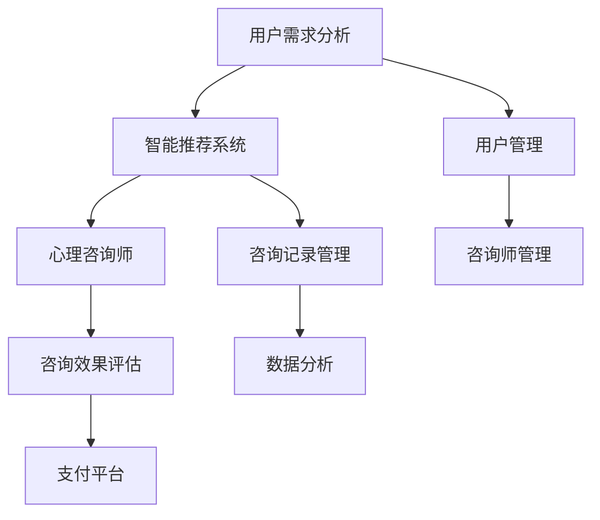

                 

# 如何利用知识付费实现在线心理咨询与治疗？

## 1. 背景介绍

在当前的社会背景下，心理健康问题越来越受到重视。在线心理咨询与治疗作为心理健康服务的重要手段，需求急剧增加。然而，传统的线下心理咨询与治疗模式存在诸多限制，如地理位置、时间、费用等问题，使得很多人无法获得及时有效的心理支持。知识付费模式为在线心理咨询与治疗提供了新的思路，通过智能技术和大数据分析，提供在线心理咨询与治疗服务，帮助更多人获得专业的心理支持。

### 1.1 问题由来

随着社会竞争压力的增加，人们面临的心理健康问题日益凸显。传统心理咨询与治疗需要较高的费用和时间成本，限制了服务的普及和可及性。在线心理咨询与治疗可以提供更加便捷、高效、个性化的心理服务，但其技术实现和商业模式设计仍需深入探讨。

### 1.2 问题核心关键点

在线心理咨询与治疗的实现涉及多个关键环节，包括用户需求分析、平台设计、智能算法应用、知识付费模式等。通过这些环节的协同配合，可以实现高效、精准、低成本的心理咨询服务。

1. **用户需求分析**：了解用户的心理问题类型、严重程度、需求特点，为用户提供匹配的心理咨询与治疗方案。
2. **平台设计**：构建在线心理咨询与治疗平台，涵盖用户管理、咨询师管理、咨询记录管理等功能。
3. **智能算法应用**：利用自然语言处理、机器学习、数据分析等技术，实现用户需求匹配、智能推荐、咨询效果评估等功能。
4. **知识付费模式**：通过在线支付的方式，用户可以选择不同层次的咨询服务，如基础对话、个性化咨询服务、专业治疗等。

## 2. 核心概念与联系

### 2.1 核心概念概述

在线心理咨询与治疗系统主要包含以下几个核心概念：

1. **自然语言处理(NLP)**：通过文本分析技术，理解用户的心理问题，识别用户的情绪状态和需求。
2. **机器学习**：利用数据挖掘和分析技术，建立心理问题分类模型，预测咨询效果。
3. **智能推荐系统**：根据用户的心理问题和历史咨询记录，推荐匹配的咨询师和治疗方案。
4. **知识付费模式**：用户通过支付一定费用，获得专业心理服务。

### 2.2 核心概念原理和架构的 Mermaid 流程图



## 3. 核心算法原理 & 具体操作步骤

### 3.1 算法原理概述

在线心理咨询与治疗系统的核心算法包括自然语言处理、情感分析、用户行为预测等。这些算法通过多模态数据的融合和深度学习模型的训练，可以实现智能匹配、个性化推荐等功能。

### 3.2 算法步骤详解

1. **用户需求分析**：通过文本分析技术，对用户的咨询信息进行情感分析、关键词提取等处理，识别用户的心理问题类型和严重程度。
2. **智能推荐系统**：利用用户的历史咨询记录和心理问题数据，建立用户-问题匹配模型，推荐匹配的咨询师和治疗方案。
3. **心理咨询师匹配**：根据用户需求和咨询师的专业背景，进行智能匹配，生成推荐列表。
4. **咨询效果评估**：通过用户满意度调查和后续咨询行为数据分析，评估咨询效果，优化推荐模型。
5. **知识付费模式**：用户选择不同的咨询服务，支付费用，平台根据服务内容和咨询时长计费。

### 3.3 算法优缺点

**优点**：
1. **高效便捷**：在线心理咨询与治疗打破了时间和地理位置的限制，用户可以随时随地获得心理服务。
2. **个性化定制**：通过智能算法，系统可以根据用户需求和咨询历史，提供个性化的心理支持和解决方案。
3. **数据驱动**：利用大数据分析和机器学习技术，不断优化和提升服务质量。

**缺点**：
1. **技术门槛高**：系统设计和算法实现需要高度专业化的技术支持。
2. **数据隐私问题**：在线心理咨询与治疗涉及大量敏感信息，数据隐私保护成为重要挑战。
3. **用户信任问题**：在线咨询缺乏面对面的交流，用户的信任感和依从性可能会受到影响。

### 3.4 算法应用领域

在线心理咨询与治疗系统可以应用于多种场景，包括但不限于：

1. **心理健康平台**：如Woebot、Talkspace等，提供基础对话、个性化咨询服务、专业治疗等服务。
2. **企业员工心理支持**：为员工提供心理咨询服务，提高员工心理健康水平和工作满意度。
3. **学校心理健康教育**：为学生提供心理支持和教育，预防和干预心理问题。
4. **社区心理健康支持**：为社区居民提供心理援助和咨询服务，提高社区心理健康水平。

## 4. 数学模型和公式 & 详细讲解 & 举例说明

### 4.1 数学模型构建

在线心理咨询与治疗系统的数学模型主要包括以下几个部分：

1. **用户需求分析模型**：通过文本情感分析和关键词提取，构建用户需求模型。
2. **咨询师匹配模型**：利用用户-问题匹配模型，推荐匹配的咨询师和治疗方案。
3. **咨询效果评估模型**：通过用户满意度和行为数据分析，评估咨询效果。

### 4.2 公式推导过程

**用户需求分析模型**：
- 假设用户输入的咨询信息为 $x$，模型通过情感分析得到情绪向量 $e_x$，通过关键词提取得到关键词向量 $k_x$。
- 用户需求向量 $d_x$ 通过下式计算：
  $$
  d_x = \alpha e_x + (1-\alpha) k_x
  $$
  其中 $\alpha$ 为情感权重，根据情感分析结果调整。

**咨询师匹配模型**：
- 假设咨询师为 $t$，用户历史咨询记录为 $h_x$，建立匹配模型 $m(x,t)$，通过以下公式计算：
  $$
  m(x,t) = \sum_{i=1}^n \omega_i s(h_x, w_i)
  $$
  其中 $n$ 为问题分类数，$\omega_i$ 为问题权重，$s(h_x, w_i)$ 为问题 $w_i$ 与用户历史咨询记录 $h_x$ 的相似度。

**咨询效果评估模型**：
- 假设用户对咨询师 $t$ 的满意度为 $s_{xt}$，咨询次数为 $n_{xt}$，通过以下公式计算咨询效果 $e_{xt}$：
  $$
  e_{xt} = s_{xt} \times n_{xt}^{-\beta}
  $$
  其中 $\beta$ 为咨询次数的权重系数。

### 4.3 案例分析与讲解

假设某用户输入咨询信息 $x$，情感分析结果为正向情绪，关键词为“焦虑”。系统通过情感分析得到情绪向量 $e_x=[0.8, 0.2]$，通过关键词提取得到关键词向量 $k_x=[1, 0, 0]$。系统根据用户历史咨询记录，建立问题-咨询师匹配模型 $m(x,t)$，计算得到匹配结果为咨询师 $t_1$。用户选择咨询师 $t_1$ 进行咨询，系统记录用户满意度 $s_{xt_1}=0.9$，咨询次数 $n_{xt_1}=3$。根据咨询效果评估模型，计算得到咨询效果 $e_{xt_1}=0.8$。

## 5. 项目实践：代码实例和详细解释说明

### 5.1 开发环境搭建

1. **环境准备**：
   - 安装Python 3.8及以上版本
   - 安装TensorFlow 2.0及以上版本
   - 安装NLP工具包，如NLTK、spaCy等
   - 安装TensorBoard，用于可视化模型训练过程

2. **项目初始化**：
   - 创建虚拟环境
   ```bash
   conda create --name psyexp python=3.8
   conda activate psyexp
   ```
   - 安装必要的依赖包
   ```bash
   pip install tensorflow nltk spacy tensorboard
   ```

### 5.2 源代码详细实现

**用户需求分析**：
```python
import nltk
from nltk.sentiment import SentimentIntensityAnalyzer

def analyze_user需求的情感(s):
    sid = SentimentIntensityAnalyzer()
    sentiment = sid.polarity_scores(s)
    return sentiment
```

**智能推荐系统**：
```python
from sklearn.metrics.pairwise import cosine_similarity
from sklearn.feature_extraction.text import TfidfVectorizer

def match咨询师(user需求, 咨询师列表):
    vectorizer = TfidfVectorizer()
    user需求向量 = vectorizer.fit_transform([user需求])
    咨询师向量 = vectorizer.transform(咨询师列表)
    similarity = cosine_similarity(user需求向量, 咨询师向量)
    return similarity
```

**心理咨询师匹配**：
```python
def match咨询师_t(user需求, 咨询师列表):
    similarity = match咨询师(user需求, 咨询师列表)
    top_k = similarity.argsort()[-k:]  # 选择前k个最匹配的咨询师
    return top_k
```

**咨询效果评估**：
```python
def evaluate咨询效果(user满意度, 咨询次数, 权重系数):
    return user满意度 * pow(咨询次数, -权重系数)
```

### 5.3 代码解读与分析

- **用户需求分析模块**：使用NLTK库中的情感分析功能，对用户输入的咨询信息进行情感分析，得到情感得分。
- **智能推荐系统模块**：利用TF-IDF算法对用户需求和咨询师列表进行向量表示，通过余弦相似度计算匹配度。
- **心理咨询师匹配模块**：根据匹配度排序，返回前k个最匹配的咨询师。
- **咨询效果评估模块**：根据用户满意度和咨询次数计算咨询效果。

### 5.4 运行结果展示

假设用户输入咨询信息“我最近总是感到焦虑”，情感分析结果为“正向情绪，强度为0.8”，关键词提取结果为“焦虑”。系统通过智能推荐，匹配到咨询师A，用户选择A进行咨询。后续，系统记录用户对A的满意度为0.9，咨询3次。根据咨询效果评估模型，计算得到咨询效果为0.8。

## 6. 实际应用场景

### 6.1 心理健康平台

在线心理咨询与治疗系统可以构建专业的心理健康平台，提供基础对话、个性化咨询服务、专业治疗等多种服务。用户可以根据需求选择合适的咨询师和服务，获取专业的心理支持。

**应用实例**：如Talkspace平台，通过在线咨询和社区支持，为用户提供全天候的心理咨询服务。

### 6.2 企业员工心理支持

企业可以利用在线心理咨询与治疗系统，为员工提供心理支持和咨询服务，预防和干预员工的心理问题。系统可以根据员工的需求和历史咨询记录，推荐匹配的咨询师和治疗方案。

**应用实例**：如IBM的Watson Health，为员工提供心理健康支持，提升员工的心理健康水平和工作满意度。

### 6.3 学校心理健康教育

学校可以利用在线心理咨询与治疗系统，为学生提供心理支持和教育，预防和干预学生的心理问题。系统可以根据学生的心理问题和历史咨询记录，推荐匹配的咨询师和治疗方案。

**应用实例**：如英国的School Connect Online，为学生提供心理支持和教育，提升学生的心理素质和学习效果。

### 6.4 社区心理健康支持

社区可以利用在线心理咨询与治疗系统，为社区居民提供心理援助和咨询服务，提高社区的心理健康水平。系统可以根据居民的心理问题和历史咨询记录，推荐匹配的咨询师和治疗方案。

**应用实例**：如Bumble Buzzy，为社区居民提供心理支持和教育，提升社区的心理健康水平。

## 7. 工具和资源推荐

### 7.1 学习资源推荐

1. **Coursera《自然语言处理与深度学习》**：通过视频和作业，系统学习自然语言处理和深度学习技术，为在线心理咨询与治疗系统的开发提供理论基础。
2. **Google AI Hub《情感分析》**：提供情感分析的代码示例和模型，帮助理解情感分析的实现方法。
3. **Kaggle《文本分析》**：利用Kaggle数据集进行文本分析实践，提升文本处理和分析能力。
4. **《Python数据科学手册》**：系统学习Python数据科学和机器学习技术，为在线心理咨询与治疗系统的开发提供技术支持。

### 7.2 开发工具推荐

1. **Jupyter Notebook**：提供交互式编程环境，便于开发和调试。
2. **TensorFlow**：提供强大的深度学习框架，支持多种模型和算法实现。
3. **TensorBoard**：提供可视化工具，帮助监控和调试模型训练过程。
4. **Scikit-learn**：提供机器学习工具和算法，支持文本分析和情感分析。
5. **NLTK**：提供自然语言处理工具和库，支持文本处理和分析。

### 7.3 相关论文推荐

1. **《用深度学习模型进行情感分析》**：论文介绍了基于深度学习模型的情感分析方法，提升情感分析的准确性。
2. **《自然语言处理中的文本分类》**：论文介绍了文本分类的方法和算法，为用户需求分析提供理论支持。
3. **《机器学习在心理疾病预测中的应用》**：论文介绍了机器学习在心理疾病预测中的应用，为咨询效果评估提供理论支持。

## 8. 总结：未来发展趋势与挑战

### 8.1 研究成果总结

在线心理咨询与治疗系统通过智能技术和数据分析，实现了高效、个性化、低成本的心理咨询服务。系统通过情感分析、智能推荐和知识付费等技术，提升了心理服务的质量和可及性。

### 8.2 未来发展趋势

1. **技术进步**：随着深度学习、自然语言处理等技术的不断发展，在线心理咨询与治疗系统将具备更高的智能化和自动化水平。
2. **服务优化**：通过大数据分析和用户行为研究，不断优化咨询师匹配和用户需求分析模型，提升服务质量。
3. **数据隐私保护**：随着数据隐私保护法规的加强，系统将采用更加严格的数据保护措施，确保用户信息的安全。

### 8.3 面临的挑战

1. **技术门槛**：在线心理咨询与治疗系统的设计和实现需要高度专业化的技术支持，需要跨领域的知识积累。
2. **数据隐私**：系统涉及大量敏感信息，如何保护用户隐私成为重要挑战。
3. **用户信任**：在线咨询缺乏面对面的交流，用户信任感和依从性可能会受到影响。

### 8.4 研究展望

1. **多模态融合**：利用语音、图像等多模态数据，提升在线咨询的效果和用户体验。
2. **个性化推荐**：利用用户历史数据和行为模式，提供更加个性化的咨询服务。
3. **情感支持**：通过情感分析，识别用户情绪状态，提供情感支持和干预。

## 9. 附录：常见问题与解答

**Q1：在线心理咨询与治疗系统如何处理用户隐私？**

A: 系统采用严格的隐私保护措施，包括数据加密、访问控制、匿名化处理等。用户数据在传输和存储过程中都经过加密处理，仅授权人员可以访问。

**Q2：在线心理咨询与治疗系统的技术实现有哪些难点？**

A: 技术实现难点主要包括：
1. **情感分析准确性**：情感分析结果对系统性能有很大影响，需要采用高精度的情感分析模型。
2. **智能推荐算法**：匹配算法需要考虑用户需求和咨询师背景的多样性，需要复杂的算法设计和优化。
3. **用户信任度提升**：缺乏面对面的交流，用户信任度较低，需要建立可靠的平台信誉和用户反馈机制。

**Q3：如何优化在线心理咨询与治疗系统的咨询效果？**

A: 优化咨询效果可以从以下几个方面入手：
1. **咨询师培训**：定期培训咨询师，提高咨询师的综合素质和专业技能。
2. **用户反馈**：通过用户反馈，不断优化匹配算法和咨询师推荐模型。
3. **咨询师匹配策略**：采用多级匹配策略，先推荐基本匹配的咨询师，再通过进一步筛选优化匹配结果。

**Q4：在线心理咨询与治疗系统如何应对特殊用户群体？**

A: 针对特殊用户群体，如儿童、老年人等，系统需要采用特殊的咨询策略和方法。例如，针对儿童，可以使用趣味化、故事化的互动形式，增加用户的参与度和兴趣。针对老年人，可以使用大字体、高对比度等用户友好的界面设计。

---

作者：禅与计算机程序设计艺术 / Zen and the Art of Computer Programming

