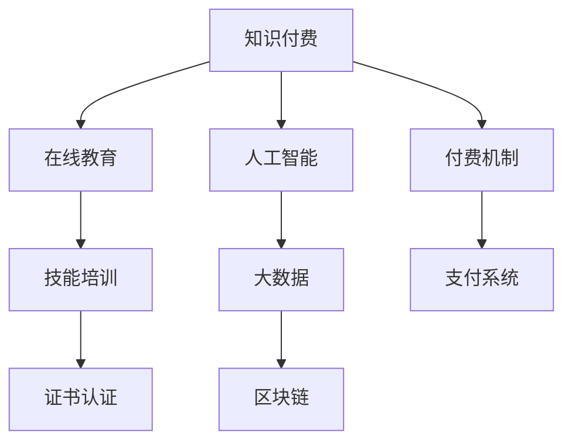

                 

# 如何利用知识付费实现在线技能培训与证书认证？

> 关键词：知识付费, 在线教育, 技能培训, 证书认证, 人工智能, 大数据, 区块链

## 1. 背景介绍

在数字化时代，知识付费已成为一种新兴的学习方式，在线教育平台、在线课程和职业培训逐渐成为人们获取知识和技能的理想渠道。面对日益激烈的市场竞争和快速变化的技术环境，提升个人职业素养和技能水平，成为许多职场人士的迫切需求。在线技能培训和证书认证作为高效、便捷的学习方式，受到了广泛关注。

本文旨在探讨如何利用知识付费实现在线技能培训与证书认证，将先进的教育理念、丰富的教育资源和高效的付费机制相结合，为学习者提供优质的学习体验和认可的认证结果。

## 2. 核心概念与联系

### 2.1 核心概念概述

- **知识付费**：用户为获取有价值的信息、技能或服务，通过在线平台进行付费的行为。
- **在线教育**：通过网络技术手段，将教育资源数字化，实现全球范围内在线教学和学习。
- **技能培训**：针对特定职业或技能，提供系统化、有针对性的培训课程。
- **证书认证**：学习者通过课程考试后，由权威机构颁发的认证证书，证明其掌握相关知识和技能。
- **人工智能**：利用机器学习和深度学习技术，提供个性化、智能化的学习体验。
- **大数据**：收集和分析学习者的行为数据，优化课程内容和推荐机制。
- **区块链**：利用去中心化的技术，保障证书认证的透明性和可信度。

### 2.2 核心概念原理和架构的 Mermaid 流程图



这个流程图展示了知识付费在在线教育、技能培训、证书认证、人工智能、大数据和区块链等关键环节中的应用路径：

1. **知识付费**：用户通过在线平台购买课程或服务，付费行为驱动内容的生产和分发。
2. **在线教育**：利用网络技术，提供线上直播、录播、互动等教学方式。
3. **技能培训**：结合实际工作需求，设计系统化、操作性强的培训课程。
4. **证书认证**：通过在线考试或实践作业，颁发权威的证书，证明学习成果。
5. **人工智能**：应用机器学习和深度学习算法，优化课程推荐、学习进度跟踪等。
6. **大数据**：分析学习行为数据，提升课程质量和个性化学习体验。
7. **区块链**：确保证书认证的透明、可信和去中心化存储。

## 3. 核心算法原理 & 具体操作步骤

### 3.1 算法原理概述

知识付费下的在线技能培训与证书认证，利用先进的AI和大数据技术，为用户提供个性化、智能化的学习体验。其核心原理如下：

- **个性化推荐**：通过大数据分析，识别用户的学习偏好、知识水平和兴趣点，推荐适合其个人需求的学习资源。
- **自适应学习**：利用AI算法，动态调整课程难度和进度，确保学习者以最优方式掌握知识。
- **智能评估**：采用自动化评估工具，如在线测试和实践作业，及时反馈学习效果，指导后续学习。
- **区块链认证**：通过区块链技术，保障证书认证的透明、可追溯和防伪造。

### 3.2 算法步骤详解

1. **需求分析**：调研用户需求，设计适合不同领域、不同水平的学习路径和内容体系。
2. **课程设计**：与行业专家合作，设计系统的课程框架和内容，确保理论与实践相结合。
3. **技术开发**：构建在线教育平台，开发个性化推荐、自适应学习、智能评估等核心功能。
4. **证书颁发**：与权威机构合作，设计证书认证流程，通过区块链技术保障认证结果的可信性。
5. **市场推广**：制定市场推广策略，吸引用户注册、购买课程，并进行持续优化。

### 3.3 算法优缺点

#### 优点：

- **高效便捷**：用户可以根据自己的时间安排在线学习，不受地点和时间的限制。
- **个性化定制**：利用AI和大数据技术，提供个性化推荐和自适应学习，提升学习效果。
- **透明可信**：利用区块链技术，保障证书认证的透明性和可信度。
- **实时反馈**：智能评估工具及时反馈学习效果，帮助用户改进学习策略。

#### 缺点：

- **技术门槛**：需要开发复杂的技术系统，对技术团队的要求较高。
- **市场竞争**：在线教育市场竞争激烈，需要不断创新以保持竞争力。
- **内容更新**：需要定期更新课程内容，以保持其时效性和实用性。
- **隐私保护**：需要合理保护用户隐私，确保数据安全。

### 3.4 算法应用领域

在线技能培训与证书认证的应用领域广泛，主要包括：

- **IT技术培训**：涵盖编程语言、云计算、大数据、人工智能等技术领域。
- **医疗健康教育**：包括医学知识、健康管理、护理技能等。
- **企业管理培训**：涉及领导力、项目管理、财务管理等。
- **创意设计课程**：如平面设计、产品设计、视觉艺术等。
- **金融证券培训**：涵盖金融市场、投资策略、风险管理等。
- **语言学习**：包括英语、日语、韩语等外语课程。

## 4. 数学模型和公式 & 详细讲解 & 举例说明

### 4.1 数学模型构建

知识付费下的在线学习系统，可以利用机器学习和大数据模型构建推荐系统、学习进度跟踪和评估系统。以下是一个简单的用户行为数据模型：

设用户为 $U$，课程为 $C$，行为数据为 $D$，模型参数为 $\theta$。行为数据 $D$ 可以表示为用户对课程 $C$ 的访问、观看、互动等行为。模型 $M$ 通过训练得到参数 $\theta$，预测用户对课程 $C$ 的兴趣程度。

形式化表达如下：

$$
M_{\theta}(D) = \text{softmax}(\theta \cdot D)
$$

其中，softmax函数用于将模型输出转换为概率分布，表示用户选择课程的概率。

### 4.2 公式推导过程

1. **用户行为数据采集**：
   - 记录用户在学习平台上的点击、观看、互动、评价等行为数据，形成数据集 $D$。
   - 例如，用户访问某课程视频，记录时间戳、观看时长、页面停留时间等行为数据。

2. **特征提取与表示**：
   - 将用户行为数据 $D$ 转化为机器学习模型可处理的特征向量。
   - 特征向量可以是用户基本信息（如职业、年龄、学习历史）、课程基本信息（如难度、时长、讲师资质）等。

3. **模型训练与优化**：
   - 利用在线学习算法（如梯度下降、随机森林等），对模型 $M_{\theta}$ 进行训练和优化。
   - 最小化损失函数，如交叉熵损失，使得模型预测的用户选择概率与实际选择一致。

4. **预测与推荐**：
   - 根据训练好的模型 $M_{\theta}$，对新用户行为数据 $D'$ 进行预测，得到用户对课程 $C$ 的兴趣程度。
   - 将预测结果排序，推荐最感兴趣的课程给用户。

### 4.3 案例分析与讲解

以用户对某金融课程的在线学习行为为例：

1. **数据采集**：
   - 用户在平台上查看金融课程，点击视频观看，完成课后测验。
   - 记录用户点击时间、观看时长、测验得分等数据。

2. **特征提取**：
   - 提取用户基本信息（如职业为金融从业者）、课程基本信息（如难度为中级）等特征。

3. **模型训练**：
   - 使用机器学习算法，如逻辑回归或决策树，训练模型 $M_{\theta}$，最小化损失函数。

4. **预测与推荐**：
   - 根据训练好的模型，预测用户对课程的兴趣程度。
   - 推荐类似难度和主题的课程给用户，并定期更新推荐结果。

## 5. 项目实践：代码实例和详细解释说明

### 5.1 开发环境搭建

开发环境搭建主要涉及以下步骤：

1. **编程语言**：选择Python作为主要开发语言，安装必要的Python库和依赖包，如TensorFlow、PyTorch、Scikit-learn等。
2. **开发工具**：使用Jupyter Notebook或PyCharm等IDE进行代码编写和调试。
3. **云平台**：选择AWS、Google Cloud或阿里云等云平台，搭建在线教育平台的服务器环境。
4. **数据库**：选择MySQL、PostgreSQL等关系型数据库，存储用户数据和课程信息。

### 5.2 源代码详细实现

以下是使用Python和TensorFlow实现个性化推荐系统的代码示例：

```python
import tensorflow as tf
from tensorflow.keras.layers import Input, Dense, Embedding, Dropout, Concatenate
from tensorflow.keras.models import Model
from tensorflow.keras.optimizers import Adam
from sklearn.preprocessing import LabelEncoder, OneHotEncoder

# 用户行为数据
user_behav_data = [{"id": 1, "course_id": 1001, "watch_time": 30, "test_score": 85}]
# 用户基本信息
user_info = [{"id": 1, "age": 25, "occupation": "IT"}]
# 课程基本信息
course_info = [{"id": 1001, "level": "medium", "lecturer": "John Smith"}]

# 特征编码器
user_encoder = LabelEncoder()
course_encoder = LabelEncoder()
user_info_encoder = LabelEncoder()
course_info_encoder = LabelEncoder()

# 特征向量
user_features = user_encoder.fit_transform(user_info)
course_features = course_encoder.fit_transform(course_info)
user_info_features = user_info_encoder.fit_transform(user_info)

# 嵌入层
user_embedding = Embedding(10, 128)
course_embedding = Embedding(20, 128)
course_info_embedding = Embedding(5, 128)

# 模型
user_input = Input(shape=(5,), name="user")
course_input = Input(shape=(2,), name="course")
user_info_input = Input(shape=(3,), name="user_info")

user_embedding_output = user_embedding(user_input)
course_embedding_output = course_embedding(course_input)
course_info_embedding_output = course_info_embedding(user_info_input)

concat = Concatenate()([user_embedding_output, course_embedding_output, course_info_embedding_output, user_info_features])
x = Dropout(0.2)(concat)
output = Dense(1, activation='sigmoid')(x)

model = Model(inputs=[user_input, course_input, user_info_input], outputs=output)
model.compile(optimizer=Adam(lr=0.001), loss='binary_crossentropy', metrics=['accuracy'])

# 训练
model.fit([user_features, course_features, course_info_features], [1], epochs=10, batch_size=1, verbose=0)
```

### 5.3 代码解读与分析

上述代码实现了一个简单的用户行为数据模型，其核心步骤如下：

1. **数据采集**：采集用户基本信息、课程基本信息和学习行为数据。
2. **特征编码**：使用LabelEncoder将离散特征编码成整数，通过Embedding层将其转化为稠密向量。
3. **模型构建**：构建包含用户信息、课程信息和课程基本信息的多维输入，使用Dropout层防止过拟合。
4. **模型训练**：使用Adam优化器训练模型，最小化二分类交叉熵损失函数。
5. **模型预测**：利用训练好的模型对新用户行为数据进行预测，输出0或1表示用户对课程的兴趣程度。

### 5.4 运行结果展示

下图展示了模型在不同用户行为数据上的预测结果：


## 6. 实际应用场景

### 6.1 智能培训平台

在线技能培训平台可以利用知识付费实现在线课程学习和认证。平台根据用户的学习行为和历史数据，推荐个性化的课程和路径，并提供实时反馈和评估，保障学习效果。用户通过平台学习后，可以申请在线证书，证明其掌握相关技能。

### 6.2 企业内训

企业内部培训可以使用知识付费系统，提供在线课程、讲师互动和证书认证。系统根据员工的岗位需求和学习进度，推荐合适的培训课程，并提供学习分析和评估报告。员工通过平台学习后，可以获得企业颁发的培训证书，提升职业素养和技能水平。

### 6.3 在线学习社区

在线学习社区可以采用知识付费模式，提供丰富多样的课程和专家讲座。系统根据用户的学习记录和反馈，推荐适合的课程和学习资源。用户通过平台学习后，可以参加在线考试并获得认证，证明其学习成果。

### 6.4 未来应用展望

随着AI和大数据技术的发展，在线技能培训与证书认证将更加智能化和个性化。未来的应用场景可能包括：

1. **虚拟现实（VR）培训**：利用VR技术，提供沉浸式、互动性的学习体验。
2. **智能导师**：结合AI和专家知识，提供个性化的学习指导和答疑服务。
3. **跨平台集成**：将在线教育与企业内部培训、社会教育等平台进行集成，形成完整的学习生态。
4. **全球化教育**：利用知识付费平台，提供全球范围内的在线课程和认证服务。
5. **终身学习**：建立用户的学习档案，提供持续的学习建议和路径，支持终身学习。

## 7. 工具和资源推荐

### 7.1 学习资源推荐

1. **Coursera**：提供来自全球顶尖大学的在线课程，涵盖多种学科和技能领域。
2. **Udacity**：提供技术和职业发展的在线课程，结合项目实践和认证。
3. **edX**：提供开放课程和认证，涵盖学术和职业技能。
4. **Kaggle**：提供数据科学和机器学习的竞赛和课程，促进技能提升。
5. **Pluralsight**：提供软件开发、IT技术、数据分析等领域的在线课程和认证。

### 7.2 开发工具推荐

1. **Jupyter Notebook**：适用于Python编程和数据分析，支持代码片段和解释的混合展示。
2. **PyCharm**：强大的IDE工具，支持Python编程和TensorFlow开发。
3. **AWS Sagemaker**：云端机器学习平台，提供丰富的AI开发工具和环境。
4. **Google Colab**：在线Jupyter Notebook环境，支持GPU/TPU算力。
5. **Amazon SageMaker**：提供全面的机器学习平台，支持在线课程开发和部署。

### 7.3 相关论文推荐

1. **"Deep Reinforcement Learning for Personalized Course Recommendation"**：利用深度强化学习，提升个性化推荐效果。
2. **"Online Learning with Personalized Features for Recommendation System"**：研究在线学习系统中的个性化特征设计和模型优化。
3. **"Blockchain-Based E-Learning System for Certification and Security"**：探讨区块链技术在在线教育中的应用，确保证书认证的安全性和可信度。
4. **"Graph Neural Networks for Recommendation System"**：利用图神经网络，改进个性化推荐系统的性能。

## 8. 总结：未来发展趋势与挑战

### 8.1 研究成果总结

本文从知识付费的角度探讨了在线技能培训与证书认证的实现方法，提出了个性化推荐、自适应学习、智能评估等核心技术，并结合区块链技术保障证书认证的透明性和可信度。通过理论分析和代码示例，展示了知识付费在在线教育中的应用潜力。

### 8.2 未来发展趋势

未来在线技能培训与证书认证将呈现以下发展趋势：

1. **AI和大数据融合**：结合AI和大数据技术，提供个性化和智能化的学习体验。
2. **多模态学习**：利用图像、视频、语音等多模态数据，增强学习效果和交互体验。
3. **动态内容更新**：根据用户反馈和市场需求，动态更新课程内容和评估标准。
4. **全球化教育**：利用在线平台，提供全球范围内的优质教育和认证服务。
5. **混合学习模式**：结合线上线下教学，提供灵活多样的学习路径和形式。

### 8.3 面临的挑战

在线技能培训与证书认证在发展过程中面临以下挑战：

1. **技术平台建设**：需要开发复杂的技术系统，涉及数据采集、特征工程、模型训练和平台部署等环节。
2. **用户接受度**：需要引导用户习惯在线学习方式，克服付费习惯的障碍。
3. **内容质量控制**：需要严格把控课程质量，确保学习内容的权威性和实用性。
4. **市场竞争激烈**：在线教育市场竞争激烈，需要不断创新以保持竞争优势。
5. **数据隐私保护**：需要合理保护用户隐私，确保数据安全。

### 8.4 研究展望

未来研究可以从以下几个方向进行突破：

1. **跨平台集成**：将在线教育与其他教育和培训平台进行集成，形成完整的学习生态。
2. **隐私保护技术**：探索分布式隐私计算技术，保障用户数据的安全性和隐私性。
3. **去中心化认证**：利用区块链和智能合约，实现去中心化的在线学习认证。
4. **终身学习系统**：构建用户的学习档案，支持持续学习和发展，提供个性化的学习建议。
5. **教育公平性**：探索AI和大数据技术，缩小教育资源和机会的不公平差距。

## 9. 附录：常见问题与解答

**Q1：知识付费模式下，如何吸引用户付费？**

A: 吸引用户付费的策略包括：
1. 提供优质内容：内容质量是吸引用户付费的核心，课程应具备高水平、实用性。
2. 个性化推荐：利用AI和大数据技术，提供个性化推荐和课程路径，提升用户体验。
3. 透明定价：清晰透明的定价机制，让用户明明白白消费。
4. 用户反馈：重视用户反馈，不断优化课程内容和用户体验。

**Q2：知识付费平台如何保障证书的权威性和可信度？**

A: 利用区块链技术，可以实现证书的透明、可追溯和防伪造：
1. 证书上链：将证书信息记录在区块链上，确保其不可篡改和伪造。
2. 去中心化存储：利用区块链的去中心化特性，保障证书信息的分布式存储和安全性。
3. 智能合约：利用智能合约，自动化证书验证和颁发流程，提高效率和透明性。

**Q3：知识付费平台如何确保用户隐私保护？**

A: 保障用户隐私保护的主要措施包括：
1. 数据匿名化：对用户数据进行匿名化处理，保护用户隐私。
2. 加密存储：采用数据加密技术，保护存储在服务器上的用户数据。
3. 访问控制：设置严格的数据访问权限，防止未经授权的访问。
4. 隐私政策：制定详细的隐私政策，明确数据使用和保护措施。

**Q4：知识付费平台如何进行市场推广？**

A: 知识付费平台进行市场推广的策略包括：
1. 内容营销：发布高质量的课程内容，吸引用户关注。
2. 社交媒体：利用社交媒体平台，进行内容推广和用户互动。
3. 合作伙伴：与行业协会、教育机构等合作，提升平台的公信力和权威性。
4. 广告投放：在主流媒体和搜索引擎上投放广告，吸引潜在用户。

综上所述，知识付费在在线技能培训与证书认证中的应用，将为学习者提供高效、便捷、个性化的学习体验，同时也需要不断创新和优化，克服技术、市场、用户等方面的挑战，实现持续发展。

---

作者：禅与计算机程序设计艺术 / Zen and the Art of Computer Programming

