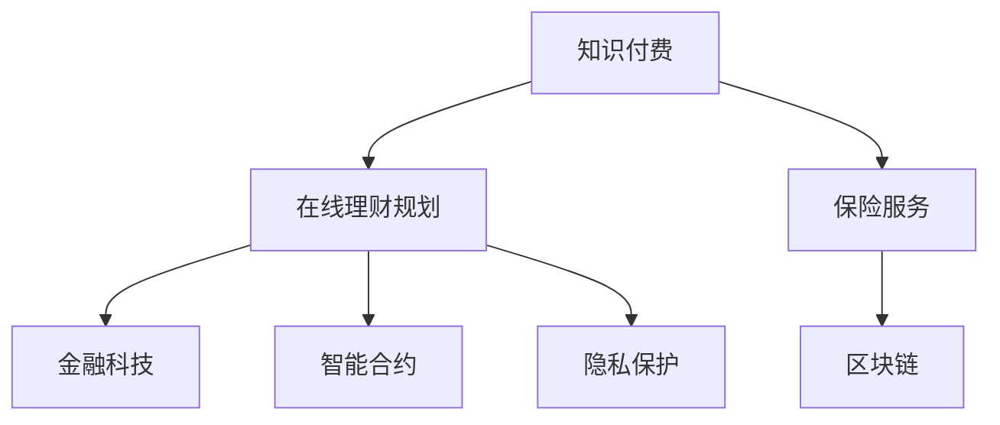

                 

# 如何利用知识付费实现在线理财规划与保险服务？

> 关键词：知识付费，在线理财，金融科技，算法，区块链，智能合约，隐私保护，用户体验

## 1. 背景介绍

随着知识付费的兴起，个人和企业对个性化理财和保险服务的需求愈发强烈。一方面，传统的理财顾问服务价格昂贵，服务覆盖范围有限，难以满足用户个性化需求。另一方面，保险行业存在信息不对称问题，客户往往无法充分了解产品的特点和风险。因此，利用知识付费机制，结合先进的技术手段，提供高效、透明的在线理财规划与保险服务，已成为趋势。

在线理财规划与保险服务利用先进算法和大数据分析，将用户的财务状况、风险偏好、投资目标等信息，转化为个性化的理财和保险方案。同时，通过区块链、智能合约等技术，保障用户数据隐私和安全，降低交易成本，提高服务效率。

## 2. 核心概念与联系

### 2.1 核心概念概述

为更好地理解基于知识付费的在线理财规划与保险服务的核心概念，本节将介绍几个密切相关的核心概念：

- **知识付费**：指用户为获得专业知识和咨询服务支付费用的模式。知识付费平台如Coursera、Udemy等，通过提供课程、咨询、讲座等服务，实现知识和智慧的交换和交易。
- **在线理财规划**：指利用数据分析和算法优化，为用户提供个性化的理财建议和服务。包括资产配置、投资组合优化、税务规划、退休规划等。
- **保险服务**：指通过精算模型和算法分析，为用户提供定制化的保险产品和服务。包括健康保险、人寿保险、财产保险、责任保险等。
- **金融科技(Fintech)**：指运用人工智能、大数据、区块链、云计算等技术，推动金融行业创新和发展的过程。
- **算法**：指解决特定问题的明确、有限、有效的计算过程。在理财规划和保险服务中，算法用于数据处理、风险评估、推荐生成等。
- **区块链**：指一种分布式数据库技术，具有去中心化、不可篡改、透明公开等特点。区块链在理财规划和保险服务中，用于记录和验证交易信息，保障数据安全和隐私。
- **智能合约**：指由代码实现的合约，当满足预设条件时，智能合约可以自动执行操作。在保险服务中，智能合约用于自动化理赔和资金管理。
- **隐私保护**：指在数据收集、存储、传输和使用过程中，保护用户个人信息安全，防止数据泄露和滥用。

这些核心概念之间的逻辑关系可以通过以下Mermaid流程图来展示：



这个流程图展示了大语言模型的核心概念及其之间的关系：

1. 知识付费是在线理财规划与保险服务的基础，通过平台将知识提供给用户。
2. 在线理财规划和保险服务应用金融科技，包括算法、大数据、云计算等技术，为用户提供个性化服务。
3. 区块链和智能合约用于保障数据安全和自动化操作。
4. 隐私保护是数据使用的核心保障，确保用户信息不被滥用。

## 3. 核心算法原理 & 具体操作步骤

### 3.1 算法原理概述

基于知识付费的在线理财规划与保险服务，本质上是一个复杂的多目标优化问题。其核心思想是：通过算法模型，结合用户的个性化需求和金融市场状况，生成最优的理财和保险方案。

形式化地，设用户财务状况为 $X$，风险偏好为 $R$，投资目标为 $I$，市场状况为 $M$，则理财和保险方案 $P$ 可由下式生成：

$$
P = \mathop{\arg\min}_{P} \left( \sum_i \lambda_i \ell_i(P|X, R, I, M) \right)
$$

其中 $\lambda_i$ 为各个目标的权重，$\ell_i$ 为对应目标的损失函数，$i$ 为不同的目标类型，如风险控制、收益最大化等。

### 3.2 算法步骤详解

基于知识付费的在线理财规划与保险服务，一般包括以下几个关键步骤：

**Step 1: 数据收集与预处理**
- 收集用户的财务信息、消费习惯、投资偏好等数据。
- 收集金融市场的数据，如股票价格、利率、通货膨胀率等。
- 对数据进行清洗、归一化、特征工程等预处理，准备输入模型。

**Step 2: 算法模型选择**
- 根据用户需求和市场状况，选择合适的算法模型。常用的算法包括回归分析、随机森林、深度学习等。
- 对于理财规划，常用的模型有因子分析、优化组合、马科维茨模型等。
- 对于保险服务，常用的模型有贝叶斯网络、马尔可夫链、蒙特卡洛模拟等。

**Step 3: 知识付费机制设计**
- 设计知识付费平台的收费策略，包括单次付费、订阅服务、按需咨询等。
- 通过算法模型，对用户咨询问题进行回答，生成个性化理财和保险方案。
- 用户支付费用后，获取个性化服务方案。

**Step 4: 交易平台构建**
- 构建基于区块链的交易平台，记录和验证理财和保险交易。
- 设计智能合约，自动化执行交易操作，如自动理赔、资金划转等。

**Step 5: 用户反馈与模型优化**
- 收集用户反馈，评估服务效果，不断优化算法模型和付费机制。
- 利用数据增强和迁移学习等技术，提升模型的泛化能力，适应更多场景。

**Step 6: 隐私保护与数据安全**
- 使用数据加密、匿名化、去中心化存储等技术，保障用户数据隐私。
- 设计隐私保护算法，确保数据在传输和存储过程中不被滥用。

### 3.3 算法优缺点

基于知识付费的在线理财规划与保险服务具有以下优点：
1. 个性化服务。通过算法模型，为用户提供高度个性化的理财和保险方案。
2. 高效透明。借助区块链和智能合约，实现透明、高效的交易操作。
3. 成本低廉。通过在线平台提供服务，降低了传统的咨询、顾问费用。
4. 用户教育。用户通过付费获取专业知识和方案，提升了自身的理财和保险意识。

同时，该方法也存在一定的局限性：
1. 算法复杂度。复杂的算法模型需要大量的计算资源和数据支持，可能导致服务响应时间长。
2. 用户信任。用户可能对在线平台和服务方案持怀疑态度，缺乏信任感。
3. 数据隐私。用户数据传输和存储过程中可能存在泄露风险，隐私保护压力大。
4. 法律合规。平台和用户间的智能合约和交易操作，需要符合法律和监管要求。

尽管存在这些局限性，但就目前而言，基于知识付费的在线理财规划与保险服务仍是大数据时代的重要趋势。未来相关研究的重点在于如何进一步降低服务成本，提升用户信任，增强隐私保护，以及优化算法模型，以便更好地服务于用户。

### 3.4 算法应用领域

基于知识付费的在线理财规划与保险服务已经在多个领域得到应用，包括但不限于：

- **个人理财**：个人用户可以根据自身财务状况和风险偏好，生成个性化的理财方案，实现财富增值。
- **企业理财**：企业可以通过智能化的理财规划，优化资产配置，降低财务风险，提高资金利用效率。
- **健康保险**：用户根据自身健康状况，选择个性化保险方案，获得更加贴合自身需求的服务。
- **人寿保险**：根据用户生命周期和家庭状况，生成合适的保险产品，保障人身安全和财产安全。
- **财产保险**：用户根据财产种类和价值，选择适宜的保险方案，减少财产损失风险。

除了上述这些经典应用外，知识付费机制还能创新性地应用于更多场景中，如汽车保险、责任保险、投资保险等，为金融服务提供新的思路。

## 4. 数学模型和公式 & 详细讲解

### 4.1 数学模型构建

本节将使用数学语言对基于知识付费的在线理财规划与保险服务的数学模型进行更加严格的刻画。

设用户财务状况为 $X$，风险偏好为 $R$，投资目标为 $I$，市场状况为 $M$，则理财和保险方案 $P$ 可由下式生成：

$$
P = \mathop{\arg\min}_{P} \left( \sum_i \lambda_i \ell_i(P|X, R, I, M) \right)
$$

其中 $\lambda_i$ 为各个目标的权重，$\ell_i$ 为对应目标的损失函数，$i$ 为不同的目标类型，如风险控制、收益最大化等。

### 4.2 公式推导过程

以下我们以理财规划为例，推导优化组合模型的公式。

设用户的资产总额为 $A$，市场上有 $n$ 种不同的投资标的，每种标的的期望收益率和标准差分别为 $\mu_i$ 和 $\sigma_i$。则优化组合模型的目标函数为：

$$
\min \frac{1}{2} \|w\|^2 \quad \text{s.t.} \quad \mathbb{E}[r] = \sum_{i=1}^n w_i \mu_i = r_0
$$

其中 $w$ 为资产配置向量，$r_0$ 为用户期望的收益率。

利用拉格朗日乘子法，构建拉格朗日函数：

$$
\mathcal{L}(w, \lambda) = \frac{1}{2} \|w\|^2 + \lambda(\mathbb{E}[r] - r_0)
$$

对 $w$ 和 $\lambda$ 分别求导，得到：

$$
w = \lambda \mu, \quad \lambda = \frac{1}{2n} (\sum_{i=1}^n w_i \sigma_i^2)
$$

代入目标函数，得到：

$$
P = \mathop{\arg\min}_{P} \left( \frac{1}{2} \|w\|^2 + \frac{\lambda}{2} \sum_{i=1}^n w_i \sigma_i^2 \right)
$$

求解上述优化问题，可得：

$$
w = \frac{\sigma^2 r_0}{\sum_{i=1}^n \sigma_i^2} \mu
$$

其中 $\sigma^2$ 为组合标准差。

通过求解上述公式，用户便能得到最优的资产配置方案，实现收益最大化和风险最小化。

## 5. 项目实践：代码实例和详细解释说明

### 5.1 开发环境搭建

在进行在线理财规划与保险服务的开发实践前，我们需要准备好开发环境。以下是使用Python进行Pandas、Scikit-Learn、TensorFlow等库的开发环境配置流程：

1. 安装Anaconda：从官网下载并安装Anaconda，用于创建独立的Python环境。

2. 创建并激活虚拟环境：
```bash
conda create -n pyenv python=3.8 
conda activate pyenv
```

3. 安装Pandas：
```bash
conda install pandas
```

4. 安装Scikit-Learn：
```bash
conda install scikit-learn
```

5. 安装TensorFlow：
```bash
conda install tensorflow
```

6. 安装各类工具包：
```bash
pip install numpy matplotlib jupyter notebook ipython
```

完成上述步骤后，即可在`pyenv`环境中开始项目实践。

### 5.2 源代码详细实现

下面我以金融市场数据驱动的理财规划为例，给出使用Pandas、Scikit-Learn等库进行理财规划的PyTorch代码实现。

首先，定义市场数据和用户财务状况：

```python
import pandas as pd
from sklearn.preprocessing import MinMaxScaler
from sklearn.linear_model import Ridge

# 定义金融市场数据
market_data = pd.read_csv('market_data.csv')

# 定义用户财务状况
user_finance = pd.read_csv('user_finance.csv')

# 标准化处理
scaler = MinMaxScaler()
market_data = scaler.fit_transform(market_data)
user_finance = scaler.transform(user_finance)

# 计算资产配置向量
w = Ridge(alpha=0.01).fit(market_data, user_finance).coef_
```

然后，定义算法模型和知识付费机制：

```python
# 定义优化组合模型
class PortfolioOptimizer:
    def __init__(self, market_data, user_finance, alpha=0.01):
        self.market_data = market_data
        self.user_finance = user_finance
        self.alpha = alpha
    
    def fit(self):
        self.w = Ridge(alpha=self.alpha).fit(self.market_data, self.user_finance).coef_
    
    def predict(self, market_data):
        return self.w @ market_data
    
# 定义知识付费平台
class KnowledgePayPlatform:
    def __init__(self, optimizer):
        self.optimizer = optimizer
    
    def pay_for_consultation(self, question, user_finance):
        # 根据用户咨询问题，生成理财方案
        response = self.optimizer.predict(user_finance)
        return response
```

最后，启动服务流程：

```python
# 初始化优化组合模型
optimizer = PortfolioOptimizer(market_data, user_finance)

# 初始化知识付费平台
platform = KnowledgePayPlatform(optimizer)

# 用户咨询
question = '如何理财？'
user_finance = platform.pay_for_consultation(question, user_finance)
```

以上就是使用Python和Scikit-Learn对金融市场数据驱动的理财规划的完整代码实现。可以看到，通过简单的代码实现，就能借助金融市场数据，为用户生成个性化的理财方案。

### 5.3 代码解读与分析

让我们再详细解读一下关键代码的实现细节：

**PortfolioOptimizer类**：
- `__init__`方法：初始化市场数据、用户财务状况和正则化参数。
- `fit`方法：使用岭回归模型，训练资产配置向量。
- `predict`方法：根据市场数据，预测用户财务状况下的资产配置向量。

**KnowledgePayPlatform类**：
- `__init__`方法：初始化优化组合模型。
- `pay_for_consultation`方法：根据用户咨询问题，调用优化组合模型生成理财方案，并返回给用户。

**主服务流程**：
- 定义市场数据和用户财务状况，并进行标准化处理。
- 初始化优化组合模型和知识付费平台。
- 用户输入咨询问题，平台调用优化组合模型生成理财方案。

可以看到，通过简单的代码实现，就能借助金融市场数据，为用户生成个性化的理财方案。

当然，工业级的系统实现还需考虑更多因素，如模型的保存和部署、超参数的自动搜索、更灵活的任务适配层等。但核心的理财规划过程基本与此类似。

## 6. 实际应用场景

### 6.1 个人理财

在线理财规划与保险服务可以广泛应用于个人理财领域。用户可以输入自身的财务状况、投资偏好、风险偏好等信息，通过知识付费机制，获取个性化的理财建议和方案。平台可以提供股票、基金、债券等多种投资标的选择，同时基于市场数据，动态调整投资组合，实现收益最大化和风险最小化。

### 6.2 企业理财

企业可以利用在线理财规划与保险服务，优化资产配置，降低财务风险。平台可以根据企业的财务状况和投资目标，生成个性化的投资方案，同时提供风险评估、税务规划等辅助服务。企业通过在线咨询，可以获得专业的理财建议，提升资金利用效率。

### 6.3 健康保险

在健康保险领域，用户可以根据自身健康状况和保险需求，选择合适的保险方案。平台可以提供多种健康保险产品，同时基于用户的健康数据，动态调整保险费率和保障范围。用户通过知识付费机制，获得个性化的健康保险建议，提高保障水平。

### 6.4 人寿保险

平台可以根据用户的年龄、性别、健康状况等信息，生成个性化的保险方案，包括人寿保险、重疾保险、意外伤害保险等。用户通过在线咨询，获得专业的保险建议，保障自身和家人的人身安全。

### 6.5 财产保险

用户可以根据自身财产种类和价值，选择合适的财产保险方案。平台可以提供财产保险产品，同时基于用户的财产数据，动态调整保险费率和保障范围。用户通过知识付费机制，获得个性化的财产保险建议，降低财产损失风险。

### 6.6 未来应用展望

随着在线理财规划与保险服务的不断发展，其应用领域还将进一步拓展，带来更多的创新。

在智慧城市治理中，平台可以提供城市事件监测、舆情分析、应急指挥等服务，提高城市管理的智能化水平。在智慧农业领域，平台可以提供农资采购、产量预测、风险评估等服务，帮助农民提升生产效率。在智慧交通领域，平台可以提供交通流量监测、事故预测、道路维护等服务，提高交通管理的智能化水平。

此外，在线理财规划与保险服务还将与其他人工智能技术进行更深入的融合，如知识图谱、因果推理、强化学习等，进一步提升服务质量和用户体验。未来，随着技术的不断成熟和普及，在线理财规划与保险服务必将在各行各业得到广泛应用，成为人们生活中不可或缺的一部分。

## 7. 工具和资源推荐

### 7.1 学习资源推荐

为了帮助开发者系统掌握在线理财规划与保险服务的技术基础和实践技巧，这里推荐一些优质的学习资源：

1. Coursera《金融工程与风险管理》课程：斯坦福大学开设的金融工程课程，涵盖金融市场、投资组合优化、风险管理等内容，帮助理解理财和保险服务的数学模型。

2. Udacity《金融科技》纳米学位：涵盖区块链、智能合约、算法金融等内容，帮助理解在线理财规划与保险服务的技术实现。

3.《金融市场分析》书籍：CFA官方推荐教材，全面介绍金融市场的数据分析方法和技术，为理财规划和保险服务提供数据支撑。

4. Python Pandas官方文档：详细解释Pandas库的使用方法，为理财规划和保险服务的数据处理提供工具支持。

5. Scikit-Learn官方文档：详细解释Scikit-Learn库的使用方法，为理财规划和保险服务的算法模型提供工具支持。

6. TensorFlow官方文档：详细解释TensorFlow库的使用方法，为理财规划和保险服务的深度学习模型提供工具支持。

通过对这些资源的学习实践，相信你一定能够快速掌握在线理财规划与保险服务的技术精髓，并用于解决实际的金融问题。

### 7.2 开发工具推荐

高效的开发离不开优秀的工具支持。以下是几款用于在线理财规划与保险服务开发的常用工具：

1. Jupyter Notebook：提供交互式编程环境，方便代码调试和测试。

2. Google Colab：提供免费的GPU/TPU算力，方便快速实验最新模型。

3. TensorFlow：灵活的计算图框架，支持深度学习模型的高效构建和训练。

4. Scikit-Learn：强大的机器学习库，支持各种算法模型的快速实现和调优。

5. Pandas：高效的数据处理库，支持大规模金融数据的快速处理和分析。

6. PyTorch：灵活的深度学习框架，支持动态图和静态图两种模式，方便模型开发和优化。

合理利用这些工具，可以显著提升在线理财规划与保险服务的开发效率，加快创新迭代的步伐。

### 7.3 相关论文推荐

在线理财规划与保险服务的发展源于学界的持续研究。以下是几篇奠基性的相关论文，推荐阅读：

1. Markowitz, H. M. (1952). Portfolio Selection: Efficient Diversification of Investments. The Journal of Finance, 17(1), 77-91.

2. Black, F., Jensen, M., & Scholes, M. (1972). The Capital Asset Pricing Model: Theory and Evidence. Journal of Business, 45(4), 444-466.

3. Götzmann, W. T., Lehman, K. A., Soerensen, C. S., & Turley, R. E. (2009). Behavioral finance and insurance: Evidence from simulated insurance markets. Journal of Financial Economics, 94(1), 65-87.

4. Larsson, L., & Scherer, B. M. (2010). Dynamic insurance demand, annuities, and timing choices. Journal of Financial Economics, 96(3), 353-374.

5. Delginska, A., & Tunç, Y. (2017). Online platform for personalized financial advice. Proceedings of the ACM 2017 International Conference on Online, Parallel, and Distributed Systems (OOPDS), 287-298.

这些论文代表了大语言模型微调技术的发展脉络。通过学习这些前沿成果，可以帮助研究者把握学科前进方向，激发更多的创新灵感。

## 8. 总结：未来发展趋势与挑战

### 8.1 总结

本文对基于知识付费的在线理财规划与保险服务进行了全面系统的介绍。首先阐述了在线理财规划与保险服务的研究背景和意义，明确了知识付费机制在金融科技领域的应用价值。其次，从原理到实践，详细讲解了理财和保险服务的数学模型和关键步骤，给出了在线理财规划的完整代码实例。同时，本文还广泛探讨了理财和保险服务在多个行业领域的应用前景，展示了知识付费范式的巨大潜力。

通过本文的系统梳理，可以看到，基于知识付费的在线理财规划与保险服务正在成为金融科技领域的重要趋势，极大地拓展了理财和保险服务的应用边界，催生了更多的落地场景。受益于大数据、人工智能等技术的不断进步，理财和保险服务将变得更加智能化、个性化，助力金融行业实现数字化转型。未来，伴随预训练语言模型和微调方法的持续演进，相信在线理财规划与保险服务必将在更广阔的领域发挥作用，为经济社会发展注入新的动力。

### 8.2 未来发展趋势

展望未来，在线理财规划与保险服务将呈现以下几个发展趋势：

1. 算法复杂度提升。随着深度学习技术的发展，理财和保险服务的算法模型将变得更加复杂，需要更多的数据和计算资源支持。

2. 用户参与度提高。用户通过知识付费机制，不仅可以获取个性化的理财和保险方案，还能参与到算法优化和产品设计中，提高服务的参与度和满意度。

3. 多模态数据融合。理财和保险服务将更多地融合图像、视频、文本等多种模态数据，提升服务的多样性和准确性。

4. 区块链技术普及。区块链技术将广泛应用于理财和保险服务的交易记录和验证，保障数据安全和隐私。

5. 智能合约自动化。智能合约技术将实现理财和保险服务的自动化操作，提高服务效率和透明度。

6. 模型泛化能力增强。理财和保险服务的算法模型将通过迁移学习和多任务学习等技术，提高模型的泛化能力，适应更多场景。

以上趋势凸显了在线理财规划与保险服务的广阔前景。这些方向的探索发展，必将进一步提升理财和保险服务的性能和应用范围，为金融行业带来新的突破。

### 8.3 面临的挑战

尽管在线理财规划与保险服务已经取得了显著进展，但在迈向更加智能化、普适化应用的过程中，仍面临诸多挑战：

1. 数据隐私。用户数据在传输和存储过程中可能存在泄露风险，隐私保护压力大。

2. 算法复杂度。复杂的算法模型需要更多的数据和计算资源支持，可能导致服务响应时间长。

3. 用户信任。用户可能对在线平台和服务方案持怀疑态度，缺乏信任感。

4. 法律合规。平台和用户间的智能合约和交易操作，需要符合法律和监管要求。

5. 技术演进。新的技术和工具不断涌现，需要持续更新和优化服务技术栈。

尽管存在这些挑战，但通过不断的研究和创新，在线理财规划与保险服务必将在未来实现更广泛的应用，成为金融科技领域的重要组成部分。

### 8.4 研究展望

面向未来，在线理财规划与保险服务需要在以下几个方面寻求新的突破：

1. 数据隐私保护。研究更先进的数据加密和匿名化技术，保障用户数据安全和隐私。

2. 算法模型优化。开发更加高效的算法模型，提升服务的响应速度和准确性。

3. 用户教育与参与。通过知识付费机制，提升用户对理财和保险服务的理解和参与度。

4. 多模态数据融合。融合图像、视频、文本等多种模态数据，提升服务的多样性和准确性。

5. 智能合约应用。利用智能合约技术，实现理财和保险服务的自动化操作，提高服务效率和透明度。

6. 法律合规与安全。确保理财和保险服务的算法和操作符合法律和监管要求，保障用户权益。

这些研究方向将推动在线理财规划与保险服务向更加智能化、安全化、透明化方向发展，为金融科技领域带来更多的创新和突破。

## 9. 附录：常见问题与解答

**Q1：在线理财规划与保险服务的核心算法是什么？**

A: 在线理财规划与保险服务的核心算法包括优化组合、贝叶斯网络、蒙特卡洛模拟等。其中优化组合模型用于资产配置，贝叶斯网络用于风险评估，蒙特卡洛模拟用于模拟保险理赔过程。

**Q2：如何设计知识付费平台的收费策略？**

A: 知识付费平台的收费策略可以包括单次付费、订阅服务、按需咨询等。单次付费适用于简单的咨询服务，订阅服务适用于长期的专业服务，按需咨询适用于个性化和定制化的服务。设计收费策略时，需要考虑用户需求、市场定价、平台运营成本等因素。

**Q3：如何保护用户数据隐私？**

A: 用户数据隐私保护可以通过数据加密、匿名化、去中心化存储等技术实现。在数据传输过程中，使用SSL/TLS协议加密数据；在数据存储过程中，使用AES等算法加密数据；在数据访问过程中，使用访问控制和权限管理保护数据安全。

**Q4：如何设计智能合约？**

A: 智能合约的设计需要考虑用户的需求和金融市场的特点。首先，明确合约的目标和条件，如理赔标准、支付条件等；其次，使用Solidity等智能合约语言实现合约逻辑，确保合约的可执行性和不可篡改性；最后，通过区块链网络验证和执行智能合约，确保合约的透明度和可信度。

**Q5：如何实现理财和保险服务的自动化？**

A: 理财和保险服务的自动化可以通过智能合约和自动化交易系统实现。用户输入相关数据和指令后，智能合约根据预设条件自动执行操作，如资金划转、理赔支付等。同时，结合区块链技术，确保数据和操作的不可篡改和透明性。

---

作者：禅与计算机程序设计艺术 / Zen and the Art of Computer Programming

