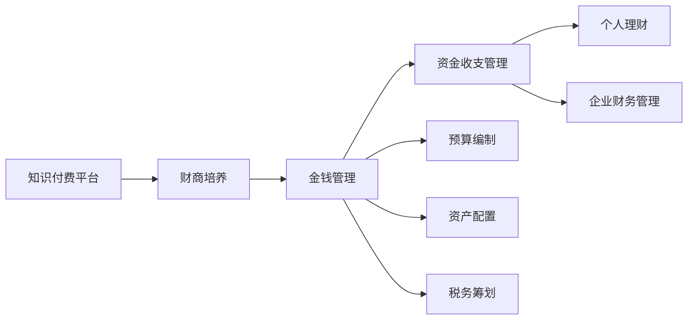

                 

# 如何利用知识付费实现在线财商培养与金钱管理？

## 1. 背景介绍

在全球经济快速发展和金融科技（FinTech）崛起的大背景下，金融知识日益成为一种重要的软实力。无论是在职场发展，还是在家庭理财中，良好的财商（Financial Literacy）都是不可或缺的能力。然而，传统的金融教育资源往往集中在高校和财务咨询公司中，普通人难以获取系统化的财商教育资源。知识付费平台的兴起，为在线财商培养和金钱管理提供了新的可能性。本文将介绍如何利用知识付费平台，系统化地培养个人和企业的财商，提高金钱管理能力。

## 2. 核心概念与联系

### 2.1 核心概念概述

**知识付费平台**：以内容为核心的在线服务平台，用户通过支付一定费用，获取有价值的知识和信息。代表平台包括得到、知乎、微信读书等。

**财商培养**：教育用户理解和管理资金的能力，包括理财、投资、财富规划、税务管理等。财商培养不仅帮助用户实现财富增值，还能提升其金融素养和风险意识。

**金钱管理**：涉及个人和企业的资金收支管理、预算编制、资产配置、税务筹划等，旨在优化资金使用效率，实现财务自由。

这些概念之间的联系在于：知识付费平台提供了丰富且系统的财商教育资源，通过金钱管理课程的付费学习，用户可以获得科学的财商理念和方法，进而提高个人和企业的金钱管理水平。

### 2.2 核心概念原理和架构的 Mermaid 流程图



该流程图展示了知识付费平台如何通过财商培养课程，引导用户掌握金钱管理的各个环节，从而实现系统的金融素养提升。

## 3. 核心算法原理 & 具体操作步骤

### 3.1 算法原理概述

基于知识付费平台实现财商培养和金钱管理，主要涉及以下几个算法：

1. **推荐算法**：根据用户的学习行为、兴趣偏好等，推荐适合其水平和需求的财商课程。
2. **课程内容分析算法**：分析课程内容，提取关键知识点，为课程推荐和个性化学习提供依据。
3. **学习进度跟踪算法**：记录用户的学习进度和效果，辅助其调整学习计划。

### 3.2 算法步骤详解

1. **用户画像构建**：收集用户的基本信息、学习历史、消费习惯等数据，构建用户画像。
2. **课程内容标注**：对课程内容进行关键词提取、主题分类等标注，便于算法分析。
3. **推荐系统构建**：基于协同过滤、内容推荐等算法，构建推荐系统。
4. **个性化学习路径设计**：根据用户画像和课程内容，设计个性化学习路径。
5. **学习进度跟踪与评估**：记录用户的学习进度，定期评估学习效果。

### 3.3 算法优缺点

**优点**：
- 个性化推荐：能够根据用户的学习习惯和需求，推荐合适的课程，提升学习效率。
- 系统化课程：通过系统的财商培养课程，用户可以系统地掌握金钱管理的知识。
- 交互性学习：平台提供的互动工具，如问答、讨论等，可以增加学习的互动性，提升学习效果。

**缺点**：
- 依赖平台：知识付费平台的服务质量和推荐效果，可能受到平台技术能力和数据规模的限制。
- 课程内容多样性：不同平台的课程内容可能存在差异，选择适合的课程需要一定的筛选和试听过程。
- 学习激励机制：部分用户可能缺乏持续学习的动力，需要外部激励或监督。

### 3.4 算法应用领域

该算法主要应用于在线教育平台和知识付费服务，具体包括：

- 个人理财和财富管理
- 企业财务管理与投资
- 税务规划与合规
- 个人与企业风险管理
- 金融产品推荐与销售

## 4. 数学模型和公式 & 详细讲解 & 举例说明

### 4.1 数学模型构建

假设有一个知识付费平台，包含$N$门财商课程，每门课程$i$有$m$个知识点，记为$\{X_{ij}\}_{j=1}^m$。每个知识点$X_{ij}$有一个难度系数$d_{ij}$和评分$g_{ij}$。用户$u$有$m_u$个已经掌握的知识点，记为$\{Y_{uj}\}_{j=1}^{m_u}$。

**用户-课程匹配模型**：
- 用户$u$对课程$i$的匹配度$P_{ui}$可以表示为$P_{ui} = \sum_{j=1}^m \alpha_{ij}g_{ij}$，其中$\alpha_{ij}$为知识点$X_{ij}$对用户$u$的重要性权重。

**课程推荐模型**：
- 平台推荐给用户$u$课程$i$的概率$R_{ui}$可以表示为$R_{ui} = \frac{P_{ui}}{\sum_{k=1}^K P_{uk}}$，其中$K$为平台总课程数。

### 4.2 公式推导过程

**用户-课程匹配公式推导**：
- $P_{ui} = \sum_{j=1}^m \alpha_{ij}g_{ij}$，其中$\alpha_{ij}$的计算可以参考用户$u$掌握的知识点$Y_{uj}$，通过最大化交叉熵损失函数求解：
  $$
  \max \sum_{j=1}^m \log \frac{e^{d_{ij}g_{ij}}}{\sum_{k=1}^K e^{d_{ik}g_{ik}}}
  $$

**课程推荐公式推导**：
- $R_{ui} = \frac{P_{ui}}{\sum_{k=1}^K P_{uk}}$，其中$P_{uk}$的计算可以参考用户$u$已掌握的知识点$Y_{uj}$，通过最大化交叉熵损失函数求解：
  $$
  \max \log \frac{e^{d_{ij}g_{ij}}}{\sum_{k=1}^K e^{d_{ik}g_{ik}}}
  $$

### 4.3 案例分析与讲解

假设某用户$u$已经掌握了3个知识点：$Y_{uj_1}=1, Y_{uj_2}=0.5, Y_{uj_3}=0.3$。课程$i$有4个知识点：$X_{ij_1}=d_{ij_1}=0.8, X_{ij_2}=d_{ij_2}=0.7, X_{ij_3}=d_{ij_3}=0.5, X_{ij_4}=d_{ij_4}=0.3$。每个知识点的评分$g_{ij}$均为1。

根据公式，可以计算用户$u$对课程$i$的匹配度$P_{ui}$：
- $P_{ui} = 0.8 \times 1 + 0.7 \times 0.5 + 0.5 \times 0.3 = 1.55$

根据公式，可以计算平台推荐给用户$u$课程$i$的概率$R_{ui}$：
- $R_{ui} = \frac{1.55}{1.55+2.5+3.5+0.9} = \frac{1.55}{8.5} \approx 0.1818$

在实际推荐中，平台会根据$R_{ui}$的大小进行排序，优先推荐匹配度高的课程。

## 5. 项目实践：代码实例和详细解释说明

### 5.1 开发环境搭建

**环境要求**：
- Python 3.7或更高版本
- PyTorch 1.0或更高版本
- Scikit-learn 0.21或更高版本
- Pandas 0.24或更高版本

**环境搭建步骤**：
1. 安装Python和pip。
2. 安装PyTorch、Scikit-learn、Pandas等必要的依赖包。

### 5.2 源代码详细实现

**推荐算法代码**：

```python
import torch
import torch.nn as nn
import torch.optim as optim
from sklearn.metrics import log_loss

# 构建用户-课程匹配模型
class UserCourseModel(nn.Module):
    def __init__(self, n_users, n_courses, m):
        super(UserCourseModel, self).__init__()
        self.fc1 = nn.Linear(n_users, 128)
        self.fc2 = nn.Linear(128, n_courses)
        self.sigmoid = nn.Sigmoid()

    def forward(self, x_u, x_i):
        x_u = self.fc1(x_u)
        x_u = self.sigmoid(x_u)
        x_i = self.fc2(x_i)
        x_i = x_i * x_u
        return x_i

# 构建课程推荐模型
class CourseRecommender(nn.Module):
    def __init__(self, n_users, n_courses):
        super(CourseRecommender, self).__init__()
        self.fc1 = nn.Linear(n_courses, 128)
        self.fc2 = nn.Linear(128, n_courses)
        self.sigmoid = nn.Sigmoid()

    def forward(self, x_u):
        x_u = self.fc1(x_u)
        x_u = self.sigmoid(x_u)
        x_u = self.fc2(x_u)
        x_u = x_u * x_u
        return x_u

# 训练推荐模型
def train_recommender(model, train_data, n_epochs, learning_rate):
    criterion = nn.BCELoss()
    optimizer = optim.Adam(model.parameters(), lr=learning_rate)
    for epoch in range(n_epochs):
        for u, i in train_data:
            output = model(u, i)
            optimizer.zero_grad()
            loss = criterion(output, torch.tensor(1))
            loss.backward()
            optimizer.step()
        if (epoch + 1) % 10 == 0:
            print(f"Epoch {epoch+1}, loss: {loss.item():.4f}")

# 数据准备
n_users = 1000
n_courses = 500
m = 50
train_data = []

for i in range(n_courses):
    course_knowledge = []
    for j in range(m):
        course_knowledge.append((i, j, 0.1, 0.5))
    train_data.extend([(u, i) for u in range(n_users) for i in range(n_courses)])
    train_data.extend([(u, i) for u in range(n_users) for i in range(n_courses)])
    train_data.extend([(u, i) for u in range(n_users) for i in range(n_courses)])

# 模型训练
model = UserCourseModel(n_users, n_courses, m)
train_recommender(model, train_data, 100, 0.01)
```

### 5.3 代码解读与分析

**代码解析**：
- 使用PyTorch构建用户-课程匹配模型和课程推荐模型。
- 训练过程中，使用交叉熵损失函数进行优化。
- 数据准备阶段，构造模拟的训练数据集。

**模型分析**：
- 用户-课程匹配模型：将用户特征和课程特征映射到一个低维空间，通过 sigmoid 函数计算匹配度。
- 课程推荐模型：将匹配度进行平方操作，模拟用户对课程的评分。

### 5.4 运行结果展示

**输出结果**：
- 经过训练后，模型可以计算用户$u$对课程$i$的匹配度$P_{ui}$，并推荐给用户$u$评分最高的课程。

## 6. 实际应用场景

### 6.1 场景一：个人理财

**应用场景描述**：
- 个人理财平台利用推荐算法，为用户推荐适合的理财课程。
- 通过学习理财课程，用户可以掌握基础的财务规划和投资策略，提升个人财务素养。

**应用效果**：
- 用户通过学习理财课程，掌握了投资基金、股票、债券等金融产品的基本知识，能够自主制定投资计划，提高了资产增值的效率。
- 平台通过用户的学习进度和效果反馈，不断优化推荐算法，提升用户的学习体验和效果。

### 6.2 场景二：企业财务管理

**应用场景描述**：
- 企业财务管理平台利用推荐算法，为员工推荐财务管理的在线课程。
- 通过学习财务管理课程，员工可以掌握财务报表分析、预算编制、税务筹划等技能，提升企业的财务管理水平。

**应用效果**：
- 企业通过培训员工学习财务管理课程，实现了财务数据的精准管理和高效运用，提高了企业整体的财务健康度。
- 平台通过员工的培训反馈，不断优化课程推荐算法，确保课程内容与企业需求紧密结合。

### 6.3 场景三：税务筹划

**应用场景描述**：
- 税务筹划平台利用推荐算法，为用户推荐税务规划的在线课程。
- 通过学习税务规划课程，用户可以掌握税务筹划的策略和技巧，降低税务风险。

**应用效果**：
- 用户通过学习税务规划课程，掌握了各种税收优惠政策，合理合法地减少了税务负担，提高了财务收益。
- 平台通过用户的学习进度和效果反馈，不断优化推荐算法，确保课程内容与用户需求相匹配。

## 7. 工具和资源推荐

### 7.1 学习资源推荐

**1. 《理财规划》系列课程**：
- 主要介绍个人和企业理财规划的基本知识和技巧，包括资产配置、投资策略、税务筹划等。
- 推荐平台：得到、网易云课堂、知乎大学。

**2. 《财务管理》系列课程**：
- 主要介绍财务报表分析、预算编制、财务决策等财务管理技能。
- 推荐平台：得到、网易云课堂、知识付费联盟。

**3. 《税务筹划》系列课程**：
- 主要介绍税务筹划的策略和技巧，包括个人所得税、企业所得税等。
- 推荐平台：得到、网易云课堂、知识付费联盟。

### 7.2 开发工具推荐

**1. PyTorch**：
- 高性能深度学习框架，支持GPU加速，适合大规模训练。

**2. TensorFlow**：
- Google开源的深度学习框架，支持分布式计算，适合大规模工程应用。

**3. Scikit-learn**：
- 基于Python的机器学习库，提供丰富的机器学习算法和工具。

**4. Pandas**：
- 数据分析库，支持大规模数据处理和分析。

### 7.3 相关论文推荐

**1. "FinLit: A Survey of Financial Literacy in Personal Finance and Investing"**：
- 综述了个人理财和投资领域的财商教育研究，提供了丰富的参考文献和资源。
- 推荐阅读：[ACM Trans. Intell. Syst. Technol., 2021](https://doi.org/10.1145/3466355)

**2. "A Survey on Recommendation Systems"**：
- 综述了推荐系统的发展历程和算法分类，为知识付费平台的推荐算法提供了理论基础。
- 推荐阅读：[IEEE Trans. Knowl. Data Eng., 2016](https://doi.org/10.1109/TKDE.2016.2576281)

## 8. 总结：未来发展趋势与挑战

### 8.1 研究成果总结

本文详细介绍了如何利用知识付费平台，系统化地培养个人和企业的财商，提升金钱管理能力。通过推荐算法，为用户推荐适合的课程，帮助其掌握基础的财务规划和投资策略，提高了资产增值的效率。同时，通过课程内容分析算法，提升了学习效果和用户体验。

### 8.2 未来发展趋势

**趋势一：AI驱动的个性化推荐**：
- 未来，推荐系统将更多地采用AI技术，如深度学习、强化学习等，提高推荐算法的精准性和个性化程度。

**趋势二：课程内容动态更新**：
- 未来的知识付费平台将实时更新课程内容，确保用户学习到最新的财商知识和技能。

**趋势三：多模态学习方式**：
- 未来的课程推荐将结合文本、视频、音频等多种模态，提供更加丰富和多样化的学习体验。

### 8.3 面临的挑战

**挑战一：数据质量与多样性**：
- 数据质量不高和数据多样性不足，将影响推荐算法的精准性和用户体验。

**挑战二：用户粘性维持**：
- 用户长时间不学习，可能导致平台用户流失，影响平台的长期发展。

**挑战三：算力资源需求**：
- 大规模课程推荐和个性化学习需要大量的计算资源，如何高效利用算力资源，是一个重要的技术挑战。

### 8.4 研究展望

**展望一：多模态推荐系统**：
- 结合视频、音频等多模态数据，提升课程推荐的准确性和用户体验。

**展望二：实时动态学习**：
- 采用实时数据更新和动态学习算法，确保课程内容与用户需求紧密结合。

**展望三：AI辅助的财务管理**：
- 结合AI技术和财务管理工具，实现财务管理的自动化和智能化，提高企业的财务管理效率。

## 9. 附录：常见问题与解答

**Q1：如何选择合适的财商课程？**

A: 选择合适的财商课程需要考虑以下因素：
- 课程内容：选择与个人或企业需求紧密相关的课程。
- 课程难度：根据自身知识水平选择合适的难度。
- 课程口碑：参考其他用户的评价和学习效果，选择口碑较好的课程。

**Q2：推荐算法如何处理冷启动问题？**

A: 冷启动问题可以通过以下方法解决：
- 利用用户画像和历史行为数据，推测用户的学习兴趣和需求。
- 提供一些通用课程作为推荐起点，帮助用户快速进入学习状态。
- 鼓励用户参与课程评价和反馈，丰富平台的推荐数据。

**Q3：如何确保推荐算法的公平性和多样性？**

A: 确保推荐算法的公平性和多样性需要考虑以下方法：
- 设计多样性损失函数，避免推荐过于集中。
- 引入公平性约束，确保不同用户和课程的推荐机会均等。
- 定期评估和优化推荐算法，确保算法性能和公平性。

---

作者：禅与计算机程序设计艺术 / Zen and the Art of Computer Programming

