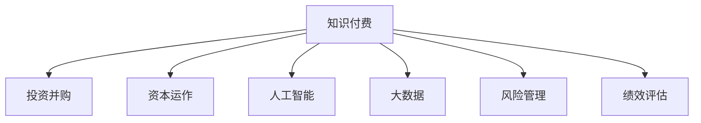

                 

# 如何利用知识付费实现投资并购与资本运作？

> 关键词：知识付费, 投资并购, 资本运作, 人工智能, 大数据, 风险管理, 绩效评估, 数据驱动决策

## 1. 背景介绍

随着互联网和信息技术的发展，知识付费市场在全球范围内迅速增长，成为连接知识生产者与消费者的重要平台。传统的投资并购与资本运作，依赖于复杂的手工分析和报告，效率低下且易出错。而利用知识付费，能够将专业的投资知识和并购经验高效整合，提高决策效率和准确性。

### 1.1 问题由来
投资并购与资本运作涉及大量数据处理和复杂分析，传统方法往往依赖专家手工操作，效率低且易受人为因素影响。知识的碎片化和分散化，使得企业很难快速获取全面、准确、实时的信息。因此，如何将知识付费与投资并购及资本运作结合，利用先进技术和数据驱动，成为亟待解决的问题。

### 1.2 问题核心关键点
核心问题在于如何构建知识付费平台，与投资并购及资本运作结合，提高决策效率和精准度。这涉及到以下几个关键点：
1. **数据整合与处理**：将海量数据进行高效整合与处理，实时更新市场动态和趋势。
2. **知识聚合与创新**：将专家知识进行系统化、结构化存储，便于快速检索与复用。
3. **自动化决策支持**：利用人工智能和大数据技术，自动生成投资建议和并购方案。
4. **绩效评估与风险管理**：通过实时监控和分析，评估投资效果和风险，进行动态调整。

## 2. 核心概念与联系

### 2.1 核心概念概述

为更好地理解知识付费在投资并购与资本运作中的应用，本节将介绍几个密切相关的核心概念：

- **知识付费**：指通过平台将专家知识以付费形式向用户提供，便于快速获取和使用专业知识的服务模式。
- **投资并购**：指通过购买股权、资产等方式，获取目标公司的控制权，实现资本增值的行为。
- **资本运作**：指通过资本市场运作，如上市、融资、重组等，实现资本增值和优化资本结构的活动。
- **人工智能(AI)**：通过机器学习、深度学习等技术，模拟人脑的认知功能，自动处理复杂任务。
- **大数据**：指大规模、多样化的数据集，通过数据挖掘和分析，提取有用信息。
- **风险管理**：通过模型和工具，识别、评估和管理投资项目中的风险，以保护投资收益。
- **绩效评估**：通过量化指标，评估投资并购的效果和收益，指导后续决策。

这些核心概念之间的逻辑关系可以通过以下Mermaid流程图来展示：



这个流程图展示了我们将要探讨的几个关键领域：

1. **知识付费**是连接专家与用户的桥梁，提供全面的知识库和分析工具。
2. **投资并购**和**资本运作**通过知识付费平台获取专业建议，进行决策。
3. **人工智能**和**大数据**技术在平台中实现数据的自动化处理和分析。
4. **风险管理**和**绩效评估**提供量化工具，辅助决策和风险控制。

## 3. 核心算法原理 & 具体操作步骤
### 3.1 算法原理概述

知识付费平台与投资并购及资本运作的结合，通过以下核心算法实现：

1. **数据采集与处理**：通过爬虫、API等手段，自动采集市场数据和新闻，进行清洗、整合。
2. **知识聚合与检索**：利用自然语言处理(NLP)技术，对专家文章、报告等文本进行结构化，生成知识库，方便检索和查询。
3. **人工智能推荐**：通过机器学习算法，分析用户历史行为，推荐最相关的知识内容。
4. **自动化投资建议**：构建AI模型，分析市场数据和专家建议，自动生成投资建议和并购方案。
5. **风险评估与控制**：使用数据挖掘和机器学习算法，评估投资项目的风险，提供动态调整建议。
6. **绩效评估与反馈**：通过实时监控和分析，评估投资效果，进行动态调整和优化。

### 3.2 算法步骤详解

以下是知识付费平台与投资并购及资本运作结合的核心算法步骤：

1. **数据采集与处理**
   - 通过爬虫、API等方式自动采集市场数据和新闻。
   - 清洗和整合数据，去除噪声和重复数据，确保数据质量。
   - 存储至数据库，便于后续分析和查询。

2. **知识聚合与检索**
   - 对专家文章、报告等文本进行自然语言处理，提取关键词和实体。
   - 生成结构化的知识库，便于快速检索和复用。
   - 用户可以通过关键词搜索，获取相关的知识内容。

3. **人工智能推荐**
   - 利用协同过滤、内容推荐等算法，分析用户历史行为。
   - 推荐最相关的知识内容，帮助用户高效获取信息。
   - 实时更新推荐模型，提升推荐的精准度。

4. **自动化投资建议**
   - 构建投资建议生成模型，如LSTM、Transformer等。
   - 输入市场数据、公司财务数据等，输出投资建议。
   - 通过多模型集成，提高建议的鲁棒性和准确性。

5. **风险评估与控制**
   - 利用大数据和机器学习算法，分析投资项目的风险因素。
   - 使用蒙特卡洛模拟等方法，评估风险概率和影响。
   - 根据评估结果，提供动态调整建议。

6. **绩效评估与反馈**
   - 通过量化指标，如ROI、NPV等，评估投资效果。
   - 实时监控投资项目表现，生成分析报告。
   - 根据评估结果，反馈并调整投资策略。

### 3.3 算法优缺点

知识付费平台在投资并购与资本运作中的应用，具有以下优点：

1. **高效性**：自动化数据采集和处理，实时更新市场信息，缩短决策时间。
2. **准确性**：通过专家知识和AI技术，提高决策的精准度。
3. **全面性**：利用大数据和知识库，提供全面的信息支持。
4. **灵活性**：支持个性化推荐和动态调整，适应不同的投资需求。

同时，也存在以下局限性：

1. **数据质量问题**：市场数据和专家信息的准确性和完整性直接影响分析结果。
2. **模型复杂度**：构建和维护复杂算法模型，需要大量的计算资源。
3. **隐私保护**：用户数据和专家知识可能涉及隐私问题，需要严格保护。
4. **技术门槛**：需要较强的技术背景，难以快速上手。

尽管存在这些局限性，但知识付费平台在投资并购及资本运作中的应用，仍展示了其巨大的潜力和价值。

### 3.4 算法应用领域

知识付费平台在投资并购与资本运作中的应用，广泛覆盖以下几个领域：

1. **股票投资**：通过分析市场数据和专家建议，生成投资建议，进行股票买卖决策。
2. **并购交易**：利用AI技术，分析目标公司的财务和业务数据，提供并购方案和风险评估。
3. **资本结构优化**：通过分析财务数据，提出资本结构调整建议，提高公司价值。
4. **金融产品推荐**：根据用户风险偏好和投资需求，推荐合适的金融产品。
5. **市场趋势分析**：实时监控市场动态，提供趋势预测和风险预警。

## 4. 数学模型和公式 & 详细讲解 & 举例说明（备注：数学公式请使用latex格式，latex嵌入文中独立段落使用 $$，段落内使用 $)
### 4.1 数学模型构建

本节将使用数学语言对知识付费平台与投资并购及资本运作结合的方法进行更加严格的刻画。

记知识付费平台为 $P_{\theta}$，其中 $\theta$ 为模型参数。假设市场数据集为 $D=\{(x_i,y_i)\}_{i=1}^N, x_i \in \mathcal{X}, y_i \in \mathcal{Y}$。

定义知识聚合与检索模型为 $A_{\theta}$，其输出为知识库 $\mathcal{K}$。投资建议生成模型为 $I_{\theta}$，其输出为投资建议 $\mathcal{S}$。风险评估模型为 $R_{\theta}$，其输出为风险指标 $\mathcal{R}$。绩效评估模型为 $E_{\theta}$，其输出为评估结果 $\mathcal{E}$。

知识付费平台的功能可以表示为：

$$
P_{\theta}(D) = A_{\theta}(D) \times I_{\theta}(A_{\theta}(D)) \times R_{\theta}(A_{\theta}(D)) \times E_{\theta}(A_{\theta}(D))
$$

其中，$A_{\theta}(D)$ 表示从市场数据 $D$ 中聚合与检索出的知识库，$I_{\theta}(A_{\theta}(D))$ 表示基于知识库生成的投资建议，$R_{\theta}(A_{\theta}(D))$ 表示对投资建议的风险评估，$E_{\theta}(A_{\theta}(D))$ 表示对投资效果的绩效评估。

### 4.2 公式推导过程

以下我们以投资建议生成模型为例，推导其数学公式及其梯度计算。

假设市场数据 $x$ 包含多个维度，如历史股价、交易量等，知识库 $A_{\theta}(x)$ 中包含专家对市场动态的分析文章，投资建议 $I_{\theta}(A_{\theta}(x))$ 输出为买入或卖出建议。

定义模型 $I_{\theta}$ 在输入 $x$ 上的输出为 $\hat{y}=M_{\theta}(x) \in [0,1]$，表示预测为买入的概率。真实标签 $y \in \{0,1\}$。则二分类交叉熵损失函数定义为：

$$
\ell(I_{\theta}(A_{\theta}(x)),y) = -[y\log \hat{y} + (1-y)\log (1-\hat{y})]
$$

将其代入经验风险公式，得：

$$
\mathcal{L}(\theta) = -\frac{1}{N}\sum_{i=1}^N [y_i\log I_{\theta}(A_{\theta}(x_i))+(1-y_i)\log(1-I_{\theta}(A_{\theta}(x_i)))
$$

根据链式法则，损失函数对参数 $\theta_k$ 的梯度为：

$$
\frac{\partial \mathcal{L}(\theta)}{\partial \theta_k} = -\frac{1}{N}\sum_{i=1}^N (\frac{y_i}{I_{\theta}(A_{\theta}(x_i))}-\frac{1-y_i}{1-I_{\theta}(A_{\theta}(x_i))}) \frac{\partial I_{\theta}(A_{\theta}(x_i))}{\partial \theta_k}
$$

其中 $\frac{\partial I_{\theta}(A_{\theta}(x_i))}{\partial \theta_k}$ 可进一步递归展开，利用自动微分技术完成计算。

在得到损失函数的梯度后，即可带入参数更新公式，完成模型的迭代优化。重复上述过程直至收敛，最终得到适应投资建议生成的最优模型参数 $\theta^*$。

## 5. 项目实践：代码实例和详细解释说明
### 5.1 开发环境搭建

在进行项目实践前，我们需要准备好开发环境。以下是使用Python进行知识付费平台的开发环境配置流程：

1. 安装Anaconda：从官网下载并安装Anaconda，用于创建独立的Python环境。

2. 创建并激活虚拟环境：
```bash
conda create -n knowledge-platform python=3.8 
conda activate knowledge-platform
```

3. 安装相关库：
```bash
pip install pandas numpy scikit-learn scipy transformers
```

4. 安装TensorFlow和Keras：
```bash
pip install tensorflow==2.6
pip install keras
```

5. 安装Flask框架：
```bash
pip install flask
```

6. 安装FastAPI：
```bash
pip install fastapi
```

完成上述步骤后，即可在`knowledge-platform`环境中开始项目开发。

### 5.2 源代码详细实现

下面我们以知识付费平台中的一个核心功能模块——投资建议生成模块为例，给出使用TensorFlow和Keras进行模型开发的PyTorch代码实现。

首先，定义数据处理函数：

```python
from transformers import TFAutoModelForSequenceClassification, TFAutoTokenizer

def data_processing(data, tokenizer, max_len=128):
    encodings = tokenizer(data, return_tensors='tf', max_length=max_len, padding='max_length', truncation=True)
    input_ids = encodings['input_ids']
    attention_mask = encodings['attention_mask']
    return input_ids, attention_mask
```

然后，加载预训练模型：

```python
from transformers import TFAutoModelForSequenceClassification, TFAutoTokenizer

model_name = 'bert-base-uncased'
tokenizer = TFAutoTokenizer.from_pretrained(model_name)
model = TFAutoModelForSequenceClassification.from_pretrained(model_name, num_labels=2)

input_ids, attention_mask = data_processing('input text', tokenizer)
```

接着，定义模型训练函数：

```python
from transformers import AdamW

def model_training(model, tokenizer, train_data, val_data, batch_size=16, num_epochs=5, learning_rate=2e-5):
    model.compile(optimizer=AdamW(model.parameters(), lr=learning_rate), loss=tf.keras.losses.BinaryCrossentropy(from_logits=True), metrics=[tf.keras.metrics.AUC()])
    model.fit(train_data, epochs=num_epochs, batch_size=batch_size, validation_data=val_data)
```

最后，启动训练流程并评估模型性能：

```python
train_data = preprocess_train_data(train_dataset)
val_data = preprocess_val_data(val_dataset)

model_training(model, tokenizer, train_data, val_data)
model.evaluate(test_dataset)
```

以上就是使用TensorFlow和Keras构建投资建议生成模型的完整代码实现。可以看到，通过TensorFlow和Keras，模型构建和训练变得简洁高效。

### 5.3 代码解读与分析

让我们再详细解读一下关键代码的实现细节：

**data_processing函数**：
- 定义函数对输入数据进行处理，包括分词、编码、补全等操作。
- 使用AutoTokenizer将文本转换为token ids和attention mask，用于模型输入。

**model_training函数**：
- 定义函数进行模型训练，设置优化器、损失函数和评估指标。
- 使用AdamW优化器进行模型参数更新，设定epoch数和batch大小，进行模型训练和验证。
- 使用evaluate函数评估模型在测试集上的表现。

**模型训练与评估**：
- 通过preprocess_train_data和preprocess_val_data函数对训练集和验证集进行预处理。
- 在训练函数中调用model_training函数进行模型训练，并在测试集上评估性能。

通过上述代码实现，可以看出TensorFlow和Keras在模型开发和训练中的应用。通过TensorFlow的自动微分功能，可以高效地计算梯度和更新模型参数。而Keras的简化接口，则使得模型构建和训练变得方便快捷。

当然，工业级的系统实现还需考虑更多因素，如模型的保存和部署、超参数的自动搜索、更灵活的任务适配层等。但核心的微调范式基本与此类似。

## 6. 实际应用场景
### 6.1 智能投顾平台

基于知识付费平台，可以实现智能投顾系统的构建。传统的投顾服务依赖于人工咨询，成本高且效率低。而利用知识付费平台，用户可以通过平台获取专家建议和投资策略，进行自动化的投资决策。

在技术实现上，可以收集用户的历史投资行为数据，结合市场数据和专家文章，自动生成投资建议。平台还可以根据用户反馈，动态调整推荐策略，提供个性化的投顾服务。如此构建的智能投顾平台，能大幅提升用户的投资体验和收益。

### 6.2 并购交易顾问

知识付费平台可以提供专业的并购交易顾问服务，通过分析目标公司的财务和业务数据，生成详细的并购方案和风险评估报告。这大大降低了并购交易的成本和复杂度，提高了交易效率和成功率。

具体而言，可以通过知识付费平台获取目标公司的财务报表、市场分析报告等数据，输入并购模型进行自动分析。平台自动生成并购建议和风险评估报告，并根据实际情况提供动态调整。如此构建的并购交易顾问系统，可以大大提高企业的并购成功率和收益。

### 6.3 资本结构优化

知识付费平台可以提供资本结构优化建议，通过分析公司的财务数据，提出合理的资本结构调整方案。这有助于企业优化资本结构，提高资本利用效率，降低融资成本。

具体而言，平台可以收集公司的财务数据，输入优化模型进行自动分析。模型自动生成资本结构调整建议，并根据实际情况进行动态调整。如此构建的资本结构优化系统，可以帮助企业更好地进行资本运作，提高公司价值。

### 6.4 未来应用展望

随着知识付费平台和大数据技术的不断发展，基于知识付费的投资并购及资本运作应用将更加广泛。以下是几个可能的应用方向：

1. **跨市场投资**：通过多市场数据的整合和分析，生成全球化的投资建议，帮助企业在全球范围内进行投资。
2. **量化交易**：结合大数据和机器学习技术，实现自动化的量化交易策略，提高交易的效率和收益。
3. **智能投行**：通过分析并购双方的财务和业务数据，自动生成并购建议和风险评估，提高并购交易的效率和成功率。
4. **金融产品创新**：结合知识付费平台的推荐算法，创新金融产品，满足用户多样化的需求。
5. **AI投研助手**：通过知识付费平台，提供AI投研助手服务，帮助投资者进行市场分析、公司研究等。

这些方向展示了知识付费平台在投资并购及资本运作中的巨大潜力，未来还将有更多的创新应用出现。

## 7. 工具和资源推荐
### 7.1 学习资源推荐

为了帮助开发者系统掌握知识付费平台与投资并购及资本运作的结合方法，这里推荐一些优质的学习资源：

1. **《深度学习理论与实践》**：全面介绍深度学习的基本原理和实践技巧，包括TensorFlow和Keras的使用。

2. **《大数据科学与工程》**：介绍大数据的基本概念和技术，涵盖数据采集、处理、分析和可视化。

3. **《投资学》**：系统讲解投资学理论和实践，包括股票投资、并购交易、资本运作等内容。

4. **《知识付费平台开发指南》**：详细讲解知识付费平台的设计和开发方法，涵盖数据处理、推荐算法、模型构建等。

5. **《金融科技大讲堂》**：提供金融科技领域的最新研究和技术，涵盖投资分析、智能投顾、金融产品创新等内容。

通过对这些资源的学习实践，相信你一定能够快速掌握知识付费平台在投资并购及资本运作中的应用，并用于解决实际的投资决策问题。

### 7.2 开发工具推荐

高效的开发离不开优秀的工具支持。以下是几款用于知识付费平台开发的常用工具：

1. **Jupyter Notebook**：用于数据处理和模型训练，支持Python代码和代码块编辑。

2. **TensorFlow**：Google开发的深度学习框架，支持分布式计算和自动微分。

3. **Keras**：基于TensorFlow的高级API，简化模型构建和训练过程。

4. **Flask**：用于构建Web应用，支持RESTful接口和前后端集成。

5. **FastAPI**：基于Starlette的Web框架，提供高性能和易用性，支持自动生成API文档。

6. **Amazon SageMaker**：亚马逊提供的云端机器学习平台，支持模型训练、部署和调优。

合理利用这些工具，可以显著提升知识付费平台开发的效率和质量，加速创新迭代的步伐。

### 7.3 相关论文推荐

知识付费平台与投资并购及资本运作的发展源于学界的持续研究。以下是几篇奠基性的相关论文，推荐阅读：

1. **《深度学习在金融领域的应用》**：介绍深度学习在金融领域的典型应用，包括股票预测、信用评估等。

2. **《知识图谱在投资分析中的应用》**：探讨知识图谱在投资分析中的作用，提供基于知识图谱的投资建议生成方法。

3. **《基于大数据的并购交易风险管理》**：研究大数据在并购交易风险管理中的应用，提供量化评估和风险控制方法。

4. **《投资组合优化模型》**：介绍投资组合优化模型，提供资本结构优化和绩效评估方法。

5. **《智能投顾系统的设计与实现》**：系统讲解智能投顾系统的设计思路和实现方法，涵盖数据处理、模型构建和用户交互。

这些论文代表了大数据与知识付费平台在投资并购及资本运作领域的研究进展，通过学习这些前沿成果，可以帮助研究者把握学科前进方向，激发更多的创新灵感。

## 8. 总结：未来发展趋势与挑战

### 8.1 总结

本文对知识付费平台与投资并购及资本运作的结合方法进行了全面系统的介绍。首先阐述了知识付费平台在投资并购及资本运作中的核心作用，明确了平台在提高决策效率和精准度方面的独特价值。其次，从原理到实践，详细讲解了知识付费平台的核心算法和操作步骤，给出了完整的代码实例和详细解释。同时，本文还广泛探讨了平台在智能投顾、并购交易、资本结构优化等多个领域的应用前景，展示了其巨大的潜力。

通过本文的系统梳理，可以看到，知识付费平台在投资并购及资本运作中的应用，正在引领金融科技的变革。大数据、人工智能等先进技术的融合，使得平台能够在数据驱动下提供高效的决策支持，大幅提升投资并购的效果和效率。未来，随着技术的发展和应用的深入，知识付费平台必将在金融科技领域发挥更大的作用。

### 8.2 未来发展趋势

展望未来，知识付费平台在投资并购及资本运作中的应用将呈现以下几个发展趋势：

1. **技术融合加速**：深度学习、知识图谱、大数据等技术将进一步融合，提供更全面、精准的投资决策支持。

2. **个性化推荐提升**：通过更先进的推荐算法，实现更加个性化的知识推荐，满足用户多样化需求。

3. **实时监控与预警**：通过实时监控和分析，及时发现市场动态和风险变化，提供动态调整建议。

4. **多市场数据整合**：跨市场数据的整合与分析，提供全球化的投资建议和并购方案。

5. **AI投行与智能投顾**：结合AI技术和知识付费平台，提供智能投行和智能投顾服务，提升投行效率和投顾体验。

6. **数据隐私保护**：随着数据的日益重要，数据隐私和安全保护将成为平台的重要课题，引入更多隐私保护技术。

以上趋势展示了知识付费平台在投资并购及资本运作中的广阔前景，这些方向的探索发展，必将进一步提升平台的价值和影响力。

### 8.3 面临的挑战

尽管知识付费平台在投资并购及资本运作中的应用已经取得了显著进展，但在迈向更加智能化、普适化应用的过程中，仍面临诸多挑战：

1. **数据质量问题**：市场数据和专家信息的准确性和完整性直接影响平台的效果。

2. **模型复杂度**：构建和维护复杂算法模型，需要大量的计算资源和技术背景。

3. **隐私保护**：用户数据和专家知识可能涉及隐私问题，需要严格保护。

4. **技术门槛**：平台开发和维护需要较强的技术背景，难以快速上手。

尽管存在这些挑战，但通过不断的技术创新和经验积累，知识付费平台必将在投资并购及资本运作中发挥更大的作用，为金融科技带来新的突破。

### 8.4 研究展望

面对知识付费平台在投资并购及资本运作中的挑战，未来的研究需要在以下几个方面寻求新的突破：

1. **无监督和半监督学习**：摆脱对大规模标注数据的依赖，利用自监督学习、主动学习等方法，提高数据利用率。

2. **多模态数据融合**：结合文本、图像、语音等多模态数据，提供更加全面、丰富的决策支持。

3. **因果推理**：引入因果推理方法，增强决策的因果性和逻辑性，提高平台鲁棒性。

4. **量化评估**：结合量化评估工具，提供更加客观、可解释的决策支持。

5. **智能投研助手**：结合知识付费平台，提供智能投研助手服务，帮助投资者进行市场分析、公司研究等。

6. **金融科技创新**：探索金融科技的新方向和新应用，推动金融科技的持续发展和创新。

这些研究方向的探索，必将引领知识付费平台在投资并购及资本运作中迈向更高的台阶，为金融科技的发展注入新的动力。

## 9. 附录：常见问题与解答

**Q1：知识付费平台如何保证推荐内容的准确性？**

A: 知识付费平台通过多种技术手段保证推荐内容的准确性：
1. **专家验证**：推荐内容需经过专家审核，确保信息的准确性。
2. **多模态融合**：结合文本、图像、语音等多模态数据，提供更加全面的推荐结果。
3. **实时更新**：定期更新知识库和推荐模型，确保内容的时效性。
4. **用户反馈**：根据用户反馈，动态调整推荐策略，提高推荐的精准度。

**Q2：知识付费平台如何保护用户隐私？**

A: 知识付费平台通过以下手段保护用户隐私：
1. **数据匿名化**：对用户数据进行匿名化处理，保护用户隐私。
2. **数据加密**：采用加密技术，确保数据传输和存储的安全性。
3. **访问控制**：采用严格的访问控制措施，防止未经授权的访问和操作。
4. **隐私政策透明**：制定透明的隐私政策，告知用户数据使用情况，获得用户授权。

**Q3：知识付费平台如何进行风险评估？**

A: 知识付费平台通过以下手段进行风险评估：
1. **量化评估**：使用量化评估工具，如蒙特卡洛模拟，评估投资项目的风险。
2. **专家评估**：结合专家经验和知识库，进行定性分析，评估风险。
3. **多模型集成**：采用多模型集成方法，提高风险评估的鲁棒性。
4. **动态调整**：根据市场动态和用户反馈，动态调整风险评估模型。

**Q4：知识付费平台如何进行绩效评估？**

A: 知识付费平台通过以下手段进行绩效评估：
1. **量化指标**：使用量化指标，如ROI、NPV等，评估投资效果。
2. **多维度评估**：结合财务、市场、业务等多维度数据，进行全面评估。
3. **动态监控**：实时监控投资项目表现，提供动态调整建议。
4. **用户反馈**：根据用户反馈，评估平台服务的满意度。

**Q5：知识付费平台如何提高推荐精度？**

A: 知识付费平台通过以下手段提高推荐精度：
1. **协同过滤**：分析用户历史行为，推荐相关内容。
2. **内容推荐**：结合内容特征，推荐最相关的文章和报告。
3. **个性化推荐**：根据用户兴趣和行为，推荐个性化内容。
4. **实时更新**：定期更新推荐模型，提高推荐的准确性。

通过本文的系统梳理，可以看到，知识付费平台在投资并购及资本运作中的应用，正在引领金融科技的变革。大数据、人工智能等先进技术的融合，使得平台能够在数据驱动下提供高效的决策支持，大幅提升投资并购的效果和效率。未来，随着技术的发展和应用的深入，知识付费平台必将在金融科技领域发挥更大的作用。

