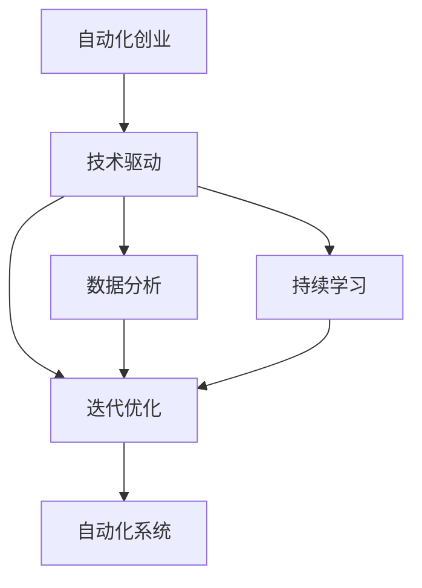

                 

# 如何在自动化创业中保持创新

> 关键词：自动化创业, 创新, 技术驱动, 人工智能, 数据分析, 持续学习, 迭代优化

## 1. 背景介绍

随着科技的飞速发展，自动化创业（Automation-driven Startup）逐渐成为各行各业竞争的重要手段。自动化技术的应用不仅可以大幅提升生产效率，降低成本，还能在高度不确定的市场环境中快速响应，抢占先机。但如何保持持续创新，避免自动化过程中的路径依赖和停滞不前，成为自动化创业中面临的重大挑战。本文将从核心概念出发，详细探讨在自动化创业中如何通过技术驱动、数据分析、持续学习等手段，实现持续创新，提升企业竞争力。

## 2. 核心概念与联系

### 2.1 核心概念概述

- **自动化创业**：指利用自动化技术（如人工智能、机器学习、数据分析等）进行业务流程自动化，以提高效率、降低成本并快速适应市场变化的创业模式。
- **技术驱动**：强调自动化技术在创业过程中的核心地位，认为技术创新是驱动企业发展的关键因素。
- **数据分析**：通过收集、分析和应用数据，指导决策，优化业务流程，提升自动化系统的效率和效果。
- **持续学习**：指自动化系统需要不断学习新的知识和技能，以适应不断变化的环境和需求。
- **迭代优化**：指通过多次循环的开发、测试、反馈和改进，逐步提升自动化系统的性能和可靠性。

这些核心概念之间相互联系，共同构成了自动化创业的完整框架。通过技术驱动，结合数据分析和持续学习，不断迭代优化，自动化创业能够实现持续创新，保持竞争优势。

### 2.2 核心概念原理和架构的 Mermaid 流程图



该流程图展示了自动化创业中各核心概念的联系。技术驱动为核心动力，数据分析和持续学习为辅助手段，迭代优化为持续改进的机制，共同作用于自动化系统，驱动企业创新。

## 3. 核心算法原理 & 具体操作步骤

### 3.1 算法原理概述

自动化创业中的持续创新，主要依赖于技术驱动和数据分析。通过应用人工智能和机器学习技术，自动化系统能够自动收集、处理和分析数据，从中挖掘出有价值的信息和模式，指导业务决策，优化运营流程。

**算法流程**：
1. **数据收集**：自动从各种数据源（如内部系统、公共数据、市场报告等）获取数据。
2. **数据处理**：对原始数据进行清洗、筛选和转换，以消除噪音，确保数据质量。
3. **数据分析**：利用机器学习算法（如回归分析、聚类分析、异常检测等）分析数据，提取有价值的模式和特征。
4. **决策支持**：基于分析结果，辅助企业做出决策，优化业务流程。
5. **迭代优化**：通过反复循环上述步骤，不断改进自动化系统的性能和效果。

### 3.2 算法步骤详解

#### 3.2.1 数据收集

数据收集是自动化创业的起点，分为内部数据和外部数据。

- **内部数据**：包括企业内部的生产数据、销售数据、客户数据等。可以通过企业信息系统（ERP、CRM等）进行自动抓取和汇总。
- **外部数据**：如市场趋势、竞争对手动态、行业报告等。可以通过网络爬虫、API接口等方式获取。

#### 3.2.2 数据处理

数据处理是保证数据质量的关键步骤，涉及数据清洗、转换和集成。

- **数据清洗**：去除重复、缺失、异常数据，确保数据的完整性和一致性。
- **数据转换**：将数据转换为标准格式，便于后续分析。
- **数据集成**：将来自不同源的数据合并成一个统一的数据集。

#### 3.2.3 数据分析

数据分析是自动化创业的核心环节，通过机器学习算法从数据中提取有用的信息。

- **回归分析**：用于预测和估计变量之间的关系，如预测销售额、成本等。
- **聚类分析**：将数据划分为不同的群组，发现数据中的内在结构。
- **异常检测**：识别数据中的异常点，预警潜在风险。

#### 3.2.4 决策支持

决策支持是将分析结果应用于实际决策的过程。

- **自动化流程优化**：通过数据分析结果，优化生产、销售、服务等流程。
- **风险预警**：根据异常检测结果，及时预警和应对潜在风险。
- **资源配置**：调整资源配置，提高运营效率。

#### 3.2.5 迭代优化

迭代优化是持续改进自动化系统性能的机制。

- **反馈收集**：收集用户和系统的反馈，识别改进需求。
- **模型更新**：基于反馈和数据分析结果，更新模型和算法。
- **系统测试**：在实验室环境下测试新算法和模型的效果。
- **部署上线**：将新模型和算法部署到实际系统中。
- **性能监控**：持续监控系统性能，确保系统稳定运行。

### 3.3 算法优缺点

#### 3.3.1 优点

- **自动化**：减少人工干预，提高效率和准确性。
- **数据驱动**：基于真实数据进行决策，减少主观偏见。
- **持续改进**：通过不断迭代优化，提高系统的适应性和可靠性。
- **实时响应**：能够快速响应市场变化，抢占先机。

#### 3.3.2 缺点

- **技术门槛高**：需要较高的技术水平和资源投入。
- **数据质量问题**：数据收集和处理过程中的质量问题可能影响分析结果。
- **算法复杂性**：复杂的机器学习算法可能带来模型解释性不足的问题。
- **成本投入**：初始的开发和部署成本较高。

### 3.4 算法应用领域

自动化创业的算法应用领域广泛，涵盖制造、零售、金融、医疗等多个行业。

- **制造业**：自动化生产线的监控和优化，降低生产成本，提升产品质量。
- **零售业**：库存管理、客户关系管理、销售预测等，提高运营效率，增强客户体验。
- **金融业**：风险评估、客户信用评分、交易监控等，提升风险控制能力。
- **医疗健康**：疾病预测、患者管理、药物研发等，提高诊疗效率，改善医疗服务。

## 4. 数学模型和公式 & 详细讲解 & 举例说明

### 4.1 数学模型构建

在自动化创业中，常用的数学模型包括回归模型、聚类模型和异常检测模型。

- **回归模型**：用于预测和估计变量之间的关系，常见的有线性回归、岭回归、Lasso回归等。
- **聚类模型**：用于将数据划分为不同的群组，常见的有K-means聚类、层次聚类等。
- **异常检测模型**：用于识别数据中的异常点，常见的有孤立森林、局部离群因子等。

### 4.2 公式推导过程

以线性回归模型为例，推导其公式和参数求解过程。

线性回归模型假设数据符合线性关系，用公式表示为：

$$
y = \beta_0 + \beta_1 x_1 + \beta_2 x_2 + \cdots + \beta_n x_n + \epsilon
$$

其中，$y$ 为输出变量，$\beta$ 为回归系数，$x_i$ 为输入变量，$\epsilon$ 为误差项。

根据最小二乘法，求解最优回归系数 $\beta$：

$$
\hat{\beta} = (X^T X)^{-1} X^T y
$$

其中，$X$ 为输入变量的矩阵，$y$ 为输出变量的向量。

### 4.3 案例分析与讲解

#### 4.3.1 回归分析案例

假设某制造企业希望通过销售数据预测未来一个月的销售额，使用线性回归模型进行预测。

- **数据准备**：收集历史销售数据，包括时间、销售额、促销活动等。
- **模型训练**：构建线性回归模型，训练数据集。
- **模型评估**：使用测试数据集评估模型性能，计算均方误差等指标。
- **决策支持**：根据预测结果，调整销售策略，优化库存管理。

#### 4.3.2 聚类分析案例

某零售企业希望将客户分为不同群体，针对不同群体进行个性化营销。

- **数据准备**：收集客户购买数据，包括年龄、性别、消费金额等。
- **模型训练**：使用K-means聚类算法，对客户数据进行聚类。
- **模型评估**：评估聚类结果的合理性，调整聚类参数。
- **决策支持**：根据聚类结果，制定个性化营销策略，提升客户满意度和忠诚度。

## 5. 项目实践：代码实例和详细解释说明

### 5.1 开发环境搭建

为了进行自动化创业中的数据分析和决策支持，需要搭建一个高性能的开发环境。

- **环境配置**：安装Python、R等数据分析工具，配置相应的库和依赖。
- **数据源配置**：连接企业信息系统、公共数据API等数据源，确保数据收集的及时性和准确性。
- **存储配置**：使用Hadoop、Spark等分布式存储系统，存储大规模数据。

### 5.2 源代码详细实现

以线性回归模型为例，展示其代码实现过程。

```python
import pandas as pd
from sklearn.linear_model import LinearRegression

# 数据准备
data = pd.read_csv('sales_data.csv')
X = data[['time', 'promotion', 'temperature']]
y = data['sales']

# 模型训练
model = LinearRegression()
model.fit(X, y)

# 模型评估
test_data = pd.read_csv('test_sales_data.csv')
X_test = test_data[['time', 'promotion', 'temperature']]
y_pred = model.predict(X_test)

# 性能评估
from sklearn.metrics import mean_squared_error
mse = mean_squared_error(y_test, y_pred)
print('Mean Squared Error:', mse)
```

### 5.3 代码解读与分析

#### 5.3.1 数据准备

使用Pandas库读取销售数据，将时间、促销活动、温度等特征作为输入变量，销售额作为输出变量。

#### 5.3.2 模型训练

使用Scikit-learn库中的线性回归模型进行训练。调用`fit`方法拟合数据，求解回归系数。

#### 5.3.3 模型评估

使用测试数据集评估模型性能。调用`predict`方法进行预测，使用均方误差（MSE）指标评估模型预测精度。

## 6. 实际应用场景

### 6.1 制造企业自动化生产线监控

某制造企业通过自动化创业，建立了一套自动化生产线监控系统。

- **数据收集**：自动收集生产设备的运行数据，包括温度、压力、振动等。
- **数据处理**：清洗和转换数据，消除噪音。
- **数据分析**：使用回归分析模型预测设备故障，预警和维护设备。
- **决策支持**：根据故障预测结果，调整设备维护计划，降低停机率。

### 6.2 零售企业库存管理

某零售企业通过自动化创业，建立了库存管理系统。

- **数据收集**：自动收集销售数据、库存数据、物流数据等。
- **数据处理**：清洗和转换数据，确保数据一致性。
- **数据分析**：使用聚类分析模型对商品进行分类，优化库存结构。
- **决策支持**：根据聚类结果，制定库存优化策略，减少库存积压。

### 6.3 金融企业风险评估

某金融企业通过自动化创业，建立了风险评估系统。

- **数据收集**：自动收集贷款申请数据、信用记录、财务报表等。
- **数据处理**：清洗和转换数据，确保数据完整性。
- **数据分析**：使用异常检测模型识别高风险客户，预警潜在违约风险。
- **决策支持**：根据风险预警结果，调整贷款审批策略，降低不良贷款率。

### 6.4 医疗健康疾病预测

某医疗健康企业通过自动化创业，建立了疾病预测系统。

- **数据收集**：自动收集患者病历数据、体检数据、基因数据等。
- **数据处理**：清洗和转换数据，确保数据一致性。
- **数据分析**：使用回归分析模型预测疾病风险，早期预警和干预。
- **决策支持**：根据预测结果，制定个性化治疗方案，提升诊疗效果。

## 7. 工具和资源推荐

### 7.1 学习资源推荐

为了掌握自动化创业的核心技术，推荐以下学习资源：

- **《Python数据分析基础》**：介绍Python数据分析的基础知识和常用工具，如Pandas、NumPy等。
- **《机器学习实战》**：讲解常用的机器学习算法和实际应用案例。
- **《TensorFlow实战》**：介绍TensorFlow的使用和实践，涵盖深度学习和数据分析的应用。
- **《Data Science实战》**：讲解数据分析、数据可视化和数据工程的技术和方法。

### 7.2 开发工具推荐

以下是自动化创业中常用的开发工具：

- **Python**：Python是数据科学和机器学习领域的主流语言，拥有丰富的库和工具。
- **R语言**：R是统计分析领域的常用工具，适用于数据处理和统计建模。
- **TensorFlow**：Google开发的深度学习框架，支持大规模分布式计算。
- **PyTorch**：Facebook开发的深度学习框架，易于使用，支持动态计算图。
- **Jupyter Notebook**：交互式编程环境，支持代码开发和结果展示。

### 7.3 相关论文推荐

为了深入理解自动化创业的理论和技术，推荐以下相关论文：

- **《深度学习在制造中的应用》**：介绍深度学习在制造企业中的应用案例和效果。
- **《机器学习在零售业的应用》**：讲解机器学习在零售业中的数据驱动决策。
- **《异常检测在金融风险管理中的应用》**：探讨异常检测技术在金融风险评估中的应用。
- **《基于数据分析的个性化医疗》**：介绍数据分析在个性化医疗中的应用，提升诊疗效果。

## 8. 总结：未来发展趋势与挑战

### 8.1 研究成果总结

自动化创业中的持续创新，是技术驱动、数据分析、持续学习和迭代优化共同作用的结果。通过应用先进的机器学习算法和工具，自动化创业能够在数据驱动下，实现业务流程的自动化和优化，提升企业竞争力。

### 8.2 未来发展趋势

未来，自动化创业将呈现以下几个发展趋势：

- **技术创新加速**：随着技术进步和算法优化，自动化创业将不断突破现有界限，实现更高的自动化水平和效率。
- **数据资源丰富**：随着数据采集和存储技术的提升，数据资源将更加丰富，有助于更深层次的数据分析和决策支持。
- **跨领域融合**：自动化创业将与其他技术领域（如物联网、云计算等）深度融合，推动跨领域的创新。
- **个性化服务**：基于数据分析和机器学习，自动化创业将提供更加个性化的服务，满足不同用户的需求。

### 8.3 面临的挑战

尽管自动化创业在发展中取得了显著进展，但仍面临一些挑战：

- **数据隐私和安全**：自动化创业需要处理大量敏感数据，数据隐私和安全问题成为重要挑战。
- **技术门槛较高**：需要较高的技术水平和资源投入，对企业内部技术团队的要求较高。
- **算法复杂性**：复杂的算法可能带来模型解释性不足的问题，难以理解和解释自动化系统的决策过程。
- **数据质量问题**：数据收集和处理过程中的质量问题可能影响分析结果，需要持续优化数据质量。

### 8.4 研究展望

为了应对上述挑战，未来的自动化创业研究需要在以下几个方面取得突破：

- **数据隐私和安全**：采用隐私保护技术，如数据匿名化、差分隐私等，保护用户隐私。
- **技术门槛降低**：开发易用、易维护的工具和平台，降低技术门槛。
- **模型解释性增强**：开发可解释性强的算法和模型，提高自动化系统的透明度和可信度。
- **数据质量优化**：建立完善的数据质量管理体系，确保数据准确性和一致性。

## 9. 附录：常见问题与解答

### Q1：自动化创业需要哪些核心技术？

A: 自动化创业需要以下核心技术：

- **数据收集和处理**：通过爬虫、API接口等手段，自动化收集和处理数据。
- **数据分析和建模**：利用机器学习算法，对数据进行分析和建模。
- **决策支持**：根据分析结果，提供决策支持，优化业务流程。

### Q2：自动化创业面临的主要挑战是什么？

A: 自动化创业面临的主要挑战包括：

- **数据隐私和安全**：处理大量敏感数据，数据隐私和安全问题不容忽视。
- **技术门槛较高**：需要较高的技术水平和资源投入，对企业内部技术团队的要求较高。
- **算法复杂性**：复杂的算法可能带来模型解释性不足的问题。
- **数据质量问题**：数据收集和处理过程中的质量问题可能影响分析结果。

### Q3：自动化创业的未来发展方向是什么？

A: 自动化创业的未来发展方向包括：

- **技术创新加速**：随着技术进步和算法优化，自动化创业将不断突破现有界限。
- **数据资源丰富**：数据采集和存储技术的提升，数据资源将更加丰富。
- **跨领域融合**：与其他技术领域深度融合，推动跨领域的创新。
- **个性化服务**：基于数据分析和机器学习，提供更加个性化的服务，满足不同用户的需求。

### Q4：如何进行自动化创业的持续创新？

A: 自动化创业的持续创新需要以下几个步骤：

- **数据收集和处理**：通过自动化手段收集和处理数据，确保数据质量。
- **数据分析和建模**：利用机器学习算法，对数据进行分析和建模。
- **决策支持**：根据分析结果，提供决策支持，优化业务流程。
- **迭代优化**：不断收集反馈，优化算法和模型，提升系统性能。

### Q5：如何在自动化创业中应用人工智能？

A: 在自动化创业中，可以通过以下步骤应用人工智能：

- **数据收集**：自动从各种数据源获取数据。
- **数据处理**：对原始数据进行清洗、筛选和转换，以消除噪音，确保数据质量。
- **数据分析**：利用人工智能算法（如回归分析、聚类分析、异常检测等）从数据中提取有用的信息。
- **决策支持**：基于分析结果，辅助企业做出决策，优化业务流程。

通过以上分析，我们可以看到，自动化创业中的持续创新离不开技术驱动、数据分析、持续学习和迭代优化的共同作用。未来，自动化创业将在人工智能和大数据技术的推动下，实现更高的自动化水平和效率，为各行各业带来深刻变革。

