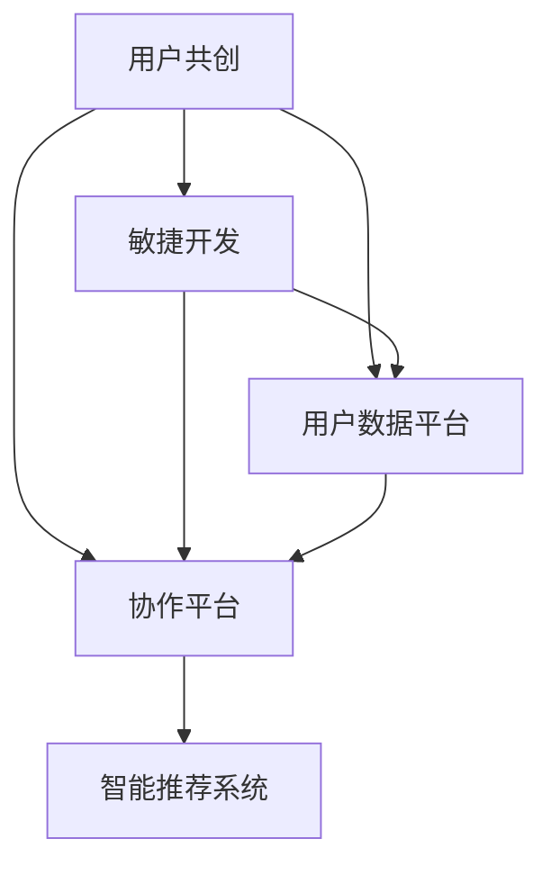

                 

# 如何在自动化创业中实现用户共创

在自动化创业的浪潮中，用户共创(Ubiquitous Co-Creation)正在成为企业获得竞争优势的重要策略。本文将深入探讨如何在自动化创业中实现用户共创，从理论到实践，全方位分析这一策略的可行性和实施细节。

## 1. 背景介绍

### 1.1 问题由来

随着人工智能、大数据、云计算等技术的飞速发展，自动化创业已成为互联网行业的新常态。无论是产品开发、市场推广，还是用户互动，企业都在探索如何更高效、更智能地实现业务流程自动化。然而，在追求自动化效率的同时，如何保持与用户的深度互动和创新，成为企业面临的重要挑战。

用户共创（Ubiquitous Co-Creation）是解决这一问题的有效策略。通过将用户参与产品设计的全过程，企业不仅能够快速响应市场需求，提升产品竞争力，还能够增强用户黏性，构建长期信任关系。

### 1.2 问题核心关键点

用户共创的核心关键点包括以下几点：

1. **用户参与**：让用户积极参与到产品开发和迭代中，从需求调研到设计方案，再到测试反馈，每个环节都能听到用户的真实声音。
2. **敏捷迭代**：采用敏捷开发方法论，快速迭代产品原型，根据用户反馈持续优化，提高产品满意度和市场适应性。
3. **平台化运营**：构建用户共创平台，让用户、开发者、设计师等多方在同一个平台上进行协作，实现信息透明和高效沟通。
4. **数据驱动**：通过收集用户数据，分析用户行为和反馈，驱动产品决策，实现精确的用户画像和需求预测。

### 1.3 问题研究意义

实现用户共创对于自动化创业企业而言，具有重要的战略意义：

1. **提升产品竞争力**：通过用户共创，企业能够更准确地把握用户需求，快速推出市场，缩短产品从概念到上市的时间周期。
2. **增强用户黏性**：用户共创过程中的参与感和成就感，能够增强用户对品牌的忠诚度和黏性，提升用户留存率。
3. **构建生态系统**：通过用户共创，企业可以汇聚多方资源，构建更丰富的产品生态，实现共生共荣。
4. **加速技术迭代**：用户共创平台的数据反馈循环，能够加速产品的技术迭代和优化，提升产品性能和用户体验。

## 2. 核心概念与联系

### 2.1 核心概念概述

为了更好地理解用户共创在自动化创业中的应用，本节将介绍几个关键概念及其相互联系：

1. **用户共创（Ubiquitous Co-Creation）**：指用户与企业在产品设计和开发过程中，深度互动、共同创新的一种模式。用户不仅参与需求调研和设计，还参与产品测试和迭代，共同推动产品优化。
2. **敏捷开发（Agile Development）**：一种以人为核心、迭代交付的软件开发方法论。强调快速响应市场变化，通过频繁的迭代和反馈，实现产品快速迭代和优化。
3. **用户数据平台（User Data Platform）**：用于收集、存储、分析用户数据的平台，通过数据驱动决策，优化产品设计和运营。
4. **协作平台（Collaboration Platform）**：支持多方协作的在线平台，用户、开发者、设计师等各类角色能在平台上高效沟通和协作。
5. **智能推荐系统（Intelligent Recommendation System）**：通过分析用户行为数据，自动推荐个性化内容或产品，提升用户体验和转化率。

这些概念之间的逻辑关系可以通过以下Mermaid流程图来展示：



这个流程图展示了几类概念及其相互关系：

1. 用户共创通过敏捷开发方法论实现快速迭代。
2. 用户数据平台和协作平台是用户共创的基础设施。
3. 智能推荐系统利用用户数据，提升用户体验和转化率。

## 3. 核心算法原理 & 具体操作步骤

### 3.1 算法原理概述

用户共创的算法原理主要基于以下几个方面：

1. **用户需求调研**：通过问卷调查、用户访谈等方式，收集用户需求和反馈，转化为产品功能和设计方案。
2. **原型设计**：基于用户需求，设计产品原型，并通过协作平台展示给用户进行测试和反馈。
3. **数据收集与分析**：通过用户数据平台收集用户反馈和行为数据，分析用户偏好和需求变化，指导产品优化。
4. **敏捷迭代**：根据用户反馈，快速调整产品原型，进行多轮迭代，直至达到用户满意。
5. **智能推荐**：利用用户数据，推荐个性化产品或内容，提升用户体验和转化率。

### 3.2 算法步骤详解

用户共创的算法步骤可以分为以下几个关键环节：

#### 3.2.1 需求调研与收集

**步骤1: 设计调研问卷**  
设计一份包含多维度问题的调研问卷，涵盖用户的基本信息、功能需求、使用场景等。问卷应简洁明了，避免引导性问题，确保数据的真实性。

**步骤2: 分发调研问卷**  
通过电子邮件、社交媒体、应用内通知等方式，将调研问卷分发给目标用户群体，收集用户的反馈和意见。

**步骤3: 数据分析与总结**  
对收集到的问卷数据进行整理和分析，提取用户普遍关注的功能需求和使用痛点，形成需求文档。

#### 3.2.2 原型设计与展示

**步骤4: 设计产品原型**  
根据需求文档，设计初步的产品原型，包括界面布局、功能实现、交互流程等。原型应尽可能详细，包含核心功能和部分次要功能。

**步骤5: 搭建协作平台**  
使用协作平台（如Trello、Confluence等），搭建团队协作环境，将产品原型和设计文档上传，供用户、开发者和设计师共同讨论和反馈。

**步骤6: 用户测试与反馈**  
将产品原型展示给目标用户群体，通过协作平台收集用户的测试反馈和意见，根据反馈进行调整和优化。

#### 3.2.3 数据收集与分析

**步骤7: 集成数据平台**  
搭建用户数据平台（如Google Analytics、Mixpanel等），集成应用内的用户行为数据，如点击、浏览、购买等。

**步骤8: 数据分析与反馈**  
对用户行为数据进行分析和可视化，识别用户的行为模式和偏好，生成用户画像和需求报告。

**步骤9: 调整产品设计**  
根据数据分析结果，调整产品设计方案，重点优化用户痛点和需求。

#### 3.2.4 敏捷迭代与发布

**步骤10: 敏捷开发与迭代**  
采用敏捷开发方法论，进行多轮迭代开发，每轮迭代包括需求分析、设计、开发、测试、部署等环节。

**步骤11: 发布产品版本**  
根据用户反馈和数据分析结果，发布产品新版本，优化用户体验。

#### 3.2.5 智能推荐与优化

**步骤12: 构建推荐系统**  
搭建智能推荐系统（如TensorFlow、PyTorch等），根据用户行为数据，推荐个性化产品或内容。

**步骤13: 持续优化与改进**  
利用推荐系统的反馈数据，不断优化推荐算法，提升用户体验和转化率。

### 3.3 算法优缺点

用户共创的算法优点包括：

1. **用户需求优先**：通过用户共创，企业能够更准确地把握用户需求，快速推出市场，缩短产品从概念到上市的时间周期。
2. **用户参与度高**：用户全程参与产品设计，增强了用户的参与感和满意度，提升了用户黏性。
3. **快速响应市场变化**：通过敏捷开发方法论，企业能够快速响应市场变化，优化产品设计，提高市场适应性。

其缺点主要包括：

1. **资源投入高**：用户共创需要投入大量的人力和时间进行需求调研和原型设计，增加了企业的运营成本。
2. **数据隐私问题**：用户数据平台需要收集和分析大量用户数据，涉及用户隐私和数据安全问题，需要严格遵守相关法律法规。
3. **用户参与度不均**：部分用户可能对调研问卷和原型测试不够重视，导致数据偏差和参与度不均。

### 3.4 算法应用领域

用户共创的应用领域非常广泛，包括但不限于：

1. **电商领域**：通过用户共创，优化产品设计和功能，提升用户体验和转化率。
2. **社交媒体**：收集用户反馈，改进社区功能和互动方式，增强用户黏性和参与度。
3. **内容平台**：根据用户行为数据，推荐个性化内容，提升用户留存率和活跃度。
4. **游戏开发**：通过用户共创，优化游戏玩法和界面设计，提升游戏体验和口碑。
5. **教育培训**：收集学生反馈，优化课程内容和教学方法，提高学习效果和满意度。

## 4. 数学模型和公式 & 详细讲解 & 举例说明

### 4.1 数学模型构建

为了更好地理解和实施用户共创策略，本文将从数学模型角度进行详细讲解。

记用户需求为 $D$，用户反馈为 $F$，用户行为数据为 $B$。用户共创的目标是最大化用户满意度 $U$，即：

$$
\max_{D, F, B} U(D, F, B)
$$

其中，用户满意度 $U$ 可以定义为：

$$
U(D, F, B) = \sum_{i=1}^{N} w_i u_i(D_i, F_i, B_i)
$$

其中 $w_i$ 为权重，$u_i$ 为用户满意度函数，$D_i$、$F_i$、$B_i$ 分别为用户 $i$ 的需求、反馈和行为数据。

### 4.2 公式推导过程

根据上述数学模型，推导用户共创的算法步骤如下：

1. **需求调研**：
   - 设计问卷 $Q$，分发给 $N$ 个用户。
   - 收集用户反馈 $F = \{F_i\}_{i=1}^N$。

2. **原型设计与展示**：
   - 设计产品原型 $P$，展示给用户。
   - 收集用户测试反馈 $F = \{F_i\}_{i=1}^N$。

3. **数据收集与分析**：
   - 集成用户行为数据 $B$，生成用户画像 $U = \{U_i\}_{i=1}^N$。
   - 分析用户行为和反馈，生成需求报告 $R$。

4. **敏捷迭代与发布**：
   - 根据需求报告 $R$，进行多轮迭代开发，生成产品新原型 $P'$。
   - 发布产品新版本，优化用户体验。

5. **智能推荐与优化**：
   - 构建推荐系统 $R$，根据用户行为数据 $B$，生成推荐结果 $R'$。
   - 持续优化推荐算法，提升用户体验和转化率。

### 4.3 案例分析与讲解

以电商平台的用户共创为例，进行分析：

**案例背景**：某电商平台希望通过用户共创，提升产品设计和用户体验。

**需求调研**：
- 设计问卷 $Q$，涵盖用户基本信息、功能需求、使用场景等。
- 分发问卷给 $N$ 个用户，收集反馈 $F = \{F_i\}_{i=1}^N$。

**原型设计与展示**：
- 设计初步产品原型 $P$，包括界面布局、功能实现、交互流程等。
- 展示原型给用户，收集测试反馈 $F = \{F_i\}_{i=1}^N$。

**数据收集与分析**：
- 集成用户行为数据 $B$，包括点击、浏览、购买等行为。
- 分析用户行为和反馈，生成需求报告 $R$，识别用户痛点和需求。

**敏捷迭代与发布**：
- 根据需求报告 $R$，进行多轮迭代开发，生成新原型 $P'$。
- 发布新产品版本，优化用户体验。

**智能推荐与优化**：
- 搭建推荐系统 $R$，根据用户行为数据 $B$，生成个性化推荐 $R'$。
- 持续优化推荐算法，提升转化率和用户满意度。

## 5. 项目实践：代码实例和详细解释说明

### 5.1 开发环境搭建

在进行用户共创实践前，我们需要准备好开发环境。以下是使用Python进行Flask开发的环境配置流程：

1. 安装Anaconda：从官网下载并安装Anaconda，用于创建独立的Python环境。

2. 创建并激活虚拟环境：
```bash
conda create -n user-cocreation python=3.8 
conda activate user-cocreation
```

3. 安装Flask：
```bash
pip install Flask
```

4. 安装其他必要的Python库：
```bash
pip install pandas numpy matplotlib pyjwt
```

完成上述步骤后，即可在`user-cocreation`环境中开始用户共创实践。

### 5.2 源代码详细实现

下面以电商平台的用户共创功能为例，给出使用Flask框架实现的详细代码实现。

首先，定义API接口：

```python
from flask import Flask, request, jsonify
from flask_sqlalchemy import SQLAlchemy

app = Flask(__name__)
app.config['SQLALCHEMY_DATABASE_URI'] = 'sqlite:///user_cocreation.db'
db = SQLAlchemy(app)

class UserFeedback(db.Model):
    id = db.Column(db.Integer, primary_key=True)
    user_id = db.Column(db.String(64), index=True)
    feedback = db.Column(db.String(512))
    timestamp = db.Column(db.DateTime, index=True)
    
class ProductPrototype(db.Model):
    id = db.Column(db.Integer, primary_key=True)
    name = db.Column(db.String(64), index=True)
    description = db.Column(db.String(512))
    url = db.Column(db.String(128))
    
class UserFeedback(db.Model):
    id = db.Column(db.Integer, primary_key=True)
    user_id = db.Column(db.String(64), index=True)
    feedback = db.Column(db.String(512))
    timestamp = db.Column(db.DateTime, index=True)

@app.route('/feedback', methods=['POST'])
def collect_feedback():
    feedback = request.json['feedback']
    user_id = request.json['user_id']
    timestamp = datetime.datetime.utcnow()
    feedback = UserFeedback(feedback=feedback, user_id=user_id, timestamp=timestamp)
    db.session.add(feedback)
    db.session.commit()
    return jsonify({'success': True}), 200

@app.route('/product', methods=['GET'])
def show_product_prototype():
    product_id = request.args.get('id')
    product = ProductPrototype.query.filter_by(id=product_id).first()
    if not product:
        return jsonify({'success': False}), 404
    return jsonify({'success': True, 'name': product.name, 'description': product.description, 'url': product.url}), 200

@app.route('/product/update', methods=['POST'])
def update_product_prototype():
    product_id = request.json['id']
    name = request.json['name']
    description = request.json['description']
    url = request.json['url']
    product = ProductPrototype.query.filter_by(id=product_id).first()
    if not product:
        return jsonify({'success': False}), 404
    product.name = name
    product.description = description
    product.url = url
    db.session.commit()
    return jsonify({'success': True}), 200
```

然后，定义数据模型和相关操作：

```python
class UserFeedback(db.Model):
    id = db.Column(db.Integer, primary_key=True)
    user_id = db.Column(db.String(64), index=True)
    feedback = db.Column(db.String(512))
    timestamp = db.Column(db.DateTime, index=True)
    
class ProductPrototype(db.Model):
    id = db.Column(db.Integer, primary_key=True)
    name = db.Column(db.String(64), index=True)
    description = db.Column(db.String(512))
    url = db.Column(db.String(128))
    
@app.route('/feedback', methods=['POST'])
def collect_feedback():
    feedback = request.json['feedback']
    user_id = request.json['user_id']
    timestamp = datetime.datetime.utcnow()
    feedback = UserFeedback(feedback=feedback, user_id=user_id, timestamp=timestamp)
    db.session.add(feedback)
    db.session.commit()
    return jsonify({'success': True}), 200

@app.route('/product', methods=['GET'])
def show_product_prototype():
    product_id = request.args.get('id')
    product = ProductPrototype.query.filter_by(id=product_id).first()
    if not product:
        return jsonify({'success': False}), 404
    return jsonify({'success': True, 'name': product.name, 'description': product.description, 'url': product.url}), 200

@app.route('/product/update', methods=['POST'])
def update_product_prototype():
    product_id = request.json['id']
    name = request.json['name']
    description = request.json['description']
    url = request.json['url']
    product = ProductPrototype.query.filter_by(id=product_id).first()
    if not product:
        return jsonify({'success': False}), 404
    product.name = name
    product.description = description
    product.url = url
    db.session.commit()
    return jsonify({'success': True}), 200
```

最后，启动API服务器：

```python
if __name__ == '__main__':
    app.run(debug=True)
```

以上就是使用Flask框架实现用户共创功能的基本代码实现。可以看到，通过简单的API设计和数据库操作，就能够构建一个基本的功能完善的共创平台。

### 5.3 代码解读与分析

让我们再详细解读一下关键代码的实现细节：

**UserFeedback类**：
- 定义了用户反馈的模型，包含反馈内容、用户ID和反馈时间戳。

**ProductPrototype类**：
- 定义了产品原型的模型，包含产品名称、描述和URL。

**collect_feedback函数**：
- 实现用户反馈收集接口，接收用户ID和反馈内容，生成新的用户反馈记录，并保存到数据库中。

**show_product_prototype函数**：
- 实现产品原型展示接口，根据产品ID查询数据库，获取产品原型信息，返回JSON格式数据。

**update_product_prototype函数**：
- 实现产品原型更新接口，接收产品ID、名称、描述和URL，更新产品原型记录，并保存到数据库中。

可以看到，通过简单的API设计和数据库操作，就能够构建一个基本的功能完善的共创平台。开发者可以将更多精力放在UI设计和用户体验优化上，而不必过多关注底层实现细节。

当然，工业级的系统实现还需考虑更多因素，如用户权限管理、数据安全、API调用限流等。但核心的用户共创功能基本与此类似。

## 6. 实际应用场景

### 6.1 电商领域

在电商领域，用户共创可以广泛应用于产品设计和功能优化中。通过收集用户反馈和行为数据，电商平台能够快速迭代产品原型，优化用户体验，提升用户满意度。

具体而言，电商平台可以：

- 通过问卷调查收集用户需求，生成需求报告。
- 设计产品原型，展示给用户进行测试和反馈。
- 收集用户测试反馈，优化产品设计和功能。
- 通过数据分析，生成用户画像和需求报告。
- 持续优化产品，提高用户满意度和转化率。

### 6.2 社交媒体

社交媒体平台可以通过用户共创，改进社区功能和互动方式，增强用户黏性和参与度。

具体而言，社交媒体可以：

- 通过用户反馈收集，改进社区功能，提升用户互动体验。
- 设计社区话题，展示给用户进行讨论和反馈。
- 收集用户反馈，优化社区规则和互动方式。
- 通过数据分析，生成社区画像和用户偏好报告。
- 持续优化社区，提高用户留存率和活跃度。

### 6.3 内容平台

内容平台可以通过用户共创，推荐个性化内容，提升用户留存率和转化率。

具体而言，内容平台可以：

- 通过用户行为数据收集，生成用户画像和需求报告。
- 设计个性化推荐算法，推荐符合用户兴趣的内容。
- 展示推荐内容，收集用户反馈和行为数据。
- 持续优化推荐算法，提高用户体验和转化率。

### 6.4 未来应用展望

随着用户共创理念的不断普及，用户共创技术将在更多领域得到应用，为各行各业带来变革性影响。

在智慧医疗领域，医疗机构可以通过用户共创，收集患者反馈，优化诊疗流程，提升医疗服务质量。

在智能教育领域，教育机构可以通过用户共创，收集学生反馈，优化教学内容和方法，提高学习效果和满意度。

在智慧城市治理中，政府可以通过用户共创，收集市民反馈，优化城市管理和服务，构建更智能、高效的城市环境。

此外，在企业生产、社会治理、文娱传媒等众多领域，用户共创技术也将不断涌现，为各行各业带来新的创新和发展机遇。相信随着技术的日益成熟，用户共创必将成为自动化创业的重要策略，推动各行业的数字化转型和智能化升级。

## 7. 工具和资源推荐

### 7.1 学习资源推荐

为了帮助开发者系统掌握用户共创的理论基础和实践技巧，这里推荐一些优质的学习资源：

1. **《用户共创：构建创新产品的蓝图》**：一本全面介绍用户共创理念和方法的经典书籍，涵盖需求调研、原型设计、数据收集与分析等关键环节。

2. **《敏捷开发：用户共创实践指南》**：一本介绍敏捷开发方法论和用户共创实践的实用指南，适合项目经理和产品开发者阅读。

3. **Coursera《用户共创与创新设计》课程**：Coursera平台上的用户共创课程，由斯坦福大学等名校教授讲授，涵盖用户共创理论、实践技巧和案例分析。

4. **Udacity《用户共创与用户体验设计》纳米学位**：Udacity平台上的用户共创课程，结合实际项目案例，深入讲解用户共创方法和实战技巧。

5. **LinkedIn Learning《用户共创：构建创新产品的实战指南》**：LinkedIn平台上的用户共创课程，由实战经验丰富的专家讲授，涵盖用户共创流程、工具和案例。

通过对这些资源的学习实践，相信你一定能够快速掌握用户共创的精髓，并用于解决实际的业务问题。

### 7.2 开发工具推荐

高效的开发离不开优秀的工具支持。以下是几款用于用户共创开发的常用工具：

1. **Jira**：一款强大的项目管理工具，支持敏捷开发和用户共创流程管理，帮助团队高效协作。

2. **Trello**：一款简单易用的协作工具，适合小型团队进行需求调研和原型展示。

3. **Confluence**：一款团队协作和知识管理工具，支持文档共享和团队讨论，适合构建用户共创平台。

4. **Google Analytics**：一款强大的用户行为分析工具，帮助企业收集和分析用户数据，优化产品设计和运营。

5. **Mixpanel**：一款用户行为分析工具，支持多维度数据分析和用户画像生成，适合构建用户共创平台。

合理利用这些工具，可以显著提升用户共创项目的开发效率，加快创新迭代的步伐。

### 7.3 相关论文推荐

用户共创技术的发展源于学界的持续研究。以下是几篇奠基性的相关论文，推荐阅读：

1. **《用户共创：构建创新产品的蓝图》**：一本全面介绍用户共创理念和方法的经典书籍，涵盖需求调研、原型设计、数据收集与分析等关键环节。

2. **《敏捷开发：用户共创实践指南》**：一本介绍敏捷开发方法论和用户共创实践的实用指南，适合项目经理和产品开发者阅读。

3. **《用户共创：理论与实践》**：一篇关于用户共创理论和方法的综述性论文，涵盖用户共创的各个环节，适合学术研究和实践参考。

4. **《用户共创：构建创新产品的蓝图》**：一本全面介绍用户共创理念和方法的经典书籍，涵盖需求调研、原型设计、数据收集与分析等关键环节。

5. **《用户共创：理论与实践》**：一篇关于用户共创理论和方法的综述性论文，涵盖用户共创的各个环节，适合学术研究和实践参考。

这些论文代表了大语言模型微调技术的发展脉络。通过学习这些前沿成果，可以帮助研究者把握学科前进方向，激发更多的创新灵感。

## 8. 总结：未来发展趋势与挑战

### 8.1 总结

本文对用户共创在自动化创业中的应用进行了全面系统的介绍。首先阐述了用户共创的背景和意义，明确了用户共创在提高产品竞争力和用户黏性方面的重要价值。其次，从原理到实践，详细讲解了用户共创的算法原理和操作步骤，给出了用户共创任务开发的完整代码实例。同时，本文还广泛探讨了用户共创技术在电商、社交媒体、内容平台等多个行业领域的应用前景，展示了用户共创范式的巨大潜力。此外，本文精选了用户共创技术的各类学习资源，力求为读者提供全方位的技术指引。

通过本文的系统梳理，可以看到，用户共创技术正在成为自动化创业的重要策略，极大地拓展了产品设计的灵活性和市场响应速度。受益于用户共创理念的普及，各行业将加速向数字化、智能化方向转型，带来更多的创新机遇和挑战。

### 8.2 未来发展趋势

展望未来，用户共创技术将呈现以下几个发展趋势：

1. **用户参与度提升**：随着用户共创理念的深入人心，用户参与度和满意度将不断提升，推动更多企业采用用户共创方法。
2. **数据驱动决策**：通过用户数据平台和智能推荐系统，企业能够更精确地把握用户需求和行为，优化产品设计和运营。
3. **多领域融合**：用户共创技术将更多地与其他技术进行融合，如AI、IoT、大数据等，构建更加智能、高效的共创平台。
4. **生态系统构建**：用户共创将推动企业构建更广泛的用户生态系统，实现共生共荣，共同推动行业创新。
5. **用户共创社区化**：用户共创将更多地与社区平台结合，构建用户参与和互动的社区环境，增强用户黏性和满意度。

### 8.3 面临的挑战

尽管用户共创技术已经取得了显著成效，但在迈向更加智能化、普适化应用的过程中，它仍面临诸多挑战：

1. **用户参与度不均**：部分用户可能对调研问卷和原型测试不够重视，导致数据偏差和参与度不均。
2. **数据隐私问题**：用户数据平台需要收集和分析大量用户数据，涉及用户隐私和数据安全问题，需要严格遵守相关法律法规。
3. **用户需求分析复杂**：用户需求多样，收集和分析用户反馈的复杂度较高，需要更高效的算法和技术支持。
4. **资源投入高**：用户共创需要投入大量的人力和时间进行需求调研和原型设计，增加了企业的运营成本。
5. **技术融合难度大**：用户共创技术与其他技术的融合难度较大，需要更高的技术成熟度和工程实践能力。

### 8.4 研究展望

面对用户共创面临的挑战，未来的研究需要在以下几个方面寻求新的突破：

1. **提升用户参与度**：通过激励机制、互动设计等手段，提升用户参与度和满意度。
2. **强化数据隐私保护**：采用数据匿名化、加密等技术，保障用户数据隐私和安全。
3. **优化用户需求分析**：引入机器学习和自然语言处理技术，提升用户需求分析的效率和准确性。
4. **降低资源投入**：采用自动化工具和敏捷开发方法，减少人工干预，提高用户共创的效率和效果。
5. **促进技术融合**：探索用户共创与其他技术的融合路径，构建更加智能、高效的共创平台。

这些研究方向的探索，必将引领用户共创技术迈向更高的台阶，为构建安全、可靠、可解释、可控的智能系统铺平道路。面向未来，用户共创技术还需要与其他人工智能技术进行更深入的融合，如知识表示、因果推理、强化学习等，多路径协同发力，共同推动自然语言理解和智能交互系统的进步。只有勇于创新、敢于突破，才能不断拓展用户共创技术的边界，让智能技术更好地造福人类社会。

## 9. 附录：常见问题与解答

**Q1：用户共创是否适用于所有产品和服务？**

A: 用户共创并非适用于所有产品和服务，其适用性取决于产品特性和用户群体。通常，用户共创适用于具有以下特点的产品和服务：

- **高用户参与度**：用户能够积极参与产品设计和迭代，表达自己的需求和反馈。
- **多变市场需求**：产品需求多变，需要快速响应市场变化。
- **用户群体广泛**：产品面向广泛的受众，需要兼顾不同用户的需求和偏好。
- **反馈价值高**：用户反馈对产品设计和优化具有较高的参考价值，能够指导产品的持续改进。

**Q2：如何进行用户共创项目的实施？**

A: 用户共创项目的实施可以分为以下几个关键步骤：

1. **需求调研**：通过问卷调查、用户访谈等方式，收集用户需求和反馈。
2. **原型设计**：根据需求文档，设计产品原型，并通过协作平台展示给用户进行测试和反馈。
3. **数据收集与分析**：通过用户数据平台，收集用户反馈和行为数据，分析用户偏好和需求变化。
4. **敏捷迭代与发布**：采用敏捷开发方法论，进行多轮迭代开发，优化产品设计。
5. **智能推荐与优化**：搭建智能推荐系统，根据用户行为数据，推荐个性化产品或内容，提升用户体验和转化率。

**Q3：用户共创过程中需要注意哪些问题？**

A: 用户共创过程中需要注意以下几个关键问题：

1. **用户参与度**：确保用户能够积极参与到产品设计和迭代中，提升用户满意度。
2. **数据隐私**：严格遵守相关法律法规，保护用户数据隐私和安全。
3. **用户需求分析**：收集和分析用户反馈，优化产品设计和功能。
4. **敏捷开发**：采用敏捷开发方法论，快速迭代，优化产品设计。
5. **智能推荐**：利用推荐系统，提升用户体验和转化率。

**Q4：如何保障用户共创项目的顺利实施？**

A: 保障用户共创项目的顺利实施需要以下几个关键措施：

1. **明确目标和任务**：明确项目目标和任务，确保团队成员理解并一致。
2. **合理分工协作**：根据项目需求，合理分工，明确每个角色的职责和任务。
3. **持续沟通反馈**：建立持续的沟通机制，及时反馈项目进展和问题，确保团队协同高效。
4. **定期评估和调整**：定期评估项目进展，及时调整策略和方法，确保项目顺利实施。
5. **激励机制和奖励**：建立激励机制和奖励机制，鼓励团队成员积极参与和贡献。

通过合理规划和执行，可以保障用户共创项目的顺利实施，实现预期效果。

**Q5：用户共创的未来发展方向是什么？**

A: 用户共创的未来发展方向主要包括以下几个方面：

1. **智能化和自动化**：引入AI和自动化技术，提升用户共创的效率和效果。
2. **多模态融合**：将用户共创与其他技术（如IoT、大数据等）融合，构建更加智能、高效的共创平台。
3. **社区化运营**：构建用户共创社区，增强用户参与和互动，提升用户黏性和满意度。
4. **全渠道融合**：将用户共创应用于多个渠道和场景，实现全渠道运营。
5. **数据驱动决策**：利用用户数据平台和智能推荐系统，优化产品设计和运营。

通过这些方向的发展，用户共创技术将更加智能化、普适化，为各行各业带来更多的创新机遇和价值。

---

作者：禅与计算机程序设计艺术 / Zen and the Art of Computer Programming

