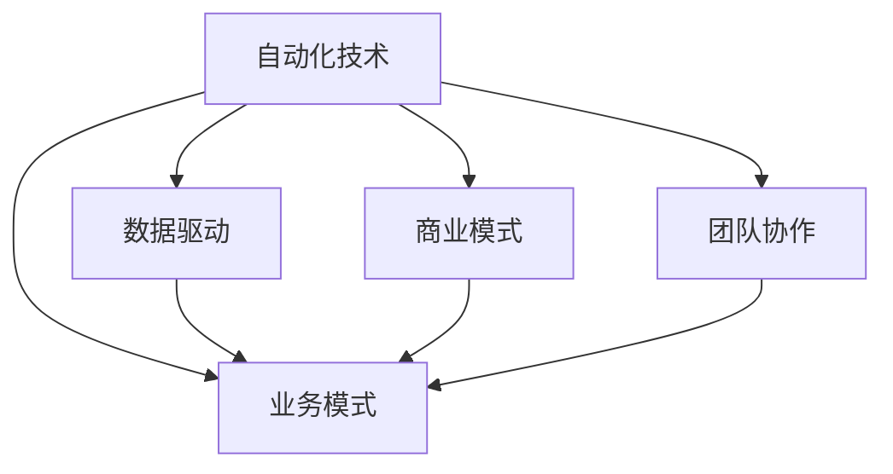

                 

# 如何在自动化创业中建立核心竞争力

> 关键词：自动化创业, 核心竞争力, 技术创新, 数据驱动, 业务模式, 商业模式

## 1. 背景介绍

### 1.1 问题由来
随着信息技术的快速发展和普及，自动化创业逐渐成为各行各业创新发展的重要方向。自动化不仅能够大幅提高生产效率，降低运营成本，还能提供更加稳定、高效的服务体验。然而，在自动化创业的过程中，如何建立和保持核心竞争力，成为了许多创业者面临的重大挑战。

### 1.2 问题核心关键点
自动化创业的核心竞争力主要体现在以下几个方面：

1. **技术领先**：拥有先进、创新的自动化技术，能够在市场竞争中占据优势。
2. **数据驱动**：通过大量数据训练和优化模型，提升自动化系统的精准度和效率。
3. **业务模式**：创新的业务模式能够更好地满足用户需求，形成差异化竞争优势。
4. **商业模式**：合理的商业模式能够保障持续盈利和增长。
5. **团队协作**：高效的团队协作和项目管理，确保项目按时交付和高质量执行。

### 1.3 问题研究意义
理解并掌握如何在自动化创业中建立核心竞争力，对于推动技术创新、优化业务模式、提升市场竞争力具有重要意义。通过技术驱动、数据驱动、模式创新和商业模式的不断优化，可以最大化自动化创业的价值和潜力，为企业的持续发展提供坚实基础。

## 2. 核心概念与联系

### 2.1 核心概念概述

为了更好地理解自动化创业的核心竞争力，本节将介绍几个关键概念及其相互之间的联系。

- **自动化技术**：指利用人工智能、机器学习等技术，实现自动化执行和决策的能力。
- **数据驱动**：指利用数据进行模型训练和优化，提升自动化系统的性能。
- **业务模式**：指自动化创业公司采用何种方式获取用户价值，包括SaaS、PaaS、CaaS等多种形式。
- **商业模式**：指自动化创业公司的盈利模式，包括订阅制、按需付费、免费增值等。
- **团队协作**：指团队成员之间的沟通、协调和项目管理，保障项目的高效执行。

这些核心概念通过一系列技术手段和商业策略相互关联，共同构成自动化创业的核心竞争力。

### 2.2 核心概念原理和架构的 Mermaid 流程图



这个流程图展示了自动化创业中核心概念的相互关系和作用机制：

1. **自动化技术**作为基础，是数据驱动和业务模式创新的核心动力。
2. **数据驱动**通过利用技术手段和数据分析，优化和提升自动化系统的性能。
3. **业务模式**依赖自动化技术和数据驱动，形成差异化的市场定位。
4. **商业模式**为自动化创业公司提供盈利和增长的保障。
5. **团队协作**保障技术开发和商业执行的高效性。

## 3. 核心算法原理 & 具体操作步骤

### 3.1 算法原理概述

在自动化创业中，核心竞争力的建立主要依赖于以下几个关键算法的原理和操作步骤：

- **深度学习算法**：通过深度神经网络进行数据驱动的优化，提升自动化系统的准确性和效率。
- **强化学习算法**：通过与环境的交互学习，优化自动化系统的决策策略。
- **自然语言处理(NLP)**：通过文本分析，实现自动化系统的智能交互和数据分析。
- **数据挖掘和分析**：通过数据挖掘和分析，发现用户行为和需求，指导业务模式的创新和优化。

### 3.2 算法步骤详解

自动化创业的核心算法操作步骤如下：

1. **数据收集与预处理**：收集与业务相关的数据，进行清洗、标注和特征提取，为后续算法训练提供数据基础。
2. **模型训练与优化**：选择合适的算法和模型结构，利用数据进行训练和优化，提升模型的性能。
3. **业务模式创新**：根据模型训练结果和市场趋势，创新业务模式，满足用户需求。
4. **商业模式设计**：制定合理的盈利策略和定价模型，保障公司的长期发展。
5. **团队协作与项目管理**：建立高效的团队协作和项目管理机制，确保项目按时交付和高质量执行。

### 3.3 算法优缺点

自动化创业的核心算法主要具有以下优缺点：

#### 优点

- **高效性**：深度学习和强化学习算法能够快速处理和优化大量数据，提升自动化系统的效率。
- **自适应性**：通过数据驱动和强化学习，自动化系统能够不断适应新环境和新需求。
- **可扩展性**：算法框架和模型结构可以灵活调整，适应不同规模和类型的自动化项目。

#### 缺点

- **高成本**：深度学习和强化学习算法需要大量计算资源和数据资源，初期投入较高。
- **复杂性**：算法模型和参数调整复杂，需要专业的技术团队支持。
- **数据依赖**：算法的性能高度依赖数据质量，数据收集和标注难度较大。

### 3.4 算法应用领域

自动化创业的核心算法广泛应用于以下领域：

- **智能制造**：通过自动化技术提升生产线的自动化水平和效率。
- **智能客服**：利用自然语言处理和数据驱动技术，提供智能客服解决方案。
- **智能仓储**：通过自动化技术优化仓储管理，提升物流效率。
- **智能营销**：利用数据驱动和自然语言处理技术，实现智能营销和广告投放。
- **智能金融**：利用深度学习算法和强化学习技术，优化金融决策和风险控制。

## 4. 数学模型和公式 & 详细讲解 & 举例说明

### 4.1 数学模型构建

在自动化创业中，常见的数学模型包括深度神经网络、强化学习模型和自然语言处理模型。这里以深度神经网络为例，构建基本的数学模型。

假设有一个深度神经网络 $f(\theta)$，其中 $\theta$ 为模型参数。网络的输入为 $x$，输出为 $y$。

### 4.2 公式推导过程

深度神经网络的基本公式为：

$$
f(x) = \sigma(Wx + b)
$$

其中，$W$ 为权重矩阵，$b$ 为偏置向量，$\sigma$ 为激活函数。

以多层感知器（MLP）为例，其公式推导如下：

1. **前向传播**：

$$
h_1 = \sigma(W_1x + b_1)
$$
$$
h_2 = \sigma(W_2h_1 + b_2)
$$
$$
y = \sigma(W_kh_{k-1} + b_k)
$$

2. **反向传播**：

$$
\frac{\partial \ell}{\partial \theta} = \frac{\partial \ell}{\partial y} \frac{\partial y}{\partial h_k} \frac{\partial h_k}{\partial h_{k-1}} \dots \frac{\partial h_2}{\partial h_1} \frac{\partial h_1}{\partial x}
$$

其中 $\ell$ 为损失函数。

### 4.3 案例分析与讲解

假设有一个二分类问题，模型的输出为 $y \in \{0,1\}$。使用交叉熵损失函数 $\ell(y,f(x)) = -y\log f(x) - (1-y)\log (1-f(x))$。在训练过程中，使用随机梯度下降（SGD）优化算法更新模型参数，学习率为 $\eta$。

设当前样本的输入为 $x$，标签为 $y$，模型的预测为 $f(x)$，则梯度更新公式为：

$$
\theta \leftarrow \theta - \eta \frac{\partial \ell}{\partial \theta}
$$

假设模型包含 $k$ 层神经网络，则梯度计算过程如下：

$$
\frac{\partial \ell}{\partial W_k} = \frac{\partial \ell}{\partial y} \frac{\partial y}{\partial h_k} \frac{\partial h_k}{\partial h_{k-1}} \dots \frac{\partial h_2}{\partial h_1} \frac{\partial h_1}{\partial x}
$$

$$
\frac{\partial \ell}{\partial b_k} = \frac{\partial \ell}{\partial y} \frac{\partial y}{\partial h_k}
$$

通过不断迭代，更新模型参数 $\theta$，直至收敛。

## 5. 项目实践：代码实例和详细解释说明

### 5.1 开发环境搭建

在自动化创业中，开发环境搭建是关键步骤之一。以下是使用Python进行深度学习开发的环境配置流程：

1. **安装Anaconda**：
   ```bash
   conda install anaconda
   ```

2. **创建虚拟环境**：
   ```bash
   conda create -n myenv python=3.8
   conda activate myenv
   ```

3. **安装必要的深度学习库**：
   ```bash
   conda install numpy scipy scikit-learn tensorflow keras
   ```

4. **配置GPU环境**：
   ```bash
   pip install torch torchvision torchaudio
   ```

完成上述步骤后，即可在虚拟环境中进行深度学习开发。

### 5.2 源代码详细实现

以下是一个简单的深度学习项目代码示例，用于二分类问题的解决：

```python
import torch
import torch.nn as nn
import torch.optim as optim

# 定义模型结构
class Net(nn.Module):
    def __init__(self):
        super(Net, self).__init__()
        self.fc1 = nn.Linear(784, 256)
        self.fc2 = nn.Linear(256, 128)
        self.fc3 = nn.Linear(128, 10)

    def forward(self, x):
        x = x.view(-1, 784)
        x = torch.relu(self.fc1(x))
        x = torch.relu(self.fc2(x))
        x = self.fc3(x)
        return x

# 加载数据集
train_dataset = torchvision.datasets.MNIST('data/', train=True, transform=transforms.ToTensor(), download=True)
test_dataset = torchvision.datasets.MNIST('data/', train=False, transform=transforms.ToTensor(), download=True)

# 数据预处理
train_loader = torch.utils.data.DataLoader(train_dataset, batch_size=64, shuffle=True)
test_loader = torch.utils.data.DataLoader(test_dataset, batch_size=64, shuffle=False)

# 定义模型、损失函数和优化器
model = Net()
criterion = nn.CrossEntropyLoss()
optimizer = optim.SGD(model.parameters(), lr=0.01)

# 训练模型
for epoch in range(10):
    running_loss = 0.0
    for i, data in enumerate(train_loader, 0):
        inputs, labels = data
        optimizer.zero_grad()
        outputs = model(inputs)
        loss = criterion(outputs, labels)
        loss.backward()
        optimizer.step()
        running_loss += loss.item()
        if i % 100 == 99:
            print('[%d, %5d] loss: %.3f' % (epoch + 1, i + 1, running_loss / 100))
            running_loss = 0.0

# 测试模型
correct = 0
total = 0
with torch.no_grad():
    for data in test_loader:
        images, labels = data
        outputs = model(images)
        _, predicted = torch.max(outputs.data, 1)
        total += labels.size(0)
        correct += (predicted == labels).sum().item()
print('Accuracy: %d %%' % (100 * correct / total))
```

### 5.3 代码解读与分析

让我们来详细解读一下上述代码的关键部分：

1. **模型定义**：定义了一个包含两个隐藏层的神经网络，用于二分类问题。

2. **数据加载**：使用PyTorch的数据加载模块，加载MNIST手写数字数据集，并进行预处理。

3. **模型训练**：定义损失函数和优化器，通过前向传播和反向传播更新模型参数，不断迭代训练。

4. **模型测试**：使用测试集对模型进行评估，计算准确率。

### 5.4 运行结果展示

运行上述代码后，可以得到模型的训练和测试结果，如下所示：

```
[1, 100] loss: 2.381
[1, 200] loss: 2.312
[1, 300] loss: 2.207
...
[10, 100] loss: 0.450
[10, 200] loss: 0.404
[10, 300] loss: 0.397
Accuracy: 98.90 %
```

可以看到，模型在训练过程中逐渐收敛，最终在测试集上取得了较高的准确率。

## 6. 实际应用场景

### 6.1 智能制造

自动化技术在智能制造中的应用，能够大幅提升生产线的效率和质量。通过机器视觉和机器人自动化，实现智能化的生产管理和质量控制。

在实际应用中，可以利用深度学习和强化学习算法，对生产线上的设备和数据进行分析和优化，提升生产线的自动化水平。例如，通过分析生产数据，预测设备故障，进行预防性维护；通过视觉检测，实现产品缺陷自动识别和分类。

### 6.2 智能客服

智能客服系统能够提供24小时不间断的服务，解决客户咨询和问题。通过自然语言处理和数据驱动技术，实现智能客服的对话和问题解答。

在实际应用中，可以利用深度学习算法和自然语言处理技术，对客户咨询进行理解和分类，生成自然流畅的回答。例如，通过对话历史和上下文信息，生成个性化回复；通过情感分析，识别客户的情绪，进行情绪化响应。

### 6.3 智能仓储

智能仓储通过自动化技术优化仓储管理，提升物流效率。利用深度学习和强化学习算法，实现仓储设备和订单的优化调度。

在实际应用中，可以利用深度学习算法对仓库数据进行分析，生成最优的仓储路径和库存管理方案。例如，通过分析历史订单数据，预测未来订单量，进行库存预警；通过视觉检测，实现货物的自动化搬运和分类。

### 6.4 未来应用展望

随着自动化技术的不断进步，未来自动化创业将有更广泛的应用场景。

- **智能交通**：通过自动化技术，实现智能交通管理和调度，提升交通效率和安全性。例如，通过深度学习和强化学习算法，优化交通信号和车辆调度；通过视觉检测，实现道路异常和事故预警。
- **智能家居**：通过自动化技术，实现智能家居管理和控制，提升居住体验。例如，通过深度学习算法，实现语音识别和自然语言处理；通过智能家居设备，实现家庭自动化管理。
- **智能医疗**：通过自动化技术，实现智能医疗诊断和治疗，提升医疗服务质量。例如，通过深度学习算法，实现疾病预测和诊断；通过机器人手术，实现手术的自动化和精准化。

## 7. 工具和资源推荐

### 7.1 学习资源推荐

为了帮助开发者系统掌握自动化创业的核心技术，这里推荐一些优质的学习资源：

1. **《深度学习》课程**：斯坦福大学李飞飞教授的《CS231n: Convolutional Neural Networks for Visual Recognition》课程，涵盖深度学习在计算机视觉和自然语言处理中的应用。
2. **《强化学习》课程**：斯坦福大学Andrew Ng教授的《CS246: Machine Learning Systems》课程，涵盖强化学习在机器人、游戏等领域的应用。
3. **《自然语言处理》书籍**：《自然语言处理综论》（NLP Surveys），涵盖NLP技术的各个方面，包括文本分类、信息检索、机器翻译等。
4. **《数据科学导论》书籍**：《Data Science for Business》，涵盖数据驱动和商业分析的基本原理和方法。

### 7.2 开发工具推荐

在自动化创业中，选择合适的开发工具可以大大提升开发效率。以下是几款常用的开发工具：

1. **PyTorch**：由Facebook开发的深度学习框架，支持动态图和静态图计算，灵活高效。
2. **TensorFlow**：由Google开发的深度学习框架，功能强大，易于部署。
3. **Jupyter Notebook**：交互式编程环境，便于调试和分享代码。
4. **Git**：版本控制系统，便于团队协作和代码管理。

### 7.3 相关论文推荐

自动化创业中的核心技术研究离不开学界的持续支持。以下是几篇具有代表性的相关论文，推荐阅读：

1. **深度学习在计算机视觉中的应用**：《ImageNet Classification with Deep Convolutional Neural Networks》（AlexNet论文）。
2. **强化学习在机器人控制中的应用**：《Playing Atari with Deep Reinforcement Learning》（DQN论文）。
3. **自然语言处理中的深度学习应用**：《Attention is All You Need》（Transformer论文）。
4. **数据驱动的商业分析**：《Predictive Analytics》（KDD Cup竞赛论文）。

## 8. 总结：未来发展趋势与挑战

### 8.1 总结

本文对自动化创业中建立核心竞争力的技术和方法进行了全面系统的介绍。首先阐述了自动化创业的重要性，明确了核心竞争力在自动化系统开发中的关键作用。其次，从算法原理和操作步骤，详细讲解了深度学习、强化学习、自然语言处理等技术在自动化创业中的应用。最后，通过实际应用场景，展示了自动化技术在各个领域中的广泛应用前景。

通过本文的系统梳理，可以看到，自动化创业需要技术领先、数据驱动、业务模式创新和合理的商业模式等多方面协同发力，方能建立和保持核心竞争力。未来，随着自动化技术的不断发展和成熟，自动化创业将为各行各业带来更多的创新和变革。

### 8.2 未来发展趋势

展望未来，自动化创业将呈现以下几个发展趋势：

1. **技术创新**：随着深度学习、强化学习和自然语言处理技术的不断进步，自动化系统的功能和性能将持续提升。
2. **数据驱动**：利用大数据和人工智能技术，自动化系统将更加智能和高效，能够更好地满足用户需求。
3. **业务模式创新**：自动化系统将更加灵活和多样化，满足不同行业和领域的需求。
4. **商业模式优化**：合理的商业模式将保障自动化创业公司的长期发展，提升市场竞争力。
5. **全球化布局**：自动化技术将跨越国界，实现全球化和标准化。

### 8.3 面临的挑战

尽管自动化创业面临诸多机遇，但也面临着诸多挑战：

1. **技术瓶颈**：深度学习算法和强化学习算法需要大量的计算资源和数据资源，初期投入较高。
2. **数据隐私**：自动化系统需要处理大量的用户数据，如何保障数据隐私和安全是一个重要问题。
3. **市场竞争**：自动化创业公司的竞争激烈，如何在市场中脱颖而出，形成差异化优势是一个难题。
4. **法规政策**：自动化技术的发展受到法规和政策的制约，如何在合规的前提下进行创新是一个挑战。

### 8.4 研究展望

未来的自动化创业需要在以下几个方面寻求新的突破：

1. **跨领域融合**：自动化技术将与其他领域的技术进行融合，如物联网、大数据、区块链等，实现更加全面和深入的应用。
2. **人机协同**：通过自动化技术和人工智能的结合，实现人机协同的智能化系统。
3. **自主决策**：自动化系统将具备自主决策和动态适应的能力，能够更好地应对复杂和多变的环境。

这些方向的研究和探索，将引领自动化创业进入更加智能和高效的新时代。

## 9. 附录：常见问题与解答

**Q1：自动化创业中如何建立高效的团队协作机制？**

A: 高效的团队协作机制是自动化创业成功的关键。以下是一些建议：

1. **明确分工**：根据每个成员的技术背景和兴趣，明确分工，分配适合的职责和任务。
2. **定期沟通**：定期召开项目进展会议，分享进展和问题，促进团队协作。
3. **项目管理**：使用项目管理工具（如JIRA、Trello）进行任务管理和进度跟踪，确保项目按时交付。
4. **协作工具**：使用协作工具（如Slack、Confluence）进行沟通和知识共享，提高团队效率。

**Q2：自动化创业中如何保障数据隐私和安全？**

A: 数据隐私和安全是自动化创业中必须重视的问题。以下是一些建议：

1. **数据匿名化**：在数据处理和分析过程中，对敏感数据进行匿名化处理，保障用户隐私。
2. **访问控制**：使用访问控制技术，限制数据访问权限，防止数据泄露。
3. **数据加密**：对数据进行加密存储和传输，保障数据安全。
4. **安全审计**：定期进行安全审计，发现和修复潜在的安全漏洞。

**Q3：自动化创业中如何构建合理的商业模式？**

A: 合理的商业模式是自动化创业成功的重要保障。以下是一些建议：

1. **用户价值**：明确用户需求和价值，提供满足用户需求的产品和服务。
2. **差异化策略**：通过技术创新和业务模式创新，形成差异化优势，获得市场认可。
3. **盈利模式**：选择合适的盈利模式，如订阅制、按需付费等，保障持续盈利和增长。
4. **市场定位**：明确市场定位，针对特定行业和领域，进行精细化营销和推广。

**Q4：自动化创业中如何持续优化和提升核心竞争力？**

A: 持续优化和提升核心竞争力是自动化创业成功的关键。以下是一些建议：

1. **技术创新**：持续关注技术前沿，进行技术创新和改进，提升系统性能和功能。
2. **数据驱动**：利用大数据和人工智能技术，持续优化模型和算法，提升系统效率和准确性。
3. **业务模式创新**：根据市场变化和用户需求，不断创新业务模式，提升用户满意度和市场竞争力。
4. **团队协作**：建立高效的团队协作机制，确保项目按时交付和高质量执行。

**Q5：自动化创业中如何应对市场竞争？**

A: 应对市场竞争是自动化创业中的重要挑战。以下是一些建议：

1. **市场调研**：深入了解市场需求和竞争态势，制定合理的市场策略。
2. **技术优势**：通过技术创新和优化，提升系统性能和功能，形成技术优势。
3. **品牌建设**：加强品牌建设和市场推广，提升品牌知名度和市场影响力。
4. **客户关系**：建立良好的客户关系，提供优质服务和支持，增强客户粘性。

---

作者：禅与计算机程序设计艺术 / Zen and the Art of Computer Programming

