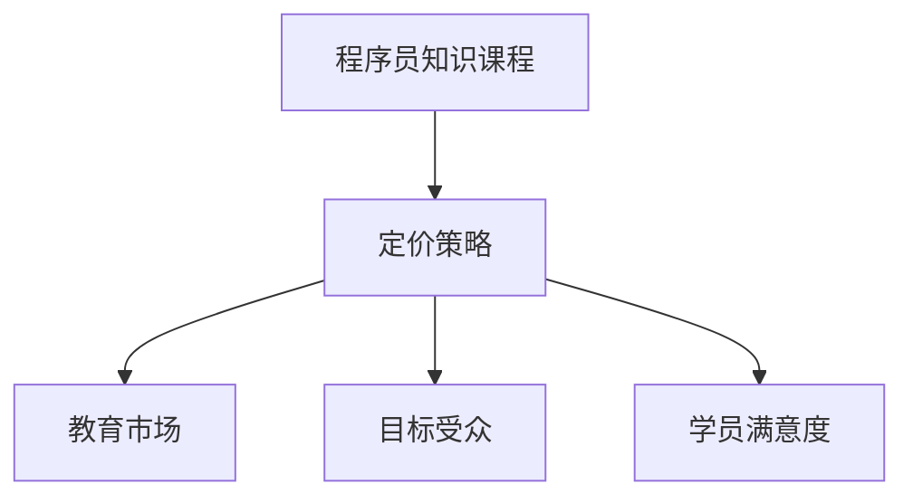

                 

# 如何定价你的程序员知识课程

> 关键词：知识定价, 课程定价, 程序员培训, 教育市场, 定价策略, 教育技术

## 1. 背景介绍

随着技术变革的加速，程序员和软件开发者的技能需求日益复杂和多样化。同时，在线教育平台和职业培训市场蓬勃发展，提供了大量的编程课程和实践项目。然而，如何为这些课程定价，以既保障教育质量，又能吸引潜在学员，是一个值得深入探讨的问题。本文将从多个角度详细解析如何定价你的程序员知识课程，以确保在教育市场中获得最佳效益。

## 2. 核心概念与联系

### 2.1 核心概念概述

本节将介绍几个核心概念，以及它们之间的关系：

- **程序员知识课程**：指针对软件开发人员设计的教育产品，如在线课程、实战项目、认证培训等。这些课程旨在传授编程技能、软件工程最佳实践、特定技术栈的深入学习等。

- **定价策略**：指根据市场调研、成本分析、目标受众等因素，对课程进行合理定价的方法和技巧。定价策略不仅影响课程销售和学员满意度，还影响教育机构的盈利能力。

- **教育市场**：指涉及教育产品和服务交易的市场，包括在线教育平台、培训机构、私人导师等。这一市场随着技术发展和教育需求增长而不断扩大。

- **目标受众**：指教育课程和服务的目标用户群，包括初级、中级和高级程序员，以及具有特定技术需求的学习者。

- **学员满意度**：指学员对教育产品质量和实用性的总体评价，影响课程的口碑和市场竞争力。

这些概念相互联系，共同构成教育课程定价的框架。

### 2.2 核心概念原理和架构的 Mermaid 流程图



这个流程图展示了核心概念之间的逻辑关系。课程的定价策略需要综合考虑教育市场的特性、目标受众的需求以及学员的反馈。

## 3. 核心算法原理 & 具体操作步骤

### 3.1 算法原理概述

课程定价的核心在于平衡课程价值与市场接受度。定价过低的课程可能无法覆盖运营成本，导致教育机构亏损；而定价过高则可能将部分潜在学员排除在外，影响市场占有率。因此，需要采用科学的定价方法，确保课程的盈利性和吸引力。

### 3.2 算法步骤详解

1. **市场调研**：
   - 收集同行业类似课程的价格信息，了解市场定价范围。
   - 调查目标受众的支付意愿，通过问卷调查、焦点小组等方式获取数据。

2. **成本分析**：
   - 计算课程开发和运营的总成本，包括讲师费用、课程制作、营销推广等。
   - 评估课程的独特价值，如课程内容、讲师资质、学习工具等。

3. **定价模型选择**：
   - **成本加成定价**：在总成本基础上加上固定利润率。
   - **价值定价**：根据课程的价值和市场认知定价，通常适用于高质量课程。
   - **竞争定价**：参考竞争对手的定价策略，通过价格差异化获得竞争优势。

4. **试销与调整**：
   - 推出试销版课程，观察市场反应和销售情况。
   - 根据试销数据和反馈调整定价策略。

### 3.3 算法优缺点

**优点**：
- **综合考虑多方面因素**：结合市场调研和成本分析，确保课程定价的科学性和合理性。
- **灵活调整**：试销和市场反馈可动态调整定价策略，适应市场需求变化。

**缺点**：
- **复杂性高**：需要综合考虑多个因素，定价过程较为繁琐。
- **市场风险**：定价策略可能因市场变化和竞争态势影响，需要进行频繁调整。

### 3.4 算法应用领域

这一定价方法适用于多种类型的程序员知识课程，包括但不限于：

- 技术栈深度课程，如Java、Python、JavaScript等。
- 特定技术或工具的高级课程，如机器学习、人工智能、DevOps等。
- 实战项目和案例分析，提升实践经验的课程。
- 认证培训和专业考试课程，提供权威认可。

## 4. 数学模型和公式 & 详细讲解 & 举例说明

### 4.1 数学模型构建

设课程总成本为 $C$，目标利润率为 $P$，市场认知价值为 $V$，目标受众支付意愿为 $W$，则定价公式可表示为：

$$
P = \frac{V + C}{W}
$$

### 4.2 公式推导过程

- 首先，根据目标利润率 $P$ 和总成本 $C$ 计算所需利润 $C' = P \times C$。
- 其次，考虑市场认知价值 $V$，确保课程定价不低于其价值。
- 最后，根据目标受众支付意愿 $W$，计算合理的市场价格 $P'$。

$$
P' = \frac{V + C'}{W}
$$

### 4.3 案例分析与讲解

以某编程培训机构推出的Python高级课程为例，总成本为 $100,000$ 美元，目标利润率为 $20\%$。市场认知价值为 $150,000$ 美元，目标受众支付意愿调查结果为 $200$ 美元。

计算目标利润：

$$
C' = P \times C = 0.20 \times 100,000 = 20,000
$$

计算市场价格：

$$
P' = \frac{V + C'}{W} = \frac{150,000 + 20,000}{200} = 850
$$

因此，课程定价应为 $850$ 美元。

## 5. 项目实践：代码实例和详细解释说明

### 5.1 开发环境搭建

以下是使用Python实现课程定价计算的开发环境搭建步骤：

1. 安装Python：从官网下载安装Python，推荐版本为3.8及以上。
2. 安装pip包管理器：使用以下命令安装pip：

   ```bash
   python -m ensurepip --upgrade
   ```

3. 安装依赖包：使用以下命令安装Python包管理工具pip，然后安装必要的Python包：

   ```bash
   pip install numpy pandas sympy
   ```

### 5.2 源代码详细实现

```python
import numpy as np

def calculate_course_price(C, P, V, W):
    """
    计算课程价格
    :param C: 课程总成本
    :param P: 目标利润率
    :param V: 市场认知价值
    :param W: 目标受众支付意愿
    :return: 课程价格
    """
    C_prime = P * C  # 计算目标利润
    P_prime = (V + C_prime) / W  # 计算市场价格
    return P_prime

# 示例参数
C = 100000  # 课程总成本
P = 0.2  # 目标利润率
V = 150000  # 市场认知价值
W = 200  # 目标受众支付意愿

# 计算课程价格
P_prime = calculate_course_price(C, P, V, W)
print(f"课程定价应为：{P_prime} 美元")
```

### 5.3 代码解读与分析

本代码段定义了一个计算课程价格的函数 `calculate_course_price`，其中：

- `C` 表示课程总成本。
- `P` 表示目标利润率。
- `V` 表示市场认知价值。
- `W` 表示目标受众支付意愿。
- 函数返回计算出的课程价格 `P_prime`。

示例参数 `C=100000`、`P=0.2`、`V=150000` 和 `W=200` 分别表示示例课程的总成本、目标利润率、市场认知价值和目标受众支付意愿。最终输出课程定价应为 $850$ 美元。

### 5.4 运行结果展示

运行上述代码，将输出课程定价为 $850$ 美元，与上文计算结果一致。

## 6. 实际应用场景

### 6.1 在线教育平台

在线教育平台如Coursera、Udacity等，普遍采用课程定价策略来平衡收益与市场反馈。通过市场调研和成本分析，这些平台可以为不同难度和深度的课程设定合适的价格，吸引更多学员注册和参与。

### 6.2 企业培训

企业内部或面向职业资格认证的培训课程，也需合理定价。例如，某软件公司推出的一门高级数据科学课程，定价应反映其技术深度和课程设计质量，同时需考虑企业的内部政策和对员工技能提升的预期。

### 6.3 开源社区课程

开源社区提供的免费课程，虽然不直接收费，但可通过捐赠和付费附加内容来维持运营。定价策略需综合考虑社区贡献和课程质量，确保内容既有价值又不失公益性。

### 6.4 未来应用展望

未来，随着教育技术的不断进步和市场竞争的加剧，课程定价将更加智能化和个性化。例如：

- **动态定价**：根据市场供需、学员反馈和课程质量实时调整价格。
- **分级定价**：针对不同水平的学习者设置不同价格层级，满足多样化需求。
- **订阅模式**：提供课程包或年费订阅服务，提升用户粘性和长期价值。

## 7. 工具和资源推荐

### 7.1 学习资源推荐

- **Coursera 和 Udacity 课程**：学习其他教育平台的定价策略，了解市场趋势。
- **Khan Academy**：查看非营利教育机构如何平衡课程成本和价格。
- **edX 定价指南**：获取商业化教育的定价策略和案例分析。

### 7.2 开发工具推荐

- **Jupyter Notebook**：Python编程环境和数据分析工具，适合编写和测试定价计算脚本。
- **GitHub**：代码托管平台，方便分享和协作开发课程定价算法。
- **Python环境构建工具Anaconda**：快速搭建Python开发环境，支持多种依赖包安装。

### 7.3 相关论文推荐

- **"Understanding the Economics of Online Education"**：探讨在线教育市场结构和经济影响，提供定价策略分析。
- **"Pricing Strategy in Higher Education"**：分析高等教育机构的定价模型和市场响应。
- **"Adaptive Pricing in Online Education"**：研究动态定价机制在教育市场中的应用。

## 8. 总结：未来发展趋势与挑战

### 8.1 研究成果总结

本文分析了程序员知识课程定价的关键因素和方法，提出了综合市场调研、成本分析和受众反馈的定价模型，并给出了实际应用案例。通过深入探讨课程定价的理论和实践，有助于教育机构制定更加科学合理的定价策略。

### 8.2 未来发展趋势

- **智能化定价**：随着AI和大数据技术的发展，课程定价将更加动态和精准。
- **个性化定价**：基于用户行为和偏好，提供差异化的定价服务。
- **多渠道定价**：结合线上线下多种销售渠道，实现最优价格组合。

### 8.3 面临的挑战

- **市场竞争**：课程定价需对抗同行竞争，避免价格战导致的利润压缩。
- **成本控制**：需平衡课程质量和成本，确保价格不高于实际价值。
- **用户教育**：部分用户可能对课程定价有误解，需要进行市场教育和引导。

### 8.4 研究展望

未来，研究需关注以下几点：

- **定价算法优化**：开发更高效、更灵活的定价算法，适应多样化的市场环境。
- **用户行为分析**：通过大数据分析用户购买行为，优化定价策略。
- **价格弹性研究**：研究不同市场环境下的价格弹性，寻找最佳定价区间。

## 9. 附录：常见问题与解答

**Q1: 为什么需要定价策略？**

A: 定价策略是确保教育机构盈利的关键。合理的定价不仅能覆盖运营成本，还能吸引更多学员，提升市场份额。

**Q2: 如何选择定价模型？**

A: 应综合考虑市场调研、成本分析和目标受众的支付意愿。一般来说，成本加成定价适用于低成本、标准化课程；价值定价适用于高质量课程；竞争定价适用于市场竞争激烈的情况。

**Q3: 定价过低对课程有什么影响？**

A: 定价过低可能无法覆盖运营成本，导致教育机构亏损；同时，低价格可能无法反映课程的真实价值，影响课程品质和学员满意度。

**Q4: 如何应对市场变化？**

A: 定期进行市场调研和成本分析，根据市场反馈和运营数据，灵活调整定价策略。同时，保持与学员的沟通和反馈，及时优化课程内容和服务质量。

通过深入理解课程定价的原理和实际操作，教育机构可以更科学、有效地定价课程，实现经济效益和社会价值的最大化。未来，随着教育技术的不断进步和市场需求的不断变化，课程定价策略也将更加智能化和个性化，为程序员和教育机构带来更多机遇和挑战。

