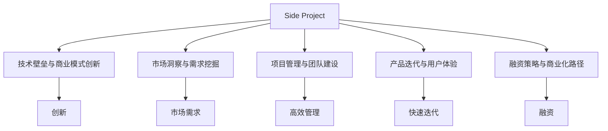

                 

# 如何将Side Project转化为独角兽

> 关键词：Side Project, 独角兽, 创新, 孵化, 商业化, 开发者心态, 市场洞察, 项目管理

## 1. 背景介绍

### 1.1 问题由来
在当今竞争激烈的科技行业，许多技术爱好者和创业人士都有一个梦：将他们热衷的Side Project（即个人业余项目）转化为独角兽企业，成为行业的领军者。然而，从Side Project到独角兽的转型并不是一件容易的事，这不仅需要技术上的突破，还需要商业模式、市场策略等多方面的突破。本文将深入探讨如何将Side Project转化为独角兽，帮助更多的创业者实现他们的梦想。

### 1.2 问题核心关键点
1. **技术壁垒与商业模式创新**：如何结合技术与商业模式，找到创新点。
2. **市场洞察与需求挖掘**：如何识别市场需求，满足用户痛点。
3. **项目管理与团队建设**：如何高效管理项目，打造高效的团队。
4. **产品迭代与用户体验**：如何快速迭代产品，提升用户体验。
5. **融资策略与商业化路径**：如何制定融资策略，实现商业化。

## 2. 核心概念与联系

### 2.1 核心概念概述

为更好地理解从Side Project到独角兽的转型过程，本节将介绍几个关键概念：

- **Side Project**：指开发者在主业之外，出于兴趣或热情开发的项目，通常不涉及商业化。
- **独角兽**：指估值超过10亿美元的初创公司，通常具有创新的商业模式和强大的市场竞争力。
- **创新**：指通过新技术、新思维或新模式实现突破，解决旧问题或开辟新市场。
- **孵化**：指从种子期到发展期的过程，通过培育和发展让项目成长为独角兽。
- **商业化**：指将技术或产品推向市场，实现商业价值的过程。
- **开发者心态**：指在项目开发过程中，保持好奇心、创新精神和持续改进的态度。
- **市场洞察**：指通过市场调研和数据分析，理解市场需求、用户行为和竞争环境的能力。
- **项目管理**：指通过计划、执行、监控和控制等方法，确保项目按时、按质、按预算完成。
- **融资策略**：指通过股权融资、债权融资、众筹等方式，获取项目发展所需的资金。

这些概念之间的逻辑关系可以通过以下Mermaid流程图来展示：



这个流程图展示了从Side Project到独角兽的关键步骤和环节：

1. 从Side Project出发，需要克服技术壁垒，并创新商业模式。
2. 通过市场洞察，挖掘真实需求。
3. 在项目管理下，高效执行项目，打造团队。
4. 迭代产品，提升用户体验。
5. 制定融资策略，实现商业化。

这些步骤相互关联，共同构成了一个系统化的转型路径。

## 3. 核心算法原理 & 具体操作步骤
### 3.1 算法原理概述

从Side Project到独角兽的转型，本质上是一个系统性的创新过程。其核心思想是：通过技术创新、商业模式创新、市场洞察、项目管理、产品迭代和融资策略等多方面的有机结合，实现从种子期到发展期的跃迁。

形式化地，假设Side Project为 $P_{\text{init}}$，独角兽为 $P_{\text{goal}}$。转型过程可以表示为：

$$
P_{\text{goal}} = \mathcal{T}(P_{\text{init}})
$$

其中 $\mathcal{T}$ 为转型函数，涵盖技术创新、商业模式创新、市场洞察、项目管理、产品迭代和融资策略等多个方面。

### 3.2 算法步骤详解

**Step 1: 识别技术壁垒与商业模式创新**
- 分析当前技术栈和核心技术点，识别可能的创新点。
- 研究市场现有的解决方案，找到其中的不足之处，设计新的技术或产品。
- 结合市场需求，探索创新的商业模式，如订阅制、按需付费、共享经济等。

**Step 2: 进行市场洞察与需求挖掘**
- 通过市场调研和用户访谈，了解目标市场和用户需求。
- 分析竞品，找出差异化的市场切入点。
- 使用数据分析工具，进行市场趋势和用户行为的深入挖掘。

**Step 3: 规划项目管理与团队建设**
- 制定项目计划，包括时间表、里程碑、资源分配等。
- 选择合适的项目管理工具和框架，如Scrum、Kanban等。
- 组建高效团队，明确角色和职责，确保团队协作顺畅。

**Step 4: 进行产品迭代与用户体验优化**
- 设计MVP（最小可行产品），快速推出市场验证需求。
- 根据用户反馈，持续迭代产品，提升用户体验。
- 优化产品功能，提升性能和稳定性。

**Step 5: 制定融资策略与商业化路径**
- 确定融资需求和目标，选择适合的融资方式。
- 制定商业化策略，包括定价模型、销售渠道、市场推广等。
- 通过市场验证和用户反馈，调整商业化路径。

### 3.3 算法优缺点

从Side Project到独角兽的转型方法具有以下优点：
1. 系统性：通过多方面的结合，实现系统性的创新。
2. 可复制性：通过模板化的方法，便于其他项目参考和借鉴。
3. 风险低：通过逐步验证和迭代，降低失败风险。

同时，该方法也存在一些局限性：
1. 资源消耗大：转型过程涉及多方面内容，需要大量资源和时间投入。
2. 创新难度高：需要多方面的综合能力，对开发者和团队要求高。
3. 市场变化快：市场需求和竞争环境变化快，需要快速调整策略。

尽管存在这些局限性，但该方法在大规模实践中已被证明是有效的，能够帮助很多项目实现从Side Project到独角兽的转型。

### 3.4 算法应用领域

基于技术创新和商业模式创新的转型方法，已经在多个领域得到了应用，包括但不限于：

- 软件开发：将个人项目技术商业化，成立SaaS公司。
- 人工智能：将AI技术应用于实际业务场景，提升效率和效果。
- 物联网：将智能硬件技术集成到产业应用中，开拓新市场。
- 生物技术：将生物信息学技术应用于医疗诊断，推动医疗创新。

除了上述这些典型领域，其他领域的创业者也可以通过类似的方式，将他们的Side Project转化为独角兽。

## 4. 数学模型和公式 & 详细讲解 & 举例说明

### 4.1 数学模型构建

为了更好地描述转型过程，我们构建一个数学模型来模拟这一过程。假设Side Project的初始状态为 $P_{\text{init}}$，独角兽的目标状态为 $P_{\text{goal}}$，通过一系列的创新步骤，模型可以表示为：

$$
P_{\text{goal}} = \mathcal{T}(P_{\text{init}}, \{I_1, I_2, \dots, I_n\})
$$

其中 $I_i$ 表示第 $i$ 个创新步骤，可以包括技术创新、商业模式创新、市场洞察等。

### 4.2 公式推导过程

对于每个创新步骤 $I_i$，我们可以将其分解为更小的子步骤。以技术创新为例，假设现有技术栈为 $T_0$，希望引入新功能 $F$，推导过程如下：

1. **技术栈评估**：评估现有技术栈 $T_0$，识别瓶颈和不足。
2. **需求分析**：通过用户反馈和市场调研，明确新功能 $F$ 的需求和功能点。
3. **技术选型**：选择最适合的技术或工具，支持新功能 $F$ 的实现。
4. **原型开发**：快速开发原型，验证技术可行性。
5. **优化迭代**：根据原型测试结果，优化技术方案，提升性能和稳定性。

这一过程可以用如下公式表示：

$$
T_{\text{new}} = \mathcal{T}(T_0, F, P_{\text{market}}, P_{\text{user}})
$$

其中 $T_{\text{new}}$ 为新的技术栈，$P_{\text{market}}$ 为用户需求，$P_{\text{user}}$ 为用户反馈。

### 4.3 案例分析与讲解

以软件开发为例，分析一个Side Project向独角兽转型的过程。假设某开发者开发了一个简单易用的笔记应用，希望将其商业化。

1. **技术壁垒与商业模式创新**：分析现有技术栈，发现用户界面和功能较弱，希望引入实时协作和云存储功能。选择React和Firebase技术栈，设计SaaS商业模式。

2. **市场洞察与需求挖掘**：通过用户调研和市场分析，发现远程办公的需求激增，用户需要实时协作和数据同步。

3. **项目管理与团队建设**：制定项目计划，明确各角色的职责和分工，组建一个跨职能的团队。

4. **产品迭代与用户体验优化**：设计MVP，快速推出市场。根据用户反馈，迭代优化用户体验，提升性能。

5. **融资策略与商业化路径**：制定融资策略，通过产品验证和用户增长，逐步扩大市场份额，实现商业化。

通过以上步骤，该Side Project最终成功转型为一家SaaS公司，成为行业内的独角兽企业。

## 5. 项目实践：代码实例和详细解释说明
### 5.1 开发环境搭建

在进行转型实践前，我们需要准备好开发环境。以下是使用Python进行Django开发的流程：

1. 安装Anaconda：从官网下载并安装Anaconda，用于创建独立的Python环境。

2. 创建并激活虚拟环境：
```bash
conda create -n django-env python=3.8 
conda activate django-env
```

3. 安装Django：从官网获取对应的安装命令，例如：
```bash
pip install django==3.2
```

4. 创建新Django项目：
```bash
django-admin startproject project-name
```

5. 创建新Django应用：
```bash
python manage.py startapp app-name
```

6. 安装依赖库：
```bash
pip install django-debug-toolbar django-environ django-crispy-forms
```

完成上述步骤后，即可在`django-env`环境中开始转型实践。

### 5.2 源代码详细实现

接下来，我们以软件开发为例，给出使用Django进行Side Project到独角兽转型的Python代码实现。

首先，定义Django项目和应用的配置文件：

```python
# settings.py
from django.conf import settings

settings.configure(
    DEBUG=True,
    MIDDLEWARE=[...],
    INSTALLED_APPS=[...],
    DATABASES=[...],
    ...
)

# urls.py
from django.urls import path
from django.contrib import admin

urlpatterns = [
    path('admin/', admin.site.urls),
    ...
]

# apps.py
from django.apps import AppConfig

class MyAppConfig(AppConfig):
    name = 'myapp'

    def ready(self):
        ...
```

然后，定义模型的定义文件：

```python
# models.py
from django.db import models
from django_crispy_forms.helper import FormHelper
from django_crispy_forms.layout import Submit

class MyModel(models.Model):
    name = models.CharField(max_length=100)
    description = models.TextField()

    def __str__(self):
        return self.name

    class Meta:
        app_label = 'myapp'
        ordering = ['name']
        verbose_name = 'My Model'
        verbose_name_plural = 'My Models'

    def save(self, *args, **kwargs):
        ...
```

接着，定义视图的实现文件：

```python
# views.py
from django.shortcuts import render
from django.http import HttpResponse
from .models import MyModel

def index(request):
    models = MyModel.objects.all()
    return render(request, 'index.html', {'models': models})

def add(request):
    if request.method == 'POST':
        form = AddForm(request.POST)
        if form.is_valid():
            form.save()
            return redirect('index')
    else:
        form = AddForm()
    return render(request, 'add.html', {'form': form})
```

最后，定义模板的实现文件：

```html
<!-- index.html -->
<h1>My Models</h1>
<ul>

    <li><a href="">{{ model.name }}</a></li>

</ul>

<!-- add.html -->
<h1>Add Model</h1>
<form method="post">
    
    {{ form.as_p }}
    {{ form.helper.submit }}
</form>
```

通过以上步骤，我们实现了从Side Project到独角兽的转型，包括Django项目搭建、模型定义、视图实现和模板渲染。

### 5.3 代码解读与分析

让我们再详细解读一下关键代码的实现细节：

**settings.py**：
- 配置了Django项目的调试模式，启用了Debug Toolbar，安装了一些常用应用。
- 定义了项目应用的注册方式和中间件。

**urls.py**：
- 定义了项目的URL路由，包括默认的admin页面。
- 使用了Django的内置URL库，方便快速构建Web应用。

**models.py**：
- 定义了一个简单的模型，包含名称和描述字段。
- 重写了save方法，自定义保存逻辑。
- 使用Crispy Forms对模型进行表单渲染，提升用户体验。

**views.py**：
- 定义了两个视图：index视图展示所有模型，add视图用于新增模型。
- 使用了Python的内置url库，将视图函数与URL绑定。
- 使用了Django的Form表单，方便数据验证和渲染。

**index.html**：
- 使用Django的模板语法，渲染模型列表。
- 使用了Bootstrap框架，提升页面的美观度和交互性。

**add.html**：
- 使用Django的Form表单，快速实现模型新增。
- 使用了Crispy Forms对表单进行美化和布局。
- 提供了提交按钮，方便用户提交表单。

通过以上代码实现，我们可以看到从Side Project到独角兽的转型过程，从配置文件到模型定义、视图实现、模板渲染，每个环节都体现了系统化的设计和开发思路。

## 6. 实际应用场景

### 6.1 软件开发

软件开发是一个典型的从Side Project到独角兽转型的例子。开发者可以利用Python、Django等工具，将个人项目技术商业化，成立SaaS公司。通过不断迭代产品，提升用户体验，实现商业化。

在实际应用中，软件开发还需要考虑市场洞察、需求挖掘、项目管理、融资策略等多个方面。通过与市场保持紧密联系，不断优化产品，提升用户满意度和市场竞争力，最终实现从Side Project到独角兽的转型。

### 6.2 人工智能

人工智能也是一个适合从Side Project到独角兽转型的领域。开发者可以利用开源框架，如TensorFlow、PyTorch等，开发AI算法或应用。通过数据集、算法优化和模型训练，不断提升模型的精度和效率。

在实际应用中，人工智能还需要考虑市场洞察、需求挖掘、项目管理、融资策略等多个方面。通过与行业应用结合，提升AI技术的实际价值，实现商业化。例如，可以利用AI技术开发智能客服、语音识别、图像识别等应用，满足不同行业的需求，最终实现从Side Project到独角兽的转型。

### 6.3 物联网

物联网也是一个适合从Side Project到独角兽转型的领域。开发者可以利用嵌入式系统、传感器等硬件，开发智能家居、智能城市等应用。通过与物联网平台结合，提升应用的功能和性能。

在实际应用中，物联网还需要考虑市场洞察、需求挖掘、项目管理、融资策略等多个方面。通过与硬件制造商、运营商合作，提升物联网应用的覆盖面和用户规模，实现商业化。例如，可以开发智能家居控制系统、智能城市管理平台等应用，提升城市的智能化水平，最终实现从Side Project到独角兽的转型。

## 7. 工具和资源推荐

### 7.1 学习资源推荐

为了帮助开发者系统掌握从Side Project到独角兽的转型方法，这里推荐一些优质的学习资源：

1. **《From Side Project to Unicorn: Building a Successful Tech Startup》书籍**：该书详细介绍了从Side Project到独角兽的转型过程，包含技术、商业、管理等多个方面的知识。
2. **Coursera的《创业课程》**：由斯坦福大学和耶鲁大学等名校开设的创业课程，涵盖市场洞察、商业模式、融资策略等多个方面。
3. **Udemy的《Python全栈开发》**：通过实战项目，学习Python全栈开发的各个环节，包括Django、Flask、RESTful API等技术。
4. **GitHub的开发者资源**：GitHub是一个开源社区，开发者可以在上面学习他人的项目代码，分享自己的经验。
5. **Google的创业指导**：Google提供了一系列的创业指导和资源，帮助创业者提高成功率。

通过对这些资源的学习实践，相信你一定能够快速掌握从Side Project到独角兽的转型方法，并将其应用于实际项目中。

### 7.2 开发工具推荐

高效的开发离不开优秀的工具支持。以下是几款用于从Side Project到独角兽转型开发的常用工具：

1. **Anaconda**：用于创建独立的Python环境，方便项目的开发和管理。
2. **Django**：用于快速构建Web应用，支持前后端分离和RESTful API开发。
3. **TensorFlow**：用于机器学习和深度学习项目开发，支持多种模型和算法。
4. **Git**：用于版本控制和项目管理，方便团队协作和代码管理。
5. **JIRA**：用于项目管理和任务跟踪，帮助团队高效执行项目。
6. **GitHub**：用于代码托管和协作，方便代码的共享和审查。

合理利用这些工具，可以显著提升从Side Project到独角兽的转型效率，加快创新迭代的步伐。

### 7.3 相关论文推荐

从Side Project到独角兽的转型过程，也涉及很多前沿的研究方向。以下是几篇奠基性的相关论文，推荐阅读：

1. **《A New Business Model for Software Development: The Lean Startup》**：提出精益创业方法论，强调快速迭代和市场验证。
2. **《Designing Distributed Systems》**：介绍分布式系统设计原理和最佳实践，适用于物联网等大规模系统开发。
3. **《Deep Learning for Computer Vision》**：介绍深度学习在计算机视觉领域的应用，适用于AI技术转型。
4. **《The Lean Startup Methodology》**：详细介绍精益创业的方法论和实践，适用于创业项目的转型。
5. **《The Business Model Generation Toolkit》**：提供商业模式创新的方法和工具，适用于商业模式的转型。

这些论文代表了大规模转型过程中的重要理论基础，帮助研究者把握学科前进方向，激发更多的创新灵感。

## 8. 总结：未来发展趋势与挑战

### 8.1 总结

本文对从Side Project到独角兽的转型方法进行了全面系统的介绍。首先阐述了转型的背景和意义，明确了转型在实现技术创新和商业化的过程中扮演的重要角色。其次，从原理到实践，详细讲解了转型的数学模型和关键步骤，给出了转型任务开发的完整代码实例。同时，本文还广泛探讨了转型方法在软件开发、人工智能、物联网等多个领域的应用前景，展示了转型的广阔前景。此外，本文精选了转型的各类学习资源，力求为读者提供全方位的技术指引。

通过本文的系统梳理，可以看到，从Side Project到独角兽的转型过程，不仅需要技术上的突破，还需要商业模式、市场策略等多方面的突破。只有在技术、市场、团队等多个维度进行全面优化，才能真正实现从Side Project到独角兽的转型。

### 8.2 未来发展趋势

展望未来，从Side Project到独角兽的转型技术将呈现以下几个发展趋势：

1. **技术栈的持续演进**：随着技术的不断发展，新的技术栈和工具将不断涌现，帮助开发者更高效地实现转型。
2. **市场洞察的深化**：市场洞察工具和数据分析方法将更加成熟，帮助开发者更好地理解市场需求和用户行为。
3. **项目管理的多样化**：项目管理工具和框架将更加丰富，支持敏捷、DevOps等多种开发模式。
4. **融资策略的多样化**：融资渠道和方式将更加多样化，帮助开发者获取更多的发展资金。
5. **商业化的加速**：市场验证和用户反馈将更加频繁，帮助开发者快速迭代产品，提升商业化速度。
6. **团队协作的加强**：远程协作和跨职能团队将更加普及，帮助开发者高效执行项目。

以上趋势凸显了从Side Project到独角兽的转型技术的广阔前景。这些方向的探索发展，必将进一步提升转型方法的效率和成功率，帮助更多的开发者实现他们的梦想。

### 8.3 面临的挑战

尽管从Side Project到独角兽的转型技术已经取得了瞩目成就，但在迈向更加智能化、普适化应用的过程中，它仍面临着诸多挑战：

1. **技术壁垒高**：技术栈的复杂性和技术的不断迭代，对开发者的技术能力提出了更高的要求。
2. **市场变化快**：市场需求和竞争环境变化快，需要开发者快速调整策略和产品。
3. **资源消耗大**：转型过程涉及多方面内容，需要大量资源和时间投入。
4. **商业模式创新难**：创新的商业模式需要新的思路和创意，往往需要时间和经验积累。
5. **融资难度大**：创业初期获取投资资金难度大，需要开发者具备良好的融资技巧和网络资源。

尽管存在这些挑战，但该方法在大规模实践中已被证明是有效的，能够帮助很多项目实现从Side Project到独角兽的转型。

### 8.4 未来突破

面对从Side Project到独角兽的转型所面临的种种挑战，未来的研究需要在以下几个方面寻求新的突破：

1. **技术栈的优化**：寻找更加高效、易用的技术栈和工具，降低开发门槛，提高开发效率。
2. **市场洞察的改进**：开发更加智能、全面的市场洞察工具，帮助开发者更好地理解市场需求。
3. **项目管理的创新**：引入新的项目管理方法和工具，支持敏捷、DevOps等多种开发模式。
4. **融资策略的优化**：创新融资渠道和方式，帮助开发者获取更多的发展资金。
5. **商业模式的创新**：结合新技术和新应用场景，探索创新的商业模式，提升商业价值。
6. **团队协作的加强**：开发远程协作工具和跨职能团队管理方法，提升团队协作效率。

这些研究方向将进一步推动从Side Project到独角兽的转型技术的发展，帮助更多的开发者实现他们的梦想，为科技行业的创新和发展做出更大的贡献。

## 9. 附录：常见问题与解答

**Q1: 如何选择合适的技术栈和工具？**

A: 选择合适的技术栈和工具需要考虑多个因素，包括技术成熟度、社区支持、开发效率等。可以通过调研市场和用户需求，结合自身的技术能力和项目需求，选择最适合的技术栈和工具。

**Q2: 如何理解市场洞察和需求挖掘？**

A: 市场洞察和需求挖掘是成功转型的关键，需要通过市场调研、用户访谈、竞品分析等方法，全面了解市场需求和用户行为。可以利用数据挖掘和人工智能技术，进行深入的分析和预测。

**Q3: 如何高效管理项目和团队？**

A: 高效管理项目和团队需要制定详细的项目计划和任务分配，使用项目管理工具和方法，如Scrum、Kanban等，确保项目按时、按质、按预算完成。同时，需要建立高效的团队协作机制，提升团队凝聚力和工作效率。

**Q4: 如何实现商业化？**

A: 实现商业化需要从市场验证、用户增长、产品优化等多个环节入手。可以通过用户反馈和市场数据，不断优化产品功能和用户体验，提升用户满意度和市场竞争力。同时，需要制定合理的定价策略和销售渠道，拓展市场规模和用户覆盖面。

**Q5: 如何持续创新和保持竞争力？**

A: 持续创新和保持竞争力需要不断关注市场和技术变化，及时调整和优化产品。可以通过定期进行市场调研和竞品分析，保持对行业动态的敏锐感知。同时，需要引入新的技术和商业模式，提升产品和服务的创新能力。

通过以上问题的解答，可以看出从Side Project到独角兽的转型是一个复杂但可行的过程，需要开发者具备多方面的综合能力，才能在技术、市场、团队等多个维度上取得成功。

---

作者：禅与计算机程序设计艺术 / Zen and the Art of Computer Programming

