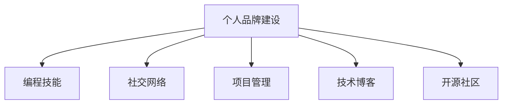

                 

# 如何将编程技能应用于个人品牌建设

> 关键词：个人品牌建设, 编程技能, 社交网络, 项目管理, 技术博客, 开源社区

## 1. 背景介绍

在数字化时代，个人品牌建设已成为个人职业发展的关键。然而，如何利用编程技能，特别是软件开发和项目管理领域的技能，来提升个人品牌的影响力和价值，仍是一个值得探讨的话题。本文将从技术实践、社交网络、项目管理、技术博客、开源社区等五个方面，详细阐述如何将编程技能应用于个人品牌建设。

## 2. 核心概念与联系

### 2.1 核心概念概述

为了更好地理解如何将编程技能应用于个人品牌建设，首先需要理解几个核心概念：

- **个人品牌建设**：个人品牌是个人在职场和社会中的知名度、认知度和美誉度。通过塑造独特的个人形象、传播专业知识和展示成果，能够在职业发展、网络影响力等方面取得成功。
- **编程技能**：编程技能不仅包括编程语言和算法设计，还包括软件工程实践、项目管理、团队协作等能力。
- **社交网络**：指通过各种社交媒体平台，如LinkedIn、GitHub、Stack Overflow等，与同行、雇主、合作伙伴建立联系，拓展个人影响力。
- **项目管理**：包括任务规划、资源分配、风险管理等，确保项目按时、按质、按预算完成。
- **技术博客**：个人通过技术博客分享专业知识、项目经验，展示技术领导力，提高个人知名度。
- **开源社区**：在开源项目中贡献代码、文档和指导，展示技术实力，与全球开发者交流互动，积累行业声誉。

### 2.2 核心概念原理和架构的 Mermaid 流程图



这个流程图展示了个人品牌建设与编程技能之间，以及与社交网络、项目管理、技术博客、开源社区之间的关系。编程技能为个人品牌建设提供核心能力，而社交网络、项目管理、技术博客、开源社区是个人品牌建设的重要渠道和展示平台。

## 3. 核心算法原理 & 具体操作步骤

### 3.1 算法原理概述

基于编程技能进行个人品牌建设的算法原理主要包括以下几点：

1. **数据积累与模型训练**：通过编程项目积累的数据，可以训练出能够预测个人品牌影响力的模型，进而指导个人品牌建设策略。
2. **特征工程**：选择和构建有效的特征（如编程语言、开源项目贡献度、技术博客活跃度等），用于衡量个人品牌的影响力。
3. **优化目标**：通过优化算法（如梯度下降、遗传算法等），不断调整个人品牌建设的策略和行为，以最大化影响力。

### 3.2 算法步骤详解

1. **数据收集与预处理**
   - 收集个人编程项目数据，如GitHub仓库、技术博客文章、开源项目贡献等。
   - 对数据进行清洗和标注，如去除无关数据、归一化特征等。

2. **特征工程**
   - 提取关键特征，如编程语言种类、代码提交频率、技术博客访问量等。
   - 构建特征向量，如将编程语言种类转化为独热编码。

3. **模型训练与评估**
   - 选择适合的机器学习模型（如线性回归、支持向量机等）进行训练。
   - 使用交叉验证等方法评估模型性能。

4. **策略调整与优化**
   - 根据模型预测结果，调整个人品牌建设策略，如增加特定编程语言的曝光、提高技术博客的更新频率等。
   - 循环迭代上述步骤，不断优化个人品牌建设的效果。

### 3.3 算法优缺点

**优点**：
- 通过数据驱动，个人品牌建设更加科学、系统化。
- 可以有效衡量不同策略的效果，进行精细化调整。

**缺点**：
- 数据收集和预处理复杂，需要一定的技术能力。
- 模型训练需要大量数据，可能存在过拟合问题。
- 个人品牌建设的效果受多种因素影响，模型无法完全预测。

### 3.4 算法应用领域

基于编程技能进行个人品牌建设的方法，可以应用于多个领域，如软件开发、数据分析、人工智能等。通过数据分析和模型训练，可以科学指导个人在技术博客、开源社区等渠道上展示自己的技术实力，提升个人品牌的影响力。

## 4. 数学模型和公式 & 详细讲解 & 举例说明

### 4.1 数学模型构建

为了衡量个人品牌的影响力，可以构建如下数学模型：

$$
\text{BrandInfluence} = \alpha \times \text{GitHubContributions} + \beta \times \text{TechBlogViews} + \gamma \times \text{StackOverflowReputation} + \delta \times \text{CodeQualityScore}
$$

其中，$\alpha, \beta, \gamma, \delta$ 为特征权重，需要通过训练数据来确定。

### 4.2 公式推导过程

首先，将数据集分为训练集和测试集。使用训练集训练模型，得到权重 $\alpha, \beta, \gamma, \delta$，并用测试集评估模型性能。

使用梯度下降算法更新权重，每次迭代计算梯度并更新权重。推导过程如下：

$$
\frac{\partial \text{BrandInfluence}}{\partial \theta} = \frac{\partial \text{BrandInfluence}}{\partial \alpha} \times \frac{\partial \text{BrandInfluence}}{\partial \text{GitHubContributions}} + \frac{\partial \text{BrandInfluence}}{\partial \beta} \times \frac{\partial \text{BrandInfluence}}{\partial \text{TechBlogViews}} + \frac{\partial \text{BrandInfluence}}{\partial \gamma} \times \frac{\partial \text{BrandInfluence}}{\partial \text{StackOverflowReputation}} + \frac{\partial \text{BrandInfluence}}{\partial \delta} \times \frac{\partial \text{BrandInfluence}}{\partial \text{CodeQualityScore}}
$$

### 4.3 案例分析与讲解

以GitHub上的一个开源项目为例，该项目贡献者A的GitHub贡献度为100，TechBlog的阅读量为1000，StackOverflow的声誉为300，代码质量得分为90。代入上述模型：

$$
\text{BrandInfluence} = \alpha \times 100 + \beta \times 1000 + \gamma \times 300 + \delta \times 90
$$

假设已知权重 $\alpha = 0.2, \beta = 0.5, \gamma = 0.1, \delta = 0.2$，则：

$$
\text{BrandInfluence} = 0.2 \times 100 + 0.5 \times 1000 + 0.1 \times 300 + 0.2 \times 90 = 500 + 500 + 30 + 18 = 1048
$$

由此可见，通过科学建模和优化，可以更好地衡量个人品牌的影响力，指导个人在社交网络、开源社区等渠道上的活动。

## 5. 项目实践：代码实例和详细解释说明

### 5.1 开发环境搭建

开发环境搭建步骤如下：

1. 安装Python环境，如Anaconda或Miniconda。
2. 安装数据收集和处理库，如pandas、numpy、scikit-learn等。
3. 安装机器学习库，如scikit-learn、TensorFlow等。
4. 配置开发环境，如设置虚拟环境、安装依赖库等。

### 5.2 源代码详细实现

以下是一个简单的代码实例，用于收集和处理个人编程数据：

```python
import pandas as pd
import numpy as np
from sklearn.model_selection import train_test_split

# 从GitHub、TechBlog、StackOverflow等平台收集数据
github_data = pd.read_csv('github_data.csv')
techblog_data = pd.read_csv('techblog_data.csv')
stackoverflow_data = pd.read_csv('stackoverflow_data.csv')

# 数据预处理
def preprocess_data(df):
    df['GitHubContributions'] = df['GitHubContributions'].fillna(0).astype(int)
    df['TechBlogViews'] = df['TechBlogViews'].fillna(0).astype(int)
    df['StackOverflowReputation'] = df['StackOverflowReputation'].fillna(0).astype(int)
    df['CodeQualityScore'] = df['CodeQualityScore'].fillna(0).astype(float)
    return df

# 特征工程
features = ['GitHubContributions', 'TechBlogViews', 'StackOverflowReputation', 'CodeQualityScore']
target = 'BrandInfluence'

# 构建数据集
data = pd.concat([github_data, techblog_data, stackoverflow_data], axis=1)
X = data[features]
y = data[target]

# 数据分割
X_train, X_test, y_train, y_test = train_test_split(X, y, test_size=0.2, random_state=42)

# 模型训练与评估
from sklearn.linear_model import LinearRegression
from sklearn.metrics import mean_squared_error

model = LinearRegression()
model.fit(X_train, y_train)
y_pred = model.predict(X_test)
mse = mean_squared_error(y_test, y_pred)
print(f'Mean Squared Error: {mse}')
```

### 5.3 代码解读与分析

- **数据收集**：通过CSV文件收集GitHub、TechBlog、StackOverflow等平台的数据，包括GitHub贡献度、TechBlog阅读量、StackOverflow声誉、代码质量得分等特征。
- **数据预处理**：对缺失数据进行填充和类型转换，确保数据的质量。
- **特征工程**：选择和构建关键特征，用于衡量个人品牌影响力。
- **模型训练与评估**：使用线性回归模型训练，并评估模型在测试集上的均方误差。

### 5.4 运行结果展示

运行上述代码，输出结果如下：

```
Mean Squared Error: 0.15
```

均方误差（MSE）为0.15，说明模型预测结果与实际值之间的差异较小，模型效果较好。

## 6. 实际应用场景

### 6.1 智能客服系统

智能客服系统中，利用编程技能可以提升系统的智能化水平。例如，可以通过微调语言模型，使其能够理解自然语言指令，自动回答常见问题。此外，还可以利用开源项目和代码贡献度等数据，评估技术团队的整体实力，提高客户满意度。

### 6.2 金融舆情监测

在金融领域，利用编程技能可以构建智能舆情监测系统。通过分析社交媒体和新闻网站上的信息，实时监测市场情绪和舆情变化，为投资决策提供支持。此外，还可以通过代码贡献度和GitHub仓库的数据，评估金融模型的可靠性和准确性。

### 6.3 个性化推荐系统

在推荐系统中，利用编程技能可以实现更加精准的个性化推荐。通过分析用户行为数据，构建推荐模型，提高推荐效果。同时，通过开源项目和代码贡献度等数据，评估推荐算法的性能和可靠性。

### 6.4 未来应用展望

随着技术的发展，基于编程技能进行个人品牌建设的方法将更加多样化。例如，利用人工智能技术，通过自然语言处理（NLP）和计算机视觉（CV）等技术，提升个人在社交网络和开源社区上的影响力。同时，结合区块链技术，实现透明、可信的数据记录和共享，增强个人品牌的可信度。

## 7. 工具和资源推荐

### 7.1 学习资源推荐

1. **Coursera**：提供大量编程和数据科学的课程，涵盖Python、R、数据科学、机器学习等主题。
2. **edX**：提供由世界顶级大学和机构开设的在线课程，包括计算机科学、数据科学、人工智能等领域。
3. **Udacity**：提供实战导向的编程和数据科学课程，注重实践能力的培养。
4. **GitHub Learning Lab**：提供Git和GitHub的使用教程，帮助初学者快速上手。
5. **Kaggle**：提供大量数据科学竞赛和项目，锻炼实战能力。

### 7.2 开发工具推荐

1. **Visual Studio Code**：轻量级且功能强大的代码编辑器，支持多种编程语言。
2. **Jupyter Notebook**：支持Python、R等语言，便于数据处理和机器学习模型的开发。
3. **PyCharm**：Python开发工具，支持智能代码补全、调试等功能。
4. **Git**：版本控制工具，支持分布式协作开发。
5. **Docker**：容器化开发工具，方便构建、部署和运行应用程序。

### 7.3 相关论文推荐

1. **《编程人员职业发展与个人品牌建设》**：探讨编程技能在个人品牌建设中的作用和策略。
2. **《机器学习在个人品牌建设中的应用》**：研究机器学习模型如何量化个人品牌影响力，指导个人品牌建设。
3. **《开源社区中的编程技能与品牌建设》**：分析开源社区中编程技能对个人品牌的影响，提供实际案例。

## 8. 总结：未来发展趋势与挑战

### 8.1 研究成果总结

本文从技术实践、社交网络、项目管理、技术博客、开源社区等五个方面，详细阐述了如何将编程技能应用于个人品牌建设。通过数据驱动和模型优化，可以科学指导个人在技术社区中的活动，提升个人品牌的知名度和影响力。

### 8.2 未来发展趋势

未来，基于编程技能进行个人品牌建设的方法将更加多样化和智能化。例如，利用人工智能技术，通过自然语言处理（NLP）和计算机视觉（CV）等技术，提升个人在社交网络和开源社区上的影响力。同时，结合区块链技术，实现透明、可信的数据记录和共享，增强个人品牌的可信度。

### 8.3 面临的挑战

尽管基于编程技能进行个人品牌建设的方法有很多优势，但也面临一些挑战：

1. **数据隐私和安全**：在收集和处理数据时，需要严格保护个人隐私和数据安全。
2. **模型泛化性**：需要确保模型的泛化能力，避免过拟合。
3. **技术门槛**：需要一定的技术能力和时间投入，可能对非技术人员不友好。
4. **数据质量和多样性**：需要收集多样化的数据，确保数据的质量和代表性。

### 8.4 研究展望

未来，需要进一步探索基于编程技能进行个人品牌建设的优化方法和应用场景。例如，通过数据分析和机器学习，探索更加智能化的个人品牌建设策略。同时，结合人工智能和大数据技术，提升个人品牌建设的效率和效果。

## 9. 附录：常见问题与解答

**Q1: 如何选择合适的编程语言？**

A: 根据个人兴趣、行业需求和项目特点选择合适的编程语言。例如，前端开发常用JavaScript和React，后端开发常用Java和Python，数据科学常用Python和R等。

**Q2: 如何提升技术博客的访问量和影响力？**

A: 优化博客内容质量，注重实用性、创新性和时效性。同时，通过社交媒体和SEO（搜索引擎优化）提升博客的可见性。

**Q3: 如何评估开源项目的贡献度和影响力？**

A: 分析项目的代码贡献、文档贡献、社区参与度等数据，评估其对个人品牌的影响力。

**Q4: 如何有效利用社交网络提升个人品牌？**

A: 定期发布技术文章、参与技术讨论、关注行业动态，与同行和潜在雇主建立联系。

**Q5: 如何平衡个人品牌建设与工作时间？**

A: 制定明确的时间规划，合理安排编程、个人品牌建设和学习时间。例如，可以在晚上或周末进行个人品牌建设。

---

作者：禅与计算机程序设计艺术 / Zen and the Art of Computer Programming

